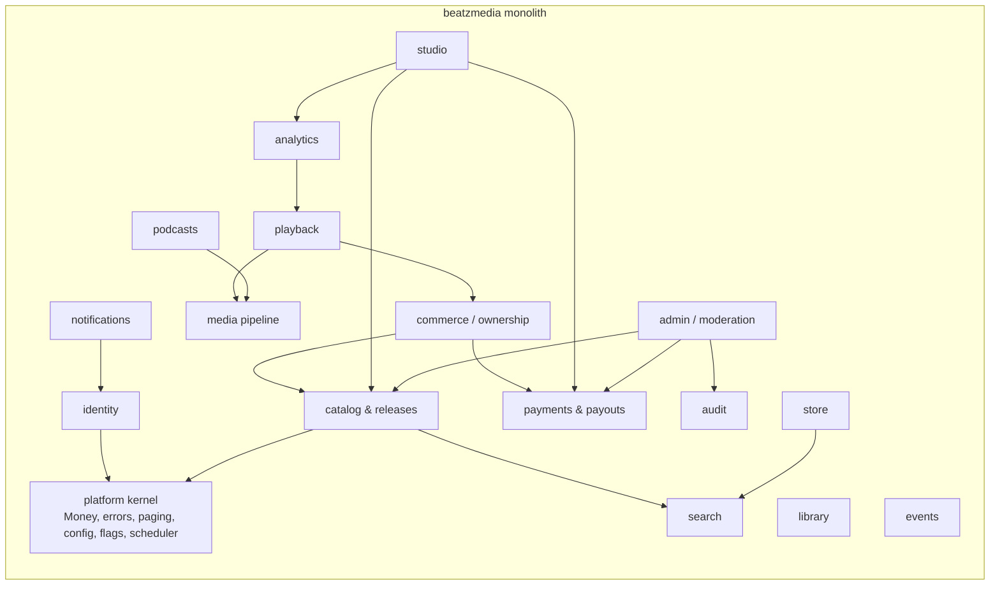
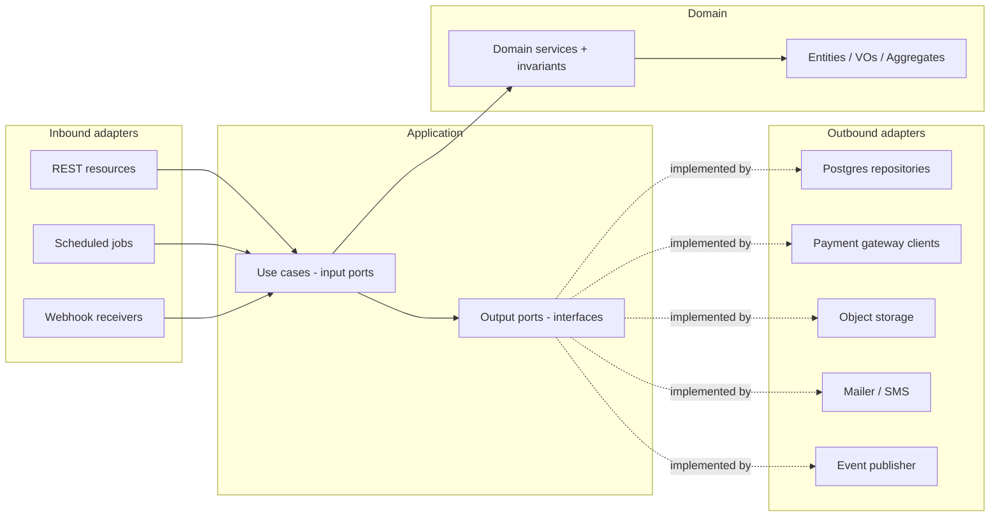
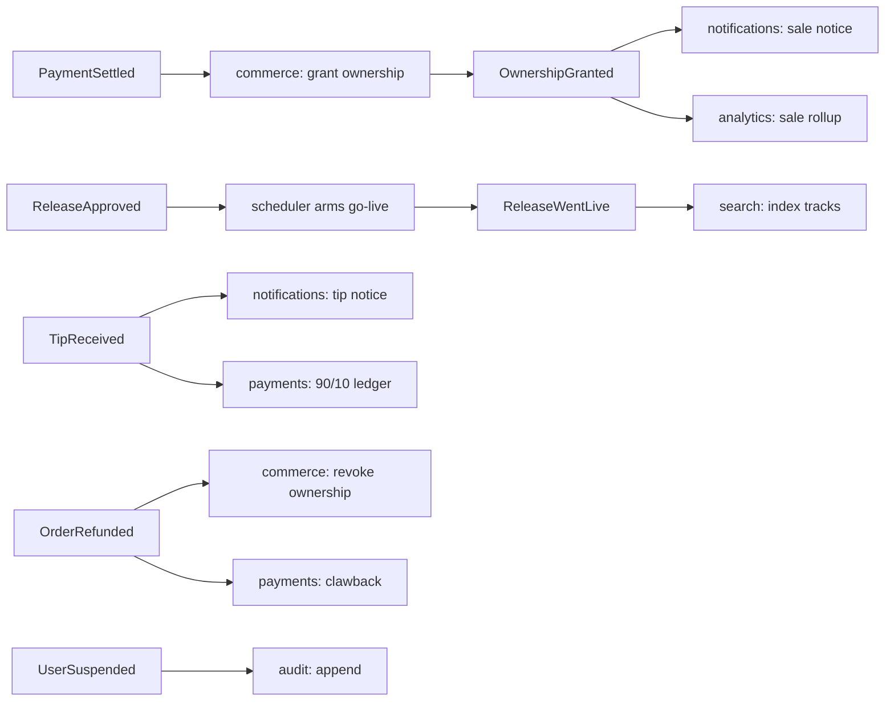
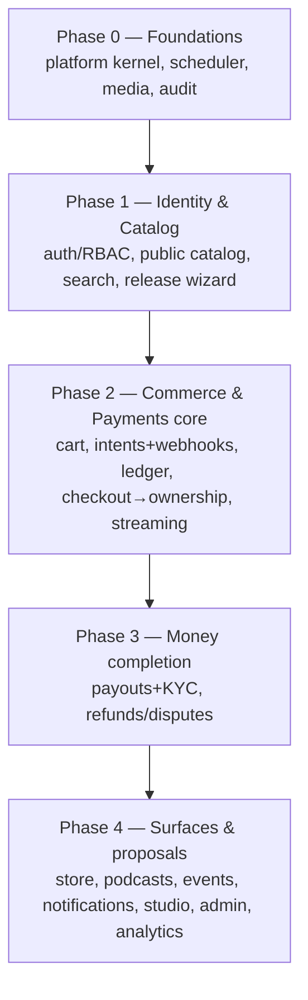

# BeatzClik Backend — System Architecture

> **Scope:** whole-system architecture for the `beatzmedia` Quarkus monolith. **PRD source:**
> `BACKEND-PRD.md` §4–§5, §8. Read this before any module ADD.

## 1. Architectural style at a glance

- **Deployment shape:** a **single deployable monolith** (one Quarkus app, one container image), not
  microservices. Horizontal scale = run more identical stateless instances behind a load balancer.
- **Internal structure:** **modular monolith** — one module per **bounded context**, each built with
  **Hexagonal (Ports & Adapters)** layering. Modules talk **in-process** (synchronous input ports +
  asynchronous CDI domain events); **no module reads another module's tables.**
- **Language/runtime:** Java 25, Quarkus 3.36.x (see ADR-10 for the version history).
- **Data:** PostgreSQL with Flyway migrations; money stored in **integer minor units (pesewas)**.
- **Media:** S3-compatible object storage (MinIO locally); audio transcoded to HLS with a server-side
  **30-second preview** rendition.
- **Auth:** stateless Bearer JWT; roles `fan`/`artist` plus admin scopes.

## 2. C4 — System context

```mermaid
flowchart TB
  fan([Fan])
  creator([Creator / Artist])
  admin([Admin / Ops])
  subgraph BeatzClik
    fe[Frontend SPA<br/>React + TanStack]
    be[beatzmedia backend<br/>Quarkus monolith]
  end
  momo[[MoMo providers<br/>MTN / Telecel / AirtelTigo]]
  card[[Card / Bank gateway]]
  s3[[(Object storage<br/>S3 / MinIO)]]
  smtp[[Email / SMS]]
  db[(PostgreSQL)]

  fan --> fe
  creator --> fe
  admin --> fe
  fe -->|HTTPS REST /v1 + Bearer JWT| be
  be --> db
  be --> s3
  be -->|charge / payout / webhooks| momo
  be -->|charge / refund| card
  be -->|notify| smtp
  momo -->|async webhook| be
```

The frontend is already built; the backend implements `API-CONTRACT.md` so the SPA swaps its mock
`getX()` calls for real endpoints **with no visual change**.

## 3. C4 — Container / module map



Module ownership and per-module detail live in `architecture/<module>.md`. The mapping of bounded
contexts → modules → owned tables is in PRD §4.2 and each ADD §7.

## 4. Hexagonal layering (applies to every module)



**Dependency rule (build-enforced via ArchUnit):** `adapters → application → domain`. Domain imports
**no framework** (no Jakarta/Quarkus/Hibernate annotations on domain types — use separate JPA entities
or mapped records in the persistence adapter). Application imports only domain. Inbound and outbound
adapters never import each other. Violations fail CI (see `sdlc/testing-strategy.md`).

### Package layout per module

```
org.shakvilla.beatzmedia.<module>
├── domain            // pure: entities, value objects, aggregates, domain services, invariants
├── application
│   ├── port.in       // use-case interfaces (input ports)
│   └── port.out      // repository/gateway/clock/id interfaces (output ports)
└── adapter
    ├── in.rest       // Quarkus REST resources, request/response DTOs, mappers
    ├── in.job        // @Scheduled triggers, webhook receivers
    └── out
        ├── persistence  // Panache repositories + JPA entities + mappers
        └── integration  // REST clients (MoMo/card), S3, mailer/SMS, event publisher
```

## 5. Cross-module communication

Two mechanisms only:

1. **Synchronous input-port calls** for request-time orchestration where a result is needed now —
   e.g. `commerce` calling `payments.InitiateChargeUseCase` during checkout. The caller depends on the
   callee's `port.in` interface, never its internals or tables.
2. **Asynchronous CDI domain events** for side effects — published with
   `jakarta.enterprise.event.Event<T>` and consumed via `@Observes(during = AFTER_SUCCESS)`. Used for
   fan-out where eventual consistency is acceptable.

### Canonical domain events



Event names (payload = ids + minimal denormalized snapshot, never JPA entities): `AccountRegistered`,
`ArtistUpgraded`, `ArtistVerified`, `PaymentSettled`, `PaymentFailed`, `OwnershipGranted`,
`OrderRefunded`, `ReleaseApproved`, `ReleaseWentLive`, `EpisodePublished`, `TipReceived`,
`WithdrawalRequested`, `PayoutSent`, `DisputeOpened`, `ContentTakenDown`, `UserSuspended`,
`PlayRecorded`. Handlers must be **idempotent** (events may be redelivered after retries).

## 6. Technology stack & Quarkus extensions

| Concern | Choice | Quarkus extension(s) |
|---|---|---|
| Inbound REST/JSON | Quarkus REST (RESTEasy Reactive) | `quarkus-rest`, `quarkus-rest-jackson` |
| Outbound HTTP (providers) | REST client | `quarkus-rest-client-jackson` |
| Persistence | Hibernate ORM + Panache | `quarkus-hibernate-orm-panache`, `quarkus-jdbc-postgresql` |
| Migrations | Flyway | `quarkus-flyway` |
| Validation | Bean Validation | `quarkus-hibernate-validator` |
| Auth | JWT (or OIDC for social) | `quarkus-smallrye-jwt`, `quarkus-smallrye-jwt-build` |
| API docs | OpenAPI | `quarkus-smallrye-openapi` |
| Health | Health checks | `quarkus-smallrye-health` |
| Metrics/Tracing | Micrometer + OTel | `quarkus-micrometer-registry-prometheus`, `quarkus-opentelemetry` |
| Scheduling | Cron/interval jobs | `quarkus-scheduler` |
| Email | Mailer | `quarkus-mailer` |
| Object storage | S3 / MinIO | `quarkus-amazon-s3` (or MinIO client) |
| Cache / rate-limit (optional) | Redis | `quarkus-redis-client` |
| Testing | JUnit5 + REST-assured + Testcontainers + ArchUnit | `quarkus-junit5`, `rest-assured`, `quarkus-test-*` |

Add extensions incrementally per work unit; the scaffold already has `quarkus-rest`,
`quarkus-rest-jackson`, `quarkus-rest-client-jackson`, `quarkus-smallrye-openapi`, `quarkus-arc`.

## 7. Runtime topology (local & prod)

Local is Docker Compose (PRD §5.1): `db` (Postgres), `app` (beatzmedia), `objectstore` (MinIO) +
bucket-init, `mail` (Mailpit), `sms` (capture stub), `transcoder` (ffmpeg), optional `cache` (Redis).
Production is the same image plus managed Postgres + S3; all config via environment variables;
`quarkus.flyway.migrate-at-start=true`; `/q/health/{live,ready}` back orchestrator probes. See
`cross-cutting/observability.md` and `sdlc/environments-and-deployment.md`.

## 8. System-wide build order (for agents)

Follow PRD §8.1. Summary dependency phases:



Hard rules the order encodes: identity + persistence foundations before commerce; payment charging
before ledger; ledger before payouts; checkout/ownership before playback unlock and before refunds;
analytics rollups before insight reads; audit + RBAC before any admin mutation.

## 9. Architecture decision records (key, already taken)

| # | Decision | Rationale | PRD ref |
|---|---|---|---|
| ADR-1 | Modular monolith, not microservices | Single team velocity, transactional integrity for money/ownership, simpler ops | §4 |
| ADR-2 | Hexagonal layering, framework-free domain | Testability, swap adapters (e.g. MoMo provider, search backend) without touching domain | §4.1 |
| ADR-3 | Money in integer minor units | Avoids float rounding errors across split/discount/fee math | INV-11 |
| ADR-4 | Ownership granted only on settlement | Protects buy-to-own revenue; MoMo is async | INV-1 |
| ADR-5 | Server-side 30s preview rendition | Preview cannot be bypassed by the client | INV-3 |
| ADR-6 | Double-entry ledger | Auditable, balanced money movement; reconciliation | INV-6 |
| ADR-7 | In-process events, not a broker (v1) | Lower ops cost in a monolith; can externalize later | §4.4 |
| ADR-8 | Postgres FTS/`pg_trgm` for search (v1) | No extra infra; behind `SearchIndex` port for later swap | OQ-12 |
| ADR-9 | Dockerfile.jvm pins UBI base to a specific rebuild tag | `ubi9/openjdk-25-runtime:1.24` is a floating tag; pinning to the dated build suffix (e.g. `1.24-2.1781533370`) ensures reproducible builds and picks up the latest OS security patches at pin-time. Trivy scan on `1.24-2.1781533370` (2026-06-15 rebuild) shows 0 fixable HIGH/CRITICAL CVEs. Update the pin when a new patch rebuild or minor version is published. No `.trivyignore` needed as of 2026-06-22. | Phase 0 bootstrap |
| ADR-10 | Adopt Quarkus 3.36.3 (skip 3.34.x stream) at bootstrap | Driver: CVE-2026-39852 in `quarkus-vertx-http` has no fix in the 3.34.x stream (advisory lists 3.20.6.1, 3.27.3.1, 3.33.1.1, and 3.35.1.1 as the minimum patched releases). Additionally, Netty 4.1.132.Final (shipped by 3.34.3) carries 9 HIGH/CRITICAL CVEs (netty-codec, netty-codec-dns, netty-codec-haproxy, netty-codec-http, netty-handler, netty-resolver-dns); fixed in Netty 4.1.135.Final. Decision: adopt Quarkus 3.36.3, the latest stable LTS-aligned release available on Maven Central as of 2026-06-22, which ships `quarkus-vertx-http` 3.36.3 (>3.35.1.1, CVE-2026-39852 cleared) and Netty 4.1.135.Final (all 9 CVEs cleared). No business code exists yet, so the migration cost is zero. Consequence: lowest-debt path forward; no `.trivyignore` suppression needed; all transitive HIGH/CRITICAL fixable CVEs cleared. The CLAUDE.md toolchain line and all docs are updated to reflect 3.36.x. | Phase 0 bootstrap |

| ADR-11 | In-process ManagedExecutor for audio transcode (WU-MED-1) | The ADD permits "TranscodeJobPort → in-process queue". Using MicroProfile ManagedExecutor (quarkus-smallrye-context-propagation) avoids introducing a separate Compose `transcoder` service while keeping the job off the request thread. The worker calls `MediaApplicationService.handleTranscodeResult` which persists the outcome in its own `@Transactional` unit and fires the `MediaReady` CDI event. | ADD §4.2, WU-MED-1 decision 1 |
| ADR-12 | ffmpeg via ProcessBuilder shell-out (WU-MED-1) | `AudioTranscoderPort` adapter downloads the S3 original to a temp file, runs ffprobe (duration probe) and ffmpeg (HLS transcode + ≤30s preview clip) via ProcessBuilder, uploads the segments, and cleans up. This keeps the adapter simple and testable (easily replaced with a different transcoder). | ADD §5.2, WU-MED-1 decision 2 |
| ADR-13 | Static ffmpeg in JVM image via multi-stage Docker copy from `mwader/static-ffmpeg` (WU-MED-1) | UBI9 (the `openjdk-25-runtime` base) does not carry ffmpeg in its default content sets; `microdnf install ffmpeg` fails without extra repo configuration. Instead, a two-stage Dockerfile copies the statically-linked `/ffmpeg` and `/ffprobe` binaries from `mwader/static-ffmpeg:7.1.1` into `/usr/local/bin`. No RPM repos, no build toolchain, and the resulting layer adds ~110 MB (static binary). The version pin `7.1.1` must be updated when a new upstream release is needed. | ADD §5.2, WU-MED-1 decision 2, Dockerfile.jvm |
| ADR-14 | AWS SDK v2 (`software.amazon.awssdk:s3`) for S3/MinIO (WU-MED-1) | `quarkus-amazon-s3` extension exists but re-exposes the same AWS SDK v2 artifacts. We depend directly on `software.amazon.awssdk:s3` managed via the AWS SDK BOM (2.31.49) so the version is explicit, consistent, and not subject to quarkus-extension wiring. `S3Client` and `S3Presigner` are produced as `@Singleton` CDI beans in `S3ClientProducer` with path-style access enabled (required by MinIO). | ADD §5.2, WU-MED-1 decision 3 |

| ADR-15 | Committed dev/test JWT keypair — accepted risk with mandatory prod override | `backend/src/main/resources/jwt/dev-private.pem` and `dev-public.pem` are committed to the repo. These are a **throwaway dev/test-only keypair** with zero monetary or personal-data value; they are used solely to allow the Quarkus app and unit/integration tests to boot without external key material. **Risk acceptance:** (1) The keypair is clearly named `dev-*` and documented here as non-prod. (2) CI secret-scanning (GitHub secret-scanning, trufflehog) passed on this file in PR #9 because the key is not a credential to any real system. (3) Any token signed with this key is invalid in production because production uses different key material. **Mandatory production control:** `BEATZ_JWT_PRIVATE_KEY_LOCATION` and `BEATZ_JWT_PUBLIC_KEY_LOCATION` environment variables **MUST** be set in every deployed environment (staging, production) to point at env-injected keys (managed secret / KMS-backed). The `application.properties` already wires these env vars with the classpath dev keys as fallback. The committed dev keypair **must never be deployed** and **must never be used** to sign tokens in any deployed environment. If a new developer inadvertently sets production to use the classpath fallback, monitoring on JWT `iss`/`aud` claims or a key-ID (`kid`) header check will detect it. Action: rotate if the key is ever used to sign a real user token; consider adding a CI step asserting `BEATZ_JWT_PRIVATE_KEY_LOCATION` is set in the prod deploy workflow. | M-2, security-reviewer review of WU-MED-1 PR #11 |

| ADR-17 | Modules may inject `audit.application.port.out.AuditWriter` directly to satisfy INV-10 (WU-IDN-4) | INV-10 requires every privileged mutation to append exactly one `AuditEntry` atomically with the state change. WU-IDN-4's admin-team services (`InviteAdminService`, `ChangeAdminRoleService`, `RemoveAdminService`) call `AuditWriter.append()` inside their own `@Transactional` boundary. `AuditWriter` is a **write-only, append-only port carrying no domain logic and reading no audit-owned state** — it is effectively a shared infrastructure sink, not a cross-module data read, so the golden rule's intent ("never read another module's tables; integrate via input port or event") is not violated. Placing it in the audit module's `port.out` (rather than a forwarding `port.in` use case) avoids an empty pass-through service for the WU-IDN-4 stub and avoids any circular dependency. **Consequence / revisit:** WU-AUD-1 (audit interceptor + read endpoint) owns the decision of whether to promote this to a proper `port.in` `RecordAuditEntry` use case once the audit application layer exists; until then, calling modules depend on the output port directly. ArchUnit's layered rules permit this (cross-module same-layer application→application). | INV-10; identity ADD §4.2 / §10; audit ADD |
| ADR-16 | Module error codes live in the shared platform `ErrorCode` enum (WU-IDN-1) | Identity-specific codes (`EMAIL_TAKEN`, `INVALID_CREDENTIALS`, `WEAK_PASSWORD`, `ACCOUNT_SUSPENDED`) were added to the platform kernel enum `org.shakvilla.beatzmedia.platform.domain.ErrorCode` rather than each module owning a private code set or its own exception mapper. Rationale: `ApiError` serializes `ErrorCode.name()` as the wire `code` field; the platform `DomainExceptionMapper` switch over `ErrorCode` is **exhaustive** (compile-time safety — adding a new code without a status mapping is a compile error); and a single shared registry guarantees wire codes are globally unique and discoverable across all modules. Per-module domain exceptions (e.g. `AuthException`) extend the kernel `DomainException` and carry one of these codes. A single platform-owned `ConstraintViolationExceptionMapper` in `platform.adapter.in.rest` normalises Bean Validation failures from **all** modules into the uniform 422 `{ error: { code, message, field } }` envelope, eliminating per-module mapper boilerplate. Consequence: new modules must add their codes to the shared enum (one-line change, compile-guarded); they do not need their own exception mappers. | API-CONTRACT §1 error envelope; identity ADD §9 error model |

| ADR-18 | Scheduler advisory lock guarantees at-most-one **concurrent** execution, not global exactly-once; cross-tick de-dup is each job's responsibility (WU-PLT-2) | The platform `SchedulerRegistry` (`adapter.out.scheduler`) guards multi-node ticks with a Postgres **session-level advisory lock** (`pg_try_advisory_lock` held on a dedicated JDBC connection for the duration of `runOnce()`, released via `pg_advisory_unlock` + connection close in `LockHandle.close()`). This provides **mutual exclusion**: while one node holds the lock and runs a job, every other node's `tryAcquire` returns false and skips. It does **not** provide global "exactly-once-for-all-time": the lock is released as soon as the job finishes, so two nodes whose `@Scheduled` ticks are skewed by **more than the job's runtime** can each legitimately run the job in sequence (node A finishes a 50 ms job and releases; node B's tick fires 200 ms later and acquires the now-free lock). This is by design — `concurrentExecution = SKIP` + advisory lock cover *overlapping* runs across the JVM and the cluster; **each `ScheduledJob` must itself be idempotent / safe to re-run** (conditional state transitions, upsert-by-key, dedupe on a tick window), as the `SchedulerRegistry` javadoc states. **Evidence / why this ADR exists:** `SchedulerRegistryIT.registry_jobRunsExactlyOnce_underConcurrentThreads` was flaky locally (passed on CI). A diagnostic run proved the lock never doubly grants — the extra job runs came from late-arriving threads acquiring **after** the winner released, because the test's fresh-connection-per-call `DataSource` made `getConnection()` latency (76–265 ms on macOS Docker Desktop vs a few ms on native-Linux CI) exceed the winner's 50 ms hold window. The fix was test-only: the winner now holds the lock until every node has completed its acquire attempt, deterministically forcing genuine contention so exactly one node ever sees the lock free — independent of connection-setup jitter. No production scheduler code changed. **Consequence / revisit:** jobs that are not naturally idempotent and must not double-fire across skewed ticks (e.g. a future non-idempotent `catalog.go-live` publish under LLFR-PLATFORM-01.2) need a stronger primitive — a persisted "last successful tick" row / leader lease with a hold period, or a unique constraint on the side effect — layered on top of the advisory lock. | ADD §5.2; LLFR-PLATFORM-01.2; WU-PLT-2 (PR #19); `SchedulerRegistry` javadoc |

New ADRs are appended here by agents when they make a structural decision (see
`sdlc/agent-workflow.md`).
