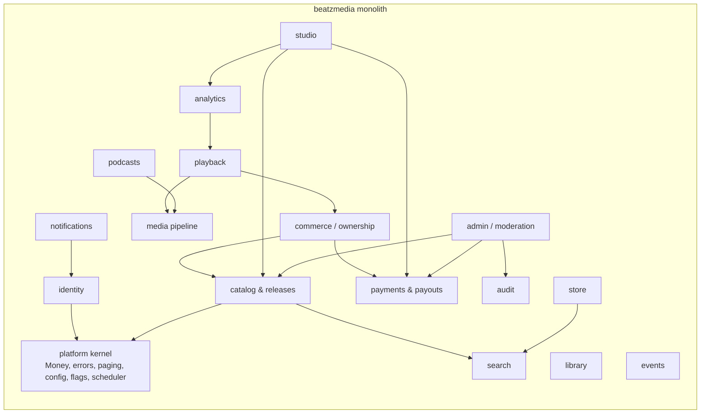
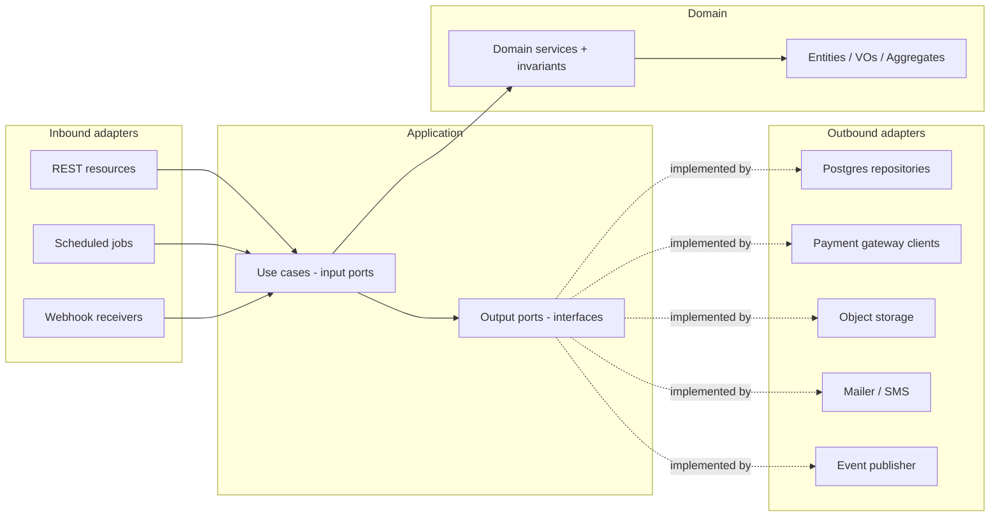
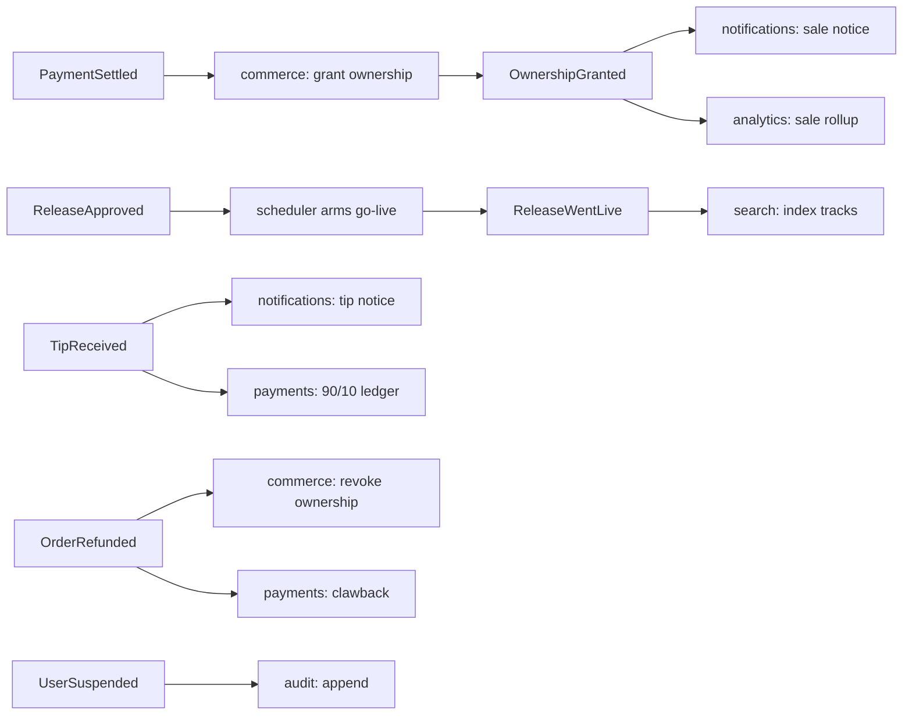
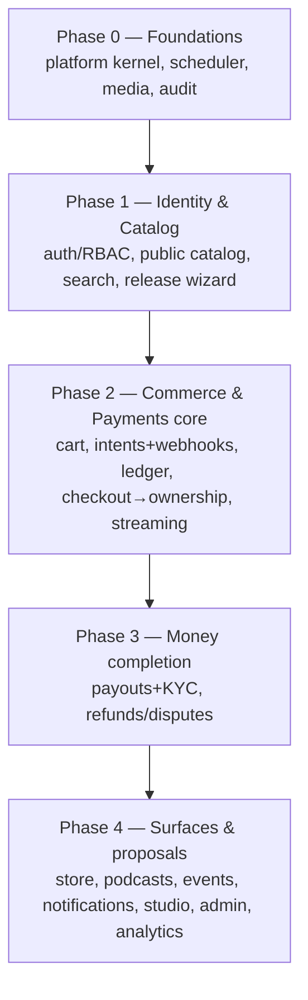

# BeatzClik Backend — System Architecture

> **Scope:** whole-system architecture for the `beatzmedia` Quarkus monolith. **PRD source:**
> `BACKEND-PRD.md` §4–§5, §8. Read this before any module ADD.

## 1. Architectural style at a glance

- **Deployment shape:** a **single deployable monolith** (one Quarkus app, one container image), not
  microservices. Horizontal scale = run more identical stateless instances behind a load balancer.
- **Internal structure:** **modular monolith** — one module per **bounded context**, each built with
  **Hexagonal (Ports & Adapters)** layering. Modules talk **in-process** (synchronous input ports +
  asynchronous CDI domain events); **no module reads another module's tables.**
- **Language/runtime:** Java 25, Quarkus 3.36.x (see ADR-10 for the version history).
- **Data:** PostgreSQL with Flyway migrations; money stored in **integer minor units (pesewas)**.
- **Media:** S3-compatible object storage (MinIO locally); audio transcoded to HLS with a server-side
  **30-second preview** rendition.
- **Auth:** stateless Bearer JWT; roles `fan`/`artist` plus admin scopes.

## 2. C4 — System context

```mermaid
flowchart TB
  fan([Fan])
  creator([Creator / Artist])
  admin([Admin / Ops])
  subgraph BeatzClik
    fe[Frontend SPA<br/>React + TanStack]
    be[beatzmedia backend<br/>Quarkus monolith]
  end
  momo[[MoMo providers<br/>MTN / Telecel / AirtelTigo]]
  card[[Card / Bank gateway]]
  s3[[(Object storage<br/>S3 / MinIO)]]
  smtp[[Email / SMS]]
  db[(PostgreSQL)]

  fan --> fe
  creator --> fe
  admin --> fe
  fe -->|HTTPS REST /v1 + Bearer JWT| be
  be --> db
  be --> s3
  be -->|charge / payout / webhooks| momo
  be -->|charge / refund| card
  be -->|notify| smtp
  momo -->|async webhook| be
```

The frontend is already built; the backend implements `API-CONTRACT.md` so the SPA swaps its mock
`getX()` calls for real endpoints **with no visual change**.

## 3. C4 — Container / module map



Module ownership and per-module detail live in `architecture/<module>.md`. The mapping of bounded
contexts → modules → owned tables is in PRD §4.2 and each ADD §7.

## 4. Hexagonal layering (applies to every module)



**Dependency rule (build-enforced via ArchUnit):** `adapters → application → domain`. Domain imports
**no framework** (no Jakarta/Quarkus/Hibernate annotations on domain types — use separate JPA entities
or mapped records in the persistence adapter). Application imports only domain. Inbound and outbound
adapters never import each other. Violations fail CI (see `sdlc/testing-strategy.md`).

### Package layout per module

```
org.shakvilla.beatzmedia.<module>
├── domain            // pure: entities, value objects, aggregates, domain services, invariants
├── application
│   ├── port.in       // use-case interfaces (input ports)
│   └── port.out      // repository/gateway/clock/id interfaces (output ports)
└── adapter
    ├── in.rest       // Quarkus REST resources, request/response DTOs, mappers
    ├── in.job        // @Scheduled triggers, webhook receivers
    └── out
        ├── persistence  // Panache repositories + JPA entities + mappers
        └── integration  // REST clients (MoMo/card), S3, mailer/SMS, event publisher
```

## 5. Cross-module communication

Two mechanisms only:

1. **Synchronous input-port calls** for request-time orchestration where a result is needed now —
   e.g. `commerce` calling `payments.InitiateChargeUseCase` during checkout. The caller depends on the
   callee's `port.in` interface, never its internals or tables.
2. **Asynchronous CDI domain events** for side effects — published with
   `jakarta.enterprise.event.Event<T>` and consumed via `@Observes(during = AFTER_SUCCESS)`. Used for
   fan-out where eventual consistency is acceptable.

### Canonical domain events



Event names (payload = ids + minimal denormalized snapshot, never JPA entities): `AccountRegistered`,
`ArtistUpgraded`, `ArtistVerified`, `PaymentSettled`, `PaymentFailed`, `OwnershipGranted`,
`OrderRefunded`, `ReleaseApproved`, `ReleaseWentLive`, `EpisodePublished`, `TipReceived`,
`WithdrawalRequested`, `PayoutSent`, `DisputeOpened`, `ContentTakenDown`, `UserSuspended`,
`PlayRecorded`. Handlers must be **idempotent** (events may be redelivered after retries).

## 6. Technology stack & Quarkus extensions

| Concern | Choice | Quarkus extension(s) |
|---|---|---|
| Inbound REST/JSON | Quarkus REST (RESTEasy Reactive) | `quarkus-rest`, `quarkus-rest-jackson` |
| Outbound HTTP (providers) | REST client | `quarkus-rest-client-jackson` |
| Persistence | Hibernate ORM + Panache | `quarkus-hibernate-orm-panache`, `quarkus-jdbc-postgresql` |
| Migrations | Flyway | `quarkus-flyway` |
| Validation | Bean Validation | `quarkus-hibernate-validator` |
| Auth | JWT (or OIDC for social) | `quarkus-smallrye-jwt`, `quarkus-smallrye-jwt-build` |
| API docs | OpenAPI | `quarkus-smallrye-openapi` |
| Health | Health checks | `quarkus-smallrye-health` |
| Metrics/Tracing | Micrometer + OTel | `quarkus-micrometer-registry-prometheus`, `quarkus-opentelemetry` |
| Scheduling | Cron/interval jobs | `quarkus-scheduler` |
| Email | Mailer | `quarkus-mailer` |
| Object storage | S3 / MinIO | `quarkus-amazon-s3` (or MinIO client) |
| Cache / rate-limit (optional) | Redis | `quarkus-redis-client` |
| Testing | JUnit5 + REST-assured + Testcontainers + ArchUnit | `quarkus-junit5`, `rest-assured`, `quarkus-test-*` |

Add extensions incrementally per work unit; the scaffold already has `quarkus-rest`,
`quarkus-rest-jackson`, `quarkus-rest-client-jackson`, `quarkus-smallrye-openapi`, `quarkus-arc`.

## 7. Runtime topology (local & prod)

Local is Docker Compose (PRD §5.1): `db` (Postgres), `app` (beatzmedia), `objectstore` (MinIO) +
bucket-init, `mail` (Mailpit), `sms` (capture stub), `transcoder` (ffmpeg), optional `cache` (Redis).
Production is the same image plus managed Postgres + S3; all config via environment variables;
`quarkus.flyway.migrate-at-start=true`; `/q/health/{live,ready}` back orchestrator probes. See
`cross-cutting/observability.md` and `sdlc/environments-and-deployment.md`.

## 8. System-wide build order (for agents)

Follow PRD §8.1. Summary dependency phases:



Hard rules the order encodes: identity + persistence foundations before commerce; payment charging
before ledger; ledger before payouts; checkout/ownership before playback unlock and before refunds;
analytics rollups before insight reads; audit + RBAC before any admin mutation.

## 9. Architecture decision records (key, already taken)

| # | Decision | Rationale | PRD ref |
|---|---|---|---|
| ADR-1 | Modular monolith, not microservices | Single team velocity, transactional integrity for money/ownership, simpler ops | §4 |
| ADR-2 | Hexagonal layering, framework-free domain | Testability, swap adapters (e.g. MoMo provider, search backend) without touching domain | §4.1 |
| ADR-3 | Money in integer minor units | Avoids float rounding errors across split/discount/fee math | INV-11 |
| ADR-4 | Ownership granted only on settlement | Protects buy-to-own revenue; MoMo is async | INV-1 |
| ADR-5 | Server-side 30s preview rendition | Preview cannot be bypassed by the client | INV-3 |
| ADR-6 | Double-entry ledger | Auditable, balanced money movement; reconciliation | INV-6 |
| ADR-7 | In-process events, not a broker (v1) | Lower ops cost in a monolith; can externalize later | §4.4 |
| ADR-8 | Postgres FTS/`pg_trgm` for search (v1) | No extra infra; behind `SearchIndex` port for later swap | OQ-12 |
| ADR-9 | Dockerfile.jvm pins UBI base to a specific rebuild tag | `ubi9/openjdk-25-runtime:1.24` is a floating tag; pinning to the dated build suffix (e.g. `1.24-2.1781533370`) ensures reproducible builds and picks up the latest OS security patches at pin-time. Trivy scan on `1.24-2.1781533370` (2026-06-15 rebuild) shows 0 fixable HIGH/CRITICAL CVEs. Update the pin when a new patch rebuild or minor version is published. No `.trivyignore` needed as of 2026-06-22. | Phase 0 bootstrap |
| ADR-10 | Adopt Quarkus 3.36.3 (skip 3.34.x stream) at bootstrap | Driver: CVE-2026-39852 in `quarkus-vertx-http` has no fix in the 3.34.x stream (advisory lists 3.20.6.1, 3.27.3.1, 3.33.1.1, and 3.35.1.1 as the minimum patched releases). Additionally, Netty 4.1.132.Final (shipped by 3.34.3) carries 9 HIGH/CRITICAL CVEs (netty-codec, netty-codec-dns, netty-codec-haproxy, netty-codec-http, netty-handler, netty-resolver-dns); fixed in Netty 4.1.135.Final. Decision: adopt Quarkus 3.36.3, the latest stable LTS-aligned release available on Maven Central as of 2026-06-22, which ships `quarkus-vertx-http` 3.36.3 (>3.35.1.1, CVE-2026-39852 cleared) and Netty 4.1.135.Final (all 9 CVEs cleared). No business code exists yet, so the migration cost is zero. Consequence: lowest-debt path forward; no `.trivyignore` suppression needed; all transitive HIGH/CRITICAL fixable CVEs cleared. The CLAUDE.md toolchain line and all docs are updated to reflect 3.36.x. | Phase 0 bootstrap |

New ADRs are appended here by agents when they make a structural decision (see
`sdlc/agent-workflow.md`).
