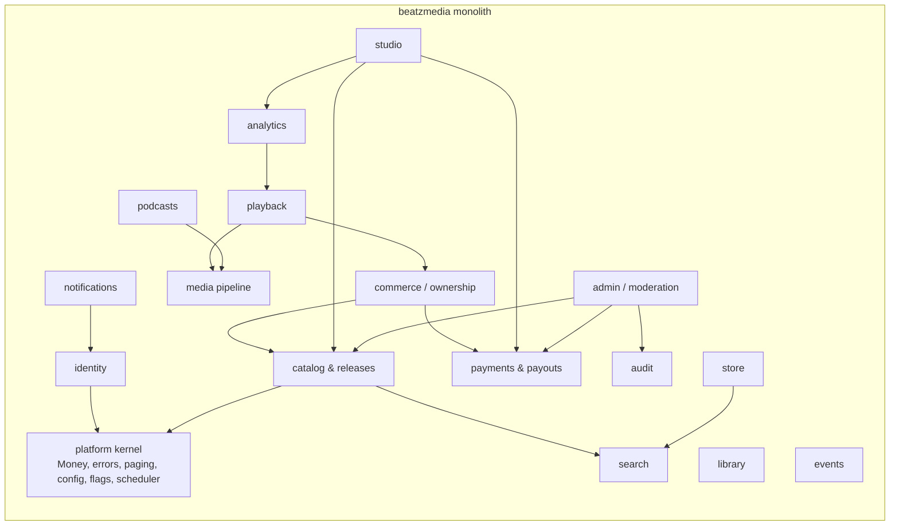
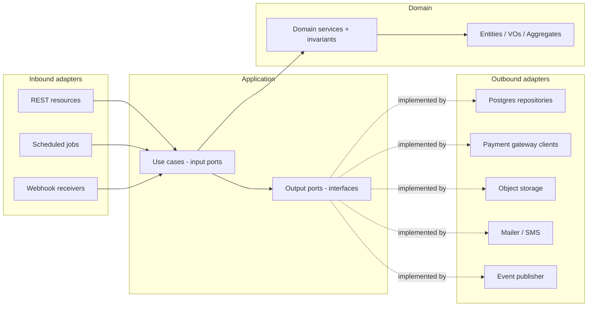
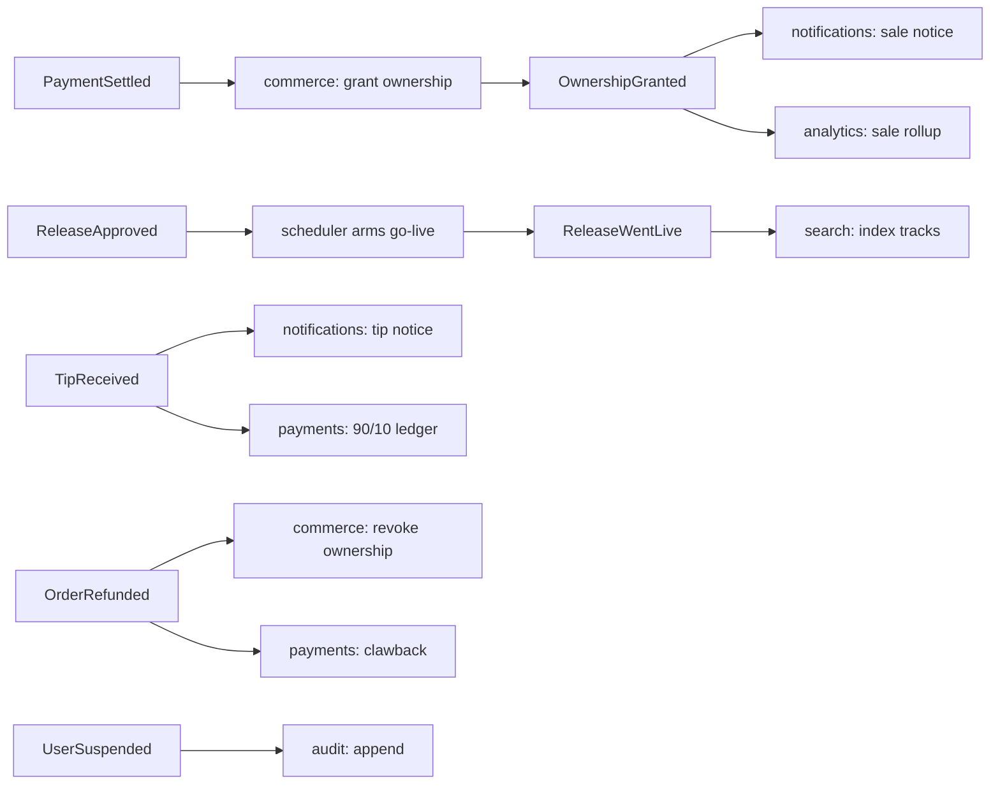
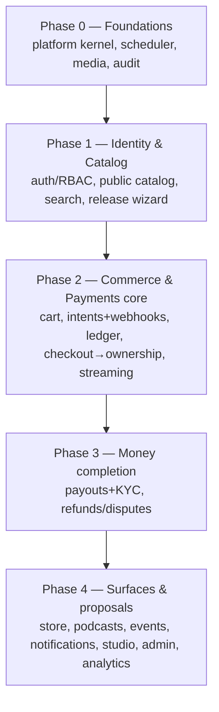

# BeatzClik Backend — System Architecture

> **Scope:** whole-system architecture for the `beatzmedia` Quarkus monolith. **PRD source:**
> `BACKEND-PRD.md` §4–§5, §8. Read this before any module ADD.

## 1. Architectural style at a glance

- **Deployment shape:** a **single deployable monolith** (one Quarkus app, one container image), not
  microservices. Horizontal scale = run more identical stateless instances behind a load balancer.
- **Internal structure:** **modular monolith** — one module per **bounded context**, each built with
  **Hexagonal (Ports & Adapters)** layering. Modules talk **in-process** (synchronous input ports +
  asynchronous CDI domain events); **no module reads another module's tables.**
- **Language/runtime:** Java 25, Quarkus 3.36.x (see ADR-10 for the version history).
- **Data:** PostgreSQL with Flyway migrations; money stored in **integer minor units (pesewas)**.
- **Media:** S3-compatible object storage (MinIO locally); audio transcoded to HLS with a server-side
  **30-second preview** rendition.
- **Auth:** stateless Bearer JWT; roles `fan`/`artist` plus admin scopes.

## 2. C4 — System context

```mermaid
flowchart TB
  fan([Fan])
  creator([Creator / Artist])
  admin([Admin / Ops])
  subgraph BeatzClik
    fe[Frontend SPA<br/>React + TanStack]
    be[beatzmedia backend<br/>Quarkus monolith]
  end
  momo[[MoMo providers<br/>MTN / Telecel / AirtelTigo]]
  card[[Card / Bank gateway]]
  s3[[(Object storage<br/>S3 / MinIO)]]
  smtp[[Email / SMS]]
  db[(PostgreSQL)]

  fan --> fe
  creator --> fe
  admin --> fe
  fe -->|HTTPS REST /v1 + Bearer JWT| be
  be --> db
  be --> s3
  be -->|charge / payout / webhooks| momo
  be -->|charge / refund| card
  be -->|notify| smtp
  momo -->|async webhook| be
```

The frontend is already built; the backend implements `API-CONTRACT.md` so the SPA swaps its mock
`getX()` calls for real endpoints **with no visual change**.

## 3. C4 — Container / module map



Module ownership and per-module detail live in `architecture/<module>.md`. The mapping of bounded
contexts → modules → owned tables is in PRD §4.2 and each ADD §7.

## 4. Hexagonal layering (applies to every module)



**Dependency rule (build-enforced via ArchUnit):** `adapters → application → domain`. Domain imports
**no framework** (no Jakarta/Quarkus/Hibernate annotations on domain types — use separate JPA entities
or mapped records in the persistence adapter). Application imports only domain. Inbound and outbound
adapters never import each other. Violations fail CI (see `sdlc/testing-strategy.md`).

### Package layout per module

```
org.shakvilla.beatzmedia.<module>
├── domain            // pure: entities, value objects, aggregates, domain services, invariants
├── application
│   ├── port.in       // use-case interfaces (input ports)
│   └── port.out      // repository/gateway/clock/id interfaces (output ports)
└── adapter
    ├── in.rest       // Quarkus REST resources, request/response DTOs, mappers
    ├── in.job        // @Scheduled triggers, webhook receivers
    └── out
        ├── persistence  // Panache repositories + JPA entities + mappers
        └── integration  // REST clients (MoMo/card), S3, mailer/SMS, event publisher
```

## 5. Cross-module communication

Two mechanisms only:

1. **Synchronous input-port calls** for request-time orchestration where a result is needed now —
   e.g. `commerce` calling `payments.InitiateChargeUseCase` during checkout. The caller depends on the
   callee's `port.in` interface, never its internals or tables.
2. **Asynchronous CDI domain events** for side effects — published with
   `jakarta.enterprise.event.Event<T>` and consumed via `@Observes(during = AFTER_SUCCESS)`. Used for
   fan-out where eventual consistency is acceptable.

### Canonical domain events



Event names (payload = ids + minimal denormalized snapshot, never JPA entities): `AccountRegistered`,
`ArtistUpgraded`, `ArtistVerified`, `PaymentSettled`, `PaymentFailed`, `OwnershipGranted`,
`OrderRefunded`, `ReleaseApproved`, `ReleaseWentLive`, `EpisodePublished`, `TipReceived`,
`WithdrawalRequested`, `PayoutSent`, `DisputeOpened`, `ContentTakenDown`, `UserSuspended`,
`PlayRecorded`. Handlers must be **idempotent** (events may be redelivered after retries).

## 6. Technology stack & Quarkus extensions

| Concern | Choice | Quarkus extension(s) |
|---|---|---|
| Inbound REST/JSON | Quarkus REST (RESTEasy Reactive) | `quarkus-rest`, `quarkus-rest-jackson` |
| Outbound HTTP (providers) | REST client | `quarkus-rest-client-jackson` |
| Persistence | Hibernate ORM + Panache | `quarkus-hibernate-orm-panache`, `quarkus-jdbc-postgresql` |
| Migrations | Flyway | `quarkus-flyway` |
| Validation | Bean Validation | `quarkus-hibernate-validator` |
| Auth | JWT (or OIDC for social) | `quarkus-smallrye-jwt`, `quarkus-smallrye-jwt-build` |
| API docs | OpenAPI | `quarkus-smallrye-openapi` |
| Health | Health checks | `quarkus-smallrye-health` |
| Metrics/Tracing | Micrometer + OTel | `quarkus-micrometer-registry-prometheus`, `quarkus-opentelemetry` |
| Scheduling | Cron/interval jobs | `quarkus-scheduler` |
| Email | Mailer | `quarkus-mailer` |
| Object storage | S3 / MinIO | `quarkus-amazon-s3` (or MinIO client) |
| Cache / rate-limit (optional) | Redis | `quarkus-redis-client` |
| Testing | JUnit5 + REST-assured + Testcontainers + ArchUnit | `quarkus-junit5`, `rest-assured`, `quarkus-test-*` |

Add extensions incrementally per work unit; the scaffold already has `quarkus-rest`,
`quarkus-rest-jackson`, `quarkus-rest-client-jackson`, `quarkus-smallrye-openapi`, `quarkus-arc`.

## 7. Runtime topology (local & prod)

Local is Docker Compose (PRD §5.1): `db` (Postgres), `app` (beatzmedia), `objectstore` (MinIO) +
bucket-init, `mail` (Mailpit), `sms` (capture stub), `transcoder` (ffmpeg), optional `cache` (Redis).
Production is the same image plus managed Postgres + S3; all config via environment variables;
`quarkus.flyway.migrate-at-start=true`; `/q/health/{live,ready}` back orchestrator probes. See
`cross-cutting/observability.md` and `sdlc/environments-and-deployment.md`.

## 8. System-wide build order (for agents)

Follow PRD §8.1. Summary dependency phases:



Hard rules the order encodes: identity + persistence foundations before commerce; payment charging
before ledger; ledger before payouts; checkout/ownership before playback unlock and before refunds;
analytics rollups before insight reads; audit + RBAC before any admin mutation.

## 9. Architecture decision records (key, already taken)

| # | Decision | Rationale | PRD ref |
|---|---|---|---|
| ADR-1 | Modular monolith, not microservices | Single team velocity, transactional integrity for money/ownership, simpler ops | §4 |
| ADR-2 | Hexagonal layering, framework-free domain | Testability, swap adapters (e.g. MoMo provider, search backend) without touching domain | §4.1 |
| ADR-3 | Money in integer minor units | Avoids float rounding errors across split/discount/fee math | INV-11 |
| ADR-4 | Ownership granted only on settlement | Protects buy-to-own revenue; MoMo is async | INV-1 |
| ADR-5 | Server-side 30s preview rendition | Preview cannot be bypassed by the client | INV-3 |
| ADR-6 | Double-entry ledger | Auditable, balanced money movement; reconciliation | INV-6 |
| ADR-7 | In-process events, not a broker (v1) | Lower ops cost in a monolith; can externalize later | §4.4 |
| ADR-8 | Postgres FTS/`pg_trgm` for search (v1) | No extra infra; behind `SearchIndex` port for later swap | OQ-12 |
| ADR-9 | Dockerfile.jvm pins UBI base to a specific rebuild tag | `ubi9/openjdk-25-runtime:1.24` is a floating tag; pinning to the dated build suffix (e.g. `1.24-2.1781533370`) ensures reproducible builds and picks up the latest OS security patches at pin-time. Trivy scan on `1.24-2.1781533370` (2026-06-15 rebuild) shows 0 fixable HIGH/CRITICAL CVEs. Update the pin when a new patch rebuild or minor version is published. No `.trivyignore` needed as of 2026-06-22. | Phase 0 bootstrap |
| ADR-10 | Adopt Quarkus 3.36.3 (skip 3.34.x stream) at bootstrap | Driver: CVE-2026-39852 in `quarkus-vertx-http` has no fix in the 3.34.x stream (advisory lists 3.20.6.1, 3.27.3.1, 3.33.1.1, and 3.35.1.1 as the minimum patched releases). Additionally, Netty 4.1.132.Final (shipped by 3.34.3) carries 9 HIGH/CRITICAL CVEs (netty-codec, netty-codec-dns, netty-codec-haproxy, netty-codec-http, netty-handler, netty-resolver-dns); fixed in Netty 4.1.135.Final. Decision: adopt Quarkus 3.36.3, the latest stable LTS-aligned release available on Maven Central as of 2026-06-22, which ships `quarkus-vertx-http` 3.36.3 (>3.35.1.1, CVE-2026-39852 cleared) and Netty 4.1.135.Final (all 9 CVEs cleared). No business code exists yet, so the migration cost is zero. Consequence: lowest-debt path forward; no `.trivyignore` suppression needed; all transitive HIGH/CRITICAL fixable CVEs cleared. The CLAUDE.md toolchain line and all docs are updated to reflect 3.36.x. | Phase 0 bootstrap |

| ADR-11 | In-process ManagedExecutor for audio transcode (WU-MED-1) | The ADD permits "TranscodeJobPort → in-process queue". Using MicroProfile ManagedExecutor (quarkus-smallrye-context-propagation) avoids introducing a separate Compose `transcoder` service while keeping the job off the request thread. The worker calls `MediaApplicationService.handleTranscodeResult` which persists the outcome in its own `@Transactional` unit and fires the `MediaReady` CDI event. | ADD §4.2, WU-MED-1 decision 1 |
| ADR-12 | ffmpeg via ProcessBuilder shell-out (WU-MED-1) | `AudioTranscoderPort` adapter downloads the S3 original to a temp file, runs ffprobe (duration probe) and ffmpeg (HLS transcode + ≤30s preview clip) via ProcessBuilder, uploads the segments, and cleans up. This keeps the adapter simple and testable (easily replaced with a different transcoder). | ADD §5.2, WU-MED-1 decision 2 |
| ADR-13 | Static ffmpeg in JVM image via multi-stage Docker copy from `mwader/static-ffmpeg` (WU-MED-1) | UBI9 (the `openjdk-25-runtime` base) does not carry ffmpeg in its default content sets; `microdnf install ffmpeg` fails without extra repo configuration. Instead, a two-stage Dockerfile copies the statically-linked `/ffmpeg` and `/ffprobe` binaries from `mwader/static-ffmpeg:7.1.1` into `/usr/local/bin`. No RPM repos, no build toolchain, and the resulting layer adds ~110 MB (static binary). The version pin `7.1.1` must be updated when a new upstream release is needed. | ADD §5.2, WU-MED-1 decision 2, Dockerfile.jvm |
| ADR-14 | AWS SDK v2 (`software.amazon.awssdk:s3`) for S3/MinIO (WU-MED-1) | `quarkus-amazon-s3` extension exists but re-exposes the same AWS SDK v2 artifacts. We depend directly on `software.amazon.awssdk:s3` managed via the AWS SDK BOM (2.31.49) so the version is explicit, consistent, and not subject to quarkus-extension wiring. `S3Client` and `S3Presigner` are produced as `@Singleton` CDI beans in `S3ClientProducer` with path-style access enabled (required by MinIO). | ADD §5.2, WU-MED-1 decision 3 |

| ADR-15 | Committed dev/test JWT keypair — accepted risk with mandatory prod override | `backend/src/main/resources/jwt/dev-private.pem` and `dev-public.pem` are committed to the repo. These are a **throwaway dev/test-only keypair** with zero monetary or personal-data value; they are used solely to allow the Quarkus app and unit/integration tests to boot without external key material. **Risk acceptance:** (1) The keypair is clearly named `dev-*` and documented here as non-prod. (2) CI secret-scanning (GitHub secret-scanning, trufflehog) passed on this file in PR #9 because the key is not a credential to any real system. (3) Any token signed with this key is invalid in production because production uses different key material. **Mandatory production control:** `BEATZ_JWT_PRIVATE_KEY_LOCATION` and `BEATZ_JWT_PUBLIC_KEY_LOCATION` environment variables **MUST** be set in every deployed environment (staging, production) to point at env-injected keys (managed secret / KMS-backed). The `application.properties` already wires these env vars with the classpath dev keys as fallback. The committed dev keypair **must never be deployed** and **must never be used** to sign tokens in any deployed environment. If a new developer inadvertently sets production to use the classpath fallback, monitoring on JWT `iss`/`aud` claims or a key-ID (`kid`) header check will detect it. Action: rotate if the key is ever used to sign a real user token; consider adding a CI step asserting `BEATZ_JWT_PRIVATE_KEY_LOCATION` is set in the prod deploy workflow. | M-2, security-reviewer review of WU-MED-1 PR #11 |

| ADR-17 | Modules may inject `audit.application.port.out.AuditWriter` directly to satisfy INV-10 (WU-IDN-4) | INV-10 requires every privileged mutation to append exactly one `AuditEntry` atomically with the state change. WU-IDN-4's admin-team services (`InviteAdminService`, `ChangeAdminRoleService`, `RemoveAdminService`) call `AuditWriter.append()` inside their own `@Transactional` boundary. `AuditWriter` is a **write-only, append-only port carrying no domain logic and reading no audit-owned state** — it is effectively a shared infrastructure sink, not a cross-module data read, so the golden rule's intent ("never read another module's tables; integrate via input port or event") is not violated. Placing it in the audit module's `port.out` (rather than a forwarding `port.in` use case) avoids an empty pass-through service for the WU-IDN-4 stub and avoids any circular dependency. **Consequence / revisit:** WU-AUD-1 (audit interceptor + read endpoint) owns the decision of whether to promote this to a proper `port.in` `RecordAuditEntry` use case once the audit application layer exists; until then, calling modules depend on the output port directly. ArchUnit's layered rules permit this (cross-module same-layer application→application). | INV-10; identity ADD §4.2 / §10; audit ADD |
| ADR-16 | Module error codes live in the shared platform `ErrorCode` enum (WU-IDN-1) | Identity-specific codes (`EMAIL_TAKEN`, `INVALID_CREDENTIALS`, `WEAK_PASSWORD`, `ACCOUNT_SUSPENDED`) were added to the platform kernel enum `org.shakvilla.beatzmedia.platform.domain.ErrorCode` rather than each module owning a private code set or its own exception mapper. Rationale: `ApiError` serializes `ErrorCode.name()` as the wire `code` field; the platform `DomainExceptionMapper` switch over `ErrorCode` is **exhaustive** (compile-time safety — adding a new code without a status mapping is a compile error); and a single shared registry guarantees wire codes are globally unique and discoverable across all modules. Per-module domain exceptions (e.g. `AuthException`) extend the kernel `DomainException` and carry one of these codes. A single platform-owned `ConstraintViolationExceptionMapper` in `platform.adapter.in.rest` normalises Bean Validation failures from **all** modules into the uniform 422 `{ error: { code, message, field } }` envelope, eliminating per-module mapper boilerplate. Consequence: new modules must add their codes to the shared enum (one-line change, compile-guarded); they do not need their own exception mappers. | API-CONTRACT §1 error envelope; identity ADD §9 error model |

| ADR-18 | Scheduler advisory lock guarantees at-most-one **concurrent** execution, not global exactly-once; cross-tick de-dup is each job's responsibility (WU-PLT-2) | The platform `SchedulerRegistry` (`adapter.out.scheduler`) guards multi-node ticks with a Postgres **session-level advisory lock** (`pg_try_advisory_lock` held on a dedicated JDBC connection for the duration of `runOnce()`, released via `pg_advisory_unlock` + connection close in `LockHandle.close()`). This provides **mutual exclusion**: while one node holds the lock and runs a job, every other node's `tryAcquire` returns false and skips. It does **not** provide global "exactly-once-for-all-time": the lock is released as soon as the job finishes, so two nodes whose `@Scheduled` ticks are skewed by **more than the job's runtime** can each legitimately run the job in sequence (node A finishes a 50 ms job and releases; node B's tick fires 200 ms later and acquires the now-free lock). This is by design — `concurrentExecution = SKIP` + advisory lock cover *overlapping* runs across the JVM and the cluster; **each `ScheduledJob` must itself be idempotent / safe to re-run** (conditional state transitions, upsert-by-key, dedupe on a tick window), as the `SchedulerRegistry` javadoc states. **Evidence / why this ADR exists:** `SchedulerRegistryIT.registry_jobRunsExactlyOnce_underConcurrentThreads` was flaky locally (passed on CI). A diagnostic run proved the lock never doubly grants — the extra job runs came from late-arriving threads acquiring **after** the winner released, because the test's fresh-connection-per-call `DataSource` made `getConnection()` latency (76–265 ms on macOS Docker Desktop vs a few ms on native-Linux CI) exceed the winner's 50 ms hold window. The fix was test-only: the winner now holds the lock until every node has completed its acquire attempt, deterministically forcing genuine contention so exactly one node ever sees the lock free — independent of connection-setup jitter. No production scheduler code changed. **Consequence / revisit:** jobs that are not naturally idempotent and must not double-fire across skewed ticks (e.g. a future non-idempotent `catalog.go-live` publish under LLFR-PLATFORM-01.2) need a stronger primitive — a persisted "last successful tick" row / leader lease with a hold period, or a unique constraint on the side effect — layered on top of the advisory lock. | ADD §5.2; LLFR-PLATFORM-01.2; WU-PLT-2 (PR #19); `SchedulerRegistry` javadoc |

| ADR-19 | Reconciliation discrepancies are persisted to a payments-owned `reconciliation_discrepancy` table, scoped to provider-vs-intent until the ledger exists (WU-PAY-2) | LLFR-PAYMENTS-01.4 requires the daily reconciliation to compare provider settlement records to the **ledger** and flag mismatches as a finance "AttentionItem / risk signal". At WU-PAY-2 the double-entry ledger does not exist yet (WU-PAY-3), and `AttentionItem` is a frontend admin-overview shape with no backend table. Decision: (1) WU-PAY-2 reconciles provider truth (`PaymentGateway.queryStatus`) against the **`payment_intent` status** — the only internal record of settlement that exists today — recording each mismatch in a new payments-owned `reconciliation_discrepancy` table (natural key `(intent_id, kind, as_of_day)` → idempotent daily re-runs). Two kinds are detectable now: `PROVIDER_SETTLED_INTENT_NOT` (the AC's "provider-settled charge with no matching credit") and `PROVIDER_FAILED_INTENT_SETTLED` (over-grant risk); a `PENDING` provider response is inconclusive and never flagged. (2) The provider-vs-ledger-credit comparison (INV-6) and a `MISSING_LEDGER_CREDIT` kind are completed in/after WU-PAY-3. (3) Surfacing discrepancies as an admin `AttentionItem` is deferred to the admin module (it will read this table or observe an event); "recorded for finance review" (the AC) is satisfied by the persisted row. (4) The timeout poll (01.3) and reconciliation (01.4) share the platform `payments.payment-recon` 30 s scheduler tick via one idempotent `ScheduledJob`, per the platform ADD's stated cadence design. **Consequence:** a payments table not originally in the ADD schema (ADD §7 updated); discrepancy detection converges as the ledger lands. | LLFR-PAYMENTS-01.4; payments ADD §4.2/§7; WU-PAY-2 |

| ADR-20 | No royalty model — BeatzClik is pure buy-to-own; the ledger posts only sales (70/30) and tips (90/10) (WU-PAY-3, OQ-4 resolved) | **OQ-4 (royalty accrual model) is resolved to NO royalty model** (product-owner decision 2026-07-02, backlog WU-PAY-3 human-gate resolution comment; recorded human-gate PR #58). BeatzClik monetises by **ownership purchase** and **tips**, not by stream-count royalties. Decision: WU-PAY-3 builds **no** royalty machinery — no royalty ledger account kind, no accrual job, no platform-funded royalty pool. The double-entry ledger posts exactly two split shapes: a **sale** (DEBIT provider_clearing gross, CREDIT creator_payable creatorShare, CREDIT platform_revenue fee; `platformFeePct` from `PlatformSettings`, default 30 → creator nets 70%) and a **tip** (same shape with `tipFeePct`, default 10 → creator nets 90%). **Frontend divergence (why an ADR per CLAUDE.md):** the studio-payouts UI (`studio-payouts.ts`) and admin ledger (`admin-data.ts`) carry a `Royalty` / `bySource.royalties` line implying stream royalties. Because no royalty is ever posted, the API resolves every royalty surface to **₵0**: `PayoutsView.bySource.royalties = 0`, and a `?type=Royalty` admin-ledger filter returns an empty page. The `LedgerType.ROYALTY` / `PayoutType.Royalty` enum members are retained (the frontend union expects them) but are never produced. **Consequence:** simpler, always-balanced ledger (INV-6) with two posting paths; if a royalty model is ever introduced it is additive (a new account kind + accrual job) and requires re-opening OQ-4. **Human gate:** the *default fee percentages* (OQ-2: 30% sale / 10% tip) are config-driven and still await human production confirmation before real money moves — flagged in `/status`. | OQ-4; backlog WU-PAY-3 resolution; PR #58; payments ADD §3/§10; CLAUDE.md human gates |
| ADR-21 | The sale creator-mapping is deferred to WU-COM-2; tips self-carry their recipient via a `TIP:<creatorId>` order-ref so the split posts with no cross-module read (WU-PAY-3) | The settlement path fires `PaymentSettled`, which carries the intent's `orderRef` + payer `accountId` but **not** the recipient creator — for a *sale* the payer→creator/order mapping lives in `commerce` (WU-COM-2, not yet built). Posting a sale split at settlement would require either inventing a creator id or reading commerce's order table — both forbidden (module boundary; a fabricated id would misattribute money / risk unbalancing the ledger). **Decision (payments ADD §10 preferred approach b):** (1) `LedgerPostingService.postSaleSplit` is built as a reusable, balanced primitive but is **not** wired to `PaymentSettled` at this WU — WU-COM-2 will resolve the creator from the settled order and call it. (2) **Tips**, whose recipient IS within payments' knowledge, encode the creator into the intent's opaque `OrderRef` as `TIP:<creatorAccountId>` (`TipRef`). A synchronous `@Observes PaymentSettled` subscriber (`TipSettlementSubscriber`) recognises tip order-refs, recovers the creator, and posts the 90/10 split **inside the settlement transaction** (atomic with the intent transition — the ledger is never half-posted, INV-6) — with **zero** cross-module reads. Non-tip settlements are ignored by the subscriber. **INV-1 preserved:** the encoded ref is inert until settlement; the credit is posted only when the intent reaches `settled`. **Consequence:** sales splits wire into WU-COM-2 trivially (no ledger-primitive change); the ledger always balances and never posts with a fake creator id. | payments ADD §3/§4/§8/§10; INV-1/INV-6; existing `PaymentSettled`; WU-COM-2 |

| ADR-22 | Exactly-once settlement posting is enforced by a DB `ledger_posting` UNIQUE header, not a check-then-act SELECT (WU-PAY-3, finding F1) | **Adversarial review found a HIGH double-credit bug (F1):** two provider webhooks for the SAME intent but DIFFERENT `provider_event_id`, delivered concurrently, both pass the `payment_event` UNIQUE check, both read the intent as `pending`, both fire `PaymentSettled`; the two tip-split observers run in sibling `REQUIRES_NEW` transactions and both call `existsPostingFor(...)`, which returns `false` for both (TOCTOU — neither sibling has committed) → the creator is credited **twice** (₵10 tip → 1800 not 900). The `assert_txn_balanced` trigger does NOT catch this: each txn is internally balanced; it is *duplication*, not imbalance. **Decision:** make the posting exactly-once at the DB level. (1) A new `ledger_posting(ref_type, ref_id)` header table with a **PRIMARY KEY** on `(ref_type, ref_id)` — the settlement ref is the per-intent id, so at most ONE posting per intent is possible. The uniqueness lives on this **transaction/header** table, NOT on `ledger_entry`, because one balanced posting writes multiple entry rows sharing the same `(ref_type, ref_id)` (debit + creator-credit + platform-fee-credit) — a UNIQUE on `ledger_entry` would wrongly reject the 2nd/3rd rows of the SAME legitimate txn. (2) `LedgerPostingService` calls `LedgerRepository.claimPosting(...)` (INSERT + flush) BEFORE writing any entry: the first poster inserts; a concurrent second fails on the PK, throws `DuplicatePostingException`, and its `REQUIRES_NEW` transaction rolls back atomically. (3) The tip observer swallows `DuplicatePostingException` as a benign idempotent no-op (debug log) so a legitimate double-delivery is a success with a single credit, never a 500. (4) **Defense-in-depth:** the settle transition (`PaymentSettlementService.settle`) takes a `SELECT … FOR UPDATE` row lock (`findByIdForUpdate`) so two concurrent settlements serialise and fire `PaymentSettled` at most once; the terminal-state no-op remains. (5) The tip posting was moved out of the observer body into a dedicated `TipLedgerPoster.postTip` (`REQUIRES_NEW`, separate CDI bean) so the failing claim rolls back **that** transaction in isolation without poisoning the observer. `existsPostingFor` is retained only as a cheap sequential-replay fast-path — it is NOT the concurrency guard. **Consequence:** a same-intent concurrent double-settle credits exactly once (INV-1/INV-6), proven by `ConcurrentSettlementIT` (fails-before / passes-after). Any future settlement-driven posting (e.g. the WU-COM-2 sale split) reuses `claimPosting` for the same guarantee. | finding F1; INV-1/INV-6; payments ADD §7/§8; V703 `ledger_posting`; `ConcurrentSettlementIT` |

| ADR-23 | Checkout GATES the cart kinds whose authoritative pricing module does not exist yet (episode / season-pass / ticket / store); only track / album / album-rest may be purchased in WU-COM-2 (G3) | WU-COM-2 (commerce checkout) does **not** depend on WU-POD-1 (podcasts), WU-EVT-1 (events), or WU-STO-1 (store). For those four cart kinds the interim `CatalogPricingServiceAdapter.priceFromMetadata` resolves the unit price from **client-supplied** `metadata.priceMinor` (a documented WU-COM-1 stopgap, `// G2`), because no owning module can price them yet. Checkout, unlike add-to-cart, **moves real money** via `InitiateCharge`, so honouring a client-supplied price would let a fan pay ₵0.01 (or any spoofed amount) for a ticket/episode — a direct revenue-integrity hole. **Decision (SAFE default; security-reviewer sign-off REQUIRED):** `CheckoutService` GATES/REJECTS `episode`/`season-pass`/`ticket`/`store` lines at checkout with **409 `CHECKOUT_KIND_UNSUPPORTED`**; only `track`/`album`/`album-rest` — priced **authoritatively** from catalog's own `track`/`album` rows (server truth, never client input) — proceed to a charge. So no real-money checkout ever runs on a spoofable price. The interim `priceFromMetadata` echo is **retained only for the add-to-cart path** (no money moves there) with a `// G2` note; it is to be **replaced by authoritative price-lookup input ports** (`podcasts`/`events`/`store` `application.port.in`) when WU-POD-1/EVT-1/STO-1 ship, at which point the gate is relaxed per-kind. **Consequence:** ticket issuance (LLFR-COMMERCE-02.5) and premium-episode/season-pass purchase are deferred to those Phase-4 WUs; `OrderSnapshot.tickets` is therefore always absent in this WU. Album/season **expansion** machinery (INV-2) is implemented and exercised for albums today; the season-pass→episode branch is inert (gated) until podcasts lands. G1 (server-side re-pricing) still applies to the allowed kinds: checkout re-resolves the price from catalog and never trusts the cart-stored amount. | G3; backlog WU-COM-2; commerce ADD §9; INV-1/INV-11; `CheckoutKindUnsupportedException`; `CatalogPricingServiceAdapter` (`// G2`) |

| ADR-24 | On settlement, commerce posts ONE sale split per creator with a per-creator-unique ledger source ref (`intentId:creatorId`); `album-rest` is priced ownership-aware (sum of the caller's remaining individual track prices, no bundle discount) (WU-COM-2, adversarial findings F1/F2) | **F1 (CRITICAL):** the payments `ledger_posting` header PK is `(ref_type, ref_id)` (ADR-22). Commerce's settlement→grant service initially posted one split per order *line* all keyed on the same `paymentIntentId`, so an order crediting **≥2 distinct creators** collided on the 2nd creator's claim (Postgres 23505 → `DuplicatePostingException`). Because that post ran *inside* the grant transaction, the 23505 marked it rollback-only and the WHOLE settlement→grant unit rolled back at commit (grants, creator-1 credit, `pending→paid`, `order_grant_posting` claim, cart clear, audit, event) — buyer charged, nothing granted, deterministically repeating on re-delivery (the claim was rolled back too). A two-artist cart is normal, so this was a guaranteed money-loss bug. **Decision:** (a) `GrantOwnershipService` aggregates each order's line grosses **per creator** and posts exactly **one** balanced split per creator, using a **per-creator-unique** source ref `paymentIntentId + ":" + creatorAccountId` — distinct creators get distinct `(ref_type, ref_id)` keys (no collision), same-creator lines sum into one posting (no self-collision). Re-delivery idempotency is provided one level up by the order-level `order_grant_posting` claim (a re-delivered settlement returns before any posting), so the per-creator ref only needs uniqueness within a single grant pass. (b) `PaymentsSaleLedgerPosterAdapter.postSaleSplit` runs `REQUIRES_NEW` (crossing the CDI proxy from `GrantOwnershipService`) so a *genuine* duplicate claim rolls back only that split's transaction and can never poison the grant transaction; the `DuplicatePostingException` is then swallowed as a benign no-op. **F2:** full-`album` purchase stays at the stored `list_price_minor` (the 24% bundle discount is baked in at authoring — `bundleDiscountPct` is a catalog-authoring constant, NOT re-applied at checkout). `album-rest` is priced **ownership-aware**: the sum of the caller's not-yet-owned, for-sale album tracks at each track's individual price, **no** discount, granting exactly those tracks (matching the frontend `buyRest`); a fully-owned album-rest is rejected 404. `CatalogExpansionReader.remainingForSaleTracks(account, albumId)` computes this from commerce's `OwnershipRepository` + catalog's `track` rows. **Consequence:** multi-artist carts settle correctly (each creator credited once, ledger balanced INV-6); album-rest never overcharges at the full-album price. **F3:** comments in `LedgerPostingService`/`PaymentsSaleLedgerPosterAdapter` corrected to state the DB 23505 poisons the *current* transaction, so isolation is the caller's responsibility. | findings F1/F2/F3; ADR-21/ADR-22; INV-4/INV-6/INV-11; payments `ledger_posting`; commerce ADD §14.1; `GrantOwnershipService`, `CatalogExpansionReader`, `CheckoutService` |
| ADR-24 (addendum) | Per-creator-split partial-failure atomicity: the separate-`REQUIRES_NEW`-per-split design is KEPT; the residual risk is an *orphaned creator credit* only on a PERMANENT split failure, mitigation deferred (WU-COM-2 review-B) | Code review asked what happens if creator #2's split fails with a NON-duplicate error (transient DB error / `UnbalancedLedgerException`) after creator #1's `REQUIRES_NEW` split already committed. A regression test (`GrantOwnershipServiceTest.grant_multiCreatorPartialSplitFailureThenRetry_noDoubleCredit_grantedOnce_B`) proves the retry behaviour: delivery 1 commits creator #1's split, then creator #2 fails → propagates out of `grantForSettledOrder` → the outer grant transaction rolls back (order stays `pending`, grants removed, `order_grant_posting` claim released) while creator #1's credit survives; delivery 2 (re-delivery) runs the grant again, and creator #1's re-post hits its already-committed `ledger_posting` PK `intentId:creatorId` → `DuplicatePostingException` → **swallowed by the adapter** → creator #1 is **NOT double-credited**; creator #2's transient failure has cleared, so it posts once. **End state: each creator credited exactly once, both tracks granted once, order `paid`, ledger balanced (INV-6) — no double-credit and no real imbalance.** **Decision:** KEEP the design (no savepoint rework needed — the per-creator PK already makes retries safe). **Residual risk (documented, accepted for v1):** if a split failure is *permanent* (never succeeds on any retry — e.g. a persistently unbalanced creator), the order remains ungranted/`pending` while any earlier creator in the same order carries an orphaned committed credit, and the settlement keeps failing on re-delivery. **Mitigation path (future hardening, not built now):** either (i) a SAVEPOINT-per-split *within one outer transaction* so a genuine failure rolls the whole grant back atomically with no orphaned credit (while a duplicate rolls back only to the savepoint), or (ii) a transactional outbox / compensation that reverses an orphaned credit when a grant ultimately fails. Given settlement splits are balanced-by-construction and duplicate-only failures are the realistic case, the permanent-failure window is narrow; tracked for WU-PAY-5 (refund/clawback machinery) era. | review finding B; `grant_multiCreatorPartialSplitFailureThenRetry_noDoubleCredit_grantedOnce_B`; INV-6; payments `ledger_posting` PK; future: SAVEPOINT-per-split / outbox |
| ADR-25 | Withdrawals RESERVE funds at request time via a balanced `DEBIT creator_payable / CREDIT payout_clearing` posting under a `creator_balance` row lock; KYC lives in a payments-owned `kyc_record` behind `KycProvider`; the withdrawal fee is a config-driven RAIL COST (not posted to the ledger) on `PlatformSettings` (WU-PAY-4) | WU-PAY-4 moves real money OUT to creators, so the same double-spend / double-pay class of bug found in WU-PAY-3 (F1) and WU-COM-2 (F1) applies. **Decision (a) — reserve-on-request, not on-payout.** A withdrawal request posts a **balanced, cleared** ledger txn `DEBIT creator_payable (gross) / CREDIT payout_clearing (gross)` immediately, keyed exactly-once on the withdrawal id via the existing `ledger_posting` header (ADR-22). Because the `creator_balance` projection computes `available = Σ cleared creator_payable CREDIT − Σ cleared DEBIT`, the reservation reduces `available` the instant it commits, so a second withdrawal sees the reduced balance. **(b) — row-locked balance check.** `RequestWithdrawalService` takes `LedgerRepository.lockBalance` (`SELECT … FOR UPDATE` on the `creator_balance` row, inserting a zero row first) BEFORE reading available and reserving, so the read-then-reserve is atomic per creator: two concurrent withdrawals summing to more than the balance **cannot** both pass — exactly one wins, the loser gets a mapped `INSUFFICIENT_BALANCE` (409), and the balance never goes negative (proven by `ConcurrentWithdrawalIT`). This is the withdrawal analog of the settlement `FOR UPDATE` guard. **(c) — payout exactly-once.** Executing a withdrawal posts a balanced `DEBIT payout_clearing / CREDIT provider_clearing` disbursement (exactly-once on the withdrawal id) AND inserts a `payout_txn` guarded by `uq_payout_per_withdrawal`; either guard tripping on a retry is caught and the execution is a no-op, so a re-run/repeated-send can never double-debit (INV-6, proven by `PayoutFlowIT`). **(d) — KYC location.** The ADD models `KycProvider` as resolving to `identity`, but identity has no KYC surface yet; the authoritative `kyc_record` table lives in the payments band behind `KycProvider` (`JpaKycProvider`, fail-closed: no record ⇒ NONE ⇒ blocked). A future identity-KYC WU re-backs the port with no service change; no cross-module table reads. **(e) — KYC enforcement asymmetry.** The weekly run SKIPS unverified creators (leaves them pending); a single send BLOCKS with `KYC_BLOCKED` (409) per API-CONTRACT §Finance. **(f) — fee is config-driven (INV-4).** `PlatformSettings.withdrawalFeeMinor(kind, amount)` encodes the frontend policy (bank flat ₵5; MoMo 1% min ₵1) in one place; never inlined at a call site. **Consequence:** every withdrawal/payout money path is KYC-gated, balance-backed, idempotent, balanced (INV-6), audited (INV-10), and concurrency-safe; OQ-2 (fees) and OQ-4 (royalties ₵0, ADR-20) remain config-driven defaults flagged for human production sign-off. | INV-1/INV-4/INV-6/INV-8/INV-10/INV-11; ADR-20/ADR-22; payments ADD §7 (V704); `RequestWithdrawalService`, `PayoutRunService`, `JpaKycProvider`; `ConcurrentWithdrawalIT`, `PayoutFlowIT`, `PayoutRestIT` |
| ADR-25 (addendum) | Weekly payout runs disburse EACH withdrawal on its own `REQUIRES_NEW` boundary with `FOR UPDATE SKIP LOCKED` per row (batch is never poisoned by a single collision); the withdrawal fee is confirmed a RAIL COST, not platform revenue (WU-PAY-4 adversarial money review F1/F2/F3) | **F1 (HIGH) — batch poisoning.** The first cut ran every payout inside `runWeekly`'s single `@Transactional`; a duplicate-claim collision (Postgres 23505 from the `ledger_posting` PK or `uq_payout_per_withdrawal`) marked the JTA transaction **rollback-only** and poisoned the Hibernate session — catching the Java `DuplicatePostingException`/`DuplicatePayoutException` does **not** un-poison it, so the whole batch rolled back at commit, un-paying every OTHER creator already processed. `findPayableWithdrawals` had no row lock, so two concurrent `runWeekly` (different idempotency keys ⇒ advisory locks don't serialise them) or a `runWeekly` racing a `send` both saw withdrawal W as payable; A pays W, B collides on W → B's whole batch rolls back (no double-pay, but payouts not resilient — the exact WU-COM-2 F1 lesson). **Decision (mirrors the correct WU-PAY-3/COM-2 fix):** (1) a new `PayoutDisburser` bean disburses **each** withdrawal on its **own** `@Transactional(REQUIRES_NEW)` boundary invoked via the CDI proxy — a collision rolls back **only that withdrawal's** transaction in isolation and the surrounding batch keeps every other creator it committed. (2) The per-withdrawal claim `findWithdrawalForUpdate` is `SELECT … FOR UPDATE SKIP LOCKED` on the single row: a row another run already holds is **skipped** (returns empty → no-op), not blocked, so concurrent runs **partition** the payable set. (3) `runWeekly` is no longer one transaction: it commits the `payout_batch` header first (the `payout_txn.batch_id` FK target), reads a **lock-free** candidate-id list (`findPayableWithdrawalIds`, no lock so it can't self-deadlock against the inner boundary), disburses each `REQUIRES_NEW`, then finalises the batch totals in a short tx. **Proven by `ConcurrentPayoutRunIT`:** two truly-simultaneous runs pay each withdrawal exactly once and, between them, cover **all** withdrawals (none lost to a poisoned batch); a `runWeekly`+`send` race on one withdrawal pays it exactly once while the batch still pays the other creators. **F2 (product decision, document only) — withdrawal fee is a RAIL COST, not platform revenue.** The ₵5 bank / 1%-min-₵1 MoMo fee is the payment provider's charge, so the current behaviour is correct and unchanged: the reservation debits `creator_payable` the **gross**, the gross leaves via `payout_clearing → provider_clearing`, the ledger balances, and **no `platform_revenue` leg is posted** for the fee (contrast the sale/tip split fee, which IS platform revenue). Made explicit in `PlatformSettings.withdrawalFeeMinor` javadoc, `WithdrawalRequest.fee`, `withdrawal_request.fee_minor` ("informational / rail-side, not posted"), and flagged as a config-driven default awaiting production confirmation alongside OQ-2. **F3 (LOW) — advisory-lock key.** `JpaPayoutRepository.advisoryKey` now derives the `int8` from `SHA-256(fullKey)[0..8]` instead of `String.hashCode()` duplicated into both 32-bit halves (which collapsed distinct keys into one 32-bit space and needlessly serialised them) — availability only; correctness stays guarded by `uq_withdrawal_idem`. **Consequence:** payout runs are now resilient (one bad withdrawal can't abort the batch) and safe under concurrency (no double-pay, work partitioned), with the fee semantics documented. | review F1/F2/F3; ADR-22/ADR-24 (REQUIRES_NEW-per-unit pattern); INV-4/INV-6/INV-8; `PayoutDisburser`, `PayoutRunService`, `JpaPayoutRepository` (`findWithdrawalForUpdate` SKIP LOCKED, `advisoryKey` SHA-256); `ConcurrentPayoutRunIT` |

| ADR-26 | The admin finance surface (LLFR-ADMIN-05.*) lives entirely in the `payments` module; the admin ADD §4.3 `PaymentsFinancePort` + `GetFinanceOverviewUseCase`-in-`admin` wrapper design is superseded and not built (WU-ADM-5) | **Context.** WU-ADM-5 ("finance ops surface — delegates to payments") nominally owns LLFR-ADMIN-05.1 (finance overview) plus 05.2/.3/.4 (payout runs / ledger / disputes, each a pointer to an LLFR-PAYMENTS-0x). By the time WU-ADM-5 was picked up, WU-PAY-3/4/5 had **already** implemented the action endpoints directly under `/v1/admin/finance/*` in the `payments` module (`AdminFinancePayoutsResource`, `AdminFinanceLedgerResource`, `AdminFinanceDisputesResource`), with finance/super-admin RBAC and INV-10 audit on every mutation; the payments ADD §5.1 endpoint table already listed `GET /v1/admin/finance → Finance` there too. The admin ADD §4.3, written earlier, had instead sketched an `admin`-module `PaymentsFinancePort` (a cross-module delegation port) fronted by `admin` REST resources and a `GetFinanceOverviewUseCase` — a wrapper that was never built. **Decision.** Keep the whole finance surface in `payments` (one module owns money mechanics AND their admin read/actions, consistent with the as-built siblings), and implement the one missing piece — the overview `GET /v1/admin/finance?range=` — as a `payments` `GetFinanceOverview` input port + `AdminFinanceOverviewResource`, NOT via the admin-module wrapper. The admin ADD §4.3 `PaymentsFinancePort`/`GetFinanceOverviewUseCase` design is marked superseded (as-built note added there); the payments ADD carries the authoritative WU-ADM-5 as-built note. **Rationale.** (a) Avoids a redundant pass-through layer whose only jobs (RBAC + audit) are already done at the payments resources/services; (b) keeps `admin` from taking a compile-time dependency on payments finance types it would only forward; (c) matches the established precedent — no other module wraps payments' admin endpoints. The hexagonal rule is preserved: `admin` still never reads payments' tables; it simply does not need to, because the finance endpoints are served by their owning module. **Consequence.** WU-ADM-5 ships a single new read endpoint; ADMIN-05.2/.3/.4 are satisfied by the pre-existing WU-PAY-* endpoints (noted in the PR). `momoFloat`/`providerMix` are honest-empty carryovers; GMV excludes tips and is not yet net-of-refunds (payments ADD WU-ADM-5 note). | backlog WU-ADM-5; admin ADD §4.3/§12; payments ADD §5.1 + WU-ADM-5 as-built note; `GetFinanceOverview`, `AdminFinanceOverviewResource`, `LedgerRepository.financeSince`, `DisputeRepository.findOpen`; `GetFinanceOverviewServiceTest`, `AdminFinanceOverviewIT` |
| ADR-27 | Redde (Wigal) is one PSP vendor implementing the entire `PaymentGateway` port for **all five** `Provider` rails; runtime-selectable against the sandbox via a new `FeatureKey.PSP_REDDE` through a `PaymentGatewayRouter`. The ADD's "one adapter per rail" sketch is superseded for the money-in side (WU-PAY-6) | **Context.** The payments ADD §4.2/§5.2 and the `PaymentGateway` javadoc describe adapter selection "by `Provider`" as if each rail (MTN, Telecel, AirtelTigo, card, bank) had its own `ProviderClient` adapter. Redde is a single Ghanaian PSP whose `/v1/receive` (MoMo debit) and `/v1/checkout/` (hosted card+MoMo) endpoints cover MTN/AIRTELTIGO/VODAFONE(=Telecel Cash)/MASTERCARD/VISA in one vendor integration. It must be switchable on/off at runtime (go live on Redde, or fall back to the sandbox instantly — no redeploy). **Decision.** (1) `ReddePaymentGateway` is ONE class implementing `PaymentGateway` for all five `Provider` values — no `Provider` enum change (mtn→MTN, telecel→VODAFONE, airteltigo→AIRTELTIGO; card→hosted checkout; bank rejected for charges). (2) Selection is a new `FeatureKey.PSP_REDDE` read per-call by `PaymentGatewayRouter`, the sole unqualified `PaymentGateway` bean; `SandboxPaymentGateway`/`ReddePaymentGateway` are `@PspGateway(SANDBOX)`/`@PspGateway(REDDE)` beans it delegates to. Every existing `@Inject PaymentGateway` site is unchanged and defaults to the sandbox when the flag is off (today's behaviour, byte-for-byte). (3) `PSP_REDDE` is seeded **false** in V966 because `FeatureFlagsAdapter.isEnabled` fails OPEN for an unknown key; real Redde credentials (`BEATZ_REDDE_API_KEY`/`APP_ID`) are a deploy-secret human gate and the gateway fails closed if they are blank even when the flag is on. **Consequence.** Simpler wiring, one credential set. **Limitations (accepted):** only one PSP is active for all rails at a time (a future second vendor would need a finer qualifier scheme); and because `active()` is evaluated per-call, flipping the flag while charges are pending can route a later `queryStatus` to the other gateway (the sandbox always returns pending → a really-settled Redde charge could be force-timed-out) — operational rule: flip only when no charges are in flight. In tests the unqualified `@Alternative` `CountingPaymentGateway` still shadows the router, so router dispatch is unit-tested (`PaymentGatewayRouterTest`), not IT-tested. | backlog WU-PAY-6; plan `virtual-conjuring-robin.md`; payments ADD §4.2/§5.2; `PaymentGatewayRouter`, `ReddePaymentGateway`, `FeatureKey.PSP_REDDE`, V966; `PaymentGatewayRouterTest`, `ReddePaymentGatewayTest` |
| ADR-28 | Redde callbacks are trusted by an authenticated pull-back (`GET /v1/status`/`/v1/checkoutstatus`), NOT an HMAC signature; card-checkout ownership is never granted off the browser redirect (WU-PAY-6) | **Context.** Redde's callbacks carry **no** signature/HMAC header (confirmed across the whole live doc set), unlike the sandbox's HMAC-SHA256 scheme that `PaymentGateway.verifySignature` assumes; and Redde's callback JSON (`transactionid`/`status`=PAID/FAILED/PROGRESS) differs in shape from the canonical `WebhookPayload` (`eventId`/`providerRef`/`status`=settled/failed/pending) that `HandleProviderWebhookService` parses. Card has no server-side charge API — only a hosted-checkout redirect returning a `checkoutUrl`. **Decision.** (1) Redde receive callbacks land on a **dedicated** path `POST /v1/payments/webhooks/redde/receive` handled by `HandleReddeReceiptService` (not the canonical parser). It treats the body as a hint: extract `transactionid`, then confirm the outcome by an **authenticated** `gateway.queryStatus` pull-back (Redde's `GET /v1/status/{id}`, keyed on our apikey) and settle/fail **only** on the pulled terminal outcome — a forged callback can at most re-confirm real Redde state, never fake a settlement. Idempotent on `redde:<transactionid>` via `payment_event`; a transient pull-back failure returns 202 and defers to the 30s recon poll (no retry storm). `ReddePaymentGateway.verifySignature` is kept as a defensive pull-back for the generic `/{provider}` path (its name is a misnomer for Redde, documented inline). (2) Card checkout adds ONE additive nullable field `checkoutUrl` to `PaymentIntentView` (null for every direct-charge/MoMo/sandbox intent). `successcallback`/`failurecallback` point at the **frontend** and are never read server-side; settlement is confirmed only via the pull-back webhook or the recon poll's `GET /v1/checkoutstatus/{id}` (branched on `provider==card` in `queryStatus`), so ownership is never granted off the untrusted browser redirect. **Empirical unknown (flagged for sandbox verification):** whether Redde's checkout flow ALSO fires the receive callback; the design is correct either way (webhook fast-path, else poll). **Consequence.** One extra outbound HTTP per Redde webhook (webhooks are low-frequency). Frontend consumption of `checkoutUrl` (a redirect in `checkout.tsx`, currently a client-only mock) is a follow-up — this backend field is forward-compatible but not yet UI-testable. | backlog WU-PAY-6; plan `virtual-conjuring-robin.md`; `HandleReddeReceiptService`, `ReddePaymentGateway.queryStatus/verifySignature`, `PaymentIntentView.checkoutUrl`, `PaymentWebhookResource`; `HandleReddeReceiptServiceTest`, `ReddeWebhookIT` |

| ADR-29 | Real payout disbursement (Redde `/v1/cashout`) is asynchronous-confirmed: the ledger disbursement posting + `markPaid` move from admin-trigger time to cashout-webhook/recon-confirm time, gated by a new `WithdrawalStatus.SENT`; the sandbox (flag off) stays synchronous, byte-for-byte with WU-PAY-4. Failed-after-reserved reversal is an explicit non-goal (WU-PAY-7) | **Context.** WU-PAY-4's `PayoutDisburser` posted the balanced disbursement clearing + marked the withdrawal `PAID` the instant an admin triggered a run — correct for a fake rail that always "succeeds", but wrong for a real rail whose cashout can later FAIL: it would leave the ledger claiming money that never left. Redde's `/v1/cashout` returns only a synchronous *accepted* first-response; the terminal PAID/FAILED arrives later (unsigned callback / status pull), exactly like the inbound charge lifecycle. **Decision.** (1) A new in-flight state `WithdrawalStatus.SENT` (and `payout_txn.status` `sent`, with `disburse_txn_id` now nullable) sits between the admin trigger and confirmed `PAID`. (2) `PaymentGateway.confirmsDisbursementAsync()` (false sandbox / true Redde) lets `PayoutDisburser` choose the path without importing `FeatureFlags` (mirrors `supportsDirectCharge`): sync posts the ledger + marks paid now (WU-PAY-4 behaviour preserved when `PSP_REDDE` is off); async calls `gateway.disburse`, records the txn `sent` with **no** ledger posting, and marks the withdrawal `SENT`. (3) The ledger posting + `markPaid` happen only in `HandleCashoutWebhookService` on a terminal **pulled** `SETTLED` (ADR-28 verify-by-pull-back, its own `payout_event` idempotency table + a dedicated `POST /v1/payments/webhooks/redde/cashout` path — Redde's receive/cashout callbacks are structurally identical, disambiguated by PATH not payload). A new `PayoutReconJob` (`payments.payout-recon`, 30s) sweeps still-`SENT` cashouts whose webhook never arrived. Confirmation is idempotent four ways: `FOR UPDATE SKIP LOCKED`, the `isSent` guard, the `payout_event` UNIQUE, and the exactly-once `postWithdrawalDisburse` header. (4) `railFor` now reads the structured `PayoutMethod.network`, fixing the WU-PAY-4 momo→mtn hardcode. **Consequence / accepted residual risk.** A cashout rejected outright (or an ambiguous send-time rail error) marks the withdrawal `FAILED` + audits — but does **not** auto-reverse the funds reservation posted at withdrawal-request time (ADR-25). Auto-reversal is an explicit non-goal here (per the ADR-24/25 orphaned-credit precedent): a failed-after-reserved withdrawal is a finance reconciliation item, not solved inline. An ambiguous error is treated as FAILED to avoid a retry double-send (we mint a fresh `clienttransid` per attempt, so Redde would not dedup) — favouring no-double-send over a false-FAILED. | backlog WU-PAY-7; plan `virtual-conjuring-robin.md`; `WithdrawalStatus.SENT`, `PayoutTxnStatus`, `PaymentGateway.confirmsDisbursementAsync/disburse`, `PayoutDisburser`, `HandleCashoutWebhookService`, `PayoutReconJob`, `PayoutDestination`, `GhanaBankCode`, V967; `PayoutDisburserTest`, `HandleCashoutWebhookServiceTest`, `ReddePaymentGatewayTest`, `GhanaBankCodeTest` |

| ADR-30 | Reindex sources are contributed by owning modules via an `IndexSource` SPI, not read by search (WU-SRCH-2) | Search declares `IndexSource` (`entityType()`, `load(): List<IndexDocument>`) as an outbound port, discovered via CDI `Instance<IndexSource>`; catalog (and later store/podcasts/events) contribute implementations that map their own domain entities to `IndexDocument`s. **Supersedes** search ADD §9's sketch of `ReindexUseCase` streaming from the owning modules' read ports at the catalog/store boundary — that design would have made `search → catalog` a dependency **on top of** the existing `catalog → search` edge (`catalog.application.service.SearchService` injects search's `QueryService`), creating a module cycle; it was also not implementable as written, since no catalog input port can enumerate all entities. `IndexSource` keeps the `module → search` direction already established by `store.adapter.out.persistence.SearchIndexPg`, adding no new module edges. **Context — why this ADR exists:** `search_document` was empty in every environment prior to this WU: the dev seed never populated it, `IndexEventObserversStub` is a comment-only placeholder with no `@Observes` beans, `ReindexService.reindex` only summed already-indexed rows (a no-op on an empty index), and the `search.reindex` scheduler tick had no bean behind it. WU-SRCH-1's ADD deferred the wiring to WU-CAT-3/CAT-4/WU-STO-1, which shipped `done` without ever delivering it. **Consequence:** `ReindexService` now discovers `IndexSource` beans, loads their documents, and upserts via `SearchIndex` (upsert-only; `documentsRemoved` is always 0); `ReindexJob` backs the previously-dormant `search.reindex` tick, so a dev/prod stack self-populates within one 10-minute tick of boot. `visible` remains the only gate `PostgresFtsSearchAdapter` applies (`WHERE visible = true`); sources must index every owned entity, including non-visible ones, because upsert-only reindex would otherwise strand a stale `visible=true` document forever. | search ADD §4.2/§9/§12; catalog ADD §5.2/§13; `IndexSource`, `ReindexService`, `ReindexJob`, `TrackIndexSource`/`ArtistIndexSource`/`AlbumIndexSource`/`PlaylistIndexSource`, `CatalogRepository.allXForIndex()` |
| ADR-31 | Cross-module authoritative pricing AND settlement fulfillment for episode/season-pass/ticket/store are contributed by the owning modules via commerce-declared SPIs (`ModulePriceSource`, `SettlementSource`), not read by commerce; checkout is un-gated behind a payee guard; `checkoutUrl` is threaded out through `CheckoutResult` (WU-COM-4) | **Context.** Commerce priced these four kinds by echoing the client-supplied `metadata.priceMinor` (a spoof vector, gated off at checkout with 409 `CHECKOUT_KIND_UNSUPPORTED`, ADR-23) and, at settlement, `CatalogExpansionReader.tracksToGrant`/`creatorOf` returned empty for them — so un-gating naively would charge the buyer, grant/mint nothing, and silently drop the revenue from the ledger. The owning-module data (podcast/episode price + `creator_account_id`, `ticket_tier.price_minor` + `event.artist_id`, `store_item.price_minor` + `artist_id`) is unreachable from commerce without a cross-module read, and `podcasts → commerce` (ownership) + `store → commerce` (event subscriber) edges already exist, so a `commerce → module` edge would close a cycle. **Decision.** Commerce declares two outbound SPIs — `ModulePriceSource` (`entityType`, `price`) and `SettlementSource` (`entityType`, `payee`, `ownedEpisodeIds`, `fulfill`) — discovered via CDI `Instance<>` (same pattern as WU-SRCH-2 `IndexSource`, ADR-30); podcasts/events/store implement them against their own repositories, keeping every new edge `module → commerce` (no cycle, ArchUnit-guarded by `commerce_does_not_depend_on_owning_modules`). `CatalogPricingServiceAdapter` dispatches the four kinds to their `ModulePriceSource`; `GrantOwnershipService` dispatches each settled line to its `SettlementSource` — episode/season grant `OwnershipGrant.forEpisode` (season expands to the show's current episodes, album-like, INV-2), ticket mints via the already-idempotent `IssueTicket`, store decrements stock by the real qty — all inside the existing exactly-once `order_grant_posting` claim, with the 70/30 split posted to the resolved payee (INV-4). The old kind-gate is replaced by a **payee guard**: a kind with a `SettlementSource` must resolve a payee before the charge, else it is not-for-sale (404) — so a sale can never settle into unaccounted funds. `checkoutUrl` (WU-PAY-6) is threaded `PaymentIntentView → ChargeResult → CheckoutResult` and persisted on the order (V969) for idempotent replay. **Ticket refId is `eventId:tierName`** (the public `TicketTierView` never exposes the tier id, so the client cannot send it) — parsed by the shared `TicketRef` so pricing and minting cannot diverge. **Consequences / residual.** An item with a null `creator_account_id`/`artist_id` is intentionally not sellable via this path (platform-owned paid content is future work); a ticket whose tier is renamed/removed between checkout and settlement fails the settlement loudly (retried) rather than minting the wrong tier; the dormant `store.PurchaseConfirmedSubscriber` is left as-is (disjoint id set, no double-decrement); ticket `holderName` defaults to the buyer account id (a real display-name lookup is future work). | backlog WU-COM-4; plan `docs/superpowers/plans/2026-07-16-wu-com-4-authoritative-pricing-checkout-redirect.md`; ADR-23 (superseded gate), ADR-28/ADR-30; `ModulePriceSource`, `SettlementSource`, `SettlementSourceRegistry`, `CatalogPricingServiceAdapter`, `GrantOwnershipService`, `CheckoutService` (payee guard), `TicketRef`, `Episode/SeasonPass/Ticket/StorePriceSource`, `Episode/SeasonPass/Ticket/StoreSettlementSource`, V969; `GrantOwnershipServiceTest`, `CheckoutServiceTest`, `CheckoutFlowIT` (ticket E2E), the four `*PriceSourceTest`/`*SettlementSourceTest` |

| ADR-32 | `POST /v1/studio/releases` is repurposed from a one-shot direct-to-`in_review` submit to a metadata-only draft create; the release-creation flow becomes `draft -> upload-attached -> finalize`, superseding the old non-composable one-shot submit; upload now attaches the uploaded track to its release (WU-CAT-5) | **Context.** `SubmitReleaseService` (`POST /v1/studio/releases`) called `Release.create(...)`, which hard-coded `ReleaseStatus.in_review` and required the full track list up front — but `UploadReleaseTrackService` (`POST .../tracks`) required the release to *already exist*, minted its own `trackId`, and never attached the resulting stub `Track` to the release's `ReleaseTrack` list. So upload needed a release id, submit needed track ids, and even sequenced, the uploaded audio was never linked to the release — there was no draft-create, no finalize, and nothing that ever transitioned a release *to* `draft` (only the unrelated `DeleteReleaseService` referenced that status). The orphan `release_draft` JSONB table (V305) was a dead alternative design referenced by zero code. **Decision.** `POST /v1/studio/releases` now creates a real `release` row with `status='draft'` (metadata-only: title/type/visibility/scheduledAt/genre/description; empty tracks; no Idempotency-Key — drafts are cheap and deletable). `Release` gains a draft lifecycle (`createDraft`/`addTrack`/`removeTrack`/`replaceTracks`/`updateMetadata`/`submit`, all draft-only except `updateTitle`) enforced by `IllegalTransitionException` (409) outside `draft`. `POST .../tracks` now appends a `ReleaseTrack` (new trackId, end-of-list position, the platform default per-track price) to the release it targets and re-saves it via the existing `saveRelease` upsert — the core attachment fix. `PATCH /:id` is extended to accept genre/description/visibility/scheduledAt and a wholesale draft-only track-list replacement (price/order), returning the new additive `StudioReleaseDetailView`. Two new endpoints complete the flow: `DELETE /:id/tracks/:trackId` (draft-only track removal) and `POST /:id/submit` (`FinalizeRelease`: Idempotency-Key required, INV-12 track-count matrix validated, `Release.submit` transitions `draft -> in_review` recomputing the INV-5 list price, `SUBMIT_RELEASE` audit in the same transaction). `SubmitRelease`/`SubmitReleaseService` (the old one-shot submit) are retired. **Consequence.** Nothing production-facing called the old one-shot behaviour (the Studio wizard was a client-side mock; Slice 3a's list/detail never POST), so the semantic change is safe, but several existing admin-workflow ITs (`AdminCatalogResourceIT`, `AdminModerationResourceIT`, `CatalogContractTest`) that used the one-shot submit purely to seed an `in_review` fixture release now seed the `release`/`release_track` rows directly via SQL instead, since they exercise admin approve/flag/moderation, not the draft-authoring flow itself. `GET /:id` now returns the additive `StudioReleaseDetailView` (`StudioReleaseView` + `genre`/`description`/`visibility`/`scheduledAt`/`tracks: TrackDraftView[]`); the list endpoint's `StudioReleaseView` shape is unchanged. Per-track royalty splits (the `split_entry` write path, `TrackDraftView.splits`, split-sum validation) are explicitly deferred to WU-CAT-6 — this WU carries per-track price and order only. Dropping the orphan `release_draft` table is separate cleanup. | backlog WU-CAT-5; spec `docs/superpowers/specs/2026-07-17-catalog-release-draft-flow-design.md`; plan `docs/superpowers/plans/2026-07-17-wu-cat-5-release-draft-flow.md`; catalog ADD §4.1/§5.2; `Release.createDraft/addTrack/removeTrack/replaceTracks/updateMetadata/submit`, `CreateReleaseDraft(Service)`, `RemoveReleaseTrack(Service)`, `FinalizeRelease(Service)`, `StudioReleaseDetailView`, `TrackDraftView`, `TrackNotInReleaseException`, `CatalogRepository.deleteTrack`, V970; `ReleaseTest`, `CreateReleaseDraftServiceTest`, `UpdateReleaseServiceTest`, `RemoveReleaseTrackServiceTest`, `FinalizeReleaseServiceTest`, `CreateDraftIT`, `UploadAttachIT`, `UpdateDraftIT`, `FinalizeReleaseIT` |
| ADR-33 | Collaborator split invites use an opaque single-use token (SHA-256-hashed, 14-day TTL) verified by hash, mirroring the identity password-reset-token pattern; accept is account-linked (`@Authenticated`, stamps `jwt.subject`), decline is `@PermitAll` (WU-CAT-9) | **Decision.** `split_invite` stores only the SHA-256 hash of the token, never the plaintext (`V971`); `GET .../invites/{token}` (`@PermitAll`) and both mutations verify by re-hashing the presented token. One invite per `(release_id, collaborator_email)` covers every pending split that collaborator holds on the release. `POST .../accept` requires an authenticated caller and stamps `jwt.subject` onto `SplitEntry.accountId` (a bare column, no cross-module FK) for every one of that collaborator's pending rows; `POST .../decline` is public — no account is required to release a share back to the creator. Invites are issued on release submit (`FinalizeReleaseService`, after the idempotent-replay guard, so a retried `Idempotency-Key` never double-emails) and re-issuable via `POST /studio/releases/{id}/resend-invites` (artist-owner only). **Residual risks (accepted).** (a) **Token possession authorizes acceptance** — the logged-in account's email is not required to match the invited email; anyone who obtains the token (e.g. a forwarded email) can accept on behalf of the invited collaborator. Bounded by the 14-day TTL and single-use consumption (`consumed_at`); no stronger binding (e.g. requiring the account's own email to match) is enforced in this WU. (b) `resend-invites` is intentionally repeatable and carries **no `Idempotency-Key`** — a double-invocation (e.g. a double-click or client retry) re-emails every still-pending collaborator. Accepted because resend is a low-frequency, artist-initiated, non-money action; revisit if abuse surfaces. (c) **Routing a confirmed collaborator's earnings into their own payout balance is deferred** to a future payments/royalty WU (OQ-4) — `accountId` is captured now purely as a forward-compatible link; no ledger or payout logic reads it yet, so a `confirmed` split has no money-movement effect today. | backlog WU-CAT-9; catalog ADD §9/§17; `SplitEntry.accountId`, `SplitConfirmation.declined`, `split_invite`, V971, `SplitInviteIssued`, `SplitInviteView`, `SplitInviteResource`, `FinalizeReleaseService` (issuance hook), `ResendInvites(Service)` |

New ADRs are appended here by agents when they make a structural decision (see
`sdlc/agent-workflow.md`).
