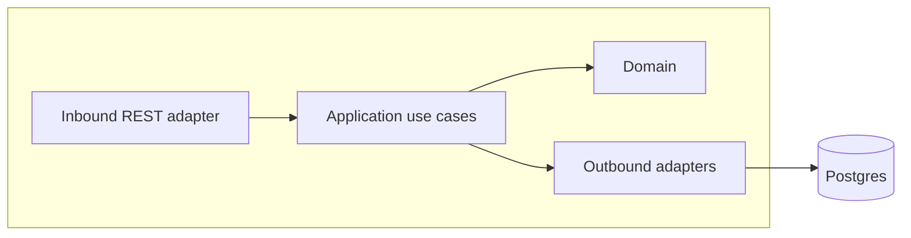

# Architecture Design Doc — `<module>` (`<Bounded Context Name>`)

> **Status:** Stable · **PRD source:** `BACKEND-PRD.md` §6.x · **Owning context:** `<context>` ·
> **Package root:** `org.shakvilla.beatzmedia.<module>`
>
> This ADD is consumed by Claude Code agents. It is the design contract for the module: an agent
> reads it, plans the listed work units, implements within the stated ports/adapters, writes the
> tests, and opens a PR. Do not invent endpoints or fields not traceable to the PRD / `API-CONTRACT.md`.

## 1. Purpose & responsibilities

One paragraph: what this module owns, what it explicitly does **not** own, and which surfaces (Fan /
Studio / Admin) and PRD HLFRs it serves. List the HLFR IDs covered.

## 2. Context & dependencies (C4 component view)



State the **dependency rule** for this module and which other modules it calls (via input ports) vs.
which domain events it publishes/consumes. Persistence is never shared across modules.

## 3. Domain model

- **Aggregates / entities / value objects** — table: name · kind · key fields · notes.
- **Enums** — lifted verbatim from frontend types / PRD §3.2.
- **Invariants** — the INV-* this module enforces, stated as guard conditions.

```mermaid
erDiagram
  %% ER overview of this module's owned tables and key relationships
```

## 4. Application layer (ports)

### 4.1 Input ports (use cases)

Java interface signatures (no bodies). Example:

```java
public interface CheckoutUseCase {
    CheckoutResult checkout(AccountId account, IdempotencyKey key, PaymentMethodId method);
}
```

For each: trigger, authorization, idempotency, emitted events, and the LLFR it satisfies.

### 4.2 Output ports

Java interface signatures the module needs the outside world to fulfil (repositories, gateways,
mailer, clock, id generator). One line each on the implementing outbound adapter.

## 5. Adapters

### 5.1 Inbound — REST resources

Endpoint table: `Method · Path · Auth/scope · Request DTO · Response DTO · Success · Error codes ·
LLFR`. Paths/verbs/shapes lifted from `API-CONTRACT.md`.

### 5.2 Outbound — persistence & integrations

Repository/adapter responsibilities; external clients (MoMo/card/bank, S3, SMTP/SMS); mapping
strategy (domain ↔ JPA entity); transaction boundaries.

## 6. DTOs & API shapes

Field-level lists for request/response DTOs, traceable to `Frontend/src/types/index.ts`. Note money
is `{ amount, currency }`, durations are whole seconds, timestamps ISO-8601.

## 7. Persistence schema & migrations

SQL DDL for owned tables (types, keys, indexes, constraints, money in minor units). Flyway migration
list (`V<n>__<desc>.sql`) and any repeatable seed contribution.

## 8. Key flows

```mermaid
sequenceDiagram
  %% the 1-3 most important flows for this module (e.g. checkout->settle->grant)
```

State machines where relevant:

```mermaid
stateDiagram-v2
  %% e.g. order pending --> paid --> refunded
```

## 9. Cross-cutting hooks

Auth/scope rules, idempotency, audit entries emitted (INV-10), rate limits, feature flags, error
model usage, observability (metrics/traces of note).

## 10. Work units & build order

Table of the PRD work units this module implements (`WU-*`), their LLFR coverage, dependencies, and
the recommended order. Cross-reference PRD §8.

## 11. Testing plan

Unit (domain/use-case with fakes), integration (Testcontainers Postgres/MinIO, REST-assured),
contract (response validates against frontend types), and the key Given/When/Then acceptance cases
from the PRD LLFRs. State coverage expectations.

## 12. Definition of done (module-specific)

The global DoD (PRD §8) plus any module-specific gates (e.g. ledger balanced; preview never serves
full audio; splits sum ≤ 100). An agent must satisfy all of these before opening a PR.
