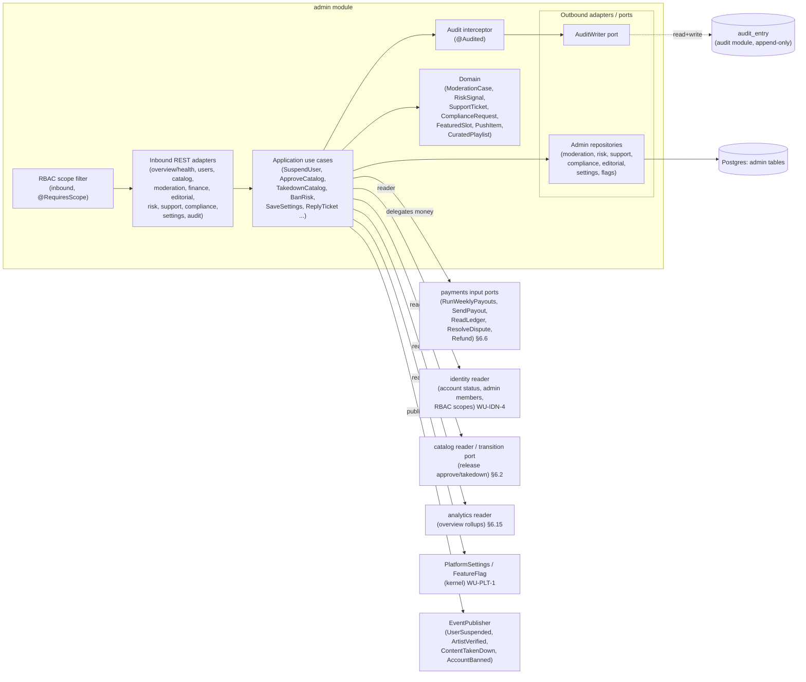
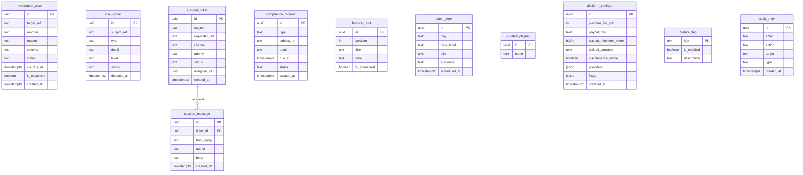
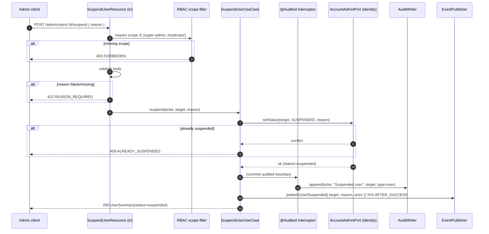
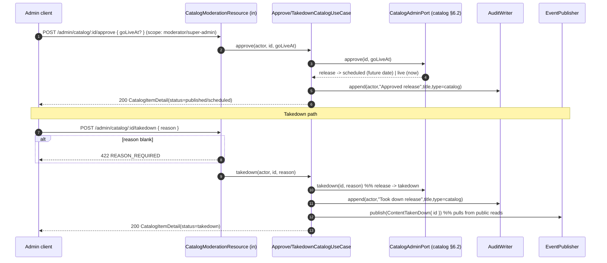
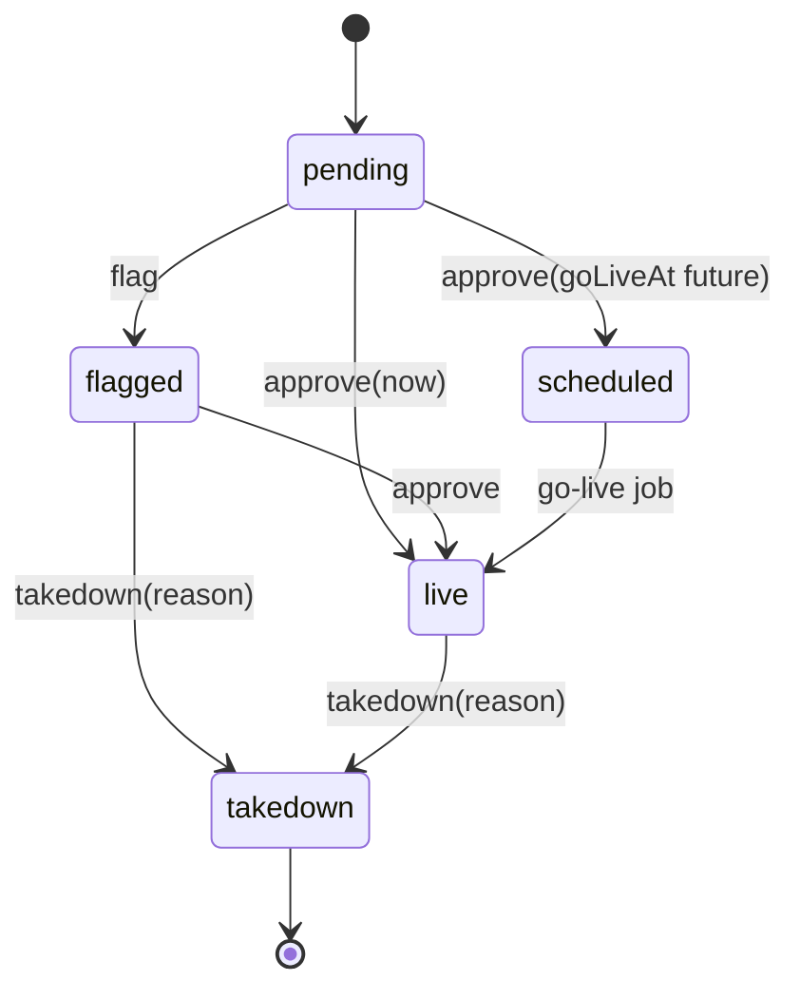

# Architecture Design Doc — `admin` (`Platform Operations & Moderation`)

> **Status:** Stable · **PRD source:** `BACKEND-PRD.md` §6.12, §6.6 (finance delegation), §6.15
> (audit), §9.1 (RBAC), §10 (compliance), OQ-1 · **Owning context:** `admin` ·
> **Package root:** `org.shakvilla.beatzmedia.admin`
>
> This ADD is consumed by Claude Code agents. It is the design contract for BeatzClik's largest
> admin/ops module: an agent reads it, plans the listed work units, implements within the stated
> ports/adapters, writes the tests, and opens a PR. Do not invent endpoints or fields not traceable to
> the PRD / `API-CONTRACT.md` (§12 admin, §13 audit, §14 settings). **Two cross-cutting invariants
> dominate this module:** every privileged mutation appends exactly one immutable `AuditEntry` (INV-10),
> and every endpoint is gated by a server-enforced RBAC scope (§9.1) re-checked in the application
> layer. `admin` owns *operational* state and *delegates* all money mechanics to `payments` (§6.6).

## 1. Purpose & responsibilities

The `admin` module is the platform's back-office: it powers the standalone admin console
(`admin.beatzclik.com`) across **overview & health** (KPIs, GMV series, system metrics), **user
administration** (lookup/detail, verify-artist, suspend, reactivate, impersonate, DSAR data-export),
**catalog moderation** (approve/flag/takedown driving release transitions), the **moderation queue**
(reports with SLA/escalation + queue actions), **finance operations** (a read overview plus action
endpoints that *delegate* to `payments` for all money movement), **editorial** (featured slots, push
schedule, curated playlists), **trust & safety** (risk signals review/clear/ban), **support**
(ticket inbox, threads, reply/assign/resolve), **compliance** (DSAR export/delete, DMCA takedown, tax
statements — tied to the Ghana Data Protection Act, §10), **platform settings & feature flags**
(super-admin only), and **audit read** (paged trail; the write side is automatic). It explicitly does
**not** own: money/ledger/payout/dispute mechanics (delegated to `payments` §6.6), account credentials
or admin-team membership/RBAC role storage (owned by `identity`, WU-IDN-4), the canonical catalog /
release lifecycle (owned by `catalog` — `admin` *requests* transitions), the audit-write interceptor
machinery itself (owned by the `audit` cross-cutting module, WU-AUD-1 — `admin` *invokes* `AuditWriter`
and *reads* `audit_entry`), and `PlatformSettings`/`FeatureFlag` enforcement plumbing (kernel/platform,
WU-PLT-1 — `admin` *edits* the values). Persistence is private; cross-module references are by id only,
resolved through reader ports. Surfaces served: **Admin** exclusively.

**HLFRs covered:** ADMIN-01 (overview & health), ADMIN-02 (user admin), ADMIN-03 (catalog
moderation), ADMIN-04 (moderation queue), ADMIN-05 (finance ops — delegated), ADMIN-06 (editorial),
ADMIN-07 (trust & safety), ADMIN-08 (support), ADMIN-09 (compliance), ADMIN-10 (settings & flags),
ADMIN-11 (audit read). Work units **WU-ADM-1..8**, depending on **WU-IDN-4** (RBAC + admin members),
**WU-AUD-1** (audit writer/read), **WU-PAY-4/5** (finance delegation), **WU-PLT-1** (settings/flags).

## 2. Context & dependencies (C4 component view)

The dependency rule is strict: inbound REST → application use cases → domain; the application layer
calls **output ports** only. Every privileged use case is wrapped by an audit interceptor that calls
`AuditWriter` after a successful transaction. The inbound adapter applies an **RBAC scope filter** and
the application layer re-checks resource scope (INV / §9.1). Finance, catalog, and user reads cross
into other modules **through reader ports only** — never via shared persistence. `admin` owns no money
logic; finance action endpoints are thin pass-throughs to `payments` input ports.



**Dependency rule for this module.** `admin` calls other modules **only** through their input ports /
reader ports and never touches their tables. It *publishes* `ArtistVerified`, `UserSuspended`,
`ContentTakenDown`, `AccountBanned` and *consumes* nothing critical (overview reads are pull, not
event-driven). Finance is a **delegation boundary**: `admin` finance endpoints map the request, check
the `finance` scope, then invoke a `payments` input port; the LLFR satisfied is the payments one
(LLFR-PAYMENTS-02/03/04.*), surfaced under an `/admin/finance/*` path. All `admin` mutations append an
`AuditEntry` (INV-10) regardless of which module ultimately performs the work.

## 3. Domain model

| Name | Kind | Key fields | Notes |
|---|---|---|---|
| `ModerationCase` | Aggregate | `id`, `targetRef`, `reporter`, `reason`, `severity`, `status`, `slaDueAt`, `escalated` | Queue item; report against catalog/comment/profile/stream. `targetRef` is an opaque id into another module. |
| `RiskSignal` | Aggregate | `id`, `subjectRef`, `type`, `detail`, `level`, `status`, `detectedAt` | Trust & safety. `ban` action transitions account state via `identity` reader/port. |
| `SupportTicket` | Aggregate | `id`, `subject`, `requesterRef`, `channel`, `priority`, `status`, `assigneeId`, `createdAt` | Owns its message thread (FK within module). |
| `SupportMessage` | Entity (child of ticket) | `id`, `ticket_id`, `from`, `author`, `text`, `createdAt` | `from ∈ {user, agent}`. |
| `ComplianceRequest` | Aggregate | `id`, `type`, `subjectRef`, `detail`, `dueAt`, `status` | DSAR/Takedown/Tax; ties to Ghana DPA (§10). |
| `FeaturedSlot` | Aggregate | `id`, `position`, `title`, `note`, `isSponsored` | Ordered; feeds `/home` (catalog reader consumes positions). |
| `PushItem` | Aggregate | `id`, `day`, `timeLabel`, `title`, `audience`, `scheduledAt` | Scheduled push entries (editorial). |
| `CuratedPlaylist` | Aggregate | `id`, `name` | Editorial curated list reference. |
| `PlatformSettings` | Singleton aggregate | `platformFeePct`, `payoutDay`, `payoutMinimum`, `defaultCurrency`, `maintenanceMode`, `providers{}`, `flags{}` | Single row; super-admin only; fee change applies to **future** settlements only. |
| `FeatureFlag` | Aggregate | `key`, `enabled`, `description` | Backs `flags{}`; enforced platform-wide (403 `FEATURE_DISABLED`). |
| `AuditEntry` | Read model (audit module) | `id`, `actor`, `action`, `target`, `type`, `createdAt` | Append-only; `admin` only **reads** it (LLFR-ADMIN-11.1) and **writes** via `AuditWriter`. |

**Enums** (lifted verbatim from `Frontend/src/lib/admin-data.ts` / PRD §6.12):

- `AdminRole = Super-admin | Finance | Moderator | Editor | Support` (UI label; canonical JWT scope is
  lowercase-kebab `super-admin | finance | moderator | editor | support` — see PRD R1, OQ-1).
- `UserStatus = active | pending | suspended` (`banned` is a derived account state set via risk `ban`).
- `CatalogStatus = pending | flagged | published | takedown`.
- `ModReason = Copyright | Hate speech | Sexual content | Spam | Impersonation`;
  `ModSeverity = high | med | low`; `ModStatus = open | in_review | resolved`.
- `RiskLevel = high | med | low`; `RiskStatus = open | cleared | banned`.
- `TicketStatus = open | pending | resolved`; `TicketPriority = high | normal | low`.
- `ComplianceType = DSAR-export | DSAR-delete | Takedown | Tax`;
  `ComplianceStatus = new | in_progress | completed | overdue`.
- `AuditType = user | catalog | finance | moderation | settings | editorial`.

**Invariants enforced by this module:**

- **INV-10 (audit):** every privileged mutation appends **exactly one** `AuditEntry` with
  `actor` (from JWT `sub`), `action`, `target`, `type`, `time`. Guard: no audited use case commits
  without a queued audit write in the same transaction boundary.
- **Reason-required:** `suspend` and catalog `takedown` reject a blank/missing `reason` with `422`
  before any state change.
- **RBAC scope:** every endpoint requires its specific scope (table in §8); a request lacking it →
  `403`. Settings mutation requires `super-admin` (`403` otherwise).
- **Fee forward-only:** changing `platformFeePct` never retroactively re-prices settled sales; only
  future settlements read the new value (INV via `payments` reading `PlatformSettings` at settle time).
- **maintenanceMode:** when `true`, non-admin write traffic across the platform returns `503`
  `MAINTENANCE` (enforced by the platform filter; `admin` toggles the flag).



## 4. Application layer (ports)

All input-port methods take an `AdminActor` (resolved from JWT: `sub`, granted scopes) so the
application layer can re-check scope and stamp the audit `actor`. Mutating methods are `@Audited`
(interceptor calls `AuditWriter`) and run inside one `@Transactional` boundary. Money methods are
**not** implemented here — they delegate (see §4.3).

### 4.1 Input ports (use cases)

```java
// ---- Overview & health (ADMIN-01) — auth: any admin (read) ----
public interface GetOverviewUseCase {
    AdminOverview overview(AdminActor actor, AdminRange range);          // LLFR-ADMIN-01.1
}
public interface GetHealthUseCase {
    Health health(AdminActor actor);                                     // LLFR-ADMIN-01.2
}

// ---- User administration (ADMIN-02) ----
public interface ListUsersUseCase {                                      // LLFR-ADMIN-02.1 (read; support ok)
    PagedUsers list(AdminActor actor, UserQuery query, PageRequest page);
}
public interface GetUserUseCase {                                        // LLFR-ADMIN-02.1
    UserDetail get(AdminActor actor, AccountId target);
}
public interface VerifyArtistUseCase {                                   // LLFR-ADMIN-02.2; super-admin/moderator; emits ArtistVerified
    void verify(AdminActor actor, AccountId target);
}
public interface SuspendUserUseCase {                                    // LLFR-ADMIN-02.3; super-admin/moderator; reason required (422); emits UserSuspended
    void suspend(AdminActor actor, AccountId target, SuspendReason reason);
}
public interface ReactivateUserUseCase {                                 // LLFR-ADMIN-02.4; super-admin/moderator
    void reactivate(AdminActor actor, AccountId target);
}
public interface ImpersonateUserUseCase {                                // LLFR-ADMIN-02.5; super-admin ONLY; heavily audited
    ImpersonationToken impersonate(AdminActor actor, AccountId target);
}
public interface ExportUserDataUseCase {                                 // LLFR-ADMIN-02.6; super-admin/support; enqueues DSAR job
    DataExportJobRef export(AdminActor actor, AccountId target);
}

// ---- Catalog moderation (ADMIN-03) — auth: moderator/super-admin ----
public interface ListCatalogModerationUseCase {                         // LLFR-ADMIN-03.1
    PagedCatalog list(AdminActor actor, CatalogQuery query, PageRequest page);
}
public interface GetCatalogItemUseCase {                                // LLFR-ADMIN-03.1
    CatalogItemDetail get(AdminActor actor, ReleaseId id);
}
public interface ApproveCatalogUseCase {                                // LLFR-ADMIN-03.2; drives release -> scheduled/live
    void approve(AdminActor actor, ReleaseId id, Optional<Instant> goLiveAt);
}
public interface FlagCatalogUseCase {                                   // LLFR-ADMIN-03.2
    void flag(AdminActor actor, ReleaseId id, Optional<String> note);
}
public interface TakedownCatalogUseCase {                               // LLFR-ADMIN-03.2; reason required (422); emits ContentTakenDown
    void takedown(AdminActor actor, ReleaseId id, TakedownReason reason);
}

// ---- Moderation queue (ADMIN-04) — auth: moderator/super-admin ----
public interface GetModerationQueueUseCase {                           // LLFR-ADMIN-04.1; + SLA/escalation summary
    ModerationQueue queue(AdminActor actor, ModQuery query);
}
public interface ModerationActionsUseCase {                            // LLFR-ADMIN-04.1; review|approve|remove|escalate|dismiss
    void review(AdminActor actor, ModerationCaseId id);
    void approve(AdminActor actor, ModerationCaseId id);
    void remove(AdminActor actor, ModerationCaseId id);
    void escalate(AdminActor actor, ModerationCaseId id);
    void dismiss(AdminActor actor, ModerationCaseId id);
}

// ---- Finance overview (ADMIN-05.1) — auth: finance/super-admin; READ only here ----
public interface GetFinanceOverviewUseCase {                          // LLFR-ADMIN-05.1 (delegates reads to payments)
    FinanceOverview overview(AdminActor actor, AdminRange range);
}
//  Payout runs / ledger / disputes (ADMIN-05.2/.3/.4) delegate to payments input ports — see §4.3.

// ---- Editorial (ADMIN-06) — auth: editor/super-admin ----
public interface ListEditorialFeaturedUseCase {                       // LLFR-ADMIN-06.1
    List<FeaturedSlot> listFeatured(AdminActor actor);
}
public interface SaveFeaturedUseCase {                                // LLFR-ADMIN-06.1 (ordered PUT)
    List<FeaturedSlot> saveFeatured(AdminActor actor, List<FeaturedSlotInput> ordered);
}
public interface PushScheduleUseCase {                                // LLFR-ADMIN-06.1
    List<PushItem> listPush(AdminActor actor);
    PushItem schedulePush(AdminActor actor, PushItemInput input);
}
public interface CuratedPlaylistsUseCase {                            // LLFR-ADMIN-06.1
    List<CuratedPlaylist> list(AdminActor actor);
    CuratedPlaylist create(AdminActor actor, CuratedPlaylistInput input);
}

// ---- Trust & safety (ADMIN-07) — auth: moderator/super-admin ----
public interface GetRiskUseCase {                                     // LLFR-ADMIN-07.1; KPIs + RiskSignal[]
    RiskBoard risk(AdminActor actor, RiskQuery query);
}
public interface RiskActionsUseCase {                                 // LLFR-ADMIN-07.1; ban -> account banned + sessions revoked
    void review(AdminActor actor, RiskSignalId id);
    void clear(AdminActor actor, RiskSignalId id);
    void ban(AdminActor actor, RiskSignalId id, BanReason reason);    // emits AccountBanned
}

// ---- Support (ADMIN-08) — auth: support+ (all admins) ----
public interface ListSupportTicketsUseCase {                         // LLFR-ADMIN-08.1
    PagedTickets list(AdminActor actor, TicketQuery query, PageRequest page);
}
public interface GetTicketUseCase {                                  // LLFR-ADMIN-08.1 (thread)
    SupportTicketDetail get(AdminActor actor, TicketId id);
}
public interface ReplyTicketUseCase {                               // LLFR-ADMIN-08.1
    SupportMessage reply(AdminActor actor, TicketId id, ReplyText text);
}
public interface AssignTicketUseCase {                              // LLFR-ADMIN-08.1
    void assign(AdminActor actor, TicketId id, AdminMemberId assignee);
}
public interface ResolveTicketUseCase {                            // LLFR-ADMIN-08.1
    void resolve(AdminActor actor, TicketId id);
}
// WU-ADM-7 as-built note: `assign`/`resolve` return the full SupportTicketDetail (not void) — the
// REST layer's response DTO is SupportTicketDto per §5.1's table, so the use case must produce it.
// `ListSupportTickets` returns SupportTicketDetailView (thread included) per item, not a summary —
// `GET /admin/support/tickets` serves a BARE ARRAY of full SupportTicket objects (matching
// `admin-data.ts`'s `getSupportTickets()` and `admin.support.tsx`, which renders a selected list
// item's thread with no extra fetch). The REST resource unwraps the internal Page<> to a bare
// array with a generous default page size (100); status/q filters apply server-side.

// ---- Compliance (ADMIN-09) — auth: super-admin (OQ-1) ----
public interface ListComplianceUseCase {                           // LLFR-ADMIN-09.1
    List<ComplianceRequest> list(AdminActor actor, ComplianceQuery query);
}
public interface ComplianceActionsUseCase {                        // LLFR-ADMIN-09.1
    void start(AdminActor actor, ComplianceRequestId id);
    void complete(AdminActor actor, ComplianceRequestId id);
    DataExportJobRef export(AdminActor actor, ComplianceRequestId id);   // DSAR data export
    void notice(AdminActor actor, ComplianceRequestId id);              // DMCA notice
}

// ---- Platform settings & flags (ADMIN-10) — auth: super-admin ONLY ----
public interface GetSettingsUseCase {                              // LLFR-ADMIN-10.1
    PlatformSettings get(AdminActor actor);
}
public interface SaveSettingsUseCase {                             // LLFR-ADMIN-10.1; fee change forward-only; audited
    PlatformSettings save(AdminActor actor, PlatformSettingsInput input);
}

// ---- Audit read (ADMIN-11) — auth: super-admin (read; OQ-1) ----
public interface ReadAuditUseCase {                               // LLFR-ADMIN-11.1
    PagedAudit read(AdminActor actor, AuditQuery query, PageRequest page);
}
```

### 4.2 Output ports

```java
// Admin-owned persistence (implemented by JPA adapters in this module)
public interface ModerationCaseRepository { /* find/list/save/transition */ }
public interface RiskSignalRepository      { /* find/list/save */ }
public interface SupportTicketRepository   { /* find/list/save + append message */ }
public interface ComplianceRepository      { /* find/list/save */ }
public interface EditorialRepository       { /* featured slots, push items, curated playlists */ }
public interface PlatformSettingsRepository{ PlatformSettings load(); PlatformSettings save(PlatformSettings s); }
public interface FeatureFlagRepository     { Map<String,Boolean> all(); void set(String key, boolean on); }

// Cross-cutting (audit module — INV-10)
public interface AuditWriter {                                    // invoked by @Audited interceptor (WU-AUD-1)
    void append(String actor, String action, String target, AuditType type);
}
public interface AuditReader {                                    // read side for LLFR-ADMIN-11.1
    PagedAudit query(AuditQuery query, PageRequest page);
}

// Clock / ids (kernel)
public interface Clock { Instant now(); }
public interface IdGenerator { String newId(); }

// Domain events (publish AFTER_SUCCESS)
public interface EventPublisher { void publish(DomainEvent event); }
```

### 4.3 Cross-module reader & delegation ports

```java
// identity (WU-IDN-4): account status, admin members/RBAC, session control
public interface IdentityAdminReader {
    UserSummary userSummary(AccountId id);
    PagedUsers  listUsers(UserQuery q, PageRequest p);
    UserDetail  userDetail(AccountId id);
    List<AdminMember> adminMembers();
    Set<AdminScope>   scopesOf(AccountId admin);
}
public interface AccountAdminPort {                               // mutating account state on admin's behalf
    void setStatus(AccountId id, AccountStatus status, String reason);   // suspend/reactivate
    void verifyArtist(AccountId id);
    void ban(AccountId id);                                              // + revoke sessions
    ImpersonationToken issueImpersonation(AccountId id, Duration ttl);   // scoped, time-boxed
    DataExportJobRef enqueueDataExport(AccountId id);
}

// catalog (§6.2): drive release lifecycle transitions
public interface CatalogAdminPort {
    PagedCatalog list(CatalogQuery q, PageRequest p);
    CatalogItemDetail detail(ReleaseId id);
    void approve(ReleaseId id, Optional<Instant> goLiveAt);              // -> scheduled/live
    void flag(ReleaseId id, Optional<String> note);
    void takedown(ReleaseId id, String reason);                         // -> takedown
}

// analytics (§6.15): overview rollups feeding ADMIN-01
public interface AnalyticsAdminReader { AdminOverview overview(AdminRange range); Health health(); }

// payments (§6.6): ALL money mechanics delegate here (ADMIN-05.2/.3/.4)
public interface PaymentsFinancePort {
    FinanceOverview overview(AdminRange range);                         // LLFR-ADMIN-05.1
    PayoutBatchResult runWeeklyPayouts(IdempotencyKey key);            // -> LLFR-PAYMENTS-03.3
    void sendPayout(PayoutId id, IdempotencyKey key);                 // -> LLFR-PAYMENTS-03.4 (KYC-gated)
    PagedLedger ledger(LedgerQuery q, PageRequest p);                 // -> LLFR-PAYMENTS-02.3
    DisputeDetail dispute(DisputeId id);                             // -> LLFR-PAYMENTS-04.*
    void resolveDispute(DisputeId id, DisputeResolution r, IdempotencyKey key); // refund|reject|escalate
}
```

> **Delegation note.** Finance action use cases live conceptually in `admin` only as RBAC + audit
> wrappers; the *behaviour* (idempotency, ledger balancing, KYC gating, ownership clawback) is the
> `payments` module's responsibility (WU-PAY-4/5). The `admin` wrapper checks the `finance` scope,
> forwards an `Idempotency-Key`, and appends an `AuditEntry` of `type=finance`.

## 5. Adapters

### 5.1 Inbound — REST resources

Base path `/v1`. All endpoints require `Authorization: Bearer <jwt>` with at least one admin scope;
the **Required scope** column is enforced by the inbound `@RequiresScope` filter **and** re-checked in
the application layer. Money/side-effect POSTs (finance) require `Idempotency-Key`. Error envelope per
`01-conventions §4`. Common error codes omitted for brevity: `401 UNAUTHENTICATED`, `403 FORBIDDEN`,
`404 NOT_FOUND`, `503 MAINTENANCE` (writes when `maintenanceMode`).

#### §12 Overview / health (HLFR-ADMIN-01)

| Method | Path | Required scope | Request DTO | Response DTO | Code | Error codes | LLFR |
|---|---|---|---|---|---|---|---|
| GET | `/admin/overview?range=24h\|7d\|30d` | any admin | — | `AdminOverview` | 200 | `422 INVALID_RANGE` | 01.1 |
| GET | `/admin/health` | any admin | — | `Health` | 200 | — | 01.2 |

#### §12 Users (HLFR-ADMIN-02)

| Method | Path | Required scope | Request DTO | Response DTO | Code | Error codes | LLFR |
|---|---|---|---|---|---|---|---|
| GET | `/admin/users?q=&filter=fans\|artists\|verified\|suspended&page=&size=` | any admin (support read) | — | `PagedUsers` (+counts) | 200 | `422 INVALID_FILTER` | 02.1 |
| GET | `/admin/users/:id` | any admin (support read) | — | `UserDetail` | 200 | `404 USER_NOT_FOUND` | 02.1 |
| POST | `/admin/users/:id/verify` | super-admin, moderator | — | `UserSummary` | 200 | `404`, `409 ALREADY_VERIFIED` | 02.2 |
| POST | `/admin/users/:id/suspend` | super-admin, moderator | `{ reason }` | `UserSummary` | 200 | `422 REASON_REQUIRED`, `404`, `409 ALREADY_SUSPENDED` | 02.3 |
| POST | `/admin/users/:id/reactivate` | super-admin, moderator | — | `UserSummary` | 200 | `404`, `409 NOT_SUSPENDED` | 02.4 |
| POST | `/admin/users/:id/impersonate` | **super-admin only** | — | `ImpersonationToken` | 200 | `403 SCOPE_REQUIRED`, `404` | 02.5 |
| POST | `/admin/users/:id/data-export` | super-admin, support | — | `DataExportJobRef` | 202 | `404` | 02.6 |

#### §12 Catalog moderation (HLFR-ADMIN-03)

| Method | Path | Required scope | Request DTO | Response DTO | Code | Error codes | LLFR |
|---|---|---|---|---|---|---|---|
| GET | `/admin/catalog?status=pending\|published\|takedown&q=&page=` | moderator, super-admin | — | `PagedCatalog` (+counts) | 200 | `422` | 03.1 |
| GET | `/admin/catalog/:id` | moderator, super-admin | — | `CatalogItemDetail` | 200 | `404 RELEASE_NOT_FOUND` | 03.1 |
| POST | `/admin/catalog/:id/approve` | moderator, super-admin | `{ goLiveAt? }` | `CatalogItemDetail` | 200 | `409 ILLEGAL_TRANSITION` | 03.2 |
| POST | `/admin/catalog/:id/flag` | moderator, super-admin | `{ note? }` | `CatalogItemDetail` | 200 | `409 ILLEGAL_TRANSITION` | 03.2 |
| POST | `/admin/catalog/:id/takedown` | moderator, super-admin | `{ reason }` | `CatalogItemDetail` | 200 | `422 REASON_REQUIRED`, `409 ILLEGAL_TRANSITION` | 03.2 |

#### §12 Moderation queue (HLFR-ADMIN-04)

| Method | Path | Required scope | Request DTO | Response DTO | Code | Error codes | LLFR |
|---|---|---|---|---|---|---|---|
| GET | `/admin/moderation?status=&type=` | moderator, super-admin | — | `ModerationQueue` (+SLA summary) | 200 | `422` | 04.1 |
| POST | `/admin/moderation/:id/review` | moderator, super-admin | — | `ModerationCaseDto` | 200 | `404`, `409` | 04.1 |
| POST | `/admin/moderation/:id/approve` | moderator, super-admin | — | `ModerationCaseDto` | 200 | `404`, `409` | 04.1 |
| POST | `/admin/moderation/:id/remove` | moderator, super-admin | `{ reason? }` | `ModerationCaseDto` | 200 | `404`, `409` | 04.1 |
| POST | `/admin/moderation/:id/escalate` | moderator, super-admin | — | `ModerationCaseDto` | 200 | `404`, `409` | 04.1 |
| POST | `/admin/moderation/:id/dismiss` | moderator, super-admin | — | `ModerationCaseDto` | 200 | `404`, `409` | 04.1 |

#### §12 Finance (HLFR-ADMIN-05 — **delegates to `payments` §6.6**)

| Method | Path | Required scope | Request DTO | Response DTO | Code | Error codes | LLFR (payments cross-ref) |
|---|---|---|---|---|---|---|---|
| GET | `/admin/finance?range=` | finance, super-admin | — | `FinanceOverview` | 200 | `422` | ADMIN-05.1 |
| POST | `/admin/finance/payouts/run-weekly` | finance, super-admin | `Idempotency-Key` | `PayoutBatchResult` | 200 | `409 PAYOUT_RUN_IN_PROGRESS` | ADMIN-05.2 → **LLFR-PAYMENTS-03.3** |
| POST | `/admin/finance/payouts/:id/send` | finance, super-admin | `Idempotency-Key` | `PayoutResult` | 200 | `409 KYC_REQUIRED`, `404` | ADMIN-05.2 → **LLFR-PAYMENTS-03.4** |
| GET | `/admin/finance/ledger?type=&q=&page=` | finance, super-admin | — | `PagedLedger` | 200 | `422` | ADMIN-05.3 → **LLFR-PAYMENTS-02.3** |
| GET | `/admin/finance/disputes/:id` | finance, super-admin | — | `DisputeDetail` (+timeline) | 200 | `404` | ADMIN-05.4 → **LLFR-PAYMENTS-04.*** |
| POST | `/admin/finance/disputes/:id/refund` | finance, super-admin | `{ amount }`, `Idempotency-Key` | `DisputeDetail` | 200 | `422`, `409 ILLEGAL_TRANSITION` | ADMIN-05.4 → **LLFR-PAYMENTS-04.*** |
| POST | `/admin/finance/disputes/:id/reject` | finance, super-admin | — | `DisputeDetail` | 200 | `409` | ADMIN-05.4 → **LLFR-PAYMENTS-04.*** |
| POST | `/admin/finance/disputes/:id/escalate` | finance, super-admin | — | `DisputeDetail` | 200 | `409` | ADMIN-05.4 → **LLFR-PAYMENTS-04.*** |

#### §12 Editorial (HLFR-ADMIN-06)

| Method | Path | Required scope | Request DTO | Response DTO | Code | Error codes | LLFR |
|---|---|---|---|---|---|---|---|
| GET | `/admin/editorial/featured` | editor, super-admin | — | `FeaturedSlot[]` | 200 | — | 06.1 |
| PUT | `/admin/editorial/featured` | editor, super-admin | `FeaturedSlotInput[]` (ordered) | `FeaturedSlot[]` | 200 | `422` | 06.1 |
| GET | `/admin/editorial/push` | editor, super-admin | — | `PushItem[]` | 200 | — | 06.1 |
| POST | `/admin/editorial/push` | editor, super-admin | `PushItemInput` | `PushItem` | 201 | `422` | 06.1 |
| GET | `/admin/editorial/playlists` | editor, super-admin | — | `CuratedPlaylist[]` | 200 | — | 06.1 |
| POST | `/admin/editorial/playlists` | editor, super-admin | `CuratedPlaylistInput` | `CuratedPlaylist` | 201 | `422` | 06.1 |

#### §12 Trust & safety (HLFR-ADMIN-07)

| Method | Path | Required scope | Request DTO | Response DTO | Code | Error codes | LLFR |
|---|---|---|---|---|---|---|---|
| GET | `/admin/risk` | moderator, super-admin | — | `RiskBoard` (KPIs + `RiskSignal[]`) | 200 | — | 07.1 |
| POST | `/admin/risk/:id/review` | moderator, super-admin | — | `RiskSignal` | 200 | `404`, `409` | 07.1 |
| POST | `/admin/risk/:id/clear` | moderator, super-admin | — | `RiskSignal` | 200 | `404`, `409` | 07.1 |
| POST | `/admin/risk/:id/ban` | moderator, super-admin | `{ reason }` | `RiskSignal` | 200 | `422 REASON_REQUIRED`, `404` | 07.1 |

#### §12 Support (HLFR-ADMIN-08)

| Method | Path | Required scope | Request DTO | Response DTO | Code | Error codes | LLFR |
|---|---|---|---|---|---|---|---|
| GET | `/admin/support/tickets?status=&q=` | any admin (support+) | — | `SupportTicket[]` (bare array, full thread) | 200 | `422` | 08.1 |
| GET | `/admin/support/tickets/:id` | any admin | — | `SupportTicket` (thread) | 200 | `404` | 08.1 |
| POST | `/admin/support/tickets/:id/reply` | any admin | `{ text }` | `SupportMessage` | 201 | `422 VALIDATION`, `404` | 08.1 |
| POST | `/admin/support/tickets/:id/assign` | any admin | `{ assigneeId }` | `SupportTicket` | 200 | `404` | 08.1 |
| POST | `/admin/support/tickets/:id/resolve` | any admin | — | `SupportTicket` | 200 | `404`, `409 ILLEGAL_TRANSITION` | 08.1 |

> **WU-ADM-7 as-built.** `GET /admin/support/tickets` returns a **bare array** (not a `{ items,
> page, size, total }` envelope) of full `SupportTicket` objects including `messages` — this
> mirrors `Frontend/src/lib/admin-data.ts`'s `getSupportTickets()` mock and `admin.support.tsx`,
> which renders a selected list item's thread with no extra fetch. RBAC: `@RolesAllowed` accepts
> all five admin roles (support is `RW` for every role per §8's matrix); no additional
> application-layer narrowing is needed (unlike compliance/settings, which are super-admin only).
> `requesterRef` resolves to a display name via the `IdentityReader` output port (reads the
> identity module's `account` JPA entity in-process — no cross-module FK, mirrors
> `library.CatalogReaderAdapter`). Audit entries use `AuditType.USER` (the wire `AuditType` union
> in `admin-data.ts` has no dedicated `support` value).

#### §12 Compliance (HLFR-ADMIN-09)

| Method | Path | Required scope | Request DTO | Response DTO | Code | Error codes | LLFR |
|---|---|---|---|---|---|---|---|
| GET | `/admin/compliance?type=DSAR-export\|DSAR-delete\|Takedown\|Tax` | super-admin (OQ-1) | — | `ComplianceRequest[]` | 200 | `422` | 09.1 |
| POST | `/admin/compliance/:id/start` | super-admin | — | `ComplianceRequest` | 200 | `404`, `409` | 09.1 |
| POST | `/admin/compliance/:id/complete` | super-admin | — | `ComplianceRequest` | 200 | `404`, `409` | 09.1 |
| POST | `/admin/compliance/:id/export` | super-admin | — | `DataExportJobRef` | 202 | `404` | 09.1 |
| POST | `/admin/compliance/:id/notice` | super-admin | — | `ComplianceRequest` | 200 | `404` | 09.1 |

#### §13 Audit log (HLFR-ADMIN-11)

| Method | Path | Required scope | Request DTO | Response DTO | Code | Error codes | LLFR |
|---|---|---|---|---|---|---|---|
| GET | `/admin/audit?type=&q=&page=` | **super-admin** (read; OQ-1) | — | `PagedAudit` (`AuditEntry[]`) | 200 | `422 INVALID_TYPE` | 11.1 |

#### §14 Platform settings (HLFR-ADMIN-10 — **super-admin only**)

| Method | Path | Required scope | Request DTO | Response DTO | Code | Error codes | LLFR |
|---|---|---|---|---|---|---|---|
| GET | `/admin/settings` | super-admin | — | `PlatformSettings` | 200 | `403 SCOPE_REQUIRED` | 10.1 |
| PUT | `/admin/settings` | **super-admin only** | `PlatformSettingsInput` | `PlatformSettings` | 200 | `403 SCOPE_REQUIRED`, `422` | 10.1 |

> `/admin/team*` (§14) is owned by `identity` (WU-IDN-4), not `admin`; listed in `identity.md`.

### 5.2 Outbound — persistence & integrations

- **Admin repositories** (JPA, this module): `moderation_case`, `risk_signal`, `support_ticket` +
  `support_message`, `compliance_request`, `featured_slot`, `push_item`, `curated_playlist`,
  `platform_settings`, `feature_flag`. Domain ↔ JPA mapping in the persistence adapter; domain objects
  carry no ORM annotations. Transaction boundary = the use-case application service (`@Transactional`).
- **AuditWriter / AuditReader** (audit module, WU-AUD-1): `append` is called from the `@Audited`
  interceptor; `query` backs `/admin/audit`. `admin` never writes `audit_entry` directly.
- **Cross-module adapters:** `IdentityAdminReader` / `AccountAdminPort` (identity), `CatalogAdminPort`
  (catalog), `AnalyticsAdminReader` (analytics), `PaymentsFinancePort` (payments). All in-process port
  calls; no shared DB. Money paths forward the `Idempotency-Key`.
- **Mapping strategy:** money on the API surface is `{ amount, currency }`; persisted as `*_minor`
  `BIGINT` (only `platform_settings.payout_minimum_minor` here — `admin` stores almost no money).
  Timestamps `TIMESTAMPTZ` (UTC), serialized ISO-8601.

## 6. DTOs & API shapes

Traceable to `Frontend/src/lib/admin-data.ts`. Money is `{ amount: decimal cedis, currency: "GHS" }`;
KPI counts are integers; timestamps ISO-8601.

```jsonc
AdminOverview {
  rangeLabel: string,
  kpis: { activeUsers: int, streams: int, gmv: Money, newArtists: int,
          deltas: { users: int, streams: int, gmv: int } },
  gmvByDay: number[],
  needsAttention: [{ id, label, sub, to }],
  topArtists: [{ name, revenue: Money }],
  paymentMethods: [{ name, value: Money }]
}

Health {
  status: "normal" | "degraded",
  metrics: [{ label, value, sub }],
  listeners: number[],                       // concurrent-listeners series
  incidents: [{ id, title, date, status: "resolved" | "open" }]
}

UserDetail {                                  // detail page (reader from identity)
  summary: { id, name, email, role: "fan"|"artist", verified: bool,
             joined: ISO, lastActive: ISO, status: "active"|"pending"|"suspended" },
  activity: [{ id, text, time }],
  orders: [{ id, item, amount: Money, date }],
  devices: [{ id, device, location, lastActive, current: bool }],
  actionLog: [{ id, action, by, time }]
}

PlatformSettings {
  platformFeePct: int, payoutDay: string, payoutMinimum: Money, defaultCurrency: string,
  maintenanceMode: bool,
  providers: { momo: bool, vodafone: bool, airteltigo: bool, card: bool, bank: bool },
  flags: { artistSignups: bool, podcasts: bool, events: bool, tipping: bool, fanMessaging: bool }
}

AuditEntry  { id, actor, action, target, type: "user"|"catalog"|"finance"|"moderation"|"settings"|"editorial", time: ISO }
ComplianceRequest { id, type: "DSAR-export"|"DSAR-delete"|"Takedown"|"Tax", subject, detail,
                    due: ISO, status: "new"|"in_progress"|"completed"|"overdue" }
RiskSignal  { id, subject, type, detail, level: "high"|"med"|"low", time: ISO, status: "open"|"cleared"|"banned" }
SupportTicket { id, subject, requester, channel, priority: "high"|"normal"|"low",
                status: "open"|"pending"|"resolved", age,
                messages: [{ id, from: "user"|"agent", author, text, time }] }
FeaturedSlot { id, title, note, sponsored?: bool }   // PUT body carries ordered position
ImpersonationToken { token, expiresAt: ISO, scopes: string[] }   // scoped, time-boxed
```

## 7. Persistence schema & migrations

Money in minor units (`BIGINT`, `*_minor`); timestamps `TIMESTAMPTZ`; `snake_case`. No cross-module
FKs (`*_ref` columns hold opaque ids into other modules). Indexes on every documented filter.

```sql
-- platform_settings: single-row config (super-admin only)
CREATE TABLE platform_settings (
    id                  UUID PRIMARY KEY,
    platform_fee_pct    INT          NOT NULL DEFAULT 30 CHECK (platform_fee_pct BETWEEN 0 AND 100),
    payout_day          TEXT         NOT NULL DEFAULT 'Friday',
    payout_minimum_minor BIGINT      NOT NULL DEFAULT 1000,          -- ₵10.00
    default_currency    TEXT         NOT NULL DEFAULT 'GHS',
    maintenance_mode    BOOLEAN      NOT NULL DEFAULT FALSE,
    providers           JSONB        NOT NULL DEFAULT '{}'::jsonb,   -- {momo,vodafone,airteltigo,card,bank}
    flags               JSONB        NOT NULL DEFAULT '{}'::jsonb,   -- {artistSignups,podcasts,events,tipping,fanMessaging}
    updated_at          TIMESTAMPTZ  NOT NULL DEFAULT now(),
    CONSTRAINT platform_settings_singleton CHECK (id = '00000000-0000-0000-0000-000000000001')
);

CREATE TABLE feature_flag (
    key          TEXT PRIMARY KEY,
    is_enabled   BOOLEAN     NOT NULL DEFAULT TRUE,
    description  TEXT
);

-- audit_entry: APPEND-ONLY (no UPDATE/DELETE; enforced by a rule/trigger and DB grants)
CREATE TABLE audit_entry (
    id          UUID PRIMARY KEY,
    actor       TEXT        NOT NULL,
    action      TEXT        NOT NULL,
    target      TEXT        NOT NULL,
    type        TEXT        NOT NULL CHECK (type IN ('user','catalog','finance','moderation','settings','editorial')),
    created_at  TIMESTAMPTZ NOT NULL DEFAULT now()
);
CREATE INDEX idx_audit_type_created ON audit_entry (type, created_at DESC);
CREATE INDEX idx_audit_actor        ON audit_entry (actor);
CREATE RULE audit_no_update AS ON UPDATE TO audit_entry DO INSTEAD NOTHING;
CREATE RULE audit_no_delete AS ON DELETE TO audit_entry DO INSTEAD NOTHING;

CREATE TABLE moderation_case (
    id           UUID PRIMARY KEY,
    target_ref   TEXT        NOT NULL,
    reporter     TEXT        NOT NULL,
    reason       TEXT        NOT NULL CHECK (reason IN ('Copyright','Hate speech','Sexual content','Spam','Impersonation')),
    severity     TEXT        NOT NULL CHECK (severity IN ('high','med','low')),
    status       TEXT        NOT NULL DEFAULT 'open' CHECK (status IN ('open','in_review','resolved')),
    sla_due_at   TIMESTAMPTZ,
    is_escalated BOOLEAN     NOT NULL DEFAULT FALSE,
    created_at   TIMESTAMPTZ NOT NULL DEFAULT now()
);
CREATE INDEX idx_mod_status_type ON moderation_case (status, reason);
CREATE INDEX idx_mod_sla         ON moderation_case (sla_due_at);

CREATE TABLE risk_signal (
    id           UUID PRIMARY KEY,
    subject_ref  TEXT        NOT NULL,
    type         TEXT        NOT NULL,
    detail       TEXT,
    level        TEXT        NOT NULL CHECK (level IN ('high','med','low')),
    status       TEXT        NOT NULL DEFAULT 'open' CHECK (status IN ('open','cleared','banned')),
    detected_at  TIMESTAMPTZ NOT NULL DEFAULT now()
);
CREATE INDEX idx_risk_status_level ON risk_signal (status, level);

CREATE TABLE support_ticket (
    id           UUID PRIMARY KEY,
    subject      TEXT        NOT NULL,
    requester_ref TEXT       NOT NULL,
    channel      TEXT        NOT NULL,
    priority     TEXT        NOT NULL DEFAULT 'normal' CHECK (priority IN ('high','normal','low')),
    status       TEXT        NOT NULL DEFAULT 'open' CHECK (status IN ('open','pending','resolved')),
    assignee_id  UUID,
    created_at   TIMESTAMPTZ NOT NULL DEFAULT now()
);
CREATE INDEX idx_ticket_status ON support_ticket (status, priority);

CREATE TABLE support_message (
    id          UUID PRIMARY KEY,
    ticket_id   UUID        NOT NULL REFERENCES support_ticket(id) ON DELETE CASCADE,
    from_party  TEXT        NOT NULL CHECK (from_party IN ('user','agent')),
    author      TEXT        NOT NULL,
    body        TEXT        NOT NULL,
    created_at  TIMESTAMPTZ NOT NULL DEFAULT now()
);
CREATE INDEX idx_msg_ticket ON support_message (ticket_id, created_at);

CREATE TABLE compliance_request (
    id           UUID PRIMARY KEY,
    type         TEXT        NOT NULL CHECK (type IN ('DSAR-export','DSAR-delete','Takedown','Tax')),
    subject_ref  TEXT        NOT NULL,
    detail       TEXT,
    due_at       TIMESTAMPTZ,
    status       TEXT        NOT NULL DEFAULT 'new' CHECK (status IN ('new','in_progress','completed','overdue')),
    created_at   TIMESTAMPTZ NOT NULL DEFAULT now()
);
CREATE INDEX idx_compliance_type_status ON compliance_request (type, status);
CREATE INDEX idx_compliance_due         ON compliance_request (due_at);

CREATE TABLE featured_slot (
    id           UUID PRIMARY KEY,
    position     INT         NOT NULL,
    title        TEXT        NOT NULL,
    note         TEXT,
    is_sponsored BOOLEAN     NOT NULL DEFAULT FALSE,
    UNIQUE (position)
);

CREATE TABLE push_item (
    id           UUID PRIMARY KEY,
    day          TEXT        NOT NULL,
    time_label   TEXT        NOT NULL,
    title        TEXT        NOT NULL,
    audience     TEXT        NOT NULL,
    scheduled_at TIMESTAMPTZ
);

CREATE TABLE curated_playlist (
    id           UUID PRIMARY KEY,
    name         TEXT        NOT NULL
);
```

**Flyway migration list** (`src/main/resources/db/migration/`, forward-only). This §7 sketch used
hypothetical `V40..V45` numbers; the module's actual migrations are allocated at build time from
the shared V9xx band via `next-migration-version.sh --module admin` (data-and-migrations §4.1), so
the as-built numbers differ from this sketch — updated here as each WU lands:

- `V950__admin_support.sql` — `support_ticket`, `support_message` (**WU-ADM-7**, as actually
  scoped/built: LLFR-ADMIN-08.1 support tickets — note this differs from this ADD's original §10
  work-unit table, which had sketched WU-ADM-6=support/WU-ADM-7=compliance; the backlog's WU-ADM-7
  is support tickets. §10 is not renumbered here to avoid WU-id churn — treat the backlog as the
  source of truth for WU↔LLFR mapping).
- (planned, not yet built) `platform_settings`/`feature_flag`, `audit_entry`, `moderation_case`/
  `risk_signal`, `compliance_request`, `featured_slot`/`push_item`/`curated_playlist` — allocated
  from the same V9xx band as their owning WUs land.
- `R__seed_dev_data.sql` — dev/test seed contribution: default `platform_settings` row
  (`platform_fee_pct=30`, `payout_minimum_minor=1000`, all providers on), feature flags, sample
  moderation/risk/support rows mirroring `admin-data.ts` (not yet populated for support — left for
  a follow-up WU once more admin modules land, to avoid a large one-off seed diff).

## 8. Key flows

### RBAC scope matrix (role × section)

Lifted from `ADMIN_ROLES` (`admin-data.ts`) and PRD §6.12/§9.1/§14. `RW` = read+write (actions);
`R` = read-only; `—` = no access. Canonical JWT scopes are lowercase-kebab.

| Section | super-admin | finance | moderator | editor | support |
|---|---|---|---|---|---|
| Overview / health | R | R | R | R | R |
| Users — lookup/detail | RW | R | R | R | R |
| Users — verify | RW | — | RW | — | — |
| Users — suspend/reactivate | RW | — | RW | — | — |
| Users — impersonate | RW | — | — | — | — |
| Users — data-export | RW | — | — | — | RW |
| Catalog moderation | RW | — | RW | — | R |
| Moderation queue | RW | — | RW | — | R |
| Finance (ledger/payouts/disputes) | RW | RW | — | — | R |
| Editorial (featured/push/playlists) | RW | — | — | RW | R |
| Trust & safety (risk) | RW | — | RW | — | R |
| Support (tickets) | RW | RW | RW | RW | RW |
| Compliance (DSAR/Takedown/Tax) | RW | — | — | — | — |
| Platform settings & flags | RW | — | — | — | — |
| Audit read | R | — | — | — | — |

> Support's "read-only elsewhere" means it can view non-owned sections but only act in **support** and
> **user lookup + data-export**. The exact verify/data-export/compliance/audit-read split is **OQ-1**
> and must be sourced from a config-driven action→role map (§9), not hard-coded.

### (a) Suspend user — reason required → status change → AuditEntry → UserSuspended



### (b) Catalog approve / takedown driving release transitions



### Catalog moderation state machine (release transitions, §6.2.5)



## 9. Cross-cutting hooks

- **Auth / scope (§9.1).** Inbound `@RequiresScope({...})` filter rejects with `403 FORBIDDEN`
  (`SCOPE_REQUIRED`) before the use case runs; the application layer re-checks via
  `IdentityAdminReader.scopesOf(actor)` and performs resource-level checks (e.g. compliance =
  super-admin only). The action→role map is **config-driven** (OQ-1): a `admin.rbac.action-roles`
  property loaded into a `ScopePolicy` bean, so the verify/data-export/compliance/audit-read split can
  change without code edits.
- **Audit on EVERY mutation (INV-10).** A CDI `@Audited` interceptor wraps every mutating use case;
  after the transaction commits it calls `AuditWriter.append(actor, action, target, type)`. Exactly
  one row per mutation. Reads are not audited. `actor` comes from JWT `sub` (never client-supplied).
- **Reason-required (422).** `suspend`, catalog `takedown`, and risk `ban` reject blank/missing
  `reason` with `422 REASON_REQUIRED` *before* any state change or audit write.
- **Impersonation — heavily audited.** `ImpersonateUserUseCase` issues a scoped, **time-boxed** token
  (short TTL) via `AccountAdminPort.issueImpersonation`; the audit entry records actor, target, and
  token expiry. Super-admin only.
- **maintenanceMode → 503.** When `platform_settings.maintenance_mode = true`, the platform filter
  returns `503 MAINTENANCE` for non-admin write traffic; admins (this module) remain operational so
  they can toggle it back.
- **Feature flags → 403.** `flags{}` (`artistSignups, podcasts, events, tipping, fanMessaging`) are
  enforced at the relevant *consumer* endpoints (not here) returning `403 FEATURE_DISABLED`; `admin`
  edits the flag values via `SaveSettings`.
- **Settings super-admin only (403).** `GET/PUT /admin/settings` require `super-admin`; any other
  scope → `403 SCOPE_REQUIRED`. Changing `platformFeePct` is audited (`type=settings`) and is
  **forward-only** — `payments` reads `platformFeePct` from `PlatformSettings` at settle time, so past
  settlements are unaffected (matches the 28→30 AC).
- **Idempotency.** Finance delegations forward `Idempotency-Key` to `payments`; `admin`'s own
  mutations are naturally idempotent (status transitions guarded by `409 ILLEGAL_TRANSITION`).
- **Error model.** Stable codes: `REASON_REQUIRED` (422), `SCOPE_REQUIRED`/`FORBIDDEN` (403),
  `FEATURE_DISABLED` (403), `MAINTENANCE` (503), `ILLEGAL_TRANSITION`/`ALREADY_SUSPENDED`/
  `ALREADY_VERIFIED`/`NOT_SUSPENDED` (409), `INVALID_RANGE`/`INVALID_FILTER`/`INVALID_TYPE` (422),
  `KYC_REQUIRED`/`PAYOUT_RUN_IN_PROGRESS` (409, from payments).
- **Observability.** Metrics: moderation queue depth, SLA breaches, ticket backlog by status, audit
  append rate, settings-change counter. Spans on every use case; trace id on every request; **no PII
  or secrets** in logs (suspend/ban reasons logged by id reference, not free text).

## 10. Work units & build order

| WU | Scope (LLFRs) | Ports/adapters | Reads/Writes | Depends on |
|---|---|---|---|---|
| **WU-ADM-1** | Overview & health (ADMIN-01.1/.2) | GetOverview, GetHealth; AnalyticsAdminReader | (reads rollups) | WU-IDN-4, WU-ANA-1 |
| **WU-ADM-2** | User admin (ADMIN-02.1–.6) | List/GetUser, Verify, Suspend, Reactivate, Impersonate, ExportUserData; IdentityAdminReader, AccountAdminPort, AuditWriter, EventPublisher | (reads identity) | WU-IDN-4, WU-AUD-1 |
| **WU-ADM-3** | Catalog moderation + queue (ADMIN-03/04) | Approve/Flag/Takedown, ModerationQueue + actions; CatalogAdminPort, AuditWriter | moderation_case | WU-IDN-4, WU-AUD-1, WU-CAT-4 |
| **WU-ADM-4** | Editorial (ADMIN-06.1) | ListFeatured/SaveFeatured, PushSchedule, CuratedPlaylists; AuditWriter | featured_slot, push_item, curated_playlist | WU-IDN-4, WU-AUD-1 |
| **WU-ADM-5** | Trust & safety (ADMIN-07.1) | GetRisk + review/clear/ban; AccountAdminPort, AuditWriter, EventPublisher | risk_signal | WU-IDN-4, WU-AUD-1 |
| **WU-ADM-6** | Support (ADMIN-08.1) | ListTickets/GetTicket/Reply/Assign/Resolve; AuditWriter | support_ticket, support_message | WU-IDN-4, WU-AUD-1 |
| **WU-ADM-7** | Compliance (ADMIN-09.1) | ListCompliance + start/complete/export/notice; AuditWriter | compliance_request | WU-IDN-4, WU-AUD-1 |
| **WU-ADM-8** | Settings & flags (ADMIN-10.1) + Finance overview (ADMIN-05.1) | GetSettings/SaveSettings; PlatformSettingsRepository, FeatureFlagRepository, PaymentsFinancePort, AuditWriter | platform_settings, feature_flag | WU-PLT-1, WU-IDN-4, WU-AUD-1, WU-PAY-4, WU-PAY-5 |

**Build order** (PRD §8.1, Phase 4 — after audit + RBAC foundations): **WU-IDN-4 → WU-AUD-1 →
WU-PLT-1** must exist first (audit + RBAC before any admin mutation). Then **WU-ADM-1** (read-only,
lowest risk) → **WU-ADM-8** (settings/flags, needed by finance) → **WU-ADM-2** (users, needs
identity ports) → **WU-ADM-3** (needs WU-CAT-4 release machine) → **WU-ADM-4/5/6/7** in parallel.
Finance delegations require **WU-PAY-4/5** complete.

## 11. Testing plan

- **Unit (domain/use-case with fakes):** scope policy resolution (config-driven map, OQ-1); audit
  append called exactly once per mutation; reason-required guards; settings fee-change forward-only
  (fake `payments` reads new value only for future settlements); moderation/risk/ticket/compliance
  state transitions reject illegal moves (`409`).
- **Integration (Testcontainers Postgres, REST-assured):** RBAC matrix enforced server-side per
  endpoint; `audit_entry` append-only (UPDATE/DELETE are no-ops); pagination + filters; finance
  delegation forwards `Idempotency-Key` to a fake `PaymentsFinancePort`.
- **Contract:** every response validates against `admin-data.ts` shapes / `API-CONTRACT.md` §12–14
  (OpenAPI contract test green).

**PRD §6.12 acceptance cases (Given/When/Then):**

1. **Suspend without reason → 422.** *Given* a moderator *When* `POST /admin/users/:id/suspend` with
   no `reason` *Then* `422 REASON_REQUIRED` and the user status is unchanged and **no** audit row is
   written. *Given* a reason *Then* status=suspended and exactly one `audit_entry` with
   actor/target/reason exists, and `UserSuspended` is published.
2. **Super-admin fee change audited.** *Given* super-admin *When* `PUT /admin/settings` changes
   `platformFeePct` 28→30 *Then* an `audit_entry` (`type=settings`) records the change **and** new
   sales settle at 30% while previously settled sales are unchanged.
3. **Moderator PUT settings → 403.** *Given* a moderator *When* `PUT /admin/settings` *Then*
   `403 SCOPE_REQUIRED` and no change is persisted and no audit row is written.
4. **Catalog approve transition.** *Given* an `in_review`/`pending` release *When* approve with a
   future `goLiveAt` *Then* it becomes `scheduled` and an `audit_entry` (`type=catalog`) is written.
5. **Impersonation audited.** *Given* super-admin impersonation *Then* an `audit_entry` records actor,
   target, and token expiry; *Given* a moderator *Then* `403`.
6. **Risk ban.** *Given* an open high-risk signal *When* `ban` with reason *Then* the account is
   banned, sessions revoked (via `AccountAdminPort`), signal status=`banned`, audit written.

Coverage ≥ the gate in `sdlc/testing-strategy.md`.

## 12. Definition of done (module-specific)

Global DoD (PRD §8 / `01-conventions §11`) **plus**:

1. **Every mutation audited (INV-10):** an ArchUnit/test gate asserts each mutating use case is
   `@Audited`; an integration test asserts exactly one `audit_entry` row per mutation and none on reads.
2. **RBAC enforced server-side:** the §8 scope matrix is enforced both in the inbound filter and the
   application layer; a parametrised test exercises every (role × endpoint) cell, expecting `403` where
   the matrix says `—`/read-only-on-write.
3. **`audit_entry` is append-only:** UPDATE/DELETE are rejected (rules) and DB grants are write-once.
4. **Reason-required** on suspend / catalog takedown / risk ban returns `422` before any state change.
5. **Settings are super-admin only**, and `platformFeePct` changes are forward-only (verified against a
   fake/real `payments` settlement).
6. **Finance is pure delegation:** no money/ledger logic lives in `admin`; finance endpoints forward to
   `payments` input ports and carry `Idempotency-Key`.
7. **No cross-module FKs / shared persistence;** all cross-module access via reader/delegation ports
   (ArchUnit green). Module ADD updated in the same PR if behaviour changed.
