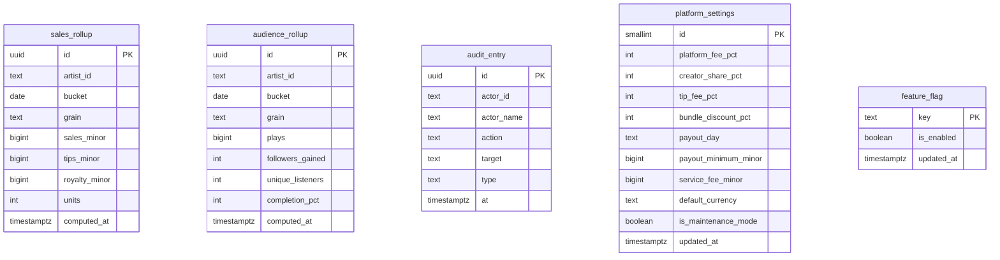
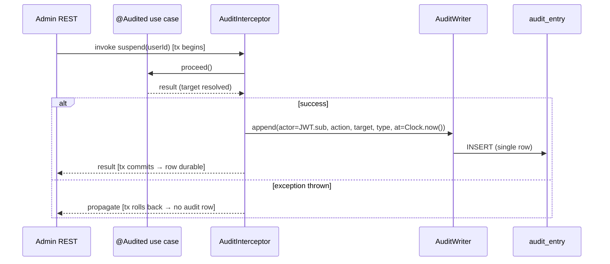
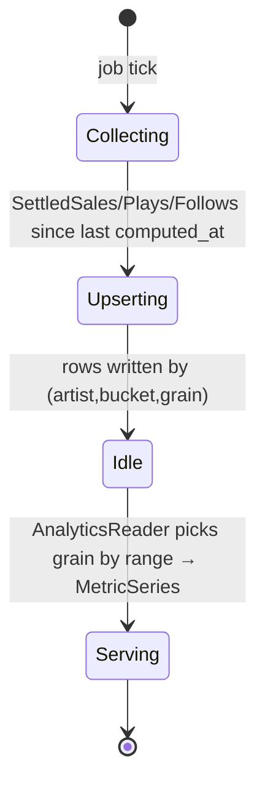

# Architecture Design Doc — `analytics` · `audit` · `platform` (Cross-cutting Kernel)

> **Status:** Stable · **PRD source:** `BACKEND-PRD.md` §6.15 (§3.3, §6.11.3, §6.12.1, §9.5) ·
> **Owning contexts:** `analytics`, `audit`, `platform` ·
> **Package roots:** `org.shakvilla.beatzmedia.analytics`, `org.shakvilla.beatzmedia.audit`,
> `org.shakvilla.beatzmedia.platform`
>
> This ADD is consumed by Claude Code agents. It is the design contract for three cross-cutting kernel
> modules: an agent reads it, plans the listed work units, implements within the stated ports/adapters,
> writes the tests, and opens a PR. Do not invent endpoints or fields not traceable to the PRD /
> `API-CONTRACT.md`. Each template section below is split into **ANALYTICS**, **AUDIT**, and
> **PLATFORM** subsections.

---

## 1. Purpose & responsibilities

These three modules are the *cross-cutting kernel* of the modular monolith. Every other module depends
on them; none of the three owns a user-facing feature on its own. PLT-1 is the Phase-0 foundation that
everything else compiles against.

**ANALYTICS** (`HLFR-ANALYTICS-01` [PROPOSAL], `WU-ANA-1`). Owns the *roll-up* of `play_event`s and
settled sales/tips/follows into time-bucketed series that feed Studio insights (PRD §6.11.3,
`GET /v1/studio/analytics`, `/studio/audience`) and the Admin overview (PRD §6.12.1,
`GET /v1/admin/overview`). It owns `sales_rollup`, `audience_rollup`, and plays counters; it does **not**
own raw `play_event` (playback module), the ledger (payments), or the REST surfaces (studio/admin own
those — analytics exposes only the `AnalyticsReader` port). Reads are served *exclusively from rollups*,
never from raw events (PRD §10).

**AUDIT** (`HLFR-AUDIT-01` [DERIVED], `WU-AUD-1`). Owns the append-only `AuditEntry` log and enforces
**INV-10**: every privileged mutation appends *exactly one* immutable audit row. It provides the
`AuditWriter` output port and an application-layer `@Audited` interceptor wrapped around audited use
cases. It does **not** own the read surface — `GET /v1/admin/audit` (LLFR-ADMIN-11.1) is owned by the
admin module, which queries through an `AuditReader` port. Rows are never updated or deleted.

**PLATFORM** (`HLFR-PLATFORM-01` [PROPOSAL], `WU-PLT-1` foundation + `WU-PLT-2` scheduler). Owns shared
primitives importable by any module's domain: `Money` VO (minor units, **INV-11**), error model
(`ApiError`/`ErrorCode`), pagination (`Page<T>`/`PageRequest`), `Clock` + `IdGenerator` ports,
`PlatformSettings` + `FeatureFlag` runtime config + maintenance mode, and the scheduler infrastructure
(`quarkus-scheduler`) that registers and fans out to the platform's scheduled jobs (**INV-7**, weekly
payout window, payment reconciliation, digests, analytics rollups, search reindex).

**HLFRs covered:** HLFR-ANALYTICS-01, HLFR-AUDIT-01, HLFR-PLATFORM-01.
**Invariants enforced/served:** INV-7 (exactly-once go-live), INV-10 (audit completeness),
INV-11 (money precision).

---

## 2. Context & dependencies (C4 component view)

The kernel is imported by every module; the scheduler fans out to jobs that live in (or call into)
their owning modules.

```mermaid
flowchart LR
  subgraph platform[platform kernel — WU-PLT-1/2]
    KTYPES[Money · Page&lt;T&gt; · ApiError/ErrorCode]
    KPORTS[Clock · IdGenerator ports]
    SETTINGS[PlatformSettingsProvider · FeatureFlags]
    FILTER[Flag/Maintenance enforcement filter]
    SCHED[SchedulerRegistry &#40;quarkus-scheduler&#41;]
  end

  subgraph analytics[analytics — WU-ANA-1]
    AREADER[AnalyticsReader port]
    AJOBS[RollupJob: sales · audience · plays]
    AROLL[(sales_rollup / audience_rollup)]
    AJOBS --> AROLL
    AREADER --> AROLL
  end

  subgraph audit[audit — WU-AUD-1]
    AINT[@Audited interceptor]
    AWRITER[AuditWriter port]
    AREADP[AuditReader port]
    AENT[(audit_entry)]
    AINT --> AWRITER --> AENT
    AREADP --> AENT
  end

  MODULES[All feature modules\nidentity · catalog · commerce · payments · ...]
  STUDIO[studio REST]
  ADMIN[admin REST]

  MODULES -->|import| KTYPES
  MODULES -->|import| KPORTS
  MODULES -->|read config| SETTINGS
  MODULES -.->|inbound writes| FILTER
  MODULES -->|privileged mutation| AINT

  SCHED --> AJOBS
  SCHED --> GOLIVE[go-live job &#40;catalog/podcasts&#41;]
  SCHED --> PAYOUT[weekly payout window &#40;payments&#41;]
  SCHED --> RECON[reconciliation/timeout poll &#40;payments&#41;]
  SCHED --> DIGEST[digest emails &#40;notifications&#41;]
  SCHED --> REINDEX[search reindex &#40;search&#41;]

  STUDIO --> AREADER
  ADMIN --> AREADER
  ADMIN --> AREADP

  SETTINGS --> PSDB[(platform_settings / feature_flag)]
  KPORTS --> ID[UUIDv7/ULID]
```

**Dependency rule.** Hexagonal: domain depends on nothing framework; application depends on domain;
adapters depend on application. The kernel (`platform`) sits *below* every module and may be imported by
any module's domain (per conventions §1) — it never imports a feature module. Analytics and audit
follow the standard module shape (inbound port + outbound persistence) and own their own tables;
**no cross-module foreign keys** (conventions §6). The scheduler in `platform` invokes job ports that
the owning modules implement (e.g. catalog implements the go-live job). Analytics *reads* settled
totals through reader ports exposed by payments/library and counts plays through playback; it never
queries another module's tables directly. Audit publishes nothing; it is invoked synchronously inside
the audited transaction. Persistence is never shared across modules.

---

## 3. Domain model

### 3.1 ANALYTICS

| Name | Kind | Key fields | Notes |
|---|---|---|---|
| `RollupBucket` | VO | `bucket: LocalDate`, `grain: Grain` | Time bucket; grain DAILY/WEEKLY/MONTHLY |
| `SalesRollup` | entity | `artistId`, `bucket`, `grain`, `salesMinor`, `tipsMinor`, `royaltyMinor`, `units` | settled money only, minor units (INV-11) |
| `AudienceRollup` | entity | `artistId`, `bucket`, `grain`, `plays`, `followersGained`, `uniqueListeners`, `completionPct` | engagement counters |
| `MetricSeries` | VO | `total`, `delta`, `current[]`, `previous[]` | shape of `studio-analytics.ts` `MetricSeries` |
| `AnalyticsRange` | enum | — | see below |

**Enums** (lifted from `Frontend/src/lib/studio-analytics.ts` and `admin-data.ts`):

- `AnalyticsRange = 7d | 28d | 90d | 12m | all`; `AudienceRange = 7d | 28d | 90d | 12m`;
  `AdminRange = 24h | 7d | 30d`.
- `Grain = DAILY | WEEKLY | MONTHLY` (the `axis` field).
- `MetricKey = streams | sales | followers | tips`.

**Invariants.** Rollup money columns are minor units (INV-11). A read for `range=R` selects the grain
mandated by that range (28d→DAILY, 90d→WEEKLY, 12m/all→MONTHLY) and the period start derived from
`Clock`; `Σ MetricSeries.current == SalesRollup/AudienceRollup totals over the window` (consistency,
tested §11).

### 3.2 AUDIT

| Name | Kind | Key fields | Notes |
|---|---|---|---|
| `AuditEntry` | entity (immutable) | `id`, `actorId`, `actorName`, `action`, `target`, `type`, `at` | append-only; no setters, no update/delete path |
| `AuditType` | enum | — | `user · catalog · finance · moderation · settings · editorial` (verbatim from `admin-data.ts`) |

**Invariants.** **INV-10** — each audited mutation appends *exactly one* `AuditEntry`. `actorId` from
JWT `sub`; `at` from `Clock` (UTC). Rows are write-once: the JPA entity has no update mapping and the
repo exposes only `append` + read.

### 3.3 PLATFORM

| Name | Kind | Key fields | Notes |
|---|---|---|---|
| `Money` | VO (record) | `minor: long`, `currency: Currency` | INV-11; arithmetic half-up |
| `Page<T>` / `PageRequest` | VO (record) | `items, page, size, total` / `page, size` | conventions §5 |
| `ApiError` / `ErrorCode` | VO / enum | `code, message, field` | error envelope (conventions §4) |
| `PlatformSettings` | aggregate (single row) | fields below | economic constants + maintenance flag |
| `FeatureFlag` | entity | `key`, `enabled` | runtime flag, one row per flag |
| `Clock` / `IdGenerator` | ports | — | UTC clock; UUIDv7/ULID ids |

**`PlatformSettings` fields** (from `admin-data.ts` `PlatformSettings`): `platformFeePct=30`,
`creatorSharePct=70`, `tipFeePct=10`, `bundleDiscountPct=24`, `payoutDay="Friday"`,
`payoutMinimumMinor=1000` (₵10), `serviceFeeMinor=50` (₵0.50), `defaultCurrency="GHS"`,
`maintenanceMode=false`. **Feature flags:** `artistSignups`, `podcasts`, `events`, `tipping`,
`fanMessaging`.

**Invariants.** **INV-11** — money stored as `BIGINT` minor units; conversion only at the adapter
boundary; split/fee math half-up with remainder reconciled. Economic constants come from
`PlatformSettings`, never hard-coded (conventions §2).



---

## 4. Application layer (ports)

### 4.1 ANALYTICS — input & rollup ports

> **Implementation status (WU-ANA-1, done):** `AnalyticsReader.studioInsights` and `RollupJob` are
> implemented exactly as specified below. `audience(...)` and `adminOverview(...)` are **not yet
> implemented** — they are out of WU-ANA-1's scope (owned by a future studio-audience / admin-overview
> WU) and are left here as forward-looking port signatures the ADD anticipates.
>
> **Deviation — snapshot ports are CDI event observers, not pull-based `since(from)` queries.**
> `SettledSalesSource`/`PlayCountSource`/`FollowEventSource` as originally drafted below implied a
> *pull* model (the job calls `since(Instant)` on a sibling module's port at tick time). The
> implementation instead follows the **event-sourced push** pattern already established by every
> other cross-module integration in this codebase (`payments.PaymentSettled` → commerce's
> `PaymentSettledSubscriber`; `payments.TipReceived` → notifications' observer; etc.): each owning
> module fires a canonical CDI domain event `AFTER_SUCCESS`, and analytics owns
> `adapter.in.events.*Observer` classes that turn each event into a row in one of analytics' own
> **staging-fact tables** (`analytics_sale_fact`, `analytics_tip_fact`, `analytics_play_fact`,
> `analytics_follow_fact` — §7). The `RollupJob`s then read/upsert **only from these analytics-owned
> tables**, never a sibling module's schema and never a pull-style port call at tick time. This is
> equivalent in spirit (no cross-module table reads; idempotent; upsert-by-key) but changes the
> port shape from `since(Instant)` pull to `@Observes(AFTER_SUCCESS)` push. Two consequences worth
> recording:
>
> - **Observers run in their own transaction.** An `AFTER_SUCCESS` observer fires *after* the
>   producing transaction has committed, so there is no active transaction when it stages its fact —
>   each `*Observer` is therefore `@Transactional(REQUIRES_NEW)`. (A fact lost because that separate
>   append fails is an acceptable analytics gap; it must never poison the producer's money/ownership
>   transaction, which has already committed.)
> - **Rollup reads are native scalar, not JPA entity queries.** The jobs read-modify-write a bucket
>   once per fact (`find` + native `upsert`). A JPA entity `find` would return the stale
>   first-level-cached instance on the 2nd+ read of a bucket within one window (Hibernate never
>   refreshes managed state from a native write), silently undercounting a bucket with 3+ facts.
>   `find()` therefore reads through a native scalar query; `findRange()` (reader-side, always a
>   fresh request/transaction) stays JPA.
>
> **Carryover (tracked, not dropped):** `audience_rollup.unique_listeners` and `completion_pct`
> columns and the `analytics_play_fact.account_id` needed to compute uniques are in place (§7), but
> the audience job only maintains `plays` and `followers_gained` today — `unique_listeners` /
> `completion_pct` stay 0 until the studio `/studio/audience` WU consumes them (they are not on the
> `studioInsights` KPIs this WU serves). No schema change will be needed to light them up.


### 4.2 AUDIT — writer port + interceptor binding

```java
/** Output port: append exactly one immutable audit row (INV-10). Never updates/deletes. */
public interface AuditWriter {
    void append(AuditEntry entry);
}

/** Read port owned-by-port, implemented by audit, consumed by admin (LLFR-ADMIN-11.1). */
public interface AuditReader {
    Page<AuditEntry> query(AuditFilter filter, PageRequest page);   // by actor/type/time
}

/** Interceptor binding placed on every audited use-case method (application layer). */
@InterceptorBinding
@Target({ ElementType.METHOD, ElementType.TYPE })
@Retention(RetentionPolicy.RUNTIME)
public @interface Audited {
    AuditType type();
    String action();                 // e.g. "Suspended user"; target resolved from result/args
}

/** CDI interceptor that writes one AuditEntry AFTER the audited method succeeds. */
@Audited @Interceptor
public class AuditInterceptor {
    @AroundInvoke Object intercept(InvocationContext ctx) throws Exception; // signature only
}
```

- **`@Audited` / `AuditInterceptor`** — *trigger:* invocation of an audited use case (suspend, verify,
  takedown, payout, refund, settings change, role change, impersonate). *Authz:* method-level; actor =
  JWT `sub`. *Idempotency:* one row per successful invocation; no row on exception (rolls back with the
  transaction). *LLFR:* AUDIT-01, INV-10.

### 4.3 PLATFORM — kernel types & ports

```java
public interface Clock { Instant now(); LocalDate today(ZoneId zone); }

public interface IdGenerator { String newId(); OrderRef newOrderRef(int year); }  // UUIDv7/ULID; BZ-YYYY-NNNNN

public interface FeatureFlags {
    boolean isEnabled(FeatureKey key);
    void set(FeatureKey key, boolean enabled);     // admin-only; audited via @Audited(settings)
}

public interface PlatformSettingsProvider {
    PlatformSettings current();
    PlatformSettings save(PlatformSettings updated);  // admin-only; audited
}

public enum FeatureKey { ARTIST_SIGNUPS, PODCASTS, EVENTS, TIPPING, FAN_MESSAGING }

public record Money(long minor, Currency currency) {
    public static Money ofCedis(BigDecimal cedis);   // half-up * 100
    public BigDecimal toCedis();                      // minor / 100, scale 2
    public Money plus(Money other);                   // same-currency guard
    public Money minus(Money other);
    public Money percentage(int pct);                 // half-up
}

public record PageRequest(int page, int size) { /* defaults size=20, max 100 */ }
public record Page<T>(List<T> items, int page, int size, long total) {}

public record ApiError(String code, String message, String field) {}

public enum ErrorCode {
    VALIDATION, NOT_FOUND, METHOD_NOT_ALLOWED, UNAUTHENTICATED, UNAUTHORIZED, CONFLICT,
    ILLEGAL_TRANSITION, RATE_LIMITED, FEATURE_DISABLED, MAINTENANCE, INTERNAL
    // + per-module additions (PAYLOAD_TOO_LARGE, UNSUPPORTED_FORMAT, identity/catalog codes, …)
}

public record PlatformSettings(
    int platformFeePct, int creatorSharePct, int tipFeePct, int bundleDiscountPct,
    String payoutDay, long payoutMinimumMinor, long serviceFeeMinor,
    Currency defaultCurrency, boolean maintenanceMode) {}
```

**WU-PLT-2 scheduler SPI** (application layer, `application.port.in`):

```java
/**
 * SPI that owning modules implement to register a job with SchedulerRegistry.
 * Implementations are CDI @ApplicationScoped beans; the registry discovers them via
 * Instance<ScheduledJob> at startup.
 */
public interface ScheduledJob {
    /** Stable, unique name — convention: <module>.<action> in lower-kebab-case. */
    String jobName();
    /** Idempotent unit of work; called inside an advisory-lock guard. */
    void runOnce();
}
```

One line each on adapters: `Clock`→`SystemClockAdapter`; `IdGenerator`→`Uuidv7IdGenerator`;
`FeatureFlags`/`PlatformSettingsProvider`→ JPA-backed `feature_flag` / `platform_settings` repos with a
short-TTL in-memory cache; `AuditWriter`/`AuditReader`→`AuditEntryRepository`;
`AnalyticsReader`→`RollupQueryAdapter` over `sales_rollup`/`audience_rollup`;
`ScheduledJob` SPI→`SchedulerRegistry` (outbound adapter, `adapter.out.scheduler`).

---

## 5. Adapters

### 5.1 Inbound — REST resources

The kernel modules expose almost no REST of their own; their ports are consumed by studio/admin. The
endpoints below are the *settings/flag* surface owned by platform (admin) and listed for completeness.

| Method · Path | Auth/scope | Request DTO | Response DTO | Success | Error codes | LLFR |
|---|---|---|---|---|---|---|
| `GET /v1/admin/settings` | super-admin | — | `PlatformSettingsDTO` | 200 | 401/403 | PLATFORM-01.1 |
| `PUT /v1/admin/settings` | super-admin | `PlatformSettingsDTO` | `PlatformSettingsDTO` | 200 | 403/422 | PLATFORM-01.1 |
| `GET /v1/admin/audit` | super-admin | `?actor=&type=&page=&size=` | `Page<AuditEntryDTO>` | 200 | 401/403 | ADMIN-11.1 *(admin module, via `AuditReader`)* |
| `GET /v1/studio/analytics` | artist | `?range=` | `StudioInsightsDTO` | 200 | 401/403 | STUDIO-03.1 *(studio module, via `AnalyticsReader`)* |

### 5.2 Outbound — persistence & integrations

- **Scheduled-job declaration.** The platform `SchedulerRegistry` declares jobs with
  `@Scheduled` (quarkus-scheduler). Cron/interval triggers:

```java
@Scheduled(every = "60s",  identity = "go-live")        void publishDue();           // INV-7
@Scheduled(cron  = "0 0 9 ? * FRI", identity = "payout-window") void weeklyPayoutWindow();
@Scheduled(every = "30s",  identity = "payment-recon")  void reconcileAndTimeout();
@Scheduled(cron  = "0 0 8 * * ?",  identity = "digest") void sendDigests();
@Scheduled(every = "5m",   identity = "analytics-rollup") void runRollups();
@Scheduled(every = "10m",  identity = "search-reindex") void reindexSearch();
```

  Each method delegates to a module-implemented job port; the registry itself holds no business logic.

- **Idempotency of jobs.** Every job is safe to re-run: go-live uses a conditional state transition
  (`UPDATE ... WHERE status='scheduled' AND go_live_at<=now()`) so a row publishes exactly once
  (INV-7); rollups upsert by `(artist_id, bucket, grain)`; reconciliation keys on `providerEventId`;
  digests key on `(account_id, digest_date)`. `@Scheduled(concurrentExecution = SKIP)` prevents overlap;
  a DB advisory lock guards multi-instance runs so only one instance executes a given tick.

- **Flag/maintenance enforcement filter.** A JAX-RS `ContainerRequestFilter` (priority before resource
  dispatch) enforces:
  - `maintenanceMode == true` **and** request is a non-admin write (`POST/PUT/PATCH/DELETE`) →
    `503 MAINTENANCE` (admin scopes bypass; reads pass through where safe).
  - endpoint annotated `@RequiresFeature(FeatureKey.X)` while `FeatureFlags.isEnabled(X) == false` →
    `403 FEATURE_DISABLED`.

- **Persistence.** `platform_settings` is a single-row config (PK fixed `id=1`); `feature_flag` is
  keyed by `key`. Both are cached with a short TTL and invalidated on write. `audit_entry` is
  insert-only (no update/delete repo method). Rollup tables are upserted by the jobs. Transaction
  boundary = the use case / job method (`@Transactional`); the audit row commits in the *same*
  transaction as the mutation it records (INV-10).

---

## 6. DTOs & API shapes

### 6.1 ANALYTICS

`StudioInsightsDTO` (traceable to `studio-analytics.ts` `Analytics`): `rangeLabel`, `axisLabel`,
`labels[]`, `metrics{ streams, sales, followers, tips }` where each is `MetricSeriesDTO { total, delta,
current[], previous[] }`, `fans`, `countries[]`, `topTracks[]`, `ages[]`,
`revenue{ sales, streaming, tips }` (each `Money`), `engagement{ completion, save, skip }`, `sources[]`.
`AudienceInsightsDTO`: `monthlyListeners`, `listenersDelta`, `followers`, `followersGained`,
`superfans`, `avgSessionSec`, `cities[]`, `gender`, `ages[]`, `superfansList[]`.
`AdminOverviewMetricsDTO`: `kpis{ activeUsers, streams, gmv:Money, newArtists, deltas }`, `gmvByDay[]`,
`topArtists[]`, `paymentMethods[]`. Money is `{ amount, currency }`; durations whole seconds
(`avgSessionSec`); deltas are integer percentages.

### 6.2 AUDIT

`AuditEntryDTO` (verbatim `admin-data.ts` `AuditEntry`): `id`, `actor` (display name), `action`,
`target`, `type` (`AuditType`), `time` (ISO-8601 `at`).

### 6.3 PLATFORM

`PlatformSettingsDTO` (verbatim `admin-data.ts` `PlatformSettings`): `platformFeePct`, `payoutDay`,
`payoutMinimum` (decimal cedis), `defaultCurrency`, `maintenanceMode`,
`providers{ momo, vodafone, airteltigo, card, bank }`,
`flags{ artistSignups, podcasts, events, tipping, fanMessaging }`. Money fields convert
minor↔cedis at this boundary only.

---

## 7. Persistence schema & migrations

```sql
-- sales_rollup -----------------------------------------------------------
CREATE TABLE sales_rollup (
    id            UUID PRIMARY KEY,
    artist_id     TEXT        NOT NULL,
    bucket        DATE        NOT NULL,
    grain         TEXT        NOT NULL CHECK (grain IN ('DAILY','WEEKLY','MONTHLY')),
    sales_minor   BIGINT      NOT NULL DEFAULT 0,
    tips_minor    BIGINT      NOT NULL DEFAULT 0,
    royalty_minor BIGINT      NOT NULL DEFAULT 0,
    units         INTEGER     NOT NULL DEFAULT 0,
    computed_at   TIMESTAMPTZ NOT NULL DEFAULT now(),
    CONSTRAINT uq_sales_rollup UNIQUE (artist_id, bucket, grain)
);
CREATE INDEX ix_sales_rollup_lookup ON sales_rollup (artist_id, grain, bucket);

-- audience_rollup --------------------------------------------------------
CREATE TABLE audience_rollup (
    id               UUID PRIMARY KEY,
    artist_id        TEXT        NOT NULL,
    bucket           DATE        NOT NULL,
    grain            TEXT        NOT NULL CHECK (grain IN ('DAILY','WEEKLY','MONTHLY')),
    plays            BIGINT      NOT NULL DEFAULT 0,
    followers_gained INTEGER     NOT NULL DEFAULT 0,
    unique_listeners INTEGER     NOT NULL DEFAULT 0,
    completion_pct   INTEGER     NOT NULL DEFAULT 0,
    computed_at      TIMESTAMPTZ NOT NULL DEFAULT now(),
    CONSTRAINT uq_audience_rollup UNIQUE (artist_id, bucket, grain)
);
CREATE INDEX ix_audience_rollup_lookup ON audience_rollup (artist_id, grain, bucket);

-- audit_entry (append-only) ----------------------------------------------
CREATE TABLE audit_entry (
    id         UUID PRIMARY KEY,
    actor_id   TEXT        NOT NULL,
    actor_name TEXT        NOT NULL,
    action     TEXT        NOT NULL,
    target     TEXT        NOT NULL,
    type       TEXT        NOT NULL CHECK (type IN
                  ('user','catalog','finance','moderation','settings','editorial')),
    at         TIMESTAMPTZ NOT NULL DEFAULT now()
);
CREATE INDEX ix_audit_actor ON audit_entry (actor_id, at DESC);
CREATE INDEX ix_audit_type  ON audit_entry (type, at DESC);
CREATE INDEX ix_audit_time  ON audit_entry (at DESC);
-- Append-only: no UPDATE/DELETE granted; enforced by app + a trigger that raises on UPDATE/DELETE.

-- platform_settings (single-row) -----------------------------------------
CREATE TABLE platform_settings (
    id                   SMALLINT PRIMARY KEY DEFAULT 1 CHECK (id = 1),
    platform_fee_pct     INTEGER     NOT NULL DEFAULT 30,
    creator_share_pct    INTEGER     NOT NULL DEFAULT 70,
    tip_fee_pct          INTEGER     NOT NULL DEFAULT 10,
    bundle_discount_pct  INTEGER     NOT NULL DEFAULT 24,
    payout_day           TEXT        NOT NULL DEFAULT 'Friday',
    payout_minimum_minor BIGINT      NOT NULL DEFAULT 1000,   -- ₵10
    service_fee_minor    BIGINT      NOT NULL DEFAULT 50,     -- ₵0.50
    default_currency     TEXT        NOT NULL DEFAULT 'GHS',
    is_maintenance_mode  BOOLEAN     NOT NULL DEFAULT false,
    updated_at           TIMESTAMPTZ NOT NULL DEFAULT now()
);

-- feature_flag -----------------------------------------------------------
CREATE TABLE feature_flag (
    key        TEXT        PRIMARY KEY,
    is_enabled BOOLEAN     NOT NULL DEFAULT true,
    updated_at TIMESTAMPTZ NOT NULL DEFAULT now()
);
```

**Flyway migration list** (forward-only, `src/main/resources/db/migration/`):

- `V1__platform_settings.sql` — `platform_settings` + `feature_flag` (WU-PLT-1).
- `V2__platform_seed_defaults.sql` — insert single settings row (`platformFeePct=30`,
  `creatorSharePct=70`, `tipFeePct=10`, `bundleDiscountPct=24`, `payoutDay='Friday'`,
  `payout_minimum_minor=1000`, `service_fee_minor=50`, `default_currency='GHS'`,
  `is_maintenance_mode=false`) and seed the five flags
  (`artistSignups`, `podcasts`, `events`, `tipping=true`, `fanMessaging=false`).
- *(WU-PLT-2: no migration required — advisory locks are transient Postgres session state, no DDL needed)*
- `V3__audit_entry.sql` — `audit_entry` + indexes + append-only guard trigger (WU-AUD-1).
- `V4__analytics_rollups.sql` — `sales_rollup`, `audience_rollup` + indexes (WU-ANA-1).
- `R__seed_dev_data.sql` contribution — sample rollups + audit rows for local rendering (dev/test only).

---

## 8. Key flows

### 8.1 AUDIT — interceptor writes exactly one immutable row (INV-10)



### 8.2 PLATFORM — scheduled jobs & their triggers

```mermaid
flowchart TB
  SCHED[SchedulerRegistry]
  SCHED -->|every 60s| GO[go-live: publish scheduled releases/episodes — INV-7]
  SCHED -->|cron FRI 09:00| PO[weekly payout window — payout_day=Friday]
  SCHED -->|every 30s| RC[payment reconciliation / timeout poll]
  SCHED -->|cron daily 08:00| DG[digest emails]
  SCHED -->|every 5m| RU[analytics rollups: sales/audience/plays]
  SCHED -->|every 10m| RX[search reindex]
  GO -.idempotent: conditional UPDATE.-> GO
  RU -.idempotent: upsert by &#40;artist,bucket,grain&#41;.-> RU
  RC -.idempotent: key on providerEventId.-> RC
```



### 8.3 ANALYTICS — rollup maintenance & read



---

## 9. Cross-cutting hooks

**INV-10 audit completeness (AUDIT).** Every privileged mutation method carries `@Audited`; the
interceptor writes exactly one row *inside the same transaction* — on rollback no row is written, on
commit precisely one is. Actor from JWT `sub` + display name; `at` from `Clock`. Rows are immutable
(no update/delete; DB trigger + repo enforce). Read at `/admin/audit` (admin module via `AuditReader`).

**INV-11 money precision (PLATFORM).** `Money` stores minor units; all split/fee math (platformFeePct,
creatorSharePct, tipFeePct, bundleDiscountPct from `PlatformSettings`) is half-up on minor units with
the remainder reconciled; conversion to `{ amount, currency }` happens only at adapter boundaries.
Analytics rollup money columns are `*_minor` BIGINT.

**INV-7 exactly-once go-live (PLATFORM scheduler).** The go-live job transitions `scheduled → live` via
a conditional, idempotent `UPDATE ... WHERE status='scheduled' AND go_live_at<=now()`; re-runs and
multi-instance ticks (advisory lock + `SKIP` concurrency) publish each row exactly once.

**Flags & maintenance (PLATFORM).** `@RequiresFeature` + filter → `403 FEATURE_DISABLED`;
`maintenanceMode` → `503 MAINTENANCE` for non-admin writes (conventions §4 HTTP map).

**Error model.** `ErrorCode` + `ApiError` envelope `{ error: { code, message, field } }`; a single
`ExceptionMapper` per family maps domain exceptions to the envelope; no stack traces / SQL / PII leak.
`WebApplicationExceptionMapper` maps framework JAX-RS errors (unknown route → 404, wrong method →
405, …) preserving their HTTP status, so `FallbackExceptionMapper` only ever returns 500/INTERNAL for
genuinely unexpected exceptions.

**Observability (PRD §9.5).** Each scheduled job emits a Micrometer timer
(`job.duration{name=...}`), a success/failure counter (`job.runs{name,outcome}`), and an OpenTelemetry
span (`scheduler.<name>`); analytics reads emit `analytics.read.latency`; audit emits
`audit.append.count{type}`. SmallRye Health contributes a `scheduler` liveness check (last-tick
freshness). Structured JSON logs carry the **trace id** on every job tick and audited mutation; no PII
in logs.

---

## 10. Work units & build order

| WU | Scope (LLFRs) | Depends on | Order |
|---|---|---|---|
| **WU-PLT-1** | **Phase-0 foundation everything depends on:** `Money` VO (INV-11), `ErrorCode`/`ApiError`, `Page<T>`/`PageRequest`, `Clock`/`IdGenerator` ports, `PlatformSettings`+`FeatureFlags` + flag/maintenance enforcement (PLATFORM-01.1, ADMIN-10.1) | — | 1 (first; all modules import this) |
| **WU-PLT-2** | Scheduler infrastructure + job registration (PLATFORM-01.2) | WU-PLT-1 | 2 |
| **WU-AUD-1** | `AuditWriter` + `@Audited` interceptor + `AuditReader` read (AUDIT-01, ADMIN-11.1) | WU-IDN-4 (after PLT-1) | 3 (Phase 0, after identity for JWT actor) |
| **WU-ANA-1** | Analytics rollup jobs maintaining `sales_rollup`/`audience_rollup`; `AnalyticsReader` (ANALYTICS-01.1) | WU-PLY-1, WU-COM-2, WU-PLT-2 | Phase 4 (after settlement + plays exist) |

Cross-references PRD §8: Phase 0 = `WU-PLT-1 → WU-PLT-2 → WU-AUD-1`; `WU-ANA-1 → WU-STU-3` in Phase 4.
Note: WU-PLT-1 is the literal foundation — no other module compiles without the kernel types.

---

## 11. Testing plan

**ANALYTICS.**
- *Unit:* `RollupJob` with fake `SettledSalesSource`/`PlayCountSource`/`FollowEventSource` — given
  seeded facts, the upsert produces the expected `(artist,bucket,grain)` rows; grain selection per
  range is correct.
- *Integration (Testcontainers Postgres):* **rollup consistency for `range=28d`** — seed N daily
  events, run the rollup job, then `AnalyticsReader.studioInsights(range=28d)`; assert
  `Σ MetricSeries.current == Σ sales_rollup over the 28-day window` for each `MetricKey`, and that
  re-running the job leaves rows unchanged (idempotent).
- *Contract:* `StudioInsightsDTO` validates against `studio-analytics.ts` `Analytics`.

**AUDIT.**
- *Unit:* interceptor writes exactly one `AuditEntry` on success; **zero** on thrown exception.
- *Integration:* invoke a real audited use case (e.g. suspend user) → assert exactly **one immutable**
  row with actor=JWT sub, correct `type`/`action`/`target`; attempt `UPDATE`/`DELETE` → rejected by
  trigger. `/admin/audit` returns the row filtered by actor/type/time.

**PLATFORM.**
- *Unit:* `Money` arithmetic (half-up, same-currency guard, percentage); flag filter →
  `403 FEATURE_DISABLED`; maintenance → `503 MAINTENANCE`.
- *Unit (WU-PLT-2 scheduler):* `AdvisoryLockServiceTest` — lock-key determinism for all job names;
  different names yield different keys. `SchedulerRegistryUnitTest` — job invoked exactly once on lock
  acquire; skipped when lock is not acquired; lock released on success and on exception; error/skip/run
  counters and duration timer recorded correctly; exactly-once under simulated two-node concurrent ticks.
- *Integration (WU-PLT-2 scheduler, Testcontainers Postgres):* `SchedulerRegistryIT` — advisory lock
  acquire/release with real `pg_try_advisory_lock`; second connection cannot acquire a held lock;
  re-acquire succeeds after release; job runs exactly once across 8 concurrent threads (stress test);
  lock is free after successful run and after job exception (lock released in finally); `pg_locks` view
  shows no dangling advisory locks after release.
- *Integration (WU-PLT-2 QuarkusTest):* `SchedulerBootIT` — registry and lock service inject in full
  CDI container; `runWithLock` for unregistered names is a safe no-op; `tryAcquire`/`release` work
  against real Dev Services Postgres.
- *Integration (WU-PLT-1):* **scheduled release publishes exactly once** — (deferred to WU-CAT-3 which
  implements the `catalog.go-live` ScheduledJob; the infrastructure here is the SPI + advisory-lock
  guard + SKIP concurrency; the conditional UPDATE lives in the catalog module). Reconciliation/digest
  idempotency by key. Flyway seed applies defaults (`platformFeePct=30`, flags) on an empty DB.

Coverage ≥ the gate in `sdlc/testing-strategy.md`.

---

## 12. Definition of done (module-specific)

Global DoD (conventions §11 / PRD §8) **plus**:

1. **WU-PLT-1 lands first** and is importable by all modules; `Money` round-trips minor↔cedis half-up;
   no hard-coded economic constants anywhere (all from `PlatformSettings`) — INV-11.
2. Flag/maintenance filter returns `403 FEATURE_DISABLED` / `503 MAINTENANCE` exactly per spec.
3. Every audited use case carries `@Audited`; integration proves **exactly one immutable** row per
   mutation and zero on rollback — INV-10; `audit_entry` has no update/delete path.
4. Scheduled go-live publishes each release **exactly once** under re-run and concurrency — INV-7;
   every job is idempotent, holds a lock, and emits metrics + a span (PRD §9.5).
5. Analytics reads are served from rollups only (never raw events); `range=28d` consistency test green.
6. Flyway migrations forward-only, apply cleanly on empty DB, seed defaults; ArchUnit dependency rule
   green (kernel imported by modules, never the reverse).
