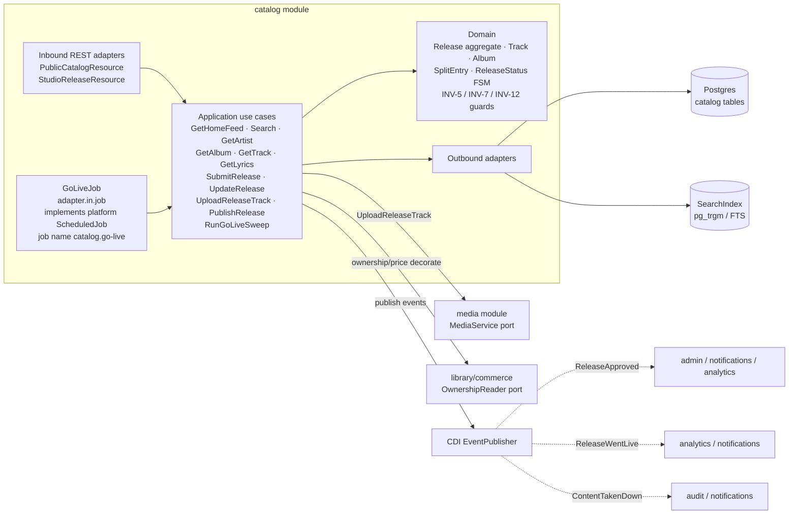
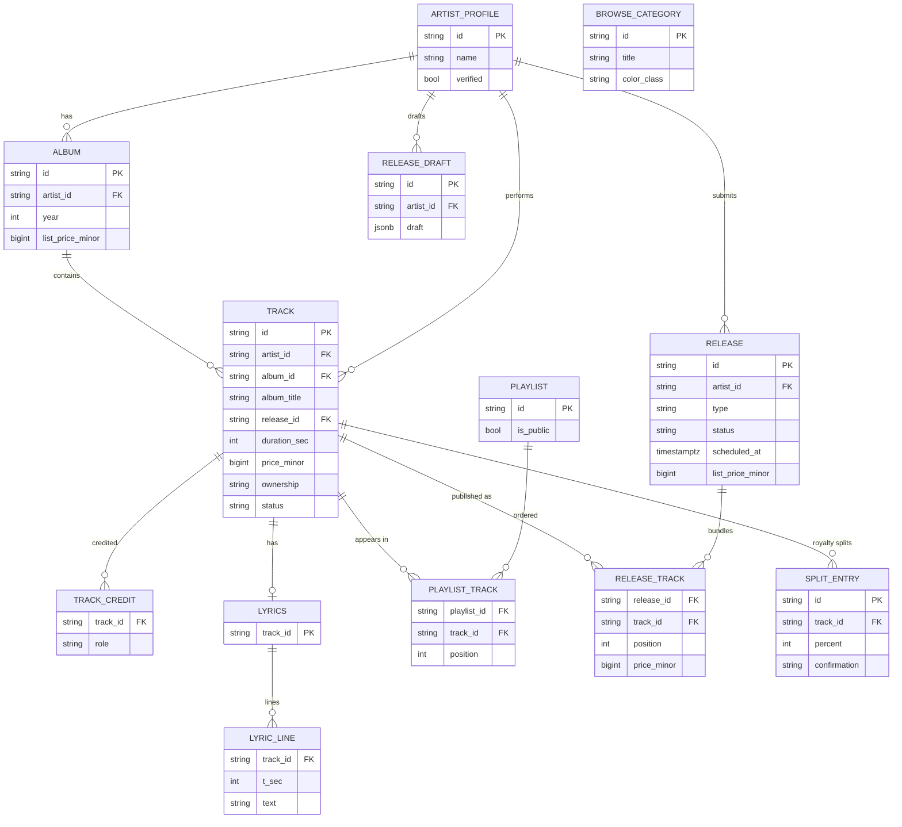
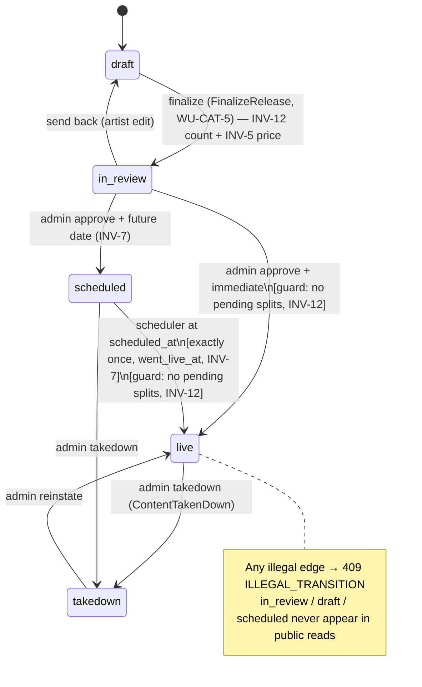

# Architecture Design Doc — `catalog` (`Catalog & Releases`)

> **Status:** Stable · **PRD source:** `BACKEND-PRD.md` §6.2 · **Owning context:** `Catalog & Releases` ·
> **Package root:** `org.shakvilla.beatzmedia.catalog`
>
> This ADD is consumed by Claude Code agents. It is the design contract for the module: an agent
> reads it, plans the listed work units, implements within the stated ports/adapters, writes the
> tests, and opens a PR. Do not invent endpoints or fields not traceable to the PRD / `API-CONTRACT.md`.

## 1. Purpose & responsibilities

The `catalog` module owns the **public read catalog** (home feed, search, browse tiles, artist /
album / track / playlist detail, timed lyrics) **and** the **creator-owned release lifecycle** (the
Studio 4-step wizard, moderation states, and scheduled go-live). It is the source of inventory for
the whole platform: tracks, albums, and artist profiles are created here and projected to every other
surface by id. It serves the **Fan** surface (anonymous reads allowed) and the **Studio** surface
(authenticated `artist` writes), and is moderated by the **Admin** surface. It covers
**HLFR-CATALOG-01** (public browse, LLFR-CATALOG-01.1–01.7) and **HLFR-CATALOG-02** (release creation
& lifecycle, LLFR-CATALOG-02.1–02.5).

It explicitly does **not** own: ownership/pricing-for-caller decoration (sourced from `commerce` /
`library` via ports), stream-URL issuance and preview clipping (`playback`), the physical
upload→transcode→signed-delivery pipeline (`media`, consumed via the `MediaService` port), the
search engine itself (`SearchIndex` port backed by Postgres `pg_trgm`/full-text, owned jointly with
WU-SRCH-1), payment/ledger effects of a sale (`payments`), and moderation actor/audit writing
(`admin` + `audit` — `catalog` only emits the domain events those modules consume).

## 2. Context & dependencies (C4 component view)



**Dependency rule.** `adapter.in.rest` / `adapter.in.job` → `application` → `domain`; outbound
adapters implement `application` output ports; inbound never imports outbound (ArchUnit-enforced).
`GoLiveJob` (`adapter.in.job`, WU-CAT-4) is the concrete inbound scheduler adapter: it implements the
platform kernel's `ScheduledJob` SPI (`platform.application.port.in.ScheduledJob`), is discovered and
ticked every 60 s by the platform `SchedulerRegistry` (WU-PLT-2) under the job name
`catalog.go-live`, and calls only the `RunGoLiveSweep` application input port — it does not touch
persistence directly. **Cross-module calls** are via input ports only: `media` (`UploadReleaseTrack`
→ `MediaService`), `commerce`/`library` (per-caller `ownership`/`price` decoration via
`OwnershipReader`), and `admin` — the approve/takedown/reinstate REST surface that WU-CAT-4
temporarily hosted directly in `catalog.adapter.in.rest.AdminCatalogResource` (no separate `admin`
module REST layer existed yet) has been **relocated to `admin.adapter.in.rest.AdminCatalogResource`
(WU-ADM-3)**, per this section's own original note (§5.1 below). `catalog` still owns the FSM
itself — `admin` calls `PublishRelease` in-process via its own `CatalogAdminPort` output port
(admin ADD §4.3/§13); `catalog` requires no admin scope of its own any more since it no longer
serves that REST surface. **Persistence is never shared**: `catalog`
reads/writes only its own tables; other modules reference its rows by id. **Events published:**
`ReleaseApproved`, `ReleaseWentLive`, `ContentTakenDown` (after-commit, ids + minimal snapshot).

## 3. Domain model

**Aggregates / entities / value objects**

| Name | Kind | Key fields | Notes |
|---|---|---|---|
| `Release` | Aggregate root | `id`, `artistId`, `title`, `type`, `status`, `scheduledAt?`, `listPriceMinor`, `tracks[]` | Owns the lifecycle FSM; enforces INV-7, INV-12, INV-5. |
| `ReleaseTrack` | Entity (in Release) | `trackId`, `position`, `priceMinor` | Ordered constituents; price feeds bundle math. |
| `SplitEntry` | Value object | `id`, `trackId`, `name`, `email`, `role`, `percent`, `confirmation` | Per-track royalty split of the **creator pool**; INV-12. |
| `ReleaseDraft` | Entity | `id`, `artistId`, JSON draft state, `updatedAt` | Server-persisted wizard draft (hydrates the client). |
| `Track` | Aggregate root | `id`, `title`, `artistId`, `albumId?`, `durationSec`, `ownership`, `priceMinor?`, `plays`, `quality`, `year`, `releaseId?`, `status` | `ownership`/`price` decorated per-caller at the boundary. |
| `TrackCredit` | Value object | `role`, `names[]` | Track detail credits. |
| `Album` | Aggregate root | `id`, `title`, `artistId`, `artistName`, `year`, `coverImage`, `trackIds[]` | List price derived via INV-5 from constituent tracks. |
| `Lyrics` | Entity | `trackId`, `lines: LyricLine[]` | One-to-zero/one with Track. |
| `LyricLine` | Value object | `tSec`, `text` | Time in **whole seconds** (frontend formats). |
| `ArtistProfile` | Aggregate root | `id`, `name`, `image`, `coverImage?`, `verified`, `monthlyListeners`, `followers`, `bio`, `location`, `genres[]`, `shows[]` | Public artist page + sub-collections. |
| `Show` | Value object | `date`, `city`, `venue` | ISO date; surfaced on artist page. |
| `Playlist` | Aggregate root | `id`, `title`, `description?`, `creator`, `image`, `isPublic`, `followers`, `trackIds[]` | Editorial/public; private hidden as 404 to non-owner. |
| `BrowseCategory` | Value object | `id`, `title`, `colorClass` | Search-screen tiles. |

**Enums** (lifted verbatim from `Frontend/src/types`, `studio-data.ts`, `release-draft-context.tsx`)

- `ReleaseType = single | ep | album | mixtape`
- `ReleaseStatus = live | scheduled | in_review | draft | takedown` (PRD R6: `takedown` added for moderation parity)
- `SplitConfirmation = self | confirmed | pending | auto`
- `UploadedTrack.status = uploading | ready | error`
- `OwnershipStatus = owned | free | for-sale`
- `Genre = Afrobeats | Hiplife | Highlife | Amapiano | Drill | Gospel | R&B | Reggae | Jazz`

**Invariants enforced here** (guard conditions in the domain, not the UI)

- **INV-5 (bundle discount).** A multi-track release's list price = `round(Σ track price_minor × (1 −
  bundleDiscountPct/100), 2)`, `bundleDiscountPct=24` from `PlatformSettings`. Singles get no
  discount. Computed on minor units, half-up. Guard: recompute on submit/track-change.
- **INV-7 (scheduled go-live).** A `scheduled` release is **not** publicly readable/streamable before
  `scheduledAt`; the scheduler flips it to `live` at/after that instant **exactly once**.
- **INV-12 (split sum).** For each track, `Σ SplitEntry.percent ≤ 100`; the originating creator holds
  the remainder implicitly. A release **cannot** transition to `live` while any split is `pending`.



## 4. Application layer (ports)

### 4.1 Input ports (use cases)

```java
// ---- Public catalog reads (HLFR-CATALOG-01) — auth optional; caller decorates ownership/price ----

public interface GetHomeFeed {                       // LLFR-CATALOG-01.1
    HomeFeed get(Optional<AccountId> caller);
}

public interface Search {                            // LLFR-CATALOG-01.2
    SearchResults search(String query, Optional<AccountId> caller);
}

public interface ListBrowseCategories {              // LLFR-CATALOG-01.3
    List<BrowseCategoryView> list();
}

public interface GetArtist {                         // LLFR-CATALOG-01.4
    ArtistView getArtist(ArtistId id);
    List<TrackView> tracks(ArtistId id, Optional<AccountId> caller);
    List<AlbumView> albums(ArtistId id);
    List<ShowView> shows(ArtistId id);
}

public interface GetAlbum {                          // LLFR-CATALOG-01.5
    AlbumView get(AlbumId id, boolean includeTracks, Optional<AccountId> caller);
}

public interface GetTrack {                          // LLFR-CATALOG-01.6
    TrackView get(TrackId id, Optional<AccountId> caller);
}

public interface GetLyrics {                         // LLFR-CATALOG-01.6
    LyricsView get(TrackId id);
}

public interface GetPlaylist {                       // LLFR-CATALOG-01.7
    PlaylistView get(PlaylistId id, Optional<AccountId> caller);
}

// ---- Creator release lifecycle (HLFR-CATALOG-02) — auth artist; ownership re-checked in app ----

public interface ListStudioReleases {               // LLFR-CATALOG-02.1
    Page<StudioReleaseView> list(ArtistId owner, Optional<ReleaseStatus> status, PageRequest page);
}

public interface SubmitRelease {                     // LLFR-CATALOG-02.2  → emits nothing public (in_review)
    StudioReleaseView submit(ArtistId owner, SubmitReleaseCommand cmd);
    record SubmitReleaseCommand(
        String title, ReleaseType type, Optional<Instant> date, Visibility visibility,
        List<UploadedTrackRef> tracks, Map<TrackId, List<SplitEntryCommand>> splits) {}
    record UploadedTrackRef(TrackId trackId, int position, long priceMinor) {}
    record SplitEntryCommand(String name, String email, String role, int percent, SplitConfirmation confirmation) {}
}

public interface GetRelease {                        // LLFR-CATALOG-02.3
    StudioReleaseView get(ArtistId owner, ReleaseId id);
}

public interface UpdateRelease {                     // LLFR-CATALOG-02.3 (metadata + publish/unpublish)
    StudioReleaseView update(ArtistId owner, ReleaseId id, UpdateReleaseCommand cmd);
    record UpdateReleaseCommand(
        Optional<String> title, Optional<Instant> date, Optional<Visibility> visibility,
        Optional<Map<TrackId, Long>> trackPricesMinor, Optional<PublishAction> publish) {}
    enum PublishAction { PUBLISH, UNPUBLISH }
}

public interface DeleteRelease {                     // LLFR-CATALOG-02.3 (draft/in_review only; else RELEASE_LIVE)
    void delete(ArtistId owner, ReleaseId id);
}

public interface UploadReleaseTrack {               // LLFR-CATALOG-02.4 (delegates to MediaService)
    UploadedTrackView upload(ArtistId owner, ReleaseId id, AudioUpload upload);
    record AudioUpload(String filename, String contentType, long sizeBytes, InputStream data) {}
}

public interface PublishRelease {                    // LLFR-CATALOG-02.5 (the FSM driver; called by admin + scheduler)
    StudioReleaseView transition(
        ReleaseId id, ReleaseTransition action, String actorId, Optional<Instant> scheduledAt);
    // Overload used by TAKEDOWN, which the contract requires a free-text reason for; the reason
    // is carried on the AuditEntry and the ContentTakenDown event.
    default StudioReleaseView transition(
        ReleaseId id, ReleaseTransition action, String actorId,
        Optional<Instant> scheduledAt, String reason) { ... }
    enum ReleaseTransition { APPROVE_IMMEDIATE, APPROVE_SCHEDULED, GO_LIVE, TAKEDOWN, REINSTATE }
}

// **Correction (WU-CAT-5, §14).** The `SubmitRelease`/`UpdateRelease` sketch above predates the
// implemented release create flow and is illustrative only (as already noted for `PublishRelease`
// below and the WU-SRCH-2 correction in §5.2). `SubmitRelease` is retired; the as-built input ports
// are `CreateReleaseDraft`, `UploadReleaseTrack` (now attaches its result), `UpdateRelease`
// (extended: `UpdateReleaseCommand(title, genre, description, visibility, scheduledAt, tracks)`),
// `RemoveReleaseTrack`, and `FinalizeRelease` — see §4.1/§14 for their real signatures.

public interface RunGoLiveSweep {                    // LLFR-PLATFORM-01.2 (WU-CAT-4) — sweep entry point
    int run();  // returns count of releases transitioned to live this sweep
}
```

For each: **trigger** REST resource or scheduler; **authorization** public reads are anonymous-OK,
all `Studio*`/`*Release` require `artist` + owner re-check, `PublishRelease` (approve/takedown/
reinstate) requires an admin scope enforced by `admin.adapter.in.rest.AdminCatalogResource`
(`POST /v1/admin/catalog/:id/{approve,takedown,reinstate}` — relocated there by WU-ADM-3, see §5.1
note and admin ADD §15; `super-admin`/`moderator` write, `support` read),
`GO_LIVE` is system-only (scheduler, never exposed on an HTTP path). **Idempotency** reads are nat.
idempotent; `FinalizeRelease` (`POST .../submit`, WU-CAT-5 — supersedes the retired `SubmitRelease`)
is keyed by `Idempotency-Key`; FSM transitions are guard-idempotent
(re-issuing a settled transition throws `IllegalTransitionException` → 409 `ILLEGAL_TRANSITION`
rather than repeating a side effect). **Emitted events** (CDI `Event<T>.fire()`, mirroring the
`AccountRegistered` pattern — no separate `EventPublisher` port yet exists in the codebase):
`FinalizeRelease` → none public; `APPROVE_*` → `ReleaseApproved`; `GO_LIVE`/immediate approve →
`ReleaseWentLive`; `TAKEDOWN` → `ContentTakenDown`. **Audit (INV-10):** `PublishReleaseService`
appends exactly one `AuditEntry` (type `MODERATION`) per admin-triggered transition
(`APPROVE_SCHEDULED`, `APPROVE_IMMEDIATE`, `TAKEDOWN`, `REINSTATE`); `GO_LIVE` is system-initiated
and does not audit (no admin actor).

### 4.2 Output ports

```java
public interface CatalogRepository {   // Postgres + Panache adapter (adapter.out.persistence)
    Optional<ArtistProfile> findArtist(ArtistId id);
    List<Track> tracksByArtist(ArtistId id);
    List<Album> albumsByArtist(ArtistId id);
    Optional<Album> findAlbum(AlbumId id);
    Optional<Track> findTrack(TrackId id);
    Optional<Lyrics> findLyrics(TrackId id);
    Optional<Playlist> findPlaylist(PlaylistId id);
    List<BrowseCategory> browseCategories();
    HomeFeedRows homeFeed();
    Page<Release> releasesByArtist(ArtistId owner, Optional<ReleaseStatus> status, PageRequest page);
    Optional<Release> findRelease(ReleaseId id);
    void save(Release release);
    void delete(ReleaseId id);
    List<Release> dueScheduled(Instant now);   // INV-7 go-live sweep; row-locked (PESSIMISTIC_WRITE)
    boolean hasPendingSplits(ReleaseId releaseId);      // WU-CAT-4 — INV-12 live-transition guard
    void markReleaseTracksReady(ReleaseId releaseId);   // WU-CAT-4 — flips constituent tracks 'ready'
    List<IndexableTrack> allTracksForIndex(); // WU-SRCH-2 — search reindex enumeration, §13
                                              //   IndexableTrack = (Track track, boolean visible)
    List<ArtistProfile> allArtistsForIndex();  // WU-SRCH-2 — search reindex enumeration, §13
    List<Album> allAlbumsForIndex();           // WU-SRCH-2 — search reindex enumeration, §13
    List<Playlist> allPlaylistsForIndex();     // WU-SRCH-2 — search reindex enumeration, §13 (includes private)
}

public interface SearchIndex {         // pg_trgm / full-text adapter (WU-SRCH-1)
    SearchResults query(String q);
    void index(SearchDoc doc);
    void remove(String docId);
}

public interface MediaService {        // media module client (WU-MED-1) — upload→validate→transcode→signed
    UploadHandle upload(AudioUpload upload);   // throws UnsupportedFormatException → UNSUPPORTED_FORMAT
    ProbeResult probe(UploadHandle handle);    // duration_sec, format
}

public interface Clock {               // platform kernel
    Instant now();
}

public interface EventPublisher {      // CDI event bridge; after-commit dispatch
    void publish(DomainEvent event);
}
```

Implementing outbound adapters: `CatalogRepository` → Hibernate-ORM-Panache repos mapping domain ↔
JPA entities; `SearchIndex` → Postgres `pg_trgm` adapter; `MediaService` → REST/in-process client of
the `media` module; `Clock` → kernel system clock; `EventPublisher` → CDI `jakarta.enterprise.event`.

## 5. Adapters

### 5.1 Inbound — REST resources

Base path `/v1`. JSON/UTF-8. Studio endpoints require `Authorization: Bearer <jwt>` with `artist`
role; public reads accept anonymous (token, if present, decorates `ownership`/`price`).

| Method | Path | Auth/scope | Request DTO | Response DTO | Success | Error codes | LLFR |
|---|---|---|---|---|---|---|---|
| GET | `/home` | public | — | `HomeFeed` | 200 | — | 01.1 |
| GET | `/search?q=` | public | query `q` | `SearchResults` | 200 | 422 `MISSING_QUERY` | 01.2 |
| GET | `/browse-categories` | public | — | `BrowseCategory[]` | 200 | — | 01.3 |
| GET | `/artists/:id` | public | — | `Artist` | 200 | 404 `ARTIST_NOT_FOUND` | 01.4 |
| GET | `/artists/:id/tracks` | public | — | `Track[]` | 200 | 404 `ARTIST_NOT_FOUND` | 01.4 |
| GET | `/artists/:id/albums` | public | — | `Album[]` | 200 | 404 `ARTIST_NOT_FOUND` | 01.4 |
| GET | `/artists/:id/shows` | public | — | `Show[]` | 200 | 404 `ARTIST_NOT_FOUND` | 01.4 |
| GET | `/albums/:id?tracks=true` | public | `tracks` flag | `Album (+tracks)` | 200 | 404 `ALBUM_NOT_FOUND` | 01.5 |
| GET | `/tracks/:id` | public | — | `Track` | 200 | 404 `TRACK_NOT_FOUND` | 01.6 |
| GET | `/tracks/:id/lyrics` | public | — | `{ lines: {time,text}[] }` | 200 | 404 `LYRICS_NOT_FOUND` | 01.6 |
| GET | `/playlists/:id` | public | — | `Playlist (+tracks)` | 200 | 404 (private→404) | 01.7 |
| POST | `/catalog/resolve` | public | `ResolveCatalogRequest` | `ResolvedCatalogView` | 200 | 422 `VALIDATION` (over-cap) | — |

> **`POST /v1/catalog/resolve`** — batch id-list → full-object resolution across tracks/artists/albums/
> playlists in one call, for list screens that hold only ids (e.g. the library). Reuses the existing
> `CatalogRepository.*ByIds` batch reads + view mappers. Lenient (unknown ids omitted, never 404);
> non-public playlists omitted (same rule as `/playlists/:id`); 200-ids-per-kind cap → 422 `VALIDATION`
> with `field` = the offending list. Track ownership decorated per-caller via the optional JWT.
| GET | `/studio/releases?status=&page=&size=` | artist (owner) | — | `{ items: StudioRelease[], page, size, total }` | 200 | 401/403 | 02.1 |
| POST | `/studio/releases` | artist | `CreateDraftRequest` (metadata only) | `StudioReleaseDetail` (`draft`) | 201 | — | 02.2 |
| GET | `/studio/releases/:id` | artist (owner) | — | `StudioReleaseDetail` | 200 | 403/404 | 02.3 |
| PATCH | `/studio/releases/:id` | artist (owner) | `UpdateReleaseRequest` | `StudioReleaseDetail` | 200 | 409 `ILLEGAL_TRANSITION`, 422 `TRACK_NOT_IN_RELEASE`, 422 `DUPLICATE_TRACK_REF`, 422 `INVALID_PRICE` | 02.3 |
| DELETE | `/studio/releases/:id` | artist (owner) | — | — | 204 | 409 `RELEASE_LIVE` | 02.3 |
| POST | `/studio/releases/:id/tracks` | artist (owner) | multipart audio (WAV/FLAC) | `UploadedTrack` (attached) | 201 | 422 `UNSUPPORTED_FORMAT`, 413, 409 `ILLEGAL_TRANSITION` (non-draft) | 02.4 |
| DELETE | `/studio/releases/:id/tracks/:trackId` | artist (owner) | — | — | 204 | 409 `ILLEGAL_TRANSITION` (non-draft), 404 `TRACK_NOT_FOUND` | 02.4 (WU-CAT-5) |
| POST | `/studio/releases/:id/submit` | artist (owner) | `Idempotency-Key` header | `StudioReleaseDetail` (`in_review`) | 200 | 400 `MISSING_IDEMPOTENCY_KEY`, 409 `ILLEGAL_TRANSITION`, 409 `IDEMPOTENCY_KEY_CONFLICT`, 422 `TRACK_COUNT_INVALID` | 02.2 (WU-CAT-5 finalize) |

**~~POST `/admin/catalog/:id/{approve,takedown,reinstate}`~~ — relocated to the `admin` module
(WU-ADM-3).** WU-CAT-4 originally hosted these three endpoints directly in
`catalog.adapter.in.rest.AdminCatalogResource` as an explicitly documented *temporary* placeholder
("no separate `admin` REST module exists yet to own them ... a future `admin`-module WU may
relocate these three endpoints and/or add `flag`"). That relocation has now happened: WU-ADM-3
deleted `catalog.adapter.in.rest.AdminCatalogResource` (and its IT test) and moved
`approve`/`takedown`/`reinstate` to `admin.adapter.in.rest.AdminCatalogResource` at the SAME `/v1/
admin/catalog/:id/{approve,takedown,reinstate}` paths — see admin ADD §15 for the full write-up
(RBAC narrowed from `moderator`\|`editor` to `super-admin`\|`moderator`\|`support`(read), per admin
ADD §8's matrix; response is now `CatalogItemDetail`, not `StudioRelease`; `flag` was added there
too, as an admin-owned `ModerationCase`, not a catalog FSM transition). The underlying
`PublishRelease` input port, `Release` FSM, and every domain invariant on this page are
**completely unchanged** — `admin` calls `PublishRelease` in-process via its own `CatalogAdminPort`
output port, exactly as this note originally anticipated. The scheduler's `GO_LIVE` transition
remains system-only and is never exposed on an HTTP path — it is driven exclusively by `GoLiveJob`
via `RunGoLiveSweep`. Resources are thin: DTO → command → input port → DTO. No business logic in
resources (conventions §5).

### 5.2 Outbound — persistence & integrations

`CatalogRepositoryAdapter` (Hibernate-ORM-Panache) maps domain aggregates ↔ JPA entities (domain
carries no ORM annotations); transaction boundary = the application service (`@Transactional` on the
use-case impl). **Correction (WU-SRCH-2, §13):** this ADD previously stated that a `SearchIndexAdapter`
"keeps a `pg_trgm`/full-text projection in sync on release go-live / track change (WU-SRCH-1)" — no
such adapter or event-driven sync exists in the codebase; `search`'s `IndexEventObserversStub` remains
a comment-only placeholder with no `@Observes` beans, so nothing in catalog kept the index in sync on
release go-live or track change, and `search_document` was empty in every environment. `catalog`
instead **contributes** to search's periodic pull-based backfill — see §13 for the as-built design.
`MediaServiceClient` calls the `media` module for
upload/validate/transcode (rejects non-WAV/FLAC → `UnsupportedFormatException`, oversize → 413,
returns probed `durationSec` and an async `uploading→ready|error` status). `OwnershipReaderClient`
(from `commerce`/`library`) decorates each outbound `Track` with per-caller `ownership`/`price`.
`EventPublisherAdapter` dispatches domain events `AFTER_SUCCESS` (ids + minimal snapshot, never JPA
entities).

## 6. DTOs & API shapes

Field-level, traceable to `Frontend/src/types/index.ts`, `studio-data.ts`, and
`release-draft-context.tsx`. Money on the wire is `{ amount: <decimal cedis>, currency: "GHS" }`
(stored `*_minor`); durations are whole seconds; timestamps ISO-8601.

- **Track** — `id`, `title`, `artistId`, `artistName`, `albumId?`, `albumTitle?`, `duration` (sec),
  `image`, `ownership` (`owned|free|for-sale`), `price?` (`Money`, present when `for-sale`), `plays?`,
  `audioUrl?`, `credits?: TrackCredit[]` (`{role, names[]}`), `quality?`, `year?`.
- **Album** — `id`, `title`, `artistId`, `artistName`, `year`, `coverImage`, `genres?: Genre[]`,
  `trackIds: ID[]`; with `?tracks=true` embeds `tracks: Track[]` (each decorated per-caller). List
  price derived via INV-5 (see §8).
- **Artist** — `id`, `name`, `image`, `coverImage?`, `verified?`, `monthlyListeners?`, `followers?`,
  `bio?`, `location?`, `genres?: Genre[]`. Sub-collections returned by `/tracks`, `/albums`, `/shows`.
- **Playlist** — `id`, `title`, `description?`, `creator`, `creatorAvatar?`, `image`, `isPublic`,
  `followers?`, `trackIds: ID[]`; detail and `POST /catalog/resolve` embed `tracks: Track[]`.
  `tracks` is always present but `/search` returns it empty — embedding costs an ownership lookup
  per track of every matching playlist, and the search screen consumes `trackIds` only.
- **ResolvedCatalogView** — `tracks: Track[]`, `artists: Artist[]`, `albums: Album[]`,
  `playlists: Playlist[]`; response for `POST /catalog/resolve`, reusing the per-kind views verbatim.
  Request `ResolveCatalogRequest` — `trackIds?`, `artistIds?`, `albumIds?`, `playlistIds?` (`ID[]`).
- **StudioRelease** — `id`, `title`, `type` (`single|ep|album|mixtape`), `status`
  (`live|scheduled|in_review|draft|takedown`), `date` (display string; `—` for drafts), `trackCount`,
  `streams`, `revenue` (cedis), `price` (cedis, per-track list price). List-view shape (`GET
  /studio/releases`); **unchanged** by WU-CAT-5.
- **StudioReleaseDetail** (WU-CAT-5) — `StudioRelease` **+** `genre?`, `description?`, `visibility`
  (`public|scheduled`), `scheduledAt?`, `tracks: TrackDraft[]`. Additive superset returned by `GET
  /studio/releases/:id` and every draft-flow mutation (`POST`/`PATCH`/`POST .../submit`).
- **TrackDraft** (WU-CAT-5) — `trackId`, `title`, `duration` (sec), `status`
  (`uploading|ready|error`), `position`, `price` (cedis), `splits: SplitEntry[]` (WU-CAT-6 —
  collaborators only; the originating creator's share is implicit and never stored as a row, INV-12).
- **UploadedTrack** — `id`, `title`, `duration` (sec), `status` (`uploading|ready|error`),
  `progress` (0–100), `src` (delivery URL), `price` (cedis; 0 = free), `explicit` (bool), `position`
  (WU-CAT-5 — index of the attached `ReleaseTrack` within its release).
- **SplitEntry** — `id`, `name`, `email`, `role`, `percent` (0–100 of creator pool),
  `confirmation` (`self|confirmed|pending|auto`). Persisted on `PATCH .../:id`, nested per track
  (WU-CAT-6, as-built) — see §9.

## 7. Persistence schema & migrations

Money in minor units (`*_minor BIGINT`), durations `*_sec INT`, timestamps `TIMESTAMPTZ` (UTC), PK
`id`, FKs `<entity>_id`. No cross-module FKs (references by id resolved via ports).

```sql
CREATE TABLE artist_profile (
  id               TEXT PRIMARY KEY,
  name             TEXT NOT NULL,
  image            TEXT NOT NULL,
  cover_image      TEXT,
  verified         BOOLEAN NOT NULL DEFAULT FALSE,
  monthly_listeners BIGINT,
  followers        BIGINT,
  bio              TEXT,
  location         TEXT,
  genres           TEXT[] NOT NULL DEFAULT '{}',
  created_at       TIMESTAMPTZ NOT NULL DEFAULT now(),
  updated_at       TIMESTAMPTZ NOT NULL DEFAULT now()
);

CREATE TABLE album (
  id               TEXT PRIMARY KEY,
  title            TEXT NOT NULL,
  artist_id        TEXT NOT NULL REFERENCES artist_profile(id),
  artist_name      TEXT NOT NULL,
  year             INT  NOT NULL,
  cover_image      TEXT NOT NULL,
  genres           TEXT[] NOT NULL DEFAULT '{}',
  -- INV-5: list_price_minor = round(Σ track.price_minor × (1 − bundleDiscountPct/100)); recomputed in app layer
  list_price_minor BIGINT NOT NULL DEFAULT 0
);
CREATE INDEX idx_album_artist ON album(artist_id);

CREATE TABLE release (
  id               TEXT PRIMARY KEY,
  artist_id        TEXT NOT NULL REFERENCES artist_profile(id),
  title            TEXT NOT NULL,
  type             TEXT NOT NULL CHECK (type IN ('single','ep','album','mixtape')),
  status           TEXT NOT NULL CHECK (status IN ('draft','in_review','scheduled','live','takedown')),
  visibility       TEXT NOT NULL CHECK (visibility IN ('public','scheduled')),
  scheduled_at     TIMESTAMPTZ,                 -- INV-7: go-live instant for status='scheduled'
  went_live_at     TIMESTAMPTZ,                 -- set once by the go-live job (idempotency guard)
  list_price_minor BIGINT NOT NULL DEFAULT 0,   -- INV-5
  created_at       TIMESTAMPTZ NOT NULL DEFAULT now(),
  updated_at       TIMESTAMPTZ NOT NULL DEFAULT now()
);
CREATE INDEX idx_release_artist_status ON release(artist_id, status);
CREATE INDEX idx_release_due ON release(scheduled_at) WHERE status = 'scheduled'; -- go-live sweep

CREATE TABLE track (
  id               TEXT PRIMARY KEY,
  title            TEXT NOT NULL,
  artist_id        TEXT NOT NULL REFERENCES artist_profile(id),
  artist_name      TEXT NOT NULL,
  album_id         TEXT REFERENCES album(id),
  album_title      TEXT,                         -- denormalised; set when album_id is non-null
  release_id       TEXT REFERENCES release(id),
  duration_sec     INT  NOT NULL,
  image            TEXT NOT NULL,
  audio_url        TEXT,
  ownership        TEXT NOT NULL CHECK (ownership IN ('owned','free','for-sale')),
  price_minor      BIGINT,                       -- present when ownership='for-sale'
  plays            BIGINT NOT NULL DEFAULT 0,
  quality          TEXT,
  year             INT,
  status           TEXT NOT NULL DEFAULT 'ready' CHECK (status IN ('uploading','ready','error')),
  search_tsv       tsvector
);
CREATE INDEX idx_track_artist ON track(artist_id);
CREATE INDEX idx_track_album  ON track(album_id);
CREATE INDEX idx_track_release ON track(release_id);
CREATE INDEX idx_track_search ON track USING GIN (search_tsv);                -- full-text
CREATE INDEX idx_track_title_trgm ON track USING GIN (title gin_trgm_ops);    -- pg_trgm fuzzy

CREATE TABLE track_credit (
  track_id         TEXT NOT NULL REFERENCES track(id) ON DELETE CASCADE,
  role             TEXT NOT NULL,
  names            TEXT[] NOT NULL,
  PRIMARY KEY (track_id, role)
);

CREATE TABLE lyrics (
  track_id         TEXT PRIMARY KEY REFERENCES track(id) ON DELETE CASCADE
);
CREATE TABLE lyric_line (
  track_id         TEXT NOT NULL REFERENCES lyrics(track_id) ON DELETE CASCADE,
  t_sec            INT  NOT NULL,
  text             TEXT NOT NULL,
  PRIMARY KEY (track_id, t_sec)
);

CREATE TABLE playlist (
  id               TEXT PRIMARY KEY,
  title            TEXT NOT NULL,
  description      TEXT,
  creator          TEXT NOT NULL,
  creator_avatar   TEXT,
  image            TEXT NOT NULL,
  is_public        BOOLEAN NOT NULL DEFAULT TRUE,
  followers        BIGINT
);
CREATE TABLE playlist_track (
  playlist_id      TEXT NOT NULL REFERENCES playlist(id) ON DELETE CASCADE,
  track_id         TEXT NOT NULL,                -- references catalog track by id
  position         INT  NOT NULL,
  PRIMARY KEY (playlist_id, position)
);

CREATE TABLE browse_category (
  id               TEXT PRIMARY KEY,
  title            TEXT NOT NULL,
  color_class      TEXT NOT NULL
);

CREATE TABLE release_track (
  release_id       TEXT NOT NULL REFERENCES release(id) ON DELETE CASCADE,
  track_id         TEXT NOT NULL REFERENCES track(id),
  position         INT  NOT NULL,
  price_minor      BIGINT NOT NULL,
  PRIMARY KEY (release_id, position)
);

CREATE TABLE split_entry (
  id               TEXT PRIMARY KEY,
  track_id         TEXT NOT NULL REFERENCES track(id) ON DELETE CASCADE,
  name             TEXT NOT NULL,
  email            TEXT NOT NULL,
  role             TEXT NOT NULL,
  percent          INT  NOT NULL CHECK (percent BETWEEN 0 AND 100),
  confirmation     TEXT NOT NULL CHECK (confirmation IN ('self','confirmed','pending','auto'))
  -- INV-12: app-layer guard enforces Σ percent per track ≤ 100; no live transition with 'pending'
);
CREATE INDEX idx_split_track ON split_entry(track_id);

CREATE TABLE release_draft (
  id               TEXT PRIMARY KEY,
  artist_id        TEXT NOT NULL REFERENCES artist_profile(id),
  draft            JSONB NOT NULL,               -- mirrors ReleaseDraft (client wizard state)
  updated_at       TIMESTAMPTZ NOT NULL DEFAULT now()
);
CREATE INDEX idx_release_draft_artist ON release_draft(artist_id);
```

**Flyway migrations** (forward-only, `src/main/resources/db/migration/`):

- `V301__create_artist_profile_album.sql`, `V302__create_track_credit_lyrics.sql`,
  `V303__create_playlist.sql`, `V304__catalog_browse_category.sql` — read entities + indexes
  (WU-CAT-1/WU-CAT-2).
- `V305__catalog_releases.sql` — release, release_track, split_entry, release_draft + indexes,
  **including `release.went_live_at` and the partial due-index
  `idx_release_due ON release(scheduled_at) WHERE status='scheduled'`**, + FK
  `track.release_id → release(id)` (WU-CAT-3).
- **WU-CAT-4 added no new migration** — the go-live guard column and due-index needed by the
  `dueScheduled` sweep already shipped in `V305`; the FSM and sweep are pure application/domain
  logic over the existing schema. The next free catalog-band version remains `V306`.
- Repeatable `R__seed_dev_data.sql` contributes the mock catalog (artists, albums, tracks, playlists,
  browse categories, a sample creator's releases) — dev/test profiles only.

## 8. Key flows

**Album price / bundle discount note (INV-5).** On `FinalizeRelease` (`POST .../submit`, WU-CAT-5 —
supersedes the retired `SubmitRelease`) and any track-price change, the domain recomputes
`list_price_minor`. For a **multi-track** release/album:
`listPriceMinor = roundHalfUp(Σ releaseTrack.priceMinor × (100 − bundleDiscountPct) / 100)`, with
`bundleDiscountPct = 24` from `PlatformSettings` (never hard-coded). All arithmetic is on minor units;
the discount is applied to the **sum** then rounded once (half-up) — not per track — so the bundle
total equals `round(Σ price × 0.76, 2)`. **Singles** (`type=single`) take no discount: list price =
the single track's price.

```mermaid
sequenceDiagram
  actor Artist
  participant REST as StudioReleaseResource
  participant CRD as CreateReleaseDraft
  participant UPL as UploadReleaseTrack
  participant FIN as FinalizeRelease
  participant DOM as Release (domain)
  participant ADM as Admin (moderator)
  participant PUB as PublishRelease
  participant JOB as Go-live scheduler
  participant BUS as EventPublisher

  Artist->>REST: POST /studio/releases (metadata only)
  REST->>CRD: create(owner, cmd)
  CRD->>DOM: createDraft(...)
  DOM-->>CRD: Release(status=draft, tracks=[])
  CRD-->>REST: 201 StudioReleaseDetail (draft)

  loop per uploaded track
    Artist->>REST: POST .../tracks (multipart WAV/FLAC)
    REST->>UPL: upload(releaseId, owner, audio)
    UPL->>DOM: addTrack(ReleaseTrack, now) [draft-only]
    UPL-->>REST: 201 UploadedTrack (attached)
  end

  Artist->>REST: PATCH .../:id (price/order/genre/description)
  REST->>DOM: replaceTracks/updateMetadata(...) [draft-only]

  Artist->>REST: POST .../submit (Idempotency-Key)
  REST->>FIN: finalize(owner, key)
  FIN->>FIN: validate track-count matrix (INV-12)
  FIN->>DOM: submit(bundleDiscountPct, now)
  DOM->>DOM: compute list_price_minor (INV-5)
  DOM-->>FIN: Release(status=in_review)
  FIN-->>REST: 200 StudioReleaseDetail (in_review, not public)

  ADM->>PUB: transition(APPROVE_SCHEDULED, actor)
  PUB->>DOM: guard in_review→scheduled (future date)
  DOM-->>PUB: status=scheduled
  PUB->>BUS: ReleaseApproved
  Note over DOM: not publicly readable before scheduled_at (INV-7)

  JOB->>PUB: transition(GO_LIVE) at scheduled_at
  PUB->>DOM: guard scheduled→live; no pending splits (INV-12); set went_live_at once (INV-7)
  DOM-->>PUB: status=live
  PUB->>BUS: ReleaseWentLive
  Note over JOB,DOM: tracks now publicly streamable
```



## 9. Cross-cutting hooks

- **Auth/scope.** `studio.*` endpoints require the `artist` role (enforced at the REST adapter) **and**
  an owner re-check in the application layer (an artist touches only their own releases — else 403/404).
  Public reads accept anonymous; a present token only decorates `ownership`/`price`. `PublishRelease`
  approve/takedown/reinstate are invoked by `admin.adapter.in.rest.AdminCatalogResource` (relocated
  there by WU-ADM-3 — see §5.1 note and admin ADD §15; `super-admin`/`moderator` write, `support`
  read); `GO_LIVE` is system-only (scheduler, `GoLiveJob`), never exposed on an HTTP path.
- **Idempotency.** `FinalizeRelease` (`POST .../submit`, WU-CAT-5) honors `Idempotency-Key`; FSM transitions are guard-idempotent
  (`went_live_at` makes go-live fire exactly once; a repeat call throws `IllegalTransitionException`
  rather than re-firing side effects — verified by `RunGoLiveSweepServiceTest` and (post-relocation)
  `admin.it.AdminCatalogResourceIT`).
- **Audit (INV-10).** Approve / takedown / reinstate are privileged mutations — `PublishReleaseService`
  appends exactly one `AuditEntry` (type `MODERATION`) per admin-triggered transition, atomically in
  the same transaction as the state change, via the `AuditWriter` output port (not the audit table
  directly). `GO_LIVE` is system-initiated (no admin actor) and does not audit. This module also emits
  the domain events (`ReleaseApproved`, `ReleaseWentLive`, `ContentTakenDown`) the
  audit/notifications/analytics modules consume after commit.
- **Error model.** Uniform envelope `{ error: { code, message, field? } }`. Codes used here:
  `ARTIST_NOT_FOUND` (404), `ALBUM_NOT_FOUND` (404), `TRACK_NOT_FOUND` (404), `LYRICS_NOT_FOUND`
  (404), `PLAYLIST_NOT_FOUND` (404), `MISSING_QUERY` (422), `TRACK_COUNT_INVALID` (422),
  `SPLIT_OVER_100` (422, INV-12), `RELEASE_LIVE` (409, delete of live), `ILLEGAL_TRANSITION`
  (409, FSM), `UNSUPPORTED_FORMAT` (422, non-WAV/FLAC), `TRACK_NOT_IN_RELEASE` (422, WU-CAT-5 —
  `PATCH .../tracks` references a trackId not on the release), `MISSING_IDEMPOTENCY_KEY` (400,
  WU-CAT-5 — `POST .../submit`; catalog owns its own copy of the exception per the hexagonal
  module-boundary convention, same wire `ErrorCode` as payments/podcasts). Private/`in_review`
  resources are hidden as 404.
- **Domain events.** `ReleaseApproved`, `ReleaseWentLive`, `ContentTakenDown` (ids + snapshot,
  after-commit; fired via CDI `Event<T>.fire()` from `PublishReleaseService`, mirroring the
  `AccountRegistered` pattern already used by `identity` — no separate `EventPublisher` port exists in
  the codebase yet, so this ADD's illustrative `EventPublisher` output port is aspirational, not
  implemented; update if/when a cross-cutting event-bus port is introduced).
- **Split persistence (WU-CAT-6, as-built).** The original `SubmitRelease` (WU-CAT-3, **retired by
  WU-CAT-5** — see §14) validated that per-track split percentages sum to ≤100 (INV-12,
  `SPLIT_OVER_100`) but never persisted `SplitEntry` rows to `split_entry` — they were validated in
  memory and discarded; WU-CAT-5's replacement draft-flow then carried no splits input at all.
  WU-CAT-6 closes the gap: `UpdateRelease`'s `tracks[]` replacement (`PATCH .../:id`) now accepts an
  optional `splits[]` nested inside each track entry (`{name, email, role, percent}` — input has no
  `id`/`confirmation`), persisted via the dedicated `CatalogRepository.saveTrackSplits(trackId,
  splits)` — a wholesale per-track replace, **deliberately decoupled from `saveRelease`** so an
  unrelated save on an aggregate that never loaded splits (the go-live scheduler, track upload/delete)
  can never wipe `split_entry`. Splits are **collaborators only** — the originating creator's share is
  implicit and never stored as a row (`Σ percent ≤ 100`, not `== 100`, per INV-12). Every persisted
  collaborator lands with `confirmation = "pending"` (interim; the invite/accept flow that moves
  a row to `confirmed`/`declined` — invite emails/notifications, a tokenized accept/decline endpoint,
  resend, and a `declined` state — was delivered by **WU-CAT-9** (see §17); the frontend
  Splits-step wiring remains a separate follow-on).
  `findRelease` loads splits into the aggregate, so `TrackDraftView.splits` (`SplitView {id, name,
  email, role, percent, confirmation}`) is populated on `GET /:id` and every mutating draft endpoint.
  `FinalizeRelease` validates per-track `Σ percent ≤ 100` before `Release.submit`, rejecting with 422
  `SPLIT_OVER_100`; an individual row's `percent` outside 0–100 fails as a plain 422 field-validation
  error, not `SPLIT_OVER_100`. WU-CAT-4's `CatalogRepository.hasPendingSplits` guard now has real data
  to act on and blocks `in_review → live` while any split is `pending`. **No new migration** —
  `split_entry`, its CHECKs, and `idx_split_track` already shipped in `V305` (§7).
- **Observability.** Micrometer counters: releases by status, go-live job runs/failures, search QPS;
  spans on submit and the go-live sweep. Structured logs, no PII.

## 10. Work units & build order

| WU | Scope (LLFRs) | Depends on | Order |
|---|---|---|---|
| **WU-CAT-1** | Catalog read entities + read endpoints artists/albums/tracks/playlists/lyrics (CATALOG-01.4–01.7) | WU-PLT-1 | 1 |
| **WU-SRCH-1** | Search index lifecycle, `pg_trgm`/FTS (SEARCH-01.*) — consumed by 01.2 | WU-CAT-1 | 2 |
| **WU-CAT-2** | Home feed + browse + search read (CATALOG-01.1–01.3) | WU-CAT-1, WU-SRCH-1 | 3 |
| **WU-MED-1** | Media upload→validate→transcode→signed URL (MEDIA-01.*) — used by track upload | WU-PLT-1 | parallel |
| **WU-CAT-3** ✅ | Release wizard submit + manage + track upload (CATALOG-02.1–02.4) | WU-CAT-1, WU-MED-1, WU-IDN-3 | 4 |
| **WU-CAT-4** ✅ | Release state machine + scheduled go-live (CATALOG-02.5, PLATFORM-01.2) | WU-CAT-3, WU-PLT-2 | 5 |
| **WU-CAT-5** ✅ | Release create flow — draft → upload-attached → finalize; repurposes the one-shot submit (CATALOG-02.2, 02.4) | WU-CAT-4 | 6 |
| WU-CAT-6 | Per-track royalty splits + collaborator confirmation | WU-CAT-5 | 7 |
| **WU-CAT-7** | Auto-provision `artist_profile` shell on identity `ArtistUpgraded` (fix real-artist release 500) | WU-CAT-5, WU-IDN-3 | 8 |

Cross-reference PRD §8 / §8.1. Phase-1 order within catalog: WU-CAT-1 → WU-SRCH-1 → WU-CAT-2 ;
WU-CAT-3 → WU-CAT-4 → WU-CAT-5 → WU-CAT-6 (WU-MED-1 lands in Phase 0 foundations).

## 11. Testing plan

**Unit** (domain + use cases with fakes): bundle-discount math (INV-5) on minor units; split-sum guard
(INV-12); the `ReleaseStatus` FSM (every legal edge + illegal → `ILLEGAL_TRANSITION`); go-live
exactly-once via `went_live_at`. **Integration** (Testcontainers Postgres + MinIO, REST-assured):
endpoint table §5.1, multipart upload via `MediaService`, search via `pg_trgm`. **Contract**:
responses validate against `Frontend/src/types` / `API-CONTRACT.md` (OpenAPI contract test green).

Key Given/When/Then cases (PRD §6.2):

- **01.1** Given seeded catalog, When `GET /home`, Then `trending/top10/featuredAlbums/rails` all
  non-empty and each `Track` matches the `Track` type.
- **01.2** Given empty `q`, When `GET /search?q=`, Then 422 `MISSING_QUERY`.
- **01.4** Given unknown id, When `GET /artists/:id`, Then 404 `ARTIST_NOT_FOUND`.
- **01.6** Given a track without lyrics, When `GET /tracks/:id/lyrics`, Then 404 `LYRICS_NOT_FOUND`.
- **01.7** Given a private playlist accessed by a non-owner, Then 404 (existence hidden).
- **02.2** (WU-CAT-5) Given a draft with the right track count for its type, When `POST .../submit`
  with an `Idempotency-Key`, Then the release transitions `draft → in_review`, album list price =
  `round(Σ price × 0.76, 2)`, and it is **not** returned by public catalog reads.
- **02.2** (WU-CAT-5) Given a `single` draft with 0 or 2 tracks (INV-12 count matrix violated), When
  `POST .../submit`, Then 422 `TRACK_COUNT_INVALID`; given no `Idempotency-Key` header, Then 400
  `MISSING_IDEMPOTENCY_KEY`; given a non-draft release, Then 409 `ILLEGAL_TRANSITION`.
- **02.3** Given a `live` release, When `DELETE`, Then 409 `RELEASE_LIVE`.
- **02.3** (WU-CAT-5) Given a draft with an attached track, When `PATCH .../:id` replaces `tracks[]`
  referencing an unknown `trackId`, Then 422 `TRACK_NOT_IN_RELEASE`; given the same PATCH on a
  non-draft release, Then 409 `ILLEGAL_TRANSITION` (checked before track-membership).
- **02.4** Given a WAV upload, Then the track returns a probed `duration` and transitions to `ready`;
  given a non-WAV/FLAC, Then 422 `UNSUPPORTED_FORMAT`.
- **02.4** (WU-CAT-5) Given a WAV upload to a draft release, Then the resulting track is **attached**
  as a `ReleaseTrack` (visible in the release's `tracks[]`), not orphaned; given upload to a non-draft
  release, Then 409 `ILLEGAL_TRANSITION`; given `DELETE .../tracks/:trackId` on a draft, Then the
  track is removed from `tracks[]` and its stub `Track` row is deleted.
- **02.5** Given a `scheduled` release whose `date` has passed, When the go-live job runs, Then status
  becomes `live` exactly once and its tracks become publicly streamable.

Coverage ≥ the gate in `sdlc/testing-strategy.md`; Spotless clean; ArchUnit green.

## 12. Definition of done (module-specific)

Global DoD (conventions §11 / PRD §8) **plus**:

1. A release **cannot** go `live` while any `SplitEntry.confirmation = pending` for its tracks
   (INV-12) — asserted in unit + integration.
2. Scheduled go-live fires **exactly once** at `scheduled_at` (idempotent via `went_live_at`); a
   `scheduled` release is not publicly readable/streamable before then (INV-7).
3. `in_review` / `draft` / `scheduled`(pre-instant) releases never appear in public catalog reads
   (`/home`, `/search`, `/artists/*`, `/albums/*`, `/tracks/*`, `/playlists/*`).
4. Album/release list price equals `round(Σ track price × (1 − bundleDiscountPct/100), 2)` on minor
   units, half-up, single rounding (INV-5); singles take no discount.
5. Every illegal FSM edge returns 409 `ILLEGAL_TRANSITION`; all §9 error codes are assertable.
6. Approve / takedown / reinstate emit the documented domain events; contract test green against the
   frontend types.

## 13. Implementation notes (WU-SRCH-2, as-built)

**`catalog` now owns the mapping of its entities into the search index.** WU-SRCH-1's ADD (§4.1
observer stub, §9) had deferred index projection to observer wiring in WU-CAT-3/CAT-4; that wiring was
never added, so `search_document` stayed empty in every environment (search ADD §4.1). WU-SRCH-2
closes this from the search side with a pull-based backfill instead — see search ADD §9 and ADR-30.
`catalog` contributes the four `IndexSource` beans search's `ReindexService` discovers via CDI:

- `catalog.adapter.out.search.TrackIndexSource` / `ArtistIndexSource` / `AlbumIndexSource` /
  `PlaylistIndexSource` — one `search.application.port.out.IndexSource` implementation per
  `EntityType` catalog owns. Each `load()` delegates to a new `CatalogRepository` enumeration method
  and maps the result through `CatalogIndexDocuments` (a pure, stateless mapper — no CDI, no
  database — kept unit-testable without Testcontainers).
- `CatalogRepository.allTracksForIndex()` / `allArtistsForIndex()` / `allAlbumsForIndex()` /
  `allPlaylistsForIndex()` — new read methods, distinct from the existing paginated/filtered public
  reads, that each enumerate **every** row of their entity so the indexer can decide visibility itself
  (search ADD §9 visibility rules). None of them filters by visibility.
  `allTracksForIndex()` returns `List<IndexableTrack>` — `(Track track, boolean visible)` — because the
  `Track` domain object carries no release reference and so cannot express its own visibility. It
  enumerates every `status = 'ready'` track and computes
  `visible = the track has no owning release OR that release is 'live'`, resolving the owning release
  through the **`release_track` join table**.
  **Do not reintroduce a `track.release_id` check here.** Nothing ever writes that column — `saveTrack`
  omits it, no migration backfills it, and the seed's `INSERT INTO track` leaves it out — so any gate
  built on it is always-true dead code. `release_track` is the authoritative link, exactly as
  `markReleaseTracksReady` already documents. The first cut of WU-SRCH-2 used `release_id` and thereby
  left taken-down tracks searchable, re-published on every 10-minute tick;
  `CatalogEnumerationIT.allTracksForIndex_track_whose_release_is_takedown_is_returned_but_hidden` guards
  against the regression.
  The `status = 'ready'` gate is a **content-readiness** filter, not a visibility one: a track only
  reaches `ready` via `markReleaseTracksReady`, so a non-`ready` track has never been indexed and has no
  stale document to strand by omitting it. A track with **no** release is visible — required, not
  defensive: `R__seed_dev_data.sql` inserts zero `release` rows, so every seeded track has no
  `release_track` row and must still be indexed for a dev stack's `/search` to return anything.
- `allPlaylistsForIndex()` **deliberately returns private (`is_public = false`) playlists** rather than
  filtering them out. This is load-bearing, not an oversight: `search`'s reindex is upsert-only (search
  ADD §12, F8) — it never calls `SearchIndex.remove`. If a private playlist were simply omitted from
  `load()`, a playlist that had previously been public (and so already had a `visible=true` document)
  would keep that stale, publicly-visible document forever after being made private, since nothing
  would ever revisit it to flip `visible=false`. Including it and letting `PlaylistIndexSource` map
  `visible = playlist.isPublic()` (via `CatalogIndexDocuments.fromPlaylist`) means every reindex tick
  re-asserts the correct visibility for every playlist, public or not.
- Artists and albums have no analogous readiness/visibility gate today — `allArtistsForIndex()` and
  `allAlbumsForIndex()` return every row, always indexed `visible = true` (search ADD §9).
- **No new module edge.** `catalog` already implements outbound ports for `search` in spirit — this
  follows the same `module → search` direction as `store.adapter.out.persistence.SearchIndexPg`
  (ADR-30). `search` still never imports `catalog`.

## 14. Implementation notes (WU-CAT-5, as-built)

**The release-creation flow is now composable.** ADR-32 has the full rationale; this section is the
as-built map for future readers. `SubmitRelease`/`SubmitReleaseService` (the WU-CAT-3 one-shot
direct-to-`in_review` submit) are **retired**. The flow is:

```
POST /studio/releases (draft)  →  POST .../tracks × N (attach)  →  PATCH .../ (edit)  →  POST .../submit (finalize)
```

- **`Release` aggregate (domain, framework-free).** Gains a draft lifecycle alongside the existing
  `create`/`approveScheduled`/`approveImmediate`/`goLive`/`takedown`/`reinstate`:
  `createDraft(id, artistId, title, type, visibility, scheduledAt, genre, description, now)` →
  `status=draft`, empty `tracks`, `listPriceMinor=0`; `addTrack`/`removeTrack`/`replaceTracks`/
  `updateMetadata` — all **draft-only**, throwing `IllegalTransitionException` otherwise;
  `submit(bundleDiscountPct, now)` — `draft → in_review`, recomputing `listPriceMinor` via the
  existing (now non-private-static-only-in-spirit) `computeListPrice`. `title` remains editable on
  any status via the pre-existing `updateTitle` (preserves the WU-CAT-3/Slice-3a rename-on-`in_review`
  behaviour). `tracks`/`listPriceMinor`/`visibility` became mutable fields (previously `final`) to
  support in-place mutation across `saveRelease` re-saves; `genre`/`description` are new nullable
  fields threaded through the constructor and `reconstitute(...)`.
- **Schema.** `V970__catalog_release_genre_description.sql` adds `release.genre`/`release.description`
  (both nullable `TEXT`; the `status` CHECK already permitted `'draft'`). No `release_track` schema
  change — attach/remove reuse the existing table via the pre-existing `saveRelease` upsert (deletes
  + re-persists the full `release_track` list from `release.getTracks()` every call).
- **`CreateReleaseDraft`/`CreateReleaseDraftService`** — repurposed `POST /studio/releases`. No
  Idempotency-Key (drafts are cheap/deletable, unlike the old submit).
- **`UploadReleaseTrackService` (the core fix).** After persisting the stub `Track` row (status
  `"uploading"`), it now **appends a `ReleaseTrack`** (new trackId, `position = tracks.size()`, a
  per-track default price) to the target release and re-saves it — previously the uploaded track was
  never linked to any release at all. Draft-only (409 `ILLEGAL_TRANSITION` on a non-draft release).
  There is no `PlatformSettings` default-track-price accessor as of this WU, so the default is `0L`;
  the artist sets the real price via `PATCH .../tracks` (drafts start "free" until priced).
- **`UpdateReleaseService`.** Extends the WU-CAT-3 title-only `PATCH` to accept
  `genre`/`description`/`visibility`/`scheduledAt` and a wholesale `tracks[]` replacement
  (`{trackId, position, priceMinor}`). Order of checks matters: when `tracks` is present, the
  **draft-status check runs before the track-membership check**, so a `PATCH .../tracks` on a
  non-draft release always fails 409 `ILLEGAL_TRANSITION` regardless of whether the referenced
  `trackId` happens to exist on the release, rather than leaking a 422 `TRACK_NOT_IN_RELEASE` for an
  operation that was never going to be allowed. A `trackId` not currently on the release (draft-status
  releases only) throws the new `TrackNotInReleaseException` (422 `TRACK_NOT_IN_RELEASE`).
- **`RemoveReleaseTrack`/`RemoveReleaseTrackService`** (new) — `DELETE .../tracks/:trackId`. Same
  status-before-existence check ordering as the PATCH path. Removes the `ReleaseTrack` from the
  aggregate (`saveRelease` re-persists the shorter list) **and** deletes the now-orphaned stub `Track`
  row via the new `CatalogRepository.deleteTrack(TrackId)`.
- **`FinalizeRelease`/`FinalizeReleaseService`** (new) — `POST .../submit`, the terminal side-effect.
  Idempotency-Key required (`catalog.domain.MissingIdempotencyKeyException` — catalog's own copy of
  the signal per the hexagonal module-boundary convention, mirroring `podcasts`/`payments`; same wire
  `MISSING_IDEMPOTENCY_KEY` `ErrorCode`). Validates the full INV-12 track-count matrix (`single`=1,
  `ep`=3–6, `album`≥7, `mixtape`≥1 — the WU-CAT-3 original only ever checked `single`) before calling
  `Release.submit`, then appends a `SUBMIT_RELEASE` `AuditEntry` in the same transaction (INV-10). A
  replay with a previously-seen idempotency key returns the saved view without re-transitioning or
  re-auditing (`CatalogRepository.findReleaseByIdempotencyKey`/`saveReleaseWithIdempotencyKey`, reused
  unchanged from WU-CAT-3).
- **Views.** `StudioReleaseView` (list) is byte-for-byte unchanged. `GET /:id` and every mutating
  draft-flow endpoint now return the additive `StudioReleaseDetailView` (`+ genre, description,
  visibility, scheduledAt, tracks: TrackDraftView[]`); `ReleaseViewMapper` (new, stateless) is the
  single place both view shapes are built, joining each `ReleaseTrack` with its `Track` row (falling
  back to an empty-title/`0`-duration/`"uploading"`-status placeholder if the `Track` is missing)
  ordered by `position`.
- **Test-suite ripple.** Because the WU-CAT-3 one-shot submit was the only way several pre-existing
  integration tests could cheaply produce an `in_review` fixture release (`AdminCatalogResourceIT`,
  `AdminModerationResourceIT`, `CatalogContractTest`'s `admin_approve_on_illegal_status_...` test),
  those now seed the `release`/`release_track` rows directly via SQL (mirroring the
  `seedInReviewRelease` helper pattern already used by `UploadAttachIT`) rather than driving them
  through the new draft flow — they exercise admin approve/flag/moderation, not the draft-authoring
  flow itself. `StudioReleaseResourceIT` was rewritten to cover only the endpoints that are *not*
  draft-flow-specific (list/get/title-patch/delete/auth/upload-validation); the draft-flow round trips
  each got a dedicated IT (`CreateDraftIT`, `UploadAttachIT`, `UpdateDraftIT`, `FinalizeReleaseIT`).
- **Out of scope (unchanged from the design doc).** Per-track splits (WU-CAT-6, see §9); cover-image
  upload; `featuredArtists`/`label`; transcode-ready gating at finalize (a release may finalize with
  tracks still `"uploading"` — the media module transcodes asynchronously and admin approval is the
  real content gate); dropping the orphan `release_draft` JSONB table (separate cleanup — still
  referenced by zero code).

## 15. Implementation notes (WU-CAT-7, as-built)

**Artist-profile provisioning is now automatic and event-driven.** Fixes a live-QA defect (Studio
release-creation wizard, frontend PR #144): a real (non-seed) account that upgraded to artist had no
`artist_profile` row, so `POST /v1/studio/releases` failed the `release.artist_id → artist_profile(id)`
FK with HTTP 500. Only the seven slug-keyed dev-seed rows existed; nothing provisioned a profile for a
genuinely-upgraded account. Identity's `UpgradeToArtistService` already fired `ArtistUpgraded` and its
javadoc promised catalog would seed the shell, but **no catalog observer existed**.

- **`catalog.adapter.in.events.ArtistUpgradedObserver`** (new inbound adapter) — reacts to identity's
  `ArtistUpgraded` domain event `@Observes(during = AFTER_SUCCESS)` + `@Transactional(REQUIRES_NEW)`,
  the same cross-module event-reaction pattern as `analytics.adapter.in.events.*Observer` and
  `store.adapter.in.events.PurchaseConfirmedSubscriber`. Catalog reacts to the event and never reads
  or writes an identity table; identity never touches `artist_profile`. Provisioning runs in its own
  transaction after the upgrade commits, so it can never roll back the upgrade, and — because the
  observer runs synchronously during commit completion on the request thread — the row is durable
  before `POST /v1/me/become-artist` returns.
- **`ProvisionArtistProfile` input port + `ProvisionArtistProfileService`** (new) — builds the shell
  with sensible defaults: `image` = the account avatar (carried on a new `ArtistUpgraded.avatar`
  field) or `/images/placeholder.jpg` when blank (the NOT NULL `artist_profile.image` column);
  `verified=false`, `monthlyListeners=0`, `followers=0`, empty `genres`/`shows`, null cover/bio/location.
  **Idempotent**: a no-op when a profile already exists for the id, so a redelivered event — or an id
  that already had a curated/dev-seed profile — never clobbers existing data.
- **`CatalogRepository.saveArtistProfile` + JPA impl** (new) — insert-only (find-then-insert); the
  PRIMARY KEY is the ultimate backstop against a concurrent double-insert.
- **Identity change (minimal).** `ArtistUpgraded` gains an `avatar` field; `UpgradeToArtistService`
  populates it from the upgraded account. No identity behaviour change otherwise.
- **Test-suite note.** The 17 pre-existing ITs that manually seeded `artist_profile` after
  `become-artist` all guard their insert (a `SELECT 1` existence check or `ON CONFLICT (id) DO
  NOTHING`), so auto-provisioning makes those seeds harmless no-ops rather than duplicate-key errors.
  The new `ArtistUpgradeProvisioningIT` deliberately does **not** seed — it asserts the row exists
  purely as a side effect of the upgrade, then that create-draft succeeds.

## 16. Implementation notes (WU-CAT-8, as-built)

**`GET /home` gains a `rails` object of discover rails, additive to the existing
`trending`/`top10`/`featuredAlbums`.** `HomeFeedView` (`application.port.in`) grows a fourth field,
`HomeFeedView.RailsView(newReleases: List<AlbumView>, popularArtists: List<ArtistView>,
curatedPlaylists: List<PlaylistView>)`; `GetHomeFeedService.get` populates it from three new
`CatalogRepository` read queries:

- `newestAlbums(limit)` — all albums, `year DESC`, limit **10**. Reuses the same
  `mapAlbumsWithBatchedTrackIds` helper as `featuredAlbums`.
- `popularArtists(limit)` — all artist profiles, `monthlyListeners DESC NULLS LAST`, limit **10**.
- `curatedPlaylists(limit)` — playlists **where `is_public = true`**, `followers DESC NULLS LAST`,
  limit **6**.

`NULLS LAST` on the two nullable ranking columns keeps unranked (null) artists/playlists from sorting
to the top of a `DESC` order. Rail elements reuse the existing `AlbumView`/`ArtistView`/`PlaylistView`
mappers unchanged; playlist rail items follow the list-summary convention — `trackIds` populated,
`tracks` empty (embed via `GET /playlists/:id`).

**No migration.** All three queries read existing columns (`album.year`,
`artist_profile.monthly_listeners`, `playlist.is_public`/`playlist.followers`) already present from
prior WUs. An empty rail is hidden by the frontend rather than rendered as an empty section — the only
frontend behavior change; rails with data render byte-for-byte via the same card components as the
rest of the home feed.

## 17. Implementation notes (WU-CAT-9, as-built)

**Collaborator splits move from `pending` to `confirmed`/`declined` via a tokenized invite/accept
flow.** WU-CAT-6 persisted `SplitEntry` rows but left every collaborator permanently `pending` (§9);
WU-CAT-9 closes that gap end-to-end — issuance, delivery, accept, decline, resend — without touching
`identity` or the go-live guard's semantics.

- **Domain.** `SplitEntry` gains a nullable `accountId` (a bare `TEXT` column — **no cross-module FK**,
  consistent with the module-boundary convention of referencing other modules' rows by id only) that
  is stamped on accept, and `SplitConfirmation` gains a fourth state, `declined`. `declined` is
  terminal and non-blocking: like `confirmed`, it does **not** hold up the `hasPendingSplits` go-live
  guard (INV-12) — only `pending` blocks `in_review → live`; a declined collaborator's share reverts
  to the originating creator's implicit remainder (no row is deleted or rewritten, the state itself
  carries the meaning).
- **`split_invite` table (migration `V971__catalog_split_invite.sql`).** Hash-only, single-use token
  storage — mirrors the password-reset-token pattern already used by `identity`: the plaintext token is
  **never persisted**, only its SHA-256 hash; verification re-hashes the presented token and looks up
  by hash. Columns: `id`, `release_id` (FK → `release(id)` **ON DELETE CASCADE**), `collaborator_email`,
  `token_hash`, `expires_at`, `consumed_at` (nullable — null while pending), `outcome`
  (`accepted`|`declined`, nullable until consumed), `created_at`. One invite row covers **all** of a
  given collaborator's pending `SplitEntry` rows across every track on the release (keyed on
  `(release_id, collaborator_email)`, not per track/per split-row) — a collaborator with splits on
  three tracks of the same release gets one email and one accept click, not three.
- **Configuration.** `beatz.catalog.split-invite-ttl-seconds` (`@ConfigProperty`, in-code default
  **1209600** = 14 days) and `beatz.catalog.split-invite-accept-base-url` (`@ConfigProperty`, in-code
  default) — **neither key is present in `application.properties`**; both rely on their code-level
  defaults today. An operator who needs a different TTL or a non-default accept-page host must add the
  key explicitly.
- **Issuance trigger.** Invites are issued from `FinalizeReleaseService` (the `POST .../submit` /
  `in_review` transition, WU-CAT-5 §14), **after** the release save, and **after** the
  idempotent-replay short-circuit — a replayed `Idempotency-Key` returns the saved view without
  re-issuing invites, so a client retry can never double-email collaborators. For each distinct
  collaborator email with at least one `pending` split on the release, catalog persists one
  `split_invite` row and fires a `SplitInviteIssued` domain event (ids + the raw token — the token
  exists in memory/the event only long enough to be handed to notifications; it is never logged or
  persisted in plaintext). Catalog does **not** call `Mailer` itself — the **notifications** module
  owns a new `@Observes` subscriber that renders and sends the invite email to the raw address (no
  identity lookup — the email is whatever the artist typed into the splits step, whether or not it
  matches a registered account).
- **Endpoints** (all under `/v1`, `StudioReleaseResource`/new `SplitInviteResource`):
  - `GET /splits/invites/{token}` — `@PermitAll`. Verifies the token by hash; returns
    `SplitInviteView { status, artistName, releaseTitle, tracks: [{trackTitle, role, percent}] }` where
    `status` is computed (not stored) as `"expired"` if `now > expires_at` and still unconsumed,
    else the stored `outcome` (`"accepted"`/`"declined"`) if consumed, else `"pending"`. 404
    `SPLIT_INVITE_NOT_FOUND` for an unknown/malformed token.
  - `POST /splits/invites/{token}/accept` — `@Authenticated`. Stamps `jwt.subject` as the `accountId`
    on every one of the collaborator's `pending` `SplitEntry` rows on the release and flips them to
    `confirmed`; marks the invite `consumed_at`/`outcome=accepted`. **204.** 401 if unauthenticated;
    410 `SPLIT_INVITE_GONE` if already consumed or past `expires_at` (an expired-but-unconsumed invite
    reads as `"expired"` on the `GET` but still 410s on `accept`/`decline` — expiry is enforced at the
    mutation, not just reported at the read).
  - `POST /splits/invites/{token}/decline` — `@PermitAll` (no account needed to decline). Flips the
    collaborator's `pending` rows to `declined`; the share reverts to the creator. **204.** Same 410
    `SPLIT_INVITE_GONE` semantics as accept.
  - `POST /studio/releases/{id}/resend-invites` — `@RolesAllowed("artist")`, owner-checked (403 if the
    caller does not own the release). Re-issues invites for every collaborator still `pending` on the
    release, following the exact same one-invite-per-collaborator-email issuance path as finalize.
    **204.**
- **Audit (INV-10).** Accept and decline each append exactly one `AuditEntry` per mutation (the
  collaborator is the actor for accept/decline, the artist for resend); every privileged mutation in
  this flow is audited.
- **Out of scope (unchanged from the design doc).** Routing a confirmed collaborator's share of a sale
  into their own payout balance is deferred to a payments/royalty WU (OQ-4) — `accountId` is captured
  now so that future WU has a link to hang off, but no ledger/payout logic reads it yet. Frontend
  Splits-step + accept-page wiring is a separate follow-on. See ADR-33 for the token-trust model and
  its accepted residual risks.
