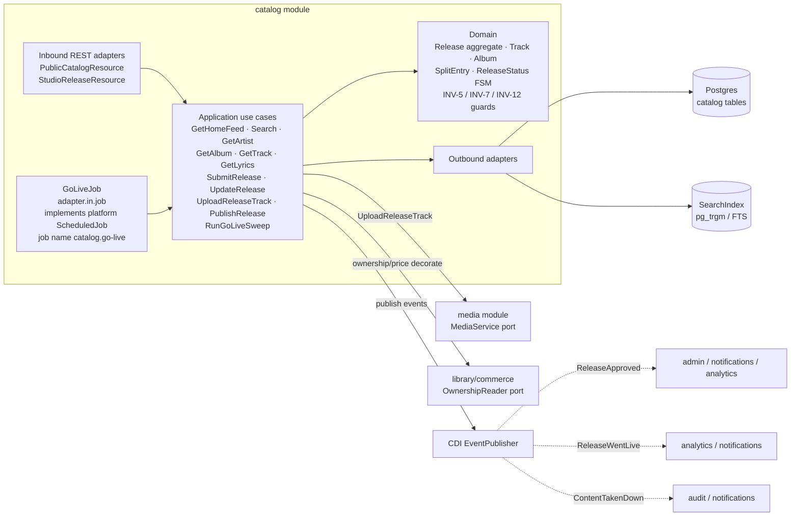
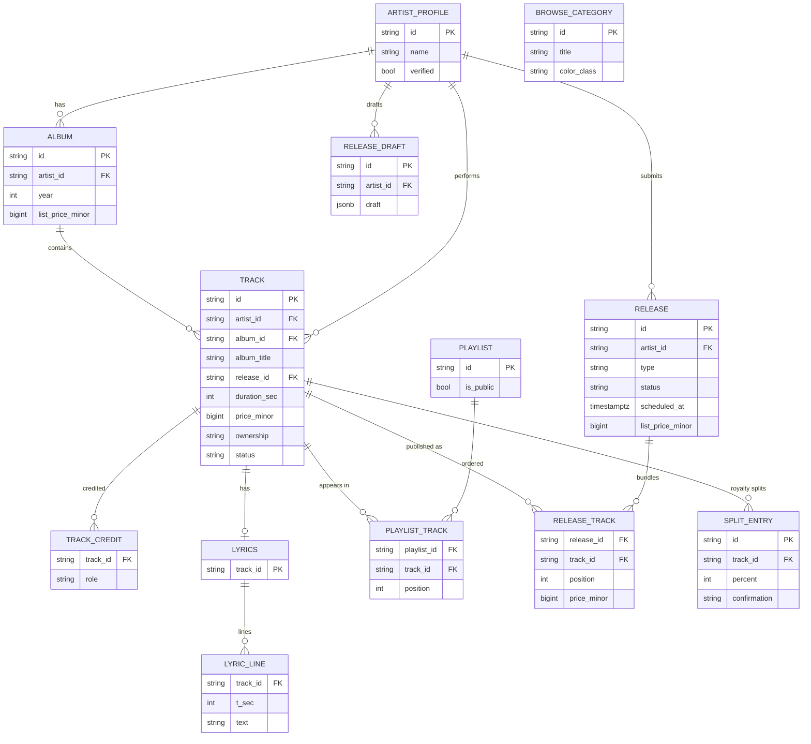
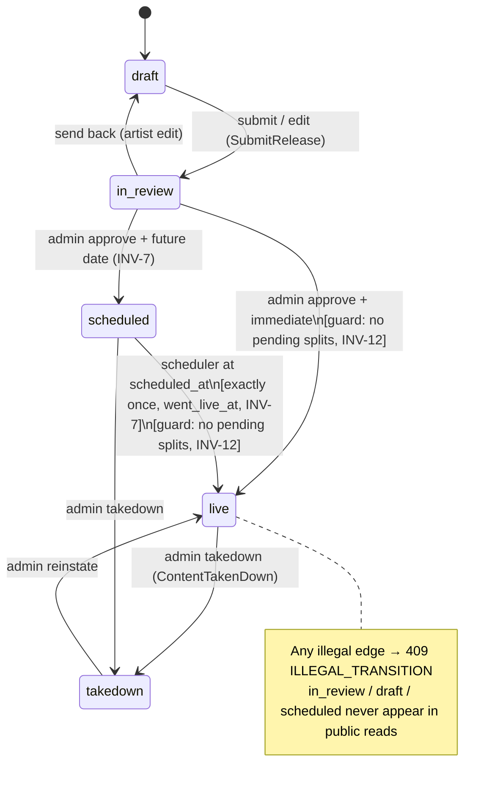

# Architecture Design Doc — `catalog` (`Catalog & Releases`)

> **Status:** Stable · **PRD source:** `BACKEND-PRD.md` §6.2 · **Owning context:** `Catalog & Releases` ·
> **Package root:** `org.shakvilla.beatzmedia.catalog`
>
> This ADD is consumed by Claude Code agents. It is the design contract for the module: an agent
> reads it, plans the listed work units, implements within the stated ports/adapters, writes the
> tests, and opens a PR. Do not invent endpoints or fields not traceable to the PRD / `API-CONTRACT.md`.

## 1. Purpose & responsibilities

The `catalog` module owns the **public read catalog** (home feed, search, browse tiles, artist /
album / track / playlist detail, timed lyrics) **and** the **creator-owned release lifecycle** (the
Studio 4-step wizard, moderation states, and scheduled go-live). It is the source of inventory for
the whole platform: tracks, albums, and artist profiles are created here and projected to every other
surface by id. It serves the **Fan** surface (anonymous reads allowed) and the **Studio** surface
(authenticated `artist` writes), and is moderated by the **Admin** surface. It covers
**HLFR-CATALOG-01** (public browse, LLFR-CATALOG-01.1–01.7) and **HLFR-CATALOG-02** (release creation
& lifecycle, LLFR-CATALOG-02.1–02.5).

It explicitly does **not** own: ownership/pricing-for-caller decoration (sourced from `commerce` /
`library` via ports), stream-URL issuance and preview clipping (`playback`), the physical
upload→transcode→signed-delivery pipeline (`media`, consumed via the `MediaService` port), the
search engine itself (`SearchIndex` port backed by Postgres `pg_trgm`/full-text, owned jointly with
WU-SRCH-1), payment/ledger effects of a sale (`payments`), and moderation actor/audit writing
(`admin` + `audit` — `catalog` only emits the domain events those modules consume).

## 2. Context & dependencies (C4 component view)



**Dependency rule.** `adapter.in.rest` / `adapter.in.job` → `application` → `domain`; outbound
adapters implement `application` output ports; inbound never imports outbound (ArchUnit-enforced).
`GoLiveJob` (`adapter.in.job`, WU-CAT-4) is the concrete inbound scheduler adapter: it implements the
platform kernel's `ScheduledJob` SPI (`platform.application.port.in.ScheduledJob`), is discovered and
ticked every 60 s by the platform `SchedulerRegistry` (WU-PLT-2) under the job name
`catalog.go-live`, and calls only the `RunGoLiveSweep` application input port — it does not touch
persistence directly. **Cross-module calls** are via input ports only: `media` (`UploadReleaseTrack`
→ `MediaService`), `commerce`/`library` (per-caller `ownership`/`price` decoration via
`OwnershipReader`), and `admin` — the approve/takedown/reinstate REST surface that WU-CAT-4
temporarily hosted directly in `catalog.adapter.in.rest.AdminCatalogResource` (no separate `admin`
module REST layer existed yet) has been **relocated to `admin.adapter.in.rest.AdminCatalogResource`
(WU-ADM-3)**, per this section's own original note (§5.1 below). `catalog` still owns the FSM
itself — `admin` calls `PublishRelease` in-process via its own `CatalogAdminPort` output port
(admin ADD §4.3/§13); `catalog` requires no admin scope of its own any more since it no longer
serves that REST surface. **Persistence is never shared**: `catalog`
reads/writes only its own tables; other modules reference its rows by id. **Events published:**
`ReleaseApproved`, `ReleaseWentLive`, `ContentTakenDown` (after-commit, ids + minimal snapshot).

## 3. Domain model

**Aggregates / entities / value objects**

| Name | Kind | Key fields | Notes |
|---|---|---|---|
| `Release` | Aggregate root | `id`, `artistId`, `title`, `type`, `status`, `scheduledAt?`, `listPriceMinor`, `tracks[]` | Owns the lifecycle FSM; enforces INV-7, INV-12, INV-5. |
| `ReleaseTrack` | Entity (in Release) | `trackId`, `position`, `priceMinor` | Ordered constituents; price feeds bundle math. |
| `SplitEntry` | Value object | `id`, `trackId`, `name`, `email`, `role`, `percent`, `confirmation` | Per-track royalty split of the **creator pool**; INV-12. |
| `ReleaseDraft` | Entity | `id`, `artistId`, JSON draft state, `updatedAt` | Server-persisted wizard draft (hydrates the client). |
| `Track` | Aggregate root | `id`, `title`, `artistId`, `albumId?`, `durationSec`, `ownership`, `priceMinor?`, `plays`, `quality`, `year`, `releaseId?`, `status` | `ownership`/`price` decorated per-caller at the boundary. |
| `TrackCredit` | Value object | `role`, `names[]` | Track detail credits. |
| `Album` | Aggregate root | `id`, `title`, `artistId`, `artistName`, `year`, `coverImage`, `trackIds[]` | List price derived via INV-5 from constituent tracks. |
| `Lyrics` | Entity | `trackId`, `lines: LyricLine[]` | One-to-zero/one with Track. |
| `LyricLine` | Value object | `tSec`, `text` | Time in **whole seconds** (frontend formats). |
| `ArtistProfile` | Aggregate root | `id`, `name`, `image`, `coverImage?`, `verified`, `monthlyListeners`, `followers`, `bio`, `location`, `genres[]`, `shows[]` | Public artist page + sub-collections. |
| `Show` | Value object | `date`, `city`, `venue` | ISO date; surfaced on artist page. |
| `Playlist` | Aggregate root | `id`, `title`, `description?`, `creator`, `image`, `isPublic`, `followers`, `trackIds[]` | Editorial/public; private hidden as 404 to non-owner. |
| `BrowseCategory` | Value object | `id`, `title`, `colorClass` | Search-screen tiles. |

**Enums** (lifted verbatim from `Frontend/src/types`, `studio-data.ts`, `release-draft-context.tsx`)

- `ReleaseType = single | ep | album | mixtape`
- `ReleaseStatus = live | scheduled | in_review | draft | takedown` (PRD R6: `takedown` added for moderation parity)
- `SplitConfirmation = self | confirmed | pending | auto`
- `UploadedTrack.status = uploading | ready | error`
- `OwnershipStatus = owned | free | for-sale`
- `Genre = Afrobeats | Hiplife | Highlife | Amapiano | Drill | Gospel | R&B | Reggae | Jazz`

**Invariants enforced here** (guard conditions in the domain, not the UI)

- **INV-5 (bundle discount).** A multi-track release's list price = `round(Σ track price_minor × (1 −
  bundleDiscountPct/100), 2)`, `bundleDiscountPct=24` from `PlatformSettings`. Singles get no
  discount. Computed on minor units, half-up. Guard: recompute on submit/track-change.
- **INV-7 (scheduled go-live).** A `scheduled` release is **not** publicly readable/streamable before
  `scheduledAt`; the scheduler flips it to `live` at/after that instant **exactly once**.
- **INV-12 (split sum).** For each track, `Σ SplitEntry.percent ≤ 100`; the originating creator holds
  the remainder implicitly. A release **cannot** transition to `live` while any split is `pending`.



## 4. Application layer (ports)

### 4.1 Input ports (use cases)

```java
// ---- Public catalog reads (HLFR-CATALOG-01) — auth optional; caller decorates ownership/price ----

public interface GetHomeFeed {                       // LLFR-CATALOG-01.1
    HomeFeed get(Optional<AccountId> caller);
}

public interface Search {                            // LLFR-CATALOG-01.2
    SearchResults search(String query, Optional<AccountId> caller);
}

public interface ListBrowseCategories {              // LLFR-CATALOG-01.3
    List<BrowseCategoryView> list();
}

public interface GetArtist {                         // LLFR-CATALOG-01.4
    ArtistView getArtist(ArtistId id);
    List<TrackView> tracks(ArtistId id, Optional<AccountId> caller);
    List<AlbumView> albums(ArtistId id);
    List<ShowView> shows(ArtistId id);
}

public interface GetAlbum {                          // LLFR-CATALOG-01.5
    AlbumView get(AlbumId id, boolean includeTracks, Optional<AccountId> caller);
}

public interface GetTrack {                          // LLFR-CATALOG-01.6
    TrackView get(TrackId id, Optional<AccountId> caller);
}

public interface GetLyrics {                         // LLFR-CATALOG-01.6
    LyricsView get(TrackId id);
}

public interface GetPlaylist {                       // LLFR-CATALOG-01.7
    PlaylistView get(PlaylistId id, Optional<AccountId> caller);
}

// ---- Creator release lifecycle (HLFR-CATALOG-02) — auth artist; ownership re-checked in app ----

public interface ListStudioReleases {               // LLFR-CATALOG-02.1
    Page<StudioReleaseView> list(ArtistId owner, Optional<ReleaseStatus> status, PageRequest page);
}

public interface SubmitRelease {                     // LLFR-CATALOG-02.2  → emits nothing public (in_review)
    StudioReleaseView submit(ArtistId owner, SubmitReleaseCommand cmd);
    record SubmitReleaseCommand(
        String title, ReleaseType type, Optional<Instant> date, Visibility visibility,
        List<UploadedTrackRef> tracks, Map<TrackId, List<SplitEntryCommand>> splits) {}
    record UploadedTrackRef(TrackId trackId, int position, long priceMinor) {}
    record SplitEntryCommand(String name, String email, String role, int percent, SplitConfirmation confirmation) {}
}

public interface GetRelease {                        // LLFR-CATALOG-02.3
    StudioReleaseView get(ArtistId owner, ReleaseId id);
}

public interface UpdateRelease {                     // LLFR-CATALOG-02.3 (metadata + publish/unpublish)
    StudioReleaseView update(ArtistId owner, ReleaseId id, UpdateReleaseCommand cmd);
    record UpdateReleaseCommand(
        Optional<String> title, Optional<Instant> date, Optional<Visibility> visibility,
        Optional<Map<TrackId, Long>> trackPricesMinor, Optional<PublishAction> publish) {}
    enum PublishAction { PUBLISH, UNPUBLISH }
}

public interface DeleteRelease {                     // LLFR-CATALOG-02.3 (draft/in_review only; else RELEASE_LIVE)
    void delete(ArtistId owner, ReleaseId id);
}

public interface UploadReleaseTrack {               // LLFR-CATALOG-02.4 (delegates to MediaService)
    UploadedTrackView upload(ArtistId owner, ReleaseId id, AudioUpload upload);
    record AudioUpload(String filename, String contentType, long sizeBytes, InputStream data) {}
}

public interface PublishRelease {                    // LLFR-CATALOG-02.5 (the FSM driver; called by admin + scheduler)
    StudioReleaseView transition(
        ReleaseId id, ReleaseTransition action, String actorId, Optional<Instant> scheduledAt);
    // Overload used by TAKEDOWN, which the contract requires a free-text reason for; the reason
    // is carried on the AuditEntry and the ContentTakenDown event.
    default StudioReleaseView transition(
        ReleaseId id, ReleaseTransition action, String actorId,
        Optional<Instant> scheduledAt, String reason) { ... }
    enum ReleaseTransition { APPROVE_IMMEDIATE, APPROVE_SCHEDULED, GO_LIVE, TAKEDOWN, REINSTATE }
}

public interface RunGoLiveSweep {                    // LLFR-PLATFORM-01.2 (WU-CAT-4) — sweep entry point
    int run();  // returns count of releases transitioned to live this sweep
}
```

For each: **trigger** REST resource or scheduler; **authorization** public reads are anonymous-OK,
all `Studio*`/`*Release` require `artist` + owner re-check, `PublishRelease` (approve/takedown/
reinstate) requires an admin scope enforced by `admin.adapter.in.rest.AdminCatalogResource`
(`POST /v1/admin/catalog/:id/{approve,takedown,reinstate}` — relocated there by WU-ADM-3, see §5.1
note and admin ADD §15; `super-admin`/`moderator` write, `support` read),
`GO_LIVE` is system-only (scheduler, never exposed on an HTTP path). **Idempotency** reads are nat.
idempotent; `SubmitRelease` is keyed by `Idempotency-Key`; FSM transitions are guard-idempotent
(re-issuing a settled transition throws `IllegalTransitionException` → 409 `ILLEGAL_TRANSITION`
rather than repeating a side effect). **Emitted events** (CDI `Event<T>.fire()`, mirroring the
`AccountRegistered` pattern — no separate `EventPublisher` port yet exists in the codebase):
`SubmitRelease` → none public; `APPROVE_*` → `ReleaseApproved`; `GO_LIVE`/immediate approve →
`ReleaseWentLive`; `TAKEDOWN` → `ContentTakenDown`. **Audit (INV-10):** `PublishReleaseService`
appends exactly one `AuditEntry` (type `MODERATION`) per admin-triggered transition
(`APPROVE_SCHEDULED`, `APPROVE_IMMEDIATE`, `TAKEDOWN`, `REINSTATE`); `GO_LIVE` is system-initiated
and does not audit (no admin actor).

### 4.2 Output ports

```java
public interface CatalogRepository {   // Postgres + Panache adapter (adapter.out.persistence)
    Optional<ArtistProfile> findArtist(ArtistId id);
    List<Track> tracksByArtist(ArtistId id);
    List<Album> albumsByArtist(ArtistId id);
    Optional<Album> findAlbum(AlbumId id);
    Optional<Track> findTrack(TrackId id);
    Optional<Lyrics> findLyrics(TrackId id);
    Optional<Playlist> findPlaylist(PlaylistId id);
    List<BrowseCategory> browseCategories();
    HomeFeedRows homeFeed();
    Page<Release> releasesByArtist(ArtistId owner, Optional<ReleaseStatus> status, PageRequest page);
    Optional<Release> findRelease(ReleaseId id);
    void save(Release release);
    void delete(ReleaseId id);
    List<Release> dueScheduled(Instant now);   // INV-7 go-live sweep; row-locked (PESSIMISTIC_WRITE)
    boolean hasPendingSplits(ReleaseId releaseId);      // WU-CAT-4 — INV-12 live-transition guard
    void markReleaseTracksReady(ReleaseId releaseId);   // WU-CAT-4 — flips constituent tracks 'ready'
}

public interface SearchIndex {         // pg_trgm / full-text adapter (WU-SRCH-1)
    SearchResults query(String q);
    void index(SearchDoc doc);
    void remove(String docId);
}

public interface MediaService {        // media module client (WU-MED-1) — upload→validate→transcode→signed
    UploadHandle upload(AudioUpload upload);   // throws UnsupportedFormatException → UNSUPPORTED_FORMAT
    ProbeResult probe(UploadHandle handle);    // duration_sec, format
}

public interface Clock {               // platform kernel
    Instant now();
}

public interface EventPublisher {      // CDI event bridge; after-commit dispatch
    void publish(DomainEvent event);
}
```

Implementing outbound adapters: `CatalogRepository` → Hibernate-ORM-Panache repos mapping domain ↔
JPA entities; `SearchIndex` → Postgres `pg_trgm` adapter; `MediaService` → REST/in-process client of
the `media` module; `Clock` → kernel system clock; `EventPublisher` → CDI `jakarta.enterprise.event`.

## 5. Adapters

### 5.1 Inbound — REST resources

Base path `/v1`. JSON/UTF-8. Studio endpoints require `Authorization: Bearer <jwt>` with `artist`
role; public reads accept anonymous (token, if present, decorates `ownership`/`price`).

| Method | Path | Auth/scope | Request DTO | Response DTO | Success | Error codes | LLFR |
|---|---|---|---|---|---|---|---|
| GET | `/home` | public | — | `HomeFeed` | 200 | — | 01.1 |
| GET | `/search?q=` | public | query `q` | `SearchResults` | 200 | 422 `MISSING_QUERY` | 01.2 |
| GET | `/browse-categories` | public | — | `BrowseCategory[]` | 200 | — | 01.3 |
| GET | `/artists/:id` | public | — | `Artist` | 200 | 404 `ARTIST_NOT_FOUND` | 01.4 |
| GET | `/artists/:id/tracks` | public | — | `Track[]` | 200 | 404 `ARTIST_NOT_FOUND` | 01.4 |
| GET | `/artists/:id/albums` | public | — | `Album[]` | 200 | 404 `ARTIST_NOT_FOUND` | 01.4 |
| GET | `/artists/:id/shows` | public | — | `Show[]` | 200 | 404 `ARTIST_NOT_FOUND` | 01.4 |
| GET | `/albums/:id?tracks=true` | public | `tracks` flag | `Album (+tracks)` | 200 | 404 `ALBUM_NOT_FOUND` | 01.5 |
| GET | `/tracks/:id` | public | — | `Track` | 200 | 404 `TRACK_NOT_FOUND` | 01.6 |
| GET | `/tracks/:id/lyrics` | public | — | `{ lines: {time,text}[] }` | 200 | 404 `LYRICS_NOT_FOUND` | 01.6 |
| GET | `/playlists/:id` | public | — | `Playlist (+tracks)` | 200 | 404 (private→404) | 01.7 |
| GET | `/studio/releases?status=&page=&size=` | artist (owner) | — | `{ items: StudioRelease[], page, size, total }` | 200 | 401/403 | 02.1 |
| POST | `/studio/releases` | artist | `SubmitReleaseRequest` (full draft) | `StudioRelease` (`in_review`) | 201 | 422 `TRACK_COUNT_INVALID`, 422 `SPLIT_OVER_100` | 02.2 |
| GET | `/studio/releases/:id` | artist (owner) | — | `StudioRelease` | 200 | 403/404 | 02.3 |
| PATCH | `/studio/releases/:id` | artist (owner) | `UpdateReleaseRequest` | `StudioRelease` | 200 | 409 `ILLEGAL_TRANSITION`, 409 `RELEASE_LIVE` | 02.3 |
| DELETE | `/studio/releases/:id` | artist (owner) | — | — | 204 | 409 `RELEASE_LIVE` | 02.3 |
| POST | `/studio/releases/:id/tracks` | artist (owner) | multipart audio (WAV/FLAC) | `UploadedTrack` | 201 | 422 `UNSUPPORTED_FORMAT`, 413 | 02.4 |

**~~POST `/admin/catalog/:id/{approve,takedown,reinstate}`~~ — relocated to the `admin` module
(WU-ADM-3).** WU-CAT-4 originally hosted these three endpoints directly in
`catalog.adapter.in.rest.AdminCatalogResource` as an explicitly documented *temporary* placeholder
("no separate `admin` REST module exists yet to own them ... a future `admin`-module WU may
relocate these three endpoints and/or add `flag`"). That relocation has now happened: WU-ADM-3
deleted `catalog.adapter.in.rest.AdminCatalogResource` (and its IT test) and moved
`approve`/`takedown`/`reinstate` to `admin.adapter.in.rest.AdminCatalogResource` at the SAME `/v1/
admin/catalog/:id/{approve,takedown,reinstate}` paths — see admin ADD §15 for the full write-up
(RBAC narrowed from `moderator`\|`editor` to `super-admin`\|`moderator`\|`support`(read), per admin
ADD §8's matrix; response is now `CatalogItemDetail`, not `StudioRelease`; `flag` was added there
too, as an admin-owned `ModerationCase`, not a catalog FSM transition). The underlying
`PublishRelease` input port, `Release` FSM, and every domain invariant on this page are
**completely unchanged** — `admin` calls `PublishRelease` in-process via its own `CatalogAdminPort`
output port, exactly as this note originally anticipated. The scheduler's `GO_LIVE` transition
remains system-only and is never exposed on an HTTP path — it is driven exclusively by `GoLiveJob`
via `RunGoLiveSweep`. Resources are thin: DTO → command → input port → DTO. No business logic in
resources (conventions §5).

### 5.2 Outbound — persistence & integrations

`CatalogRepositoryAdapter` (Hibernate-ORM-Panache) maps domain aggregates ↔ JPA entities (domain
carries no ORM annotations); transaction boundary = the application service (`@Transactional` on the
use-case impl). `SearchIndexAdapter` keeps a `pg_trgm`/full-text projection in sync on release
go-live / track change (WU-SRCH-1). `MediaServiceClient` calls the `media` module for
upload/validate/transcode (rejects non-WAV/FLAC → `UnsupportedFormatException`, oversize → 413,
returns probed `durationSec` and an async `uploading→ready|error` status). `OwnershipReaderClient`
(from `commerce`/`library`) decorates each outbound `Track` with per-caller `ownership`/`price`.
`EventPublisherAdapter` dispatches domain events `AFTER_SUCCESS` (ids + minimal snapshot, never JPA
entities).

## 6. DTOs & API shapes

Field-level, traceable to `Frontend/src/types/index.ts`, `studio-data.ts`, and
`release-draft-context.tsx`. Money on the wire is `{ amount: <decimal cedis>, currency: "GHS" }`
(stored `*_minor`); durations are whole seconds; timestamps ISO-8601.

- **Track** — `id`, `title`, `artistId`, `artistName`, `albumId?`, `albumTitle?`, `duration` (sec),
  `image`, `ownership` (`owned|free|for-sale`), `price?` (`Money`, present when `for-sale`), `plays?`,
  `audioUrl?`, `credits?: TrackCredit[]` (`{role, names[]}`), `quality?`, `year?`.
- **Album** — `id`, `title`, `artistId`, `artistName`, `year`, `coverImage`, `genres?: Genre[]`,
  `trackIds: ID[]`; with `?tracks=true` embeds `tracks: Track[]` (each decorated per-caller). List
  price derived via INV-5 (see §8).
- **Artist** — `id`, `name`, `image`, `coverImage?`, `verified?`, `monthlyListeners?`, `followers?`,
  `bio?`, `location?`, `genres?: Genre[]`. Sub-collections returned by `/tracks`, `/albums`, `/shows`.
- **Playlist** — `id`, `title`, `description?`, `creator`, `creatorAvatar?`, `image`, `isPublic`,
  `followers?`, `trackIds: ID[]`; detail embeds `tracks: Track[]`.
- **StudioRelease** — `id`, `title`, `type` (`single|ep|album|mixtape`), `status`
  (`live|scheduled|in_review|draft|takedown`), `date` (display string; `—` for drafts), `trackCount`,
  `streams`, `revenue` (cedis), `price` (cedis, per-track list price).
- **UploadedTrack** — `id`, `title`, `duration` (sec), `status` (`uploading|ready|error`),
  `progress` (0–100), `src` (delivery URL), `price` (cedis; 0 = free), `explicit` (bool).
- **SplitEntry** — `id`, `name`, `email`, `role`, `percent` (0–100 of creator pool),
  `confirmation` (`self|confirmed|pending|auto`).

## 7. Persistence schema & migrations

Money in minor units (`*_minor BIGINT`), durations `*_sec INT`, timestamps `TIMESTAMPTZ` (UTC), PK
`id`, FKs `<entity>_id`. No cross-module FKs (references by id resolved via ports).

```sql
CREATE TABLE artist_profile (
  id               TEXT PRIMARY KEY,
  name             TEXT NOT NULL,
  image            TEXT NOT NULL,
  cover_image      TEXT,
  verified         BOOLEAN NOT NULL DEFAULT FALSE,
  monthly_listeners BIGINT,
  followers        BIGINT,
  bio              TEXT,
  location         TEXT,
  genres           TEXT[] NOT NULL DEFAULT '{}',
  created_at       TIMESTAMPTZ NOT NULL DEFAULT now(),
  updated_at       TIMESTAMPTZ NOT NULL DEFAULT now()
);

CREATE TABLE album (
  id               TEXT PRIMARY KEY,
  title            TEXT NOT NULL,
  artist_id        TEXT NOT NULL REFERENCES artist_profile(id),
  artist_name      TEXT NOT NULL,
  year             INT  NOT NULL,
  cover_image      TEXT NOT NULL,
  genres           TEXT[] NOT NULL DEFAULT '{}',
  -- INV-5: list_price_minor = round(Σ track.price_minor × (1 − bundleDiscountPct/100)); recomputed in app layer
  list_price_minor BIGINT NOT NULL DEFAULT 0
);
CREATE INDEX idx_album_artist ON album(artist_id);

CREATE TABLE release (
  id               TEXT PRIMARY KEY,
  artist_id        TEXT NOT NULL REFERENCES artist_profile(id),
  title            TEXT NOT NULL,
  type             TEXT NOT NULL CHECK (type IN ('single','ep','album','mixtape')),
  status           TEXT NOT NULL CHECK (status IN ('draft','in_review','scheduled','live','takedown')),
  visibility       TEXT NOT NULL CHECK (visibility IN ('public','scheduled')),
  scheduled_at     TIMESTAMPTZ,                 -- INV-7: go-live instant for status='scheduled'
  went_live_at     TIMESTAMPTZ,                 -- set once by the go-live job (idempotency guard)
  list_price_minor BIGINT NOT NULL DEFAULT 0,   -- INV-5
  created_at       TIMESTAMPTZ NOT NULL DEFAULT now(),
  updated_at       TIMESTAMPTZ NOT NULL DEFAULT now()
);
CREATE INDEX idx_release_artist_status ON release(artist_id, status);
CREATE INDEX idx_release_due ON release(scheduled_at) WHERE status = 'scheduled'; -- go-live sweep

CREATE TABLE track (
  id               TEXT PRIMARY KEY,
  title            TEXT NOT NULL,
  artist_id        TEXT NOT NULL REFERENCES artist_profile(id),
  artist_name      TEXT NOT NULL,
  album_id         TEXT REFERENCES album(id),
  album_title      TEXT,                         -- denormalised; set when album_id is non-null
  release_id       TEXT REFERENCES release(id),
  duration_sec     INT  NOT NULL,
  image            TEXT NOT NULL,
  audio_url        TEXT,
  ownership        TEXT NOT NULL CHECK (ownership IN ('owned','free','for-sale')),
  price_minor      BIGINT,                       -- present when ownership='for-sale'
  plays            BIGINT NOT NULL DEFAULT 0,
  quality          TEXT,
  year             INT,
  status           TEXT NOT NULL DEFAULT 'ready' CHECK (status IN ('uploading','ready','error')),
  search_tsv       tsvector
);
CREATE INDEX idx_track_artist ON track(artist_id);
CREATE INDEX idx_track_album  ON track(album_id);
CREATE INDEX idx_track_release ON track(release_id);
CREATE INDEX idx_track_search ON track USING GIN (search_tsv);                -- full-text
CREATE INDEX idx_track_title_trgm ON track USING GIN (title gin_trgm_ops);    -- pg_trgm fuzzy

CREATE TABLE track_credit (
  track_id         TEXT NOT NULL REFERENCES track(id) ON DELETE CASCADE,
  role             TEXT NOT NULL,
  names            TEXT[] NOT NULL,
  PRIMARY KEY (track_id, role)
);

CREATE TABLE lyrics (
  track_id         TEXT PRIMARY KEY REFERENCES track(id) ON DELETE CASCADE
);
CREATE TABLE lyric_line (
  track_id         TEXT NOT NULL REFERENCES lyrics(track_id) ON DELETE CASCADE,
  t_sec            INT  NOT NULL,
  text             TEXT NOT NULL,
  PRIMARY KEY (track_id, t_sec)
);

CREATE TABLE playlist (
  id               TEXT PRIMARY KEY,
  title            TEXT NOT NULL,
  description      TEXT,
  creator          TEXT NOT NULL,
  creator_avatar   TEXT,
  image            TEXT NOT NULL,
  is_public        BOOLEAN NOT NULL DEFAULT TRUE,
  followers        BIGINT
);
CREATE TABLE playlist_track (
  playlist_id      TEXT NOT NULL REFERENCES playlist(id) ON DELETE CASCADE,
  track_id         TEXT NOT NULL,                -- references catalog track by id
  position         INT  NOT NULL,
  PRIMARY KEY (playlist_id, position)
);

CREATE TABLE browse_category (
  id               TEXT PRIMARY KEY,
  title            TEXT NOT NULL,
  color_class      TEXT NOT NULL
);

CREATE TABLE release_track (
  release_id       TEXT NOT NULL REFERENCES release(id) ON DELETE CASCADE,
  track_id         TEXT NOT NULL REFERENCES track(id),
  position         INT  NOT NULL,
  price_minor      BIGINT NOT NULL,
  PRIMARY KEY (release_id, position)
);

CREATE TABLE split_entry (
  id               TEXT PRIMARY KEY,
  track_id         TEXT NOT NULL REFERENCES track(id) ON DELETE CASCADE,
  name             TEXT NOT NULL,
  email            TEXT NOT NULL,
  role             TEXT NOT NULL,
  percent          INT  NOT NULL CHECK (percent BETWEEN 0 AND 100),
  confirmation     TEXT NOT NULL CHECK (confirmation IN ('self','confirmed','pending','auto'))
  -- INV-12: app-layer guard enforces Σ percent per track ≤ 100; no live transition with 'pending'
);
CREATE INDEX idx_split_track ON split_entry(track_id);

CREATE TABLE release_draft (
  id               TEXT PRIMARY KEY,
  artist_id        TEXT NOT NULL REFERENCES artist_profile(id),
  draft            JSONB NOT NULL,               -- mirrors ReleaseDraft (client wizard state)
  updated_at       TIMESTAMPTZ NOT NULL DEFAULT now()
);
CREATE INDEX idx_release_draft_artist ON release_draft(artist_id);
```

**Flyway migrations** (forward-only, `src/main/resources/db/migration/`):

- `V301__create_artist_profile_album.sql`, `V302__create_track_credit_lyrics.sql`,
  `V303__create_playlist.sql`, `V304__catalog_browse_category.sql` — read entities + indexes
  (WU-CAT-1/WU-CAT-2).
- `V305__catalog_releases.sql` — release, release_track, split_entry, release_draft + indexes,
  **including `release.went_live_at` and the partial due-index
  `idx_release_due ON release(scheduled_at) WHERE status='scheduled'`**, + FK
  `track.release_id → release(id)` (WU-CAT-3).
- **WU-CAT-4 added no new migration** — the go-live guard column and due-index needed by the
  `dueScheduled` sweep already shipped in `V305`; the FSM and sweep are pure application/domain
  logic over the existing schema. The next free catalog-band version remains `V306`.
- Repeatable `R__seed_dev_data.sql` contributes the mock catalog (artists, albums, tracks, playlists,
  browse categories, a sample creator's releases) — dev/test profiles only.

## 8. Key flows

**Album price / bundle discount note (INV-5).** On `SubmitRelease` and any track-price change, the
domain recomputes `list_price_minor`. For a **multi-track** release/album:
`listPriceMinor = roundHalfUp(Σ releaseTrack.priceMinor × (100 − bundleDiscountPct) / 100)`, with
`bundleDiscountPct = 24` from `PlatformSettings` (never hard-coded). All arithmetic is on minor units;
the discount is applied to the **sum** then rounded once (half-up) — not per track — so the bundle
total equals `round(Σ price × 0.76, 2)`. **Singles** (`type=single`) take no discount: list price =
the single track's price.

```mermaid
sequenceDiagram
  actor Artist
  participant REST as StudioReleaseResource
  participant SUB as SubmitRelease
  participant DOM as Release (domain)
  participant ADM as Admin (moderator)
  participant PUB as PublishRelease
  participant JOB as Go-live scheduler
  participant BUS as EventPublisher

  Artist->>REST: POST /studio/releases (full draft)
  REST->>SUB: submit(owner, cmd)
  SUB->>DOM: validate type/track-count (INV-12 splits≤100)
  DOM->>DOM: compute list_price_minor (INV-5)
  DOM-->>SUB: Release(status=in_review)
  SUB-->>REST: 201 StudioRelease (in_review, not public)

  ADM->>PUB: transition(APPROVE_SCHEDULED, actor)
  PUB->>DOM: guard in_review→scheduled (future date)
  DOM-->>PUB: status=scheduled
  PUB->>BUS: ReleaseApproved
  Note over DOM: not publicly readable before scheduled_at (INV-7)

  JOB->>PUB: transition(GO_LIVE) at scheduled_at
  PUB->>DOM: guard scheduled→live; no pending splits (INV-12); set went_live_at once (INV-7)
  DOM-->>PUB: status=live
  PUB->>BUS: ReleaseWentLive
  Note over JOB,DOM: tracks now publicly streamable
```



## 9. Cross-cutting hooks

- **Auth/scope.** `studio.*` endpoints require the `artist` role (enforced at the REST adapter) **and**
  an owner re-check in the application layer (an artist touches only their own releases — else 403/404).
  Public reads accept anonymous; a present token only decorates `ownership`/`price`. `PublishRelease`
  approve/takedown/reinstate are invoked by `admin.adapter.in.rest.AdminCatalogResource` (relocated
  there by WU-ADM-3 — see §5.1 note and admin ADD §15; `super-admin`/`moderator` write, `support`
  read); `GO_LIVE` is system-only (scheduler, `GoLiveJob`), never exposed on an HTTP path.
- **Idempotency.** `SubmitRelease` honors `Idempotency-Key`; FSM transitions are guard-idempotent
  (`went_live_at` makes go-live fire exactly once; a repeat call throws `IllegalTransitionException`
  rather than re-firing side effects — verified by `RunGoLiveSweepServiceTest` and (post-relocation)
  `admin.it.AdminCatalogResourceIT`).
- **Audit (INV-10).** Approve / takedown / reinstate are privileged mutations — `PublishReleaseService`
  appends exactly one `AuditEntry` (type `MODERATION`) per admin-triggered transition, atomically in
  the same transaction as the state change, via the `AuditWriter` output port (not the audit table
  directly). `GO_LIVE` is system-initiated (no admin actor) and does not audit. This module also emits
  the domain events (`ReleaseApproved`, `ReleaseWentLive`, `ContentTakenDown`) the
  audit/notifications/analytics modules consume after commit.
- **Error model.** Uniform envelope `{ error: { code, message, field? } }`. Codes used here:
  `ARTIST_NOT_FOUND` (404), `ALBUM_NOT_FOUND` (404), `TRACK_NOT_FOUND` (404), `LYRICS_NOT_FOUND`
  (404), `PLAYLIST_NOT_FOUND` (404), `MISSING_QUERY` (422), `TRACK_COUNT_INVALID` (422),
  `SPLIT_OVER_100` (422, INV-12), `RELEASE_LIVE` (409, delete of live), `ILLEGAL_TRANSITION`
  (409, FSM), `UNSUPPORTED_FORMAT` (422, non-WAV/FLAC). Private/`in_review` resources are hidden as 404.
- **Domain events.** `ReleaseApproved`, `ReleaseWentLive`, `ContentTakenDown` (ids + snapshot,
  after-commit; fired via CDI `Event<T>.fire()` from `PublishReleaseService`, mirroring the
  `AccountRegistered` pattern already used by `identity` — no separate `EventPublisher` port exists in
  the codebase yet, so this ADD's illustrative `EventPublisher` output port is aspirational, not
  implemented; update if/when a cross-cutting event-bus port is introduced).
- **Known gap — split persistence (tracked, not blocking WU-CAT-4).** `SubmitRelease` (WU-CAT-3)
  validates that per-track split percentages sum to ≤100 (INV-12, `SPLIT_OVER_100`) but does not
  persist `SplitEntry` rows to `split_entry` — they are validated in memory and discarded. WU-CAT-4's
  `CatalogRepository.hasPendingSplits` guard is implemented and unit/integration-tested against the
  `split_entry` table, but with no rows ever written the guard is currently always "no pending
  splits" (a real block against real pending data, not a silent gap for INV-12's *current* enforced
  scope: no split can be pending if none are persisted). This is safe (never falsely blocks or
  falsely allows a real pending split) but does not yet let an admin observe/confirm splits before
  go-live. A future WU should extend `SubmitRelease`/`UpdateRelease` to persist `SplitEntry` rows so
  the guard has real data to act on.
- **Observability.** Micrometer counters: releases by status, go-live job runs/failures, search QPS;
  spans on submit and the go-live sweep. Structured logs, no PII.

## 10. Work units & build order

| WU | Scope (LLFRs) | Depends on | Order |
|---|---|---|---|
| **WU-CAT-1** | Catalog read entities + read endpoints artists/albums/tracks/playlists/lyrics (CATALOG-01.4–01.7) | WU-PLT-1 | 1 |
| **WU-SRCH-1** | Search index lifecycle, `pg_trgm`/FTS (SEARCH-01.*) — consumed by 01.2 | WU-CAT-1 | 2 |
| **WU-CAT-2** | Home feed + browse + search read (CATALOG-01.1–01.3) | WU-CAT-1, WU-SRCH-1 | 3 |
| **WU-MED-1** | Media upload→validate→transcode→signed URL (MEDIA-01.*) — used by track upload | WU-PLT-1 | parallel |
| **WU-CAT-3** ✅ | Release wizard submit + manage + track upload (CATALOG-02.1–02.4) | WU-CAT-1, WU-MED-1, WU-IDN-3 | 4 |
| **WU-CAT-4** ✅ | Release state machine + scheduled go-live (CATALOG-02.5, PLATFORM-01.2) | WU-CAT-3, WU-PLT-2 | 5 |

Cross-reference PRD §8 / §8.1. Phase-1 order within catalog: WU-CAT-1 → WU-SRCH-1 → WU-CAT-2 ;
WU-CAT-3 → WU-CAT-4 (WU-MED-1 lands in Phase 0 foundations).

## 11. Testing plan

**Unit** (domain + use cases with fakes): bundle-discount math (INV-5) on minor units; split-sum guard
(INV-12); the `ReleaseStatus` FSM (every legal edge + illegal → `ILLEGAL_TRANSITION`); go-live
exactly-once via `went_live_at`. **Integration** (Testcontainers Postgres + MinIO, REST-assured):
endpoint table §5.1, multipart upload via `MediaService`, search via `pg_trgm`. **Contract**:
responses validate against `Frontend/src/types` / `API-CONTRACT.md` (OpenAPI contract test green).

Key Given/When/Then cases (PRD §6.2):

- **01.1** Given seeded catalog, When `GET /home`, Then `trending/top10/featuredAlbums/rails` all
  non-empty and each `Track` matches the `Track` type.
- **01.2** Given empty `q`, When `GET /search?q=`, Then 422 `MISSING_QUERY`.
- **01.4** Given unknown id, When `GET /artists/:id`, Then 404 `ARTIST_NOT_FOUND`.
- **01.6** Given a track without lyrics, When `GET /tracks/:id/lyrics`, Then 404 `LYRICS_NOT_FOUND`.
- **01.7** Given a private playlist accessed by a non-owner, Then 404 (existence hidden).
- **02.2** Given a valid multi-track draft, When submit, Then a release is created `in_review`, album
  list price = `round(Σ price × 0.76, 2)`, and it is **not** returned by public catalog reads.
- **02.2** Given a single with 2 tracks (or splits summing > 100), Then 422 `TRACK_COUNT_INVALID` /
  `SPLIT_OVER_100`.
- **02.3** Given a `live` release, When `DELETE`, Then 409 `RELEASE_LIVE`.
- **02.4** Given a WAV upload, Then the track returns a probed `duration` and transitions to `ready`;
  given a non-WAV/FLAC, Then 422 `UNSUPPORTED_FORMAT`.
- **02.5** Given a `scheduled` release whose `date` has passed, When the go-live job runs, Then status
  becomes `live` exactly once and its tracks become publicly streamable.

Coverage ≥ the gate in `sdlc/testing-strategy.md`; Spotless clean; ArchUnit green.

## 12. Definition of done (module-specific)

Global DoD (conventions §11 / PRD §8) **plus**:

1. A release **cannot** go `live` while any `SplitEntry.confirmation = pending` for its tracks
   (INV-12) — asserted in unit + integration.
2. Scheduled go-live fires **exactly once** at `scheduled_at` (idempotent via `went_live_at`); a
   `scheduled` release is not publicly readable/streamable before then (INV-7).
3. `in_review` / `draft` / `scheduled`(pre-instant) releases never appear in public catalog reads
   (`/home`, `/search`, `/artists/*`, `/albums/*`, `/tracks/*`, `/playlists/*`).
4. Album/release list price equals `round(Σ track price × (1 − bundleDiscountPct/100), 2)` on minor
   units, half-up, single rounding (INV-5); singles take no discount.
5. Every illegal FSM edge returns 409 `ILLEGAL_TRANSITION`; all §9 error codes are assertable.
6. Approve / takedown / reinstate emit the documented domain events; contract test green against the
   frontend types.
