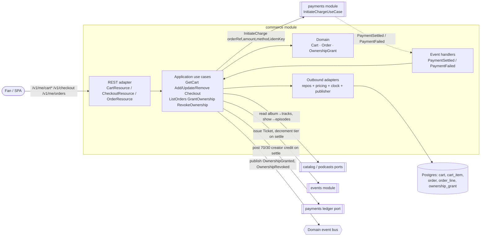
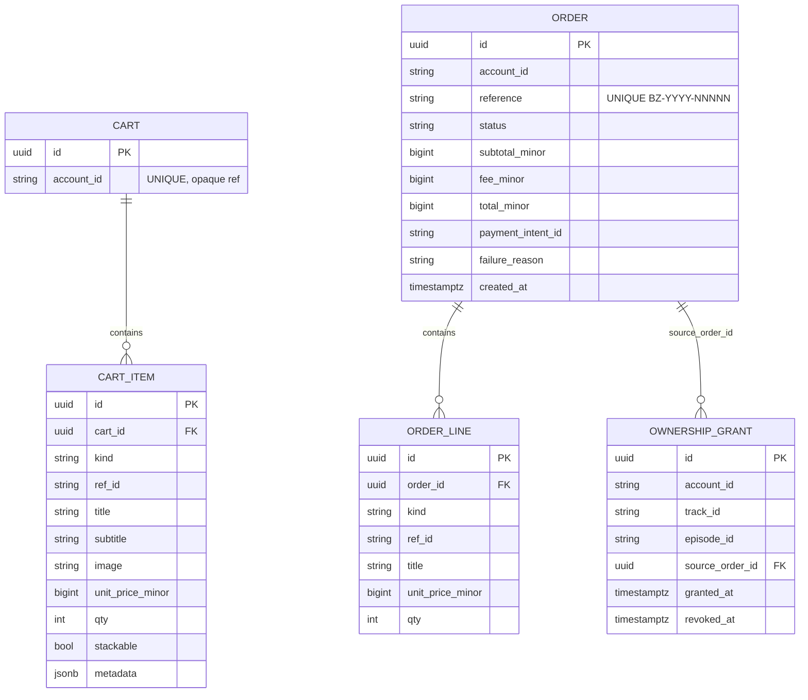
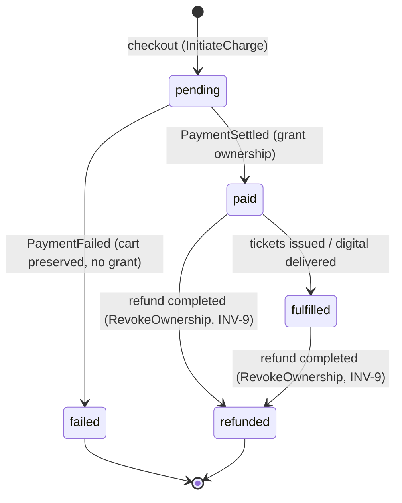

# Architecture Design Doc — `commerce` (Commerce / Orders & Ownership)

> **Status:** Stable · **PRD source:** `BACKEND-PRD.md` §6.5 · **Owning context:** `commerce` ·
> **Package root:** `org.shakvilla.beatzmedia.commerce`
>
> This ADD is consumed by Claude Code agents. It is the design contract for the module: an agent
> reads it, plans the listed work units, implements within the stated ports/adapters, writes the
> tests, and opens a PR. Do not invent endpoints or fields not traceable to the PRD / `API-CONTRACT.md`.

## 1. Purpose & responsibilities

The `commerce` module owns the buy-side of the platform: the per-user **cart** (mixed item kinds,
stackability, server-computed totals), **checkout orchestration** (validate cart, snapshot prices into
an order, then delegate the actual charge to `payments` via the `InitiateCharge` input port), **order
history**, and the authoritative **creation and revocation of `OwnershipGrant`s**. It explicitly does
**not** own money movement, payment intents, the ledger, refunds, or provider integration — those live
in `payments` (§6.6) and are reached only through input ports / domain events. It also does **not**
own catalog truth (album→track and show→episode expansion data is read from `catalog`/`podcasts` via
ports) nor ticket inventory truth (`events` module), though it triggers ticket issuance on settlement.
Surface: **Fan** only (cart, buy buttons, checkout, receipt, order history; the buy-to-own unlock that
playback later reads). HLFRs covered: **HLFR-COMMERCE-01** (cart) and **HLFR-COMMERCE-02** (checkout &
ownership grant), i.e. LLFR-COMMERCE-01.1–01.3 and 02.1–02.5.

## 2. Context & dependencies (C4 component view)



**Dependency rule.** `adapter.in.rest → application → domain` inward only; `domain` depends on nothing
framework-specific. Cross-module calls go **only** through input ports (`InitiateChargeUseCase`,
catalog/podcasts readers, events issuer, ledger poster) or via domain events; **persistence is never
shared** — commerce holds no FK to another module's tables (album track ids, episode ids, payment
intent id are stored as opaque ids and resolved through ports). Commerce **calls** `payments`
(`InitiateCharge`) and **consumes** `PaymentSettled`/`PaymentFailed`; it **publishes**
`OwnershipGranted` and `OwnershipRevoked`.

## 3. Domain model

| Name | Kind | Key fields | Notes |
|---|---|---|---|
| `Cart` | Aggregate root | `id`, `accountId` (unique), `items[]` | One per account; lazily created on first add. |
| `CartItem` | Entity (within Cart) | `lineId`, `kind`, `refId`, `title`, `subtitle?`, `image`, `unitPrice (Money)`, `qty`, `stackable`, `metadata` | `lineId` stable, e.g. `track:last-last`, `ticket:iron-boy-live:VIP`. |
| `Order` | Aggregate root | `id`, `accountId`, `reference (BZ-YYYY-NNNNN)`, `status`, `subtotal/fee/total (Money)`, `paymentIntentId?`, `failureReason?`, `lines[]`, `createdAt` | Immutable price snapshot taken at checkout. |
| `OrderLine` | Entity (within Order) | `id`, `kind`, `refId`, `title`, `unitPrice (Money)`, `qty` | Snapshot — never re-priced after checkout. |
| `OwnershipGrant` | Aggregate root | `id`, `accountId`, `trackId?`, `episodeId?`, `sourceOrderId`, `grantedAt`, `revokedAt?` | Exactly one of `trackId`/`episodeId` set. Active when `revokedAt IS NULL`. |
| `Money` | Value object (kernel) | `minor`, `currency` | From `platform` kernel; minor units. |
| `IdempotencyKey` | Value object (kernel) | `value` | Required on `/checkout`. |

**Enums** (lifted verbatim from frontend `CartItemKind` and PRD §6.5):

- `CartItemKind = track | album | album-rest | store | episode | season-pass | ticket`
- `OrderStatus = pending | paid | fulfilled | refunded | failed`

**Stackability rule (domain):** `track, album, album-rest, episode, season-pass` are **non-stackable**
digital one-offs (qty fixed at 1; re-add is a no-op); `ticket` and `store` (merch) are **stackable**
with qty clamped to `1..99`.

**Invariants enforced here:**

- **INV-1** — `GrantOwnership` is only ever invoked from the `PaymentSettled` handler; no code path
  creates a grant on `pending`/`failed`. Guard: `order.status == paid` before any grant.
- **INV-2** — On settle, an `album`/`album-rest` line expands to one grant per constituent **track id**;
  a `season-pass` line expands to one grant per premium **episode id** of the show.
- **INV-9** — A completed refund (driven from `payments`) invokes `RevokeOwnership`, setting
  `revoked_at` on every grant whose `source_order_id` matches.
- **INV-11** — All money is `*_minor` internally; totals (`subtotal = Σ unitPrice×qty`,
  `fee = serviceFee when items>0 else 0`, `total = subtotal+fee`) are computed half-up on minor units.



## 4. Application layer (ports)

### 4.1 Input ports (use cases)

```java
public interface GetCartUseCase {
    CartView getCart(AccountId account);
}

public interface AddCartItemUseCase {
    CartView add(AccountId account, AddCartItemCommand command);
}

public interface UpdateCartItemUseCase {
    CartView updateQuantity(AccountId account, CartLineId lineId, int qty);
}

public interface RemoveCartItemUseCase {
    CartView remove(AccountId account, CartLineId lineId);
}

public interface CheckoutUseCase {
    CheckoutResult checkout(AccountId account, IdempotencyKey key, PaymentMethodId method);
}

public interface ListOrdersUseCase {
    Page<OrderSnapshot> listOrders(AccountId account, PageRequest page);
}

/** Internal — invoked only by the PaymentSettled handler (INV-1). */
public interface GrantOwnershipUseCase {
    void grantForSettledOrder(OrderId orderId);
}

/** Internal — invoked only by the refund/PaymentRefunded handler (INV-9). */
public interface RevokeOwnershipUseCase {
    void revokeForOrder(OrderId orderId, RefundReason reason);
}

// Commands / results (records)
public record AddCartItemCommand(CartItemKind kind, String refId, Integer qty,
                                 Map<String, Object> metadata) {}
public record CartView(List<CartItemDto> items, Money subtotal, Money fee, Money total, int count) {}
public sealed interface CheckoutResult permits CheckoutResult.Pending, CheckoutResult.Settled {
    record Pending(OrderId orderId, PaymentIntentId paymentIntentId) implements CheckoutResult {}
    record Settled(OrderSnapshot snapshot) implements CheckoutResult {}
}
```

| Port | Trigger | Authorization | Idempotency | Emitted events | LLFR |
|---|---|---|---|---|---|
| `GetCartUseCase` | `GET /me/cart` | fan; own cart only | n/a (read) | — | 01.1 |
| `AddCartItemUseCase` | `POST /me/cart/items` | fan; own cart | non-stackable re-add = no-op | — | 01.2 |
| `UpdateCartItemUseCase` | `PATCH /me/cart/items/:lineId` | fan; own cart | idempotent (qty set, not delta) | — | 01.3 |
| `RemoveCartItemUseCase` | `DELETE /me/cart/items/:lineId` | fan; own cart | idempotent (remove-missing ok) | — | 01.3 |
| `CheckoutUseCase` | `POST /checkout` | fan; own cart | **`Idempotency-Key`** → same order/intent | (none until settle) | 02.1 |
| `ListOrdersUseCase` | `GET /me/orders` | fan; own orders | n/a (read) | — | 02.4 |
| `GrantOwnershipUseCase` | `PaymentSettled` event | system (internal) | idempotent on `orderId` | `OwnershipGranted`, `sale` notif | 02.2 / 02.5 |
| `RevokeOwnershipUseCase` | refund completed event | system (internal) | idempotent on `orderId` | `OwnershipRevoked` | INV-9 |

### 4.2 Output ports

```java
public interface CartRepository {
    Optional<Cart> findByAccount(AccountId account);
    Cart save(Cart cart);
    void delete(CartId id);
}

public interface OrderRepository {
    Order save(Order order);
    Optional<Order> findById(OrderId id);
    Optional<Order> findByReference(String reference);
    Page<Order> findByAccount(AccountId account, PageRequest page);
}

public interface OwnershipRepository {
    OwnershipGrant save(OwnershipGrant grant);
    boolean existsActiveForTrack(AccountId account, TrackId track);
    boolean existsActiveForEpisode(AccountId account, EpisodeId episode);
    List<OwnershipGrant> findBySourceOrder(OrderId orderId);
}

/** Server-side price/expansion source; never trusts the client (INV-2, INV-11). */
public interface PricingService {
    PricedItem priceFor(CartItemKind kind, String refId, Map<String, Object> metadata);
    List<TrackId> tracksOfAlbum(String albumRefId);
    List<EpisodeId> premiumEpisodesOfShow(String seasonPassRefId);
}

public interface EventPublisher {
    void publish(DomainEvent event); // AFTER_SUCCESS
}

public interface Clock { Instant now(); }

/** Cross-module input port owned by payments (§6.6) — commerce calls it. */
public interface InitiateChargeUseCase {
    PaymentIntent initiateCharge(String orderReference, Money amount,
                                 PaymentMethodId method, IdempotencyKey key);
}
```

Implementing adapters (one line each): `CartRepository`/`OrderRepository`/`OwnershipRepository` →
Panache/JDBC persistence adapters in `adapter.out.persistence` (domain↔JPA mapping, no ORM on domain);
`PricingService` → adapter calling `catalog`/`podcasts`/`store` input ports + `PlatformSettings`;
`EventPublisher` → CDI/transactional-outbox publisher; `Clock` → `platform` kernel clock;
`InitiateChargeUseCase` → injected directly (in-process call to the `payments` application service).

## 5. Adapters

### 5.1 Inbound — REST resources

| Method | Path | Auth/scope | Request DTO | Response DTO | Success | Error codes | LLFR |
|---|---|---|---|---|---|---|---|
| GET | `/v1/me/cart` | fan | — | `CartView` | 200 | 401 | 01.1 |
| POST | `/v1/me/cart/items` | fan | `AddCartItemRequest {id?,kind,refId,qty?,metadata?}` | `CartView` | 200 | 401, 409 `ALREADY_OWNED`, 409 `TIER_SOLD_OUT`, 422 | 01.2 |
| PATCH | `/v1/me/cart/items/:lineId` | fan | `UpdateCartItemRequest {qty}` | `CartView` | 200 | 401, 404, 409 `NOT_STACKABLE`, 422 | 01.3 |
| DELETE | `/v1/me/cart/items/:lineId` | fan | — | `CartView` | 200 | 401, 404 | 01.3 |
| POST | `/v1/checkout` | fan + `Idempotency-Key` | `CheckoutRequest {paymentMethodId, idempotencyKey}` | `CheckoutResponse {orderId, paymentIntentId, status}` **or** `OrderSnapshot` | **202** (async MoMo) / **200** (sync-settled rail) | 401, 409 `CART_EMPTY`, 409 `ALREADY_OWNED`, 409 `TIER_SOLD_OUT`, 422 | 02.1 |
| GET | `/v1/me/orders` | fan | `?page=&size=` | `Page<OrderSnapshot>` | 200 | 401 | 02.4 |

Resources are thin: map DTO → command, call input port, map result → DTO, map domain exception →
error envelope via the per-family `ExceptionMapper`. No business logic in resources.

### 5.2 Outbound — persistence & integrations

- **Persistence adapter** maps each domain aggregate ↔ JPA entity (`CartEntity`/`CartItemEntity`,
  `OrderEntity`/`OrderLineEntity`, `OwnershipGrantEntity`); money columns are `BIGINT *_minor`, cedis
  conversion happens only at the REST boundary. Transaction boundary = the use case
  (`@Transactional` on the application service impl).
- **`payments` integration:** `InitiateChargeUseCase` called inside the checkout transaction; the
  returned `PaymentIntent.id` is persisted on the order. Settlement arrives **asynchronously** via the
  `PaymentSettled`/`PaymentFailed` domain-event handlers (separate transactions).
- **Catalog/podcasts/store readers** resolve album→tracks, show→episodes, and unit prices for
  `PricingService`. **Events module** is invoked on a settled `ticket` line to issue the `Ticket` and
  decrement tier availability. **Ledger poster** (payments port) records the 70/30 creator credit on
  settle (INV-4).
- **Event publishing** uses a transactional outbox so `OwnershipGranted`/`OwnershipRevoked` publish
  `AFTER_SUCCESS` (kernel §8); events carry ids + a minimal snapshot, never JPA entities.

## 6. DTOs & API shapes

Money on the wire is `{ amount: <decimal cedis>, currency: "GHS" }`; timestamps ISO-8601; durations
whole seconds. Field lists traceable to frontend `cart-context.tsx` / `types/index.ts`.

**`CartItem`** (response, mirrors frontend `CartItem`):

| Field | Type | Notes |
|---|---|---|
| `id` | string | line id, e.g. `track:last-last` |
| `kind` | `CartItemKind` | enum |
| `title` | string | |
| `subtitle` | string? | optional |
| `image` | string | cover/thumbnail URL |
| `price` | `Money` | unit price `{amount,currency}` |
| `quantity` | int | 1 for non-stackable; 1–99 for stackable |
| `stackable` | bool? | true for `ticket`/`store` |

**`OrderSnapshot`** (response, mirrors frontend `OrderSnapshot`):

| Field | Type | Notes |
|---|---|---|
| `items` | `OrderLine[]` | snapshot lines |
| `subtotal` | `Money` | Σ unit×qty |
| `fee` | `Money` | service fee (₵0.50) when non-empty |
| `total` | `Money` | subtotal + fee |
| `reference` | string | `BZ-YYYY-NNNNN` |
| `orderId` | string | |
| `status` | `OrderStatus` | |
| `createdAt` | string | ISO-8601 |
| `tickets` | `Ticket[]?` | present when ticket lines settled (02.5) |

**`OrderLine`** (response):

| Field | Type | Notes |
|---|---|---|
| `id` | string | |
| `kind` | `CartItemKind` | |
| `refId` | string | catalog/episode/event ref |
| `title` | string | snapshotted |
| `unitPrice` | `Money` | snapshotted at checkout |
| `quantity` | int | |

## 7. Persistence schema & migrations

```sql
-- V20__commerce_cart.sql
CREATE TABLE cart (
    id          UUID PRIMARY KEY,
    account_id  VARCHAR(64) NOT NULL UNIQUE
);

CREATE TABLE cart_item (
    id               UUID PRIMARY KEY,
    cart_id          UUID NOT NULL REFERENCES cart(id) ON DELETE CASCADE,
    kind             VARCHAR(16) NOT NULL,
    ref_id           VARCHAR(64) NOT NULL,
    title            VARCHAR(256) NOT NULL,
    subtitle         VARCHAR(256),
    image            VARCHAR(512),
    unit_price_minor BIGINT NOT NULL CHECK (unit_price_minor >= 0),
    qty              INT NOT NULL DEFAULT 1 CHECK (qty BETWEEN 1 AND 99),
    stackable        BOOLEAN NOT NULL DEFAULT FALSE,
    metadata         JSONB,
    UNIQUE (cart_id, kind, ref_id)            -- collapse duplicate non-stackable adds
);
CREATE INDEX ix_cart_item_cart ON cart_item (cart_id);

-- V21__commerce_order.sql
CREATE TABLE "order" (
    id                UUID PRIMARY KEY,
    account_id        VARCHAR(64) NOT NULL,
    reference         VARCHAR(16) NOT NULL UNIQUE,      -- BZ-YYYY-NNNNN
    status            VARCHAR(16) NOT NULL,             -- pending|paid|fulfilled|refunded|failed
    subtotal_minor    BIGINT NOT NULL,
    fee_minor         BIGINT NOT NULL,
    total_minor       BIGINT NOT NULL,
    payment_intent_id VARCHAR(64),
    failure_reason    VARCHAR(256),
    created_at        TIMESTAMPTZ NOT NULL DEFAULT now()
);
CREATE INDEX ix_order_account_created ON "order" (account_id, created_at DESC);
CREATE INDEX ix_order_payment_intent ON "order" (payment_intent_id);

CREATE TABLE order_line (
    id               UUID PRIMARY KEY,
    order_id         UUID NOT NULL REFERENCES "order"(id) ON DELETE CASCADE,
    kind             VARCHAR(16) NOT NULL,
    ref_id           VARCHAR(64) NOT NULL,
    title            VARCHAR(256) NOT NULL,
    unit_price_minor BIGINT NOT NULL,
    qty              INT NOT NULL CHECK (qty BETWEEN 1 AND 99)
);
CREATE INDEX ix_order_line_order ON order_line (order_id);

-- V22__commerce_ownership_grant.sql
CREATE TABLE ownership_grant (
    id              UUID PRIMARY KEY,
    account_id      VARCHAR(64) NOT NULL,
    track_id        VARCHAR(64),
    episode_id      VARCHAR(64),
    source_order_id UUID NOT NULL REFERENCES "order"(id),
    granted_at      TIMESTAMPTZ NOT NULL DEFAULT now(),
    revoked_at      TIMESTAMPTZ,
    CHECK ( (track_id IS NOT NULL) <> (episode_id IS NOT NULL) )   -- exactly one target
);
-- one active grant per (account, track) / (account, episode); revoked rows excluded (INV-1/INV-9)
CREATE UNIQUE INDEX ux_grant_account_track
    ON ownership_grant (account_id, track_id) WHERE revoked_at IS NULL AND track_id IS NOT NULL;
CREATE UNIQUE INDEX ux_grant_account_episode
    ON ownership_grant (account_id, episode_id) WHERE revoked_at IS NULL AND episode_id IS NOT NULL;
CREATE INDEX ix_grant_source_order ON ownership_grant (source_order_id);
CREATE INDEX ix_grant_account ON ownership_grant (account_id);
```

**Flyway list:** `V20__commerce_cart.sql`, `V21__commerce_order.sql`,
`V22__commerce_ownership_grant.sql`. Forward-only; dev seed contributes sample cart/orders to
`R__seed_dev_data.sql` (dev/test only).

## 8. Key flows

```mermaid
sequenceDiagram
  actor Fan
  participant REST as CheckoutResource
  participant CO as CheckoutUseCase
  participant OR as OrderRepository
  participant PAY as InitiateChargeUseCase (payments)
  participant H as PaymentSettled handler
  participant OW as OwnershipRepository
  participant CAT as catalog/podcasts
  participant LED as ledger (payments)
  participant CART as CartRepository
  participant BUS as EventPublisher

  Fan->>REST: POST /v1/checkout {paymentMethodId} + Idempotency-Key
  REST->>CO: checkout(account,key,method)
  CO->>CART: load cart (409 CART_EMPTY if empty)
  CO->>CO: recompute subtotal/fee/total server-side (INV-11)
  CO->>OR: save Order(status=pending) + order_lines (snapshot)
  CO->>PAY: initiateCharge(reference,total,method,key)
  PAY-->>CO: PaymentIntent(pending)
  CO-->>REST: Pending(orderId,intentId)
  REST-->>Fan: 202 {orderId,paymentIntentId,status:pending}
  Note over PAY,H: async — provider webhook later
  PAY-->>H: PaymentSettled(orderId)
  H->>OR: load order; guard pending->paid (idempotent on orderId)
  H->>OR: order.status = paid
  H->>CAT: expand album->tracks, season-pass->episodes (INV-2)
  H->>OW: create OwnershipGrant per track/episode (INV-1)
  H->>LED: post 70/30 creator credit (INV-4)
  H->>CART: clear cart
  H->>BUS: publish OwnershipGranted + sale notifications
  Note over H: ticket lines -> issue Ticket, decrement tier (02.5)
  H-->>Fan: receipt OrderSnapshot (reference BZ-YYYY-NNNNN)
```



## 9. Cross-cutting hooks

- **Auth/scope.** All endpoints require `fan`; the application layer re-checks resource ownership
  (`cart.accountId == jwt.sub`, orders queried by `account_id` only). Private orders not owned by the
  caller → 404 (existence hidden).
- **Idempotency on `/checkout` (§9.2).** `Idempotency-Key` header is mandatory; the same key returns
  the **same** order + payment intent with no second charge. Commerce forwards the key to
  `InitiateCharge` (which is itself idempotent on the key) and persists `payment_intent_id` so a
  replay short-circuits to the existing order.
- **Idempotent event handlers (INV-1).** `PaymentSettled`/`PaymentFailed`/refund handlers are keyed on
  `orderId`: re-processing a settled order is a no-op (status guard + unique grant indexes prevent
  duplicate grants). Ownership is created **only** inside the `PaymentSettled` handler — never on
  `pending`/`failed`.
- **Refund revokes ownership (INV-9).** A completed refund from `payments` drives `RevokeOwnership`,
  setting `revoked_at` on all grants with that `source_order_id` and moving the order to `refunded`;
  the unique-active indexes then permit a future re-purchase.
- **Stackability.** Non-stackable kinds reject qty changes (`NOT_STACKABLE`) and collapse re-adds to a
  no-op; stackable kinds clamp `1..99`.
- **Audit (INV-10).** Refund-driven revocation appends an `AuditEntry` via the platform interceptor.
- **Error codes:** `CART_EMPTY` (409), `ALREADY_OWNED` (409), `NOT_STACKABLE` (409),
  `TIER_SOLD_OUT` (409), plus `ILLEGAL_TRANSITION` (409) for bad order-status moves; validation → 422.
- **Rate limiting.** `/checkout` is rate-limited per account/IP (429 + `Retry-After`, §9.5).
- **Observability.** Metrics: cart size, checkout count, checkout→settle latency, settlement success
  rate, grant count, revoke count. Spans cover REST → use case → `InitiateCharge`/DB; trace id on
  every request and propagated into the settlement handler via the event.

## 10. Work units & build order

| WU | Scope | LLFR coverage | Tables | Depends on | Order |
|---|---|---|---|---|---|
| **WU-COM-1** | Cart with stackability + server-computed totals | COMMERCE-01.1–01.3 | `cart`, `cart_item` | WU-PLT-1, WU-CAT-1 | 1 |
| **WU-COM-2** | Checkout orchestration + settlement→ownership grant + orders + ticket issuance | COMMERCE-02.1–02.5 | `order`, `order_line`, `ownership_grant` (+ `ticket` via events) | WU-COM-1, **WU-PAY-1**, **WU-PAY-3** | 2 |

Cross-ref PRD §8 Phase 2: `WU-PAY-1 → WU-PAY-3`; `WU-COM-1 → WU-COM-2` (needs PAY-1/3). Downstream:
`WU-PLY-1` (ownership-aware streaming) and `WU-PAY-5` (refund→revoke) depend on WU-COM-2.

## 11. Testing plan

- **Unit (domain + use cases with fakes):** stackability rules; totals math on minor units
  (`fee=₵0.50` when non-empty, half-up rounding); order-status state machine guards;
  album/season-pass expansion fan-out; grant uniqueness.
- **Integration (Testcontainers Postgres, REST-assured):** cart CRUD; checkout returns 202 with order
  `pending` and a persisted `payment_intent_id`; settlement handler grants + clears cart; refund
  revokes; unique-active grant index enforces single active grant.
- **Contract:** `CartView`, `OrderSnapshot`, `OrderLine` validate against frontend types / API contract.

PRD §6.5 Given/When/Then acceptance cases:

- **Album expansion (02.2):** *Given* a settled album purchase *When* `PaymentSettled` fires *Then*
  every track of the album appears in `/me/owned`, the order is `paid`, and creator balance reflects
  70% of the album price.
- **Already in cart (01.2):** *Given* a track already in cart *When* added again *Then* cart unchanged
  (qty stays 1); *Given* a ticket added twice *Then* qty=2.
- **Failed charge preserves cart (02.3):** *Given* a failed charge *When* `PaymentFailed` fires *Then*
  no ownership grant exists and the cart is preserved for retry; `GET` order shows the failure reason.
- **Sold-out tier (02.5):** *Given* the last ticket of a tier settles *Then* the tier reports
  `soldOut=true` and a further add → 409 `TIER_SOLD_OUT`.
- **Idempotent checkout (§9.2):** *Given* the same `Idempotency-Key` twice *Then* one order, one
  payment intent, no double charge.

Coverage ≥ the gate in `sdlc/testing-strategy.md`.

## 12. Definition of done (module-specific)

Global DoD (conventions §11 / PRD §8) **plus**:

1. **No ownership without settlement (INV-1):** an `OwnershipGrant` is created *only* in the
   `PaymentSettled` handler; ArchUnit/usage test proves `GrantOwnershipUseCase` has no other caller and
   pending/failed orders never produce grants.
2. **Totals computed server-side:** checkout recomputes subtotal/fee/total from `PricingService`,
   never trusting client-supplied amounts; verified by a test that sends tampered prices.
3. **Idempotent settlement:** replaying `PaymentSettled` for the same `orderId` produces no duplicate
   grants, no duplicate ledger credits, and a single cart clear (enforced by status guard + unique
   active grant indexes).
4. **Refund revokes ownership (INV-9):** a refund sets `revoked_at` on all matching grants and moves
   the order to `refunded`, restoring re-purchase eligibility.
5. **Album/season expansion (INV-2):** album/season-pass lines fan out to all constituent
   track/episode grants on settle.
