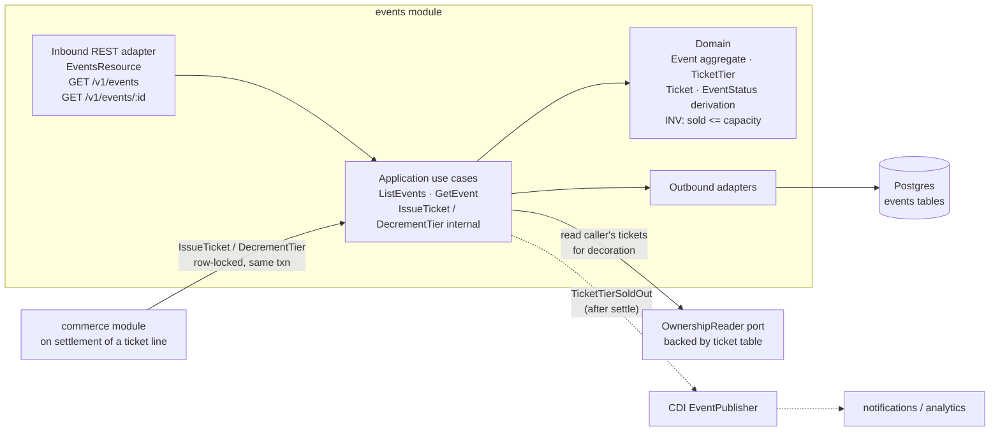
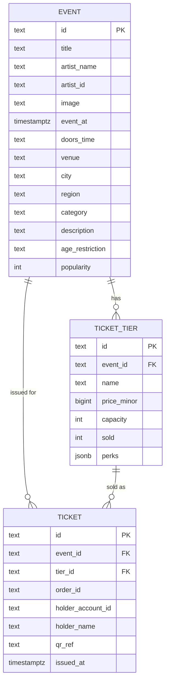
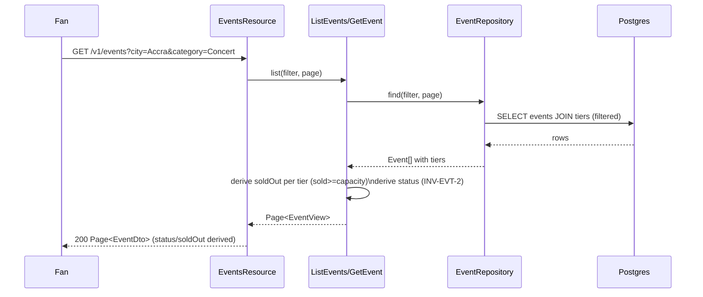
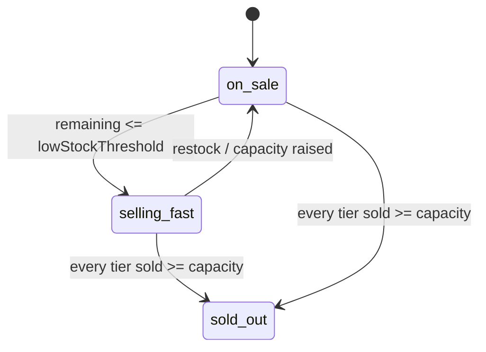

# Architecture Design Doc — `events` (`Events & Ticketing`)

> **Status:** Stable · **PRD source:** `BACKEND-PRD.md` §6.9 (with §6.5.5, OQ-11) · **Owning context:** `Events & Ticketing` ·
> **Package root:** `org.shakvilla.beatzmedia.events`
>
> This ADD is consumed by Claude Code agents. It is the design contract for the module: an agent
> reads it, plans the listed work units, implements within the stated ports/adapters, writes the
> tests, and opens a PR. Do not invent endpoints or fields not traceable to the PRD / `API-CONTRACT.md`.

## 1. Purpose & responsibilities

The `events` module owns the **public live-events catalog**: event listings and event detail with
their ticket tiers and **live availability** (per-tier `soldOut` and the derived event `status`). It
is the source of truth for the `event`, `ticket_tier`, and `ticket` tables and serves the **Fan**
surface only (anonymous reads allowed). It covers **HLFR-EVENTS-01** (event discovery & ticketing
data, LLFR-EVENTS-01.1–01.2), implemented by **WU-EVT-1**.

It explicitly does **not** own the **purchase or money path**. Tickets are bought through `commerce`
as a cart line (`kind: ticket`, `refId: "eventId:tier"`); `commerce` charges via `payments` and, **on
confirmed settlement only**, calls back into this module's internal `IssueTicket`/`DecrementTier`
port to mint the `ticket` row, decrement the tier's `sold` counter, and flip the event to `sold-out`
when the last tier sells out (PRD §6.5.5 / LLFR-COMMERCE-02.5). This module never initiates charges,
never grants ownership, and never writes orders or the ledger. It exposes an `OwnershipReader`
output port purely to read whether the caller already holds tickets for decoration; the canonical
ownership grant lives in `commerce`. Oversell prevention (OQ-11) is enforced inside the settlement
transaction owned by `commerce`, using row locking on `ticket_tier`.

## 2. Context & dependencies (C4 component view)



**Dependency rule.** `adapter.in.rest` → `application` → `domain`; outbound adapters implement
`application` output ports; inbound never imports outbound (ArchUnit-enforced). **Cross-module
calls:** `commerce` invokes this module's internal `IssueTicket`/`DecrementTier` input port on
ticket-line settlement; this module calls **out** only to `OwnershipReader` (read caller's existing
tickets for the per-caller decoration). **Persistence is never shared** — `commerce` references
`event`/`ticket_tier` by id (the `refId` string) and never FK-joins into these tables. **Events
published:** `TicketTierSoldOut` (after-commit, ids only) for notifications/analytics. No charge,
order, or ledger logic lives here.

## 3. Domain model

**Aggregates / entities / value objects**

| Name | Kind | Key fields | Notes |
|---|---|---|---|
| `Event` | Aggregate root | `id`, `title`, `artistName`, `artistId?`, `lineup[]`, `image`, `date`, `doorsTime?`, `venue`, `city`, `region?`, `category`, `description?`, `ageRestriction?`, `popularity?`, `tiers[]` | Owns its tiers; derives `status` from tier availability. |
| `TicketTier` | Entity (in Event) | `id`, `eventId`, `name`, `priceMinor`, `perks[]`, `capacity`, `sold` | `soldOut := sold >= capacity`; enforces no-oversell guard. |
| `Ticket` | Entity | `id`, `eventId`, `tierId`, `orderId`, `holderAccountId`, `holderName`, `qrRef`, `issuedAt` | Minted by `commerce` on settlement; one per seat sold. |

**Enums** (lifted verbatim from `Frontend/src/types/index.ts`):

```
EventStatus   = 'on-sale' | 'selling-fast' | 'sold-out'
EventCategory = 'Concert' | 'Festival' | 'Club Night' | 'Listening Party' | 'Tour'
```

**Invariants**

- **INV-EVT-1 (no oversell).** For every tier, `0 <= sold <= capacity`; an issuance that would push
  `sold > capacity` is rejected (`TIER_SOLD_OUT`). Enforced under row lock inside the settlement txn.
- **INV-EVT-2 (status derivation).** Event `status` is **derived, never free-typed**: `sold-out` when
  every tier is sold out; `selling-fast` when total remaining ≤ a low-stock threshold (or
  `popularity`-flagged) but some remains; otherwise `on-sale`. `soldOut` per tier is `sold >= capacity`.
- **INV-EVT-3 (issuance only on settlement).** A `ticket` row exists only as a result of a settled
  commerce ticket line (carries `orderId`); never minted on cart add or checkout-initiate.



## 4. Application layer (ports)

### 4.1 Input ports (use cases)

```java
/** List events for the Fan surface with optional city/category filters. LLFR-EVENTS-01.1. */
public interface ListEvents {
    Page<EventView> list(EventFilter filter, PageRequest page, Optional<AccountId> caller);
}

/** Single event detail incl. tiers with live availability. LLFR-EVENTS-01.2. */
public interface GetEvent {
    EventView get(EventId eventId, Optional<AccountId> caller);
}

/**
 * INTERNAL — invoked by `commerce` on settlement of a ticket line. NOT REST-exposed.
 * Mints a Ticket, decrements the tier under a row lock, and transitions the event to
 * sold-out when the last tier sells out. LLFR-COMMERCE-02.5 / PRD §6.5.5 / OQ-11.
 */
public interface IssueTicket {
    TicketIssued issue(IssueTicketCommand command);
}

/** Value passed by commerce; refId "eventId:tier" is parsed by commerce into these fields. */
public record IssueTicketCommand(
    EventId eventId, TicketTierId tierId, OrderId orderId,
    AccountId holderAccountId, String holderName, int quantity, IdempotencyKey key) {}

public record TicketIssued(List<TicketId> ticketIds, List<String> qrRefs, boolean tierNowSoldOut) {}
```

| Port | Trigger | Authorization | Idempotency | Emitted events | LLFR |
|---|---|---|---|---|---|
| `ListEvents` | `GET /v1/events` | Public (no auth) | n/a (read) | — | EVENTS-01.1 |
| `GetEvent` | `GET /v1/events/:id` | Public (no auth) | n/a (read) | — | EVENTS-01.2 |
| `IssueTicket` | commerce settlement callback | Internal (in-process call; not REST) | Keyed on `orderId`+`tierId` (re-delivery = same tickets, no double-decrement) | `TicketTierSoldOut` | COMMERCE-02.5 |

### 4.2 Output ports

```java
/** Persistence for events, tiers, and tickets. Implemented by JPA adapter (Postgres). */
public interface EventRepository {
    Page<Event> find(EventFilter filter, PageRequest page);
    Optional<Event> findById(EventId id);
    Optional<TicketTier> lockTierForUpdate(TicketTierId id); // SELECT ... FOR UPDATE
    void save(Event event);
    void saveTicket(Ticket ticket);
    boolean ticketExistsForOrderTier(OrderId orderId, TicketTierId tierId); // idempotency guard
}

/** Reads the caller's already-held tickets for per-caller decoration. Backed by ticket table. */
public interface OwnershipReader {
    Set<TicketTierId> heldTiersFor(AccountId account, EventId event);
}
```

- `EventRepository` → JPA persistence adapter over the `event` / `ticket_tier` / `ticket` tables;
  `lockTierForUpdate` issues `SELECT ... FOR UPDATE` (OQ-11 row lock).
- `OwnershipReader` → query adapter over `ticket` (this module's own table; canonical ownership grant
  remains in `commerce`).

## 5. Adapters

### 5.1 Inbound — REST resources

| Method | Path | Auth/scope | Request DTO | Response DTO | Success | Error codes | LLFR |
|---|---|---|---|---|---|---|---|
| GET | `/v1/events?city=&category=&page=&size=` | Public | query: `city?`, `category?`, `page=1`, `size=20` (max 100) | `Page<EventDto>` `{ items, page, size, total }` | 200 | 422 (bad `category`), 429 | EVENTS-01.1 |
| GET | `/v1/events/:id` | Public | path `id` | `EventDto` (incl. `ticketTiers: TicketTierDto[]`) | 200 | 404 `NOT_FOUND`, 429 | EVENTS-01.2 |

> **Tickets are not bought here.** Purchase is a `commerce` cart line: `POST /v1/me/cart/items`
> `{ id, kind: "ticket", refId: "eventId:tier", qty?, metadata? }` (API-CONTRACT §6/§9). `commerce`
> resolves `refId` (`split on ':'` → `eventId`, tier name/id) and, on settlement, calls `IssueTicket`.
> `category` filter validates against `EventCategory ∈ {Concert,Festival,Club Night,Listening Party,Tour}`.

### 5.2 Outbound — persistence & integrations

- **Persistence adapter** maps domain `Event`/`TicketTier`/`Ticket` ↔ JPA entities; domain carries no
  ORM annotations. `perks` stored as `jsonb`. Transaction boundary = the use case
  (`@Transactional` on the application-service impl). The settlement-path read of a tier uses
  pessimistic write lock (`lockTierForUpdate`).
- **No external clients** (no MoMo/card/bank, S3, SMTP/SMS) — all money/media flows are owned by
  `commerce`, `payments`, and `media`. The only cross-module collaborator at write time is
  `commerce`, calling the internal `IssueTicket` port in-process.
- **Mapping strategy:** money columns are minor units (`price_minor BIGINT`); the REST adapter
  converts to `{ amount, currency: "GHS" }` at the boundary (`amount = minor / 100`).

## 6. DTOs & API shapes

Traceable to `Frontend/src/types/index.ts` (`Event`, `TicketTier`). Money is `{ amount, currency }`;
timestamps ISO-8601; durations whole seconds. `status`/`soldOut` are **server-derived from live
availability**, not stored display strings.

**`EventDto`**

| Field | Type | Notes |
|---|---|---|
| `id` | string | event id |
| `title` | string | |
| `artistName` | string | headliner, denormalized for cards |
| `artistId?` | string | |
| `lineup?` | string[] | supporting acts |
| `image` | string | |
| `date` | string (ISO datetime) | event start |
| `doorsTime?` | string | display door time, e.g. `"7:00 PM"` |
| `venue` | string | |
| `city` | string | drives the `city` filter |
| `region?` | string | |
| `status` | enum | `on-sale` \| `selling-fast` \| `sold-out` — **derived** (INV-EVT-2) |
| `category` | enum | `Concert`\|`Festival`\|`Club Night`\|`Listening Party`\|`Tour` |
| `description?` | string | |
| `ticketTiers` | `TicketTierDto[]` | |
| `popularity?` | number | ranking weight |
| `ageRestriction?` | string | e.g. `"18+"` |

**`TicketTierDto`**

| Field | Type | Notes |
|---|---|---|
| `name` | string | e.g. `"Regular"`, `"VIP"` |
| `price` | `Money` `{ amount, currency }` | from `price_minor` |
| `perks?` | string[] | what the tier includes |
| `soldOut?` | boolean | **derived**: `sold >= capacity` (AC: zero remaining → `true`) |

> `capacity`/`sold` counters are internal and **not** serialized; only the derived `soldOut` is exposed.

## 7. Persistence schema & migrations

```sql
CREATE TABLE event (
  id                 TEXT PRIMARY KEY,
  title              TEXT        NOT NULL,
  artist_name        TEXT        NOT NULL,
  artist_id          TEXT,
  lineup             JSONB       NOT NULL DEFAULT '[]',
  image              TEXT        NOT NULL,
  event_at           TIMESTAMPTZ NOT NULL,
  doors_time         TEXT,
  venue              TEXT        NOT NULL,
  city               TEXT        NOT NULL,
  region             TEXT,
  category           TEXT        NOT NULL,           -- EventCategory
  description        TEXT,
  age_restriction    TEXT,
  popularity         INT         NOT NULL DEFAULT 0,
  created_at         TIMESTAMPTZ NOT NULL DEFAULT now(),
  updated_at         TIMESTAMPTZ NOT NULL DEFAULT now()
);
CREATE INDEX idx_event_city     ON event (city);
CREATE INDEX idx_event_category ON event (category);
CREATE INDEX idx_event_date     ON event (event_at);

CREATE TABLE ticket_tier (
  id          TEXT PRIMARY KEY,
  event_id    TEXT   NOT NULL REFERENCES event (id) ON DELETE CASCADE,
  name        TEXT   NOT NULL,
  price_minor BIGINT NOT NULL CHECK (price_minor >= 0),   -- money in pesewas
  capacity    INT    NOT NULL CHECK (capacity >= 0),
  sold        INT    NOT NULL DEFAULT 0 CHECK (sold >= 0 AND sold <= capacity), -- INV-EVT-1
  perks       JSONB  NOT NULL DEFAULT '[]',
  UNIQUE (event_id, name)
);
CREATE INDEX idx_tier_event ON ticket_tier (event_id);

CREATE TABLE ticket (
  id                TEXT PRIMARY KEY,
  event_id          TEXT        NOT NULL REFERENCES event (id),
  tier_id           TEXT        NOT NULL REFERENCES ticket_tier (id),
  order_id          TEXT        NOT NULL,                 -- commerce order ref (no cross-module FK)
  holder_account_id TEXT        NOT NULL,
  holder_name       TEXT        NOT NULL,
  qr_ref            TEXT        NOT NULL UNIQUE,          -- scan/admit reference
  issued_at         TIMESTAMPTZ NOT NULL DEFAULT now(),
  UNIQUE (order_id, tier_id, qr_ref)
);
CREATE INDEX idx_ticket_holder ON ticket (holder_account_id);
CREATE INDEX idx_ticket_order  ON ticket (order_id);
CREATE INDEX idx_ticket_event  ON ticket (event_id);
```

**Flyway migrations** (`src/main/resources/db/migration/`, forward-only):

- `V<n>__create_event.sql`
- `V<n+1>__create_ticket_tier.sql`
- `V<n+2>__create_ticket.sql`
- `R__seed_dev_data.sql` (dev/test only) — contributes the 7 events from `Frontend/src/lib/event-data.ts`
  with their tiers (a seeded `capacity`; `sold` set so `afro-nation-gh` tiers are at capacity to
  reproduce the `sold-out` fixture).

**OQ-11 — concurrency / oversell.** The `IssueTicket` path runs inside the **commerce settlement
transaction**: it `SELECT ... FOR UPDATE` the `ticket_tier` row (`lockTierForUpdate`), checks
`sold + qty <= capacity`, then `UPDATE ticket_tier SET sold = sold + qty`. The `CHECK (sold <=
capacity)` is the last-line DB guard. **Optional reservation:** on checkout-initiate a short-TTL hold
(reserved counter / expiry) may be added later behind the same port without contract change; v1 relies
on the settlement-time lock.

## 8. Key flows

**Browse / detail with live availability (read):**



**Settlement → ticket issuance + tier decrement + sold-out transition (cross-module with commerce):**

```mermaid
sequenceDiagram
  participant PAY as payments
  participant COM as commerce (Checkout/settle)
  participant EVT as events.IssueTicket
  participant REPO as EventRepository
  participant DB as Postgres
  PAY-->>COM: charge SETTLED (webhook, idempotent)
  Note over COM: for each ticket line: parse refId "eventId:tier"
  COM->>EVT: issue(eventId, tierId, orderId, holder, qty) [same txn]
  EVT->>REPO: lockTierForUpdate(tierId)  %% SELECT ... FOR UPDATE
  REPO->>DB: row lock on ticket_tier
  EVT->>REPO: ticketExistsForOrderTier(orderId,tierId)?  %% idempotency
  alt sold + qty > capacity
    EVT-->>COM: TIER_SOLD_OUT (409) — settlement rejects line
  else capacity ok
    EVT->>REPO: saveTicket(qrRef, holder) ; UPDATE sold = sold + qty
    EVT->>EVT: if all tiers sold out -> status=sold-out
    EVT-->>COM: TicketIssued(ticketIds, qrRefs, tierNowSoldOut)
    Note over EVT: after commit -> publish TicketTierSoldOut
  end
  COM-->>PAY: receipt includes issued tickets (LLFR-COMMERCE-02.5)
```

**Event availability state (derived):**



## 9. Cross-cutting hooks

- **Auth/scope.** Both REST endpoints are **public** (anonymous reads allowed); no scope check. The
  internal `IssueTicket` port is never REST-exposed and is callable only in-process from `commerce`.
- **Concurrency / oversell prevention (OQ-11).** Issuance acquires a **pessimistic write lock** on the
  `ticket_tier` row (`SELECT ... FOR UPDATE`) inside the commerce settlement txn, checks
  `sold + qty <= capacity`, then updates `sold`; the DB `CHECK (sold <= capacity)` backstops it. This
  guarantees concurrent settlements serialize and cannot oversell.
- **Sold-out derivation.** `TicketTierDto.soldOut := sold >= capacity`; `EventDto.status` derived per
  INV-EVT-2. Never stored as a display string.
- **Idempotency.** `IssueTicket` is keyed on `(orderId, tierId)` via `ticketExistsForOrderTier`; a
  re-delivered settlement does not re-mint tickets or re-decrement.
- **Error model.** Uniform envelope `{ error: { code, message, field? } }`. Codes:
  - `NOT_FOUND` (404) — unknown event id on `GET /v1/events/:id`.
  - `TIER_SOLD_OUT` (409) — issuance/add would exceed capacity. **Enforced in `commerce`** at cart-add
    and at settlement (this module returns the condition; commerce maps it to the cart/checkout response).
- **Audit.** No privileged mutation surfaces here; issuance audit (if any) is appended by `commerce`
  on the settled order (INV-10).
- **Observability.** Micrometer counters for event-detail views and tickets issued; gauge for
  remaining capacity per popular tier; OTel spans on the read path and the `IssueTicket` call;
  SmallRye Health check on the DB.

## 10. Work units & build order

| WU | Scope | LLFR | Owned tables | Depends on | Order |
|---|---|---|---|---|---|
| **WU-EVT-1** | Events browse + detail + tier availability (EVENTS-01.1–01.2); read ports `ListEvents`/`GetEvent`; `EventRepository`; expose internal `IssueTicket`/`DecrementTier` consumed by commerce | EVENTS-01.1, EVENTS-01.2 (+ supports COMMERCE-02.5) | `event`, `ticket_tier`, `ticket` | WU-CAT-1 | Phase 4 |

> Cross-ref PRD §8: `IssueTicket` is **wired** by **WU-COM-2** (commerce checkout/settlement →
> ownership grant + ticket issuance). This module ships the port + tables; commerce calls it.

## 11. Testing plan

- **Unit (domain/use-case with fakes).** `status`/`soldOut` derivation (INV-EVT-2); `capacity`/`sold`
  guard (INV-EVT-1); `category` filter validation; `refId` parse contract documented for commerce.
- **Integration (Testcontainers Postgres, REST-assured).** `GET /v1/events?city=&category=` paging &
  filtering; `GET /v1/events/:id` 200 / 404; concurrent `IssueTicket` calls against one tier.
- **Contract.** `EventDto` / `TicketTierDto` validate against `Frontend/src/types/index.ts`
  (`Event`, `TicketTier`, `EventStatus`, `EventCategory`); money is `{ amount, currency: "GHS" }`.

**Acceptance (PRD §6.9 / §6.5.5, Given/When/Then):**

- **EVENTS-01.2.** *Given* a tier with zero remaining (`sold == capacity`) *When* `GET /v1/events/:id`
  *Then* that tier's `soldOut == true` (and if all tiers are out, event `status == "sold-out"`).
- **COMMERCE-02.5 (oversell).** *Given* the last ticket of a tier *When* it settles *Then* the tier
  reports `soldOut == true` and any further add → 409 `TIER_SOLD_OUT`.
- **Concurrency (OQ-11).** *Given* a tier with capacity N and N+M concurrent settlements *When* they
  all run *Then* exactly N tickets are minted, `sold == capacity`, and the M excess fail
  `TIER_SOLD_OUT` — no oversell (verified with a Testcontainers parallel-issue test).
- **Unknown event.** *Given* an unknown id *When* `GET /v1/events/:id` *Then* 404 `NOT_FOUND`.

Coverage ≥ the gate in `sdlc/testing-strategy.md`.

## 12. Definition of done (module-specific)

Global DoD (PRD §8 / conventions §11) plus:

1. `GET /v1/events` and `GET /v1/events/:id` return shapes that validate against `Event`/`TicketTier`;
   `status`/`soldOut` are **derived from live availability**, never stored display strings.
2. Oversell is impossible (INV-EVT-1): the concurrent-issue Testcontainers test proves no tier exceeds
   `capacity`; `IssueTicket` holds the `ticket_tier` row lock for the duration of the check+update.
3. `IssueTicket` is idempotent on `(orderId, tierId)`; re-delivered settlement mints no duplicate
   tickets and double-counts no `sold`.
4. Selling the last seat of every tier transitions the event to `sold-out` and publishes
   `TicketTierSoldOut` after commit; further cart adds for that tier surface `TIER_SOLD_OUT`.
5. Flyway migrations (`event`, `ticket_tier`, `ticket`) apply cleanly on an empty DB; the dev seed
   reproduces the 7-event fixture incl. the `afro-nation-gh` sold-out case.
6. Hexagonal dependency rule holds (ArchUnit); no cross-module FK into `event`/`ticket_tier`/`ticket`;
   `commerce` references them by id only.
