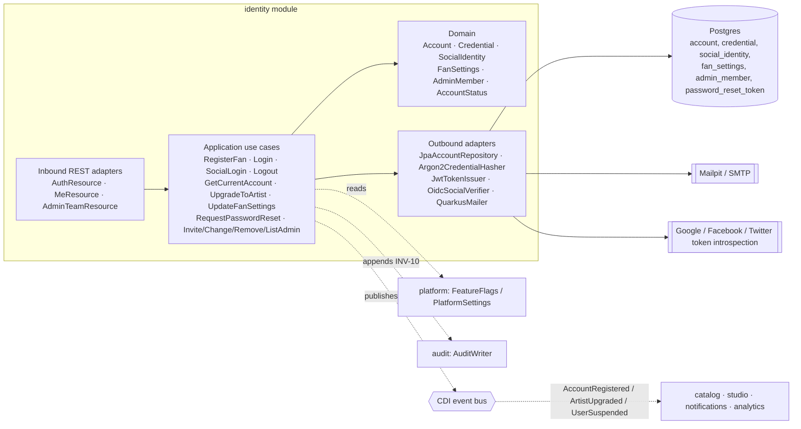
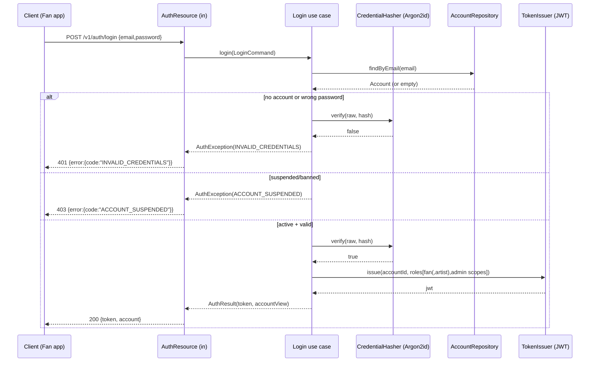
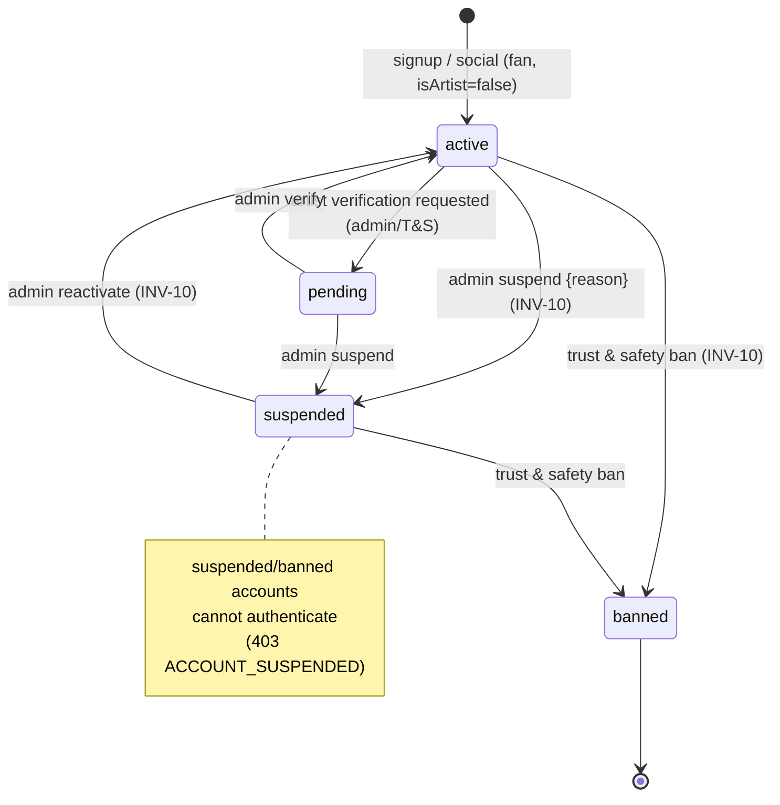

# Architecture Design Doc — `identity` (Identity & Access)

> **Status:** Stable · **PRD source:** `BACKEND-PRD.md` §6.1 · **Owning context:** Identity & Access ·
> **Package root:** `org.shakvilla.beatzmedia.identity`
>
> This ADD is consumed by Claude Code agents. It is the design contract for the module: an agent
> reads it, plans the listed work units, implements within the stated ports/adapters, writes the
> tests, and opens a PR. Do not invent endpoints or fields not traceable to the PRD / `API-CONTRACT.md`.

## 1. Purpose & responsibilities

The `identity` module owns **accounts and access**: fan registration, password and social login,
session/JWT issuance and logout, the authenticated `/me` read, fan self-service settings, the
become-artist role upgrade, password-reset request, the admin team (members + RBAC scopes), and the
account lifecycle status (`active`/`pending`/`suspended`/`banned`). It is the gate for all per-user
state on the Fan, Studio, and Admin surfaces. It serves **HLFR-IDENTITY-01** (registration &
authentication), **HLFR-IDENTITY-02** (current session & self-service), and **HLFR-IDENTITY-03**
(admin team & RBAC).

It explicitly does **not** own: the rich `ArtistProfile` content, releases, catalog, or studio
profile (owned by `catalog`/`studio` — `identity` only creates the empty profile shell on upgrade and
emits `ArtistUpgraded`); platform settings / feature flags (owned by `platform`/`admin`, read here
via `FeatureFlags`); the audit table itself (owned by `audit` — `identity` appends entries via the
`AuditWriter` port, INV-10); and any money, library, or commerce state.

## 2. Context & dependencies (C4 component view)



**Dependency rule:** `adapters → application → domain`; the domain imports nothing framework-bound.
`identity` calls **out** to `platform` (kernel: `Money` n/a here, `Clock`, `IdGenerator`,
`FeatureFlags`, `ApiError`/`ErrorCode`) and `audit` (`AuditWriter`) via ports only. It **publishes**
`AccountRegistered`, `ArtistUpgraded`, and `UserSuspended` (consumed elsewhere); it consumes no
external module's domain events. Persistence is private to this module: no cross-module FKs; other
modules resolve accounts by `AccountId` through this module's input ports.

## 3. Domain model

| Name | Kind | Key fields | Notes |
|---|---|---|---|
| `Account` | Aggregate root | `id: AccountId`, `name`, `email`, `avatar?`, `isArtist`, `isAdmin`, `status: AccountStatus` | Root of the aggregate; role flags + lifecycle. Mutated only via intention-revealing methods (`upgradeToArtist()`, `suspend()`, `reactivate()`). |
| `Credential` | Entity (in aggregate) | `accountId`, `passwordHash`, `algo="argon2id"` | Absent for social-only accounts. Never serialized. |
| `SocialIdentity` | Entity (in aggregate) | `id`, `accountId`, `provider`, `providerUid` | One per linked provider; `UNIQUE(provider, providerUid)`. |
| `FanSettings` | Entity (1—1 with Account) | `accountId`, `theme`, `audioQuality`, `notifications`, `country`, `phone` | Created lazily with defaults on first read/patch. |
| `AdminMember` | Entity | `id`, `accountId`, `role: AdminRole`, `lastActiveAt` | Orthogonal to fan/artist; presence implies `account.isAdmin=true`. |
| `PasswordResetToken` | Value object | `token`, `accountId`, `expiresAt`, `used` | Single-use, time-boxed; opaque random token. |
| `AccountId` | Value object | `value: String` | Typed id wrapper (kernel convention). |

**Enums** (lifted from `Frontend/src/types/index.ts`, `admin-data.ts`, PRD §3.2):

- `AccountStatus = active | pending | suspended | banned` — `active`/`pending`/`suspended` per
  `UserStatus` (admin-data.ts) plus `banned` (PRD §3.2 / R7 lifecycle parity with trust & safety).
- `AdminRole = super-admin | finance | moderator | editor | support` — persisted canonical
  lowercase-kebab (per reconciliation R1); UI renders title-case labels.
- `Theme = light | dark | system`; `AudioQuality` is a free-form quality string (frontend formats).
- `SocialProvider = facebook | google | twitter` (API-CONTRACT §2).

**Invariants enforced by this module (guard conditions):**

- **INV-10 (audit completeness):** every privileged mutation here — `InviteAdmin`, `ChangeAdminRole`,
  `RemoveAdmin`, and suspend/verify lifecycle transitions — appends exactly one `AuditEntry` via
  `AuditWriter` after the transaction commits.
- **Email uniqueness:** `account.email` is unique; registration/social-link conflict → `EMAIL_TAKEN`.
- **Last super-admin guard:** removing or demoting the only `super-admin` is rejected
  (`LAST_SUPER_ADMIN`); the system always retains ≥ 1 super-admin.
- **Lifecycle gating:** a `suspended`/`banned` account cannot authenticate (`ACCOUNT_SUSPENDED`).
- **Idempotent upgrade:** `UpgradeToArtist` on an account already `isArtist=true` is a no-op success.

```mermaid
erDiagram
  ACCOUNT ||--o| CREDENTIAL : "has (password accounts)"
  ACCOUNT ||--o{ SOCIAL_IDENTITY : "links"
  ACCOUNT ||--|| FAN_SETTINGS : "has"
  ACCOUNT ||--o| ADMIN_MEMBER : "may be"
  ACCOUNT ||--o{ PASSWORD_RESET_TOKEN : "issues"
  ACCOUNT {
    string id PK
    string name
    string email UK
    string avatar
    bool is_artist
    bool is_admin
    string status
    timestamptz created_at
    timestamptz updated_at
  }
  CREDENTIAL {
    string account_id PK_FK
    string password_hash
    string algo
  }
  SOCIAL_IDENTITY {
    string id PK
    string account_id FK
    string provider
    string provider_uid
  }
  FAN_SETTINGS {
    string account_id PK_FK
    string theme
    string audio_quality
    jsonb notif_json
    string country
    string phone
  }
  ADMIN_MEMBER {
    string id PK
    string account_id FK
    string role
    timestamptz last_active_at
  }
  PASSWORD_RESET_TOKEN {
    string token PK
    string account_id FK
    timestamptz expires_at
    bool used
  }
```

## 4. Application layer (ports)

### 4.1 Input ports (use cases)

```java
public interface RegisterFan {
    /** Trigger: POST /v1/auth/signup. Authz: public. Idempotent: no (email-unique). Emits AccountRegistered. LLFR-IDENTITY-01.1 */
    AuthResult register(RegisterFanCommand command);
    record RegisterFanCommand(String name, String email, String rawPassword) {}
}

public interface Login {
    /** Trigger: POST /v1/auth/login. Authz: public. Emits nothing. LLFR-IDENTITY-01.2 */
    AuthResult login(LoginCommand command);
    record LoginCommand(String email, String rawPassword) {}
}

public interface SocialLogin {
    /** Trigger: POST /v1/auth/social. Authz: public. Links-or-creates by verified email. Emits AccountRegistered on create. LLFR-IDENTITY-01.3 */
    AuthResult socialLogin(SocialLoginCommand command);
    record SocialLoginCommand(SocialProvider provider, String providerToken) {}
}

public interface Logout {
    /** Trigger: POST /v1/auth/logout. Authz: any authenticated. Idempotent no-op for stateless JWT. LLFR-IDENTITY-01.4 */
    void logout(AccountId account);
}

public interface GetCurrentAccount {
    /** Trigger: GET /v1/me. Authz: any authenticated. LLFR-IDENTITY-02.1 */
    AccountView current(AccountId account);
}

public interface UpgradeToArtist {
    /** Trigger: POST /v1/me/become-artist. Authz: fan. Idempotent. Gated by flags.artistSignups. Emits ArtistUpgraded. LLFR-IDENTITY-02.2 */
    AccountView upgrade(AccountId account);
}

public interface UpdateFanSettings {
    /** Trigger: PATCH /v1/me/settings. Authz: owning account. Partial update. LLFR-IDENTITY-02.3 */
    FanSettingsView update(AccountId account, UpdateFanSettingsCommand command);
    record UpdateFanSettingsCommand(
        Optional<String> theme, Optional<String> audioQuality,
        Optional<NotificationPrefs> notifications,
        Optional<String> country, Optional<String> phone) {}
    record NotificationPrefs(Boolean newReleases, Boolean playlistUpdates, Boolean dropsOffers) {}
}

public interface RequestPasswordReset {
    /** Trigger: POST /v1/me/password/reset. Authz: public. Always 204 (no enumeration). Mails token if email exists. LLFR-IDENTITY-01.5 */
    void request(RequestPasswordResetCommand command);
    record RequestPasswordResetCommand(String email) {}
}

public interface ListAdminTeam {
    /** Trigger: GET /v1/admin/team. Authz: any admin (read). LLFR-IDENTITY-03.1 */
    List<AdminMemberView> list();
}

public interface InviteAdmin {
    /** Trigger: POST /v1/admin/team/invite. Authz: super-admin. Audited (INV-10). LLFR-IDENTITY-03.2 */
    AdminMemberView invite(AccountId actor, InviteAdminCommand command);
    record InviteAdminCommand(String email, AdminRole role) {}
}

public interface ChangeAdminRole {
    /** Trigger: PATCH /v1/admin/team/:id. Authz: super-admin. Guards LAST_SUPER_ADMIN. Audited. LLFR-IDENTITY-03.3 */
    AdminMemberView changeRole(AccountId actor, String adminMemberId, AdminRole role);
}

public interface RemoveAdmin {
    /** Trigger: DELETE /v1/admin/team/:id. Authz: super-admin. Guards LAST_SUPER_ADMIN. Audited. LLFR-IDENTITY-03.3 */
    void remove(AccountId actor, String adminMemberId);
}
```

Shared result records:

```java
public record AuthResult(String token, AccountView account) {}
public record AccountView(String id, String name, String email, String avatar,
                          boolean isArtist, boolean isAdmin) {}
public record FanSettingsView(String theme, String audioQuality,
                              UpdateFanSettings.NotificationPrefs notifications,
                              String country, String phone) {}
public record AdminMemberView(String id, String name, String email, String role, String lastActive) {}
public enum SocialProvider { FACEBOOK, GOOGLE, TWITTER }
public enum AdminRole { SUPER_ADMIN, FINANCE, MODERATOR, EDITOR, SUPPORT } // serialized kebab-case
```

### 4.2 Output ports

```java
public interface AccountRepository {                       // adapter: JpaAccountRepository (Panache + Postgres)
    Optional<Account> findById(AccountId id);
    Optional<Account> findByEmail(String email);
    Optional<Account> findBySocialIdentity(SocialProvider provider, String providerUid);
    boolean existsByEmail(String email);
    Account save(Account account);                          // upsert aggregate (account + credential + social + settings)
    Optional<FanSettings> findSettings(AccountId id);
    FanSettings saveSettings(FanSettings settings);
    List<AdminMember> findAllAdminMembers();
    Optional<AdminMember> findAdminMember(String adminMemberId);
    long countAdminsWithRole(AdminRole role);
    void deleteAdminMember(String adminMemberId);
    Optional<PasswordResetToken> findResetToken(String token);
    PasswordResetToken saveResetToken(PasswordResetToken token);
}

public interface CredentialHasher {                        // adapter: Argon2CredentialHasher (Argon2id)
    String hash(String rawPassword);
    boolean verify(String rawPassword, String passwordHash);
}

public interface TokenIssuer {                             // adapter: JwtTokenIssuer (quarkus-smallrye-jwt-build)
    String issue(AccountId subject, Set<String> roles);    // roles: fan/artist + admin scopes
}

public interface SocialVerifier {                          // adapter: OidcSocialVerifier (provider token introspection)
    VerifiedIdentity verify(SocialProvider provider, String providerToken); // throws on invalid token
    record VerifiedIdentity(String providerUid, String email, String name, String avatar) {}
}

public interface Mailer {                                  // adapter: QuarkusMailer (quarkus-mailer → SMTP/Mailpit)
    void sendPasswordReset(String email, String resetToken);
}

// From platform kernel (imported, not re-declared here):
// Clock { Instant now(); }, IdGenerator { String newId(); }, FeatureFlags { boolean enabled(String flag); }
// From audit module: AuditWriter { void append(AuditEntry entry); }
```

## 5. Adapters

### 5.1 Inbound — REST resources

Base path `/v1`. JSON only. `Authorization: Bearer <jwt>` where auth ≠ public. Resources are thin:
map DTO → command, call input port, map result → DTO; no business logic.

| Method | Path | Auth/scope | Request DTO | Response DTO | Success | Error codes | LLFR |
|---|---|---|---|---|---|---|---|
| POST | `/auth/signup` | public | `SignupRequest{name,email,password}` | `AuthResponse{token,account}` | 201 | `EMAIL_TAKEN` (409), `WEAK_PASSWORD` (422) | 01.1 |
| POST | `/auth/login` | public | `LoginRequest{email,password}` | `AuthResponse{token,account}` | 200 | `INVALID_CREDENTIALS` (401), `ACCOUNT_SUSPENDED` (403) | 01.2 |
| POST | `/auth/social` | public | `SocialRequest{provider,token}` | `AuthResponse{token,account}` | 200 | `SOCIAL_TOKEN_INVALID` (401), `EMAIL_TAKEN` (409) | 01.3 |
| POST | `/auth/logout` | any auth | — | — | 204 | — (idempotent) | 01.4 |
| GET | `/me` | any auth | — | `AccountDto` | 200 | 401 (missing/expired) | 02.1 |
| POST | `/me/become-artist` | fan | — | `AccountDto` | 200 | `FEATURE_DISABLED` (403) | 02.2 |
| PATCH | `/me/settings` | owning account (fan) | `FanSettingsPatch` (partial) | `FanSettingsDto` | 200 | 422 (`country`/`phone` invalid) | 02.3 |
| POST | `/me/password/reset` | public | `PasswordResetRequest{email}` | — | 204 (always) | — (no enumeration) | 01.5 |
| GET | `/admin/team` | any admin | — | `AdminMemberDto[]` | 200 | 403 (non-admin) | 03.1 |
| POST | `/admin/team/invite` | super-admin | `InviteRequest{email,role}` | `AdminMemberDto` | 201 | `INVALID_ROLE` (422), `EMAIL_TAKEN` (409), 403 | 03.2 |
| PATCH | `/admin/team/:id` | super-admin | `RoleChangeRequest{role}` | `AdminMemberDto` | 200 | `INVALID_ROLE` (422), `LAST_SUPER_ADMIN` (409), 403, 404 | 03.3 |
| DELETE | `/admin/team/:id` | super-admin | — | — | 204 | `LAST_SUPER_ADMIN` (409), 403, 404 | 03.3 |

A single `IdentityExceptionMapper` in `adapter.in.rest` maps domain exceptions → the standard
envelope `{ error: { code, message, field? } }`. Hibernate Validator on request DTOs → 422 with
`error.field`.

### 5.2 Outbound — persistence & integrations

- **`JpaAccountRepository`** (Hibernate ORM + Panache): persists the `account` aggregate across
  `account`, `credential`, `social_identity`, `fan_settings`, `admin_member`,
  `password_reset_token`. Domain ↔ JPA mapping is explicit (domain types carry **no** ORM
  annotations; a dedicated mapper converts `Account`/`FanSettings`/`AdminMember` to/from entities).
  Transaction boundary = the use-case service (`@Transactional` on the application service impl).
- **`Argon2CredentialHasher`** — Argon2id (per §3 conventions); tuning params in config.
- **`JwtTokenIssuer`** — builds short-lived RS256 JWT with `sub` and `roles` claims via
  `quarkus-smallrye-jwt-build`; refresh is re-login for v1 (OQ-3).
- **`OidcSocialVerifier`** — `quarkus-rest-client` adapters per provider verifying the provider token
  and returning a `VerifiedIdentity`; invalid → throws → `SOCIAL_TOKEN_INVALID`.
- **`QuarkusMailer`** — `quarkus-mailer`; sends the single-use reset link (captured by Mailpit
  locally).

## 6. DTOs & API shapes

Traceable to `Frontend/src/types/index.ts` and API-CONTRACT §2 / §14. No money in this module.
Timestamps ISO-8601; `lastActive` is an ISO string.

- **`AccountDto`** (API-CONTRACT §2 `Account`): `{ id: string, name: string, email: string,
  avatar?: string|null, isArtist: boolean, isAdmin: boolean }`.
- **`AuthResponse`**: `{ token: string, account: AccountDto }`.
- **`FanSettingsDto`** (`/me/settings`, derived from `settings.tsx` `FanPrefs`):
  `{ theme: 'light'|'dark'|'system', audioQuality: string,
     notifications: { newReleases: boolean, playlistUpdates: boolean, dropsOffers: boolean },
     country: string, phone: string }`. `FanSettingsPatch` is the same shape with all fields optional.
- **`AdminMemberDto`** (API-CONTRACT §14 `AdminMember`): `{ id: string, name: string, email: string,
  role: 'super-admin'|'finance'|'moderator'|'editor'|'support', lastActive: string }`.
- **Request DTOs:** `SignupRequest{name,email,password}`, `LoginRequest{email,password}`,
  `SocialRequest{provider:'facebook'|'google'|'twitter', token}`, `PasswordResetRequest{email}`,
  `InviteRequest{email,role}`, `RoleChangeRequest{role}`.

## 7. Persistence schema & migrations

```sql
-- V1__identity_accounts.sql
CREATE TABLE account (
    id          TEXT PRIMARY KEY,
    name        TEXT        NOT NULL,
    email       TEXT        NOT NULL,
    avatar      TEXT,
    is_artist   BOOLEAN     NOT NULL DEFAULT FALSE,
    is_admin    BOOLEAN     NOT NULL DEFAULT FALSE,
    status      TEXT        NOT NULL DEFAULT 'active'
                CONSTRAINT account_status_chk CHECK (status IN ('active','pending','suspended','banned')),
    created_at  TIMESTAMPTZ NOT NULL DEFAULT now(),
    updated_at  TIMESTAMPTZ NOT NULL DEFAULT now(),
    CONSTRAINT account_email_uk UNIQUE (email)
);
CREATE INDEX account_email_idx ON account (lower(email));

CREATE TABLE credential (
    account_id    TEXT PRIMARY KEY REFERENCES account(id) ON DELETE CASCADE,
    password_hash TEXT NOT NULL,
    algo          TEXT NOT NULL DEFAULT 'argon2id'
);

-- V2__identity_social_and_settings.sql
CREATE TABLE social_identity (
    id           TEXT PRIMARY KEY,
    account_id   TEXT NOT NULL REFERENCES account(id) ON DELETE CASCADE,
    provider     TEXT NOT NULL CHECK (provider IN ('facebook','google','twitter')),
    provider_uid TEXT NOT NULL,
    CONSTRAINT social_identity_provider_uk UNIQUE (provider, provider_uid)
);
CREATE INDEX social_identity_account_idx ON social_identity (account_id);

CREATE TABLE fan_settings (
    account_id    TEXT PRIMARY KEY REFERENCES account(id) ON DELETE CASCADE,
    theme         TEXT NOT NULL DEFAULT 'system',
    audio_quality TEXT NOT NULL DEFAULT 'High (256 kbps)',
    notif_json    JSONB NOT NULL DEFAULT '{"newReleases":true,"playlistUpdates":true,"dropsOffers":false}',
    country       TEXT NOT NULL DEFAULT 'Ghana',
    phone         TEXT
);

-- V3__identity_admin_and_reset.sql
CREATE TABLE admin_member (
    id             TEXT PRIMARY KEY,
    account_id     TEXT NOT NULL REFERENCES account(id) ON DELETE CASCADE,
    role           TEXT NOT NULL CHECK (role IN ('super-admin','finance','moderator','editor','support')),
    last_active_at TIMESTAMPTZ,
    CONSTRAINT admin_member_account_uk UNIQUE (account_id)
);
CREATE INDEX admin_member_role_idx ON admin_member (role);

CREATE TABLE password_reset_token (
    token      TEXT PRIMARY KEY,
    account_id TEXT NOT NULL REFERENCES account(id) ON DELETE CASCADE,
    expires_at TIMESTAMPTZ NOT NULL,
    used       BOOLEAN NOT NULL DEFAULT FALSE
);
CREATE INDEX password_reset_token_account_idx ON password_reset_token (account_id);
```

**Money:** n/a for this module. **Flyway migrations** (forward-only, `db/migration/`):
`V1__identity_accounts.sql`, `V2__identity_social_and_settings.sql`, `V3__identity_admin_and_reset.sql`.
The shared repeatable `R__seed_dev_data.sql` contributes a sample fan, a sample artist, and the seeded
admin team (with ≥ 1 `super-admin`) so the API returns the data the UI was built against.

## 8. Key flows



Account lifecycle state machine (`account.status`):



## 9. Cross-cutting hooks

- **Auth / scope rules** (PRD §9.1): stateless Bearer JWT; `sub`=account id, `roles`=`fan`/`artist`
  + admin scope(s). Public: `/auth/*`, `/me/password/reset`. Any authenticated: `/me`, `/auth/logout`.
  Fan: `/me/become-artist`, `/me/settings`. Admin (read): `GET /admin/team`. Super-admin only:
  `/admin/team/invite`, `PATCH`/`DELETE /admin/team/:id` (403 `FORBIDDEN` otherwise). Scope is enforced
  in the inbound adapter via a role/scope filter **and** re-checked in the application layer (a fan
  may only mutate their own settings). Role scopes mirror API-CONTRACT §14: super-admin = all;
  finance = payouts/ledger/disputes; moderator = moderation/takedowns; editor = editorial; support =
  user lookup + read-only.
- **Audit entries (INV-10):** `InviteAdmin`, `ChangeAdminRole`, `RemoveAdmin`, and lifecycle
  transitions (verify/suspend/reactivate) each append exactly one `AuditEntry` (actor, action, target,
  `type=user|settings`, reason) via `AuditWriter` after commit. `UserSuspended` domain event is also
  published for downstream reaction.
- **Rate limits (§9):** auth endpoints are throttled to blunt brute-force and enumeration —
  `/auth/login` and `/auth/social` per (ip, email) sliding window; `/me/password/reset` per (ip,
  email); `/auth/signup` per ip. Over limit → `429` + `Retry-After`. (Buckets via the optional
  `cache`/Redis adapter.)
- **Feature flags:** `UpgradeToArtist` is gated by `flags.artistSignups`; off → `FEATURE_DISABLED`.
- **Error model:** uniform envelope. Module-specific codes: `EMAIL_TAKEN` (409), `INVALID_CREDENTIALS`
  (401), `WEAK_PASSWORD` (422), `SOCIAL_TOKEN_INVALID` (401), `ACCOUNT_SUSPENDED` (403),
  `FEATURE_DISABLED` (403), `USERNAME_TAKEN` (409, reserved for future handle uniqueness),
  `INVALID_ROLE` (422), `LAST_SUPER_ADMIN` (409). `INVALID_CREDENTIALS` and the always-204 password
  reset are deliberately non-enumerating.
- **Observability:** Micrometer counters for signups, logins (success/fail), social logins, becomes,
  admin role changes; never log passwords, hashes, tokens, or PII. Correlation id on every request.

## 10. Work units & build order

| WU | Scope (LLFR coverage) | Ports introduced | Tables | Deps | Order |
|---|---|---|---|---|---|
| **WU-IDN-1** | Account model, signup, login, password hashing, JWT issue, logout (01.1, 01.2, 01.4) | `RegisterFan`, `Login`, `Logout`; `AccountRepository`, `CredentialHasher`, `TokenIssuer` | `account`, `credential` | WU-PLT-1 (kernel) | 1 |
| **WU-IDN-2** | `/me`, social login, password reset (02.1, 01.3, 01.5) | `GetCurrentAccount`, `SocialLogin`, `RequestPasswordReset`; `SocialVerifier`, `Mailer` | `account`, `social_identity`, `password_reset_token` | WU-IDN-1 | 2 |
| **WU-IDN-3** | Become-artist + fan settings (02.2, 02.3) | `UpgradeToArtist`, `UpdateFanSettings` | `account`, `fan_settings`, (`artist_profile` shell via catalog port) | WU-IDN-1 | 3 |
| **WU-IDN-4** | Admin members + RBAC scope enforcement (03.1, 03.2, 03.3) | `ListAdminTeam`, `InviteAdmin`, `ChangeAdminRole`, `RemoveAdmin`; RBAC filter | `admin_member` | WU-IDN-1, WU-PLT-1; AuditWriter (WU-AUD-1) | 4 |

Cross-reference PRD §8: build order is `WU-IDN-1 → {WU-IDN-2, WU-IDN-3, WU-IDN-4}` (Phase 1).

## 11. Testing plan

**Unit** (domain + use cases with fakes for every output port): password hashing/verification, JWT
claim assembly, last-super-admin guard, idempotent upgrade, lifecycle transition guards, no-enumeration
behavior. **Integration** (Testcontainers Postgres + REST-assured): full HTTP round-trips with real
persistence and the `IdentityExceptionMapper`. **Contract:** responses validate against
`Frontend/src/types/index.ts` (`Account`) and API-CONTRACT §2/§14 (`AdminMember`, `FanSettings`).
Coverage ≥ the gate in `sdlc/testing-strategy.md`.

Acceptance cases (Given/When/Then, from PRD §6.1 LLFRs):

- **01.1** Given a unique email, When signup with a valid body, Then 201 with a usable token and
  `account.isArtist=false`. Given an existing email, Then 409 `EMAIL_TAKEN` and no account is created.
- **01.1** Given a password < 8 chars, When signup, Then 422 `WEAK_PASSWORD`.
- **01.2** Given valid credentials for an active account, When login, Then 200 with a token whose
  `roles` reflect `isArtist`/admin role. Given wrong credentials, Then 401 `INVALID_CREDENTIALS`
  (generic). Given a suspended account, Then 403 `ACCOUNT_SUSPENDED`.
- **01.3** Given a valid Google token for a new email, When social login, Then a fan account is created
  and linked; subsequent social login with the same token logs into the same account. Given an invalid
  provider token, Then 401 `SOCIAL_TOKEN_INVALID`.
- **01.4** Given a logged-in client, When logout, Then 204; a repeat logout is also 204 (idempotent).
- **01.5** Given any email, When password reset, Then 204; and an existing email receives a single-use
  reset link (asserted via Mailpit/fake Mailer); the token is single-use and time-boxed.
- **02.1** Given a missing/expired token, When GET `/me`, Then 401. Given a valid token, Then 200 with
  the `Account` shape.
- **02.2** Given a fan and `artistSignups=true`, When become-artist, Then `/me` shows `isArtist=true`
  and a second call is a no-op success. Given `artistSignups=false`, Then 403 `FEATURE_DISABLED`.
- **02.3** Given a fan, When PATCH `/me/settings` with an invalid `country`/`phone`, Then 422 with
  `error.field`; with a valid partial body, Then 200 echoing the merged `FanSettings`.
- **03.2** Given a super-admin, When invite with an unknown role, Then 422 `INVALID_ROLE`; with a valid
  role, Then 201 and one `AuditEntry` appended. Given a non-super-admin, Then 403.
- **03.3** Given one remaining super-admin, When delete (or demote) that member, Then 409
  `LAST_SUPER_ADMIN` and the member is retained.

## 12. Definition of done (module-specific)

Global DoD (PRD §8 / conventions §11) **plus**:

1. Passwords are hashed with **Argon2id** only; no plaintext/weak-hash path exists; hashes/tokens
   never appear in logs or responses.
2. `INVALID_CREDENTIALS` and `POST /me/password/reset` are **non-enumerating** (uniform response /
   timing for existing vs unknown emails), asserted by tests.
3. The **last super-admin guard** holds: the system can never drop below one `super-admin` via demote
   or remove (`LAST_SUPER_ADMIN`).
4. Every privileged admin/lifecycle mutation appends exactly one `AuditEntry` (INV-10), verified in
   integration tests.
5. RBAC scopes are enforced in **both** the inbound filter and the application layer; ownership of
   `/me/*` mutations is re-checked server-side.
6. Auth endpoints are rate-limited with `429` + `Retry-After`; `UpgradeToArtist` honors
   `flags.artistSignups`.
7. Responses validate against the frontend `Account`/`AdminMember`/`FanSettings` shapes (contract test
   green); ArchUnit confirms the hexagonal dependency rule; Spotless clean; Flyway `V1`–`V3` apply
   cleanly on an empty DB.
