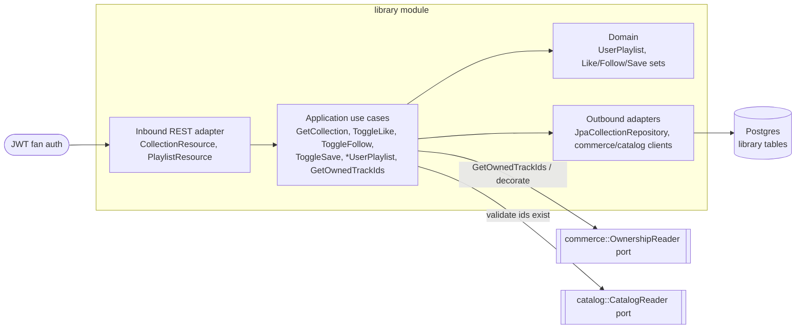
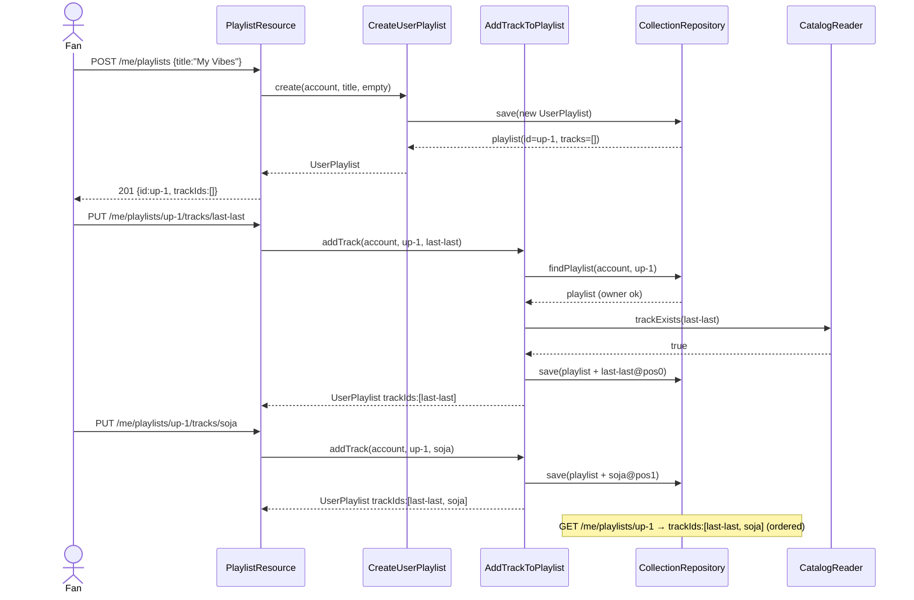

# Architecture Design Doc — `library` (Library & Collection)

> **Status:** Stable · **PRD source:** `BACKEND-PRD.md` §6.4 · **Owning context:** `library` ·
> **Package root:** `org.shakvilla.beatzmedia.library`
>
> This ADD is consumed by Claude Code agents. It is the design contract for the module: an agent
> reads it, plans the listed work units, implements within the stated ports/adapters, writes the
> tests, and opens a PR. Do not invent endpoints or fields not traceable to the PRD / `API-CONTRACT.md`.

## 1. Purpose & responsibilities

The `library` module owns each fan's **personal curation**: liked tracks, follows (artists,
playlists, shows), saved albums, and user-created playlists with ordered tracks. It also exposes a
**read** of the fan's owned track ids that drives playback unlock and the `ownership` decoration. It
serves the **Fan** surface only (Library page, like/follow/save buttons across the app, playlist
editor). It explicitly does **not** own ownership state — ownership grants are created and revoked by
`commerce` on settlement/refund; `library` reads them via the `OwnershipReader` output port and never
persists them. It also does not own catalog identity; it stores only opaque ids and validates their
existence through `CatalogReader`. Covers **HLFR-LIBRARY-01** (LLFR-LIBRARY-01.1 … 01.6).

## 2. Context & dependencies (C4 component view)



**Dependency rule (hexagonal):** `domain` depends on nothing framework-specific; `application`
depends only on `domain` + its own ports; adapters depend inward. `library` calls **commerce** only
through the `OwnershipReader` input-port view (no shared persistence, no FK into `ownership_grant`) and
**catalog** only through `CatalogReader`. It publishes **no** domain events and consumes none; all
cross-module reads are synchronous port calls. Persistence is private to this module.

## 3. Domain model

| Name | Kind | Key fields | Notes |
|---|---|---|---|
| `UserPlaylist` | Aggregate root | `id`, `ownerId`, `title`, `description?`, `tracks: List<TrackRef>`, `createdAt` | Owns ordering; mutate via methods only |
| `PlaylistTrack` | Entity (child) | `trackId`, `position` | Contiguous 0-based order within a playlist |
| `LikedTrack` | Entity (set member) | `accountId`, `trackId`, `createdAt` | Composite identity |
| `FollowedArtist` / `FollowedPlaylist` / `FollowedShow` | Entity (set member) | `accountId`, `targetId`, `createdAt` | One table per target kind |
| `SavedAlbum` | Entity (set member) | `accountId`, `albumId`, `createdAt` | |
| `Collection` | Read model / VO | the seven id-lists + `userPlaylists` | Assembled for `GET /me/collection`; ownership injected from `OwnershipReader` |

- **Enums** — none owned. Follow target kind is modelled by table, not a stored enum.
- **Invariants:**
  - **INV-LIB-1 (single membership):** a (account, target) pair appears **at most once** per set —
    enforced by composite PK; toggle PUT is idempotent, DELETE is idempotent.
  - **INV-LIB-2 (ownership):** playlist mutations require `playlist.ownerId == caller`; otherwise the
    resource is treated as non-existent (**404**), never 403.
  - **INV-LIB-3 (title):** `title` is 1–100 chars after trim (`422` on violation).
  - **INV-LIB-4 (track uniqueness + order):** a track appears at most once per playlist; `position`
    values are contiguous; add appends at the tail, remove re-packs positions.
  - **INV-LIB-5 (no ownership storage):** owned tracks are never written here; always read live.

```mermaid
erDiagram
  user_playlist ||--o{ user_playlist_track : contains
  user_playlist {
    uuid id PK
    uuid account_id
    text title
    text description
    timestamptz created_at
  }
  user_playlist_track {
    uuid playlist_id PK_FK
    text track_id PK
    int position
  }
  liked_track {
    uuid account_id PK
    text track_id PK
    timestamptz created_at
  }
  followed_artist {
    uuid account_id PK
    text artist_id PK
    timestamptz created_at
  }
  followed_playlist {
    uuid account_id PK
    text playlist_id PK
    timestamptz created_at
  }
  followed_show {
    uuid account_id PK
    text show_id PK
    timestamptz created_at
  }
  saved_album {
    uuid account_id PK
    text album_id PK
    timestamptz created_at
  }
```

> **Note:** ownership is **not** an entity here. Owned track ids are read from `commerce` via
> `OwnershipReader`; there is no `owned_track` table in this module.

## 4. Application layer (ports)

### 4.1 Input ports (use cases)

```java
public interface GetCollection {
    Collection get(AccountId account);
}

public interface ToggleLike {
    void like(AccountId account, TrackId track);       // PUT  — idempotent
    void unlike(AccountId account, TrackId track);     // DELETE — idempotent
}

public interface ToggleFollow {
    void follow(AccountId account, FollowKind kind, String targetId);     // idempotent
    void unfollow(AccountId account, FollowKind kind, String targetId);   // idempotent
}

public interface ToggleSave {
    void save(AccountId account, AlbumId album);        // idempotent
    void unsave(AccountId account, AlbumId album);      // idempotent
}

public interface CreateUserPlaylist {
    UserPlaylist create(AccountId account, String title, Optional<TrackId> firstTrackId);
}

public interface RenameUserPlaylist {
    UserPlaylist rename(AccountId account, PlaylistId playlist, String title);
}

public interface DeleteUserPlaylist {
    void delete(AccountId account, PlaylistId playlist);   // idempotent
}

public interface AddTrackToPlaylist {
    UserPlaylist addTrack(AccountId account, PlaylistId playlist, TrackId track);     // idempotent append
}

public interface RemoveTrackFromPlaylist {
    UserPlaylist removeTrack(AccountId account, PlaylistId playlist, TrackId track);  // idempotent
}

public interface GetOwnedTrackIds {
    List<TrackId> ownedTrackIds(AccountId account);
}
```

| Use case | Trigger | Authorization | Idempotency | Events | LLFR |
|---|---|---|---|---|---|
| `GetCollection` | `GET /me/collection` | fan = self | n/a (read) | none | 01.1 |
| `ToggleLike` | `PUT/DELETE /me/likes/tracks/:id` | fan = self | yes (upsert / no-op delete) | none | 01.2 |
| `ToggleFollow` | `PUT/DELETE /me/follows/{kind}/:id` | fan = self | yes | none | 01.3 |
| `ToggleSave` | `PUT/DELETE /me/saved/albums/:id` | fan = self | yes | none | 01.4 |
| `CreateUserPlaylist` | `POST /me/playlists` | fan = self (owner) | no (creates) | none | 01.5 |
| `RenameUserPlaylist` | `PATCH /me/playlists/:id` | owner else 404 | yes (sets title) | none | 01.5 |
| `DeleteUserPlaylist` | `DELETE /me/playlists/:id` | owner else 404 | yes | none | 01.5 |
| `AddTrackToPlaylist` | `PUT /me/playlists/:id/tracks/:trackId` | owner else 404 | yes (no dup) | none | 01.5 |
| `RemoveTrackFromPlaylist` | `DELETE /me/playlists/:id/tracks/:trackId` | owner else 404 | yes | none | 01.5 |
| `GetOwnedTrackIds` | `GET /me/owned` | fan = self | n/a (read) | none | 01.6 |

### 4.2 Output ports

```java
public interface CollectionRepository {
    LikeSets likeSets(AccountId account);                 // liked/followed/saved id lists
    boolean addLike(AccountId account, TrackId track);    // returns true if inserted
    void removeLike(AccountId account, TrackId track);
    boolean addFollow(AccountId account, FollowKind kind, String targetId);
    void removeFollow(AccountId account, FollowKind kind, String targetId);
    boolean addSave(AccountId account, AlbumId album);
    void removeSave(AccountId account, AlbumId album);
    List<UserPlaylist> playlistsOf(AccountId account);
    Optional<UserPlaylist> findPlaylist(AccountId account, PlaylistId playlist);
    UserPlaylist save(UserPlaylist playlist);
    void deletePlaylist(AccountId account, PlaylistId playlist);
}

public interface OwnershipReader {                        // implemented by commerce
    List<TrackId> ownedTrackIds(AccountId account);
}

public interface CatalogReader {                          // implemented by catalog
    boolean trackExists(TrackId track);
    boolean artistExists(String artistId);
    boolean albumExists(AlbumId album);
    boolean showExists(String showId);
}
```

- `CollectionRepository` → `JpaCollectionRepository` (this module's persistence adapter, owns all
  seven tables).
- `OwnershipReader` → adapter delegating to `commerce` `GetOwnedTrackIds`/ownership input port
  (in-process call; no DB access into commerce).
- `CatalogReader` → adapter delegating to `catalog` lookup port; used to return **404** on unknown ids.

## 5. Adapters

### 5.1 Inbound — REST resources

Base path `/v1`. All endpoints require `Authorization: Bearer <jwt>` with role `fan`; the caller's
`sub` is the account — there is no path account id, so cross-account access is structurally impossible.

| Method | Path | Auth/scope | Request DTO | Response DTO | Success | Error codes | LLFR |
|---|---|---|---|---|---|---|---|
| GET | `/me/collection` | fan | — | `CollectionDto` | 200 | 401 | 01.1 |
| PUT | `/me/likes/tracks/:id` | fan | — | — | 204 | 401, 404 `TRACK_NOT_FOUND` | 01.2 |
| DELETE | `/me/likes/tracks/:id` | fan | — | — | 204 | 401 | 01.2 |
| PUT | `/me/follows/artists/:id` | fan | — | — | 204 | 401, 404 `ARTIST_NOT_FOUND` | 01.3 |
| DELETE | `/me/follows/artists/:id` | fan | — | — | 204 | 401 | 01.3 |
| PUT | `/me/follows/playlists/:id` | fan | — | — | 204 | 401, 404 `PLAYLIST_NOT_FOUND` | 01.3 |
| DELETE | `/me/follows/playlists/:id` | fan | — | — | 204 | 401 | 01.3 |
| PUT | `/me/follows/shows/:id` | fan | — | — | 204 | 401, 404 `SHOW_NOT_FOUND` | 01.3 |
| DELETE | `/me/follows/shows/:id` | fan | — | — | 204 | 401 | 01.3 |
| PUT | `/me/saved/albums/:id` | fan | — | — | 204 | 401, 404 `ALBUM_NOT_FOUND` | 01.4 |
| DELETE | `/me/saved/albums/:id` | fan | — | — | 204 | 401 | 01.4 |
| GET | `/me/playlists` | fan | — | `UserPlaylistDto[]` | 200 | 401 | 01.5 |
| POST | `/me/playlists` | fan | `CreatePlaylistDto` | `UserPlaylistDto` | 201 | 401, 422 `INVALID_TITLE` | 01.5 |
| PATCH | `/me/playlists/:id` | fan (owner) | `RenamePlaylistDto` | `UserPlaylistDto` | 200 | 401, 404, 422 `INVALID_TITLE` | 01.5 |
| DELETE | `/me/playlists/:id` | fan (owner) | — | — | 204 | 401, 404 | 01.5 |
| PUT | `/me/playlists/:id/tracks/:trackId` | fan (owner) | — | `UserPlaylistDto` | 200 | 401, 404 (playlist or track) | 01.5 |
| DELETE | `/me/playlists/:id/tracks/:trackId` | fan (owner) | — | `UserPlaylistDto` | 200 | 401, 404 | 01.5 |
| GET | `/me/owned` | fan | — | `ID[]` | 200 | 401 | 01.6 |

Idempotency: like/follow/save/track PUT/DELETE carry no `Idempotency-Key` (they are intrinsically
idempotent, not money paths). Non-owner playlist access returns **404**, hiding existence (per
conventions §4 / §7). Resources are thin: map path/DTO → command, call input port, map result → DTO.

### 5.2 Outbound — persistence & integrations

- **`JpaCollectionRepository`** maps the seven JPA entities ↔ domain. Set inserts use
  `INSERT … ON CONFLICT DO NOTHING` (idempotent like/follow/save); deletes are unconditional.
  Playlist save persists ordered `user_playlist_track` rows; the adapter re-packs `position` on
  remove. Domain objects carry no ORM annotations.
- **`CommerceOwnershipReaderAdapter`** implements `OwnershipReader` by calling the in-process
  commerce ownership port — read-only, no transaction, no FK.
- **`CatalogReaderAdapter`** implements `CatalogReader` via the catalog lookup port for existence
  checks on like/follow/save/add-track.
- **Transaction boundary** = the application service impl (`@Transactional`), one tx per use case.

## 6. DTOs & API shapes

`CollectionDto` (traceable to `Frontend/src/types` `Collection` + `collection-context`):

| Field | Type | Notes |
|---|---|---|
| `likedTracks` | `ID[]` | newest-first |
| `followedArtists` | `ID[]` | |
| `followedPlaylists` | `ID[]` | |
| `followedShows` | `ID[]` | |
| `savedAlbums` | `ID[]` | |
| `ownedTracks` | `ID[]` | injected from `OwnershipReader`, **not** stored |
| `userPlaylists` | `UserPlaylistDto[]` | newest-first |

`UserPlaylistDto` (traceable to `UserPlaylist` in `Frontend/src/types/index.ts`):

| Field | Type | Notes |
|---|---|---|
| `id` | `ID` | opaque string |
| `title` | `string` | 1–100 chars |
| `description` | `string?` | optional |
| `trackIds` | `ID[]` | **ordered** by `position` |
| `createdAt` | `string` | ISO-8601 |

`CreatePlaylistDto { title: string (1–100), firstTrackId?: ID }` ·
`RenamePlaylistDto { title: string (1–100) }`. No money or duration fields in this module; timestamps
ISO-8601.

## 7. Persistence schema & migrations

```sql
CREATE TABLE user_playlist (
    id          UUID PRIMARY KEY,
    account_id  UUID NOT NULL,
    title       TEXT NOT NULL CHECK (char_length(title) BETWEEN 1 AND 100),
    description TEXT,
    created_at  TIMESTAMPTZ NOT NULL DEFAULT now()
);
CREATE INDEX idx_user_playlist_account ON user_playlist (account_id, created_at DESC);

CREATE TABLE user_playlist_track (
    playlist_id UUID NOT NULL REFERENCES user_playlist (id) ON DELETE CASCADE,
    track_id    TEXT NOT NULL,
    position    INT  NOT NULL,
    PRIMARY KEY (playlist_id, track_id)
);
CREATE UNIQUE INDEX uq_playlist_track_position ON user_playlist_track (playlist_id, position);

CREATE TABLE liked_track (
    account_id UUID NOT NULL,
    track_id   TEXT NOT NULL,
    created_at TIMESTAMPTZ NOT NULL DEFAULT now(),
    PRIMARY KEY (account_id, track_id)
);
CREATE INDEX idx_liked_track_account ON liked_track (account_id, created_at DESC);

CREATE TABLE followed_artist (
    account_id UUID NOT NULL,
    artist_id  TEXT NOT NULL,
    created_at TIMESTAMPTZ NOT NULL DEFAULT now(),
    PRIMARY KEY (account_id, artist_id)
);

CREATE TABLE followed_playlist (
    account_id  UUID NOT NULL,
    playlist_id TEXT NOT NULL,
    created_at  TIMESTAMPTZ NOT NULL DEFAULT now(),
    PRIMARY KEY (account_id, playlist_id)
);

CREATE TABLE followed_show (
    account_id UUID NOT NULL,
    show_id    TEXT NOT NULL,
    created_at TIMESTAMPTZ NOT NULL DEFAULT now(),
    PRIMARY KEY (account_id, show_id)
);

CREATE TABLE saved_album (
    account_id UUID NOT NULL,
    album_id   TEXT NOT NULL,
    created_at TIMESTAMPTZ NOT NULL DEFAULT now(),
    PRIMARY KEY (account_id, album_id)
);
```

Composite PKs guarantee single-membership (INV-LIB-1) and make PUT a pure upsert. The
`(playlist_id, track_id)` PK enforces track uniqueness (INV-LIB-4); the unique `(playlist_id,
position)` index enforces contiguous ordering. No cross-module FKs (owned/catalog ids are plain
`TEXT`). Flyway (forward-only):

- `V12__create_library_tables.sql` — the seven tables, indexes, constraints above.
- `R__seed_dev_data.sql` — contributes a sample fan collection (dev/test only).

## 8. Key flows



No state machines in this module (sets and lists, no lifecycle transitions).

## 9. Cross-cutting hooks

- **Auth/scope:** every endpoint requires role `fan`; account is the JWT `sub`. Playlist mutations
  re-check `ownerId == sub` in the application layer; non-owner → **404** (`NOT_FOUND`), never 403,
  to avoid leaking existence (conventions §4, §7).
- **Idempotency:** PUT inserts via `ON CONFLICT DO NOTHING` (PUT twice = liked once); DELETE on a
  missing row is a no-op `204`; `DeleteUserPlaylist` on a missing/foreign playlist is `204`/`404`
  consistently. No `Idempotency-Key` header (no money/side-effect-fanout paths here).
- **Ownership read delegation:** `ownedTracks` (in `GET /me/collection`) and `GET /me/owned` are
  served live from `OwnershipReader`; the module never writes ownership and stays correct after a
  refund (INV-LIB-5).
- **Error model:** uniform envelope `{ error: { code, message, field? } }`. Codes: `TRACK_NOT_FOUND`,
  `ARTIST_NOT_FOUND`, `PLAYLIST_NOT_FOUND`, `SHOW_NOT_FOUND`, `ALBUM_NOT_FOUND`, `NOT_FOUND`
  (non-owner playlist), `INVALID_TITLE` (422). One `ExceptionMapper` per family in `adapter.in.rest`.
- **Audit:** library mutations are non-privileged personal curation and do **not** append
  `AuditEntry` (INV-10 applies to privileged/money mutations).
- **Observability:** Micrometer counters per toggle action and playlist mutation; OpenTelemetry span
  around the `OwnershipReader` call; no PII in logs (ids only).

## 10. Work units & build order

| WU | Scope | LLFR coverage | Depends on | Order |
|---|---|---|---|---|
| **WU-LIB-1** | Full library module: tables/migration, `CollectionRepository`, all input ports, REST resources, `OwnershipReader` + `CatalogReader` adapters, tests | LLFR-LIBRARY-01.1 – 01.6 | **WU-IDN-1** (identity/JWT), **WU-CAT-1** (catalog reads) | after IDN-1 & CAT-1 |

Cross-reference PRD §8. `OwnershipReader` binds to commerce at runtime; if commerce is not yet
present, a fake `OwnershipReader` returning `[]` lets WU-LIB-1 build and test independently.

## 11. Testing plan

- **Unit (domain/use-case, fakes):** `UserPlaylist` ordering/uniqueness invariants; toggle idempotency
  (PUT twice → one row); owner check returns 404 path; title validation (0, 1, 100, 101 chars).
- **Integration (Testcontainers Postgres, REST-assured):** migration applies on empty DB; composite
  PK + position uniqueness enforced; `GET /me/collection` assembles seven lists + injected ownership
  from a fake `OwnershipReader`; unknown ids → 404; non-owner playlist → 404.
- **Contract:** `CollectionDto` / `UserPlaylistDto` validate against frontend types / `API-CONTRACT.md`
  §5 (field names, `trackIds` array, ISO `createdAt`).
- **Key acceptance (PRD §6.4, LLFR-LIBRARY-01.5):**
  - **Given** a fan **When** `POST /me/playlists {title}` then `PUT …/tracks/last-last` then
    `PUT …/tracks/soja` **Then** `GET /me/playlists/:id` returns `trackIds = ["last-last","soja"]`
    in that order.
  - **Given** a fan **When** `PUT /me/likes/tracks/last-last` twice **Then** `GET /me/collection`
    lists `last-last` once.
  - **Given** fan A's playlist **When** fan B `PATCH`es it **Then** `404`.

Coverage ≥ the gate in `sdlc/testing-strategy.md`.

## 12. Definition of done (module-specific)

Global DoD (conventions §11 / PRD §8) plus:

1. Ownership is **never** persisted in `library`; `ownedTracks` and `/me/owned` are served live from
   `OwnershipReader` (verified by a test that flips the fake reader and re-reads).
2. All toggle PUT/DELETE are idempotent and non-owner playlist access returns **404** (not 403).
3. Playlist `trackIds` are returned in stable insertion order; remove re-packs positions with no gaps.
4. Composite PKs and the `(playlist_id, position)` unique index exist and the Flyway migration applies
   cleanly on an empty DB.
5. No cross-module FK or shared persistence with commerce/catalog; reads go only through ports
   (ArchUnit green).
