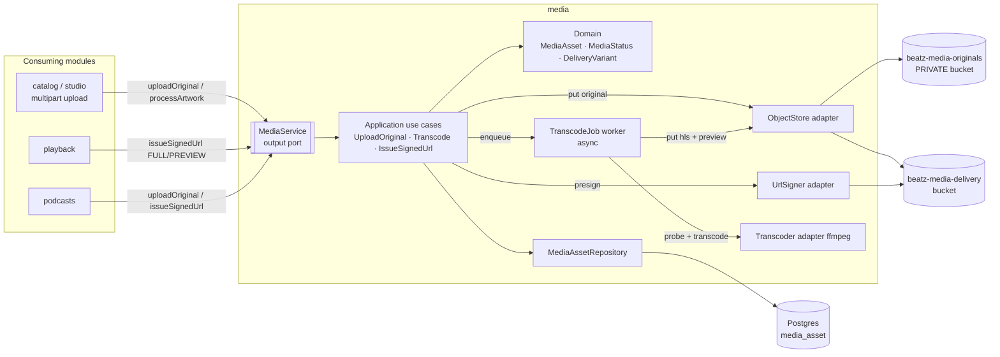
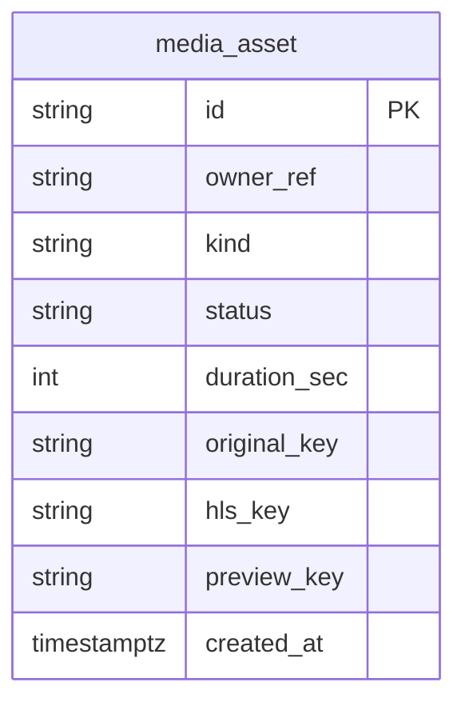
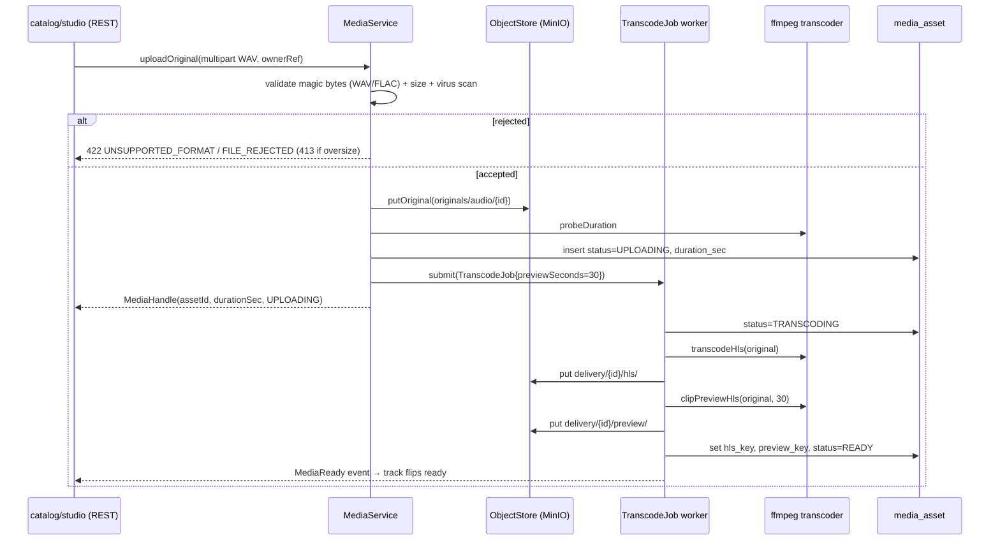
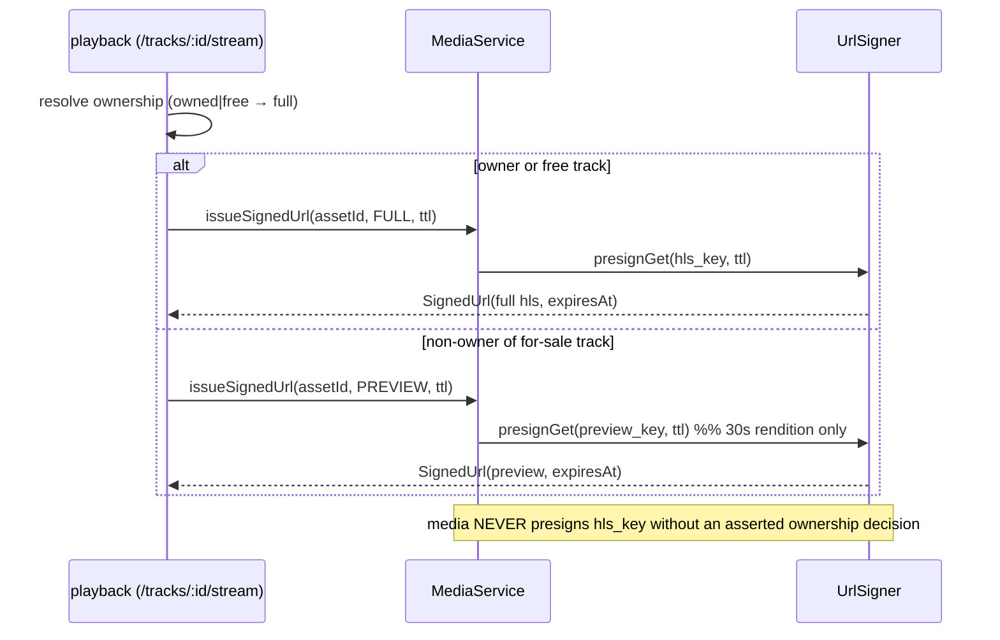
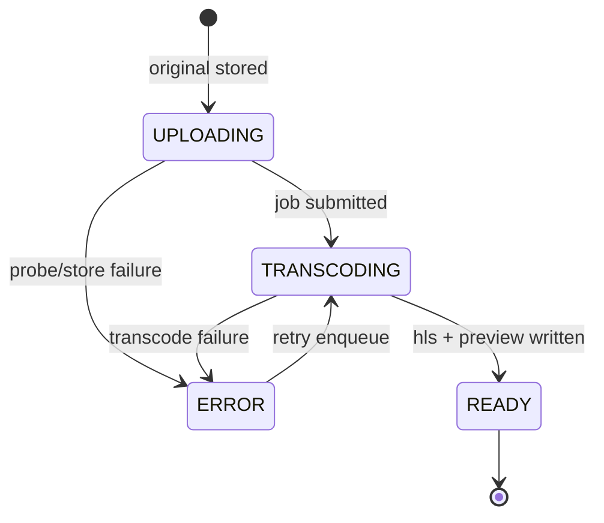

# Architecture Design Doc — `media` (Media Pipeline)

> **Status:** Proposal · **PRD source:** `BACKEND-PRD.md` §6.14, §9.3, §4.3 · **Owning context:** `media` ·
> **Package root:** `org.shakvilla.beatzmedia.media`
>
> This ADD is consumed by Claude Code agents. It is the design contract for the module: an agent
> reads it, plans the listed work units, implements within the stated ports/adapters, writes the
> tests, and opens a PR. Do not invent endpoints or fields not traceable to the PRD / `API-CONTRACT.md`.

## 1. Purpose & responsibilities

The `media` module is **shared infrastructure**: it owns the lifecycle of every binary asset on the
platform — accepting audio/artwork uploads, validating format and safety, transcoding audio into a
streamable HLS rendition plus a **server-clipped 30s preview** rendition, processing artwork into
delivery variants, laying assets out in object storage, and issuing **signed, time-boxed delivery
URLs**. It is the **server-side enforcement point for INV-3** (the preview gate): a non-owner can only
ever receive a URL to the 30s preview rendition; the full HLS rendition is issued only when ownership
is confirmed by the caller. The module **does not** own catalog/track/episode entities, ownership
grants, or REST upload endpoints — those belong to `catalog`, `studio`, `commerce`/`playback`, which
call this module's `MediaService` output port. It exposes **no public REST of its own**: uploads
arrive through `catalog`/`studio` multipart endpoints, delivery through `playback`. It serves all four
consuming surfaces (Fan playback, Studio uploads, Admin moderation reads, Catalog ingestion).
**HLFRs covered:** HLFR-MEDIA-01 (LLFR-MEDIA-01.1 upload, 01.2 transcode, 01.3 signed delivery).

## 2. Context & dependencies (C4 component view)



**Dependency rule.** Hexagonal: `domain` depends on nothing; `application` depends on `domain` + ports;
adapters depend inward only (ArchUnit-enforced). `media` is a **leaf** — it calls no other business
module. Other modules call it **only** through the `MediaService` input/output port (in-process CDI).
It **publishes** the domain event `MediaReady(assetId, ownerRef, kind)` (`AFTER_SUCCESS`) so consumers
(`catalog`/`studio`/`podcasts`) flip the owning track/episode to `ready`. It **consumes** no events.
Persistence (`media_asset`) is private to this module; consumers reference assets by opaque `assetId`.

## 3. Domain model

| Name | Kind | Key fields | Notes |
|---|---|---|---|
| `MediaAsset` | Aggregate root | `id`, `ownerRef`, `kind`, `status`, `durationSec`, `originalKey`, `hlsKey`, `previewKey` | One row per uploaded binary; lifecycle owner |
| `OwnerRef` | Value object | `module`, `entityId` | Opaque back-reference to the catalog/studio entity (no cross-module FK) |
| `ObjectKey` | Value object | `bucket`, `key` | Fully-qualified storage location |
| `SignedUrl` | Value object | `url`, `variant`, `expiresAt` | Result of presigning; ISO-8601 `expiresAt` |
| `MediaHandle` | Value object | `assetId`, `kind`, `durationSec`, `status` | Returned to caller after upload |

**Enums** (lifted from PRD §6.14 / frontend status vocabulary):

- `MediaKind { AUDIO, ARTWORK }`
- `MediaStatus { UPLOADING, TRANSCODING, READY, ERROR }`
- `DeliveryVariant { FULL, PREVIEW }`
- `AudioFormat { WAV, FLAC }` · `ImageFormat { PNG, JPG }`

**Invariants enforced here:**

- **INV-3 (preview gate).** `issueSignedUrl(asset, variant)` may presign the `hlsKey` (FULL) **only**
  when the caller asserts confirmed ownership; otherwise it presigns the `previewKey` (PREVIEW), a
  rendition physically clipped to `previewSeconds = 30`. There is **no code path** that returns the
  full rendition without an ownership assertion. The 30s clip is the server-side enforcement; the
  client timer is advisory (§9.3).
- A `MediaAsset` reaches `READY` only after **both** `hlsKey` and `previewKey` (for `AUDIO`) are
  written; artwork reaches `READY` after its processed variant is written.
- Format guard: only `AUDIO ∈ {WAV,FLAC}` and `ARTWORK ∈ {PNG,JPG}` are admitted (§9).

### Object-storage layout

Two S3-compatible buckets (PRD §5: `beatz-media-originals` PRIVATE, `beatz-media-delivery`):

| Bucket | Prefix | Access | Contents |
|---|---|---|---|
| `beatz-media-originals` | `originals/{kind}/{assetId}` | **private**, never public, never signed for read by clients | raw uploaded WAV/FLAC/PNG/JPG |
| `beatz-media-delivery` | `delivery/{assetId}/hls/` | signed read only | `playlist.m3u8` + `.ts` segments (full rendition) |
| `beatz-media-delivery` | `delivery/{assetId}/preview/` | signed read only | `preview.m3u8` + ≤30s `.ts` segments |
| `beatz-media-delivery` | `delivery/{assetId}/art/` | signed read only | processed artwork variants (e.g. `cover-1024.jpg`) |



## 4. Application layer (ports)

### 4.1 Input ports (use cases)

The module's use cases are surfaced to other modules through the `MediaService` facade (§4.2 lists it
as the consumed output port from their perspective; here are the use-case interfaces it composes).

```java
public interface UploadOriginalUseCase {
    /** Stream a multipart part to the private originals bucket; probe; persist UPLOADING asset. */
    MediaHandle uploadOriginal(UploadCommand command);
}

public interface TranscodeUseCase {
    /** Enqueue async transcode of an AUDIO asset to HLS + 30s preview; flips TRANSCODING then READY. */
    void enqueueTranscode(MediaAssetId assetId);
}

public interface IssueDeliveryUrlUseCase {
    /** INV-3 enforcement point: PREVIEW unless ownership asserted; presign delivery key. */
    SignedUrl issueSignedUrl(MediaAssetId assetId, DeliveryVariant variant, Duration ttl);
}
```

- **uploadOriginal** — trigger: a `catalog`/`studio` multipart endpoint forwards a part. Authorization:
  caller (creator) already authorized by the inbound module; `media` re-checks `ownerRef` consistency.
  Idempotent on `(ownerRef, contentHash)` — re-upload of identical bytes returns the existing handle.
  Emits none yet. Satisfies LLFR-MEDIA-01.1.
- **enqueueTranscode** — trigger: invoked by `uploadOriginal` for `AUDIO`. Authorization: internal.
  Idempotent per `assetId` (re-enqueue while `TRANSCODING` is a no-op). Emits `MediaReady` on success.
  Satisfies LLFR-MEDIA-01.2.
- **issueSignedUrl** — trigger: `playback`/`podcasts` ownership-aware stream. Authorization: the caller
  passes the resolved ownership decision; `media` never returns FULL without it. Read-only, not
  idempotency-keyed. Satisfies LLFR-MEDIA-01.3 / INV-3.

### 4.2 Output ports

The single facade other modules consume, plus the ports `media` needs the outside world to fulfil:

```java
/** The output port consumed by catalog, podcasts, studio, playback. */
public interface MediaService {
    MediaHandle uploadOriginal(UploadCommand command);          // multipart part + metadata
    int probeDuration(MediaAssetId assetId);                    // whole seconds (ffprobe)
    void transcodeToHls(MediaAssetId assetId);                  // enqueue full HLS rendition
    void generatePreviewClip(MediaAssetId assetId);             // 30s preview rendition (INV-3)
    MediaHandle processArtwork(MediaAssetId assetId);           // validate + emit delivery variants
    SignedUrl issueSignedUrl(MediaAssetId assetId, DeliveryVariant variant, Duration ttl);
}

/** Internal async job port driven by the transcode worker. */
public interface TranscodeJobPort {
    void submit(TranscodeJob job);                              // enqueue (in-process/queue)
    void onResult(TranscodeResult result);                     // worker callback → persist keys
}

/** Outbound infra ports. */
public interface ObjectStorePort {
    ObjectKey putOriginal(MediaKind kind, MediaAssetId id, InputStream body, String contentType);
    ObjectKey putDelivery(MediaAssetId id, String relativeKey, InputStream body, String contentType);
    boolean exists(ObjectKey key);
}

public interface UrlSignerPort {
    SignedUrl presignGet(ObjectKey key, DeliveryVariant variant, Duration ttl);
}

public interface AudioTranscoderPort {
    int probeDurationSec(ObjectKey original);                   // ffprobe
    ObjectKey transcodeHls(ObjectKey original, MediaAssetId id);
    ObjectKey clipPreviewHls(ObjectKey original, MediaAssetId id, int previewSeconds);
}

public interface ArtworkProcessorPort {
    ImageFormat detectFormat(ObjectKey original);
    ObjectKey processVariants(ObjectKey original, MediaAssetId id);
}

public interface MediaAssetRepository {
    MediaAsset save(MediaAsset asset);
    Optional<MediaAsset> findById(MediaAssetId id);
}
```

**Records for commands / handles / results:**

```java
public record UploadCommand(OwnerRef ownerRef, MediaKind kind, String filename,
                            String declaredContentType, long sizeBytes, InputStream body) {}
public record MediaHandle(MediaAssetId assetId, MediaKind kind, int durationSec, MediaStatus status) {}
public record TranscodeJob(MediaAssetId assetId, ObjectKey original, int previewSeconds) {}
public record TranscodeResult(MediaAssetId assetId, ObjectKey hlsKey, ObjectKey previewKey,
                              int durationSec, boolean ok, String errorCode) {}
public record SignedUrl(String url, DeliveryVariant variant, Instant expiresAt) {}
```

Implementing adapters: `ObjectStorePort`/`UrlSignerPort` → S3/MinIO adapter (`quarkus-amazon-s3`);
`AudioTranscoderPort` → ffmpeg adapter (Compose `transcoder` worker, PRD §5.1); `ArtworkProcessorPort`
→ in-app image library; `MediaAssetRepository` → Panache JPA; `TranscodeJobPort` → in-process queue.

## 5. Adapters

### 5.1 Inbound — REST resources

**None owned by `media`.** Uploads enter through `catalog`/`studio` multipart endpoints
(`API-CONTRACT.md` §11 `/studio/releases*`, `/studio/podcasts*`) and `catalog` §4; those resources map
the part to an `UploadCommand` and call `MediaService.uploadOriginal`. Delivery enters through
`playback` §4 `/tracks/:id/stream`, which resolves ownership then calls `MediaService.issueSignedUrl`.

**Multipart contract (inbound modules apply, documented here for the agent):**

- `Content-Type: multipart/form-data`; audio part `file` plus `kind`, `ownerRef` fields.
- Accepted: `audio/wav`, `audio/flac` (AUDIO); `image/png`, `image/jpeg` (ARTWORK). Detected by magic
  bytes, not the declared header.
- Size limit via `quarkus.http.limits.max-body-size` (generous for WAV/FLAC); exceeding → `413`.
- **Resumable option (OQ-10):** v1 ships **plain multipart** with a generous limit; a resumable path
  (tus or S3 multipart upload) is added behind the same `uploadOriginal` port when large-file demand
  warrants — no API change to consumers, only an additional inbound adapter.

### 5.2 Outbound — persistence & integrations

- **S3/MinIO adapter** (`ObjectStorePort`, `UrlSignerPort`): streams originals to the private bucket,
  writes HLS/preview/art to the delivery bucket, presigns time-boxed GET URLs. Endpoint + creds from
  `BEATZ_S3_*` env (PRD §5.2); buckets `BEATZ_S3_BUCKET_ORIGINALS`/`_DELIVERY` created by the Compose
  `createbuckets` init job (PRD §5.1).
- **ffmpeg transcoder adapter** (`AudioTranscoderPort`): probes duration (`ffprobe`), produces the full
  HLS rendition and the 30s preview clip via the Compose `transcoder` service (`jrottenberg/ffmpeg`,
  PRD §5.1). Long-running, off the request thread (async job).
- **Artwork processor** (`ArtworkProcessorPort`): validates and emits delivery image variants.
- **Mapping:** domain `MediaAsset` ↔ JPA entity in the persistence adapter; domain carries no ORM
  annotations. **Transaction boundary** = the use case (`@Transactional` on the application service);
  the async transcode result is persisted in its own short transaction. Object writes happen before the
  status transition is committed.

## 6. DTOs & API shapes

`media` exposes no DTOs of its own at the wire; it returns domain value objects to in-process callers.
The shapes consumers serialize (traceable to `Frontend/src/types/index.ts`):

- **MediaHandle** → consumed by `catalog`/`studio` to set the track/episode `status` and `duration`
  (durations are whole **seconds**, never pre-formatted strings).
- **SignedUrl** → `{ url, expiresAt }` embedded in `playback`'s `/tracks/:id/stream` response
  (`expiresAt` ISO-8601 UTC). The `variant` is internal and not exposed to clients.

No money fields are involved in this module.

## 7. Persistence schema & migrations

```sql
CREATE TABLE media_asset (
    id            VARCHAR(40)  PRIMARY KEY,            -- ULID/UUIDv7 via IdGenerator
    owner_ref     VARCHAR(80)  NOT NULL,               -- "{module}:{entityId}" opaque back-ref
    kind          VARCHAR(16)  NOT NULL,               -- AUDIO | ARTWORK
    status        VARCHAR(16)  NOT NULL,               -- UPLOADING | TRANSCODING | READY | ERROR
    duration_sec  INTEGER,                             -- probed; NULL for artwork
    original_key  VARCHAR(255) NOT NULL,               -- originals/{kind}/{id}
    hls_key       VARCHAR(255),                        -- delivery/{id}/hls/playlist.m3u8
    preview_key   VARCHAR(255),                        -- delivery/{id}/preview/preview.m3u8
    created_at    TIMESTAMPTZ  NOT NULL DEFAULT now(),
    CONSTRAINT chk_media_kind   CHECK (kind   IN ('AUDIO','ARTWORK')),
    CONSTRAINT chk_media_status CHECK (status IN ('UPLOADING','TRANSCODING','READY','ERROR'))
);
CREATE INDEX idx_media_asset_owner_ref ON media_asset (owner_ref);
CREATE INDEX idx_media_asset_status    ON media_asset (status);
```

**Flyway list** (`src/main/resources/db/migration/`, forward-only):

- `V<n>__create_media_asset.sql` — table + indexes above.

Repeatable seed `R__seed_dev_data.sql` (dev/test only) inserts placeholder `media_asset` rows for the
seed catalog audio uploaded to MinIO by the `createbuckets`/seed init (PRD §5.4).

## 8. Key flows

**Upload → validate → store → transcode → ready:**



**Signed delivery — full vs preview by ownership (INV-3):**



**Media status state machine:**



## 9. Cross-cutting hooks

- **Format validation.** Magic-byte sniffing admits only `WAV`/`FLAC` (audio) and `PNG`/`JPG`
  (artwork). Mismatch → `422 UNSUPPORTED_FORMAT` (`error.field = file`). Oversize → `413`.
- **Safety / virus rejection.** A scan step (ClamAV-style adapter) on the stored original; positive →
  `422 FILE_REJECTED` and the original is purged. Both rejection codes are stable, assertable strings.
- **INV-3 enforcement.** The 30s preview rendition is the physical enforcement point: non-owners
  receive a signed URL to `preview_key` only. **No code path presigns `hls_key` without an asserted
  ownership decision** — this is the module-specific DoD gate (§12).
- **Signed-URL TTL.** `BEATZ_SIGNED_URL_TTL_SECONDS` (PRD §5.2) sets the default `ttl`; every
  `SignedUrl` carries an `expiresAt` (ISO-8601). After `expiresAt` the object store rejects the GET.
- **Idempotency.** `uploadOriginal` keyed on `(ownerRef, contentHash)`; `enqueueTranscode` keyed on
  `assetId`. Repeated calls cause no duplicate objects or rows.
- **Audit (INV-10).** Privileged content actions (takedown reads, re-transcode) append an `AuditEntry`
  via the `audit` module port. No PII or signed URLs in logs (§9 conventions).
- **Observability.** Micrometer counters (`media.upload.rejected{code}`, `media.transcode.duration`),
  queue depth gauge, OpenTelemetry spans across upload→transcode→ready; trace/correlation id on every
  request (e.g. `trace-id: 4f9c…`) propagated into the async job.

## 10. Work units & build order

| WU | Scope | LLFR | Depends on | Phase / order |
|---|---|---|---|---|
| **WU-MED-1** | Media upload→validate→transcode→signed URL: `MediaService` port; S3/MinIO adapter; ffmpeg transcoder; `media_asset` + migration; INV-3 preview enforcement | MEDIA-01.1, 01.2, 01.3 | WU-PLT-1 (PlatformSettings) | **Phase 0 (foundations)** — built before WU-CAT-3, WU-PLY-1, WU-POD-1, WU-STU-2 which all depend on it |

Cross-reference PRD §8: `Phase 0 … ; WU-MED-1`. `media` is foundational shared infra; consuming work
units (CAT-3, PLY-1, POD-1, STU-2) list WU-MED-1 as a dependency.

## 11. Testing plan

- **Unit (fakes for output ports):** format validation table (WAV/FLAC/PNG/JPG accept; MP3/EXE/oversize
  reject); status state-machine transitions; INV-3 guard (FULL refused without ownership assertion).
- **Integration (Testcontainers MinIO + Postgres, REST-assured via the inbound modules):** real
  upload→store→transcode→ready against Compose MinIO and the `transcoder`; presign + fetch.
- **Contract:** `SignedUrl`/`MediaHandle` projections validate against frontend types.

**PRD §6.14 acceptance (Given/When/Then):**

1. **Transcode (LLFR-MEDIA-01.2).** *Given* an uploaded WAV, *when* transcode completes, *then* a full
   HLS rendition (`delivery/{id}/hls/`) and a **≤30s** preview rendition (`delivery/{id}/preview/`)
   both exist and the owning track flips to `ready` (via `MediaReady`).
2. **Signed delivery / INV-3 (LLFR-MEDIA-01.3).** *Given* a non-owner's PREVIEW signed URL, *then* it
   expires at `expiresAt` and **cannot** retrieve the full rendition (the URL targets `preview_key`
   only; a request for the full HLS path is unsigned/unauthorized).
3. **Rejection.** *Given* a non-audio or oversize part, *then* `422 UNSUPPORTED_FORMAT` /
   `422 FILE_REJECTED` / `413` respectively, and no `media_asset` row reaches `READY`.

Coverage ≥ the gate in `sdlc/testing-strategy.md`.

## 12. Definition of done (module-specific)

Global DoD (conventions §11 / PRD §8) **plus**:

1. **Preview never serves full audio:** no code path presigns `hls_key` for a non-owner; INV-3 unit +
   integration tests green.
2. The full HLS and 30s preview renditions are both produced before a track/episode is marked `READY`;
   the preview is **physically ≤ `previewSeconds` (30s)**, not merely client-trimmed.
3. Originals bucket is **private** — no object in `beatz-media-originals` is ever directly client-signed.
4. Every issued delivery URL carries a finite TTL and `expiresAt`; expiry verified against MinIO.
5. Format/safety rejections return the exact stable codes (`UNSUPPORTED_FORMAT`, `FILE_REJECTED`, 413).
6. Boots healthy under `docker compose up` with `objectstore` + `transcoder` (PRD §5.1); Flyway applies
   cleanly on an empty DB; ArchUnit dependency rule green.
