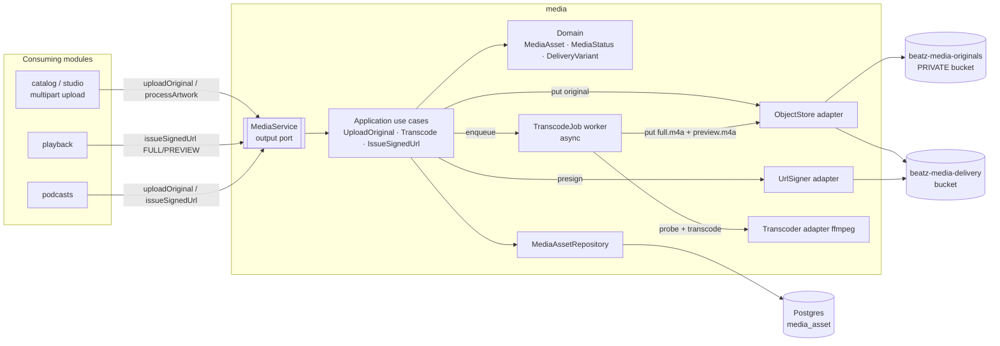
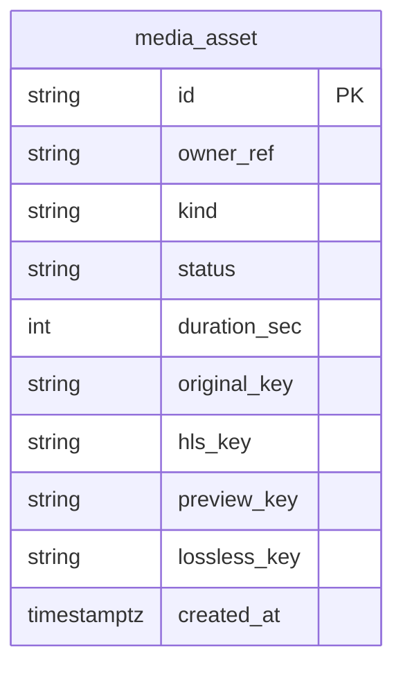
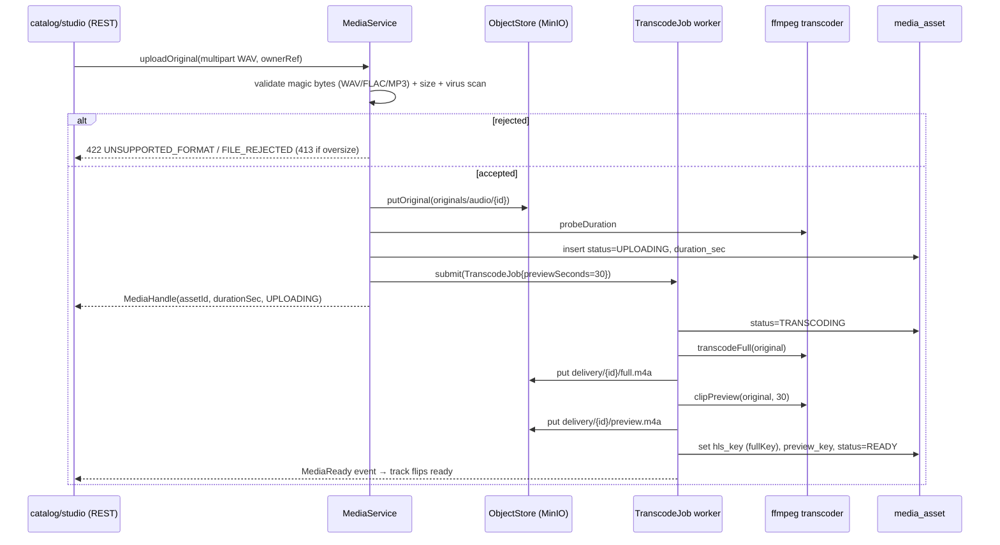
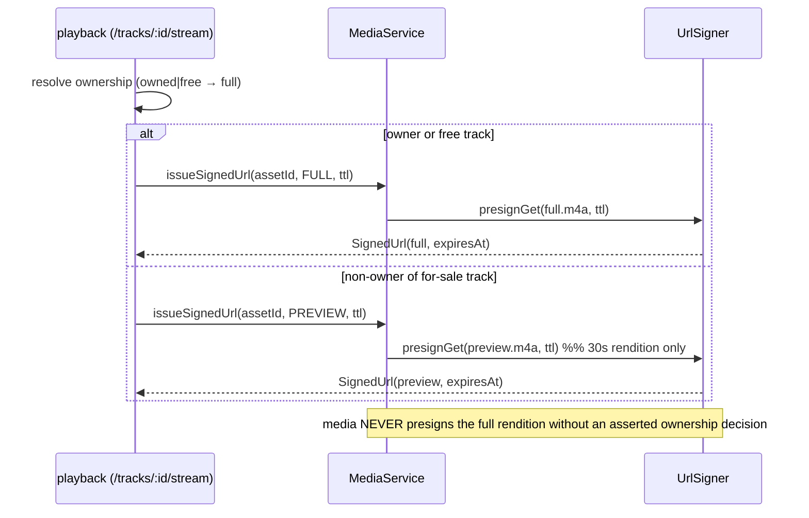
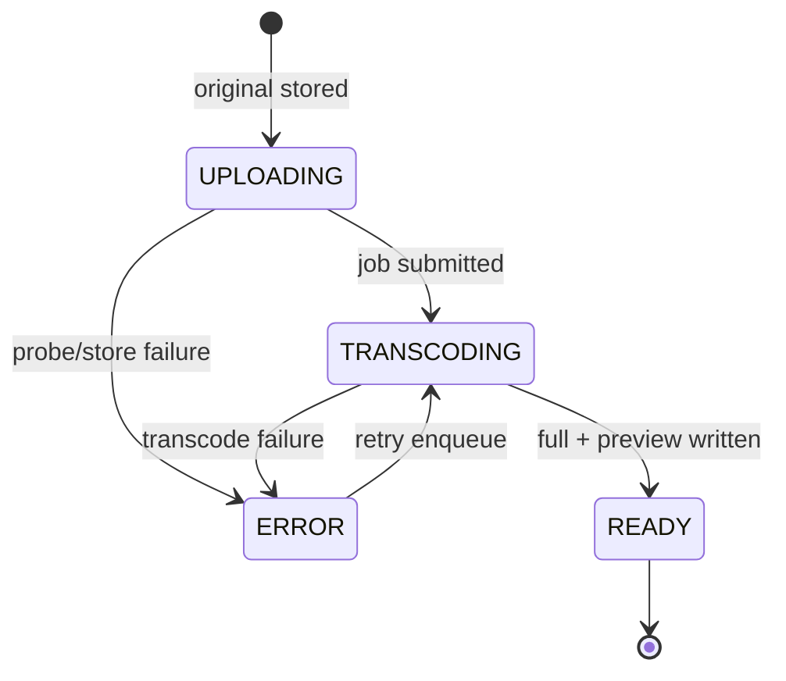

# Architecture Design Doc — `media` (Media Pipeline)

> **Status:** Proposal · **PRD source:** `BACKEND-PRD.md` §6.14, §9.3, §4.3 · **Owning context:** `media` ·
> **Package root:** `org.shakvilla.beatzmedia.media`
>
> This ADD is consumed by Claude Code agents. It is the design contract for the module: an agent
> reads it, plans the listed work units, implements within the stated ports/adapters, writes the
> tests, and opens a PR. Do not invent endpoints or fields not traceable to the PRD / `API-CONTRACT.md`.

## 1. Purpose & responsibilities

The `media` module is **shared infrastructure**: it owns the lifecycle of every binary asset on the
platform — accepting audio/artwork uploads, validating format and safety, transcoding audio into a
**single AAC/M4A full rendition plus a server-clipped 30s AAC/M4A preview rendition**, processing
artwork into delivery variants, laying assets out in object storage, and issuing **signed, time-boxed
delivery URLs**. It is the **server-side enforcement point for INV-3** (the preview gate): a non-owner
can only ever receive a URL to the 30s preview rendition; the full rendition is issued only when
ownership is confirmed by the caller. It also holds the **LOSSLESS (FLAC) rendition** — the downloadable
releases feature's delivery payload — and issues signed URLs to it (`playback` decides *whether* a
caller may have one, per INV-13; `media` only ever hands over the object once told to). The module
**does not** own catalog/track/episode entities,
ownership grants, or REST upload endpoints — those belong to `catalog`, `studio`,
`commerce`/`playback`, which call this module's `MediaService` output port. It exposes **no public
REST of its own**: uploads arrive through `catalog`/`studio` multipart endpoints, delivery through
`playback`. It serves all four consuming surfaces (Fan playback, Studio uploads, Admin moderation
reads, Catalog ingestion).
**HLFRs covered:** HLFR-MEDIA-01 (LLFR-MEDIA-01.1 upload, 01.2 transcode, 01.3 signed delivery).

## 2. Context & dependencies (C4 component view)


```mermaid
flowchart LR
  subgraph callers[Consuming modules]
    CAT[catalog / studio<br/>multipart upload]
    PLY[playback]
    POD[podcasts]
  end
  subgraph module[media]
    PORT[[MediaService<br/>output port]]
    APP[Application use cases<br/>UploadOriginal · Transcode · IssueSignedUrl]
    DOM[Domain<br/>MediaAsset · MediaStatus · DeliveryVariant]
    OUTS[ObjectStore adapter]
    OUTSIGN[UrlSigner adapter]
    OUTFF[Transcoder adapter ffmpeg]
    JOB[TranscodeJob worker<br/>async]
    REPO[MediaAssetRepository]
  end
  CAT -->|uploadOriginal / processArtwork| PORT
  PLY -->|issueSignedUrl FULL/PREVIEW| PORT
  POD -->|uploadOriginal / issueSignedUrl| PORT
  PORT --> APP --> DOM
  APP --> REPO --> DB[(Postgres<br/>media_asset)]
  APP -->|put original| OUTS
  APP -->|enqueue| JOB
  JOB -->|probe + transcode| OUTFF
  JOB -->|put full.m4a + preview.m4a| OUTS
  APP -->|presign| OUTSIGN
  OUTS --> ORIG[(beatz-media-originals<br/>PRIVATE bucket)]
  OUTS --> DELV[(beatz-media-delivery<br/>bucket)]
  OUTSIGN --> DELV
```

**Dependency rule.** Hexagonal: `domain` depends on nothing; `application` depends on `domain` + ports;
adapters depend inward only (ArchUnit-enforced). `media` is a **leaf** — it calls no other business
module. Other modules call it **only** through the `MediaService` input/output port (in-process CDI).
It **publishes** the domain event `MediaReady(assetId, ownerRef, kind)` (`AFTER_SUCCESS`) so consumers
(`catalog`/`studio`/`podcasts`) flip the owning track/episode to `ready`. It **consumes** no events.
Persistence (`media_asset`) is private to this module; consumers reference assets by opaque `assetId`.

## 3. Domain model

| Name | Kind | Key fields | Notes |
|---|---|---|---|
| `MediaAsset` | Aggregate root | `id`, `ownerRef`, `kind`, `status`, `durationSec`, `originalKey`, `fullKey`, `previewKey`, `losslessKey?` | One row per uploaded binary; lifecycle owner |
| `OwnerRef` | Value object | `module`, `entityId` | Opaque back-reference to the catalog/studio entity (no cross-module FK) |
| `ObjectKey` | Value object | `bucket`, `key` | Fully-qualified storage location |
| `SignedUrl` | Value object | `url`, `variant`, `expiresAt` | Result of presigning; ISO-8601 `expiresAt` |
| `MediaHandle` | Value object | `assetId`, `kind`, `durationSec`, `status` | Returned to caller after upload |

**Enums** (lifted from PRD §6.14 / frontend status vocabulary):

- `MediaKind { AUDIO, ARTWORK }`
- `MediaStatus { UPLOADING, TRANSCODING, READY, ERROR }`
- `DeliveryVariant { FULL, PREVIEW, LOSSLESS }`
- `AudioFormat { WAV, FLAC, MP3 }` (MP3 is `lossy()`, ADR-35) · `ImageFormat { PNG, JPG }`

**Invariants enforced here:**

- **INV-3 (preview gate).** `issueSignedUrl(asset, variant)` may presign the `fullKey` (FULL) **only**
  when the caller asserts confirmed ownership; otherwise it presigns the `previewKey` (PREVIEW), a
  rendition physically clipped to `previewSeconds = 30`. There is **no code path** that returns the
  full rendition without an ownership assertion. The 30s clip **is** the server-side enforcement — a
  non-owner is signed an object that physically contains only ~30 seconds of audio, so there is no
  full-length media for a client to over-play; the client-side countdown timer is advisory only
  (§9.3).
- **INV-13 (download gate) — why LOSSLESS is not FULL.** `DeliveryVariant.LOSSLESS` (`losslessKey`,
  `delivery/{id}/lossless.flac`) is a **separate** rendition from `FULL`, not a reuse of it, for two
  reasons. First, `fullKey` is a lossy AAC 128k object — the streaming rendition — so serving it as
  "the download" would hand a buyer a lossy file on a platform selling lossless masters; the FLAC is
  produced fresh from the original. Second, the *decision* to serve either one is a different
  invariant with a different owner: FULL is gated on ownership alone (INV-3, decided in `playback`
  from `OwnershipReader`), while LOSSLESS is gated on the caller's **download permission**, captured
  once on their `ownership_grant` at settlement (INV-13, decided in `playback` from commerce's
  `GetTrackDownloadPermission` — see `commerce.md` §3/§9 and `playback.md` §4.1/§9). `media` itself
  enforces neither gate; `MediaAsset.resolveDeliveryKey(LOSSLESS)` just refuses to fabricate a
  download from `fullKey` when `losslessKey` is absent (throws rather than falling back), so a caller
  who *is* entitled to a download either gets true lossless bytes or a `409 DOWNLOAD_NOT_READY` — never
  a quietly-downgraded AAC file.
- A `MediaAsset` reaches `READY` only after **both** `fullKey` and `previewKey` (for `AUDIO`) are
  written; artwork reaches `READY` after its processed variant is written. `losslessKey` is
  independent of `READY` — `markLosslessReady(...)` is a separate transition (§8, §13) precisely so a
  track that can already stream never blocks on a FLAC transcode nobody has to wait for.
- Format guard: only `AUDIO ∈ {WAV,FLAC,MP3}` and `ARTWORK ∈ {PNG,JPG}` are admitted (§9).

### Object-storage layout

Two S3-compatible buckets (PRD §5: `beatz-media-originals` PRIVATE, `beatz-media-delivery`):

| Bucket | Prefix | Access | Contents |
|---|---|---|---|
| `beatz-media-originals` | `originals/{kind}/{assetId}` | **private**, never public, never signed for read by clients | raw uploaded WAV/FLAC/MP3/PNG/JPG |
| `beatz-media-delivery` | `delivery/{assetId}/full.m4a` | signed read only | single AAC/M4A object, full rendition |
| `beatz-media-delivery` | `delivery/{assetId}/preview.m4a` | signed read only | single AAC/M4A object, physically ≤30s |
| `beatz-media-delivery` | `delivery/{assetId}/lossless.flac` | signed read only | single FLAC object, the download payload (INV-13); nullable, produced after `READY` |
| `beatz-media-delivery` | `delivery/{assetId}/art/` | signed read only | processed artwork variants (e.g. `cover-1024.jpg`) |

> **Why a single file per variant, not HLS (ADR, see `00-system-architecture.md` §9).** The original
> design transcoded audio to an HLS playlist (`playlist.m3u8` + `.ts` segments). That design could
> never have worked against this module's own delivery model: `issueSignedUrl` presigns exactly one
> object, but an HLS playlist references its segments by **relative path**, and the delivery bucket is
> private (`mc anonymous set none local/beatz-media-delivery`, `backend/docker-compose.yml`) — so every
> segment fetch the player made after the presigned playlist request would be unsigned and 403. A
> single presigned `.m4a` object has no unsigned sub-requests: the one signed URL *is* the whole
> playable file. The catalogue is short buy-to-own tracks (not long-form adaptive-bitrate streaming),
> so HLS's adaptive-bitrate benefit bought nothing here. **Do not reinstate HLS delivery** without
> first solving the segment-signing problem.


```mermaid
erDiagram
  media_asset {
    string id PK
    string owner_ref
    string kind
    string status
    int duration_sec
    string original_key
    string hls_key
    string preview_key
    string lossless_key
    timestamptz created_at
  }
```

> **Note:** the ERD/DB column is still named `hls_key` (see §7) even though it now holds a single
> `.m4a` object key, not an HLS playlist key. This is deliberate — see the column-naming note in §7.

## 4. Application layer (ports)

### 4.1 Input ports (use cases)

The module's use cases are surfaced to other modules through the `MediaService` facade (§4.2 lists it
as the consumed output port from their perspective; here are the use-case interfaces it composes).

```java
public interface UploadOriginalUseCase {
    /** Stream a multipart part to the private originals bucket; probe; persist UPLOADING asset. */
    MediaHandle uploadOriginal(UploadCommand command);
}

public interface TranscodeUseCase {
    /** Enqueue async transcode of an AUDIO asset to full.m4a + 30s preview.m4a; flips TRANSCODING then READY. */
    void enqueueTranscode(MediaAssetId assetId);
}

public interface IssueDeliveryUrlUseCase {
    /** INV-3 enforcement point: PREVIEW unless ownership asserted; presign delivery key. */
    SignedUrl issueSignedUrl(MediaAssetId assetId, DeliveryVariant variant, Duration ttl);
}
```

- **uploadOriginal** — trigger: a `catalog`/`studio` multipart endpoint forwards a part. Authorization:
  caller (creator) already authorized by the inbound module; `media` re-checks `ownerRef` consistency.
  Idempotent on `(ownerRef, contentHash)` — re-upload of identical bytes returns the existing handle.
  Emits none yet. Satisfies LLFR-MEDIA-01.1.
- **enqueueTranscode** — trigger: invoked by `uploadOriginal` for `AUDIO`. Authorization: internal.
  Idempotent per `assetId` (re-enqueue while `TRANSCODING` is a no-op). Emits `MediaReady` on success.
  Satisfies LLFR-MEDIA-01.2.
- **issueSignedUrl** — trigger: `playback`/`podcasts` ownership-aware stream. Authorization: the caller
  passes the resolved ownership decision; `media` never returns FULL without it. Read-only, not
  idempotency-keyed. Satisfies LLFR-MEDIA-01.3 / INV-3.

### 4.2 Output ports

The single facade other modules consume, plus the ports `media` needs the outside world to fulfil:

```java
/** The output port consumed by catalog, podcasts, studio, playback. */
public interface MediaService {
    MediaHandle uploadOriginal(UploadCommand command);          // multipart part + metadata
    int probeDuration(MediaAssetId assetId);                    // whole seconds (ffprobe)
    void transcodeToDelivery(MediaAssetId assetId);              // enqueue full.m4a + preview.m4a
    void generatePreviewClip(MediaAssetId assetId);             // 30s preview rendition (INV-3)
    MediaHandle processArtwork(MediaAssetId assetId);           // validate + emit delivery variants
    SignedUrl issueSignedUrl(MediaAssetId assetId, DeliveryVariant variant, Duration ttl);
}

/** Internal async job port driven by the transcode worker. */
public interface TranscodeJobPort {
    void submit(TranscodeJob job);                              // enqueue (in-process/queue)
    void onResult(TranscodeResult result);                     // worker callback → persist keys
}

/** Outbound infra ports. */
public interface ObjectStorePort {
    ObjectKey putOriginal(MediaKind kind, MediaAssetId id, InputStream body, String contentType);
    ObjectKey putDelivery(MediaAssetId id, String relativeKey, InputStream body, String contentType);
    boolean exists(ObjectKey key);
}

public interface UrlSignerPort {
    SignedUrl presignGet(ObjectKey key, DeliveryVariant variant, Duration ttl);
}

public interface AudioTranscoderPort {
    int probeDurationSec(ObjectKey original);                   // ffprobe
    ObjectKey transcodeFull(ObjectKey original, MediaAssetId id);       // delivery/{id}/full.m4a
    ObjectKey clipPreview(ObjectKey original, MediaAssetId id, int previewSeconds); // delivery/{id}/preview.m4a

  ObjectKey transcodeLossless(ObjectKey original, MediaAssetId id);         // delivery/{id}/lossless.flac (INV-13 payload)
}

public interface ArtworkProcessorPort {
    ImageFormat detectFormat(ObjectKey original);
    ObjectKey processVariants(ObjectKey original, MediaAssetId id);
}

public interface MediaAssetRepository {
    MediaAsset save(MediaAsset asset);
    Optional<MediaAsset> findById(MediaAssetId id);
}
```

**Records for commands / handles / results:**

```java
public record UploadCommand(OwnerRef ownerRef, MediaKind kind, String filename,
                            String declaredContentType, long sizeBytes, InputStream body) {}
public record MediaHandle(MediaAssetId assetId, MediaKind kind, int durationSec, MediaStatus status) {}
public record TranscodeJob(MediaAssetId assetId, ObjectKey original, int previewSeconds) {}
public record TranscodeResult(MediaAssetId assetId, ObjectKey fullKey, ObjectKey previewKey,
                              int durationSec, boolean ok, String errorCode) {}
public record SignedUrl(String url, DeliveryVariant variant, Instant expiresAt) {}
```

Implementing adapters: `ObjectStorePort`/`UrlSignerPort` → S3/MinIO adapter (`quarkus-amazon-s3`);
`AudioTranscoderPort` → ffmpeg adapter (Compose `transcoder` worker, PRD §5.1); `ArtworkProcessorPort`
→ in-app image library; `MediaAssetRepository` → Panache JPA; `TranscodeJobPort` → in-process queue.

## 5. Adapters

### 5.1 Inbound — REST resources

**None owned by `media`.** Uploads enter through `catalog`/`studio` multipart endpoints
(`API-CONTRACT.md` §11 `/studio/releases*`, `/studio/podcasts*`) and `catalog` §4; those resources map
the part to an `UploadCommand` and call `MediaService.uploadOriginal`. Delivery enters through
`playback` §4 `/tracks/:id/stream`, which resolves ownership then calls `MediaService.issueSignedUrl`.

**Multipart contract (inbound modules apply, documented here for the agent):**

- `Content-Type: multipart/form-data`; audio part `file` plus `kind`, `ownerRef` fields.
- Accepted: `audio/wav`, `audio/flac` (AUDIO); `image/png`, `image/jpeg` (ARTWORK). Detected by magic
  bytes, not the declared header.
- Size limit via `quarkus.http.limits.max-body-size` (generous for WAV/FLAC); exceeding → `413`.
- **Resumable option (OQ-10):** v1 ships **plain multipart** with a generous limit; a resumable path
  (tus or S3 multipart upload) is added behind the same `uploadOriginal` port when large-file demand
  warrants — no API change to consumers, only an additional inbound adapter.

### 5.2 Outbound — persistence & integrations

- **S3/MinIO adapter** (`ObjectStorePort`, `UrlSignerPort`): streams originals to the private bucket,
  writes full/preview/art objects to the delivery bucket, presigns time-boxed GET URLs. Endpoint + creds from
  `BEATZ_S3_*` env (PRD §5.2); buckets `BEATZ_S3_BUCKET_ORIGINALS`/`_DELIVERY` created by the Compose
  `createbuckets` init job (PRD §5.1). The 500 MB cap is enforced mid-PUT by a limiting input stream
  that throws `FileTooLargeException`; because the AWS SDK reads the body inside its own marshalling
  loop it may wrap that domain exception as `SdkClientException`, so `putOriginal` unwraps any
  `DomainException` from the SDK cause chain and re-throws it — oversize uploads surface `413`, never
  `500` (guarded by `S3UploadCapIT` against real MinIO and by `S3ObjectStoreAdapterUnwrapTest`).
  **Streaming paths:** a known content length streams straight to the SDK via
  `RequestBody.fromInputStream` (no heap buffer) **only when the body supports mark/reset** — the
  sync SDK may re-read the payload (SigV4 payload signing, flexible-checksum precompute, or a retry)
  and so needs a resettable body. Two cases instead spool the body to a bounded temp file and PUT
  from disk via the re-readable `RequestBody.fromFile`: (1) *unknown* content length (`-1`, declared
  size absent or untrusted) — the sync SDK cannot PUT a stream of unknown length; and (2) a
  **non-markable** body of known length (WU-MED-2) — e.g. the Studio release-track / podcast-episode
  upload, whose `Files.newInputStream` over the multipart temp file cannot be reset, so
  `RequestBody.fromInputStream` throws `IllegalStateException: … does not support mark/reset, and was
  already read once.` the moment the SDK re-reads it (this returned `500` on **every** track/episode
  upload in live QA of the release wizard — the WU-CAT-5 unit tests stubbed the media port, so the
  real adapter was never exercised with a non-markable stream). The spool is capped at
  `MAX_SPOOL_BYTES` (mirrors the 500 MB limit) as an adapter-level disk backstop, throws
  `FileTooLargeException` the moment the cap trips (still `413`), and the temp file is always deleted.
  Guarded by `S3UnknownLengthUploadIT` (normal body stored byte-for-byte; over-cap body → `413`),
  `S3ObjectStoreAdapterRetryableBodyTest` (deterministic — re-reads the request body to reproduce the
  exact mark/reset `IllegalStateException`), and `S3KnownLengthNonMarkableUploadIT` (real-MinIO
  byte-for-byte of a non-markable known-length body).
- **ffmpeg transcoder adapter** (`AudioTranscoderPort`): probes duration (`ffprobe`), produces the full
  rendition (`transcodeFull` → `delivery/{id}/full.m4a`) and the 30s preview clip (`clipPreview` →
  `delivery/{id}/preview.m4a`) via the Compose `transcoder` service (`jrottenberg/ffmpeg`, PRD §5.1).
  Both are single AAC/M4A objects: ffmpeg is invoked with `-c:a aac -b:a 128k -vn -movflags
  +faststart` (`-vn` drops any embedded cover-art video stream; `+faststart` moves the `moov` atom to
  the front of the file so playback can start before the whole object is downloaded); the preview
  additionally passes `-t <previewSeconds>` to physically clip the output. See §3 for why this
  replaced HLS. Long-running, off the request thread (async job).
- **LOSSLESS transcode (`transcodeLossless` → `delivery/{id}/lossless.flac`).** `ffmpeg -nostdin -y
  -i <input> -c:a flac -compression_level 8 <output>` — a single FLAC object, content-type
  `audio/flac`. **Deliberately omits `-vn`**, unlike `runFfmpegM4a` above. `-vn` on the streaming
  renditions drops an embedded cover-art video stream because the app already re-serves that artwork
  separately on every play — carrying a redundant copy in every streamed byte range is pure waste.
  The FLAC is different: it is the file a buyer **owns and downloads**, where the app's UI is no
  longer in the loop, so the embedded artwork is part of what they bought — the same way a purchased
  CD or vinyl rip carries its cover. Verified against ffmpeg 9.0 (the pinned runtime build) that an
  input with an attached-picture stream carries it through into the FLAC output cleanly (exit 0,
  duration unaffected) with no explicit `-map`/`-c:v` needed, so omitting `-vn` here is a considered
  choice, not a copy-paste gap from `runFfmpegM4a`. Guarded by `RealTranscodeIT` (full-length output,
  ffprobe'd duration; cover-art retention).
- **Artwork processor** (`ArtworkProcessorPort`): validates and emits delivery image variants.
- **Mapping:** domain `MediaAsset` ↔ JPA entity in the persistence adapter; domain carries no ORM
  annotations. **Transaction boundary** = the use case (`@Transactional` on the application service);
  the async transcode result is persisted in its own short transaction. Object writes happen before the
  status transition is committed.

## 6. DTOs & API shapes

`media` exposes no DTOs of its own at the wire; it returns domain value objects to in-process callers.
The shapes consumers serialize (traceable to `Frontend/src/types/index.ts`):

- **MediaHandle** → consumed by `catalog`/`studio` to set the track/episode `status` and `duration`
  (durations are whole **seconds**, never pre-formatted strings).
- **SignedUrl** → `{ url, expiresAt }` embedded in `playback`'s `/tracks/:id/stream` response
  (`expiresAt` ISO-8601 UTC). The `variant` is internal and not exposed to clients.

No money fields are involved in this module.

## 7. Persistence schema & migrations

```sql
CREATE TABLE media_asset (
    id            VARCHAR(40)  PRIMARY KEY,            -- ULID/UUIDv7 via IdGenerator
    owner_ref     VARCHAR(80)  NOT NULL,               -- "{module}:{entityId}" opaque back-ref
    kind          VARCHAR(16)  NOT NULL,               -- AUDIO | ARTWORK
    status        VARCHAR(16)  NOT NULL,               -- UPLOADING | TRANSCODING | READY | ERROR
    duration_sec  INTEGER,                             -- probed; NULL for artwork
    original_key  VARCHAR(255) NOT NULL,               -- originals/{kind}/{id}
    hls_key       VARCHAR(255),                        -- delivery/{id}/full.m4a (column name is historical, see note below)
    preview_key   VARCHAR(255),                        -- delivery/{id}/preview.m4a
    lossless_key  VARCHAR(255),                        -- delivery/{id}/lossless.flac; nullable, produced after READY (INV-13)
    content_hash  VARCHAR(64),                         -- SHA-256 of the original bytes; idempotency on (owner_ref, content_hash)
    created_at    TIMESTAMPTZ  NOT NULL DEFAULT now(),
    CONSTRAINT chk_media_kind   CHECK (kind   IN ('AUDIO','ARTWORK')),
    CONSTRAINT chk_media_status CHECK (status IN ('UPLOADING','TRANSCODING','READY','ERROR'))
);
CREATE INDEX idx_media_asset_owner_ref ON media_asset (owner_ref);
CREATE INDEX idx_media_asset_status    ON media_asset (status);
-- Unique partial index: prevents concurrent identical uploads from both inserting (S1)
CREATE UNIQUE INDEX uidx_media_asset_owner_content
    ON media_asset (owner_ref, content_hash)
    WHERE content_hash IS NOT NULL;
```

> **Schema note (WU-MED-1):** `content_hash` was added to the implemented table beyond the
> original sketch above to back the `(ownerRef, contentHash)` idempotency key (§9): a re-upload of
> identical bytes returns the existing handle instead of creating a duplicate asset/object.
>
> **S1 (unique index):** `uidx_media_asset_owner_content` is a partial unique index on
> `(owner_ref, content_hash) WHERE content_hash IS NOT NULL`. It provides a database-level guard
> against two concurrent identical uploads both inserting a row before either has committed. The
> application tolerates a unique-violation on retry by returning the existing handle (idempotency).
>
> **Column-naming note (`hls_key` vs. `fullKey`).** The domain/entity field is named `fullKey`
> (`MediaAssetEntity.fullKey`, `@Column(name = "hls_key")`), but the underlying DB column is still
> named `hls_key` — a holdover from the original HLS design (see §3). It is deliberately **not**
> renamed: renaming a merged column requires a migration for zero behavioural gain, and the mapping
> is explicit and documented in `MediaAssetEntity`'s Javadoc. **This is not a bug** — do not "fix" the
> mismatch without a reason beyond cosmetics.

> **`lossless_key` (downloadable releases).** Added by `V979__media_asset_lossless_key.sql`, nullable
> with no default — precisely because it is produced **after** `READY` (§3): playback must not wait on
> a FLAC transcode that only a download needs. An asset with `lossless_key IS NULL` answers `409
> DOWNLOAD_NOT_READY` at the `playback` download endpoint rather than silently serving the AAC `FULL`
> rendition (§3 INV-13 note). Domain: `MediaAsset.markLosslessReady(ObjectKey)` is the sole writer,
> separate from `markReady` on purpose (§8).

**Flyway list** (`src/main/resources/db/migration/`, forward-only):

- `V<n>__create_media_asset.sql` — table + indexes above (including `uidx_media_asset_owner_content`).
- `V979__media_asset_lossless_key.sql` — adds nullable `lossless_key` (downloadable releases).

Repeatable seed `R__seed_dev_data.sql` (dev/test only) inserts placeholder `media_asset` rows for the
seed catalog audio uploaded to MinIO by the `createbuckets`/seed init (PRD §5.4).

## 8. Key flows

**Upload → validate → store → transcode → ready:**


```mermaid
sequenceDiagram
  participant Studio as catalog/studio (REST)
  participant Svc as MediaService
  participant Store as ObjectStore (MinIO)
  participant Job as TranscodeJob worker
  participant FF as ffmpeg transcoder
  participant DB as media_asset
  Studio->>Svc: uploadOriginal(multipart WAV, ownerRef)
  Svc->>Svc: validate magic bytes (WAV/FLAC/MP3) + size + virus scan
  alt rejected
    Svc-->>Studio: 422 UNSUPPORTED_FORMAT / FILE_REJECTED  (413 if oversize)
  else accepted
    Svc->>Store: putOriginal(originals/audio/{id})
    Svc->>FF: probeDuration
    Svc->>DB: insert status=UPLOADING, duration_sec
    Svc->>Job: submit(TranscodeJob{previewSeconds=30})
    Svc-->>Studio: MediaHandle(assetId, durationSec, UPLOADING)
    Job->>DB: status=TRANSCODING
    Job->>FF: transcodeFull(original)
    Job->>Store: put delivery/{id}/full.m4a
    Job->>FF: clipPreview(original, 30)
    Job->>Store: put delivery/{id}/preview.m4a
    Job->>DB: set hls_key (fullKey), preview_key, status=READY
    Job-->>Studio: MediaReady event → track flips ready
  end
```

**Signed delivery — full vs preview by ownership (INV-3):**


```mermaid
sequenceDiagram
  participant Play as playback (/tracks/:id/stream)
  participant Svc as MediaService
  participant Sign as UrlSigner
  Play->>Play: resolve ownership (owned|free → full)
  alt owner or free track
    Play->>Svc: issueSignedUrl(assetId, FULL, ttl)
    Svc->>Sign: presignGet(full.m4a, ttl)
    Sign-->>Play: SignedUrl(full, expiresAt)
  else non-owner of for-sale track
    Play->>Svc: issueSignedUrl(assetId, PREVIEW, ttl)
    Svc->>Sign: presignGet(preview.m4a, ttl)  %% 30s rendition only
    Sign-->>Play: SignedUrl(preview, expiresAt)
  end
  Note over Svc,Sign: media NEVER presigns the full rendition without an asserted ownership decision
```

**Media status state machine:**


```mermaid
stateDiagram-v2
  [*] --> UPLOADING : original stored
  UPLOADING --> TRANSCODING : job submitted
  UPLOADING --> ERROR : probe/store failure
  TRANSCODING --> READY : full + preview written
  TRANSCODING --> ERROR : transcode failure
  ERROR --> TRANSCODING : retry enqueue
  READY --> [*]
```

## 9. Cross-cutting hooks

- **Format validation.** Magic-byte sniffing admits `WAV`/`FLAC`/`MP3` (audio, ADR-35) and `PNG`/`JPG`
  (artwork). Mismatch → `422 UNSUPPORTED_FORMAT` (`error.field = file`). Oversize → `413`.
- **Safety / virus rejection.** A scan step (ClamAV-style adapter) on the stored original; positive →
  `422 FILE_REJECTED` and the original is purged. Both rejection codes are stable, assertable strings.
- **INV-3 enforcement.** The 30s preview rendition is the physical enforcement point: non-owners
  receive a signed URL to `preview_key` (a single `.m4a` object that IS ~30 seconds of audio, not
  merely referenced by a client-side timer) only. **No code path presigns `hls_key`/`fullKey` without
  an asserted ownership decision** — this is the module-specific DoD gate (§12).
- **Signed-URL TTL.** `BEATZ_SIGNED_URL_TTL_SECONDS` (PRD §5.2) sets the default `ttl`; every
  `SignedUrl` carries an `expiresAt` (ISO-8601). After `expiresAt` the object store rejects the GET.
- **Idempotency.** `uploadOriginal` keyed on `(ownerRef, contentHash)`; `enqueueTranscode` keyed on
  `assetId`. Repeated calls cause no duplicate objects or rows.
- **Audit (INV-10).** Privileged content actions (takedown reads, re-transcode) append an `AuditEntry`
  via the `audit` module port. No PII or signed URLs in logs (§9 conventions).
- **Observability.** Micrometer counters (`media.upload.rejected{code}`, `media.transcode.duration`),
  queue depth gauge, OpenTelemetry spans across upload→transcode→ready; trace/correlation id on every
  request (e.g. `trace-id: 4f9c…`) propagated into the async job.

## 10. Work units & build order

| WU | Scope | LLFR | Depends on | Phase / order |
|---|---|---|---|---|
| **WU-MED-1** | Media upload→validate→transcode→signed URL: `MediaService` port; S3/MinIO adapter; ffmpeg transcoder; `media_asset` + migration; INV-3 preview enforcement | MEDIA-01.1, 01.2, 01.3 | WU-PLT-1 (PlatformSettings) | **Phase 0 (foundations)** — built before WU-CAT-3, WU-PLY-1, WU-POD-1, WU-STU-2 which all depend on it |

Cross-reference PRD §8: `Phase 0 … ; WU-MED-1`. `media` is foundational shared infra; consuming work
units (CAT-3, PLY-1, POD-1, STU-2) list WU-MED-1 as a dependency.

## 11. Testing plan

- **Unit (fakes for output ports):** format validation table (WAV/FLAC/MP3/PNG/JPG accept; EXE/oversize
  reject); status state-machine transitions; INV-3 guard (FULL refused without ownership assertion).
- **Integration (Testcontainers MinIO + Postgres, REST-assured via the inbound modules):** real
  upload→store→transcode→ready against Compose MinIO and the `transcoder`; presign + fetch.
- **Contract:** `SignedUrl`/`MediaHandle` projections validate against frontend types.
- **LOSSLESS (INV-13, real ffmpeg, `RealTranscodeIT`):** `transcodeLossless` on a real WAV produces a
  full-length FLAC (ffprobe'd duration matches the source, not clipped like PREVIEW) and retains an
  embedded cover-art stream (the deliberate `-vn` omission, §5.2). Skipped on hosts without ffmpeg on
  `PATH` (`@BeforeAll assumeTrue`).

**PRD §6.14 acceptance (Given/When/Then):**

1. **Transcode (LLFR-MEDIA-01.2).** *Given* an uploaded WAV, *when* transcode completes, *then* a full
   AAC/M4A rendition (`delivery/{id}/full.m4a`) and a **≤30s** preview AAC/M4A rendition
   (`delivery/{id}/preview.m4a`) both exist and the owning track flips to `ready` (via `MediaReady`).
2. **Signed delivery / INV-3 (LLFR-MEDIA-01.3).** *Given* a non-owner's PREVIEW signed URL, *then* it
   expires at `expiresAt` and **cannot** retrieve the full rendition (the URL targets `preview_key`
   only; a request for the full `.m4a` path is unsigned/unauthorized).
3. **Rejection.** *Given* a non-audio or oversize part, *then* `422 UNSUPPORTED_FORMAT` /
   `422 FILE_REJECTED` / `413` respectively, and no `media_asset` row reaches `READY`.

Coverage ≥ the gate in `sdlc/testing-strategy.md`.

## 12. Definition of done (module-specific)

Global DoD (conventions §11 / PRD §8) **plus**:

1. **Preview never serves full audio:** no code path presigns `hls_key`/`fullKey` for a non-owner;
   INV-3 unit + integration tests green.
2. The full and 30s preview AAC/M4A renditions are both produced before a track/episode is marked
   `READY`; the preview is **physically ≤ `previewSeconds` (30s)**, not merely client-trimmed.
3. Originals bucket is **private** — no object in `beatz-media-originals` is ever directly client-signed.
4. Every issued delivery URL carries a finite TTL and `expiresAt`; expiry verified against MinIO.
5. Format/safety rejections return the exact stable codes (`UNSUPPORTED_FORMAT`, `FILE_REJECTED`, 413).
6. Boots healthy under `docker compose up` with `objectstore` + `transcoder` (PRD §5.1); Flyway applies
   cleanly on an empty DB; ArchUnit dependency rule green.

## 13. Implementation notes (as-built)

**`InProcessTranscodeJobAdapter` uses a plain `ExecutorService` (virtual threads), not the
CDI-injected `ManagedExecutor` — bug fix discovered by WU-STU-2's first real end-to-end audio-upload
integration test.** §5.2's original text specified MicroProfile Context Propagation's
`ManagedExecutor` (ADR WU-MED-1 §1). No module's test suite had ever exercised a *successful*
`UploadOriginalUseCase#uploadOriginal` call for `MediaKind.AUDIO` through a real `@QuarkusTest` REST
flow until `studio.it.StudioPodcastResourceIT` (WU-STU-2) — every prior upload IT (`catalog
.StudioReleaseResourceIT`) only exercised the format-rejection path, which throws before reaching
`transcodeJobPort.submit(...)`.

`submit(TranscodeJob)` is called as the last line of `uploadOriginal`, which is itself
`@Transactional` and still mid-transaction on the calling thread at that point (true for every
caller: catalog/studio/podcasts upload use cases). `ManagedExecutor`'s default context propagation
— via Quarkus's `narayana-jta` integration — associates the SAME still-active JTA transaction with
the new worker thread it spawns, so the worker's own `@Transactional markTranscoding(...)` call and
the original request thread end up concurrently active in one Narayana transaction. Narayana rejects
this at commit time (`ARJUNA012094`/`ARJUNA012107`, "commiting with 2 threads active"), which
surfaces to the HTTP caller as an opaque 500 ("Enlisted connection used without active transaction")
— this affected EVERY module's audio-upload path identically, not something introduced by WU-STU-2.

Fix: `InProcessTranscodeJobAdapter` now owns a plain, unmanaged `Executors
.newVirtualThreadPerTaskExecutor()` instead of the injected `ManagedExecutor`. A plain
`ExecutorService` propagates no ambient thread context at all, so the worker thread never touches
the caller's transaction; `MediaApplicationService` is `@ApplicationScoped` (not request-scoped), so
no CDI request context is needed on the worker thread either — each of its methods opens its own
independent transaction as designed. `TranscodeJobPort`'s contract ("runs on a managed thread") is
unchanged; only the concrete executor mechanism changed. No port, DTO, or other module's code was
touched. Regression-tested by `studio.it.StudioPodcastResourceIT`'s successful create-episode paths
(the media module's own unit tests — `UploadOriginalUseCaseTest` et al. — construct
`MediaApplicationService` directly with `FakeTranscodeJobPort` and were unaffected).

**The LOSSLESS rendition (downloadable releases, as-built).** `AudioTranscoderPort.transcodeLossless`,
`MediaAsset.markLosslessReady`, the `lossless_key` column (`V979`), and
`MediaService.issueSignedUrl(assetId, DeliveryVariant.LOSSLESS, ttl)` are all shipped and exercised
end-to-end by `playback.it.DownloadEndpointIT` (six cases, including grandfathering) and, on hosts
with ffmpeg, by `RealTranscodeIT`. **What is *not* shipped yet:** nothing in `media`'s own upload
pipeline (`UploadOriginalUseCaseTest`'s job flow, `InProcessTranscodeJobAdapter`) calls
`transcodeLossless` automatically after a track reaches `READY`. The capability exists and is
independently correct — §3's design (nullable column, `markLosslessReady` separate from `markReady`)
is exactly shaped for "produced later, off the READY path" — but nothing yet *triggers* that later
production in a running system. `DownloadEndpointIT` seeds `lossless_key` directly via SQL rather than
through a real transcode (its own class Javadoc says so) precisely because no such trigger exists to
exercise. Wiring one — e.g. `enqueueTranscode` scheduling a second, lower-priority `TranscodeJob` for
the FLAC, or a standalone post-`READY` job — is unscoped follow-up work, not a defect in what shipped:
every commit in this feature does exactly what its own commit message says.
