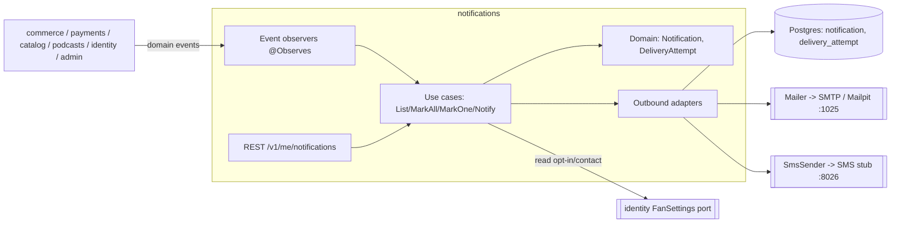
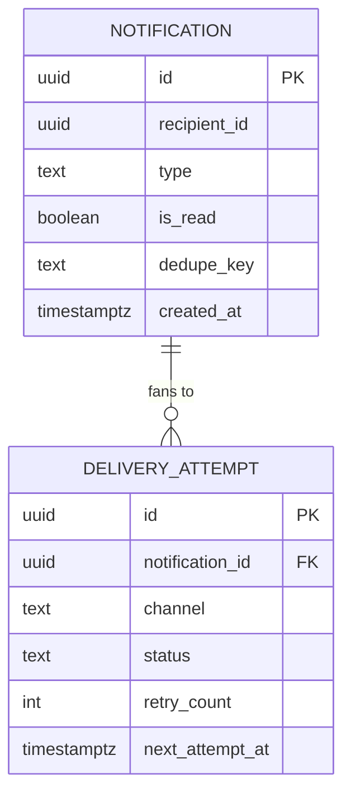
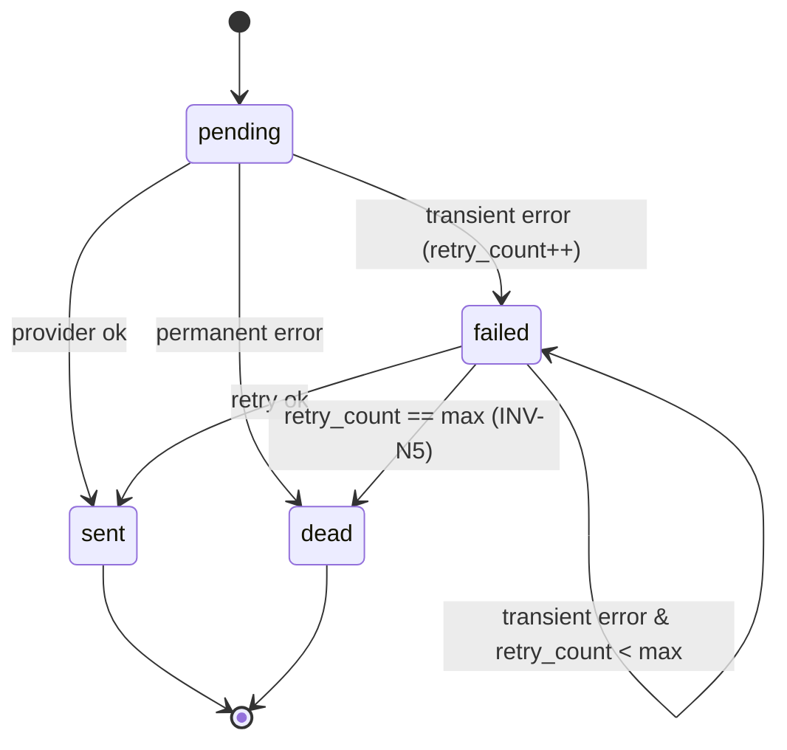

# Architecture Design Doc — `notifications` (`Notifications`)

> **Status:** Stable · **PRD source:** `BACKEND-PRD.md` §6.10 · **Owning context:** `notifications` ·
> **Package root:** `org.shakvilla.beatzmedia.notifications`
>
> This ADD is consumed by Claude Code agents. It is the design contract for the module: an agent
> reads it, plans the listed work units, implements within the stated ports/adapters, writes the
> tests, and opens a PR. Do not invent endpoints or fields not traceable to the PRD / `API-CONTRACT.md`.

## 1. Purpose & responsibilities

The `notifications` module owns the **per-user in-app notification feed** (unread counts + read-state
mutations) and the **outbound multi-channel delivery** of those notifications to email/SMS. It is
populated **reactively** by canonical domain events from other modules (commerce, payments, catalog,
podcasts, identity, admin) — it never originates business facts. It does **not** own the source
aggregates, the user contact details / opt-in preferences (those live in `identity`'s
`fan_settings.notif_json`, read via that module's port), nor the SMTP/SMS infrastructure (it depends on
`Mailer`/`SmsSender` ports). Surfaces: **Fan** + **Creator** header bell and `/notifications` inbox.
Covered HLFRs: **HLFR-NOTIF-01 [DERIVED]** (in-app feed + read state), **HLFR-NOTIF-02 [PROPOSAL]**
(email/SMS fan-out with retry + dev capture).

## 2. Context & dependencies (C4 component view)



**Dependency rule.** Hexagonal, inward-only (ArchUnit-enforced). The module **consumes** domain events
from other modules via CDI `@Observes` (async, `AFTER_SUCCESS`) and makes **one synchronous** inbound
port call — `identity`'s FanSettings/contact port — to resolve opt-in + contact channels. It publishes
**no** events. Persistence is never shared: it owns only `notification` and `delivery_attempt` and
references foreign aggregates (accounts, orders) by **id**.

## 3. Domain model

| Name | Kind | Key fields | Notes |
|---|---|---|---|
| `Notification` | Aggregate root | `id`, `recipientId`, `type`, `title`, `body`, `to?`, `read`, `createdAt`, `dedupeKey?` | One feed row; read-state mutated via `markRead()`. |
| `DeliveryAttempt` | Entity (child) | `id`, `notificationId`, `channel`, `status`, `retryCount`, `lastError?`, `createdAt`, `nextAttemptAt?` | One row per channel send attempt; drives retry/backoff. |
| `NotificationType` | Enum (VO) | — | `sale\|tip\|follower\|payout\|release\|system`. |
| `Channel` | Enum (VO) | — | `email\|sms`. |
| `DeliveryStatus` | Enum (VO) | — | `pending\|sent\|failed\|dead`. |
| `RecipientId` | VO (typed id) | `value` | Wraps `AccountId`; the feed owner. |

**Enums (verbatim from frontend `NotificationType` / PRD §6.10):**
`type ∈ { sale, tip, follower, payout, release, system }`.

**Invariants.**
- **INV-N1** — A `Notification` has exactly one `recipientId`; read/mutation requires `sub == recipientId`
  else `404` (existence hidden).
- **INV-N2** — `markRead()` is idempotent: marking an already-read row is a no-op success.
- **INV-N3** — A channel dispatches only if `identity` reports opt-in **and** a usable contact exists;
  else no `DeliveryAttempt`.
- **INV-N4** — Event handling is idempotent, keyed by `dedupeKey` (event id + recipient + type);
  replay creates no duplicate.
- **INV-N5** — `retryCount` only increases; an attempt at `maxRetries` → `dead`, never retried again.



## 4. Application layer (ports)

### 4.1 Input ports (use cases)

```java
public interface ListNotificationsUseCase {
    NotificationFeed list(AccountId caller, PageRequest page);
}

public interface MarkAllReadUseCase {
    void markAllRead(AccountId caller);
}

public interface MarkOneReadUseCase {
    void markOneRead(AccountId caller, NotificationId id);
}

/** Internal: invoked only by in-module event observers, never exposed over REST. */
public interface NotifyUseCase {
    NotificationId notify(NotifyCommand command);
}
```

| Port | Trigger | Authorization | Idempotency | Emits | LLFR |
|---|---|---|---|---|---|
| `ListNotificationsUseCase` | `GET /v1/me/notifications` | any authenticated user; rows filtered to `caller` | read-only | — | NOTIF-01.1 |
| `MarkAllReadUseCase` | `POST /v1/me/notifications/read` | any user; affects only own rows | yes — re-run is no-op | — | NOTIF-01.2 |
| `MarkOneReadUseCase` | `POST /v1/me/notifications/:id/read` | owner only; non-owner → `404` | yes — already-read is no-op | — | NOTIF-01.3 |
| `NotifyUseCase` | domain event observed | system (internal) | yes — keyed by `dedupeKey` (INV-N4) | — | NOTIF-02.1 |

**Event observers** (in `adapter.in.events`, async `AFTER_SUCCESS`, each maps event → `NotifyCommand`
then calls `NotifyUseCase`; each idempotent and resilient to redelivery):

```java
public class NotificationEventObservers {
    void onSale(@ObservesAsync SaleCompleted e);          // type=sale     -> seller
    void onTip(@ObservesAsync TipReceived e);             // type=tip      -> creator
    void onFollower(@ObservesAsync AccountFollowed e);    // type=follower -> followee
    void onPayout(@ObservesAsync PayoutSent e);           // type=payout   -> creator
    void onReleaseApproved(@ObservesAsync ReleaseApproved e); // type=release -> owner
    void onReleaseLive(@ObservesAsync ReleaseWentLive e); // type=release  -> followers (fan-out)
    void onEpisode(@ObservesAsync EpisodePublished e);    // type=release  -> followers
    void onSystem(@ObservesAsync SystemNoticeRaised e);   // type=system   -> targeted recipients
}
```

### 4.2 Output ports

```java
public interface NotificationRepository {
    Notification save(Notification notification);
    Optional<Notification> findById(NotificationId id);
    Page<Notification> findByRecipient(AccountId recipient, PageRequest page);
    long countUnread(AccountId recipient);
    int markAllReadForRecipient(AccountId recipient, Instant readAt);
    boolean existsByDedupeKey(String dedupeKey);
    DeliveryAttempt saveAttempt(DeliveryAttempt attempt);
    List<DeliveryAttempt> findDueRetries(Instant now, int limit);
}

public interface Mailer {                  // outbound email channel
    void send(EmailMessage message);       // throws TransientDeliveryException / PermanentDeliveryException
}

public interface SmsSender {               // outbound SMS channel
    void send(SmsMessage message);         // throws TransientDeliveryException / PermanentDeliveryException
}

public interface Clock {                   // kernel port (platform): deterministic time in tests
    Instant now();
}
```

| Output port | Implementing outbound adapter |
|---|---|
| `NotificationRepository` | `JpaNotificationRepository` (Panache/Hibernate; maps domain ↔ JPA entity). |
| `Mailer` | `SmtpMailer` (Quarkus Mailer over SMTP; dev → Mailpit `mail:1025`). |
| `SmsSender` | `HttpSmsSender` (dev → in-repo SMS capture stub `sms:8026`, per OQ-9; prod → provider client). |
| `Clock` | `SystemClock` from `platform` kernel. |

## 5. Adapters

### 5.1 Inbound — REST resources

| Method | Path | Auth/scope | Request DTO | Response DTO | Success | Error codes | LLFR |
|---|---|---|---|---|---|---|---|
| GET | `/v1/me/notifications` | any user (`sub`) | `?page&size` | `NotificationListResponse { items: AppNotification[], unread }` | `200` | `401` | NOTIF-01.1 |
| POST | `/v1/me/notifications/read` | any user | — | — | `204` | `401` | NOTIF-01.2 |
| POST | `/v1/me/notifications/:id/read` | owner of `:id` | path `id` | — | `204` | `401`, `404 NOT_FOUND` (non-owner/missing) | NOTIF-01.3 |

Resources are thin: `sub` from JWT → command → input port → map result. Both POSTs are **idempotent**
(re-marking is a no-op `204`). Non-owner `:id/read` returns `404` (not `403`) to hide existence. Paths/
shapes lifted from `API-CONTRACT.md` §10.

### 5.2 Outbound — persistence & integrations

- **`JpaNotificationRepository`** — owns `notification` + `delivery_attempt`; persists feed rows, counts
  unread, bulk-marks read, dedupe lookups, due-retry fetch. Domain carries no ORM annotations.
- **`SmtpMailer` / `HttpSmsSender`** — translate `EmailMessage`/`SmsMessage` to provider calls; classify
  failures `TransientDeliveryException` (retry) vs `PermanentDeliveryException` (→`dead`). Dev: email →
  Mailpit, SMS → in-repo stub (OQ-9).
- **Identity dependency** — synchronous call to `identity`'s FanSettings/contact port for opt-in +
  email/phone; no cross-module FK or table read.
- **Transaction boundary** — `@Transactional` per app service. `NotifyUseCase` commits `notification` +
  initial `pending` attempts in one TX; the send + status update + retry scheduling run **post-commit**,
  so a provider outage never rolls back the in-app notification.

## 6. DTOs & API shapes

**`AppNotification`** (traceable to `Frontend/src/features/notifications/notifications-context.tsx`):

| Field | Type | Notes |
|---|---|---|
| `id` | `string` (ID) | Opaque notification id. |
| `type` | `NotificationType` | `sale \| tip \| follower \| payout \| release \| system`. |
| `title` | `string` | Short headline (e.g. "New sale"). |
| `body` | `string` | Detail line; may include money rendered as `₵x.yy` (server-formatted display text). |
| `time` | `string` | Relative label (e.g. "2h ago"). **Derived server-side** from `created_at` at read time; the wire value is a string per the frontend contract. |
| `read` | `boolean` | Read state for this recipient. |
| `to` | `string?` | Optional in-app destination route (e.g. `/studio/payouts`). |

**`NotificationListResponse`** `{ items: AppNotification[], unread: number }` — `unread` = count of
`read == false` for the caller (full total, not the page). Pagination `?page&size` (default 20, max
100). Money inside `body` is pre-rendered display text (no `{ amount, currency }` object); `time` is the
only temporal field on the wire.

## 7. Persistence schema & migrations

```sql
CREATE TABLE notification (
    id            UUID PRIMARY KEY,
    recipient_id  UUID NOT NULL,
    type          TEXT NOT NULL CHECK (type IN ('sale','tip','follower','payout','release','system')),
    title         TEXT NOT NULL,
    body          TEXT NOT NULL,
    to_route      TEXT,
    is_read       BOOLEAN NOT NULL DEFAULT FALSE,
    dedupe_key    TEXT,
    created_at    TIMESTAMPTZ NOT NULL DEFAULT now(),
    read_at       TIMESTAMPTZ
);
CREATE INDEX idx_notification_recipient_created ON notification (recipient_id, created_at DESC);
CREATE INDEX idx_notification_recipient_unread  ON notification (recipient_id) WHERE is_read = FALSE;
CREATE UNIQUE INDEX uq_notification_dedupe      ON notification (dedupe_key) WHERE dedupe_key IS NOT NULL;

CREATE TABLE delivery_attempt (
    id               UUID PRIMARY KEY,
    notification_id  UUID NOT NULL REFERENCES notification (id) ON DELETE CASCADE,
    channel          TEXT NOT NULL CHECK (channel IN ('email','sms')),
    status           TEXT NOT NULL CHECK (status IN ('pending','sent','failed','dead')),
    retry_count      INT  NOT NULL DEFAULT 0,
    last_error       TEXT,
    next_attempt_at  TIMESTAMPTZ,
    created_at       TIMESTAMPTZ NOT NULL DEFAULT now(),
    updated_at       TIMESTAMPTZ NOT NULL DEFAULT now()
);
CREATE INDEX idx_delivery_attempt_notification ON delivery_attempt (notification_id);
CREATE INDEX idx_delivery_attempt_due ON delivery_attempt (next_attempt_at)
    WHERE status IN ('pending','failed');
CREATE UNIQUE INDEX uq_delivery_attempt_channel ON delivery_attempt (notification_id, channel);
```

**Flyway migrations** (forward-only, `src/main/resources/db/migration/`):

- `V20__create_notification.sql` — `notification` table + indexes (WU-NOT-1).
- `V21__create_delivery_attempt.sql` — `delivery_attempt` table + indexes (WU-NOT-2).

`R__seed_dev_data.sql` contributes a small mixed feed for the demo recipient (dev/test only),
mirroring the frontend seed.

## 8. Key flows

```mermaid
sequenceDiagram
  autonumber
  participant SRC as Source module (commerce/payments/…)
  participant OBS as NotificationEventObservers
  participant N as NotifyUseCase
  participant ID as identity FanSettings port
  participant R as NotificationRepository
  participant D as Post-commit dispatcher
  participant M as Mailer / SmsSender

  SRC-->>OBS: event sale/tip/follower/payout/release/system [AFTER_SUCCESS]
  OBS->>N: notify(NotifyCommand{eventId, recipient, type, title, body, to?})
  N->>R: existsByDedupeKey(key)?
  alt already handled (INV-N4)
    R-->>N: true -> no-op
  else first time
    N->>R: save(Notification) + saveAttempt(pending) per opted-in channel (INV-N3)
    N->>ID: opt-in + contacts for recipient
    ID-->>N: {emailOptIn, smsOptIn, email?, phone?}
    Note over N,D: TX commits; in-app visible; dispatch runs post-commit
    D->>M: send(EmailMessage / SmsMessage)
    alt success
      M-->>D: ok -> attempt=sent
    else transient
      M-->>D: Transient -> attempt=failed, retry_count++, next_attempt_at=now+backoff
    else permanent
      M-->>D: Permanent -> attempt=dead
    end
    loop scheduled sweep
      D->>R: findDueRetries(now); re-send; maxRetries -> dead (INV-N5)
    end
  end
```

**DeliveryAttempt state machine:**



## 9. Cross-cutting hooks

- **Channel selection** — per event, derive recipient → query `identity` for `notif_json` opt-in +
  email/phone. An attempt row is created **only** for an opted-in channel with a usable contact (INV-N3);
  in-app is always created.
- **Retry with backoff** — transient send → `status=failed`, `retry_count++`,
  `next_attempt_at = now + base * 2^retry_count` (jittered, capped). A `@Scheduled` sweep picks due rows
  via `findDueRetries`. At `maxRetries` (`PlatformSettings`) → `dead`; permanent errors → `dead` directly.
- **Idempotency** — handlers side-effect-keyed by `dedupe_key` (unique partial index) so redelivery
  creates no duplicate (INV-N4); `(notification_id, channel)` unique index prevents duplicate attempts;
  mark-read POSTs naturally idempotent (INV-N2).
- **Auth/scope** — any authenticated `sub`; ownership re-checked in the application layer; non-owner/
  missing → `404`.
- **Audit (INV-10)** — feed reads/marks are self-service, not privileged → no `AuditEntry`. Admin-driven
  system broadcasts are audited by the originating `admin` module.
- **Error model** — uniform envelope; `NotificationNotFoundException` → `404 NOT_FOUND`. Provider errors
  never reach the user (async/post-commit). No PII (email/phone) in logs.
- **Dev capture** — `Mailer` → Mailpit (`mail:1025`, UI `:8025`); `SmsSender` → in-repo SMS stub
  (`sms:8026`, OQ-9); adapters profile-selected (`dev`/`test` vs `prod`).
- **Observability** — Micrometer `notifications.created{type}`, `notifications.delivery{channel,status}`,
  retry-queue gauge; OTel spans on `notify`/send/sweep, correlated by inbound **trace id**.

## 10. Work units & build order

| WU | Scope | LLFR | Output tables/ports | Depends on | Order |
|---|---|---|---|---|---|
| **WU-NOT-1** | In-app feed + read state: REST endpoints, `ListNotifications`/`MarkAllRead`/`MarkOneRead`, `Notify` (in-app only), `NotificationRepository` | NOTIF-01.1–01.3 | `notification`; `NotificationRepository` | WU-IDN-1 (identity) | 1 |
| **WU-NOT-2** | Email/SMS dispatch on events with retry + dev capture: event observers, channel selection via identity opt-in, `Mailer`/`SmsSender`, `delivery_attempt`, backoff sweep | NOTIF-02.1 | `delivery_attempt`; `Mailer`, `SmsSender` | WU-NOT-1, WU-PLT-2 | 2 |

Cross-reference PRD §8 (WU-NOT-1, WU-NOT-2 in Phase 4: surfaces & proposals).

## 11. Testing plan

**Unit (fakes — `FakeNotificationRepository`/`FakeMailer`/`FakeSmsSender`, fixed `Clock`):** mark-read
on an already-read row is a no-op success (INV-N2); replayed event ⇒ exactly one notification + one
attempt/channel (INV-N4); opted-out or contactless channel ⇒ no attempt (INV-N3); transient failure
increments `retry_count`/`next_attempt_at`, `maxRetries` ⇒ `dead` (INV-N5).

**Integration (Testcontainers Postgres + Mailpit, REST-assured):** `GET /v1/me/notifications` returns
`{ items, unread }` matching unread rows; `POST .../read` ⇒ `204`, re-POST ⇒ `204`, `unread==0`;
`POST .../:id/read` on another user's id ⇒ `404`.

**Contract:** `NotificationListResponse` / `AppNotification` validate against frontend types /
`API-CONTRACT.md` §10.

**PRD §6.10 acceptance (Given/When/Then):**
- *Given* a sale and a seller opted into email, *When* `SaleCompleted` is observed, *Then* an in-app
  `type=sale` notification exists **and** a captured email is present in Mailpit (with a
  `delivery_attempt{channel=email,status=sent}` row).
- *Given* an already-read recipient, *When* `POST .../read` is re-issued, *Then* `204` and no row
  changes (mark-read idempotency).

Coverage ≥ the gate in `sdlc/testing-strategy.md`.

## 12. Definition of done (module-specific)

Global DoD (PRD §8 / conventions §11) **plus**:

1. In-app notification is **always** persisted on a handled event, independent of opt-in or provider
   outcome (post-commit dispatch; a send failure never loses the feed row).
2. Event handlers idempotent — replaying any canonical event produces no duplicate `notification` or
   `delivery_attempt` (dedupe + unique indexes, test-verified).
3. A channel is dispatched only when `identity` opt-in is true **and** a usable contact exists.
4. Transient failures retry with bounded exponential backoff, terminating at `dead` on `maxRetries`;
   permanent failures → `dead` directly — no infinite retry.
5. Non-owner access returns `404` (existence hidden); mark-read endpoints idempotent (`204` on repeat).
6. Dev captures email→Mailpit, SMS→in-repo stub (OQ-9); no real provider calls in `dev`/`test`; no PII
   in logs.
7. `AppNotification` validates against the frontend type (contract test green); `unread` reflects the
   recipient's full unread total.

## 13. As-built (WU-NOT-1)

WU-NOT-1 delivered the in-app feed + read state + in-app notification creation. Deviations from the
sketches above (recorded per DoD; email/SMS dispatch + `delivery_attempt` remain WU-NOT-2):

- **Ids are `TEXT`, not `UUID`.** `notification.id` / `recipient_id` are `TEXT` (migration
  `V947__create_notification.sql`), mirroring `account.id` (V201). `recipient_id` is a bare account
  reference with **no cross-module FK** (hexagonal rule — notifications references accounts by id only).
- **Only `onTipReceived` is wired, synchronously.** `adapter.in.events.NotificationEventObservers`
  observes exactly one event today — payments' `TipReceived` via `@Observes(during = AFTER_SUCCESS)`
  (synchronous, keeping transactional context; not `@ObservesAsync`) → creates the creator's in-app
  "you received a tip" notification (`type=tip`, dedupe `tip:<intentId>:<creatorId>`). This closes the
  in-app half of the WU-POD-2 deferred tip-notification AC. The other producers sketched in §4.1
  (`sale`/`follower`/`payout`/`release`/`episode`/`system`) are **deferred**: their source domain
  events do not exist in the codebase yet, so no observer is wired — added as those events land.
- **`NotificationListResponse` is the full `Page<T>` envelope.** The wire shape is
  `{ items, page, size, total, unread }` (conventions §5), not `{ items, unread }` — `unread` is the
  recipient's full unread total across all pages. `AppNotificationView` = `{ id, type, title, body,
  time, read, to? }` where `time` is a server-derived relative label string (e.g. "2h ago"), never a
  raw timestamp, per the frontend `AppNotification` contract.
- **Idempotent creation (INV-N4)** = fast-path `findByDedupeKey` + the unique partial index
  `uq_notification_dedupe (dedupe_key) WHERE dedupe_key IS NOT NULL`; `JpaNotificationRepository.save`
  catches the constraint violation and re-reads the winning row so a concurrent replay still yields a
  single row and a valid id.
