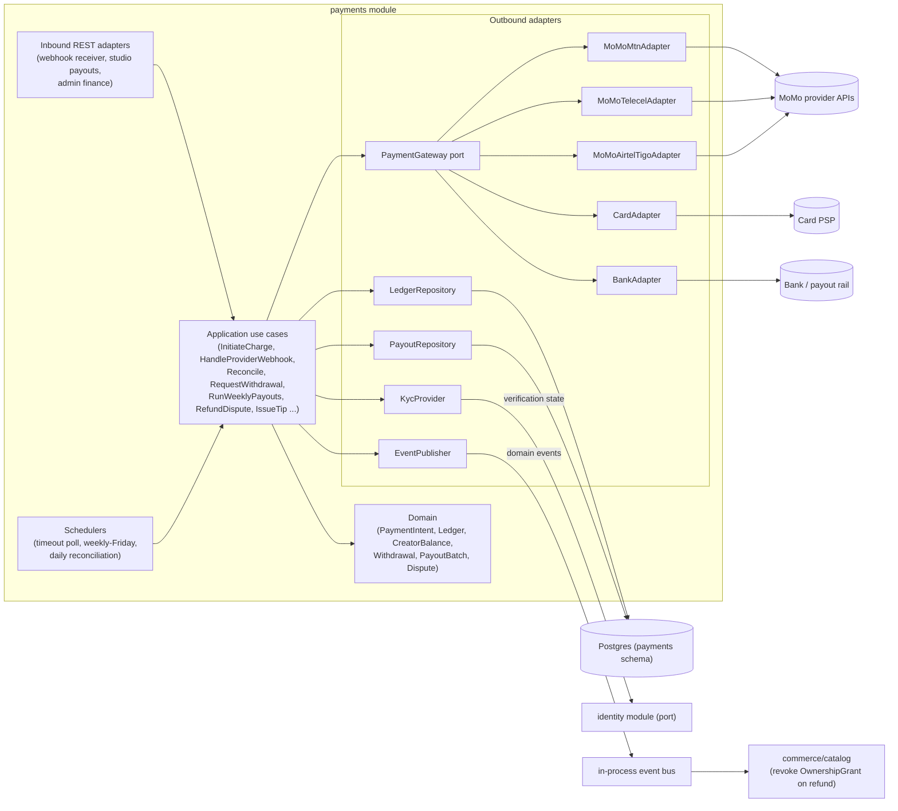
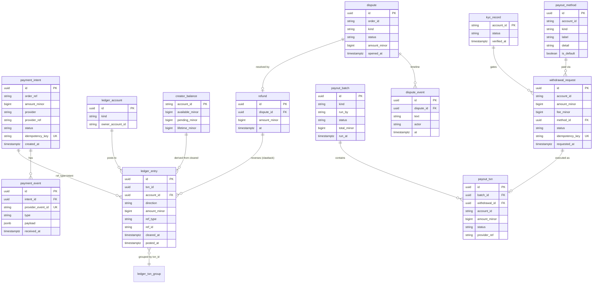
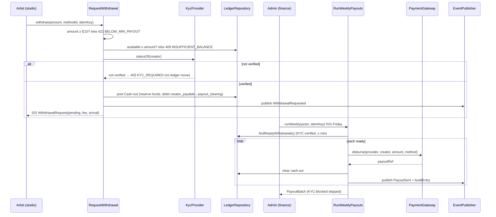
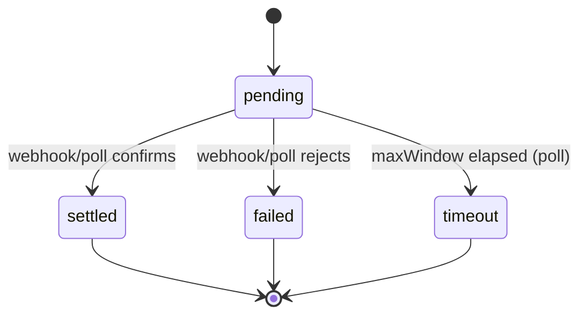
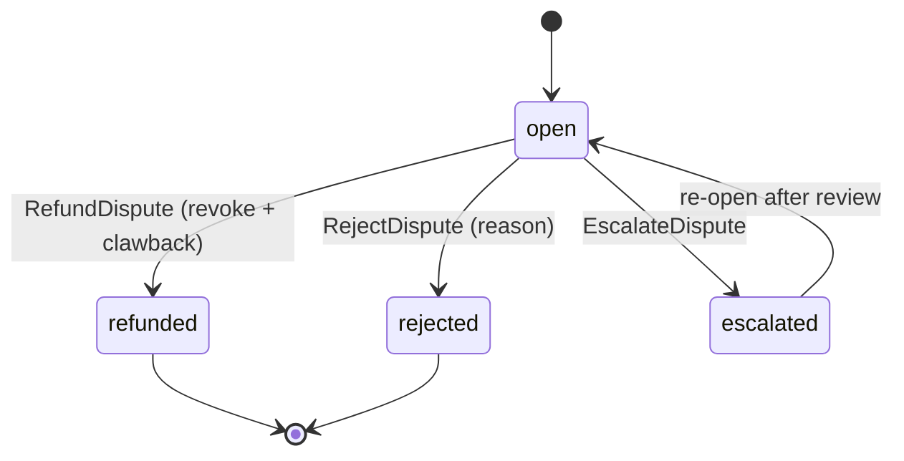

# Architecture Design Doc — `payments` (`Payments & Payouts`)

> **Status:** Proposal (largely PROPOSAL per PRD §6.6) · **PRD source:** `BACKEND-PRD.md` §6.6, §9.2 ·
> **Owning context:** `payments` · **Package root:** `org.shakvilla.beatzmedia.payments`
>
> This ADD is consumed by Claude Code agents. It is the design contract for the most critical money
> module: an agent reads it, plans the listed work units, implements within the stated ports/adapters,
> writes the tests, and opens a PR. Do not invent endpoints or fields not traceable to the PRD /
> `API-CONTRACT.md`. Every monetary movement is double-entry and balanced (INV-6); ownership is granted
> only on settlement (INV-1) and revoked on refund (INV-9).

## 1. Purpose & responsibilities

The `payments` module owns the movement of money through BeatzClik end-to-end: **payment intents** and
provider integration (MTN MoMo, Telecel/Vodafone, AirtelTigo, card, bank), **asynchronous
webhooks/callbacks** with signature verification, **idempotency** on every money-moving operation, a
**timeout poll** and **daily reconciliation** that guarantee provider↔ledger convergence, a
**double-entry ledger** with derived **creator balance accrual** (70/30 sales & royalties, 90/10 tips —
percentages from `PlatformSettings`, INV-4), **payout methods**, **KYC-gated withdrawals**, **payout
batches** (weekly Friday run + single send), **refunds / chargebacks / disputes** with ownership
revocation and ledger clawback (INV-9), and **tips** (90/10). It explicitly does **not** own ownership
grants, orders, carts, catalog, KYC document capture, or notification delivery — it *requests* grant
revocation from `commerce`/`catalog` via output ports, *consumes* KYC verification state from `identity`
via `KycProvider`, and publishes domain events for other modules to react to. Persistence is private to
this module; cross-module references are by id only. Surfaces served: **Studio** (creator payouts),
**Admin** (finance/ledger/disputes), and the public **webhook receiver**.

**HLFRs covered:** PAYMENTS-01 (charging & async webhooks & timeout & reconciliation), PAYMENTS-02
(double-entry ledger & creator balance), PAYMENTS-03 (payout methods, withdrawals, KYC gating, payout
runs), PAYMENTS-04 (refunds/chargebacks/disputes), PAYMENTS-05 (tips). Work units **WU-PAY-1..5**.

## 2. Context & dependencies (C4 component view)



**Dependency rule.** The domain is framework-free; the application layer depends only on input/output
**ports**; inbound and outbound adapters depend inward. The module never imports another module's
persistence. It **calls out** only through ports: `KycProvider` (resolves to the `identity` module's KYC
read port) and `EventPublisher`. It **publishes** `PaymentSettled`, `PaymentFailed`, `TipReceived`,
`WithdrawalRequested`, `PayoutSent`, `DisputeOpened`, `OrderRefunded`; `commerce` consumes
`PaymentSettled` (to grant ownership, INV-1) and `OrderRefunded` (to revoke grants, INV-9). The provider
adapters sit behind one `PaymentGateway` port selected per `provider`/method kind, so the application
never knows which rail it is talking to.

## 3. Domain model

| Name | Kind | Key fields | Notes |
|---|---|---|---|
| `PaymentIntent` | Aggregate root | `id`, `orderRef`, `amount` (Money), `provider`, `providerRef`, `status`, `idempotencyKey` | Lifecycle pending→settled/failed/timeout (INV-1). |
| `PaymentEvent` | Entity (child) | `id`, `intentId`, `providerEventId`, `type`, `payload`, `receivedAt` | Idempotent on `providerEventId` (UNIQUE). |
| `LedgerAccount` | Entity | `id`, `kind`, `ownerAccountId?` | Kinds: `provider_clearing`, `creator_payable`, `platform_revenue`, `payout_clearing`. |
| `LedgerEntry` | Value object (within a txn) | `id`, `txnId`, `accountId`, `direction` (DEBIT/CREDIT), `amount` (Money), `refType`, `refId`, `clearedAt?`, `postedAt` | A `txnId` groups balanced rows (INV-6). |
| `CreatorBalance` | Aggregate (read-model projection) | `accountId`, `availableMinor`, `pendingMinor`, `lifetimeMinor` | Derived from cleared ledger entries (INV-6/INV-8). |
| `PayoutMethod` | Aggregate | `id`, `accountId`, `kind` (momo/bank), `label`, `detail`, `isDefault` | Exactly one default per account. |
| `WithdrawalRequest` | Aggregate root | `id`, `accountId`, `amount`, `fee`, `methodId`, `status`, `requestedAt` | KYC-gated, floor-gated (INV-8). |
| `PayoutBatch` | Aggregate root | `id`, `kind` (weekly/single), `runBy`, `status`, `totalMinor`, `runAt` | Groups paid `PayoutTxn`. |
| `PayoutTxn` | Entity (child of batch) | `id`, `batchId`, `withdrawalId`, `accountId`, `amount`, `status`, `providerRef` | One per executed withdrawal. |
| `KycRecord` | Value object (read via port) | `accountId`, `status`, `verifiedAt?` | Resolved from `identity`; mirrored read-only here. |
| `Dispute` | Aggregate root | `id`, `orderId`, `kind`, `status`, `amount`, `openedAt` | Lifecycle open→refunded/rejected/escalated. |
| `DisputeEvent` | Entity (child) | `id`, `disputeId`, `text`, `actor`, `at` | Timeline. |
| `Refund` | Entity | `id`, `disputeId`, `amount`, `at` | Triggers clawback + revoke (INV-9). |

**Enums** (lifted verbatim from frontend / PRD §3.2):

- `PaymentIntentStatus` = `pending | settled | failed | timeout`.
- `Provider` = `mtn | telecel | airteltigo | card | bank`.
- `LedgerAccountKind` = `provider_clearing | creator_payable | platform_revenue | payout_clearing`.
- `Direction` = `DEBIT | CREDIT`.
- `PayoutType` (frontend `studio-payouts.ts`) = `Sale | Royalty | Tip | Cash-out`.
- `PayoutStatus` = `cleared | paid | pending`.
- `MethodKind` = `momo | bank`.
- `LedgerType` (frontend `admin-data.ts`) = `Sale | Royalty | Tip | Payout | Refund | Fee`.
- `KycStatus` = `none | pending | verified | rejected`.
- `WithdrawalStatus` = `pending | ready | paid | failed | kyc_pending`.
- `DisputeStatus` = `open | refunded | rejected | escalated`.

**Invariants enforced here:**

- **INV-1 (ownership-on-payment).** No value (ownership grant) is requested before a `PaymentIntent`
  reaches `settled`; `PaymentSettled` is the only trigger for grant creation downstream.
- **INV-4 (revenue split).** Every settled sale/royalty credits creator 70% / platform 30%; tips 90% /
  10%. Percentages from `PlatformSettings.platformFeePct` / `tipFeePct` (OQ-2), never hard-coded.
- **INV-6 (ledger balance).** For every `txnId`, Σ DEBIT amounts = Σ CREDIT amounts (enforced in domain
  + DB check). Creator withdrawable balance = cleared `creator_payable` credits − cleared cash-outs.
- **INV-8 (withdrawal floor & KYC).** A withdrawal requires `amount ≥ MIN_PAYOUT (₵10)`, `amount ≤`
  cleared available balance, and `KycRecord.status == verified`.
- **INV-9 (refund revokes ownership).** A completed refund reverses the originating ledger entries
  (clawback of creator credit + platform fee) and emits `OrderRefunded` so grants are revoked.
- **INV-11 (money precision).** Money stored as integer minor units; cedis decimals only at the boundary.
- **INV-12 (split sum).** Multi-creator splits subdivide the creator share per `split_entry`, summing
  ≤ 100% of the creator pool; the originating creator holds the remainder.



### Double-entry ledger design

Accounts are partitioned by **kind**. Money flows in via `provider_clearing` (what the provider owes
us, cleared on settlement), accrues to `creator_payable` (per-creator) and `platform_revenue`, and flows
out via `payout_clearing` (cash-outs to creators).

| Account kind | Owner | Normal balance | Role |
|---|---|---|---|
| `provider_clearing` | — (one per provider) | debit | Funds in transit from the rail; cleared on settlement. |
| `creator_payable` | creator account | credit | What the platform owes the creator. |
| `platform_revenue` | — (singleton) | credit | Platform's fee take. |
| `payout_clearing` | — | debit | Funds reserved/in-flight for withdrawals. |

**Example postings (each row balanced per `txn_id`, INV-6):**

*₵10 sale settled* (creator 70%, platform 30%):

| txn_id | account | direction | amount_minor | ref |
|---|---|---|---|---|
| T1 | provider_clearing | DEBIT | 1000 | intent |
| T1 | creator_payable (creator) | CREDIT | 700 | intent |
| T1 | platform_revenue | CREDIT | 300 | intent |

Σdebits = 1000 = Σcredits. Result: creator +₵7.00, platform +₵3.00.

*₵10 tip settled* (creator 90%, platform 10% — OQ-2 `tipFeePct=10`):

| txn_id | account | direction | amount_minor | ref |
|---|---|---|---|---|
| T2 | provider_clearing | DEBIT | 1000 | tip |
| T2 | creator_payable (creator) | CREDIT | 900 | tip |
| T2 | platform_revenue | CREDIT | 100 | tip |

Result: creator +₵9.00, platform +₵1.00.

*Refund reversal of the ₵10 sale* (clawback, INV-9) — every original row reversed under a new `txn_id`:

| txn_id | account | direction | amount_minor | ref |
|---|---|---|---|---|
| T3 | provider_clearing | CREDIT | 1000 | refund |
| T3 | creator_payable (creator) | DEBIT | 700 | refund |
| T3 | platform_revenue | DEBIT | 300 | refund |

Σdebits = 1000 = Σcredits. Creator credit clawed back ₵7.00, platform fee reversed ₵3.00; emits
`OrderRefunded` → grant revoked.

**Multi-creator splits (INV-12):** the 700 creator credit is subdivided per `split_entry` (e.g. 60/40 →
420 / 280) with the remainder reconciled to the originating creator so the sub-rows still sum to 700.

**Available balance derivation (INV-8):**
`available_minor = Σ(cleared creator_payable CREDIT for account) − Σ(cleared cash-out DEBIT for account)`;
`pending_minor = Σ(uncleared creator_payable CREDIT)`. `creator_balance` is a projection refreshed on
each posting/clear inside the same transaction.

## 4. Application layer (ports)

### 4.1 Input ports (use cases)

```java
public interface InitiateCharge {
    // WU-PAY-1 returns a PaymentIntentView (read-model DTO), not the aggregate, so no domain type
    // leaks across the port boundary; the aggregate stays inside the application layer. The acting
    // AccountId is threaded in so the AuditEntry records WHO acted (INV-10) and the intent is bound
    // to the authenticated caller. Order/cart-ownership authz (orderRef+amount belong to the
    // caller's own pending order) is NOT done here — the order table lands in WU-COM-2 and the
    // intended caller is the commerce checkout orchestration, which owns that check (§8a).
    PaymentIntentView charge(AccountId actor, OrderRef orderRef, Money amount, PaymentMethodRef method, IdempotencyKey key);
}
public interface HandleProviderWebhook {
    WebhookResult handle(Provider provider, String signature, byte[] rawBody);
}
public interface Reconcile {
    void pollPendingTimeouts(Duration olderThan, Duration maxWindow); // timeout/retry
    ReconciliationReport reconcileDaily(LocalDate day);               // provider vs ledger
}
public interface GetPayouts {
    PayoutsView get(AccountId creator);
}
public interface RequestWithdrawal {
    WithdrawalRequest request(AccountId creator, WithdrawCommand cmd, IdempotencyKey key);
}
public interface AddPayoutMethod {
    PayoutMethod add(AccountId creator, AddPayoutMethodCommand cmd);
}
public interface RemovePayoutMethod {
    void remove(AccountId creator, PayoutMethodId id);
}
public interface SetDefaultPayoutMethod {
    PayoutMethod setDefault(AccountId creator, PayoutMethodId id);
}
public interface RunWeeklyPayouts {
    PayoutBatch runWeekly(AdminId actor, IdempotencyKey key);
}
public interface SendSinglePayout {
    PayoutTxn send(AdminId actor, WithdrawalId id, IdempotencyKey key);
}
public interface GetLedger {
    Page<LedgerEntryView> list(LedgerType type, String q, PageRequest page);
}
public interface GetDispute {
    DisputeDetail get(DisputeId id);
}
public interface RefundDispute {
    Refund refund(AdminId actor, DisputeId id, RefundCommand cmd, IdempotencyKey key);
}
public interface RejectDispute {
    Dispute reject(AdminId actor, DisputeId id, String reason);
}
public interface EscalateDispute {
    Dispute escalate(AdminId actor, DisputeId id);
}
public interface IssueTip {
    PaymentIntent tip(AccountId fan, AccountId creator, Money amount, PaymentMethodRef method, IdempotencyKey key);
}
```

**Commands (records):**

```java
public record WithdrawCommand(Money amount, PayoutMethodId methodId) {}
public record AddPayoutMethodCommand(String label, String detail, MethodKind kind) {}
public record RefundCommand(Optional<Money> amount, String reason) {}
public record PaymentMethodRef(Provider provider, MethodKind kind, String token) {}
```

| Use case | Trigger | Auth | Idempotency | Emits | LLFR |
|---|---|---|---|---|---|
| `InitiateCharge` | commerce checkout | internal (fan via commerce) | `idempotencyKey` → same intent | — | 01.1 |
| `HandleProviderWebhook` | provider POST | public, signature-verified | `providerEventId` UNIQUE | `PaymentSettled`/`PaymentFailed` | 01.2 |
| `Reconcile` (poll) | scheduler | system | safe re-run | `PaymentSettled`/`PaymentFailed` | 01.3 |
| `Reconcile` (daily) | scheduler | system | safe re-run | discrepancy AttentionItem | 01.4 |
| `GetPayouts` | studio read | artist (own) | n/a | — | 02.2 |
| `GetLedger` | admin read | finance/super-admin | n/a | — | 02.3 |
| `RequestWithdrawal` | studio | artist (own) | `idempotencyKey` | `WithdrawalRequested` | 03.2 |
| `AddPayoutMethod`/`Remove`/`SetDefault` | studio | artist (own) | n/a | — | 03.1 |
| `RunWeeklyPayouts` | admin | finance/super-admin | `idempotencyKey` | `PayoutSent` (per txn) | 03.3 |
| `SendSinglePayout` | admin | finance/super-admin | `idempotencyKey` | `PayoutSent` | 03.4 |
| `GetDispute` | admin read | finance/super-admin | n/a | — | 04.1 |
| `RefundDispute` | admin | finance/super-admin | `idempotencyKey` | `OrderRefunded` | 04.2 |
| `RejectDispute`/`EscalateDispute` | admin | finance/super-admin | n/a | — | 04.3 |
| `IssueTip` | commerce/podcast | fan | `idempotencyKey` | `TipReceived`→`PaymentSettled` | 05 / 02.1 |

### 4.2 Output ports

```java
public interface PaymentGateway {           // selected per provider/method kind
    ChargeHandle initiate(Provider provider, OrderRef ref, Money amount, PaymentMethodRef method);
    ProviderStatus queryStatus(Provider provider, String providerRef);   // timeout poll
    boolean verifySignature(Provider provider, String signature, byte[] rawBody);
    PayoutHandle disburse(Provider provider, AccountId creator, Money amount, PayoutMethod method);
    interface ProviderClient {               // per-provider sub-interface (one impl each)
        ChargeHandle initiate(OrderRef ref, Money amount, PaymentMethodRef method);
        ProviderStatus queryStatus(String providerRef);
        boolean verifySignature(String signature, byte[] rawBody);
        PayoutHandle disburse(AccountId creator, Money amount, PayoutMethod method);
    }
}
public interface LedgerRepository {
    void postBalanced(TxnId txn, List<LedgerEntry> entries);   // throws if Σdebits != Σcredits
    void clear(TxnId txn, Instant at);
    CreatorBalance balanceOf(AccountId creator);
    Page<LedgerEntry> find(LedgerType type, String q, PageRequest page);
}
// WU-PAY-1 implements payment-intent persistence behind PaymentRepository (below); the remaining
// methods (methods/withdrawals/batches/disputes) stay under PayoutRepository as later WUs land them.
public interface PaymentRepository {                           // WU-PAY-1
    void lockForIdempotencyKey(IdempotencyKey key);            // txn-scoped advisory lock (concurrency)
    PaymentIntent save(PaymentIntent intent);
    Optional<PaymentIntent> findByIdempotencyKey(IdempotencyKey key);
}
public interface PayoutRepository {
    boolean recordEvent(PaymentEvent event);                   // false if providerEventId seen
    PayoutMethod saveMethod(PayoutMethod m);
    WithdrawalRequest saveWithdrawal(WithdrawalRequest w);
    List<WithdrawalRequest> findReadyWithdrawals();
    PayoutBatch saveBatch(PayoutBatch b);
    Dispute saveDispute(Dispute d);
    Refund saveRefund(Refund r);
}
public interface KycProvider {
    KycStatus statusOf(AccountId creator);
}
public interface EventPublisher {
    void publish(DomainEvent event);   // AFTER_SUCCESS
}
public interface Clock { Instant now(); }
public interface IdGenerator { String newId(); }
```

| Output port | Implementing outbound adapter |
|---|---|
| `PaymentGateway` + per-provider `ProviderClient` | `MoMoMtnAdapter`, `MoMoTelecelAdapter`, `MoMoAirtelTigoAdapter`, `CardAdapter`, `BankAdapter` (REST clients). |
| `LedgerRepository` | JPA ledger adapter with per-`txn_id` balance assertion + DB check. |
| `PayoutRepository` | JPA persistence adapter (intents, methods, withdrawals, batches, disputes, refunds). |
| `KycProvider` | Calls `identity` module KYC read port. |
| `EventPublisher` | In-process event bus (`AFTER_SUCCESS`). |
| `Clock` / `IdGenerator` | Kernel adapters (UTC clock; UUIDv7/ULID). |

> **WU-PAY-2 implementation notes (as-built).**
> - **Idempotency backstop is its own port.** `recordEvent(PaymentEvent)` is implemented behind a
>   dedicated `PaymentEventRepository` (not `PayoutRepository`, which stays reserved for the payout
>   WUs), via an atomic `INSERT … ON CONFLICT (provider_event_id) DO NOTHING` so a duplicate webhook
>   is a clean `false` return, never a tx-poisoning constraint violation.
> - **Reconciliation discrepancies are persisted** to a payments-owned `reconciliation_discrepancy`
>   table behind a `DiscrepancyRepository` (atomic upsert-by-natural-key). At this WU's scope the
>   ledger does not exist yet, so reconciliation compares provider truth (`queryStatus`) against the
>   intent's own status; a `PENDING` provider response is inconclusive (never a discrepancy). The
>   provider-vs-ledger-credit comparison (INV-6) completes in/after WU-PAY-3. Surfacing these as an
>   admin `AttentionItem` is a later admin-module concern; see ADR (§9 of the system architecture doc).
> - **Domain events use CDI `Event<T>`** (`PaymentSettled`/`PaymentFailed`) fired `AFTER_SUCCESS`,
>   the platform-wide convention, rather than a bespoke `EventPublisher` port.
> - **Timeout poll + reconciliation share the platform `payments.payment-recon` scheduler tick**
>   (every 30 s) via a single `ScheduledJob` bean; both operations are idempotent.

> **WU-PAY-3 implementation notes (as-built).**
> - **Double-entry ledger behind `LedgerRepository`.** `postBalanced(TxnId, List<LedgerEntry>)`
>   asserts Σ DEBIT = Σ CREDIT **in-app** (throwing `UnbalancedLedgerException`) before any DB write;
>   the DB **deferred constraint trigger** `assert_txn_balanced` (V703, `DEFERRABLE INITIALLY DEFERRED`)
>   is the durable backstop that rejects an unbalanced `txn_id` at COMMIT (INV-6). Both layers are
>   proven by integration tests. The `creator_balance` projection is refreshed **inside the same
>   transaction** on every posting/clear so it never drifts (available = Σ cleared creator_payable
>   CREDIT − Σ cleared DEBIT; pending = Σ uncleared CREDIT; lifetime = Σ all CREDIT).
> - **Split rounding rule (load-bearing, documented in `RevenueSplit`).** Platform fee = half-up
>   percentage of gross (`Money.percentage(pct)`); creator share = the **exact remainder**
>   (`gross − fee`). This guarantees `creatorShare + platformFee == gross` for **every** amount —
>   no pesewa lost or invented (INV-6/INV-11). The remainder accrues to the creator (the party the
>   platform owes). Percentages are **never** hard-coded: `platformFeePct` (sales, default 30 → creator
>   70%) and `tipFeePct` (tips, default 10 → creator 90%) come from `PlatformSettings` (INV-4; OQ-2
>   default — awaits human prod confirmation). A ₵0 fee/share row is simply omitted (only positive rows
>   posted); the txn still balances.
> - **Sale posting deferred to WU-COM-2; tips self-carry their creator (ADR-21).** `PaymentSettled`
>   carries the payer + orderRef but **not** the recipient creator. A **sale** creator mapping is
>   commerce's concern (WU-COM-2), so `LedgerPostingService.postSaleSplit` is built as a reusable
>   balanced primitive but is **not** wired to the settlement event yet — WU-COM-2 resolves the creator
>   and calls it. A **tip** encodes its recipient into the intent's opaque `OrderRef` as
>   `TIP:<creatorAccountId>` (`TipRef`); an `@Observes(AFTER_SUCCESS) PaymentSettled` subscriber
>   (`TipSettlementSubscriber`) recovers the creator and posts the 90/10 split with no cross-module
>   read. Non-tip settlements are ignored. INV-1 preserved: the encoded ref is inert until settlement.
> - **Exactly-once settlement posting (ADR-22, finding F1).** The posting runs in a dedicated
>   `TipLedgerPoster.postTip` (`REQUIRES_NEW`) and takes a DB-level exactly-once claim on the
>   `ledger_posting` UNIQUE header (`PRIMARY KEY (ref_type, ref_id)`, keyed by the intent id) BEFORE
>   writing any entry. A concurrent second settlement for the same intent (two webhooks with different
>   `provider_event_id` racing) fails on that PK, throws `DuplicatePostingException`, and its
>   `REQUIRES_NEW` txn rolls back — the creator is credited exactly once (not twice). The uniqueness is
>   on the transaction/header table, NOT on `ledger_entry` (whose 3 rows share one `(ref_type, ref_id)`).
>   The subscriber swallows the duplicate as a benign no-op; `existsPostingFor` remains only a
>   sequential-replay fast-path. Defense-in-depth: `settle` takes `SELECT … FOR UPDATE`
>   (`findByIdForUpdate`) so the settle transition itself fires once. Proven by `ConcurrentSettlementIT`
>   (fails-before / passes-after).
> - **Tips reuse the WU-PAY-1 charge mechanism.** `IssueTip` (`IssueTipService`) creates a
>   `payment_intent` exactly like a purchase — same txn-scoped advisory lock + `idempotency_key` UNIQUE
>   + SHA-256 request fingerprint — so a duplicate tip is a no-op replay (one provider charge). Exactly
>   one `AuditEntry` per tip (INV-10, actor = the fan). On settlement the ledger split posts and a
>   `TipReceived` domain event fires. Inbound surface: `POST /v1/payments/tips` (Idempotency-Key
>   required); the public `POST /podcasts/:id/tip` surface is wired by WU-POD-2 over this same use case.
> - **Reads.** `GET /v1/studio/payouts` (`GetPayouts`, artist-own) serves the `Payouts` shape from the
>   ledger projection; payout **methods** are `[]` and cash-outs absent (WU-PAY-4, never stubbed).
>   `GET /v1/admin/finance/ledger` (`GetLedger`, finance/super-admin) serves `Page<LedgerEntry>` from
>   the creator-payable + platform-revenue CREDIT lines (Sale/Tip/Fee). **Royalty lines resolve to ₵0**
>   — OQ-4 resolved to no royalty model (ADR-20); a `?type=Royalty` filter returns an empty page.
> - **As-built deviations from the ADD §7 illustrative DDL.** `ledger_account.id` / `ledger_entry.id`
>   are `TEXT` UUIDv7 (matching `payment_intent.id` from V701), **not** the `UUID` type the ADD
>   sketched; `direction` uses `TEXT + CHECK` rather than the `ledger_direction` PG enum — consistent
>   with the WU-PAY-1/2 as-built convention (additive evolution). Partial unique indexes on
>   `ledger_account` make get-or-create idempotent under concurrency.

> **WU-PAY-4 implementation notes (as-built) — payout methods + KYC-gated withdrawals + admin runs.**
> - **Schema (V704, forward-only).** `kyc_record`, `payout_method` (partial-unique **one default per
>   account**), `withdrawal_request` (`idempotency_key` UNIQUE; `amount_minor ≥ 1000` DB floor backstop),
>   `payout_batch`, `payout_txn` (**`uq_payout_per_withdrawal` UNIQUE** — the durable exactly-once payout
>   guard). Money is minor units (INV-11); enum columns are `TEXT + CHECK` (as-built convention).
> - **Withdrawal money-safety (`RequestWithdrawalService`, LLFR-PAYMENTS-03.2).** Gates run in order,
>   each a **mapped** domain error (never a 500): (1) advisory-lock idempotency → same key replays one
>   withdrawal; (2) **KYC gate** — `KycProvider.statusOf` must be `verified`, else `KYC_REQUIRED` (403),
>   **fail-closed** (no record ⇒ NONE); (3) method ownership (404); (4) **floor** `amount ≥
>   PlatformSettings.payoutMinimumMinor` (₵10 default, config-driven — INV-4/8), else `BELOW_MIN_PAYOUT`
>   (422); (5) **balance-backed under a `creator_balance` row lock** (`SELECT … FOR UPDATE` via
>   `LedgerRepository.lockBalance`) — `amount ≤ available`, else `INSUFFICIENT_BALANCE` (409). The
>   reservation posts a **balanced, cleared** txn `DEBIT creator_payable / CREDIT payout_clearing` keyed
>   exactly-once on the withdrawal id (`ledger_posting` header), which reduces `available` immediately.
>   Because available nets out reservations and the read-then-reserve is serialised by the row lock, two
>   concurrent withdrawals **cannot** both pass the balance check and overdraw — exactly one wins, the
>   loser gets 409, the balance never goes negative (proven by `ConcurrentWithdrawalIT`).
> - **Payout runs (`PayoutRunService` + `PayoutDisburser`, LLFR-PAYMENTS-03.3/03.4).** Executing a
>   withdrawal posts a **balanced** disbursement `DEBIT payout_clearing / CREDIT provider_clearing`
>   (keyed exactly-once on the withdrawal id) and inserts a `payout_txn` guarded by
>   `uq_payout_per_withdrawal`. Whichever guard trips on a retry (`DuplicatePostingException` /
>   `DuplicatePayoutException`) makes the execution a **no-op** — a re-run or repeated send **can never
>   double-debit** (INV-6, proven by `PayoutFlowIT`). The **weekly run SKIPS** KYC-unverified creators;
>   a **single send BLOCKS** on KYC with `KYC_BLOCKED` (409). Every executed payout and every method
>   mutation appends an `AuditEntry` (INV-10).
> - **Batch resilience — per-withdrawal `REQUIRES_NEW` boundary (review F1, ADR-25).** `runWeekly` does
>   **not** wrap the whole batch in one transaction (a duplicate-claim 23505 would mark the JTA tx
>   rollback-only and poison every already-processed creator — catching the Java exception does NOT
>   un-poison it; the WU-PAY-3/COM-2 F1 lesson). Instead `PayoutDisburser.disburseOne` runs **each**
>   withdrawal on its **own** `@Transactional(REQUIRES_NEW)` boundary via the CDI proxy, so a collision
>   rolls back **only that withdrawal** and the batch keeps every other creator it paid. Concurrent runs
>   **partition** the work via `SELECT … FOR UPDATE SKIP LOCKED` per withdrawal (`findWithdrawalForUpdate`)
>   — a row locked by run A is *skipped* by run B, never blocking it. `runWeekly` commits the batch
>   header first (FK target), reads lock-free candidate ids, disburses each `REQUIRES_NEW`, then
>   finalises totals. Proven by `ConcurrentPayoutRunIT` (two concurrent runs; run+send race): each
>   withdrawal paid exactly once, none lost to a poisoned batch.
> - **KYC lives in payments for now (ADR-23 sibling).** The ADD models `KycProvider` as resolving to the
>   `identity` module, but identity has no KYC surface yet, so the authoritative `kyc_record` table lives
>   in the payments band behind `KycProvider` (`JpaKycProvider`). A future identity-KYC WU can re-back the
>   port with no change to the withdrawal/payout services. No cross-module table reads.
> - **Withdrawal fee is a config-driven RAIL COST, not platform revenue (review F2, ADR-25).**
>   `PlatformSettings.withdrawalFeeMinor(kind, amount)` encodes the policy (bank flat ₵5; MoMo 1% min ₵1)
>   in one config-authoritative place; the service never inlines it. **The fee is the payment provider's
>   charge**, shown to the creator pre-confirmation, and is **NOT posted to the ledger** as a separate
>   leg: the reservation debits `creator_payable` the **gross**, the gross leaves via
>   `payout_clearing → provider_clearing`, and **no `platform_revenue` credit** is created for it
>   (contrast the sale/tip split fee, which IS platform revenue and IS posted). Held as `PlatformSettings`
>   constants (not yet a `platform_settings` column) — promote to stored columns in WU-ADM-8 if it must be
>   tunable per-environment; flagged as a documented default awaiting production confirmation.
> - **Removing a referenced payout method → mapped 409, not a 500 (review F-NEW-1).**
>   `PayoutMethodService.remove` PRE-CHECKS `PayoutRepository.existsWithdrawalForMethod` (any
>   withdrawal, any status — including already-`paid`) and throws `PayoutMethodInUseException` →
>   `PAYOUT_METHOD_IN_USE` (409). The `withdrawal_request.method_id` FK is `ON DELETE RESTRICT` (V704),
>   so a raw delete would surface an opaque Postgres FK-violation 500; a `PersistenceException`/23503
>   backstop translates a concurrent-insert race to the same 409. Ownership scoping is preserved (a
>   non-owner still gets 404). Proven by `PayoutMethodServiceTest` (in-use → 409, unreferenced →
>   deletes) and `PayoutRestIT` (DELETE of a withdrawn-against method → 409 over HTTP).
> - **Inbound surfaces.** `POST /v1/studio/payouts/withdraw` (artist, Idempotency-Key required);
>   `POST/DELETE /v1/studio/payout-methods` + `PATCH …/:id/default` (artist, ownership-scoped); admin
>   `GET /v1/admin/finance/payouts` (pending: `ready | kyc_pending`), `POST …/run-weekly`, `POST
>   …/:id/send` — all `@RolesAllowed({finance, super-admin})`. `GET /v1/studio/payouts` now returns the
>   creator's real payout methods.
>
> **Human gates flagged (OQ-2 / OQ-4) — DEFAULTS APPLIED, awaiting production sign-off.**
> - **OQ-2 (fees).** `tipFeePct` (10 → creator 90%) and the **withdrawal-fee policy** (bank ₵5 / MoMo 1%
>   min ₵1, treated as a **rail-side cost, not platform revenue** — F2/ADR-25) are config-driven
>   defaults, **not** yet human-confirmed for production. Surface in `/status`.
> - **OQ-4 (royalty model).** No royalty model (ADR-20): `PayoutsView.bySource.royalties` and any
>   `Royalty` ledger line resolve to ₵0. Config-driven default pending human confirmation.

> **WU-PAY-5 implementation notes (as-built) — refunds / chargebacks / disputes + revoke + clawback.**
> - **Schema (V705, forward-only).** `dispute` (`order_ref` + `payment_intent_id` clawback anchor +
>   `is_chargeback` + `provider_case_id` partial-UNIQUE `uq_dispute_provider_case` for chargeback
>   re-delivery idempotency), `dispute_event` (timeline), `refund` (`uq_refund_per_dispute` UNIQUE — one
>   refund per dispute; `clawback_txn_id` trace). Ids UUIDv7 `TEXT`; enum columns `TEXT + CHECK`.
> - **Refund = revoke (via EVENT) + balanced clawback (INV-9).** `RefundDispute` (admin, finance/
>   super-admin, `Idempotency-Key` required) transitions the dispute `open → refunded`, posts a
>   BALANCED ledger reversal of the ORIGINAL sale/tip split, and emits `OrderRefunded`. Commerce's
>   `OrderRefundedSubscriber` (`AFTER_SUCCESS`) → `RevokeOwnershipService` (`REQUIRES_NEW`) revokes the
>   `ownership_grant` rows for the order (album/season → ALL constituent tracks/episodes, mirroring the
>   INV-2 grant expansion). Payments NEVER touches commerce's ownership tables — the order reference
>   travels on the event; commerce owns the revoke.
> - **Clawback reversal (`LedgerRepository.postRefundReversal`).** Reads the original settlement legs
>   (ref_type `intent`/`tip`, incl. per-creator `<intentId>:<creatorId>` sub-postings) and posts a
>   PROPORTIONAL, rounding-safe reversal keyed exactly-once on `("refund", refundId)`:
>   - **buyer/clearing CREDIT** = the refunded amount (clamped to the split gross — an order-total refund
>     exceeds the split because the flat service fee has no split leg);
>   - **platform-revenue DEBIT** = the half-up proportional fee share (`round(refund·fee/gross)`);
>   - **creator-payable DEBIT(s)** = the remaining `refund − feeReversal`, distributed across creators by
>     the **running-remainder (decreasing-denominator / largest-remainder)** rule: each creator's portion
>     is the half-up share of the REMAINING budget over the REMAINING creator total, then both shrink
>     (`portion = round(remainingBudget·share/remainingCreatorTotal); remainingBudget -= portion;
>     remainingCreatorTotal -= share`). This guarantees every portion is ≥ 0 and the portions sum EXACTLY
>     to the creator-side total (the final creator's portion is `remainingBudget` by construction) — no
>     negative "last-creator remainder" that a naive independent-rounding split could produce (which
>     would drop a negative leg and unbalance the txn, review F1-residual).
>
>   Σ DEBIT = Σ CREDIT (INV-6) for single- and multi-creator, full and partial. A FULL refund reverses
>   exactly the original legs. Reversal rows post already-cleared, so the creator's projected available
>   reflects the clawback at once. The JPA adapter and the test `FakeLedgerRepository` run the identical
>   algorithm (kept in lockstep).
> - **Negative balance on already-withdrawn (modelled, not skipped).** The `creator_balance` projection
>   is a signed sum, so a clawback of a credit the creator already withdrew drives available NEGATIVE
>   (recovery owed) rather than silently skipping — proven by `RefundReversalMathTest` and
>   `RefundDisputeIT.refundAfterCreatorWithdrew_drivesBalanceNegative_owed`.
> - **Chargebacks via the WU-PAY-2 signature-verified webhook (no client money endpoint).**
>   `chargeback`/`chargeback_lost`/`chargeback_won` statuses route to `HandleChargebackService` (a
>   non-transactional coordinator over `REQUIRES_NEW` steps). OPEN opens a dispute keyed on the provider
>   case id; **LOST forces refund + clawback + revocation** (via the same exactly-once poster) and
>   OVERRIDES an admin `escalated` state (`Dispute.forceRefundedFromChargeback`, F2); WON rejects (no
>   money). Admin (finance/super-admin) adjudicates `GET`/`refund`/`reject`/`escalate`.
> - **Exactly-once + concurrency (F1 lesson).** The refund clawback + `OrderRefunded` emission run in a
>   dedicated `RefundClawbackPoster.postRefund` (`REQUIRES_NEW`) that takes the dispute row `FOR UPDATE`
>   INSIDE its own tx (NOT across the boundary — that self-deadlocks) plus the `ledger_posting` +
>   `uq_refund_per_dispute` exactly-once claims. A re-delivered refund/chargeback event, or two
>   concurrent refunds of the same dispute, yield exactly ONE clawback and ONE revocation — proven by
>   `RefundDisputeIT.twoConcurrentRefunds_ofSameDispute_clawBackExactlyOnce` and
>   `redeliveredChargebackLost_clawsBackAndRevokesExactlyOnce`. Money-POST idempotency-key advisory lock
>   on the admin refund (`DisputeRepository.lockForIdempotencyKey`) serialises same-key retries.
> - **Audit (INV-10).** Every refund/reject/escalate appends exactly one `AuditEntry`; the refund audit
>   logs the amount. Commerce audits the revocation.

> **WU-ADM-5 implementation notes (as-built) — admin finance overview (LLFR-ADMIN-05.1).**
> - **Only the overview was outstanding.** The finance *action* endpoints under `/v1/admin/finance/*`
>   (payout runs 03.3/03.4, ledger 02.3, dispute adjudication 04.*) were already delivered by
>   WU-PAY-3/4/5. WU-ADM-5 adds the one missing surface: `GET /v1/admin/finance?range=24h|7d|30d`
>   (`GetFinanceOverview` → `AdminFinanceOverviewResource`, finance/super-admin), returning the frontend
>   `Finance` shape `{ kpis, pendingPayouts, providerMix, disputes }`. Read-only; nothing audited.
> - **Lives in `payments`, not `admin` (ADR-26).** The admin ADD §4.3 originally sketched a
>   `PaymentsFinancePort` + `GetFinanceOverviewUseCase` *inside* the admin module wrapping payments.
>   That wrapper was never built: WU-PAY-3/4/5 placed the sibling `/admin/finance/*` resources directly
>   in `payments`, and this ADD's §5.1 table already lists `GET /v1/admin/finance → Finance` here. The
>   overview follows that as-built precedent (one module owns the whole finance surface). See ADR-26.
> - **Money convention (divergs from the other payments endpoints).** The admin dashboard reads money as
>   **bare decimal-cedis numbers**, NOT the `{ amount, currency }` envelope — the frontend renders
>   `₵${n.toLocaleString()}` over a plain `number` (`getFinance()` in `admin-data.ts`). `FinanceOverviewView`
>   serialises `gmvMtd`/`platformFee`/`payoutsDue`/`momoFloat` and each payout/dispute `amount` as bare
>   `BigDecimal` cedis, matching the WU-ADM-1 `AdminOverviewView` precedent. (The standalone
>   `/admin/finance/payouts` + `/ledger` endpoints keep the envelope; the two surfaces have distinct
>   frontend consumers.)
> - **Category A (real).** `gmvMtd` (GMV = Σ creator-payable + platform-revenue CREDIT of `intent`
>   sale postings in the trailing window), `platformFee` (Σ platform-revenue CREDIT), `feeTakePct`
>   (`PlatformSettings.platformFeePct`), `gmvDelta` (integer % change vs the immediately-preceding window
>   of equal length) — via the new `LedgerRepository.financeSince(since, until)` aggregate;
>   `payoutsDue`/`payoutsArtists`/`pendingPayouts` (reuse of `ListPendingPayouts`, summed over all payable
>   withdrawals + distinct artist count); open `disputes` (new `DisputeRepository.findOpen(limit)`, ≤20,
>   newest-first).
> - **Category B (honest-empty — same precedent as WU-ADM-1's health payload).** `momoFloat` is `0`
>   (no provider-float/treasury feed exists) and `providerMix` is `[]` (no payment-provider volume
>   analytics subsystem exists). Both are documented carryovers — promote when a provider-balance/
>   analytics source lands.
> - **GMV is sales-only; refunds are not netted (carryover).** `financeSince` sums `ref_type='intent'`
>   legs only — tips (`'tip'`) are excluded (GMV = merchandise value) and refund reversals (`'refund'`)
>   do NOT reduce GMV/fee for the window. Net-of-refunds GMV is a future refinement (needs a signed
>   refund aggregate over the same window).
> - **Range → 422.** `?range=` parses via `FinanceRange.fromWire` (payments-owned enum, so `payments`
>   stays independent of `admin.domain.AdminRange`); an unknown token throws `payments.domain
>   .InvalidRangeException` → 422 `INVALID_RANGE` (mirrors the studio range parser, WU-STU-3). Blank
>   defaults to `7d`.

## 5. Adapters

### 5.1 Inbound — REST resources

| Method | Path | Auth/scope | Request DTO | Response DTO | Success | Error codes | LLFR |
|---|---|---|---|---|---|---|---|
| POST | `/v1/payments/intents` | authenticated (fan / internal commerce); `Idempotency-Key` | `{ orderRef, amount: Money, provider, methodKind, paymentToken }` | `PaymentIntent` | 200 | 400 `MISSING_IDEMPOTENCY_KEY`, 409 `IDEMPOTENCY_KEY_CONFLICT`, 422 `VALIDATION`, 502 `PROVIDER_ERROR` | 01.1 |
| POST | `/v1/payments/webhooks/:provider` | public, **signature-verified** (`BEATZ_PAYMENT_WEBHOOK_SECRET`) | raw provider payload + signature header | — | 200 (handled), 202 (unknown ref, ignored) | 401 invalid signature | 01.2 |

> **WU-PAY-1 note.** `/v1/payments/intents` is the inbound surface for `InitiateCharge`. It is an
> internal money endpoint the commerce checkout (WU-COM-2) drives; it is exposed directly so the
> idempotency contract (§9.2) is independently testable. Every money POST **must** carry an
> `Idempotency-Key` header: same key + same request → the same intent (no second provider charge);
> same key + different request → `409 IDEMPOTENCY_KEY_CONFLICT` (matched via a SHA-256
> `request_fingerprint` over `orderRef|amount_minor|currency|provider|method_kind`, excluding the raw
> payment token so a token re-issue does not spuriously conflict). Decimal cedis → minor units
> conversion happens only at this boundary (INV-11).
>
> The resource is `@Authenticated`; the JWT subject is bound to the intent as `account_id` and used as
> the `AuditEntry` actor (INV-10 — the audit records WHO acted). **Order/cart-ownership authorization**
> (verifying `orderRef` + `amount` belong to the caller's own pending order) is **not** performed here —
> the order table lands in WU-COM-2, and per §8(a) the intended caller of `InitiateCharge` is the
> commerce **checkout** orchestration, which owns that check before calling in. Concurrent same-key
> requests are serialised by a transaction-scoped advisory lock (see §9 Idempotency) so a race cannot
> double-charge the provider or surface a 500.
| GET | `/v1/studio/payouts` | artist (own) | — | `Payouts` | 200 | 401, 403 | 02.2 |
| POST | `/v1/studio/payouts/withdraw` | artist (own); `Idempotency-Key` | `{ amount, methodId }` | `WithdrawalRequest` `{ status, fee, arrival }` | 202 | 422 `BELOW_MIN_PAYOUT`, 409 `INSUFFICIENT_BALANCE`, 403 `KYC_REQUIRED` | 03.2 |
| POST | `/v1/studio/payout-methods` | artist (own) | `{ label, detail, kind }` | `PayoutMethod` | 201 | 422 | 03.1 |
| DELETE | `/v1/studio/payout-methods/:id` | artist (own) | — | — | 204 | 409 (in-flight withdrawal), 404 | 03.1 |
| PATCH | `/v1/studio/payout-methods/:id/default` | artist (own) | — | `PayoutMethod` | 200 | 404 | 03.1 |
| GET | `/v1/admin/finance` | finance/super-admin | `?range=24h\|7d\|30d` | `Finance` | 200 | 422 `INVALID_RANGE`, 403 | ADMIN-05.1 |
| POST | `/v1/admin/finance/payouts/run-weekly` | finance/super-admin; `Idempotency-Key` | — | `PayoutBatch` | 200 | 403 | 03.3 |
| POST | `/v1/admin/finance/payouts/:id/send` | finance/super-admin; `Idempotency-Key` | — | `PayoutTxn` | 200 | 409 `KYC_BLOCKED`, 403, 404 | 03.4 |
| GET | `/v1/admin/finance/ledger` | finance/super-admin | `?type=&q=&page=` | `Page<LedgerEntry>` | 200 | 403 | 02.3 |
| GET | `/v1/admin/finance/disputes/:id` | finance/super-admin | — | `Dispute` + timeline | 200 | 403, 404 | 04.1 |
| POST | `/v1/admin/finance/disputes/:id/refund` | finance/super-admin; `Idempotency-Key` | `{ amount?, reason }` | `Dispute` | 200 | 409 `ILLEGAL_TRANSITION`, 403 | 04.2 |
| POST | `/v1/admin/finance/disputes/:id/reject` | finance/super-admin | `{ reason }` | `Dispute` | 200 | 409, 403 | 04.3 |
| POST | `/v1/admin/finance/disputes/:id/escalate` | finance/super-admin | — | `Dispute` | 200 | 409, 403 | 04.3 |

Scopes per PRD §14: **super-admin** = all; **finance** = payouts/ledger/disputes. Resources are thin
(DTO → command → input port → DTO); no business logic in resources.

### 5.2 Outbound — persistence & integrations

The JPA persistence adapter maps domain ↔ entity (domain carries no ORM annotations). The
`LedgerRepository` impl asserts Σdebits = Σcredits before flushing each `txn_id` and relies on a DB
constraint as a backstop. External clients: five `ProviderClient` REST adapters (MTN, Telecel,
AirtelTigo, card PSP, bank rail) behind `PaymentGateway`, each implementing initiate/queryStatus/
verifySignature/disburse. Transaction boundary = the use case (`@Transactional` on the application
service impl); events publish `AFTER_SUCCESS`. Webhook bodies are read **raw** (pre-deserialization) so
the signature is verified over the exact bytes.

## 6. DTOs & API shapes

Money is `{ amount: <decimal cedis>, currency: "GHS" }`; timestamps ISO-8601. Traceable to
`Frontend/src/lib/studio-payouts.ts` and `admin-data.ts`.

- **PaymentIntent** `{ id, orderRef, amount: Money, provider, providerRef, status: pending|settled|failed|timeout, createdAt }`
- **Payouts** `{ available, pending, thisMonth, thisMonthDelta, lifetime, since, earnings: { label, value }[], bySource: { sales, royalties, tips }, methods: PayoutMethod[], transactions: PayoutTxn[] }`
- **PayoutTxn** `{ id, date, source, type: Sale|Royalty|Tip|Cash-out, gross: number|null, net, status: cleared|paid|pending }`
- **PayoutMethod** `{ id, label, detail, kind: momo|bank, isDefault }`
- **WithdrawalRequest** `{ id, amount: Money, fee: Money, arrival: string, status: pending|ready|paid|failed }` (`fee` per `withdrawalFee(kind, amount)`; `arrival` per `arrivalTime(kind)`)
- **LedgerEntry** `{ id, date, type: Sale|Royalty|Tip|Payout|Refund|Fee, party, ref, amount: number }`
- **Dispute** `{ id, kind, subject, detail, amount?, opened?, status: open|refunded|rejected|escalated, timeline: { id, text, time }[] }`
- **Finance** `{ kpis: { gmvMtd, gmvDelta, platformFee, feeTakePct, payoutsDue, payoutsArtists, momoFloat }, pendingPayouts: PendingPayout[], providerMix: { name, value }[], disputes: Dispute[] }`

## 7. Persistence schema & migrations

```sql
CREATE TYPE payment_status AS ENUM ('pending','settled','failed','timeout');
CREATE TYPE ledger_direction AS ENUM ('DEBIT','CREDIT');
CREATE TYPE kyc_status AS ENUM ('none','pending','verified','rejected');
CREATE TYPE dispute_status AS ENUM ('open','refunded','rejected','escalated');

-- Implemented in V701 (WU-PAY-1). Ids are UUIDv7 strings (TEXT, matching the rest of the codebase),
-- not the UUID type; status/provider/method_kind use TEXT + CHECK rather than PG enums for additive
-- evolution. account_id, currency, method_kind, failure_reason, request_fingerprint, updated_at
-- added for WU-PAY-1's actor-binding + idempotency + failure semantics.
CREATE TABLE payment_intent (
  id                  TEXT PRIMARY KEY,
  account_id          TEXT NOT NULL,   -- authenticated principal that initiated the charge (INV-10)
  order_ref           TEXT NOT NULL,
  amount_minor        BIGINT NOT NULL CHECK (amount_minor >= 0),
  currency            TEXT NOT NULL DEFAULT 'GHS',
  provider            TEXT NOT NULL CHECK (provider IN ('mtn','telecel','airteltigo','card','bank')),
  method_kind         TEXT NOT NULL CHECK (method_kind IN ('momo','bank','card')),
  provider_ref        TEXT,
  status              TEXT NOT NULL DEFAULT 'pending'
                          CHECK (status IN ('pending','settled','failed','timeout')),
  failure_reason      TEXT,
  idempotency_key     TEXT NOT NULL,
  request_fingerprint TEXT NOT NULL,
  created_at          TIMESTAMPTZ NOT NULL DEFAULT now(),
  updated_at          TIMESTAMPTZ NOT NULL DEFAULT now(),
  CONSTRAINT uq_payment_intent_idem UNIQUE (idempotency_key)
);
CREATE INDEX idx_payment_intent_status_created ON payment_intent(status, created_at);
CREATE INDEX idx_payment_intent_order_ref ON payment_intent(order_ref);
CREATE INDEX idx_payment_intent_account ON payment_intent(account_id);

-- Implemented in V702 (WU-PAY-2). Ids are UUIDv7 TEXT (matching payment_intent.id), not UUID type.
CREATE TABLE payment_event (
  id                TEXT PRIMARY KEY,
  intent_id         TEXT NOT NULL REFERENCES payment_intent(id),
  provider_event_id TEXT NOT NULL,
  type              TEXT NOT NULL CHECK (type IN ('SETTLED','FAILED','PENDING')),
  payload           JSONB NOT NULL,
  received_at       TIMESTAMPTZ NOT NULL DEFAULT now(),
  CONSTRAINT uq_event_provider UNIQUE (provider_event_id)
);
CREATE INDEX idx_payment_event_intent ON payment_event(intent_id);

-- Implemented in V702 (WU-PAY-2). Finance risk signals from the daily reconciliation (LLFR-01.4).
-- UNIQUE (intent_id, kind, as_of_day) makes the daily job idempotent. Scoped to provider-vs-intent
-- mismatches until the ledger lands (WU-PAY-3); see the ADR in §9 of the system architecture doc.
CREATE TABLE reconciliation_discrepancy (
  id              TEXT PRIMARY KEY,
  intent_id       TEXT NOT NULL REFERENCES payment_intent(id),
  order_ref       TEXT NOT NULL,
  kind            TEXT NOT NULL
                      CHECK (kind IN ('PROVIDER_SETTLED_INTENT_NOT','PROVIDER_FAILED_INTENT_SETTLED')),
  amount_minor    BIGINT NOT NULL CHECK (amount_minor >= 0),
  provider_status TEXT NOT NULL,
  intent_status   TEXT NOT NULL,
  as_of_day       TEXT NOT NULL,   -- ISO yyyy-MM-dd reconciliation window
  detected_at     TIMESTAMPTZ NOT NULL DEFAULT now(),
  CONSTRAINT uq_recon_discrepancy UNIQUE (intent_id, kind, as_of_day)
);
CREATE INDEX idx_recon_discrepancy_day ON reconciliation_discrepancy(as_of_day);

CREATE TABLE ledger_account (
  id               UUID PRIMARY KEY,
  kind             TEXT NOT NULL,   -- provider_clearing|creator_payable|platform_revenue|payout_clearing
  owner_account_id TEXT
);
CREATE INDEX ix_ledger_account_owner ON ledger_account(owner_account_id);

CREATE TABLE ledger_entry (
  id           UUID PRIMARY KEY,
  txn_id       UUID NOT NULL,
  account_id   UUID NOT NULL REFERENCES ledger_account(id),
  direction    ledger_direction NOT NULL,
  amount_minor BIGINT NOT NULL CHECK (amount_minor > 0),
  ref_type     TEXT NOT NULL,
  ref_id       TEXT NOT NULL,
  cleared_at   TIMESTAMPTZ,
  posted_at    TIMESTAMPTZ NOT NULL DEFAULT now()
);
CREATE INDEX ix_ledger_txn ON ledger_entry(txn_id);
CREATE INDEX ix_ledger_account ON ledger_entry(account_id, cleared_at);

-- Per-txn balance backstop: signed sum per txn_id must be zero (Σdebits = Σcredits, INV-6).
-- Enforced at COMMIT via a deferred constraint trigger.
CREATE OR REPLACE FUNCTION assert_txn_balanced() RETURNS trigger AS $$
BEGIN
  IF (SELECT COALESCE(SUM(CASE WHEN direction='DEBIT' THEN amount_minor ELSE -amount_minor END),0)
        FROM ledger_entry WHERE txn_id = NEW.txn_id) <> 0 THEN
    RAISE EXCEPTION 'ledger txn % not balanced', NEW.txn_id;
  END IF;
  RETURN NULL;
END; $$ LANGUAGE plpgsql;
CREATE CONSTRAINT TRIGGER trg_ledger_balanced AFTER INSERT ON ledger_entry
  DEFERRABLE INITIALLY DEFERRED FOR EACH ROW EXECUTE FUNCTION assert_txn_balanced();

CREATE TABLE creator_balance (
  account_id     TEXT PRIMARY KEY,
  available_minor BIGINT NOT NULL DEFAULT 0,
  pending_minor   BIGINT NOT NULL DEFAULT 0,
  lifetime_minor  BIGINT NOT NULL DEFAULT 0
);

CREATE TABLE payout_method (
  id         UUID PRIMARY KEY,
  account_id TEXT NOT NULL,
  kind       TEXT NOT NULL CHECK (kind IN ('momo','bank')),
  label      TEXT NOT NULL,
  detail     TEXT NOT NULL,
  is_default BOOLEAN NOT NULL DEFAULT false
);
CREATE UNIQUE INDEX uq_default_method ON payout_method(account_id) WHERE is_default;

CREATE TABLE withdrawal_request (
  id              UUID PRIMARY KEY,
  account_id      TEXT NOT NULL,
  amount_minor    BIGINT NOT NULL CHECK (amount_minor >= 1000), -- ≥ ₵10 (INV-8)
  fee_minor       BIGINT NOT NULL CHECK (fee_minor >= 0),
  method_id       UUID NOT NULL REFERENCES payout_method(id),
  status          TEXT NOT NULL DEFAULT 'pending',
  idempotency_key TEXT NOT NULL,
  requested_at    TIMESTAMPTZ NOT NULL DEFAULT now(),
  CONSTRAINT uq_withdrawal_idem UNIQUE (idempotency_key)
);

CREATE TABLE payout_batch (
  id          UUID PRIMARY KEY,
  kind        TEXT NOT NULL CHECK (kind IN ('weekly','single')),
  run_by      TEXT NOT NULL,
  status      TEXT NOT NULL,
  total_minor BIGINT NOT NULL DEFAULT 0,
  run_at      TIMESTAMPTZ NOT NULL DEFAULT now()
);

CREATE TABLE payout_txn (
  id            UUID PRIMARY KEY,
  batch_id      UUID NOT NULL REFERENCES payout_batch(id),
  withdrawal_id UUID NOT NULL REFERENCES withdrawal_request(id),
  account_id    TEXT NOT NULL,
  amount_minor  BIGINT NOT NULL,
  status        TEXT NOT NULL,
  provider_ref  TEXT,
  CONSTRAINT uq_payout_per_withdrawal UNIQUE (withdrawal_id)
);

CREATE TABLE kyc_record (
  account_id  TEXT PRIMARY KEY,
  status      kyc_status NOT NULL DEFAULT 'none',
  verified_at TIMESTAMPTZ
);

CREATE TABLE dispute (
  id           UUID PRIMARY KEY,
  order_id     TEXT NOT NULL,
  kind         TEXT NOT NULL,
  status       dispute_status NOT NULL DEFAULT 'open',
  amount_minor BIGINT NOT NULL,
  opened_at    TIMESTAMPTZ NOT NULL DEFAULT now()
);

CREATE TABLE dispute_event (
  id         UUID PRIMARY KEY,
  dispute_id UUID NOT NULL REFERENCES dispute(id),
  text       TEXT NOT NULL,
  actor      TEXT,
  at         TIMESTAMPTZ NOT NULL DEFAULT now()
);

CREATE TABLE refund (
  id           UUID PRIMARY KEY,
  dispute_id   UUID NOT NULL REFERENCES dispute(id),
  amount_minor BIGINT NOT NULL CHECK (amount_minor > 0),
  at           TIMESTAMPTZ NOT NULL DEFAULT now()
);
```

**Flyway migration list (forward-only):**

- `V701__create_payment_intent.sql` (WU-PAY-1) — **implemented**; payments band is `V7xx`
  (data-and-migrations §4.1), not `V2x`.
- `V702__payments_payment_event.sql` (WU-PAY-2) — **implemented**; adds `payment_event` and
  `reconciliation_discrepancy`.
- `V703__payments_ledger.sql` (WU-PAY-3) — **implemented**; adds `ledger_account`, `ledger_entry`
  (with the `assert_txn_balanced` deferred constraint trigger, INV-6), the `creator_balance`
  projection, and the `ledger_posting` exactly-once header (`PRIMARY KEY (ref_type, ref_id)`, finding
  F1 / ADR-22). Ids are UUIDv7 `TEXT`; `direction` is `TEXT + CHECK` (as-built deviation from the
  ADD §7 illustrative `UUID`/enum DDL — see the WU-PAY-3 as-built note above).
- `V704__payments_payouts.sql` (payout_method, withdrawal_request, payout_batch, payout_txn, kyc_record — WU-PAY-4)
- `V705__payments_disputes.sql` (WU-PAY-5) — **implemented**; adds `dispute` (order_ref +
  payment_intent_id anchor + `is_chargeback` + `provider_case_id` partial-UNIQUE for chargeback
  idempotency), `dispute_event` (timeline), `refund` (`uq_refund_per_dispute` UNIQUE — one refund per
  dispute; `clawback_txn_id` trace). The refund clawback reuses the V703 `ledger_posting` exactly-once
  header keyed on `('refund', <refund_id>)`; ids are UUIDv7 `TEXT`, enum columns `TEXT + CHECK`
  (as-built convention).
- `R__seed_dev_data.sql` (dev only): seed `ledger_account` singletons (platform_revenue, payout_clearing, provider_clearing per provider) and sample KYC records.

## 8. Key flows

**(a) Initiate charge → provider → async webhook → PaymentSettled; with timeout/reconciliation poll.**

```mermaid
sequenceDiagram
  participant C as commerce (checkout)
  participant IC as InitiateCharge
  participant PG as PaymentGateway (provider adapter)
  participant DB as payments DB
  participant W as Webhook receiver
  participant L as LedgerRepository
  participant EV as EventPublisher
  participant S as Reconcile scheduler

  C->>IC: charge(orderRef, amount, method, idemKey) [trace-id]
  IC->>DB: findByIdempotencyKey(idemKey)
  alt key seen
    DB-->>IC: existing intent
    IC-->>C: same PaymentIntent (no new charge)
  else new
    IC->>PG: initiate(provider, ref, amount, method)
    PG-->>IC: providerRef
    IC->>DB: save intent (status=pending)
    IC-->>C: PaymentIntent(pending)
  end
  Note over W,EV: async — provider calls back
  PG-->>W: POST /v1/payments/webhooks/:provider (signed)
  W->>PG: verifySignature(sig, rawBody)
  alt invalid
    W-->>PG: 401
  else valid
    W->>DB: recordEvent(providerEventId)  %% UNIQUE
    alt duplicate event
      DB-->>W: false → 200 no-op
    else first time
      W->>DB: intent pending→settled
      W->>L: postBalanced(T, [debit clearing, credit creator 70%, credit platform 30%])
      W->>EV: publish PaymentSettled
      W-->>PG: 200
    end
  end
  Note over S: if webhook never arrives
  S->>PG: queryStatus(providerRef) for pending > N min
  PG-->>S: settled|failed|stillPending
  S->>DB: settle/fail; after maxWindow → failed(timeout)
  S->>EV: publish PaymentSettled/PaymentFailed
```

**(b) Withdrawal request (KYC gate) → admin run-weekly → PayoutSent.**



**(c) Dispute refund → ownership revoke + ledger clawback.**

```mermaid
sequenceDiagram
  participant Adm as Admin (finance)
  participant RD as RefundDispute
  participant L as LedgerRepository
  participant EV as EventPublisher
  participant CM as commerce/catalog

  Adm->>RD: refund(disputeId, {amount?, reason}, idemKey)
  RD->>RD: dispute open? else 409 ILLEGAL_TRANSITION
  RD->>L: postBalanced(T3, reverse sale: credit clearing, debit creator 70%, debit platform 30%)
  RD->>RD: save Refund; dispute open→refunded; AuditEntry
  RD->>EV: publish OrderRefunded
  EV->>CM: revoke OwnershipGrant(s) (INV-9) → track preview-gated again
  RD-->>Adm: Dispute(refunded)
```

**State machines:**





## 9. Cross-cutting hooks

- **Idempotency** is mandatory on every path that moves money: `InitiateCharge`/`IssueTip`
  (`idempotency_key` UNIQUE on `payment_intent`), `HandleProviderWebhook` (`provider_event_id` UNIQUE on
  `payment_event` — replays are no-ops), `RequestWithdrawal` (`idempotency_key` UNIQUE on
  `withdrawal_request`), `RunWeeklyPayouts`/`SendSinglePayout`/`RefundDispute` (`Idempotency-Key` header,
  one effect per key). §9.2.
  - **Concurrency (WU-PAY-1).** `InitiateCharge` takes a **transaction-scoped Postgres advisory lock**
    (`pg_advisory_xact_lock` keyed on the idempotency key) before the read→provider→save window, so two
    truly-simultaneous same-key requests serialise: only one thread ever reaches `PaymentGateway.initiate`
    (no double charge), the loser blocks then returns the winner's intent (or 409 on a different body) —
    never a raw unique-violation 500. The `idempotency_key` UNIQUE constraint remains the durable
    backstop. Idempotency is matched via a SHA-256 `request_fingerprint` over
    `orderRef|amount_minor|currency|provider|method_kind` (the raw payment token is excluded so a token
    re-issue for the same charge is not a spurious conflict).
- **Webhook signature verification** over the **raw** request bytes using `BEATZ_PAYMENT_WEBHOOK_SECRET`
  (per-provider scheme via `PaymentGateway.verifySignature`); invalid → 401; unknown/untrusted ref →
  202 (accept-and-ignore to avoid a provider retry storm).
- **Audit (INV-10):** every privileged money mutation appends exactly one `AuditEntry` — `run-weekly`,
  single `send`, `refund`, `reject`, `escalate`, and any settings change (platform fee, payout day/min).
- **Error codes:** `BELOW_MIN_PAYOUT` (422), `INSUFFICIENT_BALANCE` (409), `KYC_REQUIRED` (403),
  `KYC_BLOCKED` (409), `ILLEGAL_TRANSITION` (409), plus the kernel envelope `{ error: { code, message, field? } }`.
- **Domain events (AFTER_SUCCESS):** `PaymentSettled`, `PaymentFailed`, `TipReceived`,
  `WithdrawalRequested`, `PayoutSent`, `DisputeOpened`, `OrderRefunded` (ids + minimal snapshot, never
  JPA entities).
- **Configurability:** `platformFeePct`/`creatorSharePct`, `tipFeePct` (OQ-2), royalty accrual model
  (OQ-4 — periodic platform-funded pool, may be ₵0 initially), `payoutMinimum`, `payoutDay`,
  per-provider enable flags all come from `PlatformSettings` — never hard-coded.
- **Rate limiting** on checkout/tip/withdraw (token-bucket per account/IP) → 429 + `Retry-After`.
- **Observability:** Micrometer payment-success-rate, payout volume, reconciliation-discrepancy count,
  webhook latency; OpenTelemetry spans inbound→use case→provider/DB; correlation/trace id on every
  request; **no PII or secrets in logs**.

## 10. Work units & build order

| WU | Scope | LLFR | Owned tables | Depends on | Order |
|---|---|---|---|---|---|
| **WU-PAY-1** | `PaymentIntent` + `InitiateCharge` + idempotency; `PaymentGateway` port | 01.1 | payment_intent | WU-PLT-1 | 1 |
| **WU-PAY-2** | Provider webhooks + timeout poll + reconciliation | 01.2–01.4 | payment_event | WU-PAY-1, WU-PLT-2 | 2 |
| **WU-PAY-3** | Double-entry ledger + creator balance + split posting + tips | 02.*, 05 | ledger_account, ledger_entry, creator_balance | WU-PAY-1 | 3 |
| **WU-PAY-4** | Payout methods + KYC withdrawals + admin payout runs | 03.* | payout_method, withdrawal_request, payout_batch, payout_txn, kyc_record | WU-PAY-3, WU-IDN-4 | 4 |
| **WU-PAY-5** | Refunds/chargebacks/disputes + ownership revocation + clawback | 04.* | dispute, dispute_event, refund | WU-PAY-3, WU-COM-2 | 5 |

Cross-reference PRD §8: Phase 2 — WU-PAY-1 → WU-PAY-2, WU-PAY-3; Phase 3 — WU-PAY-4, WU-PAY-5.
`commerce` WU-COM-2 depends on WU-PAY-1/3; podcast tipping WU-POD-2 depends on WU-PAY-3.

## 11. Testing plan

**Unit (domain/use-case with fakes):** balanced-posting math (₵10 sale → 700/300; ₵10 tip → 900/100;
half-up rounding & remainder reconciliation); split subdivision (INV-12); available-balance derivation
(INV-8); state-machine transitions.

**Integration (Testcontainers Postgres, REST-assured):** the DB balance trigger rejects an unbalanced
txn; idempotency uniqueness; webhook signature verification; scheduler timeout transition.

**Contract:** responses validate against `studio-payouts.ts` (`Payouts`, `PayoutTxn`, `PayoutMethod`)
and `admin-data.ts` (`Finance`, `LedgerTxn`, `Dispute`).

**Acceptance (PRD §6.6 Given/When/Then):**

- **Idempotent double charge** — *Given* the same idempotency key twice *When* `InitiateCharge` *Then*
  exactly one provider charge and one `PaymentIntent`. (01.1)
- **Duplicate webhook** — *Given* a duplicate webhook (same `providerEventId`) *When* received *Then* the
  intent transitions at most once and exactly one `PaymentSettled` is emitted. (01.2)
- **Timeout** — *Given* a never-delivered webhook *When* the poll runs *Then* the intent eventually
  settles or fails(timeout). (01.3)
- **Sale split** — *Given* a ₵10 settled sale *Then* ledger shows creator_payable +₵7.00 and
  platform_revenue +₵3.00, balanced (Σdebits=Σcredits). (02.1)
- **KYC gating** — *Given* unverified KYC *When* withdraw *Then* 403 `KYC_REQUIRED` and **no ledger
  movement**. (03.2)
- **Below min** — *Given* a ₵5 withdrawal request *Then* 422 `BELOW_MIN_PAYOUT`. (03.2)
- **Single send blocks on KYC** — *Given* a KYC-blocked withdrawal *When* admin send *Then* 409
  `KYC_BLOCKED`. (03.4)
- **Weekly run skips blocked** — *Given* mixed-eligibility creators *Then* only KYC-verified, ≥ min are
  paid and each appends an audit entry. (03.3)
- **Refund revokes ownership** — *Given* a refunded purchase *Then* the buyer no longer owns the track
  (preview-gated again) and the creator's balance is reduced by the clawed-back share. (04.2)

**Coverage:** ≥ the gate in `sdlc/testing-strategy.md`; all money paths covered by both unit and
integration tests.

## 12. Definition of done (module-specific)

Global DoD (PRD §8 / conventions §11) **plus**:

1. **The ledger is always balanced** — every `txn_id` satisfies Σdebits = Σcredits (INV-6), enforced in
   domain and by the DB deferred constraint trigger; an integration test proves an unbalanced posting is
   rejected.
2. **No value without settlement** — no `OwnershipGrant` request (`PaymentSettled`) is emitted on
   `pending`/`failed`/`timeout` (INV-1).
3. **Payouts blocked on KYC** — withdrawals require `verified` KYC and `amount ≥ ₵10 ≤` cleared balance
   (INV-8); weekly run skips, single send returns `KYC_BLOCKED`.
4. **Refund integrity** — a refund reverses the originating entries (clawback) and emits `OrderRefunded`
   so grants are revoked (INV-9).
5. **Idempotency proven** — duplicate charge, duplicate webhook, and duplicate withdrawal/payout/refund
   keys produce exactly one effect.
6. **Audit completeness** — every payout run, single send, and refund/reject/escalate appends exactly
   one `AuditEntry` (INV-10).
7. All splits/fees sourced from `PlatformSettings` (OQ-2 tip fee, OQ-4 royalty model); none hard-coded.
