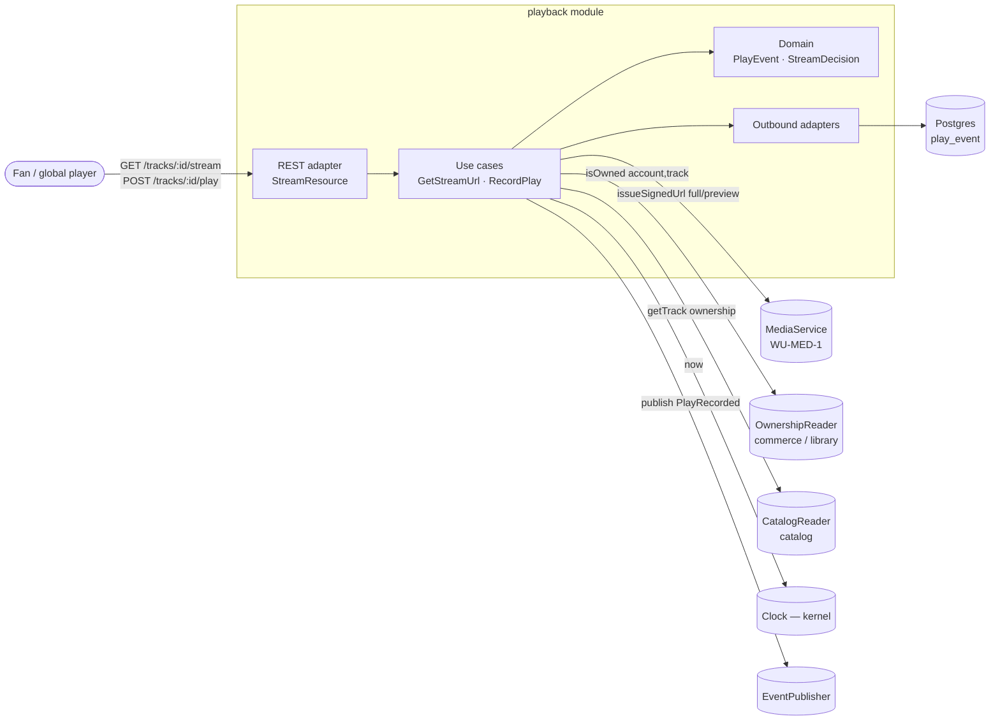
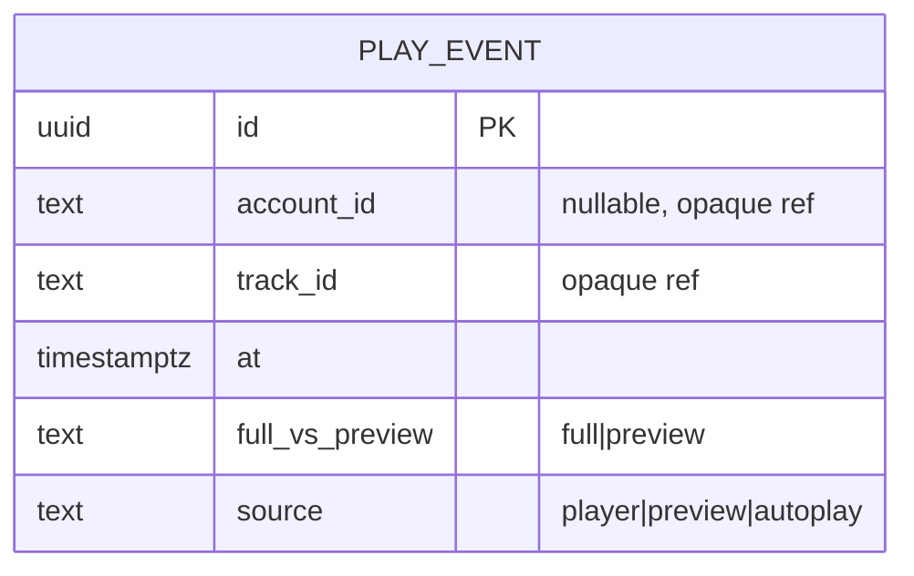
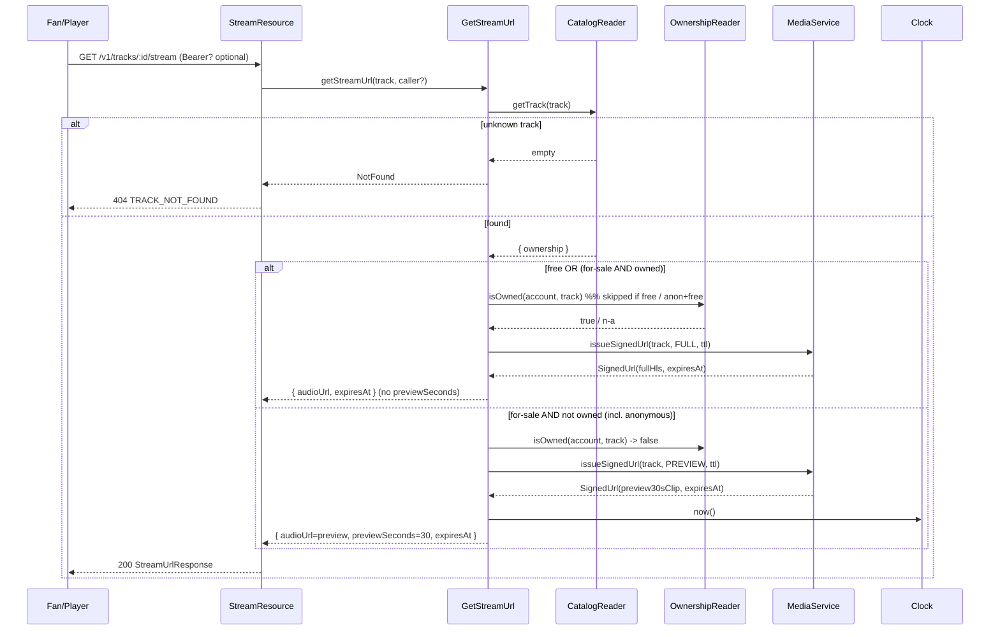
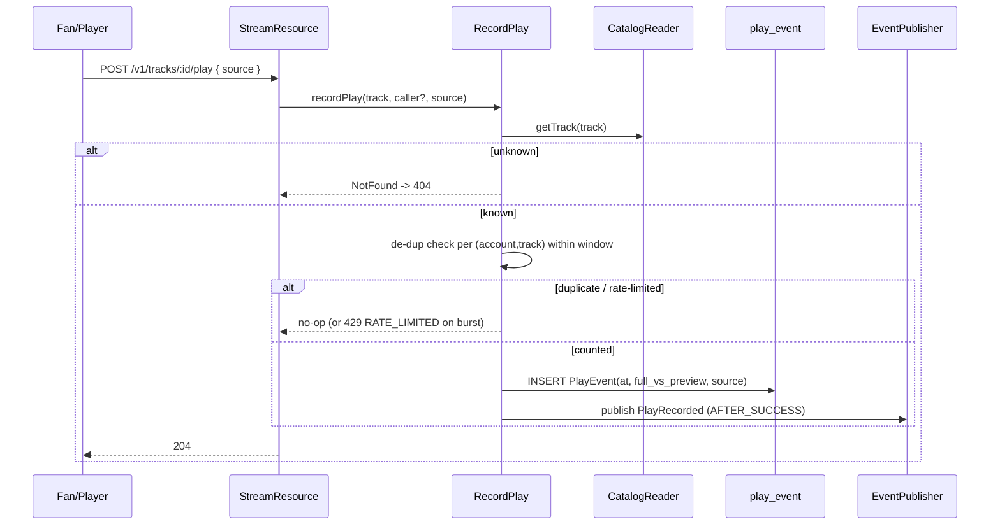

# Architecture Design Doc — `playback` (Playback & Streaming)

> **Status:** Stable · **PRD source:** `BACKEND-PRD.md` §6.3 · **Owning context:** `playback` ·
> **Package root:** `org.shakvilla.beatzmedia.playback`
>
> This ADD is consumed by Claude Code agents. It is the design contract for the module: an agent
> reads it, plans the listed work units, implements within the stated ports/adapters, writes the
> tests, and opens a PR. Do not invent endpoints or fields not traceable to the PRD / `API-CONTRACT.md`.

## 1. Purpose & responsibilities

The `playback` module issues **signed, time-boxed audio URLs** and decides **preview-vs-full** by
ownership, **server-side**, and **records plays** for the plays counter and royalty accounting. It
owns exactly one table, `play_event` (write-optimized; rolled up by `analytics`). It explicitly does
**not** own catalog data (it reads tracks via `CatalogReader`), ownership grants (it reads via
`OwnershipReader` from commerce/library), media renditions or signed-URL minting (it delegates to
`MediaService`), or analytics rollups. It serves the **Fan** surface (global player, 30s preview
gate). Covered HLFR: **HLFR-PLAYBACK-01** (ownership-aware streaming), satisfying LLFR-PLAYBACK-01.1
(get stream URL) and LLFR-PLAYBACK-01.2 (record a play), enforcing **INV-3** (non-owner preview ≤ 30s)
server-side (PRD §9.3 R8).

## 2. Context & dependencies (C4 component view)



**Dependency rule.** Hexagonal: `domain` depends on nothing; `application` depends on `domain` and on
its own output-port interfaces; adapters depend inward only (ArchUnit enforced). `playback` calls
other modules **only through output ports** — `MediaService` (media), `OwnershipReader`
(commerce/library), `CatalogReader` (catalog) — never their DB or JPA types. It owns `play_event`;
no cross-module FKs (`account_id`/`track_id` are opaque id references). It **publishes** the
`PlayRecorded` domain event (consumed by `analytics`) and consumes none.

## 3. Domain model

| Name | Kind | Key fields | Notes |
|---|---|---|---|
| `PlayEvent` | Entity (append-only) | `id`, `accountId?`, `trackId`, `at`, `fullVsPreview`, `source` | Write-optimized fact; never updated/deleted; rolled up by `analytics`. |
| `StreamDecision` | Value object | `audioUrl`, `previewSeconds?`, `expiresAt` | Result of the ownership gate; not persisted. |
| `PlaybackMode` | Enum | `FULL`, `PREVIEW` | Drives which rendition `MediaService` signs. |
| `PlaySource` | Enum | `player`, `preview`, `autoplay` | Recorded for anti-inflation analysis. |

**Ownership is read, not owned here.** The track's `ownership` (`free | for-sale`) comes from
`CatalogReader`; whether the caller owns a `for-sale` track comes from `OwnershipReader`. This module
persists no ownership state.

**Enums (verbatim from frontend / PRD §3.2).** `ownership: 'free' | 'for-sale'` (from
`Frontend/src/types`); `PREVIEW_SECONDS = 30` (from `player-context.tsx`).

**Invariants.**
- **INV-3** — for a `for-sale` track the caller does **not** own, the issued URL points at the **30s
  server-clipped** rendition and the response carries `previewSeconds = 30`. Guard: `ownership ==
  for-sale && !isOwned ⇒ mode = PREVIEW`; otherwise `mode = FULL` and `previewSeconds` is **absent**.
- Preview enforcement is **server-side**: full audio is never reachable in `PREVIEW` mode (PRD §9.3 R8).



## 4. Application layer (ports)

### 4.1 Input ports (use cases)

```java
/** Resolve ownership and return a signed, time-boxed audio URL (full or 30s preview). */
public interface GetStreamUrl {
    StreamUrlResult getStreamUrl(TrackId track, Optional<AccountId> caller);
}

/** Append a play_event (de-duplicated/anti-inflation), emit PlayRecorded. */
public interface RecordPlay {
    void recordPlay(TrackId track, Optional<AccountId> caller, PlaySource source);
}
```

- **GetStreamUrl** — *Trigger:* `GET /v1/tracks/:id/stream`. *Auth:* optional; anonymous caller =
  `Optional.empty()` (gets full for `free`, preview for `for-sale`). *Idempotency:* pure read, none.
  *Events:* none. *Satisfies:* LLFR-PLAYBACK-01.1. Unknown track → `NotFoundException` (404).
- **RecordPlay** — *Trigger:* `POST /v1/tracks/:id/play`. *Auth:* optional. *Idempotency:* de-duped
  per (account, track) within a window (§9); a suppressed duplicate is a silent no-op (still 204).
  *Events:* `PlayRecorded` (AFTER_SUCCESS) on a counted play. *Satisfies:* LLFR-PLAYBACK-01.2.

```java
public record StreamUrlResult(String audioUrl, Optional<Integer> previewSeconds, Instant expiresAt) {}
```

### 4.2 Output ports

```java
/** Mints signed, time-boxed object-store URLs; full HLS or 30s preview rendition. Adapter: media module / WU-MED-1. */
public interface MediaService {
    SignedUrl issueSignedUrl(TrackId track, PlaybackMode mode, Duration ttl);
}
public record SignedUrl(String url, Instant expiresAt) {}

/** Reads commerce/library ownership grants. Adapter: commerce-ownership client (in-process port). */
public interface OwnershipReader {
    boolean isOwned(AccountId account, TrackId track);
}

/** Reads track metadata to resolve ownership kind + existence. Adapter: catalog read client. */
public interface CatalogReader {
    Optional<TrackPlaybackInfo> getTrack(TrackId track);
}
public record TrackPlaybackInfo(TrackId id, TrackOwnership ownership) {} // ownership: FREE | FOR_SALE

/** Wall clock for expiresAt / event ts. Adapter: kernel SystemClock. */
public interface Clock { Instant now(); }

/** Publishes domain events after the transaction commits. Adapter: kernel event bus. */
public interface EventPublisher { void publish(DomainEvent event); }
```

One-liners: `MediaService` → media module's S3/HLS signer (WU-MED-1); `OwnershipReader` → commerce
ownership grant reader (WU-COM-2); `CatalogReader` → catalog track read; `Clock`/`EventPublisher` →
kernel.

## 5. Adapters

### 5.1 Inbound — REST resources

| Method | Path | Auth/scope | Request DTO | Response DTO | Success | Error codes | LLFR |
|---|---|---|---|---|---|---|---|
| GET | `/v1/tracks/:id/stream` | optional (anon → preview for `for-sale`, full for `free`) | — | `StreamUrlResponse { audioUrl, previewSeconds?, expiresAt }` | 200 | 404 `TRACK_NOT_FOUND`, 503 `MEDIA_UNAVAILABLE` | PLAYBACK-01.1 |
| POST | `/v1/tracks/:id/play` | optional | `RecordPlayRequest { source? }` | — | 204 | 404 `TRACK_NOT_FOUND`, 429 `RATE_LIMITED` (+`Retry-After`) | PLAYBACK-01.2 |

Resources are thin: extract `caller` from JWT `sub` if present, map path/body → command, call the
input port, map result → DTO. **No business logic in resources.**

### 5.2 Outbound — persistence & integrations

- **`PlayEventRepository`** (persistence adapter) — single `INSERT` per counted play; never updates.
  Maps domain `PlayEvent` ↔ JPA entity (domain carries no ORM annotations).
- **`MediaServiceClient`** — calls media's signed-URL port with `PlaybackMode` + TTL; returns
  `SignedUrl`. Translates media outages → `MEDIA_UNAVAILABLE` (503).
- **`OwnershipReaderClient`** / **`CatalogReaderClient`** — in-process port calls into commerce/
  library and catalog; resolve by id only.
- **Transaction boundary** = the use case (`@Transactional` on `RecordPlay` impl; `GetStreamUrl` is a
  read, no DB write). `PlayRecorded` is published AFTER_SUCCESS.

## 6. DTOs & API shapes

- **`StreamUrlResponse`** — `audioUrl: string` (signed URL), `previewSeconds?: number` (present **only**
  when gated; value `30`), `expiresAt: string` (ISO-8601). Traceable to `API-CONTRACT.md` §4 and
  `Frontend/src/features/player/player-context.tsx` (`previewSeconds`, `PREVIEW_SECONDS = 30`).
- **`RecordPlayRequest`** — `source?: 'player' | 'preview' | 'autoplay'` (defaults `player`).
- Durations are whole **seconds**; timestamps ISO-8601; no money in this module.

## 7. Persistence schema & migrations

```sql
-- V<n>__create_play_event.sql
CREATE TABLE play_event (
    id              UUID        PRIMARY KEY,
    account_id      TEXT        NULL,          -- opaque ref; NULL for anonymous plays
    track_id        TEXT        NOT NULL,      -- opaque ref to catalog track
    at              TIMESTAMPTZ NOT NULL,
    full_vs_preview TEXT        NOT NULL CHECK (full_vs_preview IN ('full','preview')),
    source          TEXT        NOT NULL DEFAULT 'player'
                                CHECK (source IN ('player','preview','autoplay'))
);

-- Rollup-oriented indexes (consumed by analytics WU-ANA-1):
CREATE INDEX idx_play_event_track_at        ON play_event (track_id, at);
CREATE INDEX idx_play_event_at              ON play_event (at);
CREATE INDEX idx_play_event_account_track_at ON play_event (account_id, track_id, at);
```

Append-only, write-optimized: no FKs (cross-module ids), no updates. The `(track_id, at)` and `(at)`
indexes serve plays-per-track and time-window rollups; `(account_id, track_id, at)` serves the
de-dup lookup (§9) and per-listener rollups.

**Flyway list** (`src/main/resources/db/migration/`, forward-only):
- `V<n>__create_play_event.sql`

## 8. Key flows





State machine: `play_event` is immutable (no lifecycle); `StreamDecision` is `FULL | PREVIEW`,
decided once per request.

## 9. Cross-cutting hooks

- **Server-side preview enforcement (INV-3 / PRD §9.3 R8).** In `PREVIEW` mode the URL points at the
  **30s server-clipped rendition** produced by the transcoder (WU-MED-1); full audio is never
  signed/served. The client's player timer (`PREVIEW_SECONDS = 30` in `player-context.tsx`) is
  **advisory only** — the asset itself is ≤ 30s, so a tampered client still cannot reach full audio.
- **Signed URL TTL.** TTL from `BEATZ_SIGNED_URL_TTL_SECONDS` (`PlatformSettings`, never hard-coded);
  `expiresAt = Clock.now() + ttl`, echoed in the response so the client refetches on expiry.
- **Rate-limiting / anti-inflation on play recording.** `RecordPlay` de-duplicates per
  `(account_id, track_id)` within a configurable window (e.g. one counted play per track per window);
  excess calls are silent no-ops, abusive bursts → `429 RATE_LIMITED` (+ `Retry-After`). Anonymous
  plays are keyed by client fingerprint/IP at the gateway.
- **Bot-play exclusion from popularity.** Flagged bot plays are excluded from popularity/plays inputs
  consumed by search ranking (PRD §6.13 LLFR-SEARCH-01.2) and surfaced as risk signals (§6.13/§9);
  `source` + de-dup metadata support this downstream.
- **Events.** `PlayRecorded { trackId, accountId?, at, fullVsPreview, source }` (ids + snapshot only,
  no JPA entities) published AFTER_SUCCESS; idempotent consumer in `analytics`.
- **Observability.** Trace id on every request; metrics: `playback.stream.requests{mode}`,
  `playback.play.recorded`, `playback.play.deduped`, `media.signurl.latency`. No PII/secrets in logs;
  signed URLs are not logged in full.

## 10. Work units & build order

| WU | Scope | LLFR | Owned tables | Depends on |
|---|---|---|---|---|
| **WU-PLY-1** | Stream URL (ownership-aware) + record play | PLAYBACK-01.1, PLAYBACK-01.2 | `play_event` | WU-MED-1 (media/signed URLs), WU-CAT-1 (catalog read), WU-COM-2 (ownership grants) |

Build order: after WU-MED-1 (preview/full renditions + signing) and WU-COM-2 (ownership) exist, so
the gate and signing are exercisable end-to-end (PRD §8, Phase 2: "WU-PLY-1 needs COM-2 for
ownership").

## 11. Testing plan

- **Unit (domain/use case with fakes):** `GetStreamUrl` decision matrix with fake `CatalogReader` /
  `OwnershipReader` / `MediaService` / `Clock`; `RecordPlay` de-dup logic.
- **Integration (Testcontainers Postgres + MinIO, REST-assured):** `/stream` issues a working signed
  URL; the preview asset is ≤ 30s; `/play` inserts a `play_event` and emits `PlayRecorded`.
- **Contract:** `StreamUrlResponse` / `RecordPlayRequest` validate against `API-CONTRACT.md` §4 and
  frontend types (`previewSeconds` optional, present only when gated).

**Key Given/When/Then (PRD §6.3):**
- **Given** a `for-sale` track the caller does **not** own **When** `GET /stream` **Then** `audioUrl`
  serves at most 30s and `previewSeconds = 30`.
- **Given** the caller **owns** a `for-sale` track (or it is `free`) **When** `GET /stream` **Then**
  full HLS URL and **no** `previewSeconds`.
- **Given** anonymous caller + `for-sale` track **Then** preview + `previewSeconds = 30`; + `free`
  track **Then** full URL.
- **Given** unknown track id **Then** 404 `TRACK_NOT_FOUND`.
- **Given** rapid repeated `POST /play` for the same (account, track) **Then** only de-duped/valid
  plays increment the counter (still 204; bursts → 429).

Coverage ≥ the gate in `sdlc/testing-strategy.md`.

## 12. Definition of done (module-specific)

Global DoD (PRD §8 / conventions §11) plus:
- **Preview never serves full audio**: in `PREVIEW` mode the signed URL resolves to the 30s clipped
  rendition only; a contract/integration test asserts the served asset duration ≤ 30s and that no
  full-rendition URL is reachable for a non-owner.
- `previewSeconds` is present **iff** the decision is `PREVIEW` (= 30); absent for `FULL`.
- `expiresAt` honours `BEATZ_SIGNED_URL_TTL_SECONDS`; no hard-coded TTL or preview length.
- `play_event` writes are de-duplicated per (account, track) window; `PlayRecorded` emitted only on
  counted plays; ArchUnit (hexagonal dependency rule) green.
