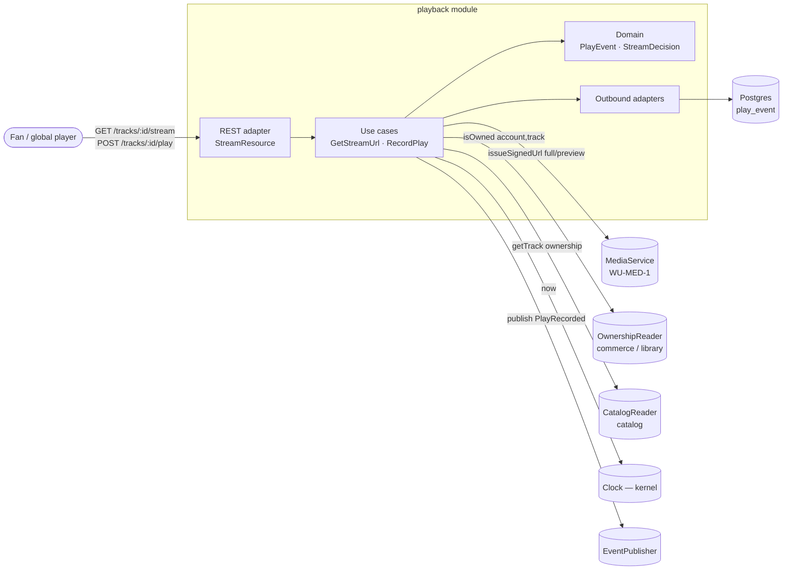
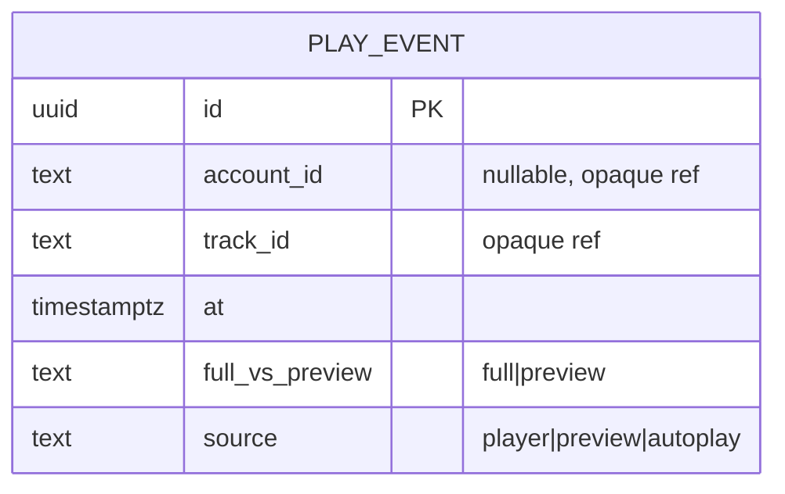
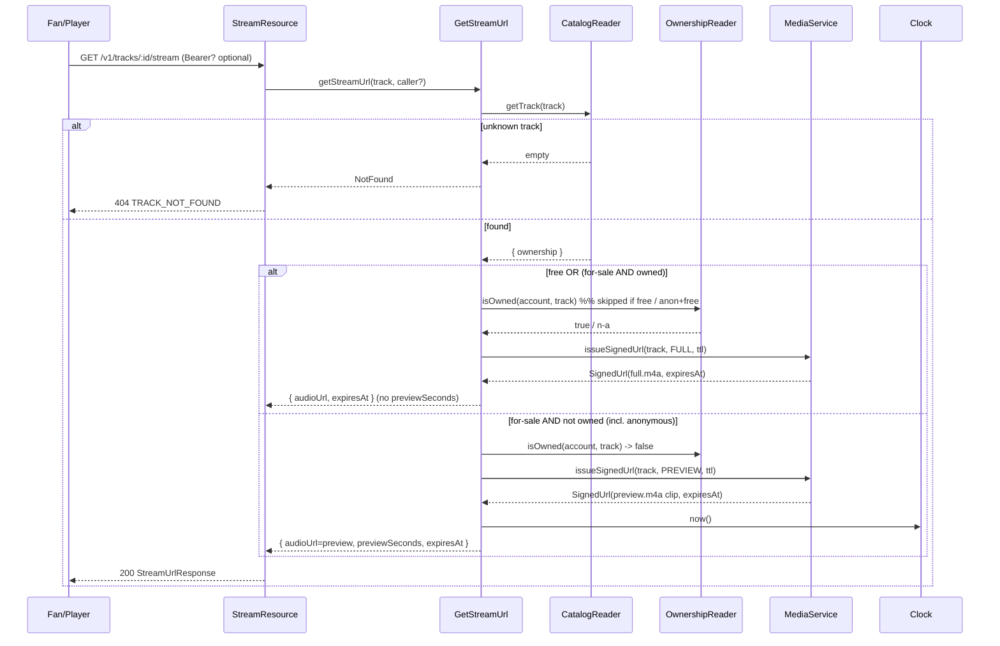
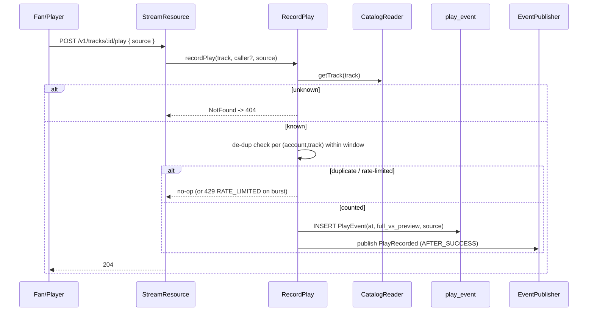

# Architecture Design Doc — `playback` (Playback & Streaming)

> **Status:** Stable · **PRD source:** `BACKEND-PRD.md` §6.3 · **Owning context:** `playback` ·
> **Package root:** `org.shakvilla.beatzmedia.playback`
>
> This ADD is consumed by Claude Code agents. It is the design contract for the module: an agent
> reads it, plans the listed work units, implements within the stated ports/adapters, writes the
> tests, and opens a PR. Do not invent endpoints or fields not traceable to the PRD / `API-CONTRACT.md`.

## 1. Purpose & responsibilities

The `playback` module issues **signed, time-boxed audio URLs** and decides **preview-vs-full** by
ownership, **server-side**, and **records plays** for the plays counter and royalty accounting. It
owns exactly one table, `play_event` (write-optimized; rolled up by `analytics`). It also serves the
**download** endpoint for buy-to-own tracks: a signed URL to the LOSSLESS (FLAC) rendition, gated on
the caller's own ownership-grant permission rather than ownership alone. It explicitly does
**not** own catalog data (it reads tracks via `CatalogReader`), ownership grants (it reads via
`OwnershipReader` from commerce/library), download permission (it reads via `DownloadPermissionReader`
from commerce), media renditions or signed-URL minting (it delegates to
`MediaService`), or analytics rollups. It serves the **Fan** surface (global player, preview
gate, library download). Covered HLFR: **HLFR-PLAYBACK-01** (ownership-aware streaming), satisfying LLFR-PLAYBACK-01.1
(get stream URL) and LLFR-PLAYBACK-01.2 (record a play), enforcing **INV-3** (non-owner gets the server-clipped preview)
server-side (PRD §9.3 R8); and the download endpoint, enforcing **INV-13** (a download is served only
when the caller's own grant permits it) server-side, exactly as INV-3.

## 2. Context & dependencies (C4 component view)


```mermaid
flowchart LR
  Fan([Fan / global player])
  subgraph playback[playback module]
    IN[REST adapter\nStreamResource]
    APP[Use cases\nGetStreamUrl · RecordPlay]
    DOM[Domain\nPlayEvent · StreamDecision]
    OUTP[Outbound adapters]
  end
  Fan -->|GET /tracks/:id/stream\nPOST /tracks/:id/play| IN
  IN --> APP --> DOM
  APP -->|issueSignedUrl full/preview| MS[(MediaService\nWU-MED-1)]
  APP -->|isOwned account,track| OWN[(OwnershipReader\ncommerce / library)]
  APP -->|getTrack ownership| CAT[(CatalogReader\ncatalog)]
  APP -->|now| CLK[(Clock — kernel)]
  APP -->|publish PlayRecorded| EVT[(EventPublisher)]
  APP --> OUTP
  OUTP --> DB[(Postgres\nplay_event)]
```

**Dependency rule.** Hexagonal: `domain` depends on nothing; `application` depends on `domain` and on
its own output-port interfaces; adapters depend inward only (ArchUnit enforced). `playback` calls
other modules **only through output ports** — `MediaService` (media), `OwnershipReader`
(commerce/library), `CatalogReader` (catalog), `DownloadPermissionReader` (commerce) — never their DB
or JPA types. It owns `play_event`;
no cross-module FKs (`account_id`/`track_id` are opaque id references). It **publishes** the
`PlayRecorded` domain event (consumed by `analytics`) and consumes none.

## 3. Domain model

| Name | Kind | Key fields | Notes |
|---|---|---|---|
| `PlayEvent` | Entity (append-only) | `id`, `accountId?`, `trackId`, `at`, `fullVsPreview`, `source` | Write-optimized fact; never updated/deleted; rolled up by `analytics`. |
| `StreamDecision` | Value object | `audioUrl`, `previewSeconds?`, `expiresAt` | Result of the ownership gate; not persisted. |
| `PlaybackMode` | Enum | `FULL`, `PREVIEW` | Drives which rendition `MediaService` signs. |
| `PlaySource` | Enum | `player`, `preview`, `autoplay` | Recorded for anti-inflation analysis. |

**Ownership is read, not owned here.** The track's `ownership` (`free | for-sale`) comes from
`CatalogReader`; whether the caller owns a `for-sale` track comes from `OwnershipReader`. This module
persists no ownership state.

**Enums (verbatim from frontend / PRD §3.2).** `ownership: 'free' | 'for-sale'` (from
`Frontend/src/types`). The preview length is **not** a client constant: the frontend's
`PREVIEW_SECONDS` was deleted (ADR-34) and the client now uses the `previewSeconds` the server
reports.

**Invariants.**
- **INV-3** — for a `for-sale` track the caller does **not** own, the issued URL points at the
  **server-clipped** rendition and the response carries `previewSeconds` = `beatz.preview-seconds`
  (default 30), injected — never a literal, so the number always matches the file actually signed.
  Guard: `ownership ==
  for-sale && !isOwned ⇒ mode = PREVIEW`; otherwise `mode = FULL` and `previewSeconds` is **absent**.
- Preview enforcement is **server-side**: full audio is never reachable in `PREVIEW` mode (PRD §9.3 R8).


```mermaid
erDiagram
  PLAY_EVENT {
    uuid id PK
    text account_id "nullable, opaque ref"
    text track_id "opaque ref"
    timestamptz at
    text full_vs_preview "full|preview"
    text source "player|preview|autoplay"
  }
```

## 4. Application layer (ports)

### 4.1 Input ports (use cases)

```java
/** Resolve ownership and return a signed, time-boxed audio URL (full or server-clipped preview). */
public interface GetStreamUrl {
    StreamUrlResult getStreamUrl(TrackId track, Optional<AccountId> caller);
}

/** Append a play_event (de-duplicated/anti-inflation), emit PlayRecorded. */
public interface RecordPlay {
    void recordPlay(TrackId track, Optional<AccountId> caller, PlaySource source);
}

/**
 * Return a signed, time-boxed URL to the LOSSLESS (FLAC) file for a track the caller owns and is
 * permitted to download. Unlike GetStreamUrl there is no anonymous case — caller is AccountId, not
 * Optional. INV-13 enforcement point.
 */
public interface GetDownloadUrl {
    DownloadUrlResult getDownloadUrl(TrackId track, AccountId caller);
}
```

- **GetStreamUrl** — *Trigger:* `GET /v1/tracks/:id/stream`. *Auth:* optional; anonymous caller =
  `Optional.empty()` (gets full for `free`, preview for `for-sale`). *Idempotency:* pure read, none.
  *Events:* none. *Satisfies:* LLFR-PLAYBACK-01.1. Unknown track → `NotFoundException` (404).
- **RecordPlay** — *Trigger:* `POST /v1/tracks/:id/play`. *Auth:* optional. *Idempotency:* de-duped
  per (account, track) within a window (§9); a suppressed duplicate is a silent no-op (still 204).
  *Events:* `PlayRecorded` (AFTER_SUCCESS) on a counted play. *Satisfies:* LLFR-PLAYBACK-01.2.
- **GetDownloadUrl** — *Trigger:* `GET /v1/tracks/:id/download`. *Auth:* **required**
  (`@Authenticated`) — there is no anonymous download. *Idempotency:* pure read, none. *Events:* none.
  *Satisfies:* INV-13. The guard order is load-bearing and each failure is distinct, evaluated in this
  sequence:
  1. track unknown → `TrackNotFoundException` (404 `TRACK_NOT_FOUND`)
  2. not owned → `NotOwnedException` (403 `NOT_OWNED`)
  3. owned, but the caller's own **grant** forbids downloading → `DownloadNotAllowedException`
     (409 `DOWNLOAD_NOT_ALLOWED`)
  4. permitted, but no FLAC rendition exists yet → `DownloadNotReadyException`
     (409 `DOWNLOAD_NOT_READY`)

  Ownership is checked **before** permission so a non-owner's answer never varies with the release's
  download setting or the asset's transcode state — a stranger cannot use the endpoint to probe
  whether a release is downloadable. Permission is checked before readiness so a refused caller never
  causes a signing round-trip to media. `GetDownloadUrlService` reads the caller's own
  `ownership_grant.downloadable` (via `DownloadPermissionReader`) — **never** `release.downloadable` —
  which is what makes grandfathering work (§9): a download stays reachable after the artist changes
  their mind, because the grant already captured the answer at settlement (`commerce.md` §3/§14).

```java
public record StreamUrlResult(String audioUrl, Optional<Integer> previewSeconds, Instant expiresAt) {}

/**
 * No sizeBytes: the signing path carries no object length, and the only way to get one today opens a
 * full object stream just to read it. Reporting 0 for "unknown" would be a fabricated number — the
 * field is absent rather than wrong until a HEAD-style ObjectStorePort method exists.
 */
public record DownloadUrlResult(String downloadUrl, Instant expiresAt, String format) {}
```

### 4.2 Output ports

```java
/** Mints signed, time-boxed object-store URLs; the full or the server-clipped preview rendition, one presigned object each (ADR-34). Adapter: media module / WU-MED-1. */
public interface MediaService {
    SignedUrl issueSignedUrl(TrackId track, PlaybackMode mode, Duration ttl);

    /** Presign the LOSSLESS (FLAC) rendition. Empty = not produced yet (409 DOWNLOAD_NOT_READY), never a fallback to FULL. */
    Optional<SignedUrl> issueLosslessUrl(TrackId track, Duration ttl);
}
public record SignedUrl(String url, Instant expiresAt) {}

/** Reads commerce/library ownership grants. Adapter: commerce-ownership client (in-process port). */
public interface OwnershipReader {
    boolean isOwned(AccountId account, TrackId track);
}

/**
 * Reads whether the caller's own ownership grant permits a download (INV-13) — never
 * release.downloadable, which governs future sales only. Adapter: commerce's GetTrackDownloadPermission
 * input port, called in-process (commerce ADD §4.1/§9).
 */
public interface DownloadPermissionReader {
    boolean mayDownload(AccountId account, TrackId track);
}

/** Reads track metadata to resolve ownership kind + existence. Adapter: catalog read client. */
public interface CatalogReader {
    Optional<TrackPlaybackInfo> getTrack(TrackId track);
}
public record TrackPlaybackInfo(TrackId id, TrackOwnership ownership) {} // ownership: FREE | FOR_SALE

/** Wall clock for expiresAt / event ts. Adapter: kernel SystemClock. */
public interface Clock { Instant now(); }

/** Publishes domain events after the transaction commits. Adapter: kernel event bus. */
public interface EventPublisher { void publish(DomainEvent event); }
```

One-liners: `MediaService` → media module's S3 object signer (WU-MED-1); `OwnershipReader` → commerce
ownership grant reader (WU-COM-2); `CatalogReader` → catalog track read; `DownloadPermissionReader` →
commerce's `GetTrackDownloadPermission` (downloadable releases); `Clock`/`EventPublisher` →
kernel.

## 5. Adapters

### 5.1 Inbound — REST resources

| Method | Path | Auth/scope | Request DTO | Response DTO | Success | Error codes | LLFR |
|---|---|---|---|---|---|---|---|
| GET | `/v1/tracks/:id/stream` | optional (anon → preview for `for-sale`, full for `free`) | — | `StreamUrlResponse { audioUrl, previewSeconds?, expiresAt }` | 200 | 404 `TRACK_NOT_FOUND`, 503 `MEDIA_UNAVAILABLE` | PLAYBACK-01.1 |
| POST | `/v1/tracks/:id/play` | optional | `RecordPlayRequest { source? }` | — | 204 | 404 `TRACK_NOT_FOUND`, 429 `RATE_LIMITED` (+`Retry-After`) | PLAYBACK-01.2 |
| GET | `/v1/tracks/:id/download` | `@Authenticated` (required — no anonymous case) | — | `DownloadUrlResponse { downloadUrl, expiresAt, format }` | 200 | 401, 404 `TRACK_NOT_FOUND`, 403 `NOT_OWNED`, 409 `DOWNLOAD_NOT_ALLOWED`, 409 `DOWNLOAD_NOT_READY` | INV-13 |

Resources are thin: extract `caller` from JWT `sub` if present, map path/body → command, call the
input port, map result → DTO. **No business logic in resources.**

**Routing note (as-built).** `PlaybackResource` is `@Path("/v1")` at the class level with the full
`tracks/{id}/stream` / `tracks/{id}/play` sub-paths on each method — **not** `@Path("/v1/tracks")` at
the class level with `{id}/stream` on the method. The latter was tried first and, combined with
`PublicCatalogResource`'s separate `@Path("/v1")` class root + `tracks/{id}` method path, produced a
RESTEasy Reactive routing ambiguity: two different resource classes both contributing path segments
under the literal `/v1/tracks` prefix caused `GET /v1/tracks/{id}` (catalog's track-detail endpoint)
to 404 instead of reaching `PublicCatalogResource`. Found via `CatalogContractTest` regressing on this
branch. Fix/convention going forward: **one `@Path` class-level root per bounded context, full
sub-path per method** — matching `PublicCatalogResource`'s own pattern — rather than a resource class
claiming a multi-segment root that another class's method path also produces.

### 5.2 Outbound — persistence & integrations

- **`PlayEventPanacheRepository`** (persistence adapter, `adapter/out/persistence`) — implements
  `PlayEventRepository`; single `INSERT` per counted play, never updates; `lastPlayAt` backs the
  de-dup window. Maps domain `PlayEvent` ↔ `PlayEventEntity` via `PlayEventMapper` (domain carries no
  ORM annotations).
- **`MediaServiceAdapter`** (`adapter/out/integration`) — implements `MediaService`; resolves the
  track's `MediaAssetId` via media's `FindAssetForOwnerUseCase.findAssetIdForOwner(OwnerRef("catalog",
  trackId))`, then calls media's `MediaService.issueSignedUrl(assetId, DeliveryVariant, ttl)`
  (`PlaybackMode.FULL/PREVIEW` ↔ `DeliveryVariant.FULL/PREVIEW`). Missing asset or any media-side
  failure → `MediaUnavailableException` → `MEDIA_UNAVAILABLE` (503), never an unmapped 500.
- **`OwnershipReaderAdapter`** (`adapter/out/integration`) — implements `OwnershipReader`; calls
  library's `GetOwnedTrackIds` input port (backed by commerce's `ownership_grant`, WU-COM-2).
- **`CatalogReaderAdapter`** (`adapter/out/integration`) — implements `CatalogReader`; calls catalog's
  `GetTrackPlaybackInfo` input port (added alongside this WU — existence + intrinsic ownership kind
  only, no per-caller decoration).
- **`MediaServiceAdapter.issueLosslessUrl`** — same asset-resolution path as `issueSignedUrl`, but
  requests `DeliveryVariant.LOSSLESS` and returns `Optional.empty()` (not a thrown exception) when
  `MediaAsset.resolveDeliveryKey` reports the asset isn't `READY` or carries no `losslessKey` —
  `GetDownloadUrlService` maps that empty to `DownloadNotReadyException` (409), deliberately **not**
  the `MediaUnavailableException`/503 that every other media-side failure maps to: nothing is broken,
  the FLAC just doesn't exist yet.
- **`DownloadPermissionReaderAdapter`** (`adapter/out/integration`) — implements
  `DownloadPermissionReader`; calls commerce's `GetTrackDownloadPermission` input port in-process.
  Playback never reads `ownership_grant` directly — same rule as `OwnershipReaderAdapter`.
- **Transaction boundary** = the use case (`@Transactional` on `RecordPlayService`; `GetStreamUrlService`
  is a read, no DB write). `PlayRecorded` fires via CDI `Event<PlayRecorded>` after the insert, within
  the same transaction (see §13 on the `EventPublisher` deviation).

## 6. DTOs & API shapes

- **`StreamUrlResponse`** — `audioUrl: string` (signed URL), `previewSeconds?: number` (present **only**
  when gated; `beatz.preview-seconds`, default `30`), `expiresAt: string` (ISO-8601). Traceable to
  `API-CONTRACT.md` §4 and `Frontend/src/lib/api/queries/playback.ts`, which feeds it to the player as
  the seek clamp — so an inaccurate value here is directly observable in the UI.
- **`RecordPlayRequest`** — `source?: 'player' | 'preview' | 'autoplay'` (defaults `player`).
- **`DownloadUrlResponse`** — `downloadUrl: string` (signed URL to the LOSSLESS/FLAC object),
  `expiresAt: string` (ISO-8601), `format: string` (always `"flac"` — fixed by the transcoder, not a
  tunable, so it travels with the variant rather than config). **No `sizeBytes`** — dropped rather
  than report a fabricated `0`; the signing path carries no object length today (see `GetDownloadUrl`
  §4.1 record Javadoc).
- Durations are whole **seconds**; timestamps ISO-8601; no money in this module.

## 7. Persistence schema & migrations

```sql
-- V<n>__create_play_event.sql
CREATE TABLE play_event (
    id              UUID        PRIMARY KEY,
    account_id      TEXT        NULL,          -- opaque ref; NULL for anonymous plays
    track_id        TEXT        NOT NULL,      -- opaque ref to catalog track
    at              TIMESTAMPTZ NOT NULL,
    full_vs_preview TEXT        NOT NULL CHECK (full_vs_preview IN ('full','preview')),
    source          TEXT        NOT NULL DEFAULT 'player'
                                CHECK (source IN ('player','preview','autoplay'))
);

-- Rollup-oriented indexes (consumed by analytics WU-ANA-1):
CREATE INDEX idx_play_event_track_at        ON play_event (track_id, at);
CREATE INDEX idx_play_event_at              ON play_event (at);
CREATE INDEX idx_play_event_account_track_at ON play_event (account_id, track_id, at);
```

Append-only, write-optimized: no FKs (cross-module ids), no updates. The `(track_id, at)` and `(at)`
indexes serve plays-per-track and time-window rollups; `(account_id, track_id, at)` serves the
de-dup lookup (§9) and per-listener rollups.

**Flyway list** (`src/main/resources/db/migration/`, forward-only):
- `V<n>__create_play_event.sql`

## 8. Key flows


```mermaid
sequenceDiagram
  participant C as Fan/Player
  participant R as StreamResource
  participant U as GetStreamUrl
  participant CAT as CatalogReader
  participant OWN as OwnershipReader
  participant MS as MediaService
  participant CK as Clock
  C->>R: GET /v1/tracks/:id/stream (Bearer? optional)
  R->>U: getStreamUrl(track, caller?)
  U->>CAT: getTrack(track)
  alt unknown track
    CAT-->>U: empty
    U-->>R: NotFound
    R-->>C: 404 TRACK_NOT_FOUND
  else found
    CAT-->>U: { ownership }
    alt free OR (for-sale AND owned)
      U->>OWN: isOwned(account, track)  %% skipped if free / anon+free
      OWN-->>U: true / n-a
      U->>MS: issueSignedUrl(track, FULL, ttl)
      MS-->>U: SignedUrl(full.m4a, expiresAt)
      U-->>R: { audioUrl, expiresAt } (no previewSeconds)
    else for-sale AND not owned (incl. anonymous)
      U->>OWN: isOwned(account, track) -> false
      U->>MS: issueSignedUrl(track, PREVIEW, ttl)
      MS-->>U: SignedUrl(preview.m4a clip, expiresAt)
      U->>CK: now()
      U-->>R: { audioUrl=preview, previewSeconds, expiresAt }
    end
    R-->>C: 200 StreamUrlResponse
  end
```


```mermaid
sequenceDiagram
  participant C as Fan/Player
  participant R as StreamResource
  participant U as RecordPlay
  participant CAT as CatalogReader
  participant DB as play_event
  participant E as EventPublisher
  C->>R: POST /v1/tracks/:id/play { source }
  R->>U: recordPlay(track, caller?, source)
  U->>CAT: getTrack(track)
  alt unknown
    U-->>R: NotFound -> 404
  else known
    U->>U: de-dup check per (account,track) within window
    alt duplicate / rate-limited
      U-->>R: no-op (or 429 RATE_LIMITED on burst)
    else counted
      U->>DB: INSERT PlayEvent(at, full_vs_preview, source)
      U->>E: publish PlayRecorded (AFTER_SUCCESS)
    end
    R-->>C: 204
  end
```

State machine: `play_event` is immutable (no lifecycle); `StreamDecision` is `FULL | PREVIEW`,
decided once per request.

## 9. Cross-cutting hooks

- **Server-side preview enforcement (INV-3 / PRD §9.3 R8).** In `PREVIEW` mode the URL points at the
  **server-clipped rendition** produced by the transcoder (WU-MED-1); full audio is never
  signed/served. The client has **no** preview timer at all — `PREVIEW_SECONDS` was deleted (ADR-34).
  The cap is now purely physical: the signed object *is* ~`beatz.preview-seconds` long, so a tampered
  client has no further audio to reach. `RealTranscodeIT` ffprobes the output to prove the clip is
  really short rather than merely named `preview.m4a`.
- **Signed URL TTL.** TTL from `BEATZ_SIGNED_URL_TTL_SECONDS` (`PlatformSettings`, never hard-coded);
  `expiresAt = Clock.now() + ttl`, echoed in the response so the client refetches on expiry.
- **Rate-limiting / anti-inflation on play recording.** `RecordPlay` de-duplicates per
  `(account_id, track_id)` within a configurable window (e.g. one counted play per track per window);
  excess calls are silent no-ops, abusive bursts → `429 RATE_LIMITED` (+ `Retry-After`). Anonymous
  plays are keyed by client fingerprint/IP at the gateway.
- **Bot-play exclusion from popularity.** Flagged bot plays are excluded from popularity/plays inputs
  consumed by search ranking (PRD §6.13 LLFR-SEARCH-01.2) and surfaced as risk signals (§6.13/§9);
  `source` + de-dup metadata support this downstream.
- **Download gate / INV-13.** `GetDownloadUrl` is `@Authenticated`; the guard order (existence →
  ownership → permission → readiness, §4.1) is server-enforced and never bypassed by the client. The
  permission itself is **read from the caller's own grant**, captured onto it at settlement — never
  re-read from `release.downloadable`, which governs only future sales (commerce ADD §3/§14). This is
  what makes a download **grandfathered**: an owner who bought while downloads were on keeps their
  download after the artist turns them off, exactly as the library UI's own gate does (Task 9b — it
  also reads the grant, not the release). This is the sibling invariant to INV-3: same "server decides,
  never the client" shape, different question (may-download vs. may-hear-full).
- **Events.** `PlayRecorded { trackId, accountId?, at, fullVsPreview, source }` (ids + snapshot only,
  no JPA entities) published AFTER_SUCCESS; idempotent consumer in `analytics`.
- **Observability.** Trace id on every request; metrics: `playback.stream.requests{mode}`,
  `playback.play.recorded`, `playback.play.deduped`, `media.signurl.latency`. No PII/secrets in logs;
  signed URLs are not logged in full.

## 10. Work units & build order

| WU | Scope | LLFR | Owned tables | Depends on |
|---|---|---|---|---|
| **WU-PLY-1** | Stream URL (ownership-aware) + record play | PLAYBACK-01.1, PLAYBACK-01.2 | `play_event` | WU-MED-1 (media/signed URLs), WU-CAT-1 (catalog read), WU-COM-2 (ownership grants) |

Build order: after WU-MED-1 (preview/full renditions + signing) and WU-COM-2 (ownership) exist, so
the gate and signing are exercisable end-to-end (PRD §8, Phase 2: "WU-PLY-1 needs COM-2 for
ownership").

## 11. Testing plan

- **Unit (domain/use case with fakes):** `GetStreamUrl` decision matrix with fake `CatalogReader` /
  `OwnershipReader` / `MediaService` / `Clock`; `RecordPlay` de-dup logic.
- **Integration (Testcontainers Postgres + MinIO, REST-assured):** `/stream` issues a working signed
  URL; the preview asset is ≤ `beatz.preview-seconds`; `/play` inserts a `play_event` and emits `PlayRecorded`.
- **Contract:** `StreamUrlResponse` / `RecordPlayRequest` validate against `API-CONTRACT.md` §4 and
  frontend types (`previewSeconds` optional, present only when gated).
- **Download endpoint / INV-13 (`playback.it.DownloadEndpointIT`, real Postgres via Testcontainers):**
  the full guard chain end to end through the real service/adapter chain (`GetDownloadUrlService` →
  commerce's `GetTrackDownloadPermission` → library's `GetOwnedTrackIds` → media's variant selection),
  with the S3 signer faked so no live MinIO is required. Six cases: unauthenticated → 401; unknown
  track → 404; not owned → 403 `NOT_OWNED`; owned but grant forbids → 409 `DOWNLOAD_NOT_ALLOWED`;
  owned + permitted but no FLAC yet → 409 `DOWNLOAD_NOT_READY`; owned + permitted + FLAC present → 200
  with a `.flac` URL. Case order matters: ownership is asserted before permission so a non-owner's
  refusal is proven not to vary with the release's download setting. One case is the
  **grandfathering** proof — a grant seeded `downloadable=true` still serves a download after the
  release's own `downloadable` flag is (independently) `false`. `Tests run: 6, Skipped: 0`.

**Key Given/When/Then (PRD §6.3):**
- **Given** a `for-sale` track the caller does **not** own **When** `GET /stream` **Then** `audioUrl`
  serves at most `beatz.preview-seconds` and `previewSeconds` equals that setting.
- **Given** the caller **owns** a `for-sale` track (or it is `free`) **When** `GET /stream` **Then**
  the full `.m4a` URL and **no** `previewSeconds`.
- **Given** anonymous caller + `for-sale` track **Then** preview + `previewSeconds`; + `free`
  track **Then** full URL.
- **Given** unknown track id **Then** 404 `TRACK_NOT_FOUND`.
- **Given** rapid repeated `POST /play` for the same (account, track) **Then** only de-duped/valid
  plays increment the counter (still 204; bursts → 429).

Coverage ≥ the gate in `sdlc/testing-strategy.md`.

## 12. Definition of done (module-specific)

Global DoD (PRD §8 / conventions §11) plus:
- **Preview never serves full audio**: in `PREVIEW` mode the signed URL resolves to the server-clipped
  rendition only; a contract/integration test asserts the served asset duration ≤ the configured preview length and that no
  full-rendition URL is reachable for a non-owner.
- `previewSeconds` is present **iff** the decision is `PREVIEW` (= `beatz.preview-seconds`); absent for `FULL`.
- `expiresAt` honours `BEATZ_SIGNED_URL_TTL_SECONDS`; no hard-coded TTL or preview length.
- `play_event` writes are de-duplicated per (account, track) window; `PlayRecorded` emitted only on
  counted plays; ArchUnit (hexagonal dependency rule) green.
- **Download gate (INV-13):** the guard order (existence → ownership → permission → readiness) is
  enforced exactly as specified in every path — no shortcut returns a download URL to a non-owner or
  to an owner whose grant forbids it; `DownloadEndpointIT`'s six cases (incl. grandfathering) green.

## 13. Implementation notes (WU-PLY-1, as-built)

Deviations from the illustrative §4/§7 snippets, and the concrete cross-module wiring, recorded here
per conventions §11 (ADD updated in the same PR as behavior).

**Ownership port → `library::GetOwnedTrackIds`.** `OwnershipReaderAdapter` calls the **library**
module's `GetOwnedTrackIds` input port (`List<String> ownedTrackIds(AccountId)`), itself backed by
commerce's `ownership_grant` via `CommerceLibraryOwnershipReaderAdapter` (WU-COM-2). Library — not
commerce directly — is the sanctioned seam because it already owns the "what does this fan own" read
model (library ADD §4.2); playback never touches `ownership_grant` or any commerce table.

**Catalog port → new `catalog::GetTrackPlaybackInfo` input port.** The existing `catalog::GetTrack`
port throws on unknown ids and decorates the per-caller `owned|free|for-sale` view via catalog's own
(largely stub) `OwnershipReader` — using it here would have made playback's INV-3 decision depend on
a second, redundant, and inconsistent ownership source. Instead catalog gained a small dedicated input
port, `GetTrackPlaybackInfo.get(TrackId) -> Optional<TrackPlaybackInfoView>`, returning only existence
+ the track's **intrinsic** commercial kind (`free`/`for-sale`, never `owned`) with no per-caller
decoration and no throw. `CatalogReaderAdapter` maps its wire value to `TrackOwnership`.

**Media port → new `media::FindAssetForOwnerUseCase` input port + `MediaService.findAssetIdForOwner`.**
The media module had no existing way to resolve "the current `MediaAssetId` for this track" — only
`findByOwnerRefAndContentHash` (upload idempotency). Added `MediaAssetRepository.findCurrentByOwnerRef`
(most-recently-created asset for an `OwnerRef`) and exposed it as `FindAssetForOwnerUseCase` /
`MediaService.findAssetIdForOwner`. `MediaServiceAdapter` builds `OwnerRef("catalog", trackId)` —
the same convention catalog's `UploadReleaseTrackService` uses when it calls
`media::UploadOriginalUseCase` — resolves the asset id, then calls `IssueDeliveryUrlUseCase`
/`MediaService.issueSignedUrl(assetId, variant, ttl)`. A missing/not-ready asset maps to
`MediaUnavailableException` → 503 `MEDIA_UNAVAILABLE`, never an unmapped 500.

**Events.** No `EventPublisher` output-port interface was introduced; consistent with every other
shipped module (commerce, media, identity), `PlayRecorded` is fired via a plain injected CDI
`Event<PlayRecorded>` in `RecordPlayService`, `AFTER_SUCCESS`-equivalent because the service method
is `@Transactional` and the event fires after the insert within that same transaction's success path.

**`play_event.id` is `TEXT`, not `UUID`.** The illustrative §7 SQL used a native `UUID` column; the
actual migration (`V401`) uses `TEXT`, matching the codebase-wide convention of string primary keys
populated by the platform `IdGenerator` (UUIDv7-as-string) — e.g. `audit_entry`, `media_asset`,
`account`. `PlayEventEntity.id` is a plain `String`, consistent with every other JPA entity.

**Rate limiting vs. de-dup are two separate mechanisms**, both live:
- `RecordPlayService` de-dupes repeated *valid* calls for the same (account, track) within
  `beatz.playback.play-dedup-window-seconds` (default 30s) — a silent no-op, still `204`.
- `PlayRateLimiter` (REST adapter, token bucket, same pattern as commerce's `CheckoutRateLimiter`)
  guards against abusive call *volume* and throws `RateLimitedException` → 429 `RATE_LIMITED` +
  `Retry-After` on a truly excessive burst, independent of whether individual calls would de-dupe.

**Production bug found and fixed in this WU (library/commerce, not playback's own code).**
`library.adapter.out.persistence.StubLibraryOwnershipReaderAdapter` carried
`@Alternative @Priority(1)`, which CDI treats as a **globally enabled** bean — so despite its own
Javadoc claiming to be inactive, it was still winning over the real, `@ApplicationScoped`
`CommerceLibraryOwnershipReaderAdapter` (WU-COM-2) for the `LibraryOwnershipReader` port. This
silently made `GET /v1/me/owned` always return `[]` and defeated commerce's `ALREADY_OWNED` cart
guard in every environment, and would have defeated playback's own INV-3 ownership gate. Found via
`PlaybackFlowIT`'s owner-of-a-for-sale-track assertion; fixed by deleting the dead stub so
`CommerceLibraryOwnershipReaderAdapter` is the sole bean for the port. `library.md` and `commerce.md`
should be cross-referenced/updated for this fix by doc-writer if not already covered.

## 14. Download endpoint implementation notes (INV-13, as-built)

Mirrors §13's shape: real ports/adapters, wired the same sanctioned way as streaming.

**`GetDownloadUrlService`** (`playback.application.service`) is the only place a download is
authorised — read-only, no transaction/DB write, same shape as `GetStreamUrlService`. It resolves
`CatalogReader.getTrack` (existence), `OwnershipReader.isOwned` (ownership), then
`DownloadPermissionReader.mayDownload` (permission), then `MediaService.issueLosslessUrl` (readiness),
throwing the matching domain exception at the first failing step (§4.1's numbered guard order) — never
combining checks or reordering them, because reordering ownership after permission would let a
stranger's HTTP status leak whether a given release is downloadable.

**Format is a constant, not configuration.** `GetDownloadUrlService.LOSSLESS_FORMAT = "flac"` is a
`private static final String`, not a `@ConfigProperty` — the container the LOSSLESS rendition is
produced in is fixed by the transcoder (`media.md` §5.2's `runFfmpegFlac`), so it travels with the
variant rather than being independently tunable and possibly wrong.

**Cross-module reads for one request.** A download request makes two in-process cross-module calls —
`library::GetOwnedTrackIds` (ownership, reusing the streaming path's adapter) and
`commerce::GetTrackDownloadPermission` (permission, new for this feature) — plus the media lookup.
Both are read-only, in-process, and follow the same "playback never touches another module's table"
rule as §13's `OwnershipReaderAdapter`.

**Cross-reference.** `commerce.md` §3/§7/§14 owns the captured permission
(`ownership_grant.downloadable`, set once at settlement, never re-read from `release.downloadable`)
and the grandfathering rule this endpoint depends on. `media.md` §3/§5.2/§7/§13 owns the LOSSLESS
(FLAC) rendition itself, the deliberate `-vn` omission, and the as-built note that nothing yet
triggers its production automatically after a track reaches `READY` — `DownloadEndpointIT` seeds
`lossless_key` directly rather than through a real transcode for exactly that reason. This module is
only the decision point that reads the former to gate a signed URL to the latter; it neither stores
the permission nor produces the file.
