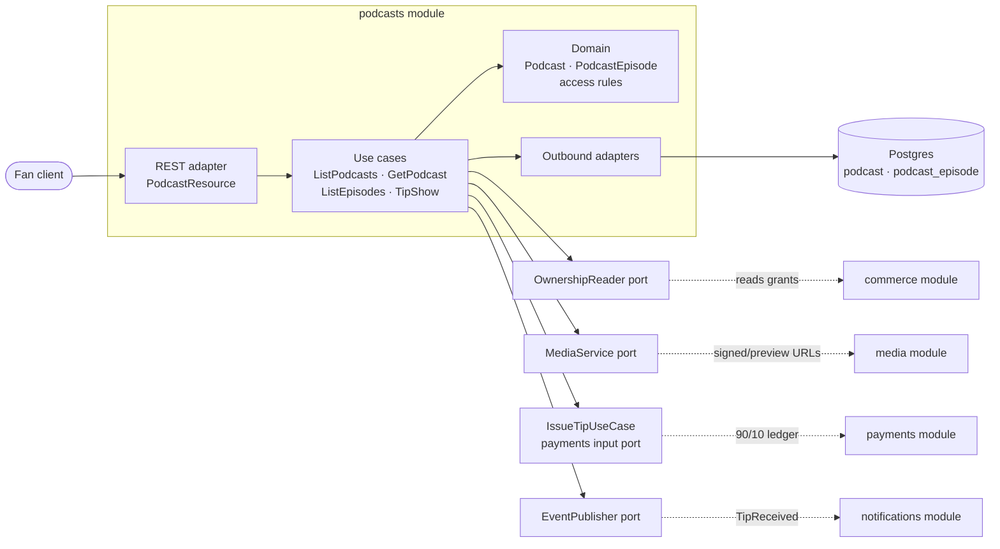
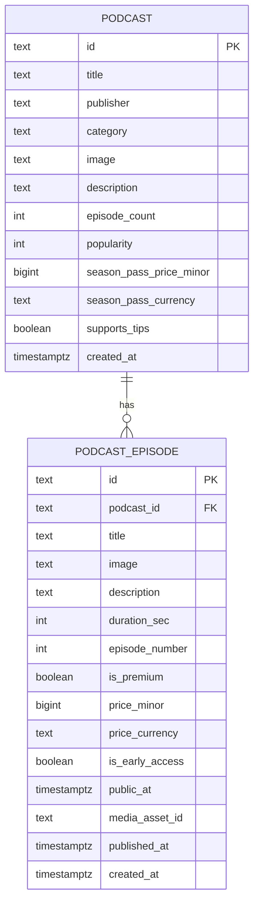
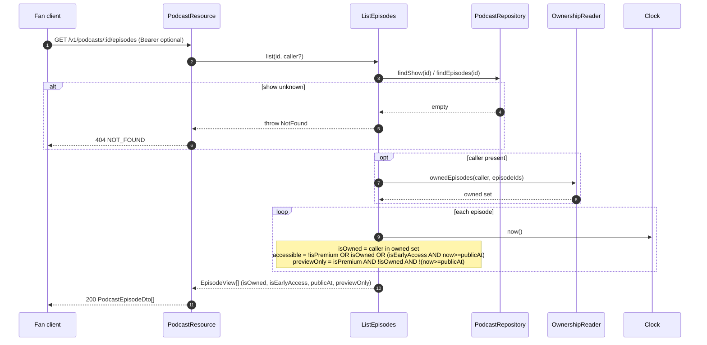
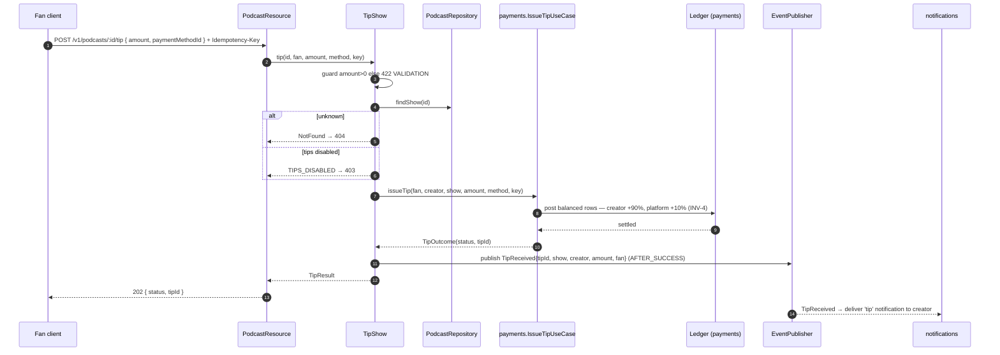
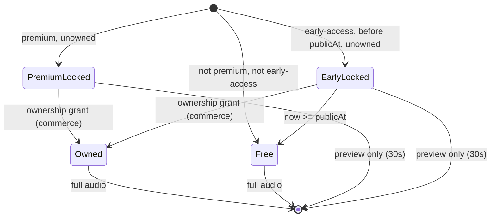

# Architecture Design Doc — `podcasts` (Podcasts)

> **Status:** Stable · **PRD source:** `BACKEND-PRD.md` §6.8 · **Owning context:** `podcasts` ·
> **Package root:** `org.shakvilla.beatzmedia.podcasts`
>
> This ADD is consumed by Claude Code agents. It is the design contract for the module: an agent
> reads it, plans the listed work units, implements within the stated ports/adapters, writes the
> tests, and opens a PR. Do not invent endpoints or fields not traceable to the PRD / `API-CONTRACT.md`.

## 1. Purpose & responsibilities

The `podcasts` module owns podcast **shows** and **episodes** and serves the Fan-facing podcasts
browse, show-detail, and gated-playback experience, plus **instant MoMo tipping** of a show. It
mirrors the music buy-to-own model: a free feed for reach, plus **premium** (buy-to-own) and
**early-access** episodes, an optional **season pass**, and tips credited 90% to the creator.

It owns the `podcast` and `podcast_episode` tables and the rules that decorate episodes with
per-caller ownership and early-access state. It explicitly **does not own**: creator-side show/episode
authoring (that is `studio`, WU-STU-2), media upload/transcode/streaming (`media`, `MediaService`),
ownership grants and the season-pass expansion (`commerce`, INV-2 — referenced in §9), the ledger and
the 90/10 tip split posting (`payments`, `IssueTip`, WU-PAY-3), and notification delivery
(`notifications`, which consumes `TipReceived`). Persistence is never shared across modules.

**Surfaces:** Fan (podcasts list, show detail, support modal). **HLFRs covered:** HLFR-PODCAST-01
(browse & gated playback), HLFR-PODCAST-02 (tipping). **LLFRs:** PODCAST-01.1, 01.2, 01.3, 02.1.

## 2. Context & dependencies (C4 component view)



**Dependency rule.** Hexagonal: `domain` depends on nothing; `application` depends on `domain` and on
ports it declares; inbound/outbound adapters depend inward only (ArchUnit-enforced). The module reaches
other modules **only** through input ports it calls (`payments.IssueTipUseCase`) and outbound ports it
defines (`OwnershipReader`, `MediaService`, `EventPublisher`); it holds **no** cross-module FKs and
references foreign aggregates by id. It **publishes** `TipReceived`; it consumes no events. Ownership
is resolved per-request via `OwnershipReader` (backed by `commerce` grants), never by joining tables.

## 3. Domain model

| Name | Kind | Key fields | Notes |
|---|---|---|---|
| `Podcast` | Aggregate root | `id`, `title`, `publisher`, `category`, `image`, `episodeCount`, `popularity`, `seasonPassPrice?`, `supportsTips` | Show; tipping allowed only when `supportsTips`. |
| `PodcastEpisode` | Entity (child of show) | `id`, `podcastId`, `title`, `image`, `durationSec`, `publishedAt`, `episodeNumber?`, `isPremium`, `price?`, `isEarlyAccess`, `publicAt?`, `mediaAssetId?` | Free / premium / early-access. |
| `EpisodeAccess` | Value object | `accessible`, `previewOnly`, `previewSec` | Computed per caller from premium/early-access + ownership. |
| `PodcastCategory` | Enum | — | See below. |
| `TipResult` | Value object | `status`, `tipId` | Returned by `TipShow`. |

**Enums** (lifted verbatim from `Frontend/src/types/index.ts` `PodcastCategory`):
`News & Politics | Comedy | Business | Sports | Culture | Tech | Health | Storytelling`.

**Invariants enforced here**
- **INV-3 (preview gate).** A premium episode the caller does not own yields full audio withheld;
  `MediaService` returns a **preview clip of `previewSec` (default 30, OQ-6)**, configurable per
  content-type via `PlatformSettings`. Free or owned → full audio.
- **Early-access guard.** An `isEarlyAccess` episode is locked until `publicAt`; before `publicAt`
  only owners get full audio (others get preview); at/after `publicAt` it is free to everyone.
- **INV-4 (tip split, referenced).** Tips credit creator 90% / platform 10%; the actual posting is in
  `payments` (`IssueTip`) — this module supplies amount + show/creator id and asserts `amount > 0`.



## 4. Application layer (ports)

### 4.1 Input ports (use cases)

```java
/** Lists shows, optionally filtered by category. LLFR-PODCAST-01.1. */
public interface ListPodcasts {
    Page<Podcast> list(Optional<PodcastCategory> category, PageRequest page);
}

/** Returns a single show. LLFR-PODCAST-01.2. */
public interface GetPodcast {
    Podcast get(PodcastId id);
}

/** Lists a show's episodes decorated with per-caller ownership/early-access state. LLFR-PODCAST-01.3. */
public interface ListEpisodes {
    List<EpisodeView> list(PodcastId id, Optional<AccountId> caller);
}

/** Issues an instant MoMo tip to a show, credited 90/10 via payments. LLFR-PODCAST-02.1. */
public interface TipShow {
    TipResult tip(PodcastId id, AccountId fan, Money amount,
                  TipMethod method, String idempotencyKey);
}
// Realized (WU-POD-2): the method is a framework-neutral TipMethod(provider, kind, token) (the
// MoMo-first instrument the client supplies), and the idempotency key is a plain String forwarded
// to payments (which wraps it in its own IdempotencyKey VO backed by the UNIQUE constraint). The
// recipient creator is NOT a parameter — TipShow resolves it server-side from the show's
// creator_account_id, so a client can never redirect a tip. See TipShowService.
```

| Port | Trigger | Authorization | Idempotency | Events | LLFR |
|---|---|---|---|---|---|
| `ListPodcasts` | `GET /v1/podcasts` | Public | n/a (read) | — | 01.1 |
| `GetPodcast` | `GET /v1/podcasts/:id` | Public | n/a (read) | — | 01.2 |
| `ListEpisodes` | `GET /v1/podcasts/:id/episodes` | Public; ownership decoration requires auth | n/a (read) | — | 01.3 |
| `GetEpisodeStreamUrl` | `GET /v1/podcasts/episodes/:id/stream` | Public; Bearer optional (INV-3 gate) | n/a (read) | — | 01.3 |
| `TipShow` | `POST /v1/podcasts/:id/tip` | `fan` (authenticated) | `IdempotencyKey` — same key → same `TipResult`, no double charge | `TipReceived` (AFTER_SUCCESS) | 02.1 |

**`GetEpisodeStreamUrl`** (realized WU-POD-1; not in the original port sketch above) is the sole
INV-3 enforcement point for podcast episode audio, mirroring playback's `GetStreamUrl` (WU-PLY-1)
exactly: resolves the episode, decides `EpisodeAccess` (accessible/previewOnly) from
premium/early-access + a per-caller ownership check (skipped entirely for free episodes or an
anonymous caller — no unnecessary cross-module round-trip), then calls `MediaService` for a signed
full or ≤30s preview URL. The client cannot pass a rendition flag.

```java
public interface GetEpisodeStreamUrl {
    StreamUrlResult getStreamUrl(EpisodeId episode, Optional<AccountId> caller);
}
```

### 4.2 Output ports

```java
/** Owned-table reads for shows & episodes. Adapter: PodcastJpaRepository (Postgres). */
public interface PodcastRepository {
    Page<Podcast> findShows(Optional<PodcastCategory> category, PageRequest page);
    Optional<Podcast> findShow(PodcastId id);
    List<PodcastEpisode> findEpisodes(PodcastId id);
    Optional<PodcastEpisode> findEpisode(EpisodeId id);
}

/** Per-caller ownership lookup. Adapter: OwnershipReaderAdapter (calls commerce input port). */
public interface OwnershipReader {
    boolean ownsEpisode(AccountId caller, EpisodeId episode);
    Set<EpisodeId> ownedEpisodes(AccountId caller, Set<EpisodeId> candidates);
}

/** Streaming/preview URL issuance honouring INV-3. Adapter: MediaServiceAdapter (media module). */
public interface MediaService {
    SignedUrl issueSignedUrl(EpisodeId episode, boolean preview, Duration ttl);
}

/** Publishes domain events after commit. Adapter: CdiEventPublisher / outbox. (WU-POD-2.) */
public interface EventPublisher {
    void publish(DomainEvent event);
}
```

```java
/** payments input port consumed by TipShow for the 90/10 split + ledger posting. (WU-POD-2.) */
public interface IssueTipUseCase {
    TipOutcome issueTip(AccountId fan, AccountId creator, Money amount,
                        TipMethod method, String idempotencyKey);
}
```

**Realized (WU-POD-2).** `IssueTipUseCase` takes the server-resolved recipient `creator` (an
`identity.AccountId`) directly — the show id is not passed because the recipient is all payments
needs (the creator is encoded into the intent's `TipRef` so settlement recovers it). Its adapter,
`PaymentsTipAdapter`, translates `TipMethod → payments.PaymentMethodRef`, the identity `AccountId`s →
`payments.AccountId`, and the `String` key → `payments.IdempotencyKey`, then calls payments'
`IssueTip` INPUT port. Podcasts never reads/writes payments tables and never re-implements the
split/ledger/idempotency/audit — all of that lives in the WU-PAY-3 pipeline. `TipOutcome(tipId,
status)` is mapped to `TipResult` and then to the `TipResponse` DTO (HTTP 202). The `EventPublisher`
port / `TipReceived` outbox coupling remains deferred (notifications consume the payments-side
`TipReceived` emitted by the settlement subscriber).

**Commerce-side addition (WU-POD-1).** No commerce input port previously exposed per-episode
ownership outside commerce itself (only `library.GetOwnedTrackIds` existed, track-only). This WU
added `commerce.application.port.in.GetOwnedEpisodeIds` (`isOwned`, batched `ownedOf`), backed by a
new `OwnershipRepository.activeEpisodeIds(account, candidateIds)` output-port method (a single
batched query alongside the existing single-id `existsActiveForEpisode`). `podcasts`'
`OwnershipReaderAdapter` calls this commerce input port in-process — podcasts never reads
`ownership_grant` directly, preserving the hexagonal rule symmetric to how playback consumes
library's `GetOwnedTrackIds`.

`Clock` (kernel port) supplies the `publicAt`/`now` comparison instant — never `Instant.now()` in
core code. `IdGenerator` is reserved for WU-POD-2 (tip ids).

## 5. Adapters

### 5.1 Inbound — REST resources

Base path `/v1`. JSON, UTF-8. Money as `{ amount, currency }`; durations whole seconds; timestamps ISO-8601.

| Method | Path | Auth/scope | Request DTO | Response DTO | Success | Error codes | LLFR |
|---|---|---|---|---|---|---|---|
| GET | `/v1/podcasts?category=&page=&size=` | Public | — (query) | `Page<PodcastDto>` | 200 | `VALIDATION` (bad category/page) | 01.1 |
| GET | `/v1/podcasts/:id` | Public | — | `PodcastDto` | 200 | `NOT_FOUND` | 01.2 |
| GET | `/v1/podcasts/:id/episodes` | Public; Bearer optional (enables `isOwned`/full audio) | — | `PodcastEpisodeDto[]` | 200 | `NOT_FOUND` | 01.3 |
| GET | `/v1/podcasts/episodes/:id/stream` | Public; Bearer optional (INV-3 gate) | — | `StreamUrlResponse` | 200 | `NOT_FOUND`, `MEDIA_UNAVAILABLE` | 01.3 |
| POST | `/v1/podcasts/:id/tip` | `fan` (Bearer) | `TipRequest` + `Idempotency-Key` | `TipResponse` | 202 | `UNAUTHENTICATED`, `VALIDATION` (`amount<=0`), `TIPS_DISABLED`, `NOT_FOUND`, `PAYMENT_FAILED`, `IDEMPOTENCY_CONFLICT` | 02.1 |

Resources are thin: map DTO → command, call input port, map result → DTO. No business logic in
resources. The episodes endpoint extracts the caller from the bearer token if present; absent → all
episodes returned with `isOwned=false` and premium/early-access locked. **Realized as a single
`PodcastResource`** with one class-level `@Path("/v1")` root (mirroring `PublicCatalogResource` /
`PlaybackResource`) and full sub-paths per method — `/podcasts/episodes/:id/stream` is nested under
`/podcasts` (not a sibling `/episodes/:id/stream`) specifically so it cannot structurally collide
with `/podcasts/:id` (the WU-PLY-1 routing lesson: one root, no overlapping literal segment count
at the same position).

### 5.2 Outbound — persistence & integrations

- **`PodcastJpaRepository`** maps domain ↔ JPA entities (`PodcastEntity`, `PodcastEpisodeEntity`);
  domain objects carry no ORM annotations. Indexed reads by `category` and `podcast_id` (§7).
- **`OwnershipReaderAdapter`** implements `OwnershipReader` by calling commerce's
  `GetOwnedEpisodeIds` INPUT port in-process (added in this WU — see §4.2) — never reads
  `ownership_grant` directly. Batches candidate episode ids for the episode-list decoration to
  avoid N+1.
- **`MediaServiceAdapter`** implements `MediaService` by calling the media module's `MediaService`
  output port (WU-MED-1), resolving the episode's asset via `findAssetIdForOwner` under the
  owner-ref convention `("podcasts", episodeId)` — mirroring playback's `("catalog", trackId)`
  convention for tracks. Any media outage/illegal-state is translated to `MediaUnavailableException`
  (503 `MEDIA_UNAVAILABLE`), never an unmapped 500.
- **`PaymentsTipAdapter`** (realized WU-POD-2) implements podcasts' `IssueTipUseCase` output port by
  calling payments' `IssueTip` INPUT port in-process (symmetric to how `OwnershipReaderAdapter` calls
  commerce's `GetOwnedEpisodeIds`). Pure translation boundary; an unknown provider/kind is mapped to
  `VALIDATION` (422), never an unmapped 500.
- **`CdiEventPublisher`** (deferred) would publish a podcasts-side `TipReceived` via the outbox; not
  realized in WU-POD-2 — notifications consume the payments-side `TipReceived` from settlement.
- **Transaction boundary (WU-POD-1 realized).** `ListPodcastsService`/`GetPodcastService`/
  `ListEpisodesService` are `@Transactional` read services over `PodcastRepository`.
  `GetEpisodeStreamUrlService` is deliberately **not** `@Transactional` (no DB write; mirrors
  playback's `GetStreamUrlService`) — it reads the episode, decides `EpisodeAccess`, and delegates
  to `MediaService`/`OwnershipReader`. Tip posting (WU-POD-2) commits within `payments`; this
  module's own writes and the `TipReceived` publish will be outbox-coupled to that success.

## 6. DTOs & API shapes

Traceable to `Frontend/src/types/index.ts`. Money is `{ amount, currency: "GHS" }`; durations seconds;
timestamps ISO-8601.

**`PodcastDto`** (from `Podcast`):
`id`, `title`, `publisher`, `image`, `category`, `description?`, `episodeCount?`, `popularity?`,
`seasonPassPrice?: Money`, `supportsTips?: boolean`.

**`PodcastEpisodeDto`** (from `PodcastEpisode`):
`id`, `podcastId`, `title`, `showTitle`, `image`, `duration` (sec), `publishedAt` (ISO),
`description?`, `episodeNumber?`, `isPremium?: boolean`, `price?: Money`, `isOwned?: boolean`
(per caller via `OwnershipReader`), `isEarlyAccess?: boolean`, `publicAt?` (ISO).

**`TipRequest`** (from API-CONTRACT §8 `{ amount }` + idempotency): `amount: Money` (or
`{ amount: number }`, currency defaulted GHS), `paymentMethodId: ID`, `idempotencyKey: string` (or
`Idempotency-Key` header — header takes precedence).

**`TipResponse`**: `{ status: "ACCEPTED" | "PROCESSING" | "SETTLED", tipId: ID }` (HTTP 202).

`isOwned`, `price`, `isPremium`, `isEarlyAccess`, `publicAt`, `seasonPassPrice`, `supportsTips` are the
load-bearing gating/monetization fields; defaults: absent `isPremium`/`isEarlyAccess`/`isOwned` → false.

## 7. Persistence schema & migrations

```sql
CREATE TABLE podcast (
  id                       TEXT PRIMARY KEY,
  title                    TEXT        NOT NULL,
  publisher                TEXT        NOT NULL,
  image                    TEXT        NOT NULL,
  category                 TEXT        NOT NULL,
  description              TEXT,
  episode_count            INTEGER     NOT NULL DEFAULT 0,
  popularity               INTEGER     NOT NULL DEFAULT 0,
  season_pass_price_minor  BIGINT,                 -- pesewas; NULL = no season pass
  season_pass_currency     TEXT,                   -- 'GHS' when price set
  supports_tips            BOOLEAN     NOT NULL DEFAULT FALSE,
  created_at               TIMESTAMPTZ NOT NULL DEFAULT now(),
  CONSTRAINT chk_pod_category CHECK (category IN
    ('News & Politics','Comedy','Business','Sports','Culture','Tech','Health','Storytelling')),
  CONSTRAINT chk_pod_season_pass CHECK (
    (season_pass_price_minor IS NULL AND season_pass_currency IS NULL) OR
    (season_pass_price_minor >= 0 AND season_pass_currency IS NOT NULL))
);
CREATE INDEX idx_podcast_category ON podcast (category);
CREATE INDEX idx_podcast_popularity ON podcast (popularity DESC);

CREATE TABLE podcast_episode (
  id              TEXT PRIMARY KEY,
  podcast_id      TEXT        NOT NULL REFERENCES podcast (id) ON DELETE CASCADE,
  title           TEXT        NOT NULL,
  image           TEXT        NOT NULL,
  description     TEXT,
  duration_sec    INTEGER     NOT NULL CHECK (duration_sec > 0),
  episode_number  INTEGER,
  is_premium      BOOLEAN     NOT NULL DEFAULT FALSE,
  price_minor     BIGINT,                            -- pesewas; required when premium/early-access
  price_currency  TEXT,
  is_early_access BOOLEAN     NOT NULL DEFAULT FALSE,
  public_at       TIMESTAMPTZ,                       -- when early-access becomes free
  media_asset_id  TEXT,                              -- id into media module (no FK)
  published_at    TIMESTAMPTZ NOT NULL,
  created_at      TIMESTAMPTZ NOT NULL DEFAULT now(),
  CONSTRAINT chk_ep_price CHECK (
    ((is_premium OR is_early_access) AND price_minor IS NOT NULL AND price_currency IS NOT NULL)
    OR (NOT is_premium AND NOT is_early_access)),
  CONSTRAINT chk_ep_early CHECK (NOT is_early_access OR public_at IS NOT NULL)
);
CREATE INDEX idx_episode_podcast ON podcast_episode (podcast_id, published_at DESC);
```

Money in **minor units** (`*_minor`, BIGINT pesewas); durations in **whole seconds** (`duration_sec`);
premium/early-access **flags** (`is_premium`, `is_early_access`); `public_at` TIMESTAMPTZ.

**Flyway list** (forward-only, `src/main/resources/db/migration/`) — **realized (WU-POD-1)**:
- `V945__create_podcast_and_episode.sql` — both `podcast` and `podcast_episode` in one migration
  (a single logical change: the show + its episodes table together, per data-and-migrations §4.1's
  "table + its indexes/constraints" unit), rather than two separate files as originally sketched.
- `R__seed_dev_data.sql` (repeatable, dev/test) — extended with all 8 shows and all episodes from
  `Frontend/src/lib/podcast-data.ts` (`sincerely-accra`'s free + premium + early-access feed, plus
  one representative episode per remaining show).

## 8. Key flows

**(a) List episodes with ownership & early-access gating (LLFR-PODCAST-01.3)**



> Full audio is only ever fetched via a separate `GET /v1/podcasts/episodes/:id/stream` call
> (`GetEpisodeStreamUrl` → `MediaService.issueSignedUrl(episode, preview, ttl)`) for accessible
> episodes; premium/pre-`publicAt` early-access unowned episodes resolve `preview=true` →
> `previewSeconds=30` (INV-3, OQ-6). The list endpoint returns metadata + flags only; the actual
> audio URL is requested by the player per episode via the stream endpoint (realized WU-POD-1).

**(b) Tip → IssueTip (90/10) → TipReceived → notification (LLFR-PODCAST-02.1)**



**Episode access state machine**



## 9. Cross-cutting hooks

- **Auth/scope.** Reads (`/podcasts`, `/podcasts/:id`, `/podcasts/:id/episodes`) are **public**;
  ownership decoration on episodes requires a valid bearer (absent → `isOwned=false`, premium/
  early-access locked). `POST /tip` requires `fan` role; ownership of the payment method is re-checked
  in `payments`.
- **Premium preview gating (INV-3, OQ-6).** `previewSec` default **30** from `PlatformSettings`,
  configurable per content-type. Preview never serves full audio; enforced server-side in `media`.
- **Early-access gating.** Locked until `publicAt` unless owned; `Clock.now()` (UTC) is the comparison
  time, never client time.
- **Tip idempotency.** `Idempotency-Key` (header or body field) is forwarded to `IssueTip`; same key →
  same `TipResult`, no repeated charge or duplicate `TipReceived`.
- **Events.** `TipReceived { tipId, podcastId, creatorId, amount, fanId, at }` published AFTER_SUCCESS
  via outbox; consumed by `notifications` for the creator `tip` notification. No JPA entities in events.
  **Deferred-AC (WU-POD-2).** LLFR-PODCAST-02.1 also requires the creator `tip` notification, but the
  `notifications` module does not exist yet (WU-NOT-1/WU-NOT-2). The money half is complete in
  WU-POD-2; the notification half is **tracked-but-deferred** to a future WU-NOT-* which consumes the
  **payments-side** `TipReceived` already emitted on settlement (`TipLedgerPoster`) — no podcasts
  re-work needed. This is recorded in `backlog.yaml` (WU-POD-2 entry) so it is not silently dropped
  when POD-2 is marked done.
- **Rate limiting (WU-POD-2 realized).** `POST /v1/podcasts/:id/tip` is per-account token-bucket
  limited (security-authz §6: 20/min, burst 10) by `PodcastTipRateLimiter` (mirrors commerce's
  `CheckoutRateLimiter`) → `429` + `Retry-After`, checked before any charge is initiated.
- **Amount bounds (WU-POD-2 realized).** An overflowing tip amount (too large for `long`) is caught
  at the REST boundary and mapped to `VALIDATION` (422), never an unmapped 500; the platform charge
  ceiling (`PlatformSettings.maxChargeMinor`) is enforced in payments' `IssueTipService` →
  `CHARGE_AMOUNT_EXCEEDED` (422), so ALL tip callers (podcasts and the direct `/v1/payments/tips`
  surface) get it — closing a real gap in the WU-PAY-3 tip entry that only checked positivity.
- **Audit (INV-10).** The tip is a privileged money mutation; the audit entry is appended by
  `payments` on the `IssueTip` path (this module emits the trigger, not the ledger row).
- **Feature flag.** `flags.tipping` and `flags.podcasts` (PlatformSettings) gate the tip and browse
  surfaces respectively; flag off → `403` (`feature-off`).
- **Rate limits.** `POST /tip` is rate-limited per account (`429` + `Retry-After`).
- **Season pass (referenced, not owned here).** Purchasing a `season-pass` grants all premium episodes
  of the show — handled in `commerce` settlement expansion (**INV-2**); this module merely reflects the
  resulting grants via `OwnershipReader` (`isOwned=true`).
- **Error codes.** `NOT_FOUND`, `VALIDATION` (amount ≤ 0), `TIPS_DISABLED`, `UNAUTHENTICATED`,
  `PAYMENT_FAILED`, `IDEMPOTENCY_CONFLICT`, `RATE_LIMITED`. Uniform envelope per conventions §4.
- **Observability.** Metrics: `podcasts.episodes.listed`, `podcasts.tips.count`, `podcasts.tips.amount`,
  tip latency; spans across the `TipShow → IssueTip` call. Structured JSON logs with trace id; no PII.

## 10. Work units & build order

| WU | Scope | LLFR | Ports / tables | Depends on |
|---|---|---|---|---|
| **WU-POD-1** | Podcast shows/episodes browse + premium/early-access gating + per-caller ownership decoration | PODCAST-01.1–01.3 | `ListPodcasts`, `GetPodcast`, `ListEpisodes`; `PodcastRepository`, `OwnershipReader`, `MediaService`; tables `podcast`, `podcast_episode` | WU-CAT-1, WU-MED-1 |
| **WU-POD-2** | Tipping: `TipShow → IssueTip` (90/10), `TipReceived` event | PODCAST-02.1 | `TipShow`; `IssueTipUseCase`, `EventPublisher`; ledger via WU-PAY-3 | WU-PAY-3, WU-POD-1 |

**Recommended order:** WU-POD-1 then WU-POD-2. Cross-reference PRD §8 (Phase 4): WU-POD-1 → WU-POD-2.

## 11. Testing plan

**Unit (domain/use-case with fakes) — realized (WU-POD-1).** `EpisodeAccessTest`: full truth table
(free / premium-owned / premium-unowned / early-access before/after `publicAt`, owned/unowned; 8
cases). `GetEpisodeStreamUrlServiceTest`: the INV-3 gate at the application boundary — owner/free →
FULL no `previewSeconds`; non-owner/anonymous of a premium or pre-`publicAt` early-access episode →
PREVIEW `previewSeconds=30`; early-access at/after `publicAt` → FULL regardless of ownership; unknown
episode → `EpisodeNotFoundException`; free episode never queries `OwnershipReader` (no unnecessary
cross-module call); `expiresAt` echoed from `MediaService`, never hard-coded. `ListEpisodesServiceTest`
/ `ListPodcastsServiceTest` / `GetPodcastServiceTest`: browse/detail decoration + 404. Fakes:
`FakePodcastRepository`, `FakeOwnershipReader`, `FakeMediaService` (podcasts test package), plus the
shared `platform.fakes.FakeClock`. `TipShow` unit tests deferred to WU-POD-2.

**Integration (Testcontainers Postgres, REST-assured) — realized.** `PodcastFlowIT`: seeded show +
free/premium/locked-early-access episodes with READY `media_asset` rows; asserts paged list, category
filter, 404s, episode-list ownership decoration (owner via a directly-seeded `ownership_grant` row —
episode checkout itself is out of WU-COM-2's scope per §1/§9 until a later commerce WU), and the
gated stream endpoint's full/preview decision end-to-end through the real commerce
`GetOwnedEpisodeIds` chain and the real media `MediaService` chain (S3 signing faked via the shared
test-scoped `FakeUrlSignerPort` CDI alternative, no live MinIO dependency). `PodcastMigrationIT`:
`flyway.validate()` on a fresh container. Tip flow integration deferred to WU-POD-2.

**Contract — realized.** `PodcastContractTest` validates `Page<PodcastDto>` envelope, `PodcastDto`
(money `seasonPassPrice`), `PodcastEpisodeDto` (whole-second `duration`, ISO-8601 `publishedAt`,
money `price`), `StreamUrlResponse` (`previewSeconds` present only when gated, ISO-8601 `expiresAt`),
and the uniform error envelope on unknown show/episode — against `Frontend/src/types/index.ts`
(`Podcast`, `PodcastEpisode`) and `API-CONTRACT.md` §8.

**Key Given/When/Then (PRD §6.8).**
- *Premium unowned:* **Given** a premium episode the caller does not own, **When** listing episodes,
  **Then** `isOwned=false` and full audio is withheld (media resolves to a 30s preview URL only).
- *Tip nets 90%:* **Given** a ₵10 tip that settles, **When** processed, **Then** the creator nets
  **₵9.00** (900 pesewas, platform 100), the response is `202`, and a `tip` notification is delivered
  to the creator (asserted via `TipReceived`).
- *Early-access:* **Given** an early-access episode before `publicAt` the caller does not own, **Then**
  it is locked (preview only); **Given** `now >= publicAt`, **Then** it is free to everyone.
- *Idempotent tip:* **Given** a repeated `Idempotency-Key`, **Then** no second charge and the same
  `TipResult` is returned.

**Coverage** ≥ the gate in `sdlc/testing-strategy.md`.

## 12. Definition of done (module-specific)

Global DoD (PRD §8 / conventions §11) — unit + integration tests, contract conformance, forward-only
Flyway applying cleanly, healthy under Docker Compose, ArchUnit dependency rule green, idempotent
money paths + audit (INV-10), coverage gate, Spotless clean, ADD updated — **plus**:

1. **Preview never serves full audio** for premium-unowned or pre-`publicAt` early-access episodes
   (INV-3 verified end-to-end). **✓ WU-POD-1.**
2. **Per-caller ownership** is correct: authenticated owner → `isOwned=true` and full audio; anonymous
   → `isOwned=false` and locked. **✓ WU-POD-1.**
3. **Tip split is exact**: ₵10 → creator 900 pesewas + platform 100, posted balanced in `payments`
   (Σ debits = Σ credits, INV-6) with no remainder leak. **✓ WU-POD-2** — proven end-to-end by
   `PodcastTipFlowIT.tip_settles_and_credits_creator_90_percent_via_real_payments_pipeline` (₵10 tip
   → `creator_balance.available_minor == 900` after webhook settlement). The 10% fee is
   `PlatformSettings.tipFeePct` (OQ-2 default, still flagged for prod), never hard-coded here.
4. **Tip is idempotent** (key replay → single effect); the payments `idempotency_key` UNIQUE
   constraint + advisory lock enforce one charge/settlement per key (proven in payments'
   `TipFlowIT.duplicate_tip_key_produces_one_charge_and_one_credit`). The INV-10 finance `AuditEntry`
   is appended on the `IssueTip` path. The podcasts-side `TipReceived` outbox emission is deferred;
   the creator `tip` notification is driven by the payments-side `TipReceived`. **✓ WU-POD-2.**

**Guards (realized WU-POD-2).** `POST /v1/podcasts/:id/tip` requires auth (JWT subject = fan, never a
body field) and a mandatory `Idempotency-Key` header (missing → **400** `MISSING_IDEMPOTENCY_KEY`).
The recipient creator is resolved server-side from the show; a **self-tip** (`fan == creator`) is
rejected **422** `SELF_TIP_NOT_ALLOWED`; an unknown show → **404** `NOT_FOUND`; a show with tips off
or no owning creator → **403** `TIPS_DISABLED` (never posts money to a phantom recipient); a
non-positive amount → **422** `VALIDATION`. Proven by `TipShowServiceTest` (unit,
`selfTip_isRejected_andNeverTouchesPayments` + the resolve-creator-server-side + guard cases) and
`PodcastTipFlowIT` (integration, unknown-podcast 404 / missing-key 400 / anonymous 401).
5. **No cross-module FKs**; ownership resolved only via `OwnershipReader` (now backed by commerce's
   `GetOwnedEpisodeIds` input port, added this WU); season-pass grants surfaced from `commerce`
   (INV-2), not duplicated here. **✓ WU-POD-1.**
