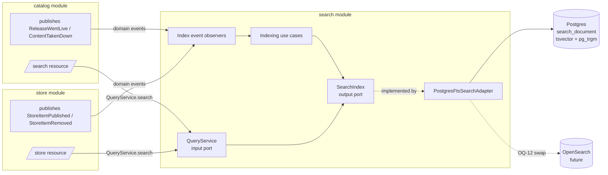
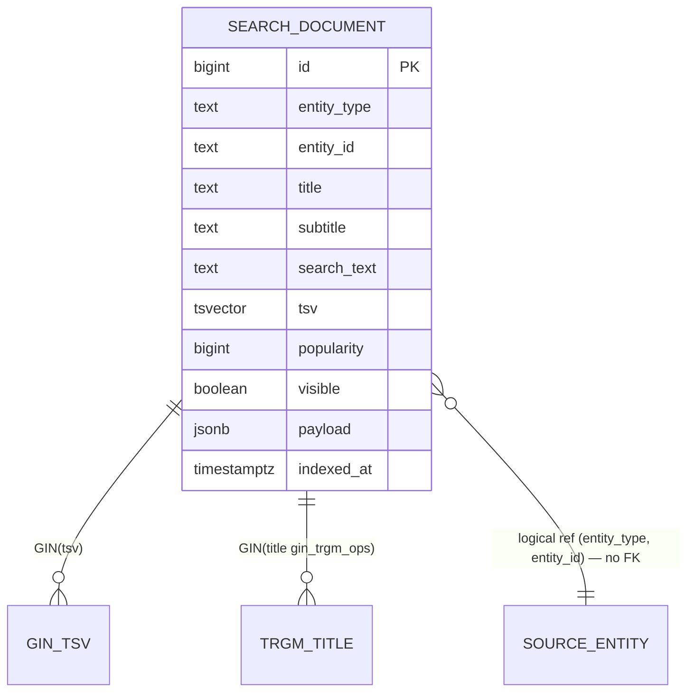
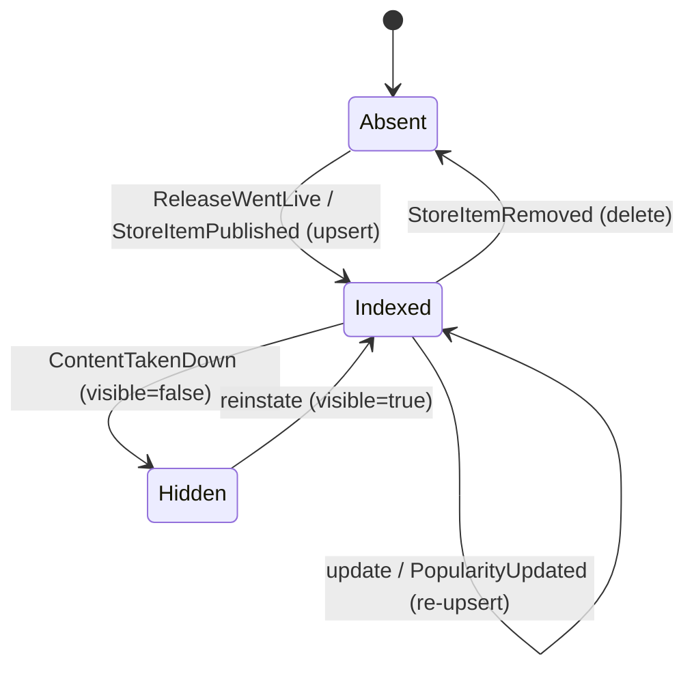

# Architecture Design Doc — `search` (`Search & Discovery Indexing`)

> **Status:** Stable · **PRD source:** `BACKEND-PRD.md` §6.13 (plus §6.2.1 `/search`, §6.7 `/store`, OQ-12) ·
> **Owning context:** `search` ·
> **Package root:** `org.shakvilla.beatzmedia.search`
>
> This ADD is consumed by Claude Code agents. It is the design contract for the module: an agent
> reads it, plans the listed work units, implements within the stated ports/adapters, writes the
> tests, and opens a PR. Do not invent endpoints or fields not traceable to the PRD / `API-CONTRACT.md`.

## 1. Purpose & responsibilities

The `search` module **owns the search-index lifecycle**: it maintains a single, denormalised index of
indexable catalog entities — tracks, artists, albums, playlists, store items, podcasts, and events —
and keeps it current as those entities are created, updated, or taken down. It exposes a read-side
`QueryService` (input port) that `catalog` (§6.2.1 `/search`) and `store` (§6.7 `/store`) call to
serve discovery, and it implements the `SearchIndex` **output port** consumed by those modules to
project documents into the index. It explicitly does **not** own the source-of-truth catalog/store
data (those remain owned by `catalog`, `store`, `podcasts`, `events`), does **not** expose its own
public REST surface, and does **not** compute editorial ranking or popularity rollups (it *consumes*
popularity, with bot plays already excluded upstream by `playback`/risk, §6.3.2/§9). Surfaces served
(indirectly): Fan search and Store browse. **HLFRs covered:** HLFR-SEARCH-01 (LLFR-SEARCH-01.1
index lifecycle, LLFR-SEARCH-01.2 anti-manipulation in ranking).

## 2. Context & dependencies (C4 component view)



**Dependency rule.** Hexagonal: `domain` depends on nothing; `application` depends on `domain` and
ports; adapters depend on `application`. `search` calls **no other module's input ports** and holds
**no FK to another module's tables**. It is event-driven inbound (consumes `ReleaseWentLive`,
`ContentTakenDown`, and analogous store/podcast/event publish/remove events — ids + minimal snapshot
only, never JPA entities, §8). It publishes no domain events. The `SearchIndex` output port is
*defined here* and *consumed by* `catalog` and `store` to upsert/remove documents; `QueryService` is
the read input port those modules call. Persistence (`search_document`) is owned solely by `search`.

## 3. Domain model

- **Aggregates / entities / value objects**

| Name | Kind | Key fields | Notes |
|---|---|---|---|
| `IndexDocument` | Aggregate (VO-ish) | `entityType`, `entityId`, `title`, `subtitle`, `searchText`, `popularity`, `payload`, `visible` | Denormalised projection of a source entity; the unit upserted/removed. |
| `EntityType` | Enum | see below | Partitions the single index table. |
| `SearchQuery` | VO | `q`, `filters`, `PageRequest` | Built at adapter boundary from REST params. |
| `SearchHit` | VO | `entityType`, `entityId`, `title`, `subtitle`, `payload`, `score` | One ranked match returned by the port. |
| `SearchResults` | VO | `tracks`, `artists`, `albums`, `playlists`, `topResult`, plus `storeItems`/`podcasts`/`events` | Grouped, shaped to the `/search` contract (§5). |
| `Popularity` | VO | `score: long` | Ranking input; **excludes flagged bot plays** (LLFR-SEARCH-01.2). |

- **Enums** (verbatim PRD §6.13 / §6.7)
  - `EntityType { TRACK, ARTIST, ALBUM, PLAYLIST, STORE_ITEM, PODCAST, EVENT }`
  - `SearchScope` (filter): same members as `EntityType` plus `ALL`.

- **Invariants**
  - **INV-SRCH-1** — exactly one row per `(entity_type, entity_id)`; upsert is idempotent on that key.
  - **INV-SRCH-2** — a non-`visible` document (taken-down / unpublished / private playlist) is never
    returned by `QueryService.search`.
  - **INV-SRCH-3** — `popularity` derives only from de-duped, non-bot plays (LLFR-SEARCH-01.2); the
    module trusts the upstream-supplied value and never inflates it.
  - **INV-SRCH-4** — `tsv` always reflects current `title` + `search_text` (maintained by trigger, §7).



## 4. Application layer (ports)

### 4.1 Input ports (use cases)

```java
/** Read-side discovery query consumed by catalog (/search) and store (/store). */
public interface QueryService {
    SearchResults search(SearchQuery query);
}

/** Catalog/store projection entry points (called by index event observers). */
public interface IndexEntityUseCase {
    void index(IndexDocument document);            // create/update projection
    void deindex(EntityType type, String entityId); // takedown/remove
}

/** Operational full rebuild (admin/ops trigger; idempotent). */
public interface ReindexUseCase {
    ReindexReport reindex(EntityType type); // null/ALL = every type
}
```

- `QueryService.search` — *Trigger:* `catalog` `/search`, `store` `/store`. *Authorization:* none
  (public reads; visibility enforced via `visible`). *Idempotency:* read-only. *Events:* none.
  *Satisfies:* LLFR-CATALOG-01.2, LLFR-STORE-01.1, LLFR-SEARCH-01.1.
- `IndexEntityUseCase.index/deindex` — *Trigger:* internal event observers (§4.1 observers below).
  *Authorization:* internal only (not REST-reachable). *Idempotency:* upsert on `(type,id)` (INV-SRCH-1);
  `deindex` is a no-op if absent. *Events:* none. *Satisfies:* LLFR-SEARCH-01.1.
- `ReindexUseCase.reindex` — *Trigger:* ops/admin job or migration backfill. *Authorization:* admin
  scope when invoked via tooling. *Idempotency:* converges to current source state. *Satisfies:*
  LLFR-SEARCH-01.1 (recovery).

**Internal event observers** (CDI `@Observes`, `AFTER_SUCCESS`; framework-free domain stays clean):

```java
public interface IndexEventObservers {
    void onReleaseWentLive(ReleaseWentLive e);     // upsert tracks + album + artist projections
    void onContentTakenDown(ContentTakenDown e);   // deindex affected entities (set visible=false / remove)
    void onStoreItemPublished(StoreItemPublished e);
    void onStoreItemRemoved(StoreItemRemoved e);
    void onPodcastPublished(PodcastPublished e);
    void onEventPublished(EventPublished e);
    void onPopularityUpdated(PopularityUpdated e);  // ranking input (bot plays already excluded)
}
```

### 4.2 Output ports

```java
/** SearchIndex output port — DEFINED here, CONSUMED by catalog & store; implemented by the FTS adapter. */
public interface SearchIndex {
    void upsert(IndexDocument document);
    void remove(EntityType type, String entityId);
    SearchResults search(SearchQuery query, SearchFilters filters, PageRequest page);
}

public interface Clock { Instant now(); }            // kernel
public interface IndexDocumentRepository {            // persistence for reindex/backfill bookkeeping
    long count(EntityType type);
}
```

- `SearchIndex` → implemented by `PostgresFtsSearchAdapter` (adapter.out.persistence); the **single
  seam** OQ-12 swaps to an `OpenSearchSearchAdapter` with no contract change.
- `Clock` → kernel adapter. `IndexDocumentRepository` → JPA/Panache adapter over `search_document`.

## 5. Adapters

### 5.1 Inbound — REST resources

**None.** The `search` module exposes **no dedicated public REST surface**. Discovery is served by
the owning modules: `GET /v1/search` (catalog, §6.2.1) and `GET /v1/store` (store, §6.7). Those thin
resources map query params → `SearchQuery`/`SearchFilters` and call `QueryService.search`.

**Query contract (as consumed via catalog `/search`).** `q` min length 1; empty → `422
MISSING_QUERY`. The resource calls `QueryService.search(q, scope=ALL)` and shapes the grouped result:

```jsonc
{
  "tracks":    [ /* Track[]    */ ],
  "artists":   [ /* Artist[]   */ ],
  "albums":    [ /* Album[]    */ ],
  "playlists": [ /* Playlist[] */ ],
  "topResult": { "type": "track|artist|album|playlist", "item": { /* ... */ } }
}
```

`topResult` = the single highest-scored hit across all groups (rank tie-broken by `popularity`). The
catalog resource hydrates each hit's `payload` into the frontend type before returning. Store browse
(`/store`) calls `QueryService.search` with `scope=STORE_ITEM`, `type`/`genre` filters, and `sort ∈
{popular,newest,price-asc,price-desc}` mapped onto the index `sort` (default `popular` by
`popularity`), returning paged `StoreItem[]` (LLFR-STORE-01.1).

### 5.2 Outbound — persistence & integrations

- `PostgresFtsSearchAdapter` — implements `SearchIndex`. `upsert` runs an `INSERT … ON CONFLICT
  (entity_type, entity_id) DO UPDATE`; `tsv` is populated by DB trigger (§7). `remove` deletes the
  row (takedown may instead flip `visible=false` to preserve popularity history — adapter chooses
  delete for store removals, soft-hide for catalog takedowns). `search` builds a parameterised query
  combining `tsv @@ websearch_to_tsquery(:q)` (relevance via `ts_rank_cd`) **plus** a `pg_trgm`
  similarity fallback (`title % :q`) for typo-tolerance, filtered by `visible = true` and any
  `entity_type`/payload filters, ordered by `rank desc, popularity desc`, paginated.
- **Mapping:** domain `IndexDocument` ↔ `SearchDocumentEntity` (JPA) at the adapter; domain objects
  carry no ORM annotations.
- **Transaction boundary:** the use case (`@Transactional` on the application service); event
  observers run their upsert/remove in their own short transaction, `AFTER_SUCCESS` of the source tx.
- **OQ-12:** an alternate `OpenSearchSearchAdapter` would implement the same `SearchIndex` interface
  (bulk upsert API, `_delete`, `_search` with `multi_match` + `fuzziness`), selected by a config flag.

## 6. DTOs & API shapes

`search` defines internal VOs only; the wire DTOs belong to catalog/store (traceable to
`Frontend/src/types/index.ts`).

- `SearchQuery` — `{ q: String, scope: SearchScope, filters: SearchFilters, page: PageRequest }`.
- `SearchFilters` — `{ type?: String, genre?: String, sort: Sort }` (`Sort ∈ {RELEVANCE, POPULAR,
  NEWEST, PRICE_ASC, PRICE_DESC}`).
- `IndexDocument` — `{ entityType, entityId, title, subtitle?, searchText, popularity: long,
  visible: boolean, payload: JsonObject }`. `payload` holds the denormalised fields the resource needs
  to reconstruct the frontend type (e.g. for a `Track`: `image`, `duration` seconds, `price {amount,
  currency}`, `quality`) — **money is `{ amount, currency }`, durations are whole seconds, timestamps
  ISO-8601**, applied when the owning resource maps `payload` → its DTO.
- `SearchResults`/`SearchHit` — as in §3/§5.

## 7. Persistence schema & migrations

```sql
-- V60__create_search_document.sql
CREATE EXTENSION IF NOT EXISTS pg_trgm;

CREATE TABLE search_document (
    id           BIGINT GENERATED BY DEFAULT AS IDENTITY PRIMARY KEY,
    entity_type  TEXT        NOT NULL,
    entity_id    TEXT        NOT NULL,
    title        TEXT        NOT NULL,
    subtitle     TEXT,
    search_text  TEXT        NOT NULL DEFAULT '',
    tsv          TSVECTOR    NOT NULL,
    popularity   BIGINT      NOT NULL DEFAULT 0,
    visible      BOOLEAN     NOT NULL DEFAULT TRUE,
    payload      JSONB       NOT NULL DEFAULT '{}'::jsonb,
    indexed_at   TIMESTAMPTZ NOT NULL DEFAULT now(),
    CONSTRAINT uq_search_document_entity UNIQUE (entity_type, entity_id),
    CONSTRAINT ck_search_document_type CHECK (entity_type IN
        ('TRACK','ARTIST','ALBUM','PLAYLIST','STORE_ITEM','PODCAST','EVENT'))
);

-- Full-text relevance index.
CREATE INDEX idx_search_document_tsv ON search_document USING GIN (tsv);
-- Typo-tolerant / prefix similarity (pg_trgm), OQ-12 default backend.
CREATE INDEX idx_search_document_title_trgm ON search_document USING GIN (title gin_trgm_ops);
-- Filter/sort support.
CREATE INDEX idx_search_document_type_visible ON search_document (entity_type, visible);
CREATE INDEX idx_search_document_popularity ON search_document (popularity DESC);
```

**`tsv` maintenance — DB trigger** (chosen over app-side so reindex/backfill and any direct writes
stay consistent, INV-SRCH-4):

```sql
-- V61__search_document_tsv_trigger.sql
CREATE FUNCTION search_document_tsv_update() RETURNS trigger AS $$
BEGIN
  NEW.tsv :=
      setweight(to_tsvector('simple', coalesce(NEW.title,'')), 'A') ||
      setweight(to_tsvector('simple', coalesce(NEW.subtitle,'')), 'B') ||
      setweight(to_tsvector('simple', coalesce(NEW.search_text,'')), 'C');
  RETURN NEW;
END;
$$ LANGUAGE plpgsql;

CREATE TRIGGER trg_search_document_tsv
  BEFORE INSERT OR UPDATE OF title, subtitle, search_text
  ON search_document
  FOR EACH ROW EXECUTE FUNCTION search_document_tsv_update();
```

**Flyway list** (forward-only, `src/main/resources/db/migration/`):
- `V60__create_search_document.sql` — extension, table, GIN(tsv), GIN(title trgm), filter/sort indexes.
- `V61__search_document_tsv_trigger.sql` — `tsv` trigger function + trigger.
- Repeatable: no `search` rows in `R__seed_dev_data.sql`; the index is **derived** — seed catalog/store,
  then run `ReindexUseCase.reindex(ALL)` (dev bootstrap) to populate.

## 8. Key flows

```mermaid
sequenceDiagram
  participant CAT as catalog (release go-live job)
  participant BUS as Event bus (AFTER_SUCCESS)
  participant OBS as search IndexEventObservers
  participant IDX as IndexEntityUseCase
  participant SI as SearchIndex (PostgresFtsAdapter)
  participant DB as Postgres search_document

  CAT->>BUS: ReleaseWentLive{releaseId, trackIds, albumId, artistId}
  BUS->>OBS: onReleaseWentLive(e)
  loop each indexable entity
    OBS->>IDX: index(IndexDocument{type,id,title,popularity(no bot plays),payload,visible=true})
    IDX->>SI: upsert(doc)
    SI->>DB: INSERT ... ON CONFLICT (entity_type, entity_id) DO UPDATE  %% trigger fills tsv
  end
  Note over OBS,DB: tracks appear in /search within indexing SLA (LLFR-SEARCH-01.1 AC)

  CAT->>BUS: ContentTakenDown{entityType, entityId}
  BUS->>OBS: onContentTakenDown(e)
  OBS->>IDX: deindex(type, id)
  IDX->>SI: remove(type, id)  %% catalog takedown -> visible=false; store removal -> DELETE
  SI->>DB: UPDATE visible=false (or DELETE)
  Note right of DB: INV-SRCH-2 — hidden docs never returned
```



## 9. Cross-cutting hooks

- **Index lifecycle.** Create/update → `IndexEntityUseCase.index` (upsert, INV-SRCH-1); takedown →
  `deindex` (soft-hide for catalog, delete for store, INV-SRCH-2). Observers run `AFTER_SUCCESS` of the
  source transaction and are **idempotent**, keyed by `(entity_type, entity_id)`; a redelivered event
  re-converges the same row.
- **Reindex job.** `ReindexUseCase.reindex(type|ALL)` streams source entities (via the owning modules'
  read ports at the catalog/store boundary, or a snapshot feed) and re-upserts in batches — used for
  cold start, schema/analyzer changes, and OQ-12 backend migration. Safe to run live (upsert-only).
- **Anti-manipulation in ranking (LLFR-SEARCH-01.2 / SEARCH-01.2).** `popularity` is supplied by
  `PopularityUpdated` events sourced from de-duped, **non-bot** play counts; `playback` rate-limits and
  flags plays and `risk` excludes flagged actors *before* the count reaches `search` (§6.3.2/§9). The
  `search` module never derives popularity from raw `play_event`s and never lets query input influence
  stored scores — guarding against query-stuffing and play-inflation gaming of the index.
- **Authorization.** No own REST; visibility is the only access control — private playlists / unpublished
  / taken-down docs carry `visible=false` and are filtered out (mirrors §6.2.1 "hide existence"). Reindex
  tooling requires admin scope.
- **Error model.** Uniform envelope at the calling resource: empty `q` → `422 MISSING_QUERY`;
  malformed filter/sort → `422 VALIDATION` with `error.field`; index backend unavailable → `503` (no
  partial results). Index-write failures in observers are logged and retried (transient) without
  failing the source transaction (already committed).
- **Observability.** Micrometer: `search.query.latency`, `search.query.count{scope}`,
  `search.index.upsert.count`, `search.index.lag.seconds` (event→indexed), `search.reindex.docs`.
  OpenTelemetry spans across observer → use case → adapter; trace/correlation id on every path; no PII
  in logs.

## 10. Work units & build order

| WU | Scope | LLFR | Ports/artifacts | Deps |
|---|---|---|---|---|
| **WU-SRCH-1** | Search index lifecycle (SEARCH-01.*) | LLFR-SEARCH-01.1, 01.2 | `SearchIndex` output port (pg_trgm), `QueryService` input port, `IndexEntityUseCase`/`ReindexUseCase`, event observers, `PostgresFtsSearchAdapter`, `search_document` + migrations | WU-CAT-1 |

Build order (PRD §8.1, **Phase 1**): `WU-CAT-1 → WU-SRCH-1 → WU-CAT-2` (catalog `/search` read) and
`WU-SRCH-1 → WU-STO-1` (store browse). `WU-SRCH-1` must land **before** `WU-CAT-2` and `WU-STO-1`,
which both list `search index` as a required artifact (PRD §8 rows WU-CAT-2 / WU-STO-1).

## 11. Testing plan

- **Unit (domain/use-case, fakes):** `QueryService` grouping + `topResult` selection; idempotent
  upsert on `(type,id)`; `deindex` no-op when absent; observer mapping of `ReleaseWentLive` →
  documents; popularity is taken from event, never recomputed (LLFR-SEARCH-01.2).
- **Integration (Testcontainers Postgres):** real `pg_trgm` + `tsvector`; verify GIN indexes used;
  typo-tolerant match (`% similarity`); `visible=false` excluded; sort orders for store
  (`price-asc`/`newest`/`popular`); reindex converges from empty.
- **Contract:** results shaped by catalog `/search` validate against `Frontend/src/types/index.ts`
  (`{ tracks, artists, albums, playlists }` + `topResult`); store results validate `StoreItem[]`.
- **PRD §6.13 acceptance (Given/When/Then):**
  - **LLFR-SEARCH-01.1** — *Given* a release goes live (`ReleaseWentLive`) *When* the observer runs
    *Then* its tracks appear in `/search` results within the indexing SLA (assert lag metric < SLA).
  - **LLFR-SEARCH-01.2** — *Given* a track with flagged bot plays *When* popularity is projected
    *Then* the index `popularity` and ranking reflect only de-duped non-bot plays.
  - **Takedown** — *Given* `ContentTakenDown` *When* observed *Then* the entity no longer appears in
    `/search` (INV-SRCH-2).
- **Coverage:** ≥ the gate in `sdlc/testing-strategy.md`.

## 12. Definition of done (module-specific)

Global DoD (PRD §8 / conventions §11) **plus**:
1. `search_document` migrations apply cleanly on an empty DB; `pg_trgm` extension and both GIN indexes
   present; `tsv` trigger keeps `tsv` consistent on insert/update.
2. `SearchIndex` is the **only** write seam; OpenSearch (OQ-12) could be substituted by a new adapter
   with **no contract change** to catalog/store (ArchUnit: no module references the adapter class).
3. Index upsert/remove is idempotent on `(entity_type, entity_id)` (INV-SRCH-1) and runs
   `AFTER_SUCCESS` without failing the source transaction.
4. Non-`visible` documents are never returned (INV-SRCH-2); empty `q` → `422 MISSING_QUERY` at the
   calling resource.
5. Ranking inputs exclude flagged bot plays (LLFR-SEARCH-01.2); `search` never reads raw `play_event`.
6. PRD §6.13 acceptance tests green; release-go-live → searchable within SLA verified.
7. Hexagonal dependency rule holds (ArchUnit green); no cross-module FK; events carry ids + snapshot
   only.
