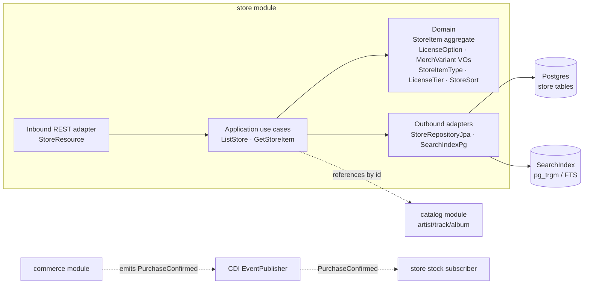
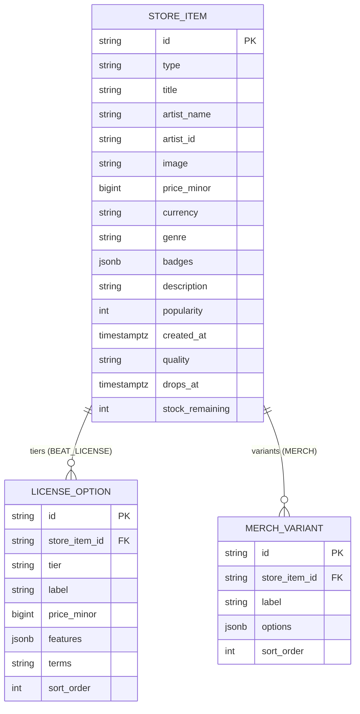
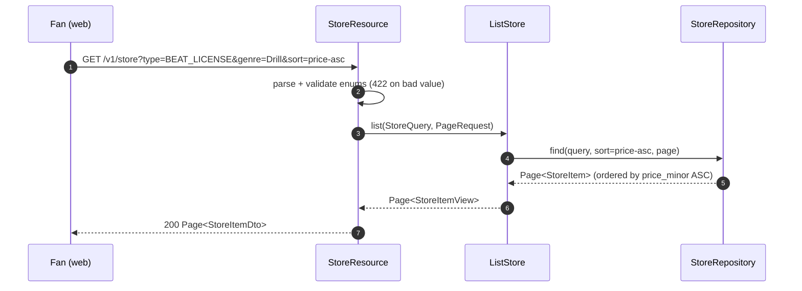
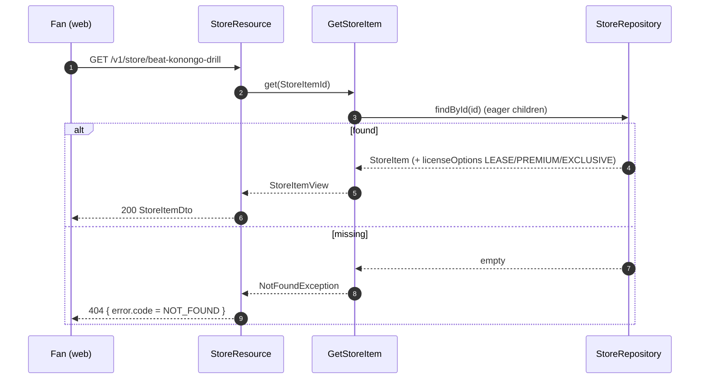

# Architecture Design Doc — `store` (`Music Store / Marketplace`)

> **Status:** Stable · **PRD source:** `BACKEND-PRD.md` §6.7 · **Owning context:** `Music Store / Marketplace` ·
> **Package root:** `org.shakvilla.beatzmedia.store`
>
> This ADD is consumed by Claude Code agents. It is the design contract for the module: an agent
> reads it, plans the listed work units, implements within the stated ports/adapters, writes the
> tests, and opens a PR. Do not invent endpoints or fields not traceable to the PRD / `API-CONTRACT.md`.

## 1. Purpose & responsibilities

The `store` module owns the **public marketplace catalog and product detail**: beats with license
tiers, hi-fi tracks/albums (lossless quality), merch with configurable variants, and exclusives with
drop dates and limited stock. It serves a single filterable, sortable catalog feed and a per-product
detail view matching the frontend `StoreItem` shape. It serves the **Fan** surface only and reads are
**anonymous** (no auth required). It covers **HLFR-STORE-01** (LLFR-STORE-01.1 list, LLFR-STORE-01.2
detail) via work unit **WU-STO-1**.

It explicitly does **not** own: **purchases** (cart, checkout, payment, ledger, fulfilment, ownership
grants — all flow through `commerce` §6.5; this module never mutates money or inventory at sale time),
the **search engine** itself (the `SearchIndex` port is backed by Postgres `pg_trgm`/full-text, shared
with WU-SRCH-1), the canonical artist/album/track records (sourced from `catalog`, WU-CAT-1, and
referenced by id), media/audio delivery (`playback`/`media`), and audit writing. Stock decrement on a
confirmed exclusive/merch purchase is driven by a `commerce` event the store adapter consumes; the
store endpoints themselves are read-only.

## 2. Context & dependencies (C4 component view)



**Dependency rule.** `adapter.in.rest` → `application` → `domain`; outbound adapters implement
`application` output ports; inbound never imports outbound (ArchUnit-enforced). **Cross-module calls:**
the store references `catalog` artist/album/track rows **by id only** (denormalized `artist_name`,
`image` cached on `store_item` for list rendering) and never reaches into another module's tables.
**Persistence is never shared.** **Events:** the store **publishes none**; it **consumes**
`PurchaseConfirmed` (from `commerce`) in an idempotent, order-keyed subscriber to decrement
`stock_remaining` on EXCLUSIVE/MERCH rows. All sale-time money/grant effects live in `commerce`.

## 3. Domain model

**Aggregates / entities / value objects**

| Name | Kind | Key fields | Notes |
|---|---|---|---|
| `StoreItem` | Aggregate root | `id`, `type`, `title`, `artistName`, `artistId?`, `image`, `priceMinor`, `currency`, `genre?`, `badges[]`, `description?`, `popularity?`, `createdAt?`, type-specific children | Catalog product; base/"from" price in minor units. |
| `LicenseOption` | Value object (in StoreItem) | `tier`, `label`, `priceMinor`, `features[]`, `terms?` | BEAT_LICENSE only; ordered LEASE→PREMIUM→EXCLUSIVE. |
| `MerchVariant` | Value object (in StoreItem) | `label`, `options[]` | MERCH only; e.g. `Size = [S,M,L,XL]`. |
| `HiFiQuality` | Value object (in StoreItem) | `quality` (string, e.g. `Lossless • 24-bit/192kHz`) | TRACK/ALBUM only. |
| `ExclusiveDrop` | Value object (in StoreItem) | `dropsAt?`, `stockRemaining?` | EXCLUSIVE (and `stockRemaining` reused for MERCH scarcity). |

**Enums** (lifted verbatim from `Frontend/src/types/index.ts`)

- `StoreItemType = TRACK | ALBUM | BEAT_LICENSE | MERCH | EXCLUSIVE`
- `LicenseTier = LEASE | PREMIUM | EXCLUSIVE`
- `StoreSort = popular | newest | price-asc | price-desc`
- `Genre = Afrobeats | Hiplife | Highlife | Amapiano | Drill | Gospel | R&B | Reggae | Jazz`

**Invariants enforced here** (guard conditions in the domain, not the UI)

- **INV-STORE-A (type/child consistency).** `licenseOptions` is non-empty **iff** `type=BEAT_LICENSE`;
  `variants` present only for `MERCH`; `quality` present only for `TRACK`/`ALBUM`; `dropsAt` present
  only for `EXCLUSIVE`. Mismatched children are rejected at construction.
- **INV-STORE-B ("from" price).** For a BEAT_LICENSE the base `priceMinor` equals the **lowest**
  license-tier price (mirrors `lowestLicensePrice`); the LEASE tier is the cheapest, EXCLUSIVE the
  dearest.
- **INV-STORE-C (stock floor).** `stockRemaining >= 0`; the stock subscriber never decrements below 0
  (a sale on a sold-out item is rejected upstream in `commerce`, never here).



## 4. Application layer (ports)

### 4.1 Input ports (use cases)

```java
// ---- Public marketplace reads (HLFR-STORE-01) — anonymous; no per-caller decoration ----

public interface ListStore {                         // LLFR-STORE-01.1
    Page<StoreItemView> list(StoreQuery query, PageRequest page);

    record StoreQuery(
        Optional<StoreItemType> type,                // ?type=
        Optional<Genre> genre,                       // ?genre=
        StoreSort sort) {}                           // ?sort=  (default popular)
}

public interface GetStoreItem {                      // LLFR-STORE-01.2
    StoreItemView get(StoreItemId id);               // unknown id → NotFoundException (404)
}
```

- **`ListStore`** — *Trigger:* `GET /v1/store`. *Auth:* public (none). *Idempotency:* pure read.
  *Events:* none. Filters by `type` and `genre`; sorts per `StoreSort` (see §5 semantics). Satisfies
  **LLFR-STORE-01.1**.
- **`GetStoreItem`** — *Trigger:* `GET /v1/store/:id`. *Auth:* public. *Idempotency:* pure read.
  *Events:* none. Returns the full `StoreItemView` with type-specific children; unknown id → `404`.
  Satisfies **LLFR-STORE-01.2**.

### 4.2 Output ports

```java
public interface StoreRepository {
    Page<StoreItem> find(StoreQuery query, StoreSort sort, PageRequest page);   // filter + sort + paginate
    Optional<StoreItem> findById(StoreItemId id);                              // detail (eager children)
    void decrementStock(StoreItemId id, int qty);                             // from PurchaseConfirmed subscriber
}

public interface SearchIndex {
    Page<StoreItemId> query(String text, Optional<StoreItemType> type, Optional<Genre> genre,
                            StoreSort sort, PageRequest page);                 // shared with WU-SRCH-1
    void index(StoreItem item);                                               // upsert on create/update
    void remove(StoreItemId id);
}
```

- **`StoreRepository`** — implemented by `StoreRepositoryJpa` (Hibernate over the store tables);
  maps JPA entity ↔ domain; eager-fetches `license_option`/`merch_variant` on detail.
- **`SearchIndex`** — implemented by `SearchIndexPg` (Postgres `pg_trgm`/full-text), shared with
  catalog search (WU-SRCH-1). When a `?q=` text filter is added it routes through this port; pure
  `type`/`genre`/`sort` browse may bypass it and hit `StoreRepository` directly.

## 5. Adapters

### 5.1 Inbound — REST resources

| Method | Path | Auth/scope | Request DTO | Response DTO | Success | Error codes | LLFR |
|---|---|---|---|---|---|---|---|
| GET | `/v1/store?type=&genre=&sort=popular\|newest\|price-asc\|price-desc` | public | query params (`type?`, `genre?`, `sort?`, `page?`, `size?`) | `Page<StoreItemDto>` `{ items, page, size, total }` | `200` | `422` (bad `type`/`sort`/`genre` enum) | LLFR-STORE-01.1 |
| GET | `/v1/store/:id` | public | path `id` | `StoreItemDto` | `200` | `404` (`NOT_FOUND`, unknown id) | LLFR-STORE-01.2 |

Paths/verbs/shapes lifted from `API-CONTRACT.md` §7. **Sort semantics:** `popular` (default) orders by
`popularity` descending (nulls last); `newest` orders by `created_at` descending; `price-asc` /
`price-desc` order by `price_minor` ascending / descending. Pagination per conventions §5
(`page=1`, `size=20`, max `100`). Unknown enum values for `type`/`sort`/`genre` → `422` with
`error.field`.

### 5.2 Outbound — persistence & integrations

`StoreRepositoryJpa` owns all DB access to `store_item`, `license_option`, `merch_variant`; it builds
the filter/sort query with composite indexes (§7) and maps domain ↔ JPA (domain carries no ORM
annotations). `SearchIndexPg` fulfils text queries against the shared Postgres FTS/`pg_trgm` index.
**No external clients** (no payment/S3/SMTP — those are `commerce`/`media`). The
`PurchaseConfirmedSubscriber` (inbound messaging adapter) consumes `commerce`'s after-commit event and
calls `StoreRepository.decrementStock`, keyed by `orderId` for idempotency. **Transaction boundary** =
the use case (`@Transactional` on the application service impl); reads run read-only.

## 6. DTOs & API shapes

All field shapes trace to `Frontend/src/types/index.ts`. Money is serialized `{ amount, currency }`
(cedis from `*_minor`, conversion at the adapter); timestamps are ISO-8601.

**`StoreItemDto`** (response — both list and detail; type-specific fields populated by `type`)

| Field | Type | Notes |
|---|---|---|
| `id` | string | opaque id |
| `type` | `StoreItemType` | `TRACK\|ALBUM\|BEAT_LICENSE\|MERCH\|EXCLUSIVE` |
| `title` | string | |
| `artistName` | string | denormalized from `catalog` |
| `artistId` | string? | when linked to a catalog artist |
| `image` | string | cover art URL |
| `price` | `Money` | `{ amount, currency }` base/"from" price |
| `genre` | `Genre?` | |
| `badges` | string[]? | e.g. `HI-FI LOSSLESS`, `STEMS INCLUDED`, `LIMITED` |
| `description` | string? | |
| `popularity` | number? | ranking weight for `popular` sort |
| `createdAt` | string? | ISO; ranking key for `newest` sort |
| `licenseOptions` | `LicenseOption[]?` | **BEAT_LICENSE** only |
| `variants` | `MerchVariant[]?` | **MERCH** only |
| `quality` | string? | **TRACK/ALBUM** (hi-fi) only |
| `dropsAt` | string? | **EXCLUSIVE** only (ISO drop date) |
| `stockRemaining` | number? | **EXCLUSIVE / MERCH** scarcity |

**`LicenseOption`** — `{ tier: LicenseTier, label: string, price: Money, features: string[], terms?: string }`

**`MerchVariant`** — `{ label: string, options: string[] }`

## 7. Persistence schema & migrations

```sql
CREATE TABLE store_item (
    id              VARCHAR(40)  PRIMARY KEY,
    type            VARCHAR(16)  NOT NULL,            -- StoreItemType
    title           VARCHAR(200) NOT NULL,
    artist_name     VARCHAR(200) NOT NULL,
    artist_id       VARCHAR(40),                      -- ref to catalog artist (no cross-module FK)
    image           TEXT         NOT NULL,
    price_minor     BIGINT       NOT NULL CHECK (price_minor >= 0),
    currency        VARCHAR(3)   NOT NULL DEFAULT 'GHS',
    genre           VARCHAR(16),
    badges          JSONB        NOT NULL DEFAULT '[]',
    description     TEXT,
    popularity      INTEGER,
    created_at      TIMESTAMPTZ  NOT NULL DEFAULT now(),
    quality         VARCHAR(64),                      -- TRACK/ALBUM hi-fi
    drops_at        TIMESTAMPTZ,                      -- EXCLUSIVE
    stock_remaining INTEGER      CHECK (stock_remaining >= 0)
);

CREATE TABLE license_option (
    id            VARCHAR(40)  PRIMARY KEY,
    store_item_id VARCHAR(40)  NOT NULL REFERENCES store_item(id) ON DELETE CASCADE,
    tier          VARCHAR(16)  NOT NULL,              -- LicenseTier
    label         VARCHAR(80)  NOT NULL,
    price_minor   BIGINT       NOT NULL CHECK (price_minor >= 0),
    features      JSONB        NOT NULL DEFAULT '[]',
    terms         VARCHAR(200),
    sort_order    SMALLINT     NOT NULL DEFAULT 0,
    UNIQUE (store_item_id, tier)
);

CREATE TABLE merch_variant (
    id            VARCHAR(40)  PRIMARY KEY,
    store_item_id VARCHAR(40)  NOT NULL REFERENCES store_item(id) ON DELETE CASCADE,
    label         VARCHAR(80)  NOT NULL,
    options       JSONB        NOT NULL DEFAULT '[]',
    sort_order    SMALLINT     NOT NULL DEFAULT 0
);

-- filter + sort support (one index per documented filter/sort key)
CREATE INDEX idx_store_item_type        ON store_item (type);
CREATE INDEX idx_store_item_genre       ON store_item (genre);
CREATE INDEX idx_store_item_popularity  ON store_item (popularity DESC NULLS LAST);  -- sort=popular
CREATE INDEX idx_store_item_created_at  ON store_item (created_at DESC);             -- sort=newest
CREATE INDEX idx_store_item_price_minor ON store_item (price_minor);                -- sort=price-asc/desc
CREATE INDEX idx_store_item_stock       ON store_item (stock_remaining) WHERE stock_remaining IS NOT NULL;
CREATE INDEX idx_license_option_item    ON license_option (store_item_id);
CREATE INDEX idx_merch_variant_item     ON merch_variant (store_item_id);
```

**Flyway migration list** (`src/main/resources/db/migration/`, forward-only):

- `V<n>__create_store_item.sql` — `store_item` table + filter/sort indexes.
- `V<n+1>__create_license_option.sql` — `license_option` table + index + `(store_item_id, tier)` unique.
- `V<n+2>__create_merch_variant.sql` — `merch_variant` table + index.
- `R__seed_dev_data.sql` (repeatable, dev/test) — contributes the catalog from
  `Frontend/src/lib/store-data.ts` (hi-fi, beats with `licenseLadder`, merch, exclusives).

## 8. Key flows





## 9. Cross-cutting hooks

- **Auth/scope.** All endpoints are **public reads** — no JWT required; no per-caller ownership/price
  decoration (purchases are decided in `commerce`).
- **Search index integration.** Browse by `type`/`genre`/`sort` hits `StoreRepository`; a future `?q=`
  text filter routes through the shared `SearchIndex` (WU-SRCH-1). Index upsert/remove happens when the
  seed (or future admin write) creates/updates an item.
- **Idempotency.** No money POSTs in this module. The `PurchaseConfirmed` subscriber is idempotent,
  keyed by `orderId`, and never drives `stock_remaining` below 0 (INV-STORE-C).
- **Error model.** Uniform envelope (conventions §4): unknown id → `404 NOT_FOUND`; invalid enum filter
  → `422` with `error.field`. No stack traces/SQL/PII in `message`.
- **Observability.** Micrometer counters/latency on `store.list`/`store.detail`, label by `sort`/`type`;
  OpenTelemetry span per request with trace id (conventions §9). No PII.

## 10. Work units & build order

| WU | LLFR coverage | Depends on | Order | Notes |
|---|---|---|---|---|
| **WU-STO-1** | LLFR-STORE-01.1, LLFR-STORE-01.2 | WU-CAT-1 (artist/track refs), WU-SRCH-1 (`SearchIndex`) | after catalog + search are buildable | Build `store_item`/`license_option`/`merch_variant` + Flyway, `StoreRepository`/`SearchIndex` adapters, `ListStore`/`GetStoreItem`, `StoreResource`, seed from `store-data.ts`, stock subscriber. |

Cross-reference PRD §8 (work-unit catalogue). Build order: schema + migrations → domain
(`StoreItem` + VOs + invariants) → output adapters → use cases → REST adapter → seed → stock subscriber.

## 11. Testing plan

- **Unit (domain/use-case, fakes).** `StoreItem` construction enforces INV-STORE-A/B/C; `ListStore`
  sort comparators (`popular`/`newest`/`price-asc`/`price-desc`) against an in-memory fake repository;
  `GetStoreItem` throws `NotFoundException` for an unknown id.
- **Integration (Testcontainers Postgres, REST-assured).** Seeded catalog; `GET /v1/store` filter/sort
  combinations; `GET /v1/store/:id` for each type; `404` on unknown id; index coverage for each sort key.
- **Contract.** Responses validate against `Frontend/src/types` `StoreItem`/`LicenseOption`/`MerchVariant`
  (OpenAPI contract test green).

**Acceptance (PRD §6.7 Given/When/Then):**

- **LLFR-STORE-01.1** — *Given* `GET /v1/store?sort=price-asc` *When* the catalog is served *Then* items
  are ordered by **ascending** `price.amount` (`price_minor`).
- **LLFR-STORE-01.2** — *Given* a beat product (`type=BEAT_LICENSE`, e.g. `beat-konongo-drill`) *When*
  `GET /v1/store/:id` *Then* `licenseOptions` carries **LEASE / PREMIUM / EXCLUSIVE** tiers each with a
  price; *and* unknown id → `404`.

**Coverage:** meets the gate in `sdlc/testing-strategy.md`.

## 12. Definition of done (module-specific)

Global DoD (conventions §11 / PRD §8) **plus**:

- Sort semantics verified: `popular`→`popularity DESC`, `newest`→`created_at DESC`, `price-asc/desc`→
  `price_minor` ASC/DESC, each backed by an index (no full-table sort).
- Type/child consistency (INV-STORE-A) holds: only the type-appropriate children are persisted/returned.
- BEAT_LICENSE base price = lowest license tier (INV-STORE-B); `stock_remaining` never negative
  (INV-STORE-C).
- All reads public (no auth leak); module publishes no events and mutates no money (purchases remain in
  `commerce`).
- Response bodies validate against `StoreItem`/`LicenseOption`/`MerchVariant` frontend types.
