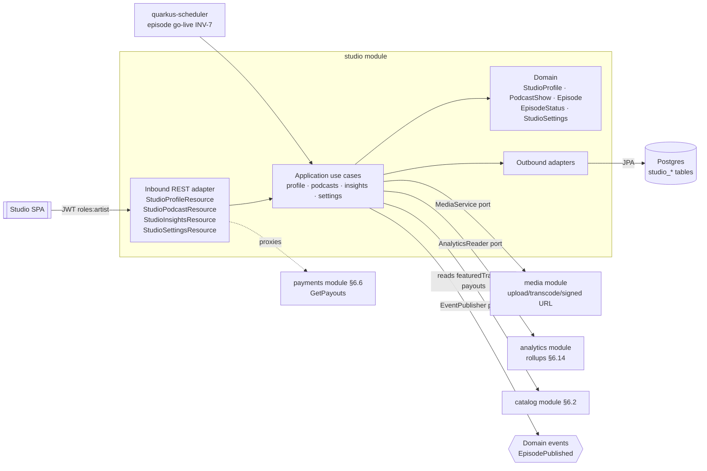
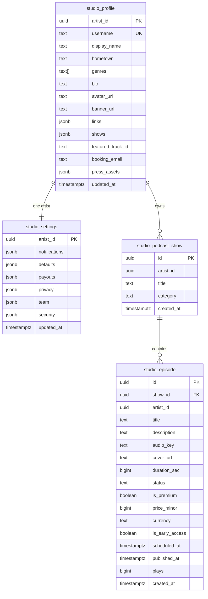
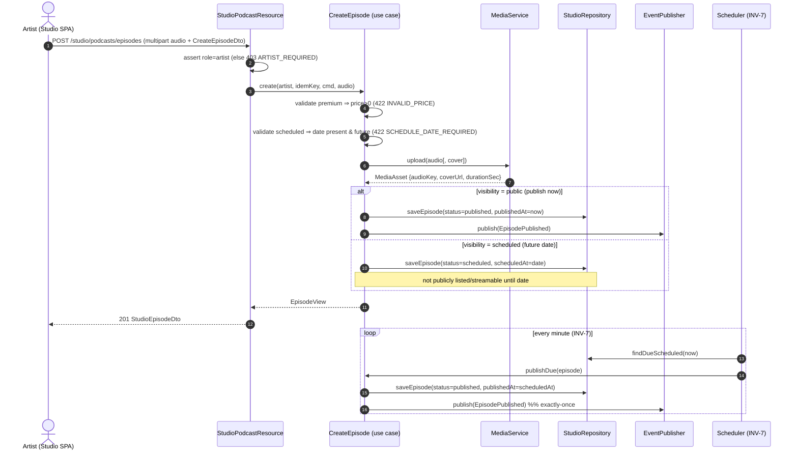
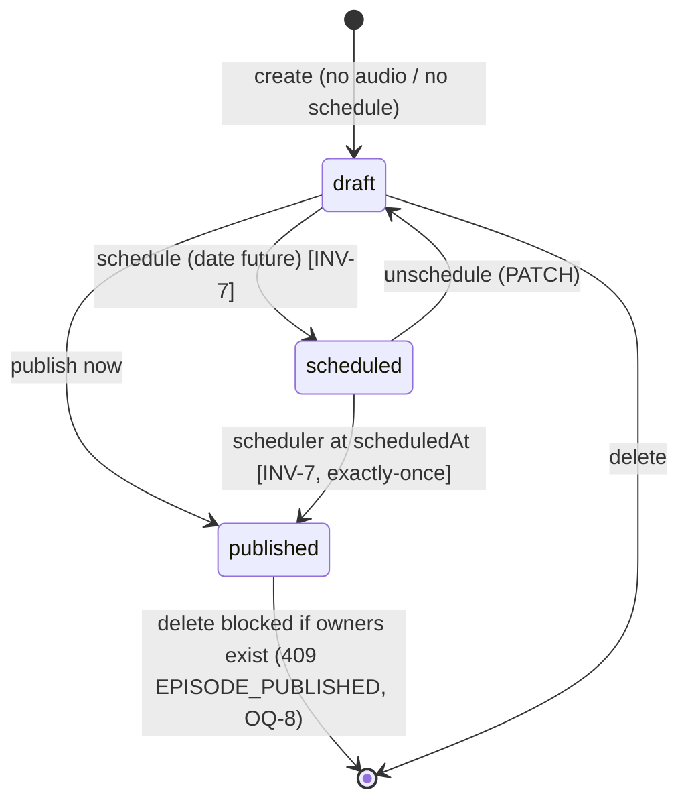

# Architecture Design Doc — `studio` (`Creator Studio`)

> **Status:** Stable · **PRD source:** `BACKEND-PRD.md` §6.11 · **Owning context:** `studio` ·
> **Package root:** `org.shakvilla.beatzmedia.studio`
>
> This ADD is consumed by Claude Code agents. It is the design contract for the module: an agent
> reads it, plans the listed work units, implements within the stated ports/adapters, writes the
> tests, and opens a PR. Do not invent endpoints or fields not traceable to the PRD / `API-CONTRACT.md`.

## 1. Purpose & responsibilities

The `studio` module is the **creator-facing aggregation and creator-owned configuration** context. It
**owns** the creator's public profile (`studio_profile`), studio settings (`studio_settings`), and the
creator side of podcasts (`studio_podcast_show`, `studio_episode`). It manages podcast shows and
episodes (free / premium / early-access; publish-now or schedule per INV-7), serves insights and
audience analytics reads (delegating computation to the `analytics` module via `AnalyticsReader`),
exposes a payouts view (delegating entirely to `payments` §6.6, LLFR-PAYMENTS-02.2), and persists
studio settings. It explicitly does **not** own: releases/tracks (those live in `catalog` §6.2 and are
only referenced by id for `featuredTrackId`), the analytics rollups themselves (`analytics` §6.14),
money/ledger/withdrawals (`payments` §6.6), or media bytes/transcoding (`media` §6.4 via
`MediaService`). All surfaces are **Studio** (creator). **Every endpoint requires the `artist` role**
(403 `ARTIST_REQUIRED`) and re-checks resource ownership in the application layer.
**HLFRs covered:** HLFR-STUDIO-01, HLFR-STUDIO-02, HLFR-STUDIO-03, HLFR-STUDIO-04.

## 2. Context & dependencies (C4 component view)



**Dependency rule.** Domain depends on nothing; application depends only on input/output port
interfaces; adapters depend inward. The module **calls other modules only through input ports** it
holds as output-port references (`MediaService` → `media`, `AnalyticsReader` → `analytics`, payouts →
`payments`'s `GetPayouts`). **Persistence is never shared:** `featuredTrackId` and payout/earnings data
are referenced by id and resolved via ports, never via cross-module foreign keys.
**Events published:** `EpisodePublished` (after a successful publish-now transaction, and again from the
scheduler at the scheduled instant). **Events consumed:** none directly; the scheduler triggers the
publish use case for due `scheduled` episodes.

## 3. Domain model

| Name | Kind | Key fields | Notes |
|------|------|-----------|-------|
| `StudioProfile` | Aggregate root | `artistId`, `username`, `displayName`, `genres`, `bio`, `links`, `shows`, `featuredTrackId` | One per artist; `username` globally unique & slug-safe. |
| `StudioSettings` | Aggregate root | `artistId`, `notifications`, `defaults`, `payouts`, `privacy`, `team`, `security` | One per artist; large structured JSON config. |
| `PodcastShow` | Aggregate root | `id`, `artistId`, `title`, `category` | Creator-owned show grouping episodes. |
| `Episode` | Aggregate root | `id`, `showId`, `artistId`, `title`, `status`, `premium`, `priceMinor`, `durationSec`, `scheduledAt`, `publishedAt` | Lifecycle via `EpisodeStatus`; `premium ⇒ priceMinor > 0`. |
| `EpisodeStatus` | Enum (sealed) | `draft`, `scheduled`, `published` | Lifted from `studio-data.ts` `EpisodeStatus`. |
| `ShowAppearance` | Value object | `id`, `venue`, `date`, `city` | Embedded in `StudioProfile.shows`. |
| `PressAsset` | Value object | `id`, `name`, `url` | Embedded in `StudioProfile.pressAssets`. |
| `TeamMember` | Value object | `id`, `name`, `email`, `role` | Embedded in `StudioSettings.team`; role ∈ {Owner, Manager, Label, Invited}. |
| `Money` | Kernel VO | `minor`, `currency` | Episode price; minor units (pesewas). |

**Enums** (verbatim from `Frontend/src/lib/studio-data.ts` / `studio-analytics.ts`):
- `EpisodeStatus = published | scheduled | draft`
- `AnalyticsRange = 7d | 28d | 90d | 12m | all`
- `AudienceRange = 7d | 28d | 90d | 12m`
- `MetricKey = streams | sales | followers | tips`
- `TeamMember.role = Owner | Manager | Label | Invited`
- `Genre` (reused from `catalog` taxonomy; `genres ⊆ Genre`).

**Invariants enforced here:**
- **INV-7 (Scheduled go-live):** a `scheduled` episode is not publicly listed/streamable before its
  `scheduledAt`; a scheduler transitions it to `published` exactly once at that instant.
- **Premium ⇒ price > 0:** `premium == true` requires `priceMinor > 0` (422 `INVALID_PRICE`).
- **Unique username:** `username` is globally unique, slug-safe (409 `USERNAME_TAKEN`).
- **Ownership:** every show/episode/profile/settings mutation is scoped to `artistId == caller.sub`.
- **INV-11 (money precision):** episode price stored in minor units; cedis ↔ minor at adapter boundary.



## 4. Application layer (ports)

### 4.1 Input ports (use cases)

```java
public interface GetStudioProfile {
    StudioProfileView get(ArtistId artist);
}

public interface SaveStudioProfile {
    StudioProfileView save(ArtistId artist, SaveStudioProfileCommand cmd);
}

public interface ListStudioPodcastShows {
    List<PodcastShowView> list(ArtistId artist);
}

public interface CreatePodcastShow {
    PodcastShowView create(ArtistId artist, CreatePodcastShowCommand cmd);
}

public interface ListStudioEpisodes {
    List<EpisodeView> list(ArtistId artist);
}

public interface CreateEpisode {
    EpisodeView create(ArtistId artist, IdempotencyKey key, CreateEpisodeCommand cmd, AudioUpload audio);
}

public interface UpdateEpisode {
    EpisodeView update(ArtistId artist, EpisodeId id, UpdateEpisodeCommand cmd);
}

public interface DeleteEpisode {
    void delete(ArtistId artist, EpisodeId id);
}

public interface GetAnalytics {
    AnalyticsView get(ArtistId artist, AnalyticsRange range);
}

public interface GetAudience {
    AudienceView get(ArtistId artist, AudienceRange range);
}

public interface GetStudioSettings {
    StudioSettingsView get(ArtistId artist);
}

public interface SaveStudioSettings {
    StudioSettingsView save(ArtistId artist, SaveStudioSettingsCommand cmd);
}
```

| Port | Trigger | Auth | Idempotency | Events | LLFR |
|------|---------|------|-------------|--------|------|
| `GetStudioProfile` | `GET /studio/profile` | artist | read | — | STUDIO-01.1 |
| `SaveStudioProfile` | `PUT /studio/profile` | artist (owner) | natural (upsert) | — | STUDIO-01.1 |
| `ListStudioPodcastShows` | `GET /studio/podcasts/shows` | artist | read | — | STUDIO-02.1 |
| `CreatePodcastShow` | `POST /studio/podcasts/shows` | artist | — | — | STUDIO-02.1 |
| `ListStudioEpisodes` | `GET /studio/podcasts/episodes` | artist | read | — | STUDIO-02.2 |
| `CreateEpisode` | `POST /studio/podcasts/episodes` | artist | `Idempotency-Key` | `EpisodePublished` (now) or scheduled (INV-7) | STUDIO-02.3 |
| `UpdateEpisode` | `PATCH /studio/podcasts/episodes/:id` | owning artist | — | `EpisodePublished` if draft→publish | STUDIO-02.4 |
| `DeleteEpisode` | `DELETE /studio/podcasts/episodes/:id` | owning artist | natural | — | STUDIO-02.4 |
| `GetAnalytics` | `GET /studio/analytics` | artist | read | — | STUDIO-03.1 |
| `GetAudience` | `GET /studio/audience` | artist | read | — | STUDIO-03.2 |
| `GetStudioSettings` | `GET /studio/settings` | artist | read | — | STUDIO-04.2 |
| `SaveStudioSettings` | `PUT /studio/settings` | artist (owner) | natural (upsert) | — | STUDIO-04.2 |

### 4.2 Output ports

```java
public interface StudioRepository {
    Optional<StudioProfile> findProfile(ArtistId artist);
    boolean usernameTaken(String username, ArtistId excluding);
    StudioProfile saveProfile(StudioProfile profile);
    Optional<StudioSettings> findSettings(ArtistId artist);
    StudioSettings saveSettings(StudioSettings settings);
    List<PodcastShow> findShows(ArtistId artist);
    PodcastShow saveShow(PodcastShow show);
    Optional<PodcastShow> findShow(ArtistId artist, ShowId id);
    List<Episode> findEpisodes(ArtistId artist);
    Optional<Episode> findEpisode(ArtistId artist, EpisodeId id);
    List<Episode> findDueScheduled(Instant now);
    Episode saveEpisode(Episode episode);
    void deleteEpisode(EpisodeId id);
}

public interface AnalyticsReader {
    AnalyticsView readAnalytics(ArtistId artist, AnalyticsRange range);
    AudienceView readAudience(ArtistId artist, AudienceRange range);
}

public interface MediaService {
    MediaAsset upload(AudioUpload audio);   // validate + transcode + store; returns audio_key + durationSec
}

public interface EventPublisher {
    void publish(DomainEvent event);        // AFTER_SUCCESS
}
```

| Output port | Implementing outbound adapter |
|-------------|-------------------------------|
| `StudioRepository` | JPA persistence adapter `adapter.out.persistence.StudioRepositoryJpa` over the `studio_*` tables. |
| `AnalyticsReader` | In-process call into `analytics` module's read port `adapter.out.analytics.AnalyticsReaderAdapter`. |
| `MediaService` | In-process call into `media` module's upload pipeline `adapter.out.media.MediaServiceAdapter` (S3/MinIO + transcoder). |
| `EventPublisher` | CDI event bus / outbox `adapter.out.events.EventPublisherAdapter` (publishes `AFTER_SUCCESS`). |

> `Clock` and `IdGenerator` are imported from the kernel (`platform`).

## 5. Adapters

### 5.1 Inbound — REST resources

Base path `/v1`. All endpoints require `Authorization: Bearer <jwt>` with `roles` containing `artist`
(else **403 `ARTIST_REQUIRED`**). DTOs are records validated by Hibernate Validator.

| Method · Path | Auth | Request DTO | Response DTO | Success | Error codes | LLFR |
|---------------|------|-------------|--------------|---------|-------------|------|
| `GET /studio/profile` | artist | — | `StudioProfileDto` | 200 | 401, 403 `ARTIST_REQUIRED` | STUDIO-01.1 |
| `PUT /studio/profile` | artist (owner) | `SaveStudioProfileDto` | `StudioProfileDto` | 200 | 403 `ARTIST_REQUIRED`, 409 `USERNAME_TAKEN`, 422 `INVALID_GENRE` | STUDIO-01.1 |
| `GET /studio/podcasts/shows` | artist | — | `StudioPodcastShowDto[]` | 200 | 401, 403 | STUDIO-02.1 |
| `POST /studio/podcasts/shows` | artist | `CreateShowDto {title,category}` | `StudioPodcastShowDto` | 201 | 403, 422 `VALIDATION` | STUDIO-02.1 |
| `GET /studio/podcasts/episodes` | artist | — | `StudioEpisodeDto[]` | 200 | 401, 403 | STUDIO-02.2 |
| `POST /studio/podcasts/episodes` | artist | `multipart`: `audio` + `CreateEpisodeDto` | `StudioEpisodeDto` | 201 | 403, 404 `SHOW_NOT_FOUND`, 422 `INVALID_PRICE`, 422 `SCHEDULE_DATE_REQUIRED`, 422 `MEDIA_INVALID` | STUDIO-02.3 |
| `PATCH /studio/podcasts/episodes/:id` | owning artist | `UpdateEpisodeDto` | `StudioEpisodeDto` | 200 | 403, 404 `EPISODE_NOT_FOUND`, 409 `ILLEGAL_TRANSITION`, 422 `INVALID_PRICE` | STUDIO-02.4 |
| `DELETE /studio/podcasts/episodes/:id` | owning artist | — | — | 204 | 403, 404 `EPISODE_NOT_FOUND`, 409 `EPISODE_PUBLISHED` | STUDIO-02.4 |
| `GET /studio/analytics?range=7d\|28d\|90d\|12m\|all` | artist | query `range` | `AnalyticsDto` | 200 | 403, 422 `INVALID_RANGE` | STUDIO-03.1 |
| `GET /studio/audience?range=7d\|28d\|90d\|12m` | artist | query `range` | `AudienceDto` | 200 | 403, 422 `INVALID_RANGE` | STUDIO-03.2 |
| `GET /studio/payouts` | artist | — | `PayoutsDto` (see payments) | 200 | 403 | STUDIO-04.1 |
| `GET /studio/settings` | artist | — | `StudioSettingsDto` | 200 | 401, 403 | STUDIO-04.2 |
| `PUT /studio/settings` | artist (owner) | `SaveStudioSettingsDto` | `StudioSettingsDto` | 200 | 403, 422 `VALIDATION` | STUDIO-04.2 |

> **`GET /studio/payouts`** is a thin cross-module proxy: the resource calls `payments`'
> `GetPayouts(artistId)` input port (LLFR-PAYMENTS-02.2) and returns its DTO unchanged. The shape
> (`available, pending, thisMonth, thisMonthDelta, lifetime, since, earnings[], bySource, methods[],
> transactions[]`) is **owned and documented by `payments`** — see `architecture/payments.md`. This
> module adds no fields.

### 5.2 Outbound — persistence & integrations

- **`StudioRepositoryJpa`** maps domain ↔ JPA entities (`StudioProfileEntity`, `StudioSettingsEntity`,
  `PodcastShowEntity`, `EpisodeEntity`). Embedded value collections (`shows`, `pressAssets`, `team`,
  `notifications`, `defaults`, `payouts`, `privacy`, `security`) persist as `jsonb`. Domain objects
  carry no ORM annotations. `findDueScheduled(now)` indexes on `(status, scheduled_at)`.
- **`MediaServiceAdapter`** forwards multipart audio (and optional cover) to the `media` pipeline:
  validate format → transcode → store → return `audio_key`, `cover_url`, and computed `durationSec`.
  Bytes never touch the `studio` DB; only keys/URLs are stored.
- **`AnalyticsReaderAdapter`** reads precomputed rollups from `analytics` (no recomputation in `studio`).
- **`EventPublisherAdapter`** publishes `EpisodePublished` via the platform outbox `AFTER_SUCCESS`.
- **Transaction boundary** = the application service method (`@Transactional` on the use-case impl).
  The media upload happens **before** the DB transaction commits the episode row, so a failed upload
  yields no orphaned `draft`.

## 6. DTOs & API shapes

Money is `{ amount: <decimal cedis>, currency: "GHS" }`; durations are whole **seconds**; timestamps
are ISO-8601. Field lists trace to `Frontend/src/lib/studio-data.ts` and `studio-analytics.ts`.

**`StudioProfileDto`** (`SaveStudioProfileDto` = same minus server-managed):
`displayName`, `username`, `hometown`, `genres: string[]`, `bio`, `avatar: string|null`,
`banner: string|null`, `links: { instagram, twitter, youtube, website }`,
`shows: { id, venue, date, city }[]`, `featuredTrackId: string|null`, `bookingEmail`,
`pressAssets: { id, name, url }[]`.

**`StudioPodcastShowDto`:** `id`, `title`, `category`.

**`StudioEpisodeDto`:** `id`, `showId`, `showTitle`, `title`, `duration` (seconds),
`status: published|scheduled|draft`, `premium: boolean`, `price` (cedis; 0 when free),
`publishedAt`, `plays`.

**`CreateEpisodeDto`** (multipart sibling of `audio`): `showId | newShow{title,category}`, `title`,
`description`, `cover?`, `visibility: public|scheduled`, `date?` (ISO; required & future when
scheduled), `premium: boolean`, `price?` (cedis; required >0 when premium), `earlyAccess?: boolean`.

**`UpdateEpisodeDto`** (all optional, PATCH semantics): `title?`, `description?`, `premium?`,
`price?`, `visibility?`, `date?`, `earlyAccess?`.

**`AnalyticsDto`:** `rangeLabel`, `axisLabel`, `labels: string[]`,
`metrics: { streams, sales, followers, tips }` where each = `{ total, delta, current[], previous[] }`,
`fans`, `countries: { name, value }[]`, `topTracks: { title, streams, revenue }[]`,
`ages: { label, value }[]`, `revenue: { sales, streaming, tips }`,
`engagement: { completion, save, skip }`, `sources: { name, pct }[]`.

**`AudienceDto`:** `rangeLabel`, `monthlyListeners`, `listenersDelta`, `followers`, `followersGained`,
`followersPeriod`, `superfans`, `avgSessionSec`, `avgSessionDelta`, `cities: { name, value }[]`,
`gender: { male, female, other }`, `ages: { label, value }[]`,
`superfansList: { handle, initial, tracks, tipped }[]`.

**`StudioSettingsDto`** (`SaveStudioSettingsDto` mirrors writable fields): `email`, `phone`, `country`,
`language`, `timezone`, `twoFactor`, `sessions: { id, device, location, lastActive, current }[]`,
`connectedApps: { id, name, description, connected }[]`,
`verification: { artist, identity, payout, rights }`, `billing: { plan, price, renews }`,
`notifications: { sales, tips, followers, payouts, weeklySummary, comments, marketing }`,
`defaults: { trackPrice, releaseVisibility: public|scheduled, autoExplicit, allowOffers }`,
`payouts: { autoWithdraw, autoWithdrawThreshold, taxId }`,
`privacy: { discoverable, showRealName, acceptBookings, allowDms }`,
`team: { id, name, email, role }[]`.

## 7. Persistence schema & migrations

```sql
-- V<n>__studio_profile.sql
CREATE TABLE studio_profile (
    artist_id         UUID PRIMARY KEY,
    username          TEXT NOT NULL,
    display_name      TEXT NOT NULL,
    hometown          TEXT,
    genres            TEXT[] NOT NULL DEFAULT '{}',
    bio               TEXT,
    avatar_url        TEXT,
    banner_url        TEXT,
    links             JSONB NOT NULL DEFAULT '{}',
    shows             JSONB NOT NULL DEFAULT '[]',
    featured_track_id TEXT,            -- id only; resolved via catalog port (no FK)
    booking_email     TEXT,
    press_assets      JSONB NOT NULL DEFAULT '[]',
    updated_at        TIMESTAMPTZ NOT NULL DEFAULT now()
);
CREATE UNIQUE INDEX ux_studio_profile_username ON studio_profile (lower(username));

-- V<n+1>__studio_settings.sql
CREATE TABLE studio_settings (
    artist_id      UUID PRIMARY KEY,
    notifications  JSONB NOT NULL DEFAULT '{}',
    defaults       JSONB NOT NULL DEFAULT '{}',
    payouts        JSONB NOT NULL DEFAULT '{}',
    privacy        JSONB NOT NULL DEFAULT '{}',
    team           JSONB NOT NULL DEFAULT '[]',
    security       JSONB NOT NULL DEFAULT '{}',
    updated_at     TIMESTAMPTZ NOT NULL DEFAULT now()
);

-- V<n+2>__studio_podcast_show.sql
CREATE TABLE studio_podcast_show (
    id          UUID PRIMARY KEY,
    artist_id   UUID NOT NULL,
    title       TEXT NOT NULL,
    category    TEXT NOT NULL,
    created_at  TIMESTAMPTZ NOT NULL DEFAULT now()
);
CREATE INDEX ix_studio_show_artist ON studio_podcast_show (artist_id);

-- V<n+3>__studio_episode.sql
CREATE TABLE studio_episode (
    id              UUID PRIMARY KEY,
    show_id         UUID NOT NULL REFERENCES studio_podcast_show (id),
    artist_id       UUID NOT NULL,
    title           TEXT NOT NULL,
    description     TEXT,
    audio_key       TEXT,
    cover_url       TEXT,
    duration_sec    BIGINT NOT NULL DEFAULT 0,
    status          TEXT NOT NULL DEFAULT 'draft'
                    CHECK (status IN ('draft','scheduled','published')),
    is_premium      BOOLEAN NOT NULL DEFAULT false,
    price_minor     BIGINT NOT NULL DEFAULT 0,
    currency        TEXT NOT NULL DEFAULT 'GHS',
    is_early_access BOOLEAN NOT NULL DEFAULT false,
    scheduled_at    TIMESTAMPTZ,
    published_at    TIMESTAMPTZ,
    plays           BIGINT NOT NULL DEFAULT 0,
    created_at      TIMESTAMPTZ NOT NULL DEFAULT now(),
    CONSTRAINT chk_premium_price CHECK (NOT is_premium OR price_minor > 0)
);
CREATE INDEX ix_studio_episode_artist  ON studio_episode (artist_id);
CREATE INDEX ix_studio_episode_show    ON studio_episode (show_id);
CREATE INDEX ix_studio_episode_due     ON studio_episode (status, scheduled_at);
```

**Flyway list** (forward-only, `src/main/resources/db/migration/`):
- `V<n>__studio_profile.sql`
- `V<n+1>__studio_settings.sql`
- `V<n+2>__studio_podcast_show.sql`
- `V<n+3>__studio_episode.sql`
- `R__seed_dev_data.sql` (repeatable; contributes a dev profile + show + episodes mirroring
  `studio-data.ts`, dev/test only).

> No FK from `featured_track_id` to `catalog` tables (cross-module FKs forbidden). `studio_profile`
> and `studio_settings` share `artist_id` as their key but no FK to `idn`'s tables.

## 8. Key flows





## 9. Cross-cutting hooks

- **Auth / scope.** Every resource enforces `roles ∋ artist` in the REST adapter (filter/annotation) →
  **403 `ARTIST_REQUIRED`**. The application layer **re-checks resource ownership** (`artistId ==
  jwt.sub`) for every profile/settings/show/episode read and mutation; a foreign resource returns
  **404** (hide existence) for reads and **403** for mutations.
- **EpisodePublished event / scheduled go-live (INV-7).** Publish-now emits `EpisodePublished`
  `AFTER_SUCCESS`. Scheduled episodes are flipped to `published` by a `quarkus-scheduler` job
  (`PLATFORM-01.2`) reading `findDueScheduled(now)`; the transition is **exactly-once** (guarded by the
  `status='scheduled'` predicate in the update) and re-emits `EpisodePublished`. Before go-live the
  episode is never publicly listed or streamable.
- **Premium ⇒ price > 0.** Validated in the use case **and** enforced by the DB
  `chk_premium_price` constraint (422 `INVALID_PRICE`).
- **USERNAME_TAKEN.** `SaveStudioProfile` checks `usernameTaken(username, excludingSelf)` and the unique
  index on `lower(username)` backstops the race → **409 `USERNAME_TAKEN`** (field `username`).
- **Idempotency.** `POST /studio/podcasts/episodes` requires an `Idempotency-Key` header; a replay
  returns the same created episode with no second media upload.
- **Audit (INV-10).** Settings changes are privileged mutations: `SaveStudioSettings` appends exactly
  one `AuditEntry` (`settings change`). Episode publish/delete are recorded similarly.
- **Error model.** Uniform envelope `{ error: { code, message, field? } }`; codes are stable
  `SCREAMING_SNAKE_CASE`; one `ExceptionMapper` per family maps domain exceptions → envelope.
- **Observability.** Micrometer counters (`studio.episode.created`, `studio.episode.published`,
  `studio.profile.saved`) and timers on analytics/audience reads; OTel spans across the
  `MediaService`/`AnalyticsReader`/`payments` boundary calls; no PII in logs.

## 10. Work units & build order

| WU | Scope | LLFR coverage | Tables | Depends on |
|----|-------|---------------|--------|------------|
| **WU-STU-1** | Studio profile get/save; `USERNAME_TAKEN`; genre validation | STUDIO-01.1 | `studio_profile` | WU-IDN-3 |
| **WU-STU-2** | Podcast shows + episodes create/manage; premium/early-access; publish-now/schedule; delete guard | STUDIO-02.1–02.4 | `studio_podcast_show`, `studio_episode` | WU-MED-1 (`MediaService`), WU-POD-1 |
| **WU-STU-3** | Analytics + audience reads over ranges via `AnalyticsReader` | STUDIO-03.1–03.2 | (reads rollups) | WU-ANA-1 |
| **WU-STU-4** | Studio settings get/save (notifications, defaults, payouts, privacy, team, security) | STUDIO-04.2 | `studio_settings` | WU-IDN-3 |

Supporting WUs consumed via ports: **WU-MED-1** (media upload→transcode→signed URL; `MediaService`),
**WU-ANA-1** (analytics rollups; `AnalyticsReader`), **WU-PAY-4** (payouts view via `payments`
`GetPayouts`, surfaced by `GET /studio/payouts`).

**Recommended order** (PRD §8): WU-STU-1 → WU-STU-2 (after WU-MED-1) → WU-ANA-1 → WU-STU-3 →
WU-STU-4. WU-PAY-4 lands the payouts proxy independently in `payments`.

## 11. Testing plan

**Unit (domain + use cases with fakes).** `EpisodeStatus` transitions; premium⇒price guard; username
uniqueness logic; visibility/date validation; cedis↔minor conversion at the boundary. Fakes for
`StudioRepository`, `MediaService`, `AnalyticsReader`, `EventPublisher`, fixed `Clock`.

**Integration (Testcontainers Postgres + MinIO, REST-assured).** Full multipart create-episode through
the real persistence + media pipeline; scheduler go-live; `PUT /studio/profile` username collision
(409); artist-role enforcement (403 on a fan JWT); analytics/audience range filtering.

**Contract.** All responses validate against frontend types (`StudioProfile`, `StudioEpisode`,
`StudioSettings`, `Analytics`, `Audience`) and `API-CONTRACT.md` §11 (OpenAPI contract test green).

**Key Given/When/Then (PRD §6.11):**
1. **Premium scheduled episode (STUDIO-02.3 AC).** *Given* `POST /studio/podcasts/episodes` with
   `premium=true`, `price=5`, `visibility=scheduled`, `date` = future *When* created *Then* status is
   `scheduled`, it is **not** publicly listed/streamable, and after the scheduler runs at `date` the
   status is `published` and `EpisodePublished` was emitted exactly once.
2. **Premium without price (STUDIO-02.3).** *Given* `premium=true`, `price=0` *When* created *Then*
   **422 `INVALID_PRICE`**.
3. **Scheduled without date (STUDIO-02.3).** *Given* `visibility=scheduled`, no `date` *Then* **422
   `SCHEDULE_DATE_REQUIRED`**; *Given* a past `date` *Then* 422.
4. **Analytics range consistency (STUDIO-03.1 AC).** *Given* `range=28d` *Then* every series has points
   within the 28-day window and KPI totals are consistent with the series totals; repeat per range
   `7d|28d|90d|12m|all`.
5. **Username taken (STUDIO-01.1).** *Given* a `username` already held by another artist *When*
   `PUT /studio/profile` *Then* **409 `USERNAME_TAKEN`**.
6. **Delete published with owners (STUDIO-02.4 / OQ-8).** *Given* a `published` episode purchased by
   fans *When* `DELETE` *Then* **409 `EPISODE_PUBLISHED`**.
7. **Role gate.** *Given* a fan (non-artist) JWT *When* any `/studio/*` call *Then* **403
   `ARTIST_REQUIRED`**.

**Coverage:** meets the gate in `sdlc/testing-strategy.md` (per global DoD).

## 12. Definition of done (module-specific)

Global DoD (PRD §8 / `01-conventions-and-standards.md` §11) **plus**:

1. **Artist-role + ownership** enforced on every endpoint (403 `ARTIST_REQUIRED`; foreign resources
   404/403); verified by integration tests.
2. **INV-7** holds: scheduled episodes are never publicly listed/streamable before `scheduledAt`, and
   go-live is **exactly-once** (re-running the scheduler is a no-op).
3. **Premium ⇒ price > 0** enforced in domain **and** by the DB `chk_premium_price` constraint.
4. **`username`** is globally unique (case-insensitive index) with a 409 `USERNAME_TAKEN` path.
5. Episode media bytes go through `MediaService` only; the `studio` DB stores keys/URLs, never bytes;
   a failed upload leaves **no** orphaned episode row.
6. `GET /studio/payouts` is a pure proxy to `payments` `GetPayouts` and adds no fields; payout shape
   validated against `payments`' contract.
7. Settings changes append exactly one `AuditEntry` (INV-10); money fields stored in minor units
   (INV-11), serialized as `{ amount, currency }`.
8. Hexagonal dependency rule green (ArchUnit); Spotless clean; Flyway migrations apply on an empty DB;
   contract test green against frontend types / `API-CONTRACT.md` §11.

## 13. Implementation notes (WU-STU-1, as-built)

Deviations from the illustrative §4/§7 snippets recorded here per conventions §11 (ADD updated in
the same PR as behavior). WU-STU-1 implements **only** the `studio_profile` get/save slice
(`GetStudioProfile`, `SaveStudioProfile`, `StudioProfileResource` at `GET`/`PUT /v1/studio/profile`)
over the `studio_profile` table; `StudioSettings`, `PodcastShow`, `Episode` and the corresponding
ports/tables/endpoints in §3–§7 are out of scope and land with WU-STU-2/3/4 as originally planned.
The WU-STU-1 `StudioRepository` output port therefore only declares `findProfile` / `usernameTaken` /
`saveProfile` — the settings/show/episode methods in the full §4.2 interface are added when those
WUs land their own tables, not stubbed ahead of scope.

**`studio_profile.artist_id` is `TEXT`, not `UUID`.** The illustrative §7 SQL used a native `UUID`
column; the actual migration (`V958`) uses `TEXT`, matching the codebase-wide convention of string
primary keys populated by the platform `IdGenerator` (UUIDv7-as-string) — e.g. `account.id`,
`track.id`, `cart.account_id` (same documented deviation as `V401`/`V943`, see playback.md §13).
`StudioProfileEntity.artistId` is a plain `String`, consistent with every other JPA entity.

**`Genre` taxonomy lives in the platform kernel, not `catalog`.** No module had previously
formalized genres as a typed enum — `catalog`'s `Album`/`ArtistProfile` store `genres` as untyped
`List<String>`. Since WU-STU-1 is the first WU to validate genre membership against a closed set
(422 `INVALID_GENRE`), `platform.domain.Genre` (the 9-value taxonomy verbatim from `Frontend/src/
types/index.ts`) was added to the shared kernel per conventions §1 ("shared, cross-module
primitives... may be imported by any module's domain"), for `studio` and any future module
(`catalog`, `events`, `store`) to reuse rather than re-declaring per module.

**Auth: `@RolesAllowed("artist")`, not a bespoke `ARTIST_REQUIRED` error code.** The endpoint table
in §5.1 lists `403 ARTIST_REQUIRED` for both endpoints. In practice every other module gating on the
same "artist, own studio" requirement (`catalog::StudioReleaseResource`,
`payments::StudioPayoutsResource`, `identity::AdminTeamResource` for its own admin scopes) uses
`@RolesAllowed` and lets the framework produce a bare `403` with the generic `UNAUTHORIZED` code —
none of them wire a per-role error code, and no test in the codebase asserts one for a role-gate
403. `StudioProfileResource` follows that established, codebase-wide precedent instead of
introducing a one-off mechanism for this WU alone. `403 ARTIST_REQUIRED` in the table above should
be read as "403, role-gated" rather than a literal wire `error.code` value.

**`GET /studio/profile` never 404s.** Confirmed against §5.1's endpoint table (no `404` listed for
`GET`): a not-yet-configured profile resolves to `StudioProfile.blank(artist)` — empty strings/empty
lists, nothing persisted — rather than an error.

## 14. Implementation notes (WU-STU-2, as-built)

Deviations from the illustrative §4/§5/§7 snippets, recorded here per conventions §11. WU-STU-2
implements the `studio_podcast_show` + `studio_episode` slice (`ListStudioPodcastShows`,
`CreatePodcastShow`, `ListStudioEpisodes`, `CreateEpisode`, `UpdateEpisode`, `DeleteEpisode`,
`StudioPodcastResource` at `/v1/studio/podcasts/{shows,episodes}`) and the `EpisodeGoLiveJob`
scheduler (INV-7). `StudioSettings` and the corresponding port/table/endpoints remain out of scope
(WU-STU-4).

**No abstract `MediaService`/`EventPublisher` output ports — direct in-process calls, matching
codebase convention.** §4.2's illustrative table lists abstract `MediaService`/`EventPublisher`
ports. As already noted for `catalog`/`events`/`podcasts`, no module in this codebase actually
defines a generic `EventPublisher` interface or wraps the media pipeline behind a module-local
`MediaService` port when a direct input-port call suffices. `CreateEpisodeService` calls the media
module's `media.application.port.in.UploadOriginalUseCase#uploadOriginal` directly (in-process input
port), exactly like `catalog.UploadReleaseTrackService`; `EpisodePublished` is fired via a plain
CDI `jakarta.enterprise.event.Event<EpisodePublished>` inside the `@Transactional` service method,
exactly like `events.IssueTicketService` fires `TicketTierSoldOut`. Both `EpisodePublished` firing
sites (`CreateEpisodeService` on publish-now/`draft→published` via PATCH, and
`RunEpisodeGoLiveSweepService` on scheduler go-live) fire it exactly once per transition; no
consumer is registered by this WU (a future WU may `@Observes(during = AFTER_SUCCESS)` it).

**`studio_podcast_show.id` / `studio_episode.{id,show_id,artist_id}` are `TEXT`, not `UUID`.** Same
deviation as `studio_profile.artist_id` (V958) — the codebase-wide convention of string primary keys
populated by the platform `IdGenerator` (UUIDv7-as-string). `show_id` carries a real FK to
`studio_podcast_show(id)` (same module, not a cross-module FK violation); `artist_id` has no FK
(matched by convention only, exactly like `studio_podcast_show.artist_id` and
`studio_profile.artist_id`).

**Strict INV-7 state machine: `scheduled → published` is reachable ONLY via the scheduler.** The
illustrative §8 state diagram doesn't show a manual "early-publish a scheduled episode" edge, and
INV-7 requires an episode is "never publicly listed/streamable before its `scheduledAt`". `Episode`'s
domain methods enforce this strictly: `publishNow()`/`scheduleAt()` only fire from `draft`;
`unschedule()` only fires from `scheduled` (back to `draft`); `goLive()` (scheduler-only) is the sole
path from `scheduled` to `published`. `PATCH .../episodes/:id` with `visibility=public` on a
`scheduled` episode is rejected with 409 `ILLEGAL_TRANSITION` (it does not silently early-publish);
the same PATCH on an already-`published` episode is treated as a no-op (not an error), since it
requests no actual state change.

**`cover` is a plain URL string inside the `CreateEpisodeDto` JSON part, not a second multipart file
part.** API-CONTRACT.md §11 lists `cover?` alongside `title`/`description`/etc. inside the single
JSON object carried by the multipart request's `data` part — only `audio` is a real binary file
part. This mirrors `studio_profile.avatar_url`, which is likewise a client-supplied URL string, not
a binary upload. `CreateEpisode.CreateEpisodeCommand.coverUrl` is stored on the episode verbatim; no
media-pipeline call is made for the cover.

**Multipart part names: `audio` (binary) + `data` (JSON, `@PartType(APPLICATION_JSON)`).** Not
specified by API-CONTRACT.md beyond "multipart audio + `{...}`"; `StudioPodcastResource` names the
JSON part `data`, deserialized directly to `CreateEpisodeBody` via RESTEasy Reactive's
`@FormParam`/`@PartType(MediaType.APPLICATION_JSON)` binding (no prior precedent for a JSON
multipart part in this codebase; the binary-only precedent is `catalog.TrackUploadForm`).

**`MEDIA_INVALID` vs. the media module's own codes.** §5.1 lists `422 MEDIA_INVALID` for the audio
part. `CreateEpisodeService` throws `studio.domain.MediaInvalidException` (422 `MEDIA_INVALID`) only
for studio's own coarse pre-validation (missing `audio` part; declared content-type outside the
WAV/FLAC allow-list) — the same allow-list check `catalog.UploadReleaseTrackService` performs before
calling media. Deeper checks performed *inside* the media module (magic-byte mismatch, failed virus
scan, oversize) surface their own existing codes unchanged (`UNSUPPORTED_FORMAT` 422, `FILE_REJECTED`
422, `PAYLOAD_TOO_LARGE` 413) via the existing global `DomainExceptionMapper` — studio does not
re-wrap them, per the explicit "confirm and reuse, don't reinvent" guidance.

**Idempotency: request-hash conflict detection added (not in the illustrative §9 text).** A replay
of the same `(artist, Idempotency-Key)` with a *materially different* request body is rejected with
409 `IDEMPOTENCY_KEY_CONFLICT` (new `studio.domain.IdempotencyConflictException`, mirroring
`commerce.domain.IdempotencyConflictException`) rather than silently returning the stale episode.
The hash covers only the JSON metadata fields (`showId`/`newShow`/`title`/`description`/`cover`/
`visibility`/`date`/`premium`/`price`/`earlyAccess`) — deliberately NOT the audio bytes, since
avoiding a second upload of those bytes is the entire point of the idempotency key. Persisted on
`studio_episode.request_hash`; the `(artist_id, idempotency_key)` pair is enforced unique by a
partial index (`ux_studio_episode_idem`, `WHERE idempotency_key IS NOT NULL`).

**`price` on `StudioEpisodeDto`/`StudioPodcastShowDto` is a bare decimal-cedis number, not the
`{amount,currency}` money envelope.** Unlike money-path endpoints (checkout, payouts), Studio ADD §6
and `Frontend/src/lib/studio-data.ts`'s `StudioEpisode.price: number` both specify a bare number;
`EpisodeMapper` converts `Money(priceMinor, GHS).toCedis()` to a `BigDecimal` at this adapter
boundary only (INV-11). `publishedAt` on the wire doubles as "the date to show in the Studio episode
list": the actual publish instant once `published`, the anticipated go-live instant while
`scheduled` (mirrors the `studio-data.ts` mock, where the scheduled sample episode's
`publishedAt` already holds its future date), `null` while `draft`.

**`commerce.GetOwnedEpisodeIds` extended with `hasAnyOwner(episodeId)` (aggregate, not
account-scoped).** The port's existing methods (`isOwned`, `ownedOf`) are account-scoped and cannot
answer "does ANY account own this episode" — needed for the delete guard (OQ-8). Added
`hasAnyOwner(String episodeId)` to `commerce.application.port.in.GetOwnedEpisodeIds` +
`GetOwnedEpisodeIdsService`, backed by a new `OwnershipRepository#existsAnyActiveForEpisode(String)`
output-port method (a plain `EXISTS`-style count query, no new table). This mirrors the precedent
`GetOwnedEpisodeIds` itself set when it was added to commerce for `podcasts`' (WU-POD-1) analogous
cross-module read need. `studio` consumes it via its own new output port,
`studio.application.port.out.OwnershipReader#hasAnyOwner`, implemented by
`studio.adapter.out.integration.OwnershipReaderAdapter` calling `GetOwnedEpisodeIds` in-process —
mirroring `podcasts.adapter.out.integration.OwnershipReaderAdapter` exactly. No commerce write/
settlement path was touched.

**Scheduler registration: a new `@Scheduled` trigger method in `SchedulerRegistry`, not purely
automatic.** `EpisodeGoLiveJob` (job name `studio.episode-go-live`) is discovered automatically as a
CDI bean via the registry's `Instance<ScheduledJob>` injection point, but — like every other job in
this codebase (`catalog.go-live`, `payments.payment-recon`, `notifications.delivery-retry-sweep`,
`analytics.rollup`) — the *cadence trigger* itself (`@Scheduled(every = "60s", ...)` calling
`runWithLock("studio.episode-go-live")`) is a small, one-time addition to
`platform.adapter.out.scheduler.SchedulerRegistry`. There is no generic "run every registered job on
some default cadence" mechanism in this codebase to hook into instead.
