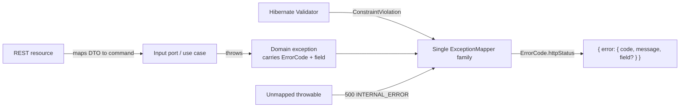
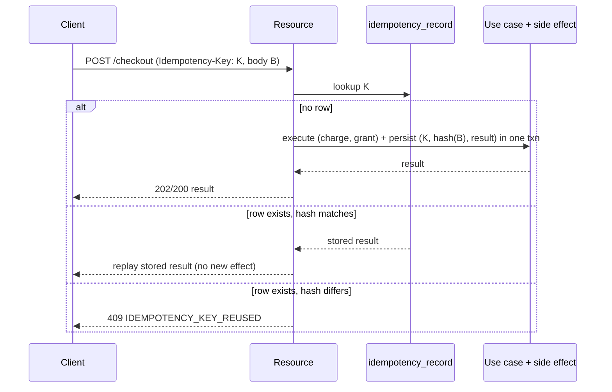

# Cross-Cutting: API & Contract

> The single source of truth for **how the BeatzClik backend speaks HTTP**. Every module's REST
> adapter conforms to this document; where a module ADD is silent on REST shape, error codes,
> pagination, money serialization, idempotency, or versioning, **this document governs**.
>
> **Authoritative inputs:** `API-CONTRACT.md` (the contract reverse-engineered from the finished
> frontend), `Frontend/src/types/index.ts` (the response shapes), `BACKEND-PRD.md` §0/§9.2/§9.4/§8.2,
> and `docs/01-conventions-and-standards.md` §4–§5. The frontend already depends on these shapes; the
> backend conforms to them, not the other way around.
>
> **Why this matters for autonomous agents.** The acceptance gate for the whole backend is: *the
> frontend runs against the API with its mock `getX()` functions removed and the rendered UI does not
> change* (PRD §1.5). That is only verifiable if every response validates against the frontend types.
> The Contract Testing section below is therefore the most important part of this file.

---

## 1. REST conventions

| Aspect | Rule |
|---|---|
| **Base path** | All endpoints live under `/v1` (e.g. `/v1/me`, `/v1/tracks/:id/stream`). The prefix is **fixed** for the life of the frontend (see §7). |
| **Public base URL** | `https://api.beatzclik.com/v1` in prod; `http://localhost:8080/v1` locally. |
| **Format** | JSON only. `Content-Type: application/json`, `Accept: application/json`, **UTF-8**. Multipart is used only for media upload endpoints (`.../tracks`, `.../episodes`). |
| **Auth** | `Authorization: Bearer <jwt>`. Token carries `sub` (account id) and `roles` (`fan`, `artist`, plus admin scopes). See `cross-cutting/security-authz.md`. |
| **Resource naming** | Plural nouns, kebab-or-flat lowercase (`/browse-categories`, `/payout-methods`). Sub-resources nest (`/artists/:id/tracks`, `/me/playlists/:id/tracks/:trackId`). Current-user resources hang off `/me` (`/me/cart`, `/me/collection`). |
| **IDs in paths** | Opaque strings. Path params shown as `:id` here are JAX-RS `{id}`. |
| **Verbs** | `GET` read · `POST` create / non-idempotent action · `PUT` full replace / idempotent set · `PATCH` partial update · `DELETE` remove. Toggle pairs use `PUT`/`DELETE` (like/unlike, follow/unfollow, save/unsave) and are **idempotent** (PUT twice = set once). |
| **Action sub-paths** | Verb-like operations that aren't pure CRUD use a trailing action segment: `/admin/users/:id/suspend`, `/admin/catalog/:id/takedown`, `/studio/payouts/withdraw`. Always `POST`. |
| **No business logic in resources** | Resources map DTO→command, call an input port, map result→DTO. (`01-conventions §5`.) |

### 1.1 Status code usage table

| Code | When | Notes |
|---|---|---|
| `200 OK` | Successful read or synchronous mutation returning a body | Default success. |
| `201 Created` | Resource created (signup, create playlist, submit release, invite admin) | Body is the created resource. |
| `202 Accepted` | Async side-effect accepted but not yet settled | `/checkout` (async MoMo), `/withdraw`, `/tip`, provider webhooks that defer. Body carries a `status: pending`. |
| `204 No Content` | Success with no body | logout, mark-read, like/unlike, follow, save, password-reset request. |
| `400 Bad Request` | Malformed request (bad JSON, wrong types) | Distinct from `422` (semantic validation). |
| `401 Unauthorized` | Missing/expired/invalid token; bad credentials; bad webhook signature | Generic message; **no user enumeration** on login. |
| `403 Forbidden` | Authenticated but not permitted; feature flag off; suspended account | `ARTIST_REQUIRED`, `FEATURE_DISABLED`, `ACCOUNT_SUSPENDED`, `KYC_REQUIRED`. |
| `404 Not Found` | Unknown id **or** hiding existence of a private resource | A private playlist accessed by a non-owner returns `404`, never `403`. |
| `409 Conflict` | Illegal state transition or business conflict | `EMAIL_TAKEN`, `ALREADY_OWNED`, `ILLEGAL_TRANSITION`, `LAST_SUPER_ADMIN`, `TIER_SOLD_OUT`, `INSUFFICIENT_BALANCE`. |
| `413 Payload Too Large` | Upload exceeds the configured size limit | Media upload endpoints. |
| `422 Unprocessable Entity` | Field-level validation failure | Carries `error.field`. `WEAK_PASSWORD`, `SPLIT_OVER_100`, `MISSING_QUERY`, `BELOW_MIN_PAYOUT`. |
| `429 Too Many Requests` | Rate limit exceeded | Include `Retry-After` header. Auth, checkout, tip, play-record, upload. |
| `500 Internal Server Error` | Unexpected fault | Never leak stack traces / SQL / PII; log with correlation id. |
| `503 Service Unavailable` | `maintenanceMode=true` for non-admin write traffic | `MAINTENANCE`. |

---

## 2. Error envelope & the ErrorCode catalog

### 2.1 Envelope

Every non-2xx response uses **one** uniform envelope (matches `API-CONTRACT.md` §1 and `01-conventions §4`):

```json
{ "error": { "code": "STRING_CODE", "message": "human readable", "field": "optional.field" } }
```

- `code` — stable `SCREAMING_SNAKE_CASE` string an agent can assert on in tests. **Never** change a
  code's meaning once shipped (it is part of the contract).
- `message` — human-readable, safe for display. **No** stack traces, SQL, or PII.
- `field` — present only on `422` validation failures; dotted path into the request body
  (`splits.0.percent`).

### 2.2 Single ExceptionMapper strategy

- The domain throws **framework-free** exceptions (no Jakarta/JAX-RS imports). Each module's domain
  exceptions extend a small shared hierarchy in the `platform` kernel (e.g. `DomainException` carrying
  an `ErrorCode` + optional `field`, with subclasses `NotFoundException`, `ConflictException`,
  `ValidationException`, `AuthzException`, …).
- **One** Quarkus `ExceptionMapper` family lives in `platform` / `adapter.in.rest` and maps:
  - `DomainException` subclasses → envelope using the carried `ErrorCode` → its declared HTTP status.
  - `ConstraintViolationException` (Hibernate Validator) → `422` with `error.field` derived from the
    violated property path.
  - Anything unmapped → `500` `INTERNAL_ERROR` with a generic message + logged correlation id.
- The `ErrorCode` enum (kernel) is the **registry**: each value declares its `httpStatus`. Adding an
  endpoint that needs a new failure mode means adding one `ErrorCode` value, not a new mapper.



### 2.3 Canonical ErrorCode catalog

Aggregated from `01-conventions §4`, `API-CONTRACT.md`, and every LLFR in `BACKEND-PRD.md §6`. This is
the master registry; the kernel `ErrorCode` enum should mirror it.

| Code | HTTP | Meaning / when |
|---|---|---|
| `VALIDATION_FAILED` | 422 | Generic field validation failure (fallback for constraint violations). |
| `MISSING_QUERY` | 422 | `/search` called with empty `q`. |
| `WEAK_PASSWORD` | 422 | Signup password < 8 chars. |
| `INVALID_ROLE` | 422 | Admin invite/change with a role not in the allowed set. |
| `TRACK_COUNT_INVALID` | 422 | Release type/track-count mismatch (single must have exactly 1). |
| `SPLIT_OVER_100` | 422 | Per-track royalty splits sum > 100% (INV-12). |
| `UNSUPPORTED_FORMAT` | 422 | Upload not WAV/FLAC (audio) or PNG/JPG (artwork). |
| `FILE_REJECTED` | 422 | Upload failed virus / safety scan. |
| `BELOW_MIN_PAYOUT` | 422 | Withdrawal amount < `MIN_PAYOUT` (₵10). |
| `INVALID_AMOUNT` | 422 | Tip / amount ≤ 0. |
| `INVALID_CREDENTIALS` | 401 | Bad email/password (generic, no enumeration). |
| `SOCIAL_TOKEN_INVALID` | 401 | Social-login provider token failed verification. |
| `UNAUTHENTICATED` | 401 | Missing/expired/invalid bearer token. |
| `WEBHOOK_SIGNATURE_INVALID` | 401 | Payment webhook signature check failed. |
| `ARTIST_REQUIRED` | 403 | Studio endpoint called without `artist` role. |
| `FORBIDDEN` | 403 | Authenticated but lacks the required admin scope. |
| `FEATURE_DISABLED` | 403 | Feature flag off (`artistSignups`, `tipping`, `events`, `podcasts`, `fanMessaging`). |
| `ACCOUNT_SUSPENDED` | 403 | Login/action on a suspended account. |
| `KYC_REQUIRED` | 403 | Withdrawal requested without verified KYC (INV-8). |
| `ARTIST_NOT_FOUND` | 404 | Unknown artist id. |
| `ALBUM_NOT_FOUND` | 404 | Unknown album id. |
| `TRACK_NOT_FOUND` | 404 | Unknown track id. |
| `PLAYLIST_NOT_FOUND` | 404 | Unknown playlist id / private playlist for non-owner. |
| `LYRICS_NOT_FOUND` | 404 | Track has no lyrics. |
| `RELEASE_NOT_FOUND` | 404 | Unknown release / not owned by caller. |
| `STORE_ITEM_NOT_FOUND` | 404 | Unknown store item. |
| `PODCAST_NOT_FOUND` | 404 | Unknown podcast / episode. |
| `EVENT_NOT_FOUND` | 404 | Unknown event. |
| `NOT_FOUND` | 404 | Generic / existence-hiding fallback. |
| `EMAIL_TAKEN` | 409 | Signup email already registered. |
| `USERNAME_TAKEN` | 409 | Studio profile username already in use. |
| `ALREADY_OWNED` | 409 | Adding to cart an item the caller already owns. |
| `NOT_STACKABLE` | 409 | `PATCH` qty on a non-stackable (digital one-off) cart line. |
| `CART_EMPTY` | 409 | Checkout with an empty cart. |
| `ILLEGAL_TRANSITION` | 409 | Disallowed state transition (release, dispute, etc.). |
| `RELEASE_LIVE` | 409 | Deleting a `live` release. |
| `TIER_SOLD_OUT` | 409 | Adding/buying a sold-out ticket tier. |
| `INSUFFICIENT_BALANCE` | 409 | Withdrawal exceeds cleared balance. |
| `KYC_BLOCKED` | 409 | Single payout send blocked by unverified KYC. |
| `LAST_SUPER_ADMIN` | 409 | Removing/demoting the last super-admin. |
| `EPISODE_HAS_OWNERS` | 409 | Hard-deleting a published episode with owners (OQ-8). |
| `IDEMPOTENCY_KEY_REQUIRED` | 400 | Money/side-effect POST missing the `Idempotency-Key` header. |
| `IDEMPOTENCY_KEY_REUSED` | 409 | Same key replayed with a **different** request body. |
| `MALFORMED_REQUEST` | 400 | Unparseable JSON / wrong primitive types. |
| `PAYLOAD_TOO_LARGE` | 413 | Upload exceeds size limit. |
| `RATE_LIMITED` | 429 | Token-bucket exceeded; include `Retry-After`. |
| `MAINTENANCE` | 503 | `maintenanceMode` on, non-admin write. |
| `INTERNAL_ERROR` | 500 | Unexpected fault. |

> Module ADDs may introduce **additional** codes, but must register them in the kernel `ErrorCode`
> enum and add a row here in the same PR. Reusing an existing code with a new meaning is forbidden.

---

## 3. Pagination, filtering, sorting

### 3.1 Pagination

- **Request:** `?page=<1-based>&size=<n>`. Defaults: `page=1`, `size=20`. **Max `size=100`**
  (clamp silently; do not error).
- **Response envelope** for every list endpoint:

```json
{ "items": [ /* T[] */ ], "page": 1, "size": 20, "total": 137 }
```

- `total` is the unfiltered-by-page count for the current filter set (so the UI can render page
  counts). The kernel provides `Page<T>` / `PageRequest`; resources map domain `Page<T>` → this DTO.
- Endpoints that the contract returns as a bare array (`Track[]`, `Album[]`, `BrowseCategory[]`,
  `AdminMember[]`) are **not** paged — return the array as-is. Only endpoints documented with
  `?page=&size=` use the envelope (admin lists, `/me/orders`, store, podcasts, events, ledger, audit).

### 3.2 Filter / sort param conventions

| Param | Meaning | Examples |
|---|---|---|
| `?q=` | Free-text search/filter | `/search?q=`, `/admin/users?q=`, `/admin/audit?q=` |
| `?status=` | Filter by a lifecycle status enum | `/admin/catalog?status=pending`, `/admin/support/tickets?status=open` |
| `?type=` | Filter by an entity/category type enum | `/store?type=BEAT_LICENSE`, `/admin/audit?type=finance`, `/admin/compliance?type=Takedown` |
| `?range=` | Time window for analytics/overview | `?range=7d\|28d\|90d\|12m\|all` (studio), `?range=24h\|7d\|30d` (admin overview) |
| `?sort=` | Sort order (closed enum per endpoint) | `/store?sort=popular\|newest\|price-asc\|price-desc` |
| `?filter=` | Named segment filter (admin users) | `/admin/users?filter=fans\|artists\|verified\|suspended` |
| `?genre=`,`?city=`,`?category=` | Domain-specific facets | `/store?genre=`, `/events?city=&category=`, `/podcasts?category=` |
| `?tracks=true` | Embed child collection | `/albums/:id?tracks=true`, `/playlists/:id` |

Unknown enum values for `status`/`type`/`sort` → `422 VALIDATION_FAILED` with `error.field` naming the
param. Document each endpoint's accepted values in its OpenAPI annotation.

---

## 4. Money, duration & timestamp serialization

> **Golden rule (PRD §0, INV-11, API-CONTRACT §15):** the server returns **structured values**, never
> pre-formatted display strings. The frontend owns formatting via `src/lib/format.ts`.

| Type | Storage (internal) | API surface | Rule |
|---|---|---|---|
| **Money** | Integer **minor units (pesewas)**, `BIGINT`, suffix `_minor` | `{ "amount": <decimal cedis>, "currency": "GHS" }` | Convert **only** at the adapter boundary: `amount = minor / 100` (2 dp); `minor = round_half_up(amount × 100)`. Matches frontend `Money { amount: number, currency: 'GHS' }`. Never a float in storage; never `"₵2.50"` on the wire. |
| **Duration** | Integer whole **seconds**, suffix `_sec` | plain number of seconds (e.g. `duration: 213`) | Frontend formats with `formatDuration()`. Applies to `Track.duration`, `PodcastEpisode.duration`, lyric line `time`, `previewSeconds`. |
| **Timestamp** | `TIMESTAMPTZ` (UTC) | **ISO-8601** string (`2026-06-22T14:03:00Z`) | `createdAt`, `publishedAt`, `date`, `expiresAt`, `dropsAt`, `publicAt`, audit `time`, etc. |
| **Counts** | integer | raw integer (`plays`, `followers`, `monthlyListeners`) | Frontend formats with `formatCount()` ("1.2M"). Never pre-abbreviate server-side. |
| **Percentages / splits** | integer or decimal | numbers, not strings | `platformFeePct: 30`, split `percent: 50`. |

Money math (splits, fees, discounts) is done on **minor units with half-up rounding**, and the sum of
parts must equal the whole (reconcile the remainder to the platform/creator residual). Economic
constants (`platformFeePct=30`, `creatorSharePct=70`, `tipFeePct=10`, `bundleDiscountPct=24`,
`serviceFee=₵0.50`, `minPayout=₵10`) come from `PlatformSettings`, never hard-coded.

---

## 5. Idempotency

### 5.1 Where it is required

Every **money mutation and irreversible side-effect POST** requires an `Idempotency-Key` request
header (PRD §9.2). Required on:

| Endpoint | Why |
|---|---|
| `POST /v1/checkout` | charges a payment method, grants ownership |
| `POST /v1/studio/payouts/withdraw` | reserves and pays out funds |
| `POST /v1/podcasts/:id/tip` | charges a tip |
| `POST /v1/admin/finance/payouts/run-weekly` | batch disburses funds |
| `POST /v1/admin/finance/payouts/:id/send` | single disbursement |
| `POST /v1/admin/finance/disputes/:id/refund` | refunds + reverses ledger |
| `POST /v1/payments/webhooks/:provider` | idempotent on **provider event id** (not the header) |

Internally, `InitiateCharge` propagates the key to the payment provider so the provider also dedupes.

### 5.2 Semantics

- **Header:** `Idempotency-Key: <client-generated UUID>` (UUIDv4/v7). Missing on a required endpoint →
  `400 IDEMPOTENCY_KEY_REQUIRED`.
- **Same key + same request body** → return the **original stored result** (same status + body),
  performing the side effect **at most once**.
- **Same key + different body** → `409 IDEMPOTENCY_KEY_REUSED` (a client bug; never silently re-charge).
- Keys are **scoped per account + endpoint** and retained at least 24h (configurable).
- Webhooks are idempotent on the provider's event id instead of the header; replays are no-ops.

### 5.3 Storage of idempotency results

Persist a result row keyed by the idempotency key so retries (and concurrent duplicates) resolve to the
identical response:

```
idempotency_record(
  key            text PRIMARY KEY,
  account_id     fk,
  endpoint       text,
  request_hash   text,          -- hash of the canonicalized body; mismatch => 409
  status_code    int,
  response_body  jsonb,
  created_at     timestamptz,
  expires_at     timestamptz
)
```

Flow: on entry, `INSERT ... ON CONFLICT DO NOTHING` (or `SELECT ... FOR UPDATE`); if a row exists with
a matching `request_hash`, replay its stored response; if the hash differs, `409`; otherwise execute,
then write the result row in the **same transaction** as the side effect.



---

## 6. OpenAPI publishing

- Generated by **`quarkus-smallrye-openapi`** (already on the scaffold). The spec is served at
  **`/q/openapi`** (`?format=json` / `?format=yaml`).
- **Annotate resources** with MicroProfile OpenAPI annotations: `@Operation`, `@APIResponse(s)` with
  the response schema, `@Parameter` for query params (document accepted enum values), `@RequestBody`,
  `@Tag` per module, and `@SecurityRequirement` (Bearer) on protected endpoints. DTO records carry
  `@Schema` where defaults/examples aid the generated spec.
- **Swagger UI in dev only.** `quarkus.swagger-ui.always-include=false` (default) → UI at
  `/q/swagger-ui` under `quarkus:dev`, **disabled in `%prod`**. The raw `/q/openapi` endpoint may stay
  enabled for the contract-test harness but should sit behind the gateway in prod.
- Configure a global `/v1` base in OpenAPI so generated paths match the deployed paths
  (`quarkus.smallrye-openapi.path` is `/q/openapi`; the app root path / `@ApplicationPath` carries
  `/v1`). Set `mp.openapi.extensions.smallrye.info.*` (title, version `v1`, contact).

---

## 7. Versioning & evolution

- **`/v1` is fixed** for the life of the current frontend. The UI hardcodes `/v1`; breaking it breaks
  every screen. Treat `/v1` as immutable.
- **Additive-only within `/v1`:** you may add new endpoints, add **optional** request fields, and add
  **new** response fields (the TS types tolerate extra properties only if you also add them to
  `index.ts` — see the contract-test note below). You may **not** remove or rename fields, change a
  field's type, change an `ErrorCode`'s meaning, or tighten validation on an existing field.
- **Deprecation policy:** mark a superseded endpoint/field with OpenAPI `deprecated: true` and a
  `Deprecation`/`Sunset` header; keep it working for the documented window. Net-new breaking shapes go
  to a future `/v2`, never mutate `/v1`.
- Because the contract is reverse-engineered from the UI, **the TS types lead**: a new response field
  must first exist in `Frontend/src/types/index.ts` (or be agreed) before the backend emits it.

---

## 8. Contract testing (critical for autonomous agents)

The hard acceptance gate (PRD §1.5, §8.2; `01-conventions §11.2`) is that **every endpoint's response
validates against the frontend types / `API-CONTRACT.md`**. An agent cannot claim a work unit "done"
without this proof. Recommended concrete approach, in three layers:

### 8.1 (a) Generate OpenAPI from the running app

The contract test boots the Quarkus app (`@QuarkusTest` / `@QuarkusIntegrationTest`) and fetches
`/q/openapi`. This is the **as-built** contract. CI snapshots it as a build artifact
(`target/openapi.json`) for diffing across PRs.

### 8.2 (b) A contract test suite asserting shape conformance per endpoint

Two complementary mechanisms — use both:

1. **JSON Schema derived from the TS types.** Generate JSON Schemas from
   `Frontend/src/types/index.ts` (e.g. `ts-json-schema-generator` / `typescript-json-schema`), one
   schema per exported interface (`Track`, `Album`, `Artist`, `Playlist`, `StoreItem`, `Podcast`,
   `PodcastEpisode`, `Event`, `Money`, `Collection`, `OrderSnapshot`, …). Commit them under
   `backend/src/test/resources/contract/schema/`. Each REST-assured test hits a real endpoint
   (seeded data) and validates the JSON body against the matching schema:

```java
given().auth().oauth2(fanToken())
  .when().get("/v1/tracks/{id}", seededTrackId)
  .then().statusCode(200)
  .body(matchesJsonSchemaInClasspath("contract/schema/Track.json"));
```

   For list/envelope endpoints, validate the envelope (`items/page/size/total`) and each `items[*]`
   against the element schema. For `Money`, assert `{ amount:number, currency:"GHS" }` and that no
   field is a pre-formatted string (regression guard against display-string leakage).

2. **Snapshot of expected shapes (fallback / supplement).** Where a TS type doesn't cleanly map (e.g.
   `/home`, `/studio/analytics`, `/admin/overview` composite payloads), keep a committed JSON snapshot
   of the expected shape (keys + types, values normalized) and assert structural equality. Update the
   snapshot deliberately, reviewed in the PR.

Every endpoint in the inventory (§10) must have at least one conformance test asserting: correct status
code, response shape, money/duration/timestamp serialization rules (§4), and — for failure paths — the
exact `error.code` from the catalog (§2.3).

### 8.3 (c) A CI gate

- Contract tests run in CI on every PR (part of the DoD, `01-conventions §11.2`). A failing schema
  match **fails the build**.
- An **OpenAPI diff** step compares `target/openapi.json` against the committed baseline; a
  breaking change to `/v1` (removed/renamed field, changed type, removed endpoint) fails the gate
  unless the baseline is intentionally updated with reviewer sign-off.
- The schema-generation step (TS → JSON Schema) runs in CI so the schemas can never drift from
  `index.ts` silently; a diff in generated schemas without a corresponding contract-test update fails.

### 8.4 The 1:1 mock → GET mapping (API-CONTRACT §15)

Each mock `getX()` in `Frontend/src/lib/*` maps **1:1** to a GET endpoint in §10. This gives agents a
mechanical checklist: for every `getX()` the frontend will replace with a TanStack Query hook, there
must be exactly one GET endpoint returning the same shape that the mock returned. Examples:

| Mock `getX()` (Frontend/src/lib) | GET endpoint |
|---|---|
| `getHomeFeed()` (mock-data) | `GET /v1/home` |
| `getArtist(id)` / `getArtistTracks(id)` | `GET /v1/artists/:id` / `/artists/:id/tracks` |
| `getAlbum(id)` | `GET /v1/albums/:id?tracks=true` |
| `getTrack(id)` / `getLyrics(id)` (lyrics-data) | `GET /v1/tracks/:id` / `/tracks/:id/lyrics` |
| `getStoreItems(...)` / `getStoreItem(id)` (store-data) | `GET /v1/store` / `/store/:id` |
| `getPodcasts()` / `getPodcast(id)` (podcast-data) | `GET /v1/podcasts` / `/podcasts/:id` |
| `getEvents()` / `getEvent(id)` (event-data) | `GET /v1/events` / `/events/:id` |
| `getPayouts()` (studio-payouts) | `GET /v1/studio/payouts` |
| `getAnalytics(range)` (studio-analytics) | `GET /v1/studio/analytics?range=` |
| `getAdminOverview(range)` (admin-data) | `GET /v1/admin/overview?range=` |

The migration test (PRD §1.5) is the final check: run the frontend with mocks removed against the API
and assert no visual change.

---

## 9. Reconciliation notes (PRD §0) that affect the contract

These discrepancies between the mock data, `API-CONTRACT.md`, and the frontend types have a contract
impact. Implement the recommended default; surface labels in the UI, not the wire shape.

| Ref | Topic | Contract decision |
|---|---|---|
| **R1** | **Admin role naming case.** Mock uses title case (`'Super-admin' | 'Finance' | …`); JWT/contract uses lowercase kebab (`super-admin | finance | …`). | **Persist & transmit canonical lowercase kebab** scopes in JWT `roles` and `AdminMember.role`. The UI renders display labels. Contract tests assert lowercase. |
| **R2** | **Tip economics.** Tips net 90% (10% fee); sales/royalties 70/30. | Two fee constants in `PlatformSettings` (`tipFeePct=10`, `platformFeePct=30`); ledger posts accordingly. No wire-shape change. |
| **R3** | **Bundle discount.** `BUNDLE_DISCOUNT = 0.24` not in the contract. | Album list price = `round(Σ track prices × (1 − 0.24), 2)`; emitted as a normal `Money`. Configurable. |
| **R4** | **Ownership granularity.** Collection has `ownedTracks: ID[]`; album/season purchases expand. | `/me/owned` returns **track ids**; album/season purchases expand to constituent track/episode grants server-side (INV-2). |
| **R5** | **Compliance request types.** Mock splits DSAR into export/delete; contract has `DSAR | Takedown | Tax`. | Use the finer enum on the wire: `?type=DSAR-export | DSAR-delete | Takedown | Tax`. |
| **R6** | **Release status.** Adopt mock enum + add `takedown`. | `ReleaseStatus = live | scheduled | in_review | draft | takedown`. |
| **R7** | **User status vs account flags.** `Account` carries `isArtist`/`isAdmin`; admin lifecycle is separate. | `Account.isArtist/isAdmin` on the wire (unchanged); admin `UserStatus = active | pending | suspended` is a separate field on admin user views. |
| **R8** | **Preview enforcement.** Server clips to 30s; client timer advisory. | `/tracks/:id/stream` returns a server-clipped preview URL + `previewSeconds: 30` for unowned for-sale tracks (INV-3). The contract field is authoritative. |

---

## 10. Master endpoint inventory

Every endpoint from `API-CONTRACT.md`, with method, path (under `/v1`), module (per PRD §4.2), the
owning ADD doc (`architecture/<module>.md`), and the governing LLFR. **This is the single index.**

### 10.1 Auth & accounts — `identity` · ADD `architecture/identity.md`

| Method | Path | LLFR |
|---|---|---|
| POST | `/auth/login` | LLFR-IDENTITY-01.2 |
| POST | `/auth/signup` | LLFR-IDENTITY-01.1 |
| POST | `/auth/social` | LLFR-IDENTITY-01.3 |
| POST | `/auth/logout` | LLFR-IDENTITY-01.4 |
| GET | `/me` | LLFR-IDENTITY-02.1 |
| POST | `/me/become-artist` | LLFR-IDENTITY-02.2 |
| PATCH | `/me/settings` | LLFR-IDENTITY-02.3 |
| POST | `/me/password/reset` | LLFR-IDENTITY-01.5 |

### 10.2 Catalog — `catalog` · ADD `architecture/catalog.md`

| Method | Path | LLFR |
|---|---|---|
| GET | `/home` | LLFR-CATALOG-01.1 |
| GET | `/search?q=` | LLFR-CATALOG-01.2 |
| GET | `/browse-categories` | LLFR-CATALOG-01.3 |
| GET | `/artists/:id` | LLFR-CATALOG-01.4 |
| GET | `/artists/:id/tracks` | LLFR-CATALOG-01.4 |
| GET | `/artists/:id/albums` | LLFR-CATALOG-01.4 |
| GET | `/artists/:id/shows` | LLFR-CATALOG-01.4 |
| GET | `/albums/:id` (`?tracks=true`) | LLFR-CATALOG-01.5 |
| GET | `/tracks/:id` | LLFR-CATALOG-01.6 |
| GET | `/tracks/:id/lyrics` | LLFR-CATALOG-01.6 |
| GET | `/playlists/:id` | LLFR-CATALOG-01.7 |

### 10.3 Playback — `playback` · ADD `architecture/playback.md`

| Method | Path | LLFR |
|---|---|---|
| GET | `/tracks/:id/stream` | LLFR-PLAYBACK-01.1 |
| POST | `/tracks/:id/play` | LLFR-PLAYBACK-01.2 |

### 10.4 Library & collection — `library` · ADD `architecture/library.md`

| Method | Path | LLFR |
|---|---|---|
| GET | `/me/collection` | LLFR-LIBRARY-01.1 |
| PUT / DELETE | `/me/likes/tracks/:id` | LLFR-LIBRARY-01.2 |
| PUT / DELETE | `/me/follows/artists/:id` | LLFR-LIBRARY-01.3 |
| PUT / DELETE | `/me/follows/playlists/:id` | LLFR-LIBRARY-01.3 |
| PUT / DELETE | `/me/follows/shows/:id` | LLFR-LIBRARY-01.3 |
| PUT / DELETE | `/me/saved/albums/:id` | LLFR-LIBRARY-01.4 |
| GET / POST | `/me/playlists` | LLFR-LIBRARY-01.5 |
| PATCH / DELETE | `/me/playlists/:id` | LLFR-LIBRARY-01.5 |
| PUT / DELETE | `/me/playlists/:id/tracks/:trackId` | LLFR-LIBRARY-01.5 |
| GET | `/me/owned` | LLFR-LIBRARY-01.6 |

### 10.5 Commerce — `commerce` · ADD `architecture/commerce.md`

| Method | Path | LLFR |
|---|---|---|
| GET | `/me/cart` | LLFR-COMMERCE-01.1 |
| POST | `/me/cart/items` | LLFR-COMMERCE-01.2 |
| PATCH / DELETE | `/me/cart/items/:lineId` | LLFR-COMMERCE-01.3 |
| POST | `/checkout` (idempotent) | LLFR-COMMERCE-02.1 |
| GET | `/me/orders` | LLFR-COMMERCE-02.4 |

### 10.6 Payments (webhooks) — `payments` · ADD `architecture/payments.md`

| Method | Path | LLFR |
|---|---|---|
| POST | `/payments/webhooks/:provider` (signature-verified, idempotent) | LLFR-PAYMENTS-01.2 |

### 10.7 Store — `store` · ADD `architecture/store.md`

| Method | Path | LLFR |
|---|---|---|
| GET | `/store?type=&genre=&sort=` | LLFR-STORE-01.1 |
| GET | `/store/:id` | LLFR-STORE-01.2 |

### 10.8 Podcasts — `podcasts` · ADD `architecture/podcasts.md`

| Method | Path | LLFR |
|---|---|---|
| GET | `/podcasts?category=` | LLFR-PODCAST-01.1 |
| GET | `/podcasts/:id` | LLFR-PODCAST-01.2 |
| GET | `/podcasts/:id/episodes` | LLFR-PODCAST-01.3 |
| POST | `/podcasts/:id/tip` (idempotent) | LLFR-PODCAST-02.1 |

### 10.9 Events & ticketing — `events` · ADD `architecture/events.md`

| Method | Path | LLFR |
|---|---|---|
| GET | `/events?city=&category=` | LLFR-EVENTS-01.1 |
| GET | `/events/:id` | LLFR-EVENTS-01.2 |

> Tickets are purchased via §10.5 cart (`kind: 'ticket'`, `refId: eventId:tier`); issuance LLFR-COMMERCE-02.5.

### 10.10 Notifications — `notifications` · ADD `architecture/notifications.md`

| Method | Path | LLFR |
|---|---|---|
| GET | `/me/notifications` | LLFR-NOTIF-01.1 |
| POST | `/me/notifications/read` | LLFR-NOTIF-01.2 |
| POST | `/me/notifications/:id/read` | LLFR-NOTIF-01.3 |

### 10.11 Studio (creator, `artist` role) — `studio` · ADD `architecture/studio.md`

| Method | Path | LLFR |
|---|---|---|
| GET / PUT | `/studio/profile` | LLFR-STUDIO-01.1 |
| GET | `/studio/releases?status=` | LLFR-CATALOG-02.1 |
| POST | `/studio/releases` (wizard submit) | LLFR-CATALOG-02.2 |
| GET / PATCH / DELETE | `/studio/releases/:id` | LLFR-CATALOG-02.3 |
| POST | `/studio/releases/:id/tracks` (multipart) | LLFR-CATALOG-02.4 |
| GET | `/studio/podcasts/shows` | LLFR-STUDIO-02.1 |
| POST | `/studio/podcasts/shows` | LLFR-STUDIO-02.1 |
| GET | `/studio/podcasts/episodes` | LLFR-STUDIO-02.2 |
| POST | `/studio/podcasts/episodes` (multipart) | LLFR-STUDIO-02.3 |
| PATCH / DELETE | `/studio/podcasts/episodes/:id` | LLFR-STUDIO-02.4 |
| GET | `/studio/analytics?range=` | LLFR-STUDIO-03.1 |
| GET | `/studio/audience` | LLFR-STUDIO-03.2 |
| GET | `/studio/payouts` | LLFR-PAYMENTS-02.2 |
| POST | `/studio/payouts/withdraw` (idempotent) | LLFR-PAYMENTS-03.2 |
| POST | `/studio/payout-methods` | LLFR-PAYMENTS-03.1 |
| DELETE | `/studio/payout-methods/:id` | LLFR-PAYMENTS-03.1 |
| PATCH | `/studio/payout-methods/:id/default` | LLFR-PAYMENTS-03.1 |
| GET / PUT | `/studio/settings` | LLFR-STUDIO-04.2 |

### 10.12 Admin — `admin` (+ `payments` for finance) · ADD `architecture/admin.md`

**Overview / health**

| Method | Path | LLFR |
|---|---|---|
| GET | `/admin/overview?range=24h\|7d\|30d` | LLFR-ADMIN-01.1 |
| GET | `/admin/health` | LLFR-ADMIN-01.2 |

**Users**

| Method | Path | LLFR |
|---|---|---|
| GET | `/admin/users?q=&filter=&page=&size=` | LLFR-ADMIN-02.1 |
| GET | `/admin/users/:id` | LLFR-ADMIN-02.1 |
| POST | `/admin/users/:id/verify` | LLFR-ADMIN-02.2 |
| POST | `/admin/users/:id/suspend` (`{reason}`) | LLFR-ADMIN-02.3 |
| POST | `/admin/users/:id/reactivate` | LLFR-ADMIN-02.4 |
| POST | `/admin/users/:id/impersonate` | LLFR-ADMIN-02.5 |
| POST | `/admin/users/:id/data-export` | LLFR-ADMIN-02.6 |

**Catalog moderation**

| Method | Path | LLFR |
|---|---|---|
| GET | `/admin/catalog?status=&q=&page=` | LLFR-ADMIN-03.1 |
| GET | `/admin/catalog/:id` | LLFR-ADMIN-03.1 |
| POST | `/admin/catalog/:id/approve` | LLFR-ADMIN-03.2 |
| POST | `/admin/catalog/:id/flag` | LLFR-ADMIN-03.2 |
| POST | `/admin/catalog/:id/takedown` (`{reason}`) | LLFR-ADMIN-03.2 |

**Moderation queue**

| Method | Path | LLFR |
|---|---|---|
| GET | `/admin/moderation?status=&type=` | LLFR-ADMIN-04.1 |
| POST | `/admin/moderation/:id/{review\|approve\|remove\|escalate\|dismiss}` | LLFR-ADMIN-04.1 |

**Finance** (`payments` module behind the scenes; idempotent on money POSTs)

| Method | Path | LLFR |
|---|---|---|
| GET | `/admin/finance?range=` | LLFR-ADMIN-05.1 |
| POST | `/admin/finance/payouts/run-weekly` (idempotent) | LLFR-PAYMENTS-03.3 |
| POST | `/admin/finance/payouts/:id/send` (idempotent) | LLFR-PAYMENTS-03.4 |
| GET | `/admin/finance/ledger?type=&q=&page=` | LLFR-PAYMENTS-02.3 |
| GET | `/admin/finance/disputes/:id` | LLFR-PAYMENTS-04.1 |
| POST | `/admin/finance/disputes/:id/refund` (idempotent) | LLFR-PAYMENTS-04.2 |
| POST | `/admin/finance/disputes/:id/{reject\|escalate}` | LLFR-PAYMENTS-04.3 |

**Editorial**

| Method | Path | LLFR |
|---|---|---|
| GET / PUT | `/admin/editorial/featured` | LLFR-ADMIN-06.1 |
| GET / POST | `/admin/editorial/push` | LLFR-ADMIN-06.1 |
| GET / POST | `/admin/editorial/playlists` | LLFR-ADMIN-06.1 |

**Trust & safety**

| Method | Path | LLFR |
|---|---|---|
| GET | `/admin/risk` | LLFR-ADMIN-07.1 |
| POST | `/admin/risk/:id/{review\|clear\|ban}` | LLFR-ADMIN-07.1 |

**Support**

| Method | Path | LLFR |
|---|---|---|
| GET | `/admin/support/tickets?status=&q=` | LLFR-ADMIN-08.1 |
| GET | `/admin/support/tickets/:id` | LLFR-ADMIN-08.1 |
| POST | `/admin/support/tickets/:id/reply` (`{text}`) | LLFR-ADMIN-08.1 |
| POST | `/admin/support/tickets/:id/{assign\|resolve}` | LLFR-ADMIN-08.1 |

**Compliance**

| Method | Path | LLFR |
|---|---|---|
| GET | `/admin/compliance?type=DSAR-export\|DSAR-delete\|Takedown\|Tax` | LLFR-ADMIN-09.1 |
| POST | `/admin/compliance/:id/{start\|complete}` | LLFR-ADMIN-09.1 |
| POST | `/admin/compliance/:id/{export\|notice}` | LLFR-ADMIN-09.1 |

### 10.13 Audit — `audit` · ADD `architecture/audit.md`

| Method | Path | LLFR |
|---|---|---|
| GET | `/admin/audit?type=&q=&page=` | LLFR-ADMIN-11.1 |

### 10.14 Settings & RBAC — `identity` / `admin` · ADD `architecture/admin.md`

| Method | Path | LLFR |
|---|---|---|
| GET / PUT | `/admin/settings` (super-admin only) | LLFR-ADMIN-10.1 |
| GET | `/admin/team` | LLFR-IDENTITY-03.1 |
| POST | `/admin/team/invite` (`{email, role}`) | LLFR-IDENTITY-03.2 |
| PATCH / DELETE | `/admin/team/:id` | LLFR-IDENTITY-03.3 |

---

## 11. Checklist — adding or changing an endpoint

Agents follow this when touching the API surface:

1. **Locate the contract row.** Find the endpoint in `API-CONTRACT.md` and §10 above. If it does not
   exist there, confirm it is genuinely new (additive) — do **not** invent shapes the UI does not need.
2. **Confirm the shape against the TS type.** The response must validate against the matching interface
   in `Frontend/src/types/index.ts`. Money/duration/timestamp/count serialization must follow §4
   (structured values, never display strings).
3. **Pick the right verb & status code** (§1, §1.1). Use action sub-paths for non-CRUD; `204` for
   no-body successes; `202` for async settlement; idempotent `PUT`/`DELETE` for toggles.
4. **Pagination/filter params** follow §3 if it's a list (`page/size`, `q/status/type/range/sort`).
5. **Idempotency** (§5): if it mutates money or is an irreversible side effect, require
   `Idempotency-Key`, hash the body, store the result row in the same transaction.
6. **Error paths** use the canonical envelope and an `ErrorCode` from §2.3. New failure mode → add an
   `ErrorCode` enum value **and** a catalog row in the same PR; route it through the single
   ExceptionMapper.
7. **Authorization** (§9, `security-authz.md`): annotate the role/scope; re-check resource ownership in
   the application layer. Studio = `artist`; admin = the specific scope.
8. **Audit** (INV-10): privileged mutations append exactly one `AuditEntry` via the audit interceptor.
9. **Feature flags / maintenance:** guard flagged features (`403 FEATURE_DISABLED`); non-admin writes
   respect `maintenanceMode` (`503 MAINTENANCE`).
10. **Annotate for OpenAPI** (§6): `@Operation`, `@APIResponse`, `@Parameter` (enum values),
    `@Tag`, `@SecurityRequirement`.
11. **Write the contract test** (§8): REST-assured against seeded data, `matchesJsonSchemaInClasspath`
    (or snapshot) for the success body; assert the exact `error.code` for each failure path.
12. **Update artifacts in the same PR:** the module ADD (`architecture/<module>.md`), the §10 inventory
    if the path/verb set changed, and re-generate TS→JSON schemas if `index.ts` changed.
13. **Run the gate:** contract tests green, OpenAPI diff shows no breaking change to `/v1`, ArchUnit
    green, Spotless clean (DoD, `01-conventions §11`).
