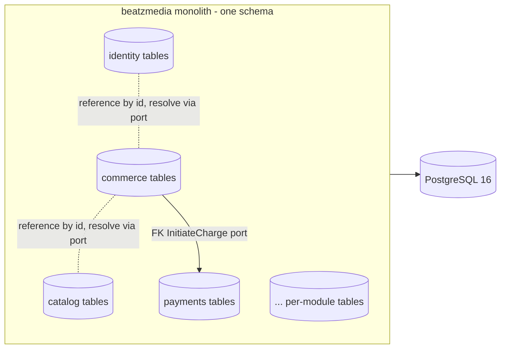
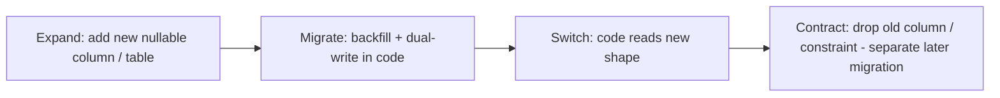

# BeatzClik Backend — Data & Migrations

> Cross-cutting guide for **persistence, PostgreSQL conventions, and Flyway migrations** in the
> `beatzmedia` modular monolith. **Authoritative sources:** `01-conventions-and-standards.md` §2/§3/§6,
> `00-system-architecture.md` §4, `BACKEND-PRD.md` §4.3, §5.4, §6, INV-6, INV-11, §10. Where a module
> ADD is silent on data shape, this document governs. Consumed by Claude Code agents authoring schema.

---

## 1. Storage model at a glance

- **One database, one physical schema** (`public`) on **PostgreSQL 16**. No schema-per-module, no
  database-per-module (PRD §4.3: "single schema"). Logical partitioning is by **table ownership**, not
  by Postgres schema (see §3).
- **One Flyway migration set** under `backend/src/main/resources/db/migration/`. Every module
  contributes versioned files into the same global sequence.
- **Money** is stored in integer **minor units (pesewas)** as `BIGINT` (INV-11). **Never** float/numeric
  for currency amounts.
- **JPA entities are persistence-adapter-only.** Domain types carry no ORM annotations
  (`00-system-architecture.md` §4). Each entity maps domain ↔ JPA entity ↔ row in
  `adapter.out.persistence`. Transaction boundary = the use case (`@Transactional` on the application
  service impl).



---

## 2. PostgreSQL naming & type conventions

These are **hard rules** (from conventions §6). CI / review rejects deviations.

| Concern | Rule | Example |
|---|---|---|
| Tables & columns | `snake_case`, singular table names | `ownership_grant`, `created_at` |
| Primary key | always named `id` | `id TEXT PRIMARY KEY` |
| Foreign key | `<entity>_id` | `account_id`, `track_id`, `order_id` |
| Money | `*_minor`, type `BIGINT` | `price_minor BIGINT NOT NULL` |
| Durations | `*_sec`, integer whole seconds | `duration_sec INT` |
| Timestamps | `*_at`, type `TIMESTAMPTZ`, stored UTC | `created_at TIMESTAMPTZ NOT NULL` |
| Booleans | `is_*` / `has_*` | `is_artist`, `has_lyrics` |
| Percentages | integer percent `*_pct` (split math is half-up minor units) | `percent` / `platform_fee_pct` |
| Identifiers | opaque strings (UUIDv7/ULID) → `TEXT` PK/FK | `id TEXT` (conventions §3) |

**ID type.** Conventions §3 mandates opaque sortable string ids (UUIDv7 or ULID via `IdGenerator`).
Store as `TEXT` (or `VARCHAR(26)` for ULID). Do **not** use Postgres `bigserial`/identity for surrogate
keys — ids are generated in the domain, not the database, so they exist before the row is persisted and
are stable across environments and events.

**Timestamps.** Always `TIMESTAMPTZ`; the app writes UTC and serializes ISO-8601. Never `TIMESTAMP`
(without zone) and never store local time. Human-facing order references use the separate
`order_reference TEXT` column in `BZ-YYYY-NNNNN` format (conventions §3), unique, generated server-side.

### 2.1 Enums — recommendation: TEXT + CHECK constraint

The domain has ~30 closed enums (PRD §3.2: `ReleaseStatus`, `OwnershipStatus`, `PayoutStatus`,
`ComplianceType`, …). **Recommendation: store enums as `TEXT` with a `CHECK (col IN (...))` constraint**,
**not** native Postgres `ENUM` types.

**Justification:**

- **Evolvable forward-only.** Adding a value to a native `ENUM` (`ALTER TYPE ... ADD VALUE`) cannot run
  inside a transaction in older PG and cannot be reordered or removed; widening a `CHECK` is a trivial
  additive migration (drop + recreate the constraint). PRD §6 already extends enums (R6/OQ-7 add
  `takedown` to `ReleaseStatus`), so cheap evolution matters.
- **Portability & tooling.** `TEXT` columns round-trip cleanly through JDBC, Panache, Testcontainers,
  and `R__seed_dev_data.sql` without custom Hibernate `@Type` mappers for PG enums.
- **Matches the wire contract.** The API surface already uses these as kebab/lowercase strings
  (`for-sale`, `in_review`, `super-admin`); `TEXT` stores exactly what the frontend types expect.

```sql
status TEXT NOT NULL DEFAULT 'draft'
  CONSTRAINT release_status_chk CHECK (status IN ('live','scheduled','in_review','draft','takedown')),
```

Name every constraint (`<table>_<col>_chk`) so a later migration can `DROP CONSTRAINT` / re-add to widen
the allowed set.

### 2.2 Indexes — one per documented filter (mandatory)

Conventions §6: *"Add indexes for every documented filter/lookup."* For each `?status=`, `?type=`,
`?range=`, `?q=`, unique lookup, or FK join the module ADD documents, the migration that creates the
table **must** create the matching index. Examples mapped to PRD endpoints:

```sql
CREATE UNIQUE INDEX ux_account_email           ON account (lower(email));
CREATE UNIQUE INDEX ux_social_provider_uid      ON social_identity (provider, provider_uid);
CREATE INDEX        ix_release_artist_status     ON release (artist_id, status);   -- GET /studio/releases?status=
CREATE INDEX        ix_track_album              ON track (album_id);
CREATE INDEX        ix_ownership_account_track   ON ownership_grant (account_id, track_id);
CREATE UNIQUE INDEX ux_ownership_grant_unique    ON ownership_grant (account_id, track_id); -- idempotent grants
CREATE INDEX        ix_order_account_created     ON "order" (account_id, created_at DESC);
CREATE INDEX        ix_ledger_entry_account      ON ledger_entry (ledger_account_id, created_at);
CREATE INDEX        ix_play_event_track_ts       ON play_event (track_id, created_at);
-- search (OQ-12, pg_trgm behind the SearchIndex port):
CREATE INDEX        ix_track_title_trgm          ON track USING gin (title gin_trgm_ops);
```

`order` is a reserved word — quote it (`"order"`) or prefer `customer_order`. Add `pg_trgm` via a
dedicated extension migration before the trigram indexes.

---

## 3. Table ownership & no cross-module FKs

**Rule (architecture §1, §4.4; conventions §6): a module owns its tables; no module reads or
foreign-keys into another module's tables.** Cross-context references are stored as **plain id columns**
(`TEXT`, no FK constraint) and resolved at runtime by calling the owning module's input port (or via
ids/snapshots carried in domain events).

- **Within a module: FKs are expected and encouraged** (e.g. `release_track.release_id → release.id`,
  `order_line.order_id → "order".id`, `ledger_entry.ledger_account_id → ledger_account.id`).
- **Across modules: reference by id only, no FK.** `ownership_grant.account_id` (commerce → identity's
  `account`) is a bare `TEXT` column, **not** a constraint. Commerce never joins to `account`; it asks
  `identity` via a port. Same for `play_event.track_id`, `order_line.ref_id`, `dispute.order_id`.

```sql
-- commerce.ownership_grant: within-module FK to order, cross-module id (no FK) to identity & catalog
CREATE TABLE ownership_grant (
  id          TEXT PRIMARY KEY,
  account_id  TEXT NOT NULL,                 -- identity.account.id  (NO FK — cross module)
  track_id    TEXT NOT NULL,                 -- catalog.track.id     (NO FK — cross module)
  order_id    TEXT NOT NULL REFERENCES "order"(id),  -- within module: FK OK
  granted_at  TIMESTAMPTZ NOT NULL,
  revoked_at  TIMESTAMPTZ
);
```

**Why this still works as one schema.** All tables live in `public`, so a single Flyway run and a single
transaction span them — preserving the monolith's transactional integrity for money/ownership (ADR-1).
Logical isolation is enforced by **ArchUnit + repository boundaries** (a repository class only touches
its module's tables) and by the absence of cross-module FKs, *not* by Postgres schemas. This keeps
referential safety inside an aggregate while letting modules evolve their tables independently.

---

## 4. Flyway policy

**Location & extension.** `backend/src/main/resources/db/migration/`. Versioned: `.sql`. Quarkus runs
them with `quarkus.flyway.migrate-at-start=true` (architecture §7).

**File naming.** `V<n>__<snake_desc>.sql` (double underscore separator), e.g.
`V12__add_ownership_grant.sql`. Repeatable seed: `R__seed_dev_data.sql` (one only).

**Core rules:**

1. **Forward-only.** Flyway Community has no `undo`. There is **no rollback**; you fix forward (§6).
2. **Never edit a merged migration.** Once a `V` file is merged/applied anywhere, its content and
   checksum are frozen. A change = a **new** migration. Editing a shipped file breaks every
   already-migrated database (checksum mismatch → boot failure).
3. **One logical change per migration.** A migration does one coherent thing (add a table + its
   indexes/constraints; or one additive column + backfill). Don't bundle unrelated module changes.
4. **Additive-first / expand-contract** (see §5).
5. **Idempotent-safe DDL where supported** — use `IF NOT EXISTS` / `IF EXISTS` and named constraints so
   a partially-applied migration can be reasoned about; do not rely on it as a substitute for correct
   versioning.

### 4.1 Version ownership — avoiding parallel-agent collisions

Multiple agents authoring migrations into **one global sequence** will collide on `V<n>` numbers.
**Recommended convention: module-prefixed version ranges** (a "block allocation" registry, §7).

Each module owns a numeric band; agents pick the next free number **within their module's band**, so
two agents in different modules never collide:

| Band | Module | Example |
|---|---|---|
| `V1xx` | `platform` / bootstrap (extensions, shared) | `V100__enable_pg_trgm.sql` |
| `V2xx` | `identity` | `V201__create_account.sql` |
| `V3xx` | `catalog` | `V301__create_track.sql` |
| `V4xx` | `playback` | `V401__create_play_event.sql` |
| `V5xx` | `library` | `V501__create_collection_tables.sql` |
| `V6xx` | `commerce` | `V601__create_order.sql` |
| `V7xx` | `payments` | `V701__create_ledger.sql` |
| `V8xx` | `store` / `podcasts` / `events` | `V801__create_store_item.sql` |
| `V9xx` | `notifications` / `studio` / `admin` / `analytics` / `audit` | `V901__create_audit_entry.sql` |

Flyway still applies strictly by ascending version across all bands, so ordering across modules is
deterministic; bands only prevent **number reuse**. Within a band, increment by 1; the registry table
(§7) records the last used number per module so an agent finds the next free slot in one read.

> **Alternative (timestamp versions):** `V20260622T1432__add_x.sql` (UTC `yyyyMMddTHHmm`) makes
> collisions statistically impossible without a registry. Acceptable, but **bands are the default** here
> because they keep the sequence short, readable, and reviewable, and make cross-module ordering
> intentional rather than wall-clock-accidental. Pick one convention repo-wide; do not mix.

### 4.2 Repeatable seed (`R__seed_dev_data.sql`)

- **Dev/test profiles only** (`%dev`, `%test`). Guarded so `%prod` never seeds (PRD §5.4, §5.5). Wire
  via `quarkus.flyway.locations` per profile, or gate the file's body and disable in `%prod`.
- Flyway re-runs an `R__` file whenever its **checksum changes**, so it must be **idempotent**: use
  `INSERT ... ON CONFLICT (id) DO UPDATE` / `TRUNCATE ... RESTART IDENTITY` patterns, never blind
  `INSERT` that would duplicate on re-run.

---

## 5. Migration authoring rules for agents

**Additive-first.** New tables, new nullable columns, new indexes, widened CHECK sets are safe and
preferred. Avoid destructive DDL in the same release that code starts depending on the new shape.

**Backfill strategy.** When adding a non-null column to a populated table:

1. Add the column **nullable** (or with a default), in one migration.
2. Backfill data (in the migration for small tables; via a batched job for large ones — keep DDL
   migrations fast).
3. In a **later** migration (after code writes the column), add the `NOT NULL` constraint.

**Zero-downtime expand/contract.** Because instances are stateless and rolled (architecture §1), schema
changes must tolerate old + new code running simultaneously:



- **Renames** are expand/contract, never `ALTER ... RENAME` on a live column: add new column → dual-write
  → backfill → switch reads → drop old.
- **Drops/destructive changes** ship only after no deployed code references the old shape — a separate,
  later migration.

**Rollback approach (forward-fix only).** Flyway Community is forward-only and the project has **no undo
migrations**. If a migration is wrong: write a **new** `V<n+1>` that corrects it (e.g. drops the bad
index, fixes the constraint). Never delete or rewrite the faulty file once merged. Because expand steps
are additive, a bad forward fix is itself recoverable by another forward migration.

---

## 6. Money & ledger integrity

- **Minor units everywhere** (INV-11): every monetary column is `*_minor BIGINT`. Conversion to/from
  decimal cedis happens **only at the REST adapter boundary** (conventions §2):
  `minor = round_half_up(cedis * 100)`, `cedis = minor / 100` at scale 2. The DB and domain never see
  decimals.
- **Rounding rules** (conventions §2): split/fee/discount math runs on minor units with **half-up**
  rounding; the **sum of parts must equal the whole** — reconcile the remainder into the platform/creator
  residual so no pesewa is lost or invented. Percentages (`platformFeePct=30`, `creatorSharePct=70`,
  `tipFeePct=10`, `bundleDiscountPct=24`) come from `platform_settings`, never hard-coded.

### 6.1 Double-entry ledger balance (INV-6, ADR-6)

Every monetary movement posts **balanced** double-entry rows: `Σ debits = Σ credits` per transaction.
Creator withdrawable balance = cleared credits − cleared cash-outs.

```sql
CREATE TABLE ledger_entry (
  id                TEXT PRIMARY KEY,
  txn_id            TEXT NOT NULL,                     -- groups the balanced rows of one movement
  ledger_account_id TEXT NOT NULL REFERENCES ledger_account(id),
  direction         TEXT NOT NULL CHECK (direction IN ('debit','credit')),
  amount_minor      BIGINT NOT NULL CHECK (amount_minor > 0),
  created_at        TIMESTAMPTZ NOT NULL
);
CREATE INDEX ix_ledger_entry_txn ON ledger_entry (txn_id);
```

**DB-level balance strategy.** Enforce the invariant with a **deferred constraint trigger** that fires
per `txn_id` at commit, asserting `Σ(credit) − Σ(debit) = 0` for that transaction. Rows are
append-only (no `UPDATE`/`DELETE`; reversals post compensating entries), so the trigger plus an
application-layer assertion in the use case give defence in depth. The signed-sum check is the canonical
DB guard; corrections (refund clawback, INV-9) are new compensating `txn_id`s, never row edits.

---

## 7. Migration version registry

So parallel agents can find the **next free version** without scanning the folder, maintain a registry.
Two acceptable forms — keep both in sync:

1. **Doc convention (this table).** Update on every merged migration; the band scheme (§4.1) keeps edits
   local to one module's row.
2. **(Optional) a `schema_module_version` table** seeded/updated by each migration recording
   `(module, last_version, applied_at)` — queryable at runtime to confirm a module's migration head.

**Example global migration list (aligned to PRD §6 modules & owned tables):**

| Version | Module | Description |
|---|---|---|
| `V100` | platform | `enable_pg_trgm` (+ `uuid`/`pgcrypto` if needed) |
| `V101` | platform | `create_platform_settings`, `feature_flag` |
| `V201` | identity | `create_account`, `credential` (WU-IDN-1 ✅); `social_identity` deferred to WU-IDN-2 (next V2xx) |
| `V202` | identity | `create_fan_settings`, `admin_member`, `password_reset_token` (WU-IDN-2/4) |
| `V301` | catalog | `create_artist_profile`, `album` |
| `V302` | catalog | `create_track`, `track_credit`, `lyrics`, `lyric_line` |
| `V303` | catalog | `create_playlist`, `playlist_track`, `browse_category` |
| `V304` | catalog | `create_release`, `release_track`, `split_entry`, `release_draft` |
| `V401` | playback | `create_play_event` |
| `V501` | library | `create_collection_tables` (likes/follows/saved/user_playlist) |
| `V601` | commerce | `create_cart`, `cart_item` |
| `V602` | commerce | `create_order`, `order_line` |
| `V603` | commerce | `create_ownership_grant` |
| `V701` | payments | `create_payment_intent`, `payment_event` |
| `V702` | payments | `create_ledger_account`, `ledger_entry`, `creator_balance` (+ balance trigger) |
| `V703` | payments | `create_payout_method`, `withdrawal_request`, `payout_batch`, `payout_txn`, `kyc_record` |
| `V704` | payments | `create_refund`, `dispute`, `dispute_event` |
| `V801` | store | `create_store_item`, license/variant tables |
| `V811` | podcasts | `create_podcast`, `podcast_episode` |
| `V821` | events | `create_event`, `ticket_tier`, `ticket` |
| `V901` | notifications | `create_app_notification`, `delivery_attempt` |
| `V911` | studio | `create_studio_settings` |
| `V921` | admin | `create_moderation_case`, `risk_signal`, `support_ticket`, `compliance_request`, editorial tables |
| `V931` | analytics | `create_sales_rollup`, `audience_rollup` |
| `V941` | audit | `create_audit_entry` (append-only) |
| `R__`  | (all) | `seed_dev_data` — repeatable, dev/test only |

Build order follows the phasing (architecture §8, PRD §11): platform/audit → identity/catalog →
commerce/payments → surfaces.

---

## 8. Seeding the mock catalog (PRD §5.4)

`R__seed_dev_data.sql` loads the catalog the **finished frontend was built against**, so the API returns
the data the UI expects with no visual change. Source of truth = the mock-data modules in
`Frontend/src/lib/`:

| Frontend file | Seeds into |
|---|---|
| `mock-data.ts` | `artist_profile`, `album`, `track`, `lyrics`/`lyric_line`, `playlist`, `browse_category` |
| `store-data.ts` | `store_item` (+ license/variant) |
| `podcast-data.ts` | `podcast`, `podcast_episode` |
| `event-data.ts` | `event`, `ticket_tier` |
| `studio-data.ts`, `studio-payouts.ts`, `studio-analytics.ts` | sample creator + `release`, `payout_*`, rollups |
| `admin-data.ts` | `admin_member`, `platform_settings`, `feature_flag` |
| `lyrics-data.ts` | `lyric_line` |

**Authoring note for agents:** translate each TS array into idempotent SQL (`INSERT … ON CONFLICT (id)
DO UPDATE`), preserving the exact `id` strings the frontend types reference so cross-links resolve.
Money fields in the TS data are decimal cedis → convert to `*_minor` (×100, half-up) at seed time.

**Media placeholder to MinIO.** Seed a single small placeholder audio asset (and its 30s preview
rendition) and artwork into the MinIO `beatz-media-originals` / `beatz-media-delivery` buckets via the
`createbuckets`/seed init job (PRD §5.1, §5.4), and point the seeded tracks' media keys at it so
`/stream` returns a working signed URL in dev.

---

## 9. Testing migrations

- **Apply cleanly on an empty DB.** Definition of Done (conventions §11.3): every PR's Flyway set
  applies cleanly from scratch. Integration tests run against **Testcontainers Postgres** (PRD §5.3);
  `migrate-at-start` runs the full `V*` set on the fresh container before any test.
- **CI migration test.** A dedicated test boots an empty Postgres Testcontainer, runs Flyway, and
  asserts `flyway.validate()` passes (no out-of-order, no checksum drift, no missing/failed migrations).
  This catches edited-merged-migration violations (§4) and band collisions before merge.
- **Seed test.** A `%test` run applying `R__seed_dev_data.sql` then asserting representative reads
  (`GET /v1/home`, `GET /v1/store`) return non-empty, type-valid payloads — proving the seed still
  matches the frontend contract.
- Keep DDL migrations fast (no long backfills inline on large tables) so the suite stays quick.

---

## 10. Backups, retention & compliance (PRD §10)

Aligns with the **Ghana Data Protection Act, 2012 (Act 843)** and payment/PCI obligations.

- **Backups & retention.** Managed-Postgres automated backups + PITR in prod (architecture §7).
  Operational data retained per business need; analytics served from rollups, not raw `play_event`
  (which may be aged/partitioned).
- **PII handling.** Minimize PII; encrypt at rest and in transit; **no PII in logs** (conventions §9).
  PII columns (`account.email`, `fan_settings.phone`, KYC fields) are access-restricted at the
  application layer (RBAC) and never serialized into domain events (events carry ids + minimal
  snapshot).
- **DSAR delete & cascade (`ComplianceType = DSAR-delete`).** A delete request must remove/anonymize the
  account's PII across **all owning modules**. Because there are **no cross-module FK cascades** (§3),
  cascade is **orchestrated in the application layer**: an admin use case fans out to each module's port
  to erase/anonymize its rows for that `account_id`. Critically — **buy-to-own access and immutable
  financial/audit history are preserved** (OQ-8): owners keep purchased content; ledger and audit rows
  are retained (anonymize the actor reference rather than delete the row) for financial/legal integrity.
  DSAR-export (`POST /v1/admin/users/:id/data-export`) reads the same per-module data.
- **KYC retention.** `kyc_record` data is access-restricted and **retained only as long as required for
  payout compliance** (PRD §10), then purged/anonymized — it is *not* covered by a blanket DSAR-delete
  while a payout-compliance obligation is active.
- **Audit append-only / immutability (INV-10, HLFR-AUDIT-01).** `audit_entry` is **append-only**: no
  `UPDATE`/`DELETE` from application code. Enforce with a row trigger that raises on `UPDATE`/`DELETE`,
  and grant the app role `INSERT`/`SELECT` only. Every privileged mutation appends exactly one
  immutable row; retention aligns with Act 843 audit-retention requirements. The double-entry ledger
  (§6.1) is likewise append-only — corrections are compensating entries, preserving an auditable trail.

---

## 11. Checklist for an agent adding a migration

1. Pick the next free `V<n>` in **your module's band** (§4.1); update the registry (§7).
2. One logical change; additive-first; `snake_case`, `id` PK, `*_id` FK, `*_minor`, `*_sec`, `*_at`
   TIMESTAMPTZ, `is_*`/`has_*`, named CHECK enums (§2).
3. **Within-module FKs yes; cross-module FKs no** — cross refs are bare id columns (§3).
4. Create **an index for every documented filter/lookup** in the module ADD (§2.2).
5. Money columns are `BIGINT *_minor`; ledger movements balanced & append-only (§6).
6. Never edit a merged migration; fix forward (§4, §5).
7. Migration applies cleanly on an empty Testcontainers DB; `flyway.validate()` green in CI (§9).
8. If dev data shape changed, update `R__seed_dev_data.sql` idempotently (§8).
