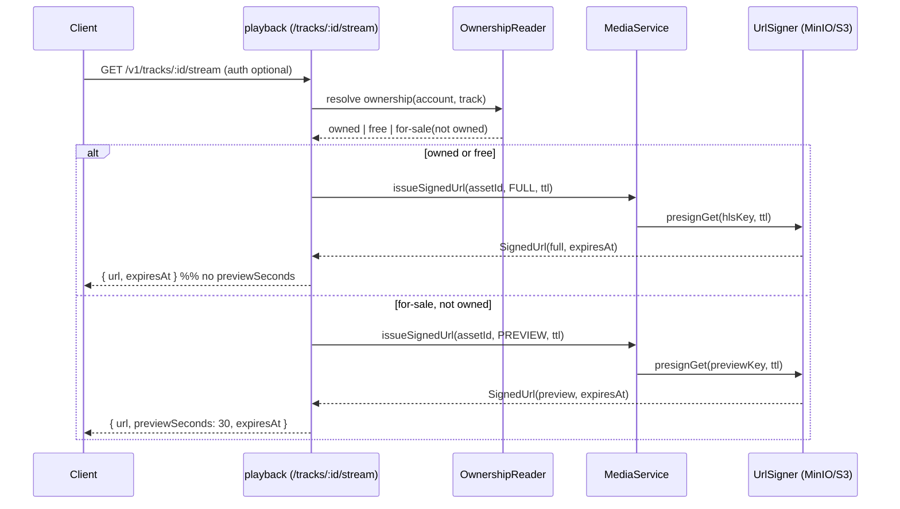
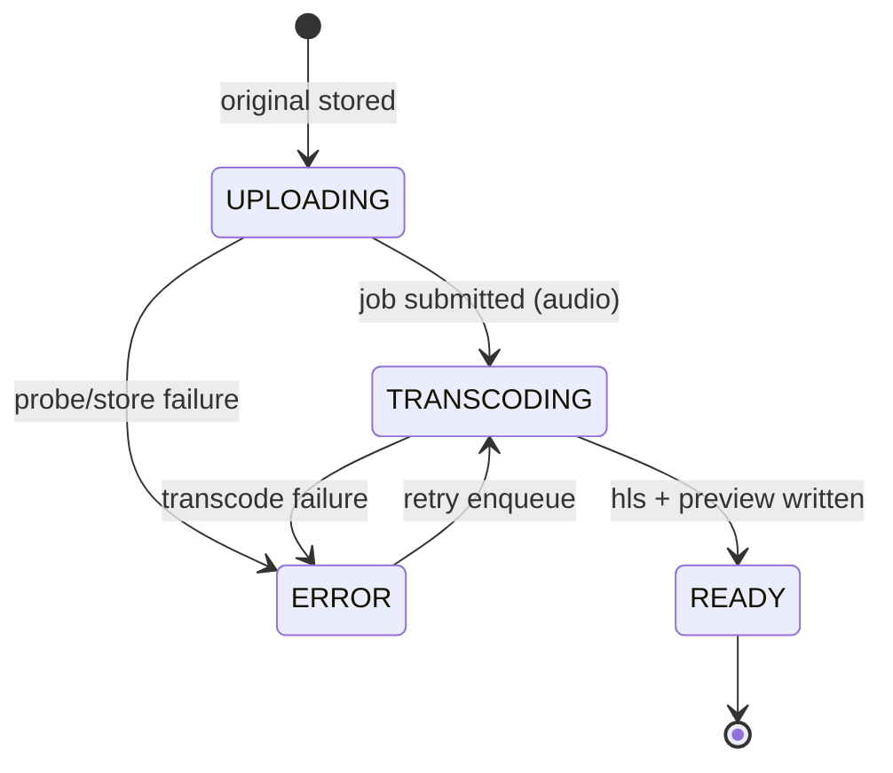

# Cross-Cutting Guide — Media Pipeline (operations & integration)

> **Audience:** Claude Code agents touching upload, transcode, storage, or signed delivery — in the
> `media` module **or** in any consuming module (`catalog`, `studio`, `podcasts`, `playback`).
> **PRD source:** `BACKEND-PRD.md` §5 (Compose / env), §6.14 (LLFR-MEDIA-01.*), §9.3 (signed/expiring
> delivery), INV-3 (30s preview gate), OQ-6 / OQ-10 (preview length / resumable uploads).
>
> **Read the module ADD first:** `architecture/media.md`. That doc is the design contract — port
> signatures (`MediaService`, `ObjectStorePort`, `UrlSignerPort`, `AudioTranscoderPort`, …), the
> `MediaAsset` domain model, the `media_asset` schema, and the work unit (WU-MED-1). **This guide does
> not repeat them.** It covers the *operational* pipeline and the *integration seams* between `media`
> and the modules that drive it. Where a signature is needed, this guide references the ADD (§4) rather
> than restating it.

---

## 1. What this guide adds over the ADD

| ADD (`architecture/media.md`) | This guide |
|---|---|
| Port/adapter signatures, domain model, schema | End-to-end pipeline **operations** across stages |
| Module-internal invariants (INV-3 statement) | **Where** each module enforces / observes them |
| C4 component view | **Storage layout**, lifecycle, transcode **profiles** |
| Work unit / DoD | Integration **contracts** consumers call, local dev runbook, failure ops |

`media` is **shared leaf infrastructure**: it owns no REST surface. Uploads arrive through
`catalog`/`studio` multipart endpoints; delivery through `playback`. Everyone integrates through the
in-process `MediaService` facade (ADD §4.2). Treat `media` as a queue-backed asset service sitting
behind two object-storage buckets.

---

## 2. End-to-end pipeline

```mermaid
flowchart TD
  U[Multipart part<br/>WAV/FLAC or PNG/JPG] --> V{Validate}
  V -->|magic bytes wrong| RJ1[422 UNSUPPORTED_FORMAT]
  V -->|over size limit| RJ2[413]
  V -->|virus positive| RJ3[422 FILE_REJECTED<br/>purge original]
  V -->|ok| S[putOriginal -> beatz-media-originals<br/>PRIVATE, never client-signed]
  S --> P[ffprobe duration]
  P --> A1[insert media_asset status=UPLOADING]
  A1 --> KAUDIO{kind?}
  KAUDIO -->|AUDIO| Q[enqueue TranscodeJob previewSeconds=30]
  KAUDIO -->|ARTWORK| ART[processArtwork -> delivery/{id}/art/]
  Q --> T[worker: status=TRANSCODING]
  T --> HLS[ffmpeg HLS ladder -> delivery/{id}/hls/]
  T --> PRV[ffmpeg 30s clip -> delivery/{id}/preview/]
  HLS --> R{both written?}
  PRV --> R
  R -->|yes| RDY[status=READY<br/>set hls_key, preview_key]
  R -->|transcode error| ERR[status=ERROR<br/>retryable]
  ART --> RDY
  RDY --> EV[emit MediaReady assetId,ownerRef,kind]
  EV --> CONS[catalog/studio/podcasts flip track/episode -> ready]
  RDY -.later, on demand.-> D[issueSignedUrl FULL/PREVIEW<br/>presign delivery key, TTL]
```

**Stage responsibilities (operational):**

1. **Upload** — caller's REST adapter streams the part into `UploadCommand` and calls
   `MediaService.uploadOriginal`. The part is streamed straight to object storage (not buffered whole
   in heap). Returns a `MediaHandle` synchronously while transcode runs async.
2. **Validation** — *magic-byte* sniffing (not the declared `Content-Type`): admit `WAV`/`FLAC`
   (audio), `PNG`/`JPG` (artwork). Size guard via `quarkus.http.limits.max-body-size`. Virus scan on
   the stored bytes (ClamAV-style adapter). Failures use the stable codes in §8.
3. **Store original** — private bucket only. Originals are **never** signed for client read.
4. **Transcode (audio)** — off the request thread, on the worker/queue: HLS variant ladder + a
   physically clipped 30s preview rendition. Idempotent per `assetId`.
5. **Artwork processing** — synchronous-ish image variant emission to the delivery bucket.
6. **Mark ready** — `READY` only once *both* `hls_key` and `preview_key` exist (audio), or the art
   variant exists (artwork). Emits `MediaReady`.
7. **Signed delivery** — on demand, separate from ingest; `playback`/`podcasts` request a time-boxed
   URL with FULL/PREVIEW chosen by ownership.

---

## 3. Storage layout

Two S3-compatible buckets (PRD §5.1; env `BEATZ_S3_BUCKET_ORIGINALS` / `BEATZ_S3_BUCKET_DELIVERY`).
The defaults are `beatz-media-originals` and `beatz-media-delivery`, created by the Compose
`createbuckets` init job.

| Bucket | Prefix / key | Access | Lifecycle |
|---|---|---|---|
| `beatz-media-originals` | `originals/{kind}/{assetId}` | **PRIVATE** — never public, never client-signed for read | retain (source of truth for re-transcode); optional cold-storage transition; orphan sweep (§8) |
| `beatz-media-delivery` | `delivery/{assetId}/hls/playlist.m3u8` + `*.ts` | signed GET only | regenerable from original; safe to expire on takedown |
| `beatz-media-delivery` | `delivery/{assetId}/preview/preview.m3u8` + ≤30s `*.ts` | signed GET only | regenerable |
| `beatz-media-delivery` | `delivery/{assetId}/art/cover-1024.jpg` (+ sizes) | signed GET only | regenerable |

**Public/private separation is a hard rule.** The delivery bucket is *not* world-readable either —
clients only ever reach it through a signed URL with a finite TTL (§5). The originals bucket has **no
client-facing path at all**; only the transcoder and re-transcode jobs read it (server-side creds).

**Key scheme rationale:** `{assetId}` is the partition key everywhere downstream, so takedown / cleanup
is a single prefix delete (`delivery/{assetId}/`). `originalKey`, `hlsKey`, `previewKey` are persisted
on `media_asset` (ADD §3) so delivery never reconstructs paths by convention at read time.

---

## 4. Transcoding profiles

Transcode runs in the Compose `transcoder` service (`jrottenberg/ffmpeg`, or in-app `ffmpeg`),
**driven by the async job** — never on the request thread.

**Accepted in:** `WAV`, `FLAC` (lossless masters). **Produced out:** HLS (AAC-LC in fMP4/TS segments).

**HLS variant ladder** (audio-only adaptive bitrate; tune in the transcoder adapter, not hard-coded in
domain):

| Rendition | Codec | Bitrate | Use |
|---|---|---|---|
| `low` | AAC-LC | ~96 kbps | constrained mobile / data-saver |
| `mid` | AAC-LC | ~160 kbps | default streaming |
| `high` | AAC-LC | ~256 kbps | wifi / owned full-quality |

The master `playlist.m3u8` references the per-rendition media playlists; segments target ~6s.

**30s preview clip (INV-3 enforcement, physical):** a *separate* rendition trimmed server-side to
`BEATZ_PREVIEW_SECONDS` (=30). It is not the full ladder with a client-side timer — the bytes for
seconds 31+ are never written to `preview/`. Representative invocation (illustrative; the adapter owns
the exact flags):

```bash
# preview: hard-clip to 30s, single mid-rate rendition, HLS
ffmpeg -i original.wav -t 30 \
  -c:a aac -b:a 160k -vn \
  -f hls -hls_time 6 -hls_playlist_type vod \
  -hls_segment_filename 'preview/seg_%03d.ts' preview/preview.m3u8

# full: probe duration first, then ladder (one stream-map per rendition)
ffprobe -v error -show_entries format=duration -of csv=p=0 original.wav
ffmpeg -i original.wav -c:a aac -vn \
  -b:a 96k  -f hls -hls_time 6 hls/low/playlist.m3u8 \
  -b:a 160k -f hls -hls_time 6 hls/mid/playlist.m3u8 \
  -b:a 256k -f hls -hls_time 6 hls/high/playlist.m3u8
```

**Artwork:** validate format, then emit delivery variants (e.g. `cover-1024.jpg`); strip metadata,
normalize color space. Artwork has no preview concept.

**Where it runs:** `AudioTranscoderPort` (ADD §4.2) is implemented by the ffmpeg adapter; the
`TranscodeJobPort` worker pulls jobs, calls `probeDurationSec` / `transcodeHls` / `clipPreviewHls`,
writes results via `ObjectStorePort.putDelivery`, then persists keys + `READY` in a short transaction.

---

## 5. Signed-URL delivery

Delivery is read-only and decoupled from ingest. `playback` (and `podcasts` for premium episodes) call
`MediaService.issueSignedUrl(assetId, variant, ttl)` (ADD §4.1).

- **TTL:** default from `BEATZ_SIGNED_URL_TTL_SECONDS` (PRD §5.2). Every `SignedUrl` carries
  `expiresAt` (ISO-8601 UTC). After `expiresAt` the object store rejects the GET — expiry is enforced
  by the store's signature, not by the app.
- **Variant selection (INV-3 enforcement point):**
  - **FULL** → presign `hlsKey`. Issued **only** when the caller asserts confirmed ownership (or the
    track is `free`).
  - **PREVIEW** → presign `previewKey` (the physical ≤30s rendition). Default for non-owners /
    anonymous on a `for-sale` track.
  - **There is no code path that presigns `hlsKey` without an asserted ownership decision.** `media`
    does not *resolve* ownership; the caller passes the decision in. The physical 30s rendition is the
    backstop even if a caller is buggy.



The wire response (PRD §6.13 / §9.3) exposes `{ url, expiresAt, previewSeconds? }`. The `variant`
field is **internal** — never serialized to the client.

---

## 6. Integration contracts

How each module wires into `media`. All calls are in-process CDI through `MediaService`.

### catalog / studio — upload
- The multipart endpoint (`API-CONTRACT.md` §11 `/studio/releases*`, §4 catalog ingestion) maps the
  part → `UploadCommand(ownerRef, kind, filename, declaredContentType, sizeBytes, body)` and calls
  `MediaService.uploadOriginal`. `ownerRef` is `"{module}:{entityId}"` (e.g. `catalog:trk_...`).
- The endpoint owns **caller authorization** (creator owns the release); `media` re-checks `ownerRef`
  consistency only. Resource owns no business logic beyond DTO→command mapping (conventions §5).
- It receives a `MediaHandle` and stores `assetId` + `durationSec` (whole **seconds**) on its own
  track/release row, status `UPLOADING`/`TRANSCODING`.

### podcasts — reuse
- Episodes reuse the **same** `uploadOriginal` / `issueSignedUrl` ports — no podcast-specific media
  code. Premium episode preview mirrors INV-3 (OQ-6 default: reuse 30s preview clip). `ownerRef` is
  `podcasts:ep_...`.

### playback — delivery
- `/tracks/:id/stream` resolves ownership via `OwnershipReader`, then calls
  `issueSignedUrl(assetId, FULL|PREVIEW, ttl)`. Never requests FULL without an ownership decision.
- Records the play (account?, track, ts, full-vs-preview) for counts/royalties; rate-limited per
  (account, track). The signed URL is returned in the response; `media` is not on the streaming hot
  path after issuance.

### Status lifecycle other modules observe
Consumers watch the `media_asset.status` transition via the `MediaReady` event (`AFTER_SUCCESS`), not
by polling storage:



`MediaReady(assetId, ownerRef, kind)` is the **only** signal consumers use to flip their owning
track/episode to `ready`. Do not have a consumer read `delivery/` keys directly to infer readiness.

---

## 7. Local dev (Compose)

- **Services** (PRD §5.1): `objectstore` (`minio/minio`, `9000`/`9001`), `createbuckets` (`minio/mc`
  one-shot — creates `beatz-media-originals` + `beatz-media-delivery` and their policies), `transcoder`
  (`jrottenberg/ffmpeg`). `app` `depends_on` `objectstore: service_healthy`. Volume `miniodata`
  persists the buckets.
- **Env** (PRD §5.2): `BEATZ_S3_ENDPOINT`, `BEATZ_S3_ACCESS_KEY`, `BEATZ_S3_SECRET_KEY`,
  `BEATZ_S3_BUCKET_ORIGINALS`, `BEATZ_S3_BUCKET_DELIVERY`, `BEATZ_SIGNED_URL_TTL_SECONDS`,
  `BEATZ_PREVIEW_SECONDS=30`. Sensible non-secret defaults live in `application.properties`.
- **Bucket init:** `createbuckets` sets the originals bucket private and the delivery bucket to
  signed-only (no anonymous read). Verify with `mc ls` after `docker compose up`.
- **Seed (PRD §5.4):** the repeatable `R__seed_dev_data.sql` inserts placeholder `media_asset` rows;
  `createbuckets`/seed uploads a small placeholder audio asset to MinIO so `/stream` returns a working
  signed URL against seed data.
- **Dev Services:** in `quarkus:dev`, when the `BEATZ_S3_*` Compose URLs are *absent*, Quarkus Dev
  Services can auto-provision MinIO (Testcontainers). When Compose URLs are set, Dev Services stand
  down. Integration tests (`*IT`) target Compose MinIO + Postgres; unit tests use fakes for the ports.

MinIO console: `http://localhost:9001`. Health: `/minio/health/live`.

---

## 8. Failure handling & resumable uploads

**Rejection codes (stable, assertable — conventions §4):**

| Condition | Code / status |
|---|---|
| Magic bytes not WAV/FLAC/PNG/JPG | `422 UNSUPPORTED_FORMAT` (`error.field = file`) |
| Over `max-body-size` | `413` |
| Virus scan positive | `422 FILE_REJECTED` + original purged |

**Transcode retries:** a failed job sets `status=ERROR`; re-enqueue transitions `ERROR → TRANSCODING`.
Bound retries (backoff); after exhaustion leave `ERROR` for moderation/re-transcode. Re-enqueue while
`TRANSCODING` is a no-op (idempotent per `assetId`).

**Idempotency:** `uploadOriginal` keyed on `(ownerRef, contentHash)` — re-uploading identical bytes
returns the existing `MediaHandle`, no duplicate object or row. Object writes happen *before* the
status transition commits, so a crash leaves an unreferenced object, not a `READY` asset with missing
bytes.

**Orphan cleanup:** assets stuck in `UPLOADING`/`ERROR` past a TTL, or `delivery/{assetId}/` prefixes
with no `READY` row, are swept by a maintenance job. Takedown deletes the whole `delivery/{assetId}/`
prefix (renditions are regenerable from the retained original).

**Resumable uploads (OQ-10):** v1 ships **plain multipart** with a generous `max-body-size`. A
resumable path (tus or S3 multipart upload) is added later **behind the same `uploadOriginal` port** —
an additional inbound adapter, **no API change** for consumers.

---

## 9. Security

- **No full rendition without ownership.** `issueSignedUrl` presigns `hlsKey` only on an asserted
  ownership decision; the physical 30s `previewKey` is the backstop (INV-3). Never add a helper that
  presigns `hlsKey` from a non-owner path.
- **Originals are private.** No object in `beatz-media-originals` is ever client-signed. Only
  server-side jobs (transcode / re-transcode) read it.
- **Content-type sniffing.** Trust magic bytes, never the declared `Content-Type` header.
- **Virus scanning** on stored originals before transcode; positive → purge + `FILE_REJECTED`.
- **No PII or signed URLs in logs** (conventions §9). Audit privileged content actions (takedown,
  re-transcode) via the `audit` port (INV-10).
- **Finite TTL** on every issued URL; `expiresAt` returned and enforced by the store.

---

## 10. Checklist for agents touching media

- [ ] Read `architecture/media.md` first; reuse its ports — do not invent new media endpoints.
- [ ] Consumers call `MediaService` only; never touch buckets/keys directly.
- [ ] Uploads go to the **private** originals bucket; renditions to the delivery bucket under
      `delivery/{assetId}/...`.
- [ ] Audio produces **both** HLS ladder + a physical ≤30s preview before `READY`.
- [ ] `issueSignedUrl(FULL)` only with an asserted ownership decision; default to PREVIEW otherwise.
- [ ] Every signed URL has a finite TTL (`BEATZ_SIGNED_URL_TTL_SECONDS`) and `expiresAt`; `variant`
      stays internal.
- [ ] Validation by magic bytes; correct rejection codes (`UNSUPPORTED_FORMAT`, `FILE_REJECTED`, 413).
- [ ] `uploadOriginal` idempotent on `(ownerRef, contentHash)`; `enqueueTranscode` idempotent per
      `assetId`.
- [ ] Consumers flip their entity to `ready` on `MediaReady`, not by reading storage.
- [ ] Durations are whole **seconds** (`*_sec`); timestamps `TIMESTAMPTZ`/ISO-8601.
- [ ] Transcode stays off the request thread (worker/queue).
- [ ] No PII / signed URLs in logs; privileged content actions audited.
- [ ] Resumable work stays behind the `uploadOriginal` port (no consumer API change).
- [ ] Boots under `docker compose up` with `objectstore` + `transcoder`; ArchUnit + Flyway green.