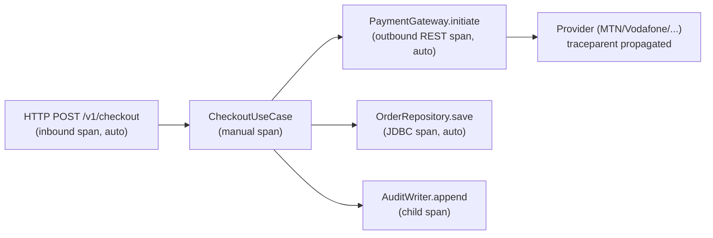

# Cross-Cutting: Observability

> **Scope.** Health, metrics, tracing, logging, SLOs/SLIs, alerting, dashboards for the BeatzClik
> backend (`org.shakvilla.beatzmedia`, Quarkus modular monolith). Governs every module.
> **PRD source:** §9.5 (observability), §10 (NFRs), §5 (infra), §6.12.1 (Admin health).
> **Companions:** `01-conventions-and-standards.md` §9, `cross-cutting/security-authz.md` (audit is
> distinct — see §4), `cross-cutting/api-and-contract.md`.

The three pillars (health, metrics, traces) plus structured logs are **not optional polish** — they
are part of the Definition of Done for every work unit (see §9). A WU that adds a use case without a
metric, a span, and structured logs is incomplete.

---

## 1. Extensions & config

Declared in `pom.xml` (per PRD §3 build list):

| Extension | Purpose |
|---|---|
| `quarkus-smallrye-health` | `/q/health/*` liveness/readiness + per-module checks |
| `quarkus-micrometer-registry-prometheus` | metrics + Prometheus scrape endpoint |
| `quarkus-opentelemetry` | distributed tracing (OTLP exporter) |
| `quarkus-logging-json` | structured JSON console logs in `%prod` |

Canonical `application.properties` keys (non-secret defaults; env overrides in `%prod`):

```properties
# Health
quarkus.smallrye-health.root-path=/q/health      # live: /q/health/live, ready: /q/health/ready
# Metrics
quarkus.micrometer.export.prometheus.path=/q/metrics
quarkus.micrometer.binder.http-server.enabled=true   # gives http_server_requests_seconds
quarkus.micrometer.binder.jvm=true
# Tracing
quarkus.otel.traces.enabled=true
quarkus.otel.exporter.otlp.traces.endpoint=${BEATZ_OTLP_ENDPOINT:http://localhost:4317}
quarkus.otel.resource.attributes=service.name=beatzmedia,deployment.environment=${BEATZ_ENV:dev}
%dev.quarkus.otel.traces.sampler=always_on
%prod.quarkus.otel.traces.sampler=parentbased_traceidratio
%prod.quarkus.otel.traces.sampler.arg=0.1            # 10% base; errors/money paths force-sampled (§3)
# Logging
%prod.quarkus.log.console.json=true
%dev.quarkus.log.console.json=false                  # human-readable inner loop
quarkus.log.level=INFO
```

`/q/metrics`, `/q/health/*` are **internal**: not exposed through the public `/v1` ingress; scraped by
Prometheus on the cluster network only. Do not put them behind the JWT filter (probes are unauthenticated
on the internal network).

---

## 2. Health

### 2.1 SmallRye Health endpoints

- `GET /q/health/live` — liveness. Answers "is the JVM up and not deadlocked?" Must **not** call DB,
  object store, or providers (a dependency outage must not trigger a pod restart). Orchestrator restart
  probe (PRD §5.5).
- `GET /q/health/ready` — readiness. Answers "can this instance serve traffic?" Aggregates per-module
  readiness checks (DB reachable, object store reachable, migrations applied). Used by Compose
  `depends_on: service_healthy` and the LB to gate traffic (PRD §5.1).

### 2.2 Per-module health contributions

Each module that owns external I/O registers a `@Readiness` check (an `org.eclipse.microprofile.health.
HealthCheck` bean) in its `adapter.out.*` package. Keep them **cheap and bounded** (short timeout):

| Check name | Owner module | Probes | Down means |
|---|---|---|---|
| `db` | platform/persistence | `SELECT 1` on the datasource | Postgres unreachable → not ready |
| `object-store` | media | MinIO/S3 `headBucket(delivery)` | media uploads/delivery degraded |
| `payment-gateway` | payments | provider ping / last-success age | checkout init degraded (still **live**) |
| `search-index` | search | index ping + lag threshold | search degraded |
| `cache` | platform | `redis ping` (only if Redis configured) | rate-limit falls back to in-memory |

Gateway/cache/search checks are **degradation signals**, not hard readiness fails — a payments provider
outage should keep the instance serving reads/streams (PRD §10: "payments degrade gracefully"). Mark
those `@Readiness` only if their loss should pull the pod from the LB; otherwise expose them as a custom
health group consumed by the Admin endpoint, not by the LB probe.

### 2.3 Mapping to Admin `/v1/admin/health`

`/q/health/*` is infra-facing (boolean checks). The Admin console (PRD §6.12.1, LLFR-ADMIN-01.2) needs a
**business** health view. The admin module's `GET /v1/admin/health` is a thin read adapter that composes
SmallRye check states **plus** queried metric values into the frontend `Health` shape
(`Frontend/src/lib/admin-data.ts`):

| Admin field | Source |
|---|---|
| `status: 'normal' \| 'degraded'` | `degraded` if any non-DB readiness check down OR any SLO burning (§5) |
| `metrics[].API p95` (`"142ms"`, budget 200ms) | PromQL p95 over `http_server_requests_seconds` (read group) |
| `metrics[].Streaming uptime` (`"99.98%"`) | availability SLI over stream-URL endpoint (§5) |
| `metrics[].MoMo gateway` (`OK`, "N retries · M failed") | `payment-gateway` check + `payment_attempts_total` by status |
| `metrics[].CDN errors` (`"0.02%"`, budget 0.1%) | delivery 5xx ratio |
| `listeners[]` | concurrent-listeners time series from analytics rollups |
| `incidents[]` | persisted incident log (admin-owned table), not from SmallRye |

The admin endpoint formats numbers for display (ms strings, percentages); raw metrics stay numeric in
Prometheus. Auth: any admin role (PRD §6.12.1).

---

## 3. Metrics (Micrometer + Prometheus)

### 3.1 Naming & tags

- Follow Micrometer/Prometheus convention: lowercase, dot-separated meter names (Prometheus renders them
  with underscores + `_total`/`_seconds` suffixes). Prefix all custom meters with `beatz.`.
- Counters end in a noun (`beatz.payment.attempts`), timers describe the operation (`beatz.checkout.init`).
- **Tags are low-cardinality only.** Allowed: `module`, `endpoint_group`, `provider` (mtn/vodafone/
  airteltigo/card/bank), `status` (success/failed/pending), `result`, `job`. **Never** tag with user id,
  order id, track id, email, or raw path — that explodes cardinality and can leak PII.
- Money is reported as **minor units (pesewas)** in metrics (consistent with storage,
  `01-conventions-and-standards.md` §2); convert to cedis only at display.

### 3.2 Key metrics per concern

| Metric (meter name) | Type | Tags | Concern |
|---|---|---|---|
| `http_server_requests_seconds` | timer (built-in) | `endpoint_group`, `status` | request latency p95 by endpoint group |
| `beatz.payment.attempts` | counter | `provider`, `status` | payment success rate (success / total) |
| `beatz.payment.webhook.lag` | timer | `provider` | webhook processing lag (received → handled) |
| `beatz.payment.webhook.failures` | counter | `provider`, `reason` | webhook handler failures |
| `beatz.transcode.queue.depth` | gauge | — | transcode queue backlog |
| `beatz.transcode.jobs` | counter | `result` (ok/failed) | transcode failures |
| `beatz.payout.batch.value` | counter | `provider` | payout volume (value, minor units) |
| `beatz.payout.batch.count` | counter | `provider`, `status` | payout count / failures |
| `beatz.ledger.imbalance` | gauge | — | **must be 0** (INV-6); alarm on ≠ 0 |
| `beatz.reconciliation.discrepancies` | gauge | — | settled-vs-provider mismatches |
| `beatz.notification.delivery` | counter | `channel` (email/sms/push), `status` | notification delivery success |
| `beatz.search.index.lag` | gauge | — | reindex lag (catalog change → searchable) |
| `beatz.play.events` | counter | — | play-event ingest rate |
| `beatz.ratelimit.rejections` | counter | `endpoint_group` | 429s (auth/checkout/tip/play/upload) |

Define `endpoint_group` (not per-path) so HTTP timers stay low-cardinality: `read` (catalog/store/
search), `stream` (stream-URL issuance), `checkout`, `auth`, `admin`, `write-other`. Map via a
Micrometer `MeterFilter`/tag provider in `adapter.in.rest`.

### 3.3 How to record

Inject `MeterRegistry` (constructor injection per §10). Record in the **application layer** (use case)
or the relevant outbound adapter, never in the domain (domain stays framework-free). Use
`@Timed`/`@Counted` annotations for simple cases; programmatic `registry.timer(...).record(...)` and
gauges (`Gauge.builder`) for queue depths and the ledger-imbalance/reconciliation values (computed by a
scheduled check, PRD §6.12 / §9.5).

---

## 4. Tracing (OpenTelemetry)

Quarkus auto-instruments inbound REST, JDBC, and outbound REST clients. The pattern we want is a span
per layer: **inbound HTTP → use case → outbound (DB / provider / storage)**, all under one trace.



### 4.1 Correlation / trace id propagation

- A `correlationId` (== OTel `trace_id`) is established at the inbound edge. If the client sends
  `traceparent` (W3C), continue it; otherwise generate. A small JAX-RS filter also accepts/echoes an
  `X-Correlation-Id` header for clients that don't speak W3C, and seeds it into MDC.
- Outbound REST clients (payment providers, mailer) propagate `traceparent` automatically; webhooks
  carry `provider` + the original order ref so the inbound webhook span can be linked to the originating
  checkout trace.
- The `correlationId` is put in the **logging MDC** (§5 logging) so every log line for a request shares
  the trace id; the same value surfaces in the error envelope is **not** required, but a `503`/`500`
  may include it as an opaque support reference.

### 4.2 Span attributes

Add **business** attributes to the use-case span (string keys, namespaced `beatz.*`), keeping them free
of PII/secrets:

```
beatz.module=payments
beatz.use_case=CheckoutInit
beatz.order_ref=BZ-2026-0501      # human-facing ref, not a card/PAN
beatz.provider=mtn
beatz.amount_minor=250            # pesewas
beatz.idempotency_key_present=true
beatz.result=accepted             # accepted/rejected/duplicate
```

Never set attributes for PAN, MoMo MSISDN, JWT, webhook secret, or email. Money/admin spans are
**force-sampled** (set sampling priority / use a tail-based rule) so financial flows are always traced
even at 10% base sampling.

---

## 5. Logging

- **Format:** structured JSON in `%prod` (`quarkus-logging-json`); human-readable in `%dev`. One event
  per line.
- **Required fields:** `timestamp` (ISO-8601 UTC), `level`, `logger`, `message`, `correlationId`
  (trace id from MDC), `module`, `accountId` (only the opaque id, never email/name), `endpointGroup`.
- **Levels:** `ERROR` = unexpected/needs attention (paged via 5xx rate, §7); `WARN` = handled
  degradation (provider retry, rate-limit hit, reconciliation discrepancy); `INFO` = lifecycle &
  money/admin actions (§5.1); `DEBUG` = dev only, off in prod.
- **NO PII / NO secrets — ever.** Forbidden in any log: card PAN, MoMo MSISDN/phone, email, full name,
  JWT/Authorization header, `BEATZ_*_SECRET`, webhook secret, KYC document content, SQL with literal
  values, stack traces in `message` (log the exception separately at ERROR). Mirrors
  `01-conventions-and-standards.md` §4/§9 and PRD §9.5/§10 (Act 843 PII minimization). Use opaque ids
  (`accountId`, `orderRef`) instead. A log scrubber/redactor in the JSON formatter is the backstop, not
  the primary control — write clean logs.

### 5.1 Logging money & admin actions (distinct from audit)

PRD §9.5 / INV-10 require an **append-only `AuditEntry`** for every privileged mutation, written via the
`AuditWriter` port and queryable at `/v1/admin/audit`. That is the **authoritative, immutable** record.
Logging is **separate and complementary**:

- The audit table is the source of truth (legal/compliance, who-did-what); structured logs are
  operational telemetry (debugging, alerting, latency).
- On every money path (checkout, settlement, payout, refund, tip) and admin mutation, emit an `INFO` log
  with `correlationId`, `module`, actor `accountId`, action, target ref, and `result` — but **also**
  write the `AuditEntry`. Do not rely on logs as the audit trail (logs rotate/expire; audit does not).
- Never log the audit payload's sensitive fields; audit storage policy lives in
  `cross-cutting/security-authz.md`.

---

## 6. SLOs / SLIs & error budgets

Derived from PRD §10. SLIs are computed from the metrics in §3.

| Service | SLI | SLO target | Window |
|---|---|---|---|
| Reads (catalog/store/search) | p95 latency of `http_server_requests_seconds{endpoint_group="read"}` | **p95 ≤ 200 ms** | 28d rolling |
| Stream-URL issuance | p95 latency `{endpoint_group="stream"}` | **p95 ≤ 150 ms** | 28d rolling |
| Checkout init | p95 latency `{endpoint_group="checkout"}` (**excl. provider** — async) | **p95 ≤ 500 ms** | 28d rolling |
| Read/stream availability | successful (non-5xx) / total over read+stream | **99.9%** | 28d rolling |
| Ledger integrity | `beatz.ledger.imbalance == 0` | **100%** (zero tolerance, INV-6) | continuous |

**Error budget.** 99.9% availability over 28 days ≈ **40 min** of allowed unavailability. Latency SLOs
budget the share of requests allowed over threshold (e.g. ≤ 5% of read requests may exceed 200 ms before
the p95 SLO is at risk). When >50% of an error budget is consumed in-window, raise a warning alert and
freeze risky changes to that path; the `/admin/health` `status` flips to `degraded` when a budget is
actively burning (§2.3). The ledger SLO has **no** budget — any imbalance is a critical incident.

---

## 7. Alerting

Alerts are Prometheus alerting rules → on-call. Severity: **critical** (page immediately) vs **warning**
(ticket / business-hours).

| Alert | Condition | Severity |
|---|---|---|
| LedgerImbalance | `beatz_ledger_imbalance != 0` | **critical** (INV-6, page) |
| ReconciliationDiscrepancy | `beatz_reconciliation_discrepancies > 0` for 10m | **critical** |
| PaymentWebhookFailures | `rate(beatz_payment_webhook_failures_total[5m]) > 0` sustained | **critical** |
| PayoutFailures | `increase(beatz_payout_batch_count_total{status="failed"}[15m]) > 0` | **critical** |
| TranscodeFailures | `rate(beatz_transcode_jobs_total{result="failed"}[10m])` over threshold | warning→critical |
| High5xxRate | 5xx ratio on read/stream > 1% for 5m (availability budget burn) | **critical** |
| HealthDegraded | any `@Readiness` check down (DB/object-store) | **critical** |
| LatencySLOBurn | read p95 > 200 ms (or stream > 150 ms) for 10m | warning |
| QueueBacklog | `beatz_transcode_queue_depth` or `beatz_search_index_lag` over threshold | warning |
| RateLimitSpike | `rate(beatz_ratelimit_rejections_total[5m])` anomalous | warning (possible abuse) |

Critical payment alerts tie back to the Admin "MoMo gateway" tile and the incident log so support sees
the same signal (PRD §6.12.1).

---

## 8. Dashboards

Build these Grafana boards (Prometheus datasource), grouped to mirror the Admin console:

- **Platform overview** — request rate, 5xx ratio, read/stream p95, availability burndown vs SLO,
  current `/admin/health` status. (Backs PRD §6.12.1 health tiles.)
- **Payments & money** — payment success rate by provider, webhook processing lag, checkout init p95,
  reconciliation discrepancies, **ledger imbalance (must read 0)**.
- **Payouts** — batch volume (value, minor→cedis) and count by provider, failures, MoMo float context.
- **Media pipeline** — transcode queue depth, throughput, failure rate, time-to-ready.
- **Search & discovery** — index lag, search latency, search 5xx.
- **Engagement** — play-event rate, concurrent listeners (feeds Admin `listeners[]` series).
- **Abuse & limits** — rate-limit rejections by endpoint group, 429 rate, suspicious spikes.
- **Runtime** — JVM heap/GC, DB pool saturation, instance count.

Each panel uses the meters in §3; latency panels use histogram quantiles over
`http_server_requests_seconds` filtered by `endpoint_group`.

---

## 9. Agent instrumentation checklist (every WU)

Treat this as part of the Definition of Done (`01-conventions-and-standards.md` §11). When you add a use
case, endpoint, job, or outbound adapter:

- [ ] **Metric** — add/extend a Micrometer meter for the new concern (counter/timer/gauge), `beatz.`
      prefix, low-cardinality tags only (`module`, `endpoint_group`, `provider`, `status`). Record in
      the use case or adapter, **not** the domain.
- [ ] **Span** — ensure the use case runs in a span with `beatz.module` / `beatz.use_case` and relevant
      non-PII business attributes; money/admin paths force-sampled.
- [ ] **Health** — if the WU adds an external dependency (new provider, store, queue), register a cheap
      bounded `@Readiness`/health check and wire it into `/admin/health` mapping (§2.3).
- [ ] **Structured logs** — INFO on lifecycle + money/admin actions with `correlationId`, opaque
      `accountId`, action, target ref, `result`; WARN on handled degradation; ERROR on unexpected. No
      PII, no secrets, no raw stack traces in `message`.
- [ ] **Audit (if privileged)** — append an `AuditEntry` via `AuditWriter` (INV-10); logging does **not**
      substitute for audit (§5.1).
- [ ] **SLO/alert** — if the path is money- or availability-critical, confirm it is covered by an SLI
      and an alert rule (§6, §7); add a dashboard panel (§8) if a new concern.
