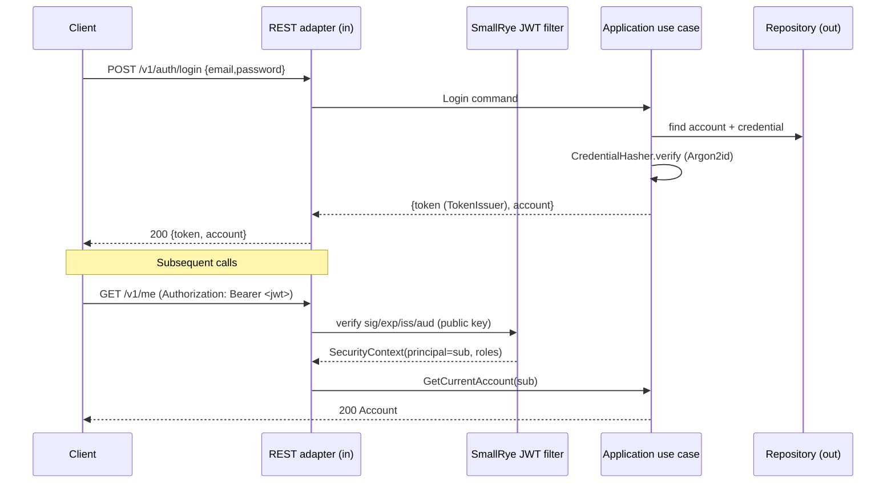

# Security & Authorization — Cross-Cutting Guide

> **Audience:** Claude Code agents implementing the BeatzClik backend (`beatzmedia`, Quarkus modular
> monolith, hexagonal). **PRD source:** §9.1 (authN/authZ), §9.2 (idempotency), §9.5 (security/rate
> limiting/audit), §6.1 (identity), §6.12 (admin RBAC), §10 (compliance). **Contract:** `API-CONTRACT.md`
> §1 (auth conventions), §14 (RBAC scopes). **Conventions:** `01-conventions-and-standards.md` §4
> (errors), §7 (authorization). Where a module ADD is silent on security, **this document governs**.
>
> Cross-refs: `analytics-audit-platform.md` (AuditEntry writer & schema), `admin.md` (admin RBAC
> surfaces & compliance), `api-and-contract.md` (idempotency headers), `data-and-migrations.md`
> (encryption at rest), `observability.md` (no-PII logging).

This guide is a contract for **every** module. Security is not a module; it is a property of the
inbound adapter (authN + coarse authZ), the application layer (resource-ownership re-checks), and the
outbound adapters (signed URLs, webhook verification, secret handling). Two non-negotiables run
through everything: **(1) defence in depth** — never trust the REST filter alone; **(2) audit
completeness** — every privileged mutation appends exactly one `AuditEntry` (INV-10).

---

## 1. Authentication (AuthN)

### 1.1 Model

Stateless **Bearer JWT** (SmallRye JWT). Every request carries `Authorization: Bearer <jwt>`. The app
holds no session state for normal traffic (the `session` table is optional and used only for
impersonation revocation and refresh, OQ-3). A short-lived **access token** is the only credential the
client sends; there is **no server-side login session** to invalidate for plain fans/artists.

Token lifetime and re-login (OQ-3 default): **access JWT ~15 min** (`exp`), re-issued by re-login for
v1. **Refresh tokens are a future iteration** — do not implement opaque refresh rotation now, but keep
the `TokenIssuer` output port shaped so a refresh grant can be added without touching callers. OIDC is
optional for social federation only.

### 1.2 Token claims

`sub` = account id (opaque string, the typed `AccountId`). `roles` = a JSON array combining the
fan/artist base role **and** any admin scopes. Admin scopes are stored canonical **lowercase-kebab**
(`super-admin`, not `Super-admin` — see PRD R1 / OQ-1; UI renders the title-case label).

```jsonc
// Example claim set — an artist who is also a finance admin
{
  "iss": "https://api.beatzclik.com",
  "sub": "acc_01HZX9V7K3Qm2pE8",          // = AccountId
  "upn": "ama@example.com",               // SmallRye principal name
  "roles": ["fan", "artist", "finance"],  // base role + admin scope(s)
  "iat": 1750579200,
  "exp": 1750580100,                       // ~15 min
  "jti": "a3f1c0d4-..."                    // for impersonation/blacklist correlation
}
```

Rules: `artist ⊃ fan` (an artist token always also carries `fan`). Admin scopes are **orthogonal** —
an admin is not implicitly a fan unless they also hold a personal account. Never put PII beyond `upn`
in the token; never put a password hash, KYC data, or balance in claims.

### 1.3 `quarkus.smallrye-jwt` configuration

Keys are RS256 (asymmetric): private key signs at issuance, public key verifies on inbound. Keys come
from env vars (`BEATZ_JWT_PRIVATE_KEY` / `BEATZ_JWT_PUBLIC_KEY`, PRD §5.2), never the repo.

```properties
# verification (inbound) — quarkus-smallrye-jwt
mp.jwt.verify.publickey.location=${BEATZ_JWT_PUBLIC_KEY}
mp.jwt.verify.issuer=https://api.beatzclik.com
mp.jwt.verify.audiences=beatzclik-api
quarkus.smallrye-jwt.blocking-authentication=true
smallrye.jwt.token.header=Authorization
smallrye.jwt.token.schemes=Bearer
smallrye.jwt.always-check-authorization=true
# issuance (outbound) — quarkus-smallrye-jwt-build
smallrye.jwt.sign.key.location=${BEATZ_JWT_PRIVATE_KEY}
smallrye.jwt.new-token.issuer=https://api.beatzclik.com
smallrye.jwt.new-token.lifespan=900   # seconds (15 min access token)
```

```java
/** Issues signed access tokens. Output port; the SmallRye-Build impl lives in adapter.out.auth. */
public interface TokenIssuer {
  String issueAccess(AccountId sub, Set<Role> roles);              // 15-min access JWT
  String issueImpersonation(AccountId actor, AccountId target, Duration ttl); // §3
}
```

### 1.4 Password hashing & social login

Passwords are hashed with **Argon2id** (PRD §4.3, §6.1). Never SHA/bcrypt, never plaintext, never
logged. Use a vetted impl (e.g. `de.mkammerer:argon2-jvm` or Bouncy Castle) behind a port.

```java
/** Argon2id hashing. Tune memory/iterations/parallelism; store the full encoded string incl. salt. */
public interface CredentialHasher {
  String hash(char[] rawPassword);                 // -> $argon2id$v=19$m=...,t=...,p=...$salt$hash
  boolean verify(String encoded, char[] rawPassword);
}
```

Login returns a generic `401 INVALID_CREDENTIALS` for both unknown email and wrong password (no user
enumeration, LLFR-IDENTITY-01.2). Suspended accounts → `403 ACCOUNT_SUSPENDED`. Password reset always
returns `204` regardless of whether the email exists (LLFR-IDENTITY-01.5).

Social login (`POST /auth/social`, `{ provider: facebook|google|twitter, token }`) **verifies the
provider token server-side** via a `SocialVerifier` port (validate signature/audience against the
provider's JWKS/tokeninfo), then links or creates an account by the *verified* email. A client-supplied
email is never trusted — only the email the provider asserts. Invalid provider token → `401
SOCIAL_TOKEN_INVALID`.



---

## 2. Authorization (AuthZ) — two-layer enforcement

Per conventions §7 and PRD §9.1, authorization is enforced in **two** places. Both are mandatory; a
PR that does only one fails review.

**Layer 1 — REST adapter role/scope filter.** Coarse-grained: "is this principal allowed to call this
endpoint at all?" Implemented with annotations on the JAX-RS resource method.

**Layer 2 — Application-layer resource-ownership re-check.** Fine-grained: "does this principal own
the specific resource they are acting on?" A creator may touch only their own releases; a fan only
their own cart/collection/playlists. This lives in the use case, never the resource, and is enforced
even if Layer 1 is misconfigured.

```mermaid
flowchart LR
  A[Request + Bearer JWT] --> B{Layer 1:\nROLE / SCOPE filter\n(REST adapter)}
  B -- denied --> E1[403 ARTIST_REQUIRED /\nINSUFFICIENT_SCOPE]
  B -- ok --> C{Layer 2:\nresource ownership\n(application use case)}
  C -- not owner --> E2[404 (hide existence)\nor 403]
  C -- ok --> D[Domain mutation + AuditEntry]
```

### 2.1 Layer 1: annotations

Fan endpoints: any authenticated account. Studio endpoints: `@RolesAllowed("artist")` (403
`ARTIST_REQUIRED`). Admin endpoints: a custom `@RequiresScope` because admin authz is scope-based and
config-driven (OQ-1), not a flat role check.

```java
// Studio — base role is enough; ownership re-checked in Layer 2.
@POST @Path("/studio/releases")
@RolesAllowed("artist")
public StudioReleaseDto submitRelease(@Valid ReleaseDraftDto body, @Context SecurityContext ctx) { ... }

// Admin — scope-based; @RequiresScope reads the config-driven action→role map (OQ-1).
@POST @Path("/admin/users/{id}/suspend")
@RequiresScope(AdminAction.USER_SUSPEND)   // resolves to {super-admin, moderator}
public void suspend(@PathParam("id") String id, @Valid SuspendDto body, @Context SecurityContext ctx) { ... }
```

```java
/** Custom binding enforced by a JAX-RS ContainerRequestFilter (adapter.in.rest.security). */
@NameBinding @Retention(RUNTIME) @Target({METHOD, TYPE})
public @interface RequiresScope { AdminAction value(); }

/** Config-driven action -> allowed-roles map (OQ-1); tuned in PlatformSettings, no code change. */
public interface AdminAuthorizationPolicy {
  Set<AdminRole> rolesFor(AdminAction action);     // e.g. USER_SUSPEND -> {SUPER_ADMIN, MODERATOR}
  boolean permits(Set<Role> principalRoles, AdminAction action);
}
```

The filter reads `JsonWebToken.getGroups()` (the `roles` claim), resolves the required scope via
`AdminAuthorizationPolicy`, and rejects with `403 INSUFFICIENT_SCOPE` on mismatch. `super-admin`
short-circuits to allow-all.

### 2.2 Layer 2: ownership re-check (illustrative)

```java
class SubmitReleaseService implements SubmitRelease {
  public StudioRelease handle(AccountId caller, ReleaseDraft draft) {
    ArtistProfile artist = artists.requireOwnedBy(caller);     // throws if caller has no artist profile
    Release release = Release.fromDraft(artist.id(), draft);    // domain enforces INV-5/INV-12
    // ... persist; caller can only ever create releases under their own artist id
  }
}

class UpdateReleaseService implements UpdateRelease {
  public void handle(AccountId caller, ReleaseId id, ReleasePatch patch) {
    Release r = releases.byId(id).orElseThrow(NotFound::new);   // 404 hides existence
    if (!r.artistId().equals(artists.idFor(caller))) throw new NotFound(); // not owner -> 404, not 403
  }
}
```

Convention: for **private/owned** resources, a non-owner gets **404** (hide existence, conventions §4 /
LLFR-CATALOG-01.7), not 403. For **admin** scope failures, use **403 INSUFFICIENT_SCOPE** (the
resource exists; the actor simply lacks the scope).

### 2.3 RBAC scope → section matrix

Lifted from `API-CONTRACT.md` §14 and PRD §6.12 (mirrors `admin-data.ts` `ADMIN_ROLES`). `super-admin`
holds **all** scopes. Cells: ✅ full · 👁 read-only · — none.

| Admin section / action | super-admin | finance | moderator | editor | support |
|---|:--:|:--:|:--:|:--:|:--:|
| Overview / health (read) | ✅ | 👁 | 👁 | 👁 | 👁 |
| Users — lookup/detail (read) | ✅ | 👁 | 👁 | 👁 | 👁 |
| Users — verify artist | ✅ | — | ✅ | — | — |
| Users — suspend / reactivate | ✅ | — | ✅ | — | — |
| Users — **impersonate** | ✅ | — | — | — | — |
| Users — data-export (DSAR) | ✅ | — | — | — | 🟡 initiate¹ |
| Catalog moderation (approve/flag/takedown) | ✅ | — | ✅ | — | — |
| Moderation queue | ✅ | — | ✅ | — | — |
| Finance — overview/ledger (read) | ✅ | ✅ | — | — | 👁 |
| Finance — payout runs / send | ✅ | ✅ | — | — | — |
| Finance — disputes (refund/reject/escalate) | ✅ | ✅ | — | — | — |
| Editorial (featured/push/playlists) | ✅ | — | — | ✅ | — |
| Trust & safety (review/clear/ban) | ✅ | — | ✅ | — | — |
| Support tickets (reply/assign/resolve) | ✅ | ✅ | ✅ | ✅ | ✅ |
| Compliance (DSAR/Takedown/Tax) | ✅ | — | — | — | 🟡 initiate¹ |
| Platform settings / feature flags | ✅ | — | — | — | — |
| Team & RBAC (invite/role/remove) | ✅ | — | — | — | — |
| Audit log (read) | ✅ | — | — | — | — |

¹ **OQ-1:** support may *initiate* a data-export/compliance request; **super-admin approves/completes**.
The exact action→role map is **config-driven** (`AdminAuthorizationPolicy` backed by
`PlatformSettings`) so it can be tuned without a code change. Defaults above. "support = user lookup +
read-only elsewhere" is the contract §14 baseline.

---

## 3. Impersonation

`POST /v1/admin/users/:id/impersonate` (super-admin only, LLFR-ADMIN-02.5). Returns a **scoped,
short-lived** token (default TTL ≤ 15 min) whose claims encode both the impersonated `sub` (the target
account) and an `act` claim naming the real actor, plus a distinct `jti` for revocation.

```jsonc
{
  "sub": "acc_target_...",          // acts AS the target
  "roles": ["fan", "artist"],       // target's roles only — never the admin's scopes
  "act": { "sub": "acc_admin_...", "scope": "impersonation" },
  "exp": 1750580100, "jti": "imp_..."
}
```

Rules: the impersonation token **never** carries admin scopes (cannot self-escalate). It is **heavily
audited** — issuance appends an `AuditEntry { actor=admin, action=IMPERSONATE_START, target=user,
type=user }` with expiry; every mutation made under it is audited with the `act.sub` recorded as the
real actor. Impersonation `jti`s are tracked in the `session` table so they can be revoked early.

---

## 4. KYC handling (INV-8)

KYC gates payouts. A `WithdrawalRequest` is accepted only when `amount ≥ MIN_PAYOUT (₵10)`, cleared
balance suffices, **and** the creator has a `KycRecord` in `verified` state (INV-8). Otherwise →
`403 KYC_REQUIRED`. Admin single-send (`/admin/finance/payouts/:id/send`) also blocks on KYC.

- **Access restriction (PRD §10):** KYC data (ID numbers, documents) is access-restricted — readable
  only by `finance`/`super-admin` for payout adjudication, never returned on fan/artist endpoints,
  never in tokens or general logs.
- **Encryption:** KYC document references and sensitive fields are encrypted at rest (see
  `data-and-migrations.md`); documents live in a private bucket with no public/signed read for
  non-finance roles.
- **Retention (PRD §10):** retained **only as long as required for payout compliance**, then purged;
  DSAR-delete must respect a legal-hold exception for active payout/tax obligations.

---

## 5. Webhook security (payments)

Provider payment webhooks (`PaymentEvent`) are the only inbound calls not bearing a user JWT. They are
secured by **signature verification** and **idempotency on provider event id** (PRD §9.2).

- **Signature:** verify the provider's HMAC signature header against the raw request body using
  `BEATZ_PAYMENT_WEBHOOK_SECRET` (PRD §5.2). Compute over the **raw bytes** before JSON parsing;
  compare with a **constant-time** equality. Mismatch → `401` (and the event is dropped, logged
  without payload PII). Reject stale timestamps to blunt replay.
- **Idempotency:** persist the provider `eventId` (unique constraint); a duplicate delivery returns
  `200` without re-applying the effect. Ownership is granted **only** on `SETTLED` (INV-1) and exactly
  once per order.

```java
@POST @Path("/webhooks/payments/{provider}")
@PermitAll  // no user JWT — authenticated by HMAC signature instead
public Response onPaymentEvent(@PathParam("provider") String provider,
                               @HeaderParam("X-Beatz-Signature") String sig,
                               byte[] rawBody) {
  if (!webhookVerifier.verify(provider, rawBody, sig)) return Response.status(401).build();
  webhookIngest.ingestIdempotent(provider, rawBody);   // dedupe on providerEventId
  return Response.ok().build();
}
```

---

## 6. Rate limiting (PRD §9.5)

Token-bucket per **account** (when authenticated) and per **IP** (fallback / anonymous), **Redis-backed
when present** (`quarkus-redis-client`), in-memory fallback for single-instance dev. Applied to
auth, checkout, tip, play-record, and upload endpoints. On exhaustion → **`429`** with the standard
error envelope (`code: RATE_LIMITED`) **and a `Retry-After` header** (seconds).

```java
@NameBinding @Retention(RUNTIME) @Target({METHOD, TYPE})
public @interface RateLimited { String bucket(); }   // filter resolves limit from config table below
```

Suggested limits (tune in config; these seed the defaults):

| Endpoint group | Key | Limit | Window | Burst | Notes |
|---|---|---|---|---|---|
| `POST /auth/login`, `/auth/social` | IP + email | 5 | 1 min | 5 | brute-force / credential-stuffing guard |
| `POST /auth/signup` | IP | 3 | 1 min | 3 | abuse / fake-account guard |
| `POST /me/password/reset` | IP + email | 3 | 15 min | 3 | enumeration / spam guard |
| `POST /checkout` | account | 10 | 1 min | 5 | also idempotency-key protected |
| `POST /podcasts/:id/tip` | account | 20 | 1 min | 10 | money mutation |
| `POST /tracks/:id/play` | account + track | 1 | per 30 s | 3 | anti play-inflation (LLFR-PLAYBACK-01.2) |
| `POST /studio/releases/:id/tracks` (upload) | account | 20 | 1 hour | 5 | large-body / transcode load |
| Admin mutations | account | 60 | 1 min | 20 | backstop |

`Retry-After` is the seconds until the bucket refills enough for the next request. Rate-limit decisions
are never logged with request bodies.

---

## 7. Secrets management (PRD §5.2)

**Env vars only.** No secrets in the repo, in `application.properties` (non-secret defaults only), in
logs, or in error messages (conventions §4 — never leak SQL/stack/PII). Production config is **entirely
via environment** (PRD §5.5); `%prod` requires real secrets and refuses to boot with placeholders.

Security-sensitive env vars (from PRD §5.2):

- **Datastore:** `QUARKUS_DATASOURCE_PASSWORD`, `QUARKUS_DATASOURCE_USERNAME`, `QUARKUS_DATASOURCE_JDBC_URL`.
- **Object store:** `BEATZ_S3_ACCESS_KEY`, `BEATZ_S3_SECRET_KEY` (+ `BEATZ_S3_ENDPOINT`).
- **JWT keys:** `BEATZ_JWT_PRIVATE_KEY`, `BEATZ_JWT_PUBLIC_KEY` (or OIDC issuer vars).
- **Mailer / SMS:** `QUARKUS_MAILER_*`, `BEATZ_SMS_*`.
- **Payment providers:** `BEATZ_MOMO_MTN_*`, `BEATZ_MOMO_VODAFONE_*`, `BEATZ_MOMO_AIRTELTIGO_*`,
  `BEATZ_CARD_*`, **`BEATZ_PAYMENT_WEBHOOK_SECRET`**.

Signed-URL TTL (`BEATZ_SIGNED_URL_TTL_SECONDS`) and preview length (`BEATZ_PREVIEW_SECONDS=30`) are
config, not secrets. The economic constants (`BEATZ_PLATFORM_FEE_PCT`, etc.) seed `PlatformSettings`
and are non-secret. Never echo any of the above in logs, audit entries, or API responses.

---

## 8. Transport & data protection

- **TLS:** enforced in prod for inbound and outbound (`%prod` requires TLS for provider calls, PRD §5.5).
  HTTP is dev-only.
- **CORS:** restricted to the frontend origin only (PRD §9.5). Configure
  `quarkus.http.cors.origins=https://app.beatzclik.com` (no wildcard in prod); allow only the verbs/
  headers the contract uses (`Authorization`, `Content-Type`, `Idempotency-Key`).
- **No PII in logs:** structured JSON logs carry correlation/trace ids, never email/phone/KYC/tokens/
  card data (conventions §9, observability.md). Scrub before logging.
- **Encryption:** in transit (TLS) and at rest (DB + private buckets; sensitive columns encrypted, see
  `data-and-migrations.md`).
- **PCI note:** the platform **never stores PANs**. Cards are tokenized via the payment gateway; only an
  opaque `paymentMethodId`/provider token is persisted (PRD §10). No raw card data passes through or is
  logged by `beatzmedia`. MoMo handling follows provider obligations.

---

## 9. Audit (INV-10)

Every privileged mutation appends **exactly one** immutable `AuditEntry { id, actor, action, target,
type, time }` (PRD §6.12, INV-10; contract §13). Covered actions include: suspend, reactivate, verify,
takedown/approve/flag, payout run/send, refund/reject/escalate, settings change, role change/invite/
remove, ban, impersonate (start), DSAR export/notice. `type ∈ {user, catalog, finance, moderation,
settings, editorial}`. Reads are **not** audited; mutations are.

The append happens in the **same transaction** as the mutation (so an action and its audit row commit
together) via an `AuditWriter` output port. The writer, schema, and read endpoint (`GET /admin/audit`,
super-admin only) are defined in `analytics-audit-platform.md`; admin surfaces that trigger audits are
in `admin.md`. Audit entries never contain secrets/PII beyond actor/target ids and a reason string.

---

## 10. Compliance — Ghana Data Protection Act, 2012 (Act 843)

PRD §10 ties data handling to **Act 843**. Implement via the admin compliance surface
(`/admin/compliance`, LLFR-ADMIN-09.1; cross-ref `admin.md`):

- **DSAR — export** (`DSAR-export`): on request, assemble all personal data for the data subject and
  produce an export (`POST …/:id/export`); audited.
- **DSAR — delete** (`DSAR-delete`): erase/anonymize personal data, **subject to legal-hold** for
  active payout/tax/KYC obligations; buy-to-own grants and ledger rows required for financial integrity
  are retained or pseudonymized rather than hard-deleted (OQ-8: owners retain access).
- **Takedown:** content takedown removes from public reads (`ContentTakenDown`) but preserves existing
  owners' access (OQ-8); DMCA notice via `POST …/:id/notice`.
- **Retention & minimization:** collect minimal PII; KYC retained only as long as required (§4);
  audit retention per policy. Every compliance action is audited and carries a due date / status
  (`new|in_progress|completed|overdue`).

---

## 11. Security checklist (must pass before merging a security-relevant PR)

An agent must satisfy **all** applicable items before requesting merge:

1. **AuthN** — protected endpoints require a valid Bearer JWT; signature/issuer/audience/expiry are
   verified by SmallRye config; no endpoint accidentally `@PermitAll` except documented public reads
   and the HMAC-verified webhook.
2. **AuthZ Layer 1** — every studio endpoint is `@RolesAllowed("artist")`; every admin endpoint has
   `@RequiresScope` mapped per the §2.3 matrix; the action→role map is read from config (OQ-1).
3. **AuthZ Layer 2** — the use case re-checks resource ownership independently of Layer 1; non-owner
   access to private resources returns **404**, scope failures return **403 INSUFFICIENT_SCOPE**.
4. **Idempotency** — money/side-effect POSTs honor `Idempotency-Key`; webhooks dedupe on
   provider event id; ownership granted only on `SETTLED`, exactly once (INV-1).
5. **Webhooks** — HMAC verified over raw body with `BEATZ_PAYMENT_WEBHOOK_SECRET`, constant-time
   compare, replay-protected.
6. **Audit (INV-10)** — every privileged mutation appends exactly one `AuditEntry` in the same
   transaction, with actor/action/target/type (+ reason where required); impersonation is audited.
7. **Rate limiting** — auth/checkout/tip/play/upload endpoints are `@RateLimited`; 429 carries a
   `Retry-After`.
8. **Secrets** — no secrets in repo/config/logs; new secret-bearing config reads from env (§7) and
   `%prod` fails fast if absent.
9. **No PII leakage** — logs and error messages contain no email/phone/KYC/token/card data; no stack
   traces/SQL in `error.message`.
10. **Transport/data** — CORS unchanged (frontend origin only) or justified; TLS assumptions intact;
    no PAN stored; sensitive columns/documents encrypted at rest.
11. **Passwords** — any credential path uses Argon2id via `CredentialHasher`; login is
    enumeration-safe; reset returns 204 unconditionally.
12. **Tests** — authz tests cover both layers (a non-owner is blocked at Layer 2 even when Layer 1
    passes); a missing-scope admin call returns 403; an unauthenticated call returns 401; rate-limit and
    webhook-signature paths have integration tests; no new high/critical security findings (DoD §11.7).
