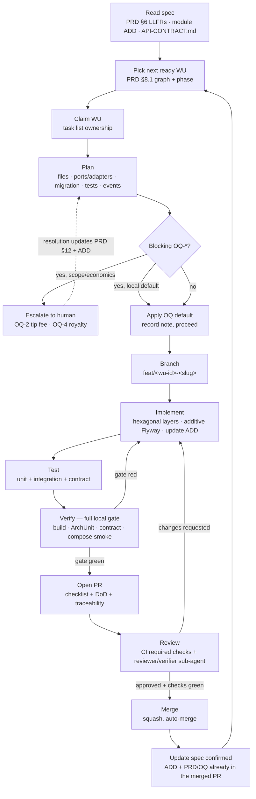
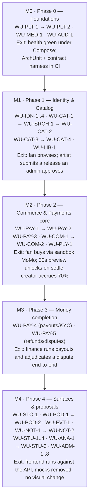

# BeatzClik Backend — Agent Workflow (the SDLC Playbook)

> **This is the document an agent reads first.** It defines the autonomous, spec-driven loop that
> Claude Code agents follow to take the `beatzmedia` backend from spec to merged, deployable code with
> minimal human involvement. **PRD source:** `BACKEND-PRD.md` §5 (spec-driven loop, see the header),
> §8 (work units + DoD + sequencing graph §8.1), §11 (roadmap), §12 (open questions). **Architecture
> source:** `../00-system-architecture.md` (§4 dependency rule, §8 build order, §9 ADRs).
> **Standards source:** `../01-conventions-and-standards.md` (§11 global Definition of Done).
>
> Read this, then `../00-system-architecture.md`, then `../01-conventions-and-standards.md`, then the
> module ADD under `../architecture/<module>.md` for the work unit you are about to build.

---

## 1. The spec-driven loop

Every unit of work is one full pass of the same loop. The loop is **spec-in, spec-out**: an agent
reads the authoritative spec, implements within it, and updates the spec in the same change so the
documents never drift from the code.

```
read spec → plan → branch → implement → test → verify → PR → review → merge → update spec
```



The loop closes on itself: a merge unblocks downstream WUs (their `blockedBy` is now satisfied), so an
agent re-enters at step *Pick next ready WU* and continues until the phase is complete.

---

## 2. Work-unit lifecycle

### 2.1 The catalog of work

The authoritative WU list is **PRD §8** (the table) and **§8.1** (the dependency graph and valid build
order). WU IDs (`WU-PLT-1`, `WU-IDN-1`, …) are stable and must not be renumbered. Each WU maps to one
or more LLFRs, names the ports/adapters it touches, the tables it reads/writes, and its `Depends on`
set.

### 2.2 What "ready" means

A WU is **ready** to be claimed when **all of its `blockedBy` WUs are merged to `main`** (not merely in
flight) and its phase has been reached per §8.1. Concretely:

- Resolve the WU's `Depends on` column in PRD §8. Each listed WU must be **merged**.
- Confirm the phase ordering from §8.1 / `../00-system-architecture.md` §8 — foundations before
  identity/catalog, payment charging before ledger, ledger before payouts, checkout/ownership before
  playback unlock and before refunds, analytics rollups before insight reads, audit + RBAC before any
  admin mutation. The graph encodes these hard rules; never bypass them even if a file *compiles*
  without the dependency.
- If two ready WUs exist, prefer the one that unblocks the most downstream WUs (critical path first).

### 2.3 Picking and claiming a WU (task tracking)

1. **Pick** the highest-priority ready WU (§2.2).
2. **Claim** it by taking ownership in the task tracker so parallel agents don't collide: mark the WU
   `in-progress` with the owning branch name and agent id. The task list is the single source of truth
   for "who owns what right now." One WU is owned by exactly one branch at a time (§7).
3. If no WU is ready, do **not** start a blocked WU. Either pick a different ready WU or report the
   blockage (§7.4).

### 2.4 States

`ready → claimed (in-progress) → in-review (PR open) → merged → done`. A WU returns to `in-progress`
when review requests changes, and to `ready` (released) if an agent abandons it.

---

## 3. Per-WU planning

Before writing code, produce a **short, concrete plan** derived from the module ADD and reconciled
against the contract. Keep it tight — a checklist, not an essay.

A plan names:

- **Files to touch** — the package tree per `../00-system-architecture.md` §4 (`domain`,
  `application/port.in`, `application/port.out`, `adapter.in.rest`, `adapter.in.job`,
  `adapter.out.persistence`, `adapter.out.integration`).
- **Ports & adapters** — which input ports (use cases) and output ports (repos/gateways/clock/ids) the
  WU adds or implements, taken verbatim from the ADD's port list.
- **Migrations** — the new `V<n>__<desc>.sql` file(s), picking the **next free number in the module's
  band** (see `../cross-cutting/data-and-migrations.md` §4.1 — the module-prefixed version-range
  convention that prevents parallel-agent version collisions; e.g. `identity` = `V2xx`, `catalog` =
  `V3xx`, `payments` = `V7xx`).
- **Tests** — the unit tests (domain + use cases with fakes), integration tests (Testcontainers
  Postgres/MinIO, REST-assured), and the contract test cases that must validate against the frontend
  types / `API-CONTRACT.md`.
- **Events** — which domain events the WU publishes or observes (`AFTER_SUCCESS`, idempotent handlers),
  drawn from `../00-system-architecture.md` §5.

**Reconcile against `API-CONTRACT.md`.** Every endpoint, field name, status code, and error `code` must
match the contract and the frontend types exactly. Do **not** invent endpoints or fields not traceable
to the PRD / `API-CONTRACT.md`. Where the ADD and contract disagree, the contract + frontend types win
for the API surface; flag the discrepancy in the PR.

**Surface blocking open questions.** If the WU touches an `OQ-*` (PRD §12), state it in the plan with
the **recommended default** from §12 and proceed using that default (every OQ carries a default
precisely so no WU is blocked). Only stop and escalate when the OQ changes scope or economics — see §8.

---

## 4. Implementation rules

Implement strictly inside the architecture. These rules are build-enforced; violating them fails CI.

1. **Hexagonal layering.** Respect `adapters → application → domain` (`../00-system-architecture.md`
   §4). The domain imports **no framework** — no Jakarta/Quarkus/Hibernate annotations on domain types;
   use separate JPA entities or mapped records in the persistence adapter. Application imports only
   domain. Inbound and outbound adapters never import each other. ArchUnit asserts all of this.
2. **No cross-module table access.** A module reads/writes only its own tables. Cross-context data comes
   from calling the owning module's **input port** or from ids + minimal snapshots carried on domain
   events. No cross-module foreign keys (`../01-conventions-and-standards.md` §6).
3. **Additive, forward-only migrations.** New `V<n>__<snake_desc>.sql` only; never edit a merged
   migration. Pick the next free number **in your module's band** to avoid collisions — see
   `../cross-cutting/data-and-migrations.md` §4.1 for the band table and the registry convention. Money
   columns are `*_minor BIGINT`, durations `*_sec`, timestamps `*_at TIMESTAMPTZ`.
4. **Thin resources.** REST resources map DTO → command, call the input port, map result → DTO. No
   business logic in resources. Validation via Hibernate Validator → `422` with `error.field`.
5. **Idempotency & audit where required.** Money/side-effect POSTs honour the `Idempotency-Key`
   (`../01-conventions-and-standards.md` §5/§8). Every privileged mutation appends exactly one
   `AuditEntry` via the `AuditWriter` port (INV-10).
6. **Update the module ADD in the same PR** if behavior changes. The loop is spec-out as well as
   spec-in: read spec → implement → update spec. If you take a structural decision, also record an ADR
   (§8.1).

---

## 5. Per-WU Definition of Done

A WU is **done** only when **all** of the following hold. This lifts `../01-conventions-and-standards.md`
§11 and PRD §8; CI enforces it as the merge gate.

- [ ] **Unit tests** pass — domain + use cases with fakes for output ports.
- [ ] **Integration tests** pass — Testcontainers Postgres/MinIO + REST-assured against real adapters.
- [ ] **Contract conformance** — responses validate against the frontend types / `API-CONTRACT.md`
      (the OpenAPI contract test is green). Field names, status codes, and error `code`s match.
- [ ] **ArchUnit green** — the hexagonal dependency rule holds (no domain→framework, no
      adapter→adapter, no cross-module table access).
- [ ] **Migrations apply on an empty DB** — Flyway `V*` set runs clean and `flyway.validate()` passes
      (no out-of-order, no checksum drift) per `../cross-cutting/data-and-migrations.md`.
- [ ] **Compose boots healthy** — `docker compose up` brings the stack to `/q/health/ready` green.
- [ ] **Idempotency + audit where required** — money/side-effect paths are idempotent; privileged
      mutations append an `AuditEntry` (INV-10).
- [ ] **Coverage gate met** — coverage ≥ the threshold in `testing-strategy.md`.
- [ ] **Spotless clean** — google-java-format applied; no new high/critical security findings.
- [ ] **ADD updated** — the relevant `../architecture/<module>.md` reflects any behavior change, in the
      same PR. A new ADR is recorded if a structural decision was made (§8.1).

---

## 6. Verification step (mandatory before opening a PR)

The agent does **not** rely on CI to discover failures. Before opening the PR, run the **full local
gate** exactly as CI will:

```bash
# 1. Build + unit tests + ArchUnit + Spotless check
./mvnw -B clean verify

# 2. Contract test (OpenAPI generated by quarkus-smallrye-openapi vs API-CONTRACT.md)
./mvnw -B test -Dtest='*ContractTest'

# 3. Migration test on an empty DB (Flyway validate on a fresh Testcontainer)
./mvnw -B test -Dtest='*MigrationIT'

# 4. Smoke: bring the whole stack up and probe health + the new endpoints
docker compose up -d --wait
curl -fsS http://localhost:8080/q/health/ready
# ...exercise the WU's endpoints, then:
docker compose down -v
```

Only when every step is green does the agent open the PR. (Details of each layer live in
`testing-strategy.md`; the exact CI jobs are in `ci-cd-github-actions.md`; the Compose stack and
profiles are in `environments-and-deployment.md`.)

**High-stakes WUs (payments / money / ownership) use a verification sub-agent.** For WU-PAY-*,
WU-COM-2 (settlement → ownership grant), WU-PAY-5 (refunds/clawback), and any WU touching the ledger or
KYC, spawn a dedicated **verification sub-agent** whose only job is to adversarially re-run the gate,
re-derive the 70/30 and 90/10 split math on minor units, assert Σ debits = Σ credits (INV-6), confirm
ownership is granted only on `SETTLED` (INV-1) and revoked on refund (INV-9), and confirm every
idempotency key returns the original result without repeating the effect. The implementing agent does
not self-certify money correctness.

---

## 7. Multi-agent coordination

Multiple agents work the graph in parallel. Collisions are avoided by construction:

### 7.1 One WU per branch
Exactly one agent owns a WU at a time, on exactly one branch named for that WU (§8 example). The task
list records ownership; before claiming, an agent checks no other branch owns the WU.

### 7.2 Module-scoped migration versions
Each module has a numeric **band** (`identity` = `V2xx`, `catalog` = `V3xx`, `payments` = `V7xx`, …).
Agents in different modules never reuse a `V<n>` number; within a band, increment by 1 and update the
registry. This is the central anti-collision mechanism for parallel migration authoring — see
`../cross-cutting/data-and-migrations.md` §4.1.

### 7.3 Dependency-respecting ordering
Agents only ever pick **ready** WUs (§2.2). Because the graph (§8.1) is a DAG and dependencies must be
**merged** (not in-flight) before a dependent is claimed, parallel work proceeds along independent
branches of the DAG (e.g. `WU-CAT-1` and `WU-IDN-1` can run concurrently; `WU-COM-2` waits for both
`WU-COM-1` and `WU-PAY-1`/`WU-PAY-3` to merge).

### 7.4 When blocked
If a WU you want is blocked (a dependency is not yet merged), **do not** start it. Options, in order:
(a) pick another ready WU; (b) if the blocking dependency is itself ready and unclaimed, build *that*
first; (c) if everything is blocked on one critical-path WU, report it so it gets prioritized. Never
fork a dependency's tables or duplicate its logic to "unblock yourself" — that breaks §4.2.

---

## 8. Open questions & ADRs

### 8.1 Recording a new ADR
When an agent makes a **structural decision** not already covered (a new cross-cutting pattern, a port
abstraction choice, an infra swap), append an ADR row to `../00-system-architecture.md` §9 (the table
already holds ADR-1..ADR-8) in the **same PR** as the code that depends on it. State decision,
rationale, and PRD reference. ADRs are append-only; superseding an ADR adds a new row that references
the old one.

### 8.2 Handling open questions
Every `OQ-*` (PRD §12) carries a recommended default so no WU is blocked. The rule:

- **Local / mechanical OQs** → apply the documented default and proceed, noting it in the PR. Examples:
  OQ-1 (admin scope map — config-driven default), OQ-3 (JWT-only for v1), OQ-5 (accept any `price ≥ 0`),
  OQ-6 (reuse 30s podcast preview), OQ-7 (add `takedown` status), OQ-9 (in-repo SMS capture stub),
  OQ-10 (plain multipart upload), OQ-11 (row-lock inventory in the settle txn), OQ-12 (Postgres
  `pg_trgm` behind the `SearchIndex` port).
- **Scope- or economics-changing OQs** → **escalate to a human** before building. These change what the
  product earns or owes and must not be decided unilaterally. The two canonical examples:
  - **OQ-2 — tip fee percentage** (10% tip fee vs general 30%): changes creator economics.
  - **OQ-4 — royalty model** (per-stream micro-royalties vs periodic accrual pools): changes payout
    obligations and must be specified precisely before WU-PAY-3.

  Escalate by pausing the WU, summarizing the question + options + recommended default, and waiting for
  the human resolution. The resolution updates **both** PRD §12 and the affected module ADD; the loop
  then re-enters at planning with the decision baked in.

---

## 9. Roadmap phases → milestones

The roadmap (PRD §11, graph §8.1) maps directly to milestones; agents tackle WUs in this order.



An agent never starts a milestone's WUs until the prior milestone's exit criteria hold. Within a
milestone, the DAG permits parallelism (§7.3).

---

## 10. Worked example — implementing WU-IDN-1 end to end

**WU-IDN-1** (PRD §8): *Account model, signup/login, password hashing, JWT issue
(LLFR-IDENTITY-01.1/01.2/01.4). Ports: RegisterFan/Login; account repo; TokenIssuer; CredentialHasher.
Writes: account, credential. Depends on: WU-PLT-1.*

**Step 1 — Ready check.** `WU-PLT-1` (platform kernel) is merged → WU-IDN-1 is ready. Phase 1 reached.
Claim it in the task list with the branch name and agent id.

**Step 2 — Read spec.** Read PRD §6.1 (LLFR-IDENTITY-01.1/01.2/01.4), `../architecture/identity.md`
(the `Account`/`Credential` domain, the `RegisterFan`/`Login` use cases, `JwtTokenIssuer` /
`Argon2CredentialHasher` adapters), and the `/v1/auth/*` shapes in `API-CONTRACT.md`.

**Step 3 — Plan.**
- *Files:* `identity/domain/{Account, Credential, AccountStatus, AccountId}`;
  `identity/application/port/in/{RegisterFan, Login}`; `identity/application/port/out/{AccountRepository,
  CredentialHasher, TokenIssuer}`; `identity/application/{RegisterFanService, LoginService}`;
  `identity/adapter/in/rest/{AuthResource, dto/*}`;
  `identity/adapter/out/persistence/{JpaAccountRepository, AccountEntity, CredentialEntity, *Mapper}`;
  `identity/adapter/out/integration/{Argon2CredentialHasher, JwtTokenIssuer}`.
- *Migration:* `V201__create_account.sql` (next free number in the `identity` band `V2xx`) — `account`
  + `credential` tables, unique index on `account.email`.
- *Tests:* unit (`RegisterFanServiceTest`, `LoginServiceTest` with fake repo/hasher/issuer);
  integration (`AuthResourceIT` against Testcontainers Postgres + REST-assured: signup 201, duplicate
  email 409 `EMAIL_TAKEN`, weak password 422 `WEAK_PASSWORD`, login 200, bad creds 401
  `INVALID_CREDENTIALS`); contract (`AuthContractTest` validating `{ token, account }` against the
  frontend `Account` type).
- *Events:* publishes `AccountRegistered` on successful signup (`AFTER_SUCCESS`).
- *OQ:* OQ-3 (token model) → apply default: short-lived access JWT, no refresh token for v1. Note in PR.

**Step 4 — Branch.** `feat/wu-idn-1-account-signup-login`.

**Step 5 — Implement.** Build domain → ports → application services → adapters, framework-free domain,
Argon2id hashing, JWT with `sub` + `roles=[fan]`. Add `V201__create_account.sql`. Wire the
`Idempotency-Key`-free auth POSTs (auth signup is naturally idempotent on the unique email). Update
`../architecture/identity.md` if any field/behavior shifted.

**Step 6 — Test + Verify.** Run the full local gate (§6): `./mvnw clean verify`, contract test,
migration IT on an empty DB, then `docker compose up -d --wait` and probe `POST /v1/auth/signup` +
`POST /v1/auth/login`. All green.

**Step 7 — Open PR.** Title `feat(identity): WU-IDN-1 account model, signup/login, JWT`. Body carries
the DoD checklist (§5), the LLFR traceability (`LLFR-IDENTITY-01.1/01.2/01.4`), and the OQ-3 note.
Follow `branching-and-pr.md` for the template and required checks.

**Step 8 — Review.** CI runs build, unit+integration, ArchUnit, contract, migration, and Compose
smoke (`ci-cd-github-actions.md`). A reviewer (or reviewer sub-agent) checks layering and contract
fidelity. Address any change requests by looping back to Implement.

**Step 9 — Merge.** Squash-merge to `main` via auto-merge once checks are green
(`branching-and-pr.md`). The merged PR already contains the updated ADD.

**Step 10 — Update spec / unblock.** With WU-IDN-1 merged, `WU-IDN-2`, `WU-IDN-3`, `WU-IDN-4`, and
`WU-LIB-1` become ready. Re-enter the loop and pick the next ready WU.

---

## 11. Cross-references

- **`branching-and-pr.md`** — branch naming (`feat/<wu-id>-<slug>`), commit/PR templates, required
  checks, auto-merge, semantic versioning.
- **`ci-cd-github-actions.md`** — the concrete GitHub Actions workflows (build, unit/integration,
  ArchUnit, contract test, migration validate, image build/publish, deploy) that gate the merge.
- **`testing-strategy.md`** — the unit/integration/contract/e2e layering, the coverage gate, and
  Testcontainers/test-data conventions referenced by the DoD (§5) and verification (§6).
- **`environments-and-deployment.md`** — the Docker Compose stack and `%dev`/`%test`/`%prod` profiles
  used by the Compose smoke step, plus release & rollback.
- **`../cross-cutting/data-and-migrations.md`** — the migration band / version-collision convention
  (§4.1) every plan and implementation must follow.
