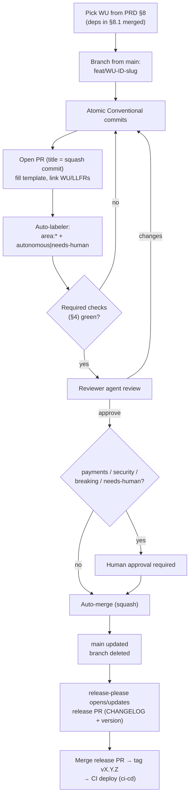

# BeatzClik Backend — Branching & PR Conventions

> **Audience:** autonomous Claude Code agents (and the occasional human) shipping the `beatzmedia`
> backend to GitHub. **Goal:** a fully automated path from a work unit (WU) in `BACKEND-PRD.md §8` to a
> squash-merged, releasable change on `main`, with a human in the loop **only** for payments/security.
> **Sources:** `BACKEND-PRD.md` (§8 WU ids, §8.1 dependency graph), `01-conventions-and-standards.md`
> (§11 Definition of Done). Cross-refs: `sdlc/ci-cd-github-actions.md` (the checks named here),
> `sdlc/testing-strategy.md` (the coverage gate).

---

## 1. Branching model — trunk-based, short-lived branches

We use **trunk-based development**. `main` is the single long-lived branch and is **always
releasable**: every commit on `main` has passed the full required-check suite and could be tagged and
deployed without further work.

- **`main` is protected** (see §6). No direct pushes; all change arrives via Pull Request.
- **Feature branches are short-lived** — hours to a couple of days. An agent that cannot finish a WU
  in that window should split the WU rather than let the branch age. Long-lived branches drift from
  trunk and break the "always releasable" property.
- **One WU per branch, one PR per branch.** A branch maps 1:1 to exactly one `WU-*` id from
  `BACKEND-PRD.md §8`. This keeps PRs small, makes the dependency graph (§8.1) auditable in Git, and
  lets the squash-merge produce one clean commit per WU.
- **Branch from the latest `main`.** Before starting, fetch and branch from `origin/main`. Keep the
  branch current by **rebasing onto `main`** (not merging `main` in) so history stays linear.

### 1.1 Branch naming

```
<type>/<WU-ID>-<kebab-slug>
```

`<type>` is the Conventional-Commit type of the dominant change; `<WU-ID>` is the literal WU id from
§8 (uppercase, hyphenated); `<kebab-slug>` is a 2–5 word description.

| Example branch                         | WU        | Notes                              |
|----------------------------------------|-----------|------------------------------------|
| `feat/WU-IDN-1-account-auth`           | WU-IDN-1  | Account model, signup/login, JWT   |
| `feat/WU-CAT-3-release-wizard`         | WU-CAT-3  | Release submit + track upload      |
| `feat/WU-PAY-1-payment-intent`         | WU-PAY-1  | PaymentIntent + InitiateCharge     |
| `fix/WU-COM-2-ownership-grant-race`    | WU-COM-2  | Bug fix in an existing WU          |
| `chore/WU-PLT-1-spotless-config`       | WU-PLT-1  | Build/tooling, no behavior change  |
| `docs/WU-PAY-3-ledger-add-update`      | WU-PAY-3  | Doc/ADD-only change                |

**Rules:** lowercase except the WU id; no spaces; `<type> ∈ {feat, fix, chore, docs, refactor, test,
build, ci}`. A branch that touches no specific WU (rare — repo hygiene) uses `chore/no-wu-<slug>` and
must say so in the PR.

---

## 2. Commit conventions — Conventional Commits

All commits follow [Conventional Commits](https://www.conventionalcommits.org/). This drives CHANGELOG
generation and SemVer (§8).

```
<type>(<scope>): <WU-ID> <subject>

<body — what & why, not how>

<footer — BREAKING CHANGE:, Refs:, Co-authored-by:>
```

- **type** ∈ `feat` | `fix` | `chore` | `test` | `docs` | `refactor` | `build` | `ci`. (`perf` and
  `revert` are also accepted by the parser.)
- **scope** = the module/bounded context (`identity`, `catalog`, `payments`, `commerce`, `platform`,
  …). Use the §6 module name.
- The **WU id is the first token of the subject**, so it is greppable in `git log` and links the
  commit to the PRD.
- **subject** ≤ 72 chars, imperative mood, no trailing period.

```
feat(identity): WU-IDN-1 account registration with Argon2id hashing
fix(commerce): WU-COM-2 grant ownership only on PaymentSettled (INV-1)
test(payments): WU-PAY-3 double-entry balance property tests
docs(payments): WU-PAY-3 update ledger ADD for split posting
```

**Atomic commits.** Each commit compiles and keeps tests green. Group by intent (domain, then
application, then adapter, then tests) rather than dumping one mega-commit. Because PRs squash-merge
(§7), the **PR title** must itself be a valid Conventional Commit — it becomes the commit on `main`.

**Breaking changes.** Either suffix the type with `!` (`feat(payments)!:`) or add a
`BREAKING CHANGE:` footer describing the contract/migration impact. This bumps the **major** version.

---

## 3. Pull Request rules

- **One PR per WU.** The PR title is the squash commit: `feat(catalog): WU-CAT-3 release wizard submit`.
- **Keep PRs small.** Target < ~400 changed lines (excluding generated files, lockfiles, and
  migrations). A WU that grows past this is a signal to split it — prefer two reviewable PRs over one
  unreviewable one. Reviewer agents flag oversized PRs.
- **Link the WU and LLFRs.** The body must reference the `WU-*` id and the LLFR ids it satisfies
  (e.g. `LLFR-CATALOG-02.2`) so traceability is mechanical.
- **The DoD checklist is mandatory** and mirrors `01-conventions-and-standards.md §11`. A PR cannot
  auto-merge with unchecked DoD boxes.
- **Migrations are forward-only.** List every new `V<n>__*.sql` file; never edit a merged migration.
- **ADD updated in the same PR** when behavior changes (DoD §11.8).

### 3.1 `.github/PULL_REQUEST_TEMPLATE.md`

```markdown
## Work unit
- **WU:** WU-XXX-N  <!-- from BACKEND-PRD.md §8 -->
- **HLFR / LLFRs:** HLFR-XXX-NN · LLFR-XXX-NN.M, LLFR-XXX-NN.M
- **Module(s):** <identity | catalog | payments | …>
- **Depends on (merged):** WU-XXX-N  <!-- per §8.1 dependency graph; none ⇒ "none" -->

## Summary
<!-- 2–4 sentences: what changed and why. Reference the invariant(s) enforced, e.g. INV-1. -->

## Definition of Done (01-conventions §11 — CI enforces; tick what holds)
- [ ] Unit tests pass (domain + use cases with fakes)
- [ ] Integration tests pass (Testcontainers Postgres/MinIO, REST-assured)
- [ ] Contract conformance green (responses validate against API-CONTRACT.md / frontend types)
- [ ] Flyway migration(s) forward-only, apply cleanly on an empty DB
- [ ] Boots under `docker compose up` (healthy)
- [ ] Hexagonal dependency rule holds (ArchUnit green)
- [ ] Money/side-effect paths idempotent; privileged mutations append an AuditEntry (INV-10)
- [ ] Coverage ≥ gate (testing-strategy.md); Spotless clean; no new high/critical security findings
- [ ] Relevant module **ADD updated in this PR** (if behavior changed)

## Test evidence
<!-- Paste/summarize: test counts, coverage %, key scenarios. CI artifacts are linked automatically. -->
- Unit: <N passed> · Integration: <N passed> · Contract: <pass/fail>
- Coverage: <line %> / <branch %>  (gate: <X%>)

## Migrations
<!-- List each new migration file, or "none". -->
- `V<n>__<snake_desc>.sql` — <one-line purpose>

## Breaking changes
- [ ] None
<!-- If any: describe contract/migration impact. Use a `BREAKING CHANGE:` footer in the squash commit. -->

## Labels applied
<!-- area:<module>, plus area:payments / area:security if touched, autonomous or needs-human -->
```

---

## 4. Required status checks (branch protection on `main`)

These are configured as **required status checks** on `main`'s branch-protection rule. Each name maps
to a job in `sdlc/ci-cd-github-actions.md`. A PR cannot merge (manually or via auto-merge) until **all**
are green on the head commit, and the branch must be **up to date with `main`** ("require branches to
be up to date before merging").

| Required check (GitHub context) | What it gates | DoD §11 ref |
|---------------------------------|---------------|-------------|
| `build`                         | `./mvnw -B verify -DskipTests` compiles (Java 25)          | —    |
| `unit-tests`                    | Domain + use-case unit tests (fakes)                       | §11.1 |
| `integration-tests`            | Testcontainers Postgres/MinIO, REST-assured `*IT`         | §11.1 |
| `contract-test`                 | OpenAPI/contract conformance vs `API-CONTRACT.md`         | §11.2 |
| `archunit`                      | Hexagonal dependency rule (`adapters → application → domain`) | §11.5 |
| `coverage-gate`                 | Coverage ≥ gate in `testing-strategy.md`                  | §11.7 |
| `spotless-lint`                 | Spotless (google-java-format) + lint, `-Werror`           | §11.7 |
| `security-scan`                 | Dependency + SAST scan; fail on new high/critical         | §11.7 |
| `migration-test`               | Flyway forward-only apply on an empty DB                  | §11.3 |
| `compose-smoke`                 | `docker compose up` boots healthy; `/q/health/ready` 200  | §11.4 |

Additionally required: **PR title is a valid Conventional Commit** (a `commitlint`/title-check action)
so the squash commit is well-formed, and **template completeness** (DoD boxes ticked) via a body-check
action. Settings: require linear history, dismiss stale approvals on new commits, require conversation
resolution, no force-push to `main`.

---

## 5. Labels & review routing

A small, mechanical label scheme decides whether a PR can merge autonomously or needs a human.

| Label            | Meaning / effect                                                                 |
|------------------|----------------------------------------------------------------------------------|
| `area:<module>`  | One per touched module (`area:identity`, `area:catalog`, …). Routing + CODEOWNERS.|
| `area:payments`  | Touches `payments`/`commerce` money paths. **Forces human review.**              |
| `area:security`  | Touches auth, RBAC, JWT, secrets, crypto, or `security-scan` config. **Forces human review.** |
| `needs-human`    | Explicit human gate (applied by a rule or a reviewer agent that lacks confidence).|
| `autonomous`     | Eligible for fully automated merge once checks + automated review pass.           |

**Labeling is automated** by a path-based labeler (`.github/labeler.yml`, run by `actions/labeler`):
changes under `**/payments/**` or `**/commerce/**` → `area:payments`; under any auth/security path →
`area:security`; otherwise `autonomous`. The agent may add `needs-human` proactively when uncertain.

---

## 6. Code review — automated first, human by exception

### 6.1 Automated reviewer (default)

Every PR is reviewed by a **reviewer agent** step (a Claude Code review job; see `/review` and
`/security-review`). It posts a review and approves, requests changes, or escalates. It checks:

- **DoD completeness** — all §11 boxes truthfully ticked; ADD updated if behavior changed.
- **Architecture** — no hexagonal violations beyond what ArchUnit catches (e.g. domain leaking into
  REST DTOs), thin resources (no business logic), ports/adapters wiring correct.
- **Invariants** — money in minor units (INV-11), ownership-on-settlement (INV-1), audit on
  privileged mutations (INV-10), idempotency on side-effect POSTs, split-sum ≤ 100 (INV-12).
- **Contract** — response shapes match `API-CONTRACT.md`/frontend types; error envelope + stable
  `code`s used.
- **Tests** — meaningful coverage of the LLFR acceptance criteria, not just line count; migrations
  forward-only; secrets/PII never logged.
- **Size & scope** — PR is one WU, reasonably small; flags scope creep.

### 6.2 When a human is required

A human approval is **mandatory** (and `needs-human` is set, auto-merge held) when **any** of:

1. PR carries `area:payments` or `area:security`.
2. The squash commit is a **breaking change** (`!` / `BREAKING CHANGE:`).
3. The reviewer agent **requests changes** twice without resolution, or sets `needs-human`.
4. A migration is destructive (drops/renames a column on populated tables) or touches the ledger
   schema.
5. `security-scan` surfaces a new high/critical finding the agent cannot remediate.

For all other PRs (`autonomous`, all checks green, reviewer agent approves), **no human is required**.

---

## 7. Auto-merge

GitHub **auto-merge with squash** is enabled on the repo. The agent enables it on the PR immediately
after opening:

```bash
gh pr merge --squash --auto --delete-branch
```

The merge then fires automatically when **all** of the following hold:

1. All §4 required checks are green on the head commit, and the branch is up to date with `main`.
2. The required review is satisfied: the **reviewer agent approved**, and — if `area:payments` /
   `area:security` / breaking / `needs-human` — a **human also approved** (§6.2).
3. No unresolved conversations.

Squash keeps `main` history one-commit-per-WU. The branch is deleted on merge. If a required check
later flakes, the agent re-runs it; it does not bypass protection.



---

## 8. Versioning & releases

- **SemVer** `MAJOR.MINOR.PATCH`. `feat:` → minor, `fix:`/`perf:` → patch, `BREAKING CHANGE:`/`!` →
  major. `chore`/`docs`/`test`/`build`/`ci`/`refactor` do not bump the version.
- **Tags** are `v<major>.<minor>.<patch>` (e.g. `v0.4.0`).
- **release-please** is the release engine. On each merge to `main` it maintains a **release PR** that
  accumulates the version bump and a generated **CHANGELOG.md** (grouped from Conventional Commits).
  Merging that release PR creates the `vX.Y.Z` **tag** and GitHub Release. (Pre-1.0, breaking changes
  bump the minor per SemVer 0.x convention.)
- **Deploy on release.** The tag triggers the deploy workflow in `sdlc/ci-cd-github-actions.md`:
  build the JVM image from `backend/src/main/docker/Dockerfile.jvm`, push it tagged with the version,
  run Flyway, and roll out. `main`-without-a-tag deploys only to a staging environment; a tag
  promotes to production.

---

## 9. Issue & work tracking

- **Each WU is a GitHub Issue.** Title `WU-IDN-1 — Account model, signup/login, JWT`. The issue body
  carries the §8 description, its `Depends on` list (§8.1), and the LLFR ids. The PR closes it with
  `Closes #<n>`.
- **Labels on issues** mirror PR labels plus tracking facets: `area:<module>`, `type:feat|fix|chore`,
  and a phase label `phase:0|1|2|3|4` from §8.1.
- **Milestones = roadmap phases** from §8.1:
  - `Phase 0 — Foundations` (WU-PLT-1, WU-PLT-2, WU-MED-1, WU-AUD-1)
  - `Phase 1 — Identity & Catalog` (WU-IDN-*, WU-CAT-*, WU-SRCH-1, WU-LIB-1)
  - `Phase 2 — Commerce & Payments` (WU-PAY-1/2/3, WU-COM-1/2, WU-PLY-1)
  - `Phase 3 — Money completion` (WU-PAY-4, WU-PAY-5)
  - `Phase 4 — Surfaces & proposals` (WU-STO/POD/EVT/NOT/STU/ANA/ADM-*)
- An agent must not start a WU until its dependency WUs (§8.1) are **merged to `main`**. The issue's
  `Depends on` list is the gate.

---

## 10. `.github/` file inventory

| File                                  | Purpose                                               |
|---------------------------------------|-------------------------------------------------------|
| `.github/PULL_REQUEST_TEMPLATE.md`    | PR template (§3.1)                                    |
| `.github/ISSUE_TEMPLATE/work-unit.md` | WU issue template (one per §8 WU)                     |
| `.github/ISSUE_TEMPLATE/bug.md`       | Bug report template                                   |
| `.github/ISSUE_TEMPLATE/config.yml`   | Disables blank issues, links the PRD                  |
| `.github/CODEOWNERS`                  | Review routing for payments/security paths (§10.1)    |
| `.github/labeler.yml`                 | Path → label rules for `actions/labeler` (§5)         |
| `.github/dependabot.yml`              | Dependency updates (§10.2)                            |
| `.github/workflows/*.yml`             | CI/CD pipelines — see `sdlc/ci-cd-github-actions.md`  |
| `release-please-config.json`          | Release-please config (Java, CHANGELOG sections)      |

### 10.1 `.github/CODEOWNERS`

```
# Default owner — the platform team reviews anything not otherwise routed.
*                               @beatzclik/backend

# Money & ownership paths require a human reviewer (see §6.2). These globs
# also drive the area:payments / area:security labels and the human gate.
**/payments/**                  @beatzclik/payments @beatzclik/backend
**/commerce/**                  @beatzclik/payments @beatzclik/backend
**/db/migration/**              @beatzclik/payments @beatzclik/backend

# Security-sensitive paths.
**/identity/**                  @beatzclik/security @beatzclik/backend
**/*security*/**                @beatzclik/security
**/*auth*/**                    @beatzclik/security
.github/workflows/**            @beatzclik/security @beatzclik/backend
.github/CODEOWNERS              @beatzclik/security

# Specs & conventions.
/BACKEND-PRD.md                 @beatzclik/backend
/backend/docs/**                @beatzclik/backend
```

### 10.2 `.github/dependabot.yml`

```yaml
version: 2
updates:
  # Maven (backend service)
  - package-ecosystem: "maven"
    directory: "/backend"
    schedule:
      interval: "weekly"
      day: "monday"
    open-pull-requests-limit: 5
    labels: ["area:build", "autonomous", "type:chore"]
    commit-message:
      prefix: "build"
      include: "scope"
    groups:
      quarkus:
        patterns: ["io.quarkus*", "io.quarkus.platform*"]
      test-stack:
        patterns: ["org.testcontainers*", "io.rest-assured*", "org.junit*", "org.assertj*"]
    ignore:
      # Java/Quarkus majors are deliberate, human-driven upgrades.
      - dependency-name: "io.quarkus.platform:quarkus-bom"
        update-types: ["version-update:semver-major"]

  # GitHub Actions
  - package-ecosystem: "github-actions"
    directory: "/"
    schedule:
      interval: "weekly"
      day: "monday"
    labels: ["area:ci", "autonomous", "type:ci"]
    commit-message:
      prefix: "ci"

  # Docker base images (Compose + Dockerfiles)
  - package-ecosystem: "docker"
    directory: "/backend/src/main/docker"
    schedule:
      interval: "weekly"
    labels: ["area:build", "type:chore"]
    commit-message:
      prefix: "build"
```

Dependabot PRs are normal PRs: they run the §4 checks, get auto-labeled, and auto-merge when green —
unless they touch a payments/security-owned path, in which case CODEOWNERS forces a human.

---

## 11. Worked example — lifecycle of WU-IDN-1

`WU-IDN-1` = *Account model, signup/login, password hashing, JWT issue* (LLFR-IDENTITY-01.1/01.2/01.4).
Per §8.1 it depends on `WU-PLT-1`, which is already merged.

1. **Pick & gate.** Agent confirms issue `WU-PLT-1` is closed/merged. Opens/claims issue
   `WU-IDN-1 — Account model, signup/login, JWT` (milestone *Phase 1*, labels `area:identity`,
   `type:feat`, `phase:1`).
2. **Branch.** `git fetch origin && git switch -c feat/WU-IDN-1-account-auth origin/main`.
3. **Implement in atomic commits:**
   - `feat(identity): WU-IDN-1 Account aggregate + typed AccountId`
   - `feat(identity): WU-IDN-1 RegisterFan/Login use cases with output ports`
   - `feat(identity): WU-IDN-1 Argon2id CredentialHasher + JWT TokenIssuer adapters`
   - `feat(identity): WU-IDN-1 /v1/auth signup+login REST resources`
   - `test(identity): WU-IDN-1 unit + REST-assured integration (EMAIL_TAKEN, INVALID_CREDENTIALS)`
   - `build(identity): WU-IDN-1 V2__create_account_credential.sql`
4. **Open PR.** Title `feat(identity): WU-IDN-1 account registration & authentication`. Fills the
   template: links WU + LLFRs, ticks DoD boxes, lists `V2__create_account_credential.sql`, "Breaking:
   None", `Closes #<n>`. Runs `gh pr merge --squash --auto --delete-branch`.
5. **Automation.** Labeler adds `autonomous` (no payments/security path). The §4 checks run:
   `build`, `unit-tests`, `integration-tests`, `contract-test`, `archunit`, `coverage-gate`,
   `spotless-lint`, `security-scan`, `migration-test`, `compose-smoke` — all green.
6. **Review.** The reviewer agent verifies DoD truthfulness, thin resources, INV-11/INV-10 handling,
   contract shapes, and test coverage of the acceptance criteria → **approves**. Because `WU-IDN-1`
   touches `identity` (auth), CODEOWNERS routes `@beatzclik/security`; the `area:security` rule means a
   **human also approves** (§6.2 case 1).
7. **Merge.** Both approvals + all checks satisfied → auto-merge squashes to one commit on `main`;
   the branch is deleted; the issue closes.
8. **Release.** release-please updates the release PR: `feat` → minor bump (e.g. `0.1.0 → 0.2.0`),
   CHANGELOG gains an *identity* entry. Merging the release PR tags `v0.2.0` and triggers the deploy
   workflow (`ci-cd-github-actions.md`).

This is the standard loop for every WU; only the §6.2 conditions change whether step 6 needs a human.
