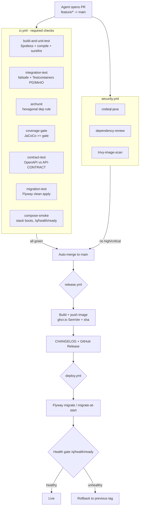

# CI/CD — GitHub Actions (BeatzClik Backend)

> **Scope.** Concrete, copy-pasteable GitHub Actions workflows for the `beatzmedia` Quarkus
> backend (Quarkus 3.36.3, Java 25, Maven, PostgreSQL 16, MinIO, Docker). Designed so that
> **autonomous Claude Code agents** can open PRs, get them validated, auto-merge on green, cut a
> release, and deploy — with a human only as approver/break-glass.
>
> **Sources:** PRD §5 (Compose topology + env vars), §8 (DoD), §10 (NFRs);
> `docs/01-conventions-and-standards.md` §11 (global Definition of Done); `pom.xml`
> (surefire/failsafe, `native` profile, Java 25); `src/main/docker/Dockerfile.jvm` /
> `Dockerfile.native`.
>
> **Cross-refs:** `sdlc/branching-and-pr.md` (branch model + required checks — the check names
> below are the **canonical** list and must stay byte-identical there),
> `sdlc/testing-strategy.md` (coverage gate), `cross-cutting/data-and-migrations.md` (Flyway).

---

## 1. Design goals

1. **Deterministic.** Same commit → same result. Pinned tool versions, locked Maven repo cache.
2. **Fast inner loop.** Heavy jobs (native, image build, smoke) run only when cheap jobs pass.
3. **Agent-operable.** Status checks are stable, named, and machine-assertable; failures surface
   as uploaded reports an agent can read. Auto-merge is gated entirely on required checks.
4. **DoD-enforcing.** Every numbered item in conventions §11 maps to a CI job (see §3).
5. **Supply-chain safe.** CodeQL, dependency review, Trivy, secret scanning, least-privilege
   `GITHUB_TOKEN`, pinned actions.

---

## 2. Pipeline overview



---

## 3. CI jobs → required status checks → DoD mapping

The **job names** below are the contract with branch protection. They must match the
`required_status_checks.contexts` list in `branching-and-pr.md` **exactly** (GitHub matches on the
job `name:`). Do not rename without updating both places.

| Required status check (job `name:`) | Workflow | Enforces (conventions §11 / PRD §8) |
|---|---|---|
| `build-and-unit-test` | `ci.yml` | §11.1 unit tests; §11.7 Spotless clean |
| `integration-test` | `ci.yml` | §11.1 integration tests (Testcontainers PG/MinIO, REST-assured) |
| `archunit` | `ci.yml` | §11.5 hexagonal dependency rule |
| `coverage-gate` | `ci.yml` | §11.7 coverage ≥ gate (`testing-strategy.md`) |
| `contract-test` | `ci.yml` | §11.2 OpenAPI contract conformance |
| `migration-test` | `ci.yml` | §11.3 Flyway forward-only, clean apply on empty DB |
| `compose-smoke` | `ci.yml` | §11.4 boots healthy under Docker Compose |
| `codeql-java` | `security.yml` | §11.7 no new high/critical findings |
| `dependency-review` | `security.yml` | §11.7 no vulnerable/denied deps introduced |
| `trivy-image-scan` | `security.yml` | §11.7 no high/critical in container image |

> **Branch protection (set once, in repo settings or via API).** On `main`: require all ten
> checks above, require linear history, require PR before merge, dismiss stale approvals, require
> conversation resolution, and enable **auto-merge**. Agents push to `feature/*`, open a PR, and
> the merge happens automatically when every required check is green.

---

## 4. Conventions baked into every workflow

- **JDK 25 / Temurin** via `actions/setup-java@v4` with built-in Maven cache (`cache: maven`).
- **`actions/checkout@v4`** with `fetch-depth: 0` only where history is needed (release notes).
- **Concurrency**: per-ref cancel-in-progress so a new push supersedes the old run.
- **Least privilege**: `permissions:` declared per workflow; default is read-only.
- **Pinned actions**: examples use major tags for readability; **pin to commit SHAs** in the
  real repo (Dependabot keeps them current — see §11).
- **Testcontainers**: `ubuntu-latest` ships a working Docker daemon, so Testcontainers and
  `docker compose` work out of the box. No DinD setup required.
- **Maven wrapper**: use `./mvnw` (committed) for a pinned Maven version.

---

## 5. `.github/workflows/ci.yml`

```yaml
name: ci

on:
  pull_request:
    branches: [main]
  push:
    branches: [main]

# Cancel superseded runs on the same ref.
concurrency:
  group: ci-${{ github.workflow }}-${{ github.ref }}
  cancel-in-progress: true

permissions:
  contents: read

env:
  MAVEN_ARGS: "-B -ntp -Dstyle.color=always"

jobs:
  # ---------------------------------------------------------------------------
  # 1) Spotless + compile + unit tests (surefire). Fast gate; everything else
  #    depends on this passing.
  # ---------------------------------------------------------------------------
  build-and-unit-test:
    name: build-and-unit-test
    runs-on: ubuntu-latest
    steps:
      - uses: actions/checkout@v4

      - name: Set up JDK 25 (Temurin)
        uses: actions/setup-java@v4
        with:
          distribution: temurin
          java-version: "25"
          cache: maven

      - name: Spotless check (google-java-format)
        working-directory: backend
        run: ./mvnw $MAVEN_ARGS spotless:check

      - name: Compile (fail on warnings)
        working-directory: backend
        run: ./mvnw $MAVEN_ARGS clean compile

      - name: Unit tests (surefire)
        working-directory: backend
        # skipITs=true (pom default) keeps failsafe out of this job.
        run: ./mvnw $MAVEN_ARGS test

      - name: Upload surefire reports
        if: ${{ !cancelled() }}
        uses: actions/upload-artifact@v4
        with:
          name: surefire-reports
          path: backend/target/surefire-reports/
          retention-days: 7

  # ---------------------------------------------------------------------------
  # 2) Integration tests via failsafe + Testcontainers (Postgres + MinIO).
  #    Docker is available on ubuntu-latest, so Testcontainers spins up
  #    ephemeral containers itself — no service: block needed (recommended).
  #    ArchUnit runs as part of the test suite; we surface it as its own
  #    required check by tagging ArchUnit tests (see archunit job).
  # ---------------------------------------------------------------------------
  integration-test:
    name: integration-test
    runs-on: ubuntu-latest
    needs: build-and-unit-test
    env:
      # Testcontainers reuse off in CI for determinism.
      TESTCONTAINERS_RYUK_DISABLED: "false"
    steps:
      - uses: actions/checkout@v4
      - uses: actions/setup-java@v4
        with:
          distribution: temurin
          java-version: "25"
          cache: maven

      - name: Integration tests (failsafe + Testcontainers)
        working-directory: backend
        # -DskipITs=false activates failsafe; verify runs integration-test+verify.
        run: ./mvnw $MAVEN_ARGS verify -DskipITs=false -DskipUnitTests=true

      - name: Upload failsafe reports
        if: ${{ !cancelled() }}
        uses: actions/upload-artifact@v4
        with:
          name: failsafe-reports
          path: backend/target/failsafe-reports/
          retention-days: 7
```

> **Service-container alternative (instead of Testcontainers for Postgres).** If you prefer a
> GitHub **service container** for the DB (e.g. to avoid pulling images per test class), use this
> in place of the Testcontainers approach. Point Quarkus `%test` at it via env so Dev Services
> stand down (PRD §5.3):
>
> ```yaml
>   integration-test:
>     name: integration-test
>     runs-on: ubuntu-latest
>     needs: build-and-unit-test
>     services:
>       db:
>         image: postgres:16
>         env:
>           POSTGRES_USER: beatz
>           POSTGRES_PASSWORD: beatz
>           POSTGRES_DB: beatzmedia
>         ports: ["5432:5432"]
>         options: >-
>           --health-cmd "pg_isready -U beatz"
>           --health-interval 5s --health-timeout 5s --health-retries 10
>     env:
>       QUARKUS_DATASOURCE_JDBC_URL: jdbc:postgresql://localhost:5432/beatzmedia
>       QUARKUS_DATASOURCE_USERNAME: beatz
>       QUARKUS_DATASOURCE_PASSWORD: beatz
>     steps:
>       - uses: actions/checkout@v4
>       - uses: actions/setup-java@v4
>         with: { distribution: temurin, java-version: "25", cache: maven }
>       - name: Integration tests against service Postgres
>         working-directory: backend
>         run: ./mvnw -B -ntp verify -DskipITs=false
> ```
>
> Testcontainers is **recommended** because it also provisions MinIO and matches the local
> `quarkus:dev` Dev Services experience (PRD §5.3); the service-container path only gives you
> Postgres and means MinIO must still be containerized separately.

Continue `ci.yml` with the remaining required-check jobs:

```yaml
  # ---------------------------------------------------------------------------
  # 3) ArchUnit (hexagonal dependency rule). Conventions §11.5.
  #    ArchUnit tests are JUnit tests tagged @Tag("arch"); we run only that tag
  #    so the check fails fast and is independently named.
  # ---------------------------------------------------------------------------
  archunit:
    name: archunit
    runs-on: ubuntu-latest
    needs: build-and-unit-test
    steps:
      - uses: actions/checkout@v4
      - uses: actions/setup-java@v4
        with: { distribution: temurin, java-version: "25", cache: maven }
      - name: Run ArchUnit suite
        working-directory: backend
        run: ./mvnw $MAVEN_ARGS test -Dgroups=arch

  # ---------------------------------------------------------------------------
  # 4) Coverage gate (JaCoCo). Conventions §11.7 / testing-strategy.md.
  #    Assumes jacoco-maven-plugin is configured with a `check` rule that fails
  #    the build below the gate (line/branch %). The argLine wiring is already
  #    present in the pom (@{argLine}).
  # ---------------------------------------------------------------------------
  coverage-gate:
    name: coverage-gate
    runs-on: ubuntu-latest
    needs: build-and-unit-test
    steps:
      - uses: actions/checkout@v4
      - uses: actions/setup-java@v4
        with: { distribution: temurin, java-version: "25", cache: maven }
      - name: Tests with coverage + enforce gate
        working-directory: backend
        # jacoco:check binds to verify; the rule itself fails under the gate.
        run: ./mvnw $MAVEN_ARGS verify -DskipITs=false -Pcoverage
      - name: Upload JaCoCo report
        if: ${{ !cancelled() }}
        uses: actions/upload-artifact@v4
        with:
          name: jacoco-report
          path: backend/target/site/jacoco/
          retention-days: 7

  # ---------------------------------------------------------------------------
  # 5) Contract test: generate OpenAPI, assert it conforms to API-CONTRACT.md.
  #    smallrye-openapi exposes /q/openapi; we emit the static document at build
  #    and diff/validate it. Conventions §11.2.
  # ---------------------------------------------------------------------------
  contract-test:
    name: contract-test
    runs-on: ubuntu-latest
    needs: build-and-unit-test
    steps:
      - uses: actions/checkout@v4
      - uses: actions/setup-java@v4
        with: { distribution: temurin, java-version: "25", cache: maven }
      - name: Generate OpenAPI document
        working-directory: backend
        # quarkus.smallrye-openapi.store-schema-directory writes target/openapi.
        run: ./mvnw $MAVEN_ARGS quarkus:build -Dquarkus.smallrye-openapi.store-schema-directory=target/openapi
      - name: Contract conformance tests (REST-assured + schema validation)
        working-directory: backend
        run: ./mvnw $MAVEN_ARGS verify -DskipITs=false -Dgroups=contract
      - name: Upload generated OpenAPI
        if: ${{ !cancelled() }}
        uses: actions/upload-artifact@v4
        with:
          name: openapi
          path: backend/target/openapi/
          retention-days: 14

  # ---------------------------------------------------------------------------
  # 6) Migration test: Flyway applies forward-only on an EMPTY Postgres.
  #    Uses a service container so this is independent of Testcontainers.
  #    Conventions §11.3 / cross-cutting/data-and-migrations.md.
  # ---------------------------------------------------------------------------
  migration-test:
    name: migration-test
    runs-on: ubuntu-latest
    needs: build-and-unit-test
    services:
      db:
        image: postgres:16
        env:
          POSTGRES_USER: beatz
          POSTGRES_PASSWORD: beatz
          POSTGRES_DB: beatzmedia
        ports: ["5432:5432"]
        options: >-
          --health-cmd "pg_isready -U beatz"
          --health-interval 5s --health-timeout 5s --health-retries 10
    env:
      QUARKUS_DATASOURCE_JDBC_URL: jdbc:postgresql://localhost:5432/beatzmedia
      QUARKUS_DATASOURCE_USERNAME: beatz
      QUARKUS_DATASOURCE_PASSWORD: beatz
      # Validate (not just migrate) to catch out-of-order / edited migrations.
      QUARKUS_FLYWAY_VALIDATE_ON_MIGRATE: "true"
      QUARKUS_FLYWAY_CLEAN_DISABLED: "false"
    steps:
      - uses: actions/checkout@v4
      - uses: actions/setup-java@v4
        with: { distribution: temurin, java-version: "25", cache: maven }
      - name: Flyway clean + migrate (forward-only, empty DB)
        working-directory: backend
        run: |
          ./mvnw $MAVEN_ARGS flyway:clean flyway:migrate flyway:validate \
            -Dflyway.url="$QUARKUS_DATASOURCE_JDBC_URL" \
            -Dflyway.user="$QUARKUS_DATASOURCE_USERNAME" \
            -Dflyway.password="$QUARKUS_DATASOURCE_PASSWORD" \
            -Dflyway.locations=filesystem:src/main/resources/db/migration

  # ---------------------------------------------------------------------------
  # 7) Compose smoke: boot the full stack, wait for readiness, hit a real
  #    endpoint, tear down. Conventions §11.4 / PRD §5.1.
  # ---------------------------------------------------------------------------
  compose-smoke:
    name: compose-smoke
    runs-on: ubuntu-latest
    needs: [build-and-unit-test]
    steps:
      - uses: actions/checkout@v4
      - uses: actions/setup-java@v4
        with: { distribution: temurin, java-version: "25", cache: maven }

      - name: Build app jar (for Dockerfile.jvm)
        working-directory: backend
        run: ./mvnw $MAVEN_ARGS package -DskipTests

      - name: docker compose up (full stack)
        working-directory: backend
        run: docker compose up -d --build

      - name: Wait for /q/health/ready
        run: |
          echo "Waiting for app readiness..."
          for i in $(seq 1 60); do
            if curl -fsS http://localhost:8080/q/health/ready >/dev/null; then
              echo "App is ready."; exit 0
            fi
            sleep 5
          done
          echo "App did not become ready in time."; exit 1

      - name: Smoke test (real endpoint)
        run: |
          set -euo pipefail
          # Liveness + a representative read endpoint.
          curl -fsS http://localhost:8080/q/health/live | tee /tmp/live.json
          curl -fsS "http://localhost:8080/v1/catalog/releases?page=1&size=1" \
            -H "Accept: application/json" | tee /tmp/releases.json

      - name: Dump logs on failure
        if: failure()
        working-directory: backend
        run: docker compose logs --no-color

      - name: Tear down
        if: ${{ always() }}
        working-directory: backend
        run: docker compose down -v
```

> **Optional matrix (JVM vs native).** Add a non-blocking native build to catch native-image
> regressions early without slowing PR merges. Mark it `continue-on-error` or leave it **out**
> of required checks so it never blocks an agent merge:
>
> ```yaml
>   native-build:
>     name: native-build (advisory)
>     runs-on: ubuntu-latest
>     needs: build-and-unit-test
>     continue-on-error: true
>     strategy:
>       matrix:
>         mode: [native]
>     steps:
>       - uses: actions/checkout@v4
>       - uses: actions/setup-java@v4
>         with: { distribution: temurin, java-version: "25", cache: maven }
>       - name: Native build + native IT
>         working-directory: backend
>         run: ./mvnw -B -ntp verify -Pnative -Dquarkus.native.container-build=true
> ```

---

## 6. `.github/workflows/security.yml`

```yaml
name: security

on:
  pull_request:
    branches: [main]
  push:
    branches: [main]
  schedule:
    - cron: "0 3 * * 1"   # weekly full scan, Monday 03:00 UTC

concurrency:
  group: security-${{ github.ref }}
  cancel-in-progress: true

permissions:
  contents: read

jobs:
  # CodeQL static analysis for Java.
  codeql-java:
    name: codeql-java
    runs-on: ubuntu-latest
    permissions:
      contents: read
      security-events: write   # required to upload SARIF
      actions: read
    steps:
      - uses: actions/checkout@v4
      - uses: actions/setup-java@v4
        with: { distribution: temurin, java-version: "25", cache: maven }
      - name: Initialize CodeQL
        uses: github/codeql-action/init@v3
        with:
          languages: java
          # Quarkus uses build-mode autobuild; pin to Maven for determinism.
          build-mode: manual
      - name: Build for analysis
        working-directory: backend
        run: ./mvnw -B -ntp clean compile -DskipTests
      - name: Perform CodeQL analysis
        uses: github/codeql-action/analyze@v3
        with:
          category: "/language:java"

  # Block PRs that introduce vulnerable or disallowed-license dependencies.
  dependency-review:
    name: dependency-review
    runs-on: ubuntu-latest
    if: github.event_name == 'pull_request'
    permissions:
      contents: read
      pull-requests: write
    steps:
      - uses: actions/checkout@v4
      - name: Dependency Review
        uses: actions/dependency-review-action@v4
        with:
          fail-on-severity: high
          comment-summary-in-pr: always
          # Deny copyleft licenses incompatible with distribution, etc.
          deny-licenses: GPL-3.0, AGPL-3.0

  # Scan the JVM container image for OS + library CVEs.
  trivy-image-scan:
    name: trivy-image-scan
    runs-on: ubuntu-latest
    permissions:
      contents: read
      security-events: write
    steps:
      - uses: actions/checkout@v4
      - uses: actions/setup-java@v4
        with: { distribution: temurin, java-version: "25", cache: maven }
      - name: Build app jar
        working-directory: backend
        run: ./mvnw -B -ntp package -DskipTests
      - name: Build image (Dockerfile.jvm)
        working-directory: backend
        run: docker build -f src/main/docker/Dockerfile.jvm -t beatzmedia:scan .
      - name: Trivy scan (fail on HIGH/CRITICAL)
        uses: aquasecurity/trivy-action@0.24.0
        with:
          image-ref: beatzmedia:scan
          format: sarif
          output: trivy-results.sarif
          severity: HIGH,CRITICAL
          exit-code: "1"
          ignore-unfixed: true
      - name: Upload Trivy SARIF
        if: ${{ !cancelled() }}
        uses: github/codeql-action/upload-sarif@v3
        with:
          sarif_file: trivy-results.sarif
```

> **Secret scanning.** Enable GitHub **Secret Scanning** and **Push Protection** at the repo/org
> level (Settings → Code security). It is a platform feature, not a workflow — push protection
> blocks commits containing recognized credentials before they land, which matters because agents
> commit autonomously. No `BEATZ_*` provider secret, JWT key, or DB password should ever be in
> the tree; all come from environment/GitHub Secrets (PRD §5.2). Add a `gitleaks` job here as a
> belt-and-suspenders check if org secret scanning is unavailable.

---

## 7. `.github/workflows/release.yml`

```yaml
name: release

on:
  push:
    branches: [main]          # release on every merge to main
    tags: ["v*.*.*"]          # ...or on an explicit SemVer tag

concurrency:
  group: release-${{ github.ref }}
  cancel-in-progress: false   # never cancel an in-flight release

permissions:
  contents: write             # create releases / push tags + CHANGELOG
  packages: write             # push to ghcr.io
  id-token: write             # OIDC (provenance/attestation, optional)

env:
  REGISTRY: ghcr.io
  IMAGE_NAME: ${{ github.repository }}   # owner/repo -> ghcr.io/owner/repo

jobs:
  build-and-publish:
    name: build-and-publish
    runs-on: ubuntu-latest
    outputs:
      version: ${{ steps.meta.outputs.version }}
    steps:
      - uses: actions/checkout@v4
        with:
          fetch-depth: 0      # full history for release notes / changelog

      - uses: actions/setup-java@v4
        with: { distribution: temurin, java-version: "25", cache: maven }

      - name: Build app jar (no tests; CI already validated this commit)
        working-directory: backend
        run: ./mvnw -B -ntp package -DskipTests

      - name: Log in to GHCR
        uses: docker/login-action@v3
        with:
          registry: ${{ env.REGISTRY }}
          username: ${{ github.actor }}
          password: ${{ secrets.GITHUB_TOKEN }}

      - name: Derive image tags (SemVer + git sha)
        id: meta
        uses: docker/metadata-action@v5
        with:
          images: ${{ env.REGISTRY }}/${{ env.IMAGE_NAME }}
          tags: |
            type=semver,pattern={{version}}
            type=semver,pattern={{major}}.{{minor}}
            type=sha,format=long
            type=raw,value=latest,enable={{is_default_branch}}

      - name: Set up Buildx
        uses: docker/setup-buildx-action@v3

      - name: Build + push JVM image (Dockerfile.jvm)
        uses: docker/build-push-action@v6
        with:
          context: backend
          file: backend/src/main/docker/Dockerfile.jvm
          push: true
          tags: ${{ steps.meta.outputs.tags }}
          labels: ${{ steps.meta.outputs.labels }}
          provenance: true
          cache-from: type=gha
          cache-to: type=gha,mode=max

      # Optional: also publish a native image (smaller footprint, PRD §5.5).
      - name: Build native binary
        if: startsWith(github.ref, 'refs/tags/v')
        working-directory: backend
        run: ./mvnw -B -ntp package -Pnative -Dquarkus.native.container-build=true -DskipTests

      - name: Build + push native image (Dockerfile.native)
        if: startsWith(github.ref, 'refs/tags/v')
        uses: docker/build-push-action@v6
        with:
          context: backend
          file: backend/src/main/docker/Dockerfile.native
          push: true
          tags: ${{ env.REGISTRY }}/${{ env.IMAGE_NAME }}:${{ steps.meta.outputs.version }}-native
          provenance: true

  github-release:
    name: github-release
    runs-on: ubuntu-latest
    needs: build-and-publish
    if: startsWith(github.ref, 'refs/tags/v')
    permissions:
      contents: write
    steps:
      - uses: actions/checkout@v4
        with: { fetch-depth: 0 }
      - name: Generate release notes + create Release
        uses: softprops/action-gh-release@v2
        with:
          generate_release_notes: true       # auto CHANGELOG from merged PRs
          tag_name: ${{ github.ref_name }}
          name: ${{ github.ref_name }}
          body: |
            Container image: `ghcr.io/${{ github.repository }}:${{ needs.build-and-publish.outputs.version }}`
        env:
          GITHUB_TOKEN: ${{ secrets.GITHUB_TOKEN }}
```

> **Jib alternative (no Dockerfile / no Docker daemon).** Quarkus integrates Jib for reproducible,
> layered images built straight from Maven. Replace the build/push steps with:
>
> ```yaml
>       - name: Build + push with Jib
>         working-directory: backend
>         run: |
>           ./mvnw -B -ntp package -DskipTests \
>             -Dquarkus.container-image.build=true \
>             -Dquarkus.container-image.push=true \
>             -Dquarkus.container-image.registry=ghcr.io \
>             -Dquarkus.container-image.group=${{ github.repository_owner }} \
>             -Dquarkus.container-image.name=beatzmedia \
>             -Dquarkus.container-image.tag=${{ steps.meta.outputs.version }} \
>             -Dquarkus.container-image.username=${{ github.actor }} \
>             -Dquarkus.container-image.password=${{ secrets.GITHUB_TOKEN }} \
>             -Dquarkus.jib.platforms=linux/amd64
>       # requires the quarkus-container-image-jib extension in pom.xml
> ```

> **SemVer source.** On merge-to-main the build uses the project version (`1.0.0-SNAPSHOT` → publish
> as `1.0.0-<sha>` pre-release) plus the `sha` tag; cutting an annotated `vX.Y.Z` tag is what
> produces the immutable release + GitHub Release. Agents bump the `pom.xml` `<version>` and create
> the tag as part of the release WU; `docker/metadata-action` does the rest.

---

## 8. `.github/workflows/deploy.yml`

```yaml
name: deploy

on:
  # Auto-deploy to staging after a successful release run...
  workflow_run:
    workflows: ["release"]
    types: [completed]
    branches: [main]
  # ...and allow manual promotion to any environment.
  workflow_dispatch:
    inputs:
      environment:
        description: Target environment
        type: choice
        options: [staging, production]
        default: staging
      image_tag:
        description: Image tag to deploy (defaults to latest)
        type: string
        default: latest

concurrency:
  group: deploy-${{ github.event.inputs.environment || 'staging' }}
  cancel-in-progress: false

permissions:
  contents: read
  packages: read

jobs:
  deploy:
    name: deploy
    if: >-
      github.event_name == 'workflow_dispatch' ||
      github.event.workflow_run.conclusion == 'success'
    runs-on: ubuntu-latest
    environment: ${{ github.event.inputs.environment || 'staging' }}
    env:
      IMAGE: ghcr.io/${{ github.repository }}:${{ github.event.inputs.image_tag || 'latest' }}
    steps:
      - uses: actions/checkout@v4

      # ---- Generic SSH + compose-pull deploy (single-container, PRD §5.5) ----
      - name: Deploy over SSH (compose pull + up)
        uses: appleboy/ssh-action@v1.0.3
        with:
          host: ${{ secrets.DEPLOY_HOST }}
          username: ${{ secrets.DEPLOY_USER }}
          key: ${{ secrets.DEPLOY_SSH_KEY }}
          script: |
            set -euo pipefail
            echo "${{ secrets.GHCR_PULL_TOKEN }}" | docker login ghcr.io -u ${{ github.actor }} --password-stdin
            cd /opt/beatzmedia
            export BEATZ_IMAGE="${{ env.IMAGE }}"
            docker compose pull app
            # Flyway runs at boot (QUARKUS_FLYWAY_MIGRATE_AT_START=true, PRD §5.2),
            # so a normal restart applies pending migrations. To run migrate as a
            # discrete gated step instead, run a one-shot migrate container first:
            #   docker compose run --rm app java -jar quarkus-run.jar --flyway-migrate
            docker compose up -d app

      - name: Health gate (/q/health/ready)
        run: |
          set -euo pipefail
          URL="${{ secrets.DEPLOY_HEALTH_URL }}"   # e.g. https://staging.api.beatzclik.com/q/health/ready
          for i in $(seq 1 40); do
            if curl -fsS "$URL" >/dev/null; then echo "Healthy."; exit 0; fi
            sleep 6
          done
          echo "Health check failed."; exit 1

      - name: Rollback on failure
        if: failure()
        uses: appleboy/ssh-action@v1.0.3
        with:
          host: ${{ secrets.DEPLOY_HOST }}
          username: ${{ secrets.DEPLOY_USER }}
          key: ${{ secrets.DEPLOY_SSH_KEY }}
          script: |
            set -euo pipefail
            cd /opt/beatzmedia
            # Re-pin to the previous known-good tag recorded on last success.
            export BEATZ_IMAGE="$(cat .last_good_image 2>/dev/null || echo ghcr.io/${{ github.repository }}:latest)"
            docker compose up -d app
            echo "Rolled back to $BEATZ_IMAGE"

      - name: Record last-good image
        if: success()
        uses: appleboy/ssh-action@v1.0.3
        with:
          host: ${{ secrets.DEPLOY_HOST }}
          username: ${{ secrets.DEPLOY_USER }}
          key: ${{ secrets.DEPLOY_SSH_KEY }}
          script: |
            echo "${{ env.IMAGE }}" > /opt/beatzmedia/.last_good_image
```

> **Container-platform alternatives.** The SSH/compose path suits a single VM. For managed
> platforms, swap the deploy step for the provider's action and keep the **health gate** identical:
>
> - **Kubernetes**: `kubectl set image deploy/beatzmedia app=$IMAGE` then
>   `kubectl rollout status` (rollout status *is* the health gate; `kubectl rollout undo` is the
>   rollback). Liveness/readiness probes point at `/q/health/live` and `/q/health/ready`.
> - **AWS ECS**: `aws-actions/amazon-ecs-deploy-task-definition` (circuit breaker auto-rolls back).
> - **Fly.io / Render / Cloud Run**: `flyctl deploy --image $IMAGE` / provider deploy action; all
>   support automatic rollback on failed health checks.
>
> **Migration strategy.** Default is **migrate-at-start** (`QUARKUS_FLYWAY_MIGRATE_AT_START=true`,
> PRD §5.2) — simplest for a single instance. For multi-instance rollouts, run Flyway as a discrete
> pre-deploy **job** (one-shot container / `kubectl Job`) so exactly one process migrates before new
> app pods start; set `migrate-at-start=false` on the app in that topology. Migrations are
> forward-only (conventions §11.3), so rollback is **image-only** — never auto-revert the schema.

---

## 9. Required secrets & variables

Set as **repository/organization secrets** (or **Environment secrets** for `staging`/`production`,
which also gives you protected-environment approvals). Never commit any of these (PRD §5.2).

| Name | Scope | Purpose |
|---|---|---|
| `GITHUB_TOKEN` | auto | GHCR push (`packages: write`), releases, dep-review comments. No setup. |
| `GHCR_PULL_TOKEN` | deploy host | Read-only PAT/token for the deploy host to `docker login ghcr.io`. |
| `DEPLOY_HOST` / `DEPLOY_USER` / `DEPLOY_SSH_KEY` | deploy | SSH target + key for compose-pull deploy. |
| `DEPLOY_HEALTH_URL` | deploy | Public `/q/health/ready` URL for the post-deploy health gate. |
| `DB_JDBC_URL` / `DB_USERNAME` / `DB_PASSWORD` | per-env | Managed Postgres creds for that environment. |
| `BEATZ_JWT_PRIVATE_KEY` / `BEATZ_JWT_PUBLIC_KEY` | per-env | JWT signing/verification keys. |
| `BEATZ_S3_*` | per-env | Object store endpoint/keys/buckets. |
| `BEATZ_MOMO_*` / `BEATZ_CARD_*` / `BEATZ_PAYMENT_WEBHOOK_SECRET` | per-env | **Sandbox** secrets for staging, live for prod. |
| `QUARKUS_MAILER_*` / `BEATZ_SMS_*` | per-env | Mail/SMS provider creds. |

Non-secret tunables (`BEATZ_PLATFORM_FEE_PCT`, `BEATZ_PREVIEW_SECONDS`, …) seed `PlatformSettings`
and live as **environment variables** in the deploy target's compose/manifest, not in CI.

---

## 10. Caching strategy

- **Maven**: `actions/setup-java` `cache: maven` keys on `pom.xml` hashes — restores `~/.m2` so
  dependency resolution is near-instant on warm runs. No manual `actions/cache` needed.
- **Docker layers**: `cache-from/to: type=gha` in `build-push-action` reuses image layers across
  runs; the four-layer split in `Dockerfile.jvm` (lib/app/quarkus/jar) means only changed layers
  rebuild.
- **CodeQL/Trivy DBs**: cached automatically by the respective actions.
- **Avoid over-caching `target/`** between jobs — each required-check job runs a clean build for
  isolation; sharing built artifacts would couple checks and mask flakiness.

---

## 11. Dependabot

Keep dependencies, GitHub Actions, and base images current. See `branching-and-pr.md` for how
Dependabot PRs flow through the same required checks and auto-merge on green (patch/minor).

```yaml
# .github/dependabot.yml
version: 2
updates:
  - package-ecosystem: maven
    directory: /backend
    schedule: { interval: weekly }
    open-pull-requests-limit: 10
  - package-ecosystem: github-actions
    directory: /
    schedule: { interval: weekly }
  - package-ecosystem: docker
    directory: /backend/src/main/docker
    schedule: { interval: weekly }
```

> Pin every `uses:` to a commit SHA; Dependabot's `github-actions` updates keep those pins fresh
> while preserving supply-chain integrity.

---

## 12. How the autonomous agent flow uses this

1. **Branch + PR.** The agent works on `feature/<wu-id>-<slug>`, commits, and opens a PR to
   `main` (template + DoD checklist per `branching-and-pr.md`).
2. **CI runs.** `ci.yml` + `security.yml` fire on `pull_request`. All ten required checks (§3)
   must pass. The agent reads uploaded artifacts (surefire/failsafe/JaCoCo/openapi/Trivy SARIF)
   to diagnose and self-correct failures, pushing fixes until green.
3. **Auto-merge.** With branch protection requiring those checks and **auto-merge enabled**, the
   PR squash-merges the moment the last check goes green and required approvals (if any) are met.
   For fully autonomous flows, configure a CODEOWNERS/approval policy that the agent's reviews or a
   second agent can satisfy, or allow auto-merge without human review on low-risk paths.
4. **Release.** Merge to `main` triggers `release.yml`: image built from `Dockerfile.jvm`, tagged
   SemVer + `sha`, pushed to GHCR; on a `vX.Y.Z` tag a GitHub Release + CHANGELOG is generated.
5. **Deploy.** `deploy.yml` runs on the successful `release` run (staging), then a human or agent
   `workflow_dispatch` promotes to production. Flyway applies pending migrations; the
   `/q/health/ready` gate confirms the rollout; failure auto-rolls back to the last-good image.
6. **Break-glass.** Protected `production` environment + required reviewers gives a human a single
   approval point without slowing the rest of the pipeline.

---

## 13. Checklist for repo setup (one-time)

- [ ] Add the five workflow files under `.github/workflows/` and `.github/dependabot.yml`.
- [ ] Enable branch protection on `main` with the ten required checks named in §3.
- [ ] Enable **auto-merge**, linear history, and conversation-resolution requirements.
- [ ] Enable Secret Scanning + Push Protection (org/repo).
- [ ] Create `staging` and `production` **Environments** with their secrets + (for prod) reviewers.
- [ ] Confirm `jacoco-maven-plugin` (`-Pcoverage`), Spotless, ArchUnit (`@Tag("arch")`), and the
      contract tests (`@Tag("contract")`) are wired in `pom.xml` to match the job commands above.
- [ ] Verify `branching-and-pr.md` lists the identical ten check names.
