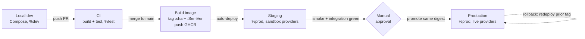
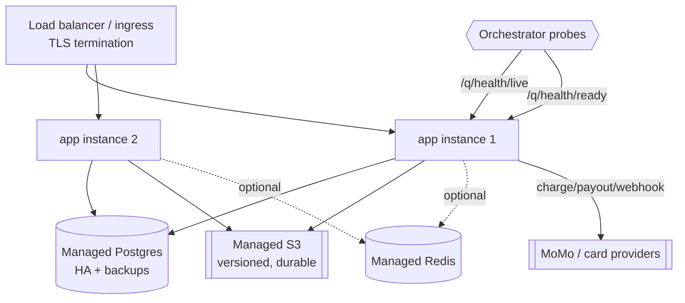

# BeatzClik Backend — Environments & Deployment

> **Scope:** how the `beatzmedia` Quarkus monolith is configured, built, containerized, deployed,
> backed up, scaled, and recovered across every environment. **PRD source:** §4.3, §5 (Compose
> topology, env vars, dev services, seeding, dev-vs-prod), §10 (NFRs). **Read first:**
> `00-system-architecture.md` §7 (runtime topology), `01-conventions-and-standards.md` §6/§9.
> **Cross-refs:** `sdlc/ci-cd-github-actions.md` (release/deploy workflows), `cross-cutting/observability.md`
> (health, SLOs), `cross-cutting/data-and-migrations.md` (Flyway policy).

This guide is consumed by autonomous agents. Everything here is concrete and runnable: copy the
`docker-compose.yml`, fill the env table, and the stack boots. Production differs from local only in
*who provides* Postgres/S3 and *where* secrets come from — the image is identical.

---

## 1. Environments overview

There are four environments. The **same container image** runs in all of them; only configuration
(env vars + secrets source) and the backing infra (managed vs containerized) change.

| Environment | Purpose | Compute | Postgres | Object store | Mail/SMS | Secrets source | Profile |
|---|---|---|---|---|---|---|---|
| **local** | Inner-loop dev, manual QA | Docker Compose (`app`) | Compose `db` (`postgres:16`) | Compose `objectstore` (MinIO) | Mailpit + SMS stub | `.env` file (gitignored) | `%dev` |
| **CI** | Build + test on every PR | GitHub Actions runner | Testcontainers (ephemeral) | Testcontainers MinIO | fakes / Mailpit | GitHub Actions secrets (none real) | `%test` |
| **staging** | Pre-prod verification, smoke + integration | 1 container (orchestrator) | Managed Postgres (small) | Managed S3 / MinIO | sandbox providers, real SMTP | GitHub Environment `staging` | `%prod` |
| **production** | Live traffic | ≥2 containers behind LB | Managed Postgres (HA) | Managed S3 (versioned) | live providers | GitHub Environment `production` / vault | `%prod` |

**Rules:**
- **No secret is ever committed.** Non-secret defaults live in `application.properties`; secrets come
  from the environment (local `.env`, CI/GitHub secrets, prod vault/managed secrets).
- Staging and production both run the `%prod` Quarkus profile. They are distinguished only by env-var
  values (endpoints, keys) and scale. Staging uses **sandbox** payment providers; production uses live.
- `%prod` **disables seed data**, **requires** real provider secrets, and **enforces TLS** for
  outbound provider calls.

### Promotion flow



The image promoted to production is the **exact digest** that passed staging — never a rebuild. See
`sdlc/ci-cd-github-actions.md` for the workflow YAML.

---

## 2. Local environment — Docker Compose

`docker compose up` boots the entire stack (PRD §5.1). `db`, `objectstore`, and `mail` become healthy
before `app` starts (`depends_on` + `condition: service_healthy`). Named volumes `pgdata` and
`miniodata` persist data across restarts.

### 2.1 Complete `docker-compose.yml`

Place at repo root (or `backend/`). Build the app jar first: `./mvnw -f backend/pom.xml package`.

```yaml
# docker-compose.yml — BeatzClik backend canonical local stack (PRD §5.1)
name: beatzclik

services:
  db:
    image: postgres:16
    environment:
      POSTGRES_USER: beatz
      POSTGRES_PASSWORD: beatz
      POSTGRES_DB: beatzmedia
    ports:
      - "5432:5432"
    volumes:
      - pgdata:/var/lib/postgresql/data
    healthcheck:
      test: ["CMD-SHELL", "pg_isready -U beatz -d beatzmedia"]
      interval: 5s
      timeout: 5s
      retries: 10
    restart: unless-stopped

  objectstore:
    image: minio/minio:latest
    command: server /data --console-address ":9001"
    environment:
      MINIO_ROOT_USER: minioadmin
      MINIO_ROOT_PASSWORD: minioadmin
    ports:
      - "9000:9000"   # S3 API
      - "9001:9001"   # web console
    volumes:
      - miniodata:/data
    healthcheck:
      test: ["CMD", "curl", "-f", "http://localhost:9000/minio/health/live"]
      interval: 5s
      timeout: 5s
      retries: 10
    restart: unless-stopped

  createbuckets:
    image: minio/mc:latest
    depends_on:
      objectstore:
        condition: service_healthy
    entrypoint: >
      /bin/sh -c "
      mc alias set local http://objectstore:9000 minioadmin minioadmin &&
      mc mb --ignore-existing local/beatz-media-originals &&
      mc mb --ignore-existing local/beatz-media-delivery &&
      mc anonymous set none local/beatz-media-originals &&
      mc anonymous set none local/beatz-media-delivery &&
      echo 'buckets ready';
      "
    restart: "no"

  mail:
    image: axllent/mailpit:latest
    ports:
      - "1025:1025"   # SMTP
      - "8025:8025"   # web UI
    healthcheck:
      test: ["CMD", "wget", "-qO-", "http://localhost:8025/livez"]
      interval: 10s
      timeout: 5s
      retries: 5
    restart: unless-stopped

  sms:
    # Local SMS capture stub (PRD OQ-9): HTTP endpoint + simple UI; SmsSender adapter points here in dev.
    image: ghcr.io/beatzclik/sms-capture-stub:latest
    ports:
      - "8026:8026"
    healthcheck:
      test: ["CMD", "wget", "-qO-", "http://localhost:8026/healthz"]
      interval: 10s
      timeout: 5s
      retries: 5
    restart: unless-stopped

  transcoder:
    # Audio -> HLS + 30s preview clip, out of the request path (PRD §10).
    image: jrottenberg/ffmpeg:6-ubuntu
    entrypoint: ["sleep", "infinity"]   # invoked by app/worker; or run as a polling worker
    volumes:
      - miniodata:/data:ro
    restart: unless-stopped

  cache:
    # Optional: rate-limit buckets / ephemeral cache (PRD §4.3). Remove if unused.
    image: redis:7
    ports:
      - "6379:6379"
    healthcheck:
      test: ["CMD", "redis-cli", "ping"]
      interval: 5s
      timeout: 3s
      retries: 5
    restart: unless-stopped

  app:
    build:
      context: ./backend
      dockerfile: src/main/docker/Dockerfile.jvm
    depends_on:
      db:
        condition: service_healthy
      objectstore:
        condition: service_healthy
      mail:
        condition: service_healthy
      createbuckets:
        condition: service_completed_successfully
    ports:
      - "8080:8080"
    environment:
      QUARKUS_PROFILE: dev
      # --- datasource ---
      QUARKUS_DATASOURCE_JDBC_URL: jdbc:postgresql://db:5432/beatzmedia
      QUARKUS_DATASOURCE_USERNAME: beatz
      QUARKUS_DATASOURCE_PASSWORD: beatz
      QUARKUS_FLYWAY_MIGRATE_AT_START: "true"
      # --- object store (MinIO) ---
      BEATZ_S3_ENDPOINT: http://objectstore:9000
      BEATZ_S3_ACCESS_KEY: minioadmin
      BEATZ_S3_SECRET_KEY: minioadmin
      BEATZ_S3_BUCKET_ORIGINALS: beatz-media-originals
      BEATZ_S3_BUCKET_DELIVERY: beatz-media-delivery
      BEATZ_SIGNED_URL_TTL_SECONDS: "300"
      BEATZ_PREVIEW_SECONDS: "30"
      # --- mail (Mailpit) ---
      QUARKUS_MAILER_HOST: mail
      QUARKUS_MAILER_PORT: "1025"
      QUARKUS_MAILER_FROM: no-reply@beatzclik.local
      QUARKUS_MAILER_MOCK: "false"
      # --- sms stub ---
      BEATZ_SMS_ENDPOINT: http://sms:8026/send
      # --- jwt (dev keypair under src/main/resources; never use these in prod) ---
      BEATZ_JWT_PRIVATE_KEY: ${BEATZ_JWT_PRIVATE_KEY:-}
      BEATZ_JWT_PUBLIC_KEY: ${BEATZ_JWT_PUBLIC_KEY:-}
      # --- payment providers: dev sandbox / disabled ---
      BEATZ_PAYMENT_WEBHOOK_SECRET: dev-webhook-secret
      # --- platform settings seeds (PlatformSettings is runtime source of truth) ---
      BEATZ_PLATFORM_FEE_PCT: "30"
      BEATZ_CREATOR_SHARE_PCT: "70"
      BEATZ_TIP_FEE_PCT: "10"
      BEATZ_BUNDLE_DISCOUNT_PCT: "24"
      BEATZ_SERVICE_FEE: "0.50"
      BEATZ_MIN_PAYOUT: "10"
      BEATZ_PAYOUT_DAY: FRIDAY
      # --- optional cache ---
      QUARKUS_REDIS_HOSTS: redis://cache:6379
    healthcheck:
      test: ["CMD", "curl", "-f", "http://localhost:8080/q/health/ready"]
      interval: 10s
      timeout: 5s
      retries: 12
      start_period: 40s
    restart: unless-stopped

volumes:
  pgdata:
  miniodata:
```

> The `transcoder` is shown as a sidecar; depending on `cross-cutting/media-pipeline.md` it may be an
> in-app `ffmpeg` invocation or a polling worker. Either way transcoding stays **out of the request
> path** (PRD §10).

### 2.2 Running

```bash
./mvnw -f backend/pom.xml package          # build the quarkus-app
docker compose up --build -d               # boot the stack
docker compose ps                          # all healthy?
curl localhost:8080/q/health/ready         # {"status":"UP",...}
# Mailpit UI http://localhost:8025 · MinIO console http://localhost:9001
docker compose down                        # stop (keeps volumes)
docker compose down -v                     # stop + wipe pgdata/miniodata
```

For the fastest inner loop, prefer **`./mvnw -f backend/pom.xml quarkus:dev`** (live reload). With no
datasource/S3 config present, Quarkus **Dev Services** auto-provisions Postgres + MinIO via
Testcontainers (PRD §5.3). When Compose URLs are set, Dev Services stand down. Integration tests
(`*IT`) target the Compose / Testcontainers Postgres + MinIO; unit tests use in-memory fakes for
output ports.

---

## 3. Quarkus configuration profiles

Quarkus selects a profile from `QUARKUS_PROFILE` (env), `-Dquarkus.profile`, or defaults
(`dev` for `quarkus:dev`, `test` under tests, `prod` for the packaged jar). Profile-specific keys use
the `%profile.` prefix.

| Concern | `%dev` (local) | `%test` (CI) | `%prod` (staging/prod) |
|---|---|---|---|
| Datasource | Compose `db` or Dev Services | Testcontainers | Managed Postgres (env) |
| `flyway.migrate-at-start` | `true` | `true` | `true` (or migration job, §5.3) |
| Seed data (`R__seed_dev_data.sql`) | **on** | on | **off** |
| Object store | MinIO | Testcontainers MinIO | Managed S3 (env) |
| Mailer | Mailpit (real SMTP, captured) | mock | real SMTP (env) |
| Payment providers | disabled/stub | fakes | sandbox (staging) / live (prod) |
| Outbound TLS enforcement | relaxed | relaxed | **enforced** |
| Log format | console, pretty | console | JSON (structured, §9 conventions) |
| OpenAPI/Swagger UI | enabled | enabled | disabled (or gated) |
| Secrets | `.env` | none real | vault / managed secrets |

### 3.1 `application.properties` skeleton

Lives at `backend/src/main/resources/application.properties`. **Non-secret defaults only**; every
secret resolves from an env var via `${ENV_VAR:default}`. Values map 1:1 to PRD §5.2.

```properties
# ============ Core / HTTP ============
quarkus.application.name=beatzmedia
quarkus.http.port=8080
quarkus.http.root-path=/
# REST base path is /v1 (set per-resource or via quarkus.rest.path); see conventions §5.

# ============ Datasource (PRD §5.2) ============
quarkus.datasource.db-kind=postgresql
quarkus.datasource.jdbc.url=${QUARKUS_DATASOURCE_JDBC_URL:jdbc:postgresql://localhost:5432/beatzmedia}
quarkus.datasource.username=${QUARKUS_DATASOURCE_USERNAME:beatz}
quarkus.datasource.password=${QUARKUS_DATASOURCE_PASSWORD:beatz}
quarkus.hibernate-orm.database.generation=none

# ============ Flyway (migrate on boot) ============
quarkus.flyway.migrate-at-start=${QUARKUS_FLYWAY_MIGRATE_AT_START:true}
quarkus.flyway.baseline-on-migrate=true
quarkus.flyway.locations=db/migration
# Repeatable dev seed runs only in dev/test (prod excludes via locations override below).
%prod.quarkus.flyway.locations=db/migration

# ============ Object storage (S3 / MinIO, PRD §5.2) ============
beatz.s3.endpoint=${BEATZ_S3_ENDPOINT:http://localhost:9000}
beatz.s3.access-key=${BEATZ_S3_ACCESS_KEY:minioadmin}
beatz.s3.secret-key=${BEATZ_S3_SECRET_KEY:minioadmin}
beatz.s3.bucket-originals=${BEATZ_S3_BUCKET_ORIGINALS:beatz-media-originals}
beatz.s3.bucket-delivery=${BEATZ_S3_BUCKET_DELIVERY:beatz-media-delivery}
beatz.signed-url-ttl-seconds=${BEATZ_SIGNED_URL_TTL_SECONDS:300}
beatz.preview-seconds=${BEATZ_PREVIEW_SECONDS:30}
# quarkus-amazon-s3 wiring (endpoint override is what points it at MinIO):
quarkus.s3.endpoint-override=${BEATZ_S3_ENDPOINT:http://localhost:9000}
quarkus.s3.path-style-access=true
quarkus.s3.aws.region=${BEATZ_S3_REGION:us-east-1}
quarkus.s3.aws.credentials.type=static
quarkus.s3.aws.credentials.static-provider.access-key-id=${BEATZ_S3_ACCESS_KEY:minioadmin}
quarkus.s3.aws.credentials.static-provider.secret-access-key=${BEATZ_S3_SECRET_KEY:minioadmin}

# ============ JWT (SmallRye, PRD §4.3 / §5.2) ============
mp.jwt.verify.publickey=${BEATZ_JWT_PUBLIC_KEY:}
mp.jwt.verify.issuer=${BEATZ_JWT_ISSUER:https://beatzclik}
smallrye.jwt.sign.key=${BEATZ_JWT_PRIVATE_KEY:}
beatz.jwt.access-ttl-seconds=${BEATZ_JWT_ACCESS_TTL:3600}

# ============ Mailer (PRD §5.2) ============
quarkus.mailer.from=${QUARKUS_MAILER_FROM:no-reply@beatzclik.local}
quarkus.mailer.host=${QUARKUS_MAILER_HOST:localhost}
quarkus.mailer.port=${QUARKUS_MAILER_PORT:1025}
quarkus.mailer.start-tls=${QUARKUS_MAILER_START_TLS:DISABLED}
%prod.quarkus.mailer.start-tls=REQUIRED

# ============ SMS stub / provider (PRD §5.2, OQ-9) ============
beatz.sms.endpoint=${BEATZ_SMS_ENDPOINT:http://localhost:8026/send}
beatz.sms.api-key=${BEATZ_SMS_API_KEY:}

# ============ Payment providers (placeholders; secrets via env) ============
beatz.momo.mtn.base-url=${BEATZ_MOMO_MTN_BASE_URL:}
beatz.momo.mtn.api-key=${BEATZ_MOMO_MTN_API_KEY:}
beatz.momo.vodafone.api-key=${BEATZ_MOMO_VODAFONE_API_KEY:}
beatz.momo.airteltigo.api-key=${BEATZ_MOMO_AIRTELTIGO_API_KEY:}
beatz.card.api-key=${BEATZ_CARD_API_KEY:}
beatz.payment.webhook-secret=${BEATZ_PAYMENT_WEBHOOK_SECRET:dev-webhook-secret}

# ============ PlatformSettings seed constants (PRD §5.2 — runtime source of truth) ============
beatz.platform.fee-pct=${BEATZ_PLATFORM_FEE_PCT:30}
beatz.platform.creator-share-pct=${BEATZ_CREATOR_SHARE_PCT:70}
beatz.platform.tip-fee-pct=${BEATZ_TIP_FEE_PCT:10}
beatz.platform.bundle-discount-pct=${BEATZ_BUNDLE_DISCOUNT_PCT:24}
beatz.platform.service-fee=${BEATZ_SERVICE_FEE:0.50}
beatz.platform.min-payout=${BEATZ_MIN_PAYOUT:10}
beatz.platform.payout-day=${BEATZ_PAYOUT_DAY:FRIDAY}

# ============ Health / Observability (see observability.md) ============
quarkus.smallrye-health.root-path=/q/health
quarkus.micrometer.export.prometheus.enabled=true

# ============ Profile differences ============
%dev.quarkus.log.console.json=false
%test.quarkus.mailer.mock=true
%prod.quarkus.log.console.json=true
%prod.quarkus.swagger-ui.enable=false
%prod.beatz.seed.enabled=false
```

> Bind `beatz.*` keys with `@ConfigMapping` records in the platform kernel; these seed
> `PlatformSettings` on first boot. After seeding, **`PlatformSettings` (DB) is the runtime source of
> truth** — env values are bootstrap defaults only (conventions §2).

---

## 4. Environment variables reference

From PRD §5.2. **Secret?** marks values that must never be committed and must come from a secret store.
"Example" shows a safe local/dev value, not a production value.

| Variable | Purpose | Example (dev) | Secret? | Notes per env |
|---|---|---|---|---|
| `QUARKUS_PROFILE` | Active profile | `dev` | no | `prod` in staging+prod |
| `QUARKUS_DATASOURCE_JDBC_URL` | Postgres JDBC URL | `jdbc:postgresql://db:5432/beatzmedia` | no | managed host in prod |
| `QUARKUS_DATASOURCE_USERNAME` | DB user | `beatz` | no | least-priv role in prod |
| `QUARKUS_DATASOURCE_PASSWORD` | DB password | `beatz` | **yes** | from secret store |
| `QUARKUS_FLYWAY_MIGRATE_AT_START` | Run migrations on boot | `true` | no | `true`, or job-based (§5.3) |
| `BEATZ_S3_ENDPOINT` | S3/MinIO endpoint | `http://objectstore:9000` | no | S3 endpoint in prod |
| `BEATZ_S3_ACCESS_KEY` | S3 access key | `minioadmin` | **yes** | IAM key in prod |
| `BEATZ_S3_SECRET_KEY` | S3 secret key | `minioadmin` | **yes** | IAM secret in prod |
| `BEATZ_S3_BUCKET_ORIGINALS` | Private originals bucket | `beatz-media-originals` | no | per-env bucket name |
| `BEATZ_S3_BUCKET_DELIVERY` | Delivery (HLS) bucket | `beatz-media-delivery` | no | per-env bucket name |
| `BEATZ_SIGNED_URL_TTL_SECONDS` | Signed URL lifetime | `300` | no | tune per env |
| `BEATZ_PREVIEW_SECONDS` | Preview clip length | `30` | no | INV-3 |
| `BEATZ_JWT_PRIVATE_KEY` | JWT signing key (PEM/PKCS8) | dev key | **yes** | unique per env, rotate |
| `BEATZ_JWT_PUBLIC_KEY` | JWT verify key | dev key | no* | public, but env-specific |
| `BEATZ_JWT_ISSUER` | Token issuer claim | `https://beatzclik` | no | per env |
| `QUARKUS_MAILER_HOST` | SMTP host | `mail` | no | provider host in prod |
| `QUARKUS_MAILER_PORT` | SMTP port | `1025` | no | `587`/`465` in prod |
| `QUARKUS_MAILER_FROM` | From address | `no-reply@beatzclik.local` | no | verified domain in prod |
| `QUARKUS_MAILER_USERNAME` | SMTP user | — | **yes** | prod only |
| `QUARKUS_MAILER_PASSWORD` | SMTP password | — | **yes** | prod only |
| `BEATZ_SMS_ENDPOINT` | SMS send endpoint | `http://sms:8026/send` | no | provider URL in prod |
| `BEATZ_SMS_API_KEY` | SMS provider key | — | **yes** | prod only |
| `BEATZ_MOMO_MTN_API_KEY` | MTN MoMo key | — | **yes** | sandbox (stg) / live (prod) |
| `BEATZ_MOMO_VODAFONE_API_KEY` | Telecel/Vodafone Cash key | — | **yes** | sandbox / live |
| `BEATZ_MOMO_AIRTELTIGO_API_KEY` | AirtelTigo Money key | — | **yes** | sandbox / live |
| `BEATZ_CARD_API_KEY` | Card/bank gateway key | — | **yes** | sandbox / live |
| `BEATZ_PAYMENT_WEBHOOK_SECRET` | Verify provider webhooks | `dev-webhook-secret` | **yes** | per env |
| `BEATZ_PLATFORM_FEE_PCT` | Platform fee % | `30` | no | seeds PlatformSettings |
| `BEATZ_CREATOR_SHARE_PCT` | Creator share % | `70` | no | seeds PlatformSettings |
| `BEATZ_TIP_FEE_PCT` | Tip fee % | `10` | no | seeds PlatformSettings |
| `BEATZ_BUNDLE_DISCOUNT_PCT` | Bundle discount % | `24` | no | seeds PlatformSettings |
| `BEATZ_SERVICE_FEE` | Per-order service fee (₵) | `0.50` | no | seeds PlatformSettings |
| `BEATZ_MIN_PAYOUT` | Minimum payout (₵) | `10` | no | seeds PlatformSettings |
| `BEATZ_PAYOUT_DAY` | Weekly payout day | `FRIDAY` | no | seeds PlatformSettings |
| `QUARKUS_REDIS_HOSTS` | Redis URL (optional) | `redis://cache:6379` | no | managed Redis in prod |

> *Public JWT key is not a secret per se, but is environment-specific and paired with the private key —
> keep it in the same secret store for clean rotation.

---

## 5. Containerization & build

### 5.1 JVM vs native trade-offs

The repo ships three Dockerfiles under `backend/src/main/docker/`:

| Build | Dockerfile | Base image | Startup | RSS | Build time | When to use |
|---|---|---|---|---|---|---|
| **JVM** (default) | `Dockerfile.jvm` | `ubi9/openjdk-25-runtime` | ~1–2 s | ~250–400 MB | fast | **Production default** — fast builds, peak throughput, easy profiling |
| **Native** | `Dockerfile.native` | `ubi9/ubi-minimal` | ~0.05 s | ~50–100 MB | slow (GraalVM, minutes + RAM) | Cost-sensitive scale-to-zero, many small instances |
| **Native micro** | `Dockerfile.native-micro` | `ubi9-quarkus-micro-image` | ~0.05 s | smallest | slowest | Smallest footprint native |

**Recommendation:** ship the **JVM image** by default (PRD §5.5). The monolith handles money/ownership
with reflection-heavy libraries; JVM avoids native-image reflection config burden and gives better
sustained throughput. Native is an opt-in optimization once startup/density matters. Native builds
require `./mvnw -f backend/pom.xml package -Dnative` (the `native` profile in `pom.xml` enables
`quarkus.native.enabled` and runs `*IT`).

Build the JVM image (after `./mvnw -f backend/pom.xml package`):

```bash
docker build -f backend/src/main/docker/Dockerfile.jvm \
  -t ghcr.io/beatzclik/beatzmedia:1.0.0 backend/
```

### 5.2 Jib option

For reproducible, daemonless, layered builds in CI, **Jib** (`quarkus-container-image-jib`) builds and
pushes straight to GHCR without a Docker daemon and with better layer caching:

```bash
./mvnw -f backend/pom.xml package \
  -Dquarkus.container-image.build=true \
  -Dquarkus.container-image.push=true \
  -Dquarkus.container-image.registry=ghcr.io \
  -Dquarkus.container-image.group=beatzclik \
  -Dquarkus.container-image.name=beatzmedia \
  -Dquarkus.container-image.tag=1.0.0
```

Either approach yields the same runtime contract; pick one and keep CI consistent (see
`ci-cd-github-actions.md`).

### 5.3 Image tagging & registry

- **Registry:** GitHub Container Registry, `ghcr.io/beatzclik/beatzmedia`.
- **Tags per push:**
  - `:<git-sha>` (immutable, always) — what CI deploys/promotes.
  - `:<SemVer>` (e.g. `:1.0.0`) on tagged releases — derived from `pom.xml` version (drop `-SNAPSHOT`).
  - `:latest` (mutable, convenience for dev) — never referenced by prod deploys.
- **Promotion uses the digest** (`@sha256:…`), not a floating tag, so staging and prod run the exact
  bytes. Never `:latest` in production.

---

## 6. Deployment shape



**Topology:** stateless `app` container(s) behind a load balancer, plus **managed Postgres** and
**managed S3**. No local disk state in the app — all durable state is in Postgres or S3 (PRD §5.5,
§10). Transcoding runs as a worker out of the request path.

### 6.1 Migrations on deploy

Default: **`quarkus.flyway.migrate-at-start=true`** — the app applies forward-only migrations on boot
(conventions §6). Simple and correct for a single-writer monolith.

For multi-instance rollouts, run migrations **once** before scaling new instances, either by:
- a **migration job/init step** (`./mvnw flyway:migrate` or a one-shot container with
  `migrate-at-start` and `quarkus.http.host`/no traffic) gated before the rollout, **or**
- relying on Flyway's table lock so concurrent boots serialize (acceptable for small migrations).

Migrations are **forward-only and never edited once merged**; backward-incompatible schema changes use
expand/contract (add nullable column → backfill → switch reads → drop in a later release) so old and
new app versions coexist during rollout.

### 6.2 Health probes

Backed by SmallRye Health (see `cross-cutting/observability.md`):

| Probe | Endpoint | Meaning | Orchestrator action |
|---|---|---|---|
| Liveness | `GET /q/health/live` | Process is alive | restart container if failing |
| Readiness | `GET /q/health/ready` | DB + S3 reachable, migrations done, ready for traffic | add/remove from LB |
| Startup | `GET /q/health/started` | Boot complete (covers Flyway) | gate liveness during slow start |

Readiness must be **DOWN until migrations finish** so the LB never routes to a half-migrated instance.

### 6.3 Zero/low-downtime rollout

Rolling update: bring up new-version instances, wait for `ready`, shift LB traffic, then drain and stop
old instances (`maxUnavailable=0`, `maxSurge=1`). Because migrations follow expand/contract, the old
version keeps serving while the new one starts. The app handles `SIGTERM` by completing in-flight
requests (graceful shutdown, default in Quarkus) before exit. Set `maintenanceMode` (returns 503 for
non-admin writes, reads stay up — PRD §10) only for the rare migration that cannot be made online.

### 6.4 Rollback

1. **Fast path — redeploy the previous image tag/digest.** Because the app is stateless, redeploying
   `:<prev-sha>` restores the prior version immediately.
2. **Schema caveat:** rollback is safe only if the new release's migrations are **backward-compatible**
   with the old code (the reason for expand/contract). If a migration was destructive, **do not roll
   back the DB** — **forward-fix** with a new migration instead. Never hand-edit applied migrations.
3. Verify `/q/health/ready` green and run the smoke suite (see `ci-cd-github-actions.md`).

---

## 7. Secrets management

| Environment | Store | Access |
|---|---|---|
| local | `.env` file (gitignored) + dev JWT keypair in resources | developer machine only |
| CI | GitHub Actions secrets (repo/org) | exposed only to required jobs, masked in logs |
| staging | GitHub **Environment** `staging` secrets (or vault) | deploy job, requires environment |
| production | GitHub **Environment** `production` secrets / managed secret manager / vault | deploy job, **required reviewers** + protection rules |

Principles:
- **Least privilege:** the DB role used by the app can DML + run migrations on its own schema, nothing
  more; the S3 IAM key is scoped to the two buckets only.
- **Per-environment, distinct secrets:** JWT keys, webhook secrets, provider keys differ per env.
  Staging uses **sandbox** provider credentials; production uses live.
- **GitHub Environments** gate prod deploys behind required reviewers; secrets are injected at deploy
  time, never baked into the image.
- **Rotation:** secrets are rotatable without code change (runbook §10.5). JWT keys rotate via overlap
  (publish new public key, sign with new private key, retire old after token TTL).
- **Never** log secrets or put them in error messages (conventions §9).

---

## 8. Backups & disaster recovery

**Postgres**
- Managed Postgres with **automated daily snapshots** + **continuous WAL / PITR** (point-in-time
  recovery). Retain ≥ 30 days. Verify restores monthly.
- Logical dumps (`pg_dump`) on a schedule to object storage for portability and long-term retention.
- Target **RPO ≤ 5 min** (WAL), **RTO ≤ 1 h** for full restore.

**Object store**
- S3 with **versioning enabled** and **cross-region/replication** for the delivery and originals
  buckets. Originals are the irreplaceable masters — protect with versioning + lifecycle + replication.
- Lifecycle: keep originals indefinitely; HLS renditions are regenerable from originals if lost.

**DR posture**
- All durable state is Postgres + S3; the app is stateless and re-deployable from a GHCR image, so DR
  = restore DB + ensure S3 + redeploy image.

**Restore runbook** — see §10.6.

---

## 9. Scaling

Per PRD §10 (scalability within a monolith):

- **App: horizontal, stateless.** Run N identical instances behind the LB; add instances to meet load.
  No sticky sessions (stateless Bearer JWT). Read endpoints target p95 ≤ 200 ms, stream-URL issuance
  p95 ≤ 150 ms, checkout initiation p95 ≤ 500 ms (provider latency excluded — charges are async).
- **Shared state:** Postgres (single writer, the consistency anchor for money/ownership), object store,
  and optional Redis (rate-limit buckets / cache). These scale independently of app instances.
- **Postgres scaling:** vertical first; add **read replicas** for heavy read paths (catalog, search)
  behind a read-only datasource if needed. Money/ownership writes stay on the primary.
- **Transcoding out of the request path:** audio→HLS + 30s preview runs as a worker/queue, never
  blocking an HTTP request. Scale transcoder workers separately from the API.
- **Analytics from rollups,** not raw events (PRD §10), so read load is bounded.
- **Availability target 99.9%** for read/stream paths; payments degrade gracefully (queue + reconcile)
  when a provider is slow.

---

## 10. Runbooks

### 10.1 First-time bootstrap (local)
```bash
git clone <repo> && cd <repo>
cp .env.example .env                       # fill local secrets (JWT keypair, etc.)
./mvnw -f backend/pom.xml package
docker compose up --build -d
docker compose ps                          # wait until app is healthy
curl localhost:8080/q/health/ready         # UP
# Seed (R__seed_dev_data.sql) loads automatically in %dev; verify a catalog endpoint returns data.
```

### 10.2 Deploy (staging/prod)
1. Merge to `main` → CI builds + tests, pushes `ghcr.io/beatzclik/beatzmedia:<sha>` (and SemVer on a tag).
2. Auto-deploy to **staging** (`%prod`, sandbox providers). Run smoke + integration; check `/q/health/ready`.
3. Manual approval (GitHub Environment `production`, required reviewers) → promote the **same digest**.
4. Rolling update; wait for new instances `ready`; drain old; confirm SLO dashboards (observability.md).

### 10.3 Rollback
```bash
# Redeploy the previous immutable tag/digest (app is stateless):
deploy ghcr.io/beatzclik/beatzmedia@sha256:<previous-digest>
# Verify:
curl https://<host>/q/health/ready
# If a destructive migration shipped: DO NOT revert DB — author a forward-fix migration instead.
```

### 10.4 Run a migration
- Add `src/main/resources/db/migration/V<n>__<snake_desc>.sql` (forward-only, never edit merged files).
- Local: `docker compose restart app` (applies on boot via `migrate-at-start`).
- Staging/prod: deploy the new image; migrations apply on boot, **or** run the gated migration job
  before scaling new instances (§6.1). Use **expand/contract** for backward-incompatible changes.

### 10.5 Rotate a secret
1. Add the new secret value to the env's secret store (GitHub Environment / vault) under a new version.
2. For JWT keys: publish the new **public** key (verification accepts old+new during overlap), switch
   signing to the new **private** key, then retire the old key after the access-token TTL elapses.
3. For DB/S3/provider keys: update the secret, redeploy (rolling) so instances pick up new values,
   confirm `/q/health/ready`, then revoke the old credential at the provider.

### 10.6 Restore a backup (DR)
```bash
# 1. Provision/restore Postgres to a point in time (managed PITR), or:
pg_restore --clean --if-exists -d "$QUARKUS_DATASOURCE_JDBC_URL" latest.dump
# 2. Confirm S3 buckets present + versioned (originals are the source of truth; HLS regenerable).
# 3. Redeploy the matching app image digest for that data version:
deploy ghcr.io/beatzclik/beatzmedia@sha256:<digest-for-data-version>
# 4. Verify: /q/health/ready UP; run smoke; reconcile ledger vs provider records.
# 5. If HLS renditions were lost, re-trigger transcode from originals (out-of-band worker).
```

---

## 11. Cross-references

- **`sdlc/ci-cd-github-actions.md`** — build/test/release/deploy workflows, GHCR push, staging→prod
  promotion gates. This doc and that one must stay consistent on tags, digests, and approvals.
- **`cross-cutting/observability.md`** — health check contributions, metrics, SLO/SLA targets behind
  the availability numbers in §9.
- **`cross-cutting/data-and-migrations.md`** — full Flyway policy, expand/contract, seed strategy.
- **`00-system-architecture.md` §7** — runtime topology summary this doc expands.
- **PRD §5, §10** — canonical Compose topology, env vars, seeding, and NFRs.
