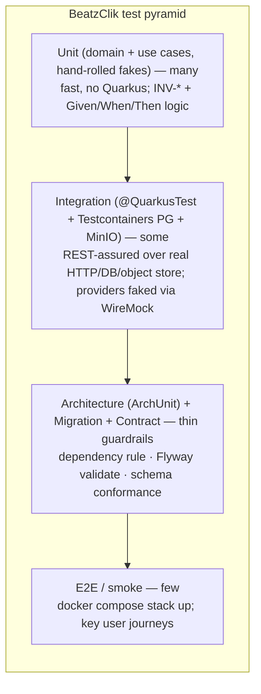
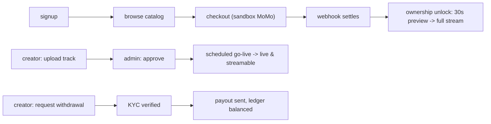

# BeatzClik Backend — Testing Strategy

> **Scope:** the authoritative testing contract for the `beatzmedia` Quarkus modular monolith.
> Consumed by autonomous Claude Code agents — when a module ADD is silent on *how to test*, this
> document governs. **Authoritative inputs:** `00-system-architecture.md` §4 (hexagonal/dependency
> rule), `01-conventions-and-standards.md` §11 (Definition of Done), `cross-cutting/api-and-contract.md`
> §8 (contract testing), `cross-cutting/data-and-migrations.md` §9 (migration tests),
> `BACKEND-PRD.md` §3.3 (INV-*), §6 (Given/When/Then ACs), §8 (DoD/work units), §10 (NFRs).
>
> **The DoD gate (conventions §11):** a work unit is *done* only when unit + integration tests pass,
> contract conformance is green, Flyway applies cleanly on an empty DB, the stack boots under Compose,
> ArchUnit is green, money/side-effect paths are idempotent + audited, and coverage clears the gate in
> this file. Every clause below exists to make one of those checkable by an agent.

---

## 1. Test pyramid



| Layer | Boots Quarkus? | Real DB/IO? | Speed | What it proves |
|---|---|---|---|---|
| **Unit** | No | No (hand-rolled fakes) | ms | Domain invariants (INV-*), use-case orchestration, money/split math, AC business logic |
| **Integration** | Yes (`@QuarkusTest`) | Testcontainers Postgres + MinIO; WireMock for providers | seconds | Wiring, persistence, transactions, real HTTP status/shape, idempotency, RBAC |
| **Contract** | Yes | Seeded DB | seconds | Every response validates against `Frontend/src/types/index.ts` / `API-CONTRACT.md`; exact `error.code` |
| **Architecture** | No (classpath scan) | No | ms | Hexagonal dependency rule, no framework in domain, no cross-module access |
| **Migration** | Yes (empty container) | Testcontainers Postgres | seconds | Flyway applies + `validate()` on a fresh DB; seed reads non-empty |
| **E2E / smoke** | Full Compose stack | Everything (sandbox MoMo) | minutes | Key journeys end-to-end; the no-visual-change migration check |

Push logic **down**. If a behaviour can be proven with a fast domain unit test, do not promote it to an
integration test. Reserve `@QuarkusTest` for things only real wiring can prove.

---

## 2. Layer 1 — Unit tests (domain + use cases, no Quarkus)

Pure JUnit5, no `@QuarkusTest`, no CDI, no container — these run in milliseconds and are the bulk of the
suite. Output ports (`port.out` interfaces — repos, gateways, `Clock`, `IdGenerator`, mailer, event
publisher) are satisfied by **hand-rolled fakes** in `src/test/java/.../<module>/fakes/`, never Mockito
mocks for the core money/ownership paths (fakes give deterministic, inspectable state).

- **Domain tests** exercise entities, value objects, aggregates and domain services directly. Construct
  an aggregate, call an intention-revealing method, assert state or the thrown framework-free
  `DomainException` (with its `ErrorCode`). This is where invariants live (§5).
- **Use-case tests** construct the application service with fakes, invoke the input port with a command,
  and assert the result + the side effects recorded by the fakes (rows written, events published,
  ledger entries posted). Assert idempotency by invoking twice and checking the effect happened once.

```java
class CheckoutUseCaseTest {
  FakeOwnershipRepo ownership = new FakeOwnershipRepo();
  FakePaymentGateway gateway = new FakePaymentGateway();      // returns PENDING by default
  FakeLedger ledger = new FakeLedger();
  FakeClock clock = FakeClock.at("2026-06-22T12:00:00Z");
  FakeIds ids = FakeIds.sequential("ord");
  CheckoutService svc = new CheckoutService(ownership, gateway, ledger, clock, ids, settings());

  @Test
  void grants_no_ownership_until_settlement() {                 // INV-1
    var result = svc.checkout(new CheckoutCommand(fanId, cart, idemKey));
    assertThat(result.status()).isEqualTo(Status.PENDING);
    assertThat(ownership.grantsFor(fanId)).isEmpty();           // no grant on PENDING
  }
}
```

**Fake conventions:** one fake per output port, in-memory backed by a `Map`/`List`, exposing inspector
methods (`grantsFor`, `entriesByTxn`, `published`). A shared `FakeClock` and `FakeIds` (the `Clock` and
`IdGenerator` kernel ports) make every test deterministic — no `Instant.now()`, no `UUID.randomUUID()`
anywhere in domain or application code (ArchUnit enforces this, §6).

---

## 3. Layer 2 — Integration tests (@QuarkusTest + Testcontainers + REST-assured)

`@QuarkusTest` boots the real application; REST-assured drives real HTTP against it; **Testcontainers**
supplies a real Postgres (Flyway migrates at start) and a real MinIO. Only **external providers**
(MoMo, card gateway, social-token verifier, SMS) are faked — via **WireMock** or a Quarkus `@Mock`
CDI alternative on the outbound REST-client port (§7).

### 3.1 Container wiring

Use Quarkus Dev Services where possible (zero-config Postgres for `@QuarkusTest`) and a shared
`QuarkusTestResourceLifecycleManager` for MinIO and WireMock so containers start once per suite, not
per class:

```java
@QuarkusTestResource(MinioTestResource.class)     // starts MinIO, seeds buckets, sets quarkus.s3.* props
@QuarkusTestResource(WireMockTestResource.class)  // starts WireMock, points provider base-url at it
@QuarkusTest
class CheckoutResourceIT { ... }
```

Dev Services starts Postgres automatically; pin the image to `postgres:16` to match prod (data-and-
migrations §1). `quarkus.flyway.migrate-at-start=true` runs the full `V*` set on the fresh container
before any test, so integration tests also exercise the migrations.

### 3.2 REST-assured example (success + an idempotent money path)

```java
@QuarkusTest
class WithdrawResourceIT {

  @Test
  void withdraw_requires_verified_kyc() {                                  // INV-8
    given().auth().oauth2(artistToken())
        .header("Idempotency-Key", uuid())
        .contentType(JSON).body(Map.of("amount", 25.00, "currency", "GHS"))
      .when().post("/v1/studio/payouts/withdraw")
      .then().statusCode(403)
        .body("error.code", is("KYC_REQUIRED"));
  }

  @Test
  void withdraw_is_idempotent_on_key() {                                   // §9.2
    var key = uuid();
    var first  = withdraw(key, 25.00).then().statusCode(202).extract().asString();
    var second = withdraw(key, 25.00).then().statusCode(202).extract().asString();
    assertThat(second).isEqualTo(first);                  // same body, side effect once
    assertThat(ledger.cashOutCountFor(artistId)).isEqualTo(1);
  }
}
```

Integration tests assert: the **exact HTTP status** (§1.1 table), the **response shape**, the exact
`error.code` for failure paths, RBAC (`401`/`403`/`404`-existence-hiding), pagination envelope shape,
and that money serializes as `{ amount, currency }` (never a display string).

---

## 4. Mapping PRD acceptance criteria → tests

Every LLFR in PRD §6 carries an `*AC:* Given … When … Then …` clause. **Each AC becomes at least one
test**, named for its LLFR so an agent (and CI) can trace coverage mechanically.

**Naming convention:** the test method name is the lower-snake of the AC outcome; the class carries the
LLFR id, and a `@Tag("LLFR-IDENTITY-01.1")` makes the link queryable. The `Given` becomes arrange, the
`When` the act, the `Then` the assert.

```java
@Tag("LLFR-IDENTITY-01.1")
@QuarkusTest
class SignupResourceIT {            // AC: Given unique email When signup valid body Then 201 + AccountRegistered
  @Test void given_unique_email_when_signup_then_created_and_event_emitted() { ... }
  @Test void given_taken_email_when_signup_then_409_email_taken() { ... }     // EMAIL_TAKEN
  @Test void given_short_password_when_signup_then_422_weak_password() { ... }// WEAK_PASSWORD
}
```

Rules for agents:
- One test per AC **happy path**, plus one per documented failure `ErrorCode` in that LLFR's `§6` row.
- Pure-logic ACs (split math, bundle price, ledger balance) are proven at the **unit** layer; ACs that
  assert an HTTP status / shape / emitted event are proven at the **integration** layer.
- The LLFR id appears in the `@Tag` (and ideally the class name) so the contract checklist (§8 of
  api-and-contract) can confirm every endpoint in the §10 inventory has a conformance test.

---

## 5. Mapping INV-* invariants → dedicated invariant tests

Every invariant in PRD §3.3 gets a **named, dedicated** invariant test class so a reviewer can find it
by invariant id. These are the highest-value tests in the suite; the money/ledger ones are 100%-branch
mandatory (§10).

| Inv | Statement | Primary test (layer) |
|---|---|---|
| **INV-1** | No `OwnershipGrant` until `PaymentIntent` SETTLED | `Inv1_OwnershipOnSettlementTest` — unit: PENDING/FAILED grant nothing; settlement webhook IT grants exactly the purchased ids |
| **INV-2** | Album/season purchase expands to constituent track/episode grants | `Inv2_PurchaseExpansionTest` — unit: album→all tracks; season-pass→all premium episodes |
| **INV-3** | Preview gate: unowned for-sale `/stream` returns 30s clip | `Inv3_PreviewGateTest` — IT: unowned → `previewSeconds=30` + clipped URL; owned → full; **never serves the full key to a non-owner** |
| **INV-4** | 70/30 sale split; 90/10 tip split, from `PlatformSettings` | `Inv4_RevenueSplitTest` — unit: ₵10 sale → 700/300 minor; tip → 90/10; constants read from settings, not literals |
| **INV-5** | Bundle price = `round(Σ × (1 − 0.24), 2)`; singles no discount | `Inv5_BundleDiscountTest` — unit: multi-track discounted, single unchanged |
| **INV-6** | Every movement balanced (Σ debit = Σ credit); balance = cleared credits − cash-outs | `Inv6_LedgerBalanceTest` — unit per txn + a property/fuzz test over random splits; IT asserts DB balance trigger |
| **INV-7** | Scheduled go-live exactly-once at instant; not streamable before | `Inv7_ScheduledGoLiveTest` — unit with `FakeClock`: before instant not live, after live; job idempotent (run twice → one transition) |
| **INV-8** | Withdrawal needs ≥₵10, cleared balance, KYC verified | `Inv8_WithdrawalGateTest` — unit: each guard; IT: `BELOW_MIN_PAYOUT` / `INSUFFICIENT_BALANCE` / `KYC_REQUIRED` |
| **INV-9** | Refund revokes grant(s), reverses ledger, claws back credit | `Inv9_RefundRevokesOwnershipTest` — unit + IT: post-refund `/me/owned` no longer lists ids; compensating txn balanced |
| **INV-10** | Every privileged mutation appends exactly one `AuditEntry` | `Inv10_AuditCompletenessTest` — IT per privileged endpoint: exactly one audit row; a parametrized sweep over suspend/verify/takedown/payout/refund/settings/role/impersonate |
| **INV-11** | Money in minor units internally; `{amount,currency}` on wire; half-up at boundary | `Inv11_MoneyPrecisionTest` — unit: `Money.ofCedis`/`toCedis` round-trip half-up; contract test asserts no display-string leakage |
| **INV-12** | Per-track splits sum ≤ 100; release can't go live with pending splits | `Inv12_SplitSumTest` — unit: >100 → `SPLIT_OVER_100`; remainder to originating creator; `ILLEGAL_TRANSITION` on go-live with pending splits |

**Property-based note:** INV-6 (balance) and INV-11/INV-4/INV-5 (rounding, sum-of-parts = whole) are
ideal for a small property test — generate random prices/splits and assert "no pesewa lost or invented"
and "Σ debit = Σ credit" hold for all. Use jqwik (add as test-scope) or a hand-rolled randomized loop.

---

## 6. Layer 4 — Architecture tests (ArchUnit)

ArchUnit enforces the hexagonal dependency rule (architecture §4) at build time; violations fail CI.
Add `com.tngtech.archunit:archunit-junit5` (test scope). Rules live in
`src/test/java/org/shakvilla/beatzmedia/archunit/ArchitectureRulesTest.java` and scan the whole root
package.

```java
@AnalyzeClasses(packages = "org.shakvilla.beatzmedia", importOptions = DoNotIncludeTests.class)
class ArchitectureRulesTest {

  // Domain imports no framework — pure Java + the platform kernel only.
  @ArchTest static final ArchRule domain_is_framework_free =
      noClasses().that().resideInAPackage("..domain..")
        .should().dependOnClassesThat().resideInAnyPackage(
            "jakarta..", "io.quarkus..", "org.hibernate..", "io.rest..", "software.amazon..");

  // Dependency direction: adapter → application → domain (never reversed).
  @ArchTest static final ArchRule layered =
      layeredArchitecture().consideringOnlyDependenciesInLayers()
        .layer("Domain").definedBy("..domain..")
        .layer("Application").definedBy("..application..")
        .layer("Adapter").definedBy("..adapter..")
        .whereLayer("Adapter").mayNotBeAccessedByAnyLayer()
        .whereLayer("Application").mayOnlyBeAccessedByLayers("Adapter")
        .whereLayer("Domain").mayOnlyBeAccessedByLayers("Application", "Adapter");

  // No JPA annotations on domain types (entities are persistence-adapter-only).
  @ArchTest static final ArchRule domain_has_no_jpa =
      noClasses().that().resideInAPackage("..domain..")
        .should().beAnnotatedWith("jakarta.persistence.Entity")
        .orShould().dependOnClassesThat().resideInAPackage("jakarta.persistence..");

  // Inbound and outbound adapters never import each other.
  @ArchTest static final ArchRule adapters_dont_cross =
      noClasses().that().resideInAPackage("..adapter.in..")
        .should().dependOnClassesThat().resideInAPackage("..adapter.out..");

  // No cross-module access: a module touches only its own package + platform kernel.
  // (Cross-module calls go through the callee's port.in only.) Encoded via slices:
  @ArchTest static final ArchRule modules_are_isolated =
      slices().matching("org.shakvilla.beatzmedia.(*)..")
        .should().notDependOnEachOther()
        .ignoreDependency(alwaysTrue(), resideInAPackage("..platform.."))
        .ignoreDependency(alwaysTrue(), resideInAPackage("..application.port.in.."));

  // Determinism: domain/application never call Instant.now() / UUID.randomUUID() directly.
  @ArchTest static final ArchRule no_wallclock_in_core =
      noClasses().that().resideInAnyPackage("..domain..", "..application..")
        .should().callMethod(java.time.Instant.class, "now")
        .orShould().callMethod(java.util.UUID.class, "randomUUID");
}
```

The cross-module slice rule is the build-time enforcement of "no module reads another module's tables /
internals" (architecture §1) — cross-context references resolve through `port.in`, which the rule
allow-lists. A real cross-module import that isn't a `port.in` call fails the build.

---

## 7. Payment / idempotency testing & provider mocking

The riskiest surface; treated with extra rigour (NFR §10: money is transactional + idempotent).

**Provider mocking strategy — WireMock.** The outbound MoMo/card clients are Quarkus REST clients
behind the `PaymentGateway` output port. In integration tests, point the client base-url at a WireMock
container and stub provider responses (charge accepted / declined / timeout) and **webhook callbacks**.
For unit tests, the `FakePaymentGateway` returns a scripted `PENDING`/`SETTLED`/`FAILED`. Never call a
real provider in tests.

Mandatory payment test cases (each an LLFR-tagged IT unless noted):

| Case | What it proves | Assertion |
|---|---|---|
| **Happy settlement** | charge → webhook SETTLED → grant + 70/30 ledger | `/me/owned` lists ids; ledger balanced (INV-1, INV-4, INV-6) |
| **Duplicate webhook** | provider redelivers same `providerEventId` | second delivery is a no-op; exactly one grant, one ledger txn (events idempotent) |
| **Idempotency-Key replay (same body)** | retry of `/checkout` | returns the stored original result; side effect once (§5.2 api-and-contract) |
| **Idempotency-Key reuse (different body)** | client bug | `409 IDEMPOTENCY_KEY_REUSED`; no second charge |
| **Missing key on money POST** | required-header guard | `400 IDEMPOTENCY_KEY_REQUIRED` |
| **Bad webhook signature** | spoofed callback | `401 WEBHOOK_SIGNATURE_INVALID`; no settlement |
| **Provider timeout → poll** | provider never calls back | the timeout-poll/reconciliation job settles or fails the intent; ledger consistent with provider (PAYMENTS-01.3/01.4) |
| **Reconciliation drift** | provider says settled, we say pending | reconcile job converges; no double-grant |
| **Refund** | dispute refund | grant revoked, compensating ledger txn balanced, credit clawed back (INV-9) |

Concurrency: a `@QuarkusTest` firing two simultaneous `/checkout` calls with the same key must produce
one side effect (exercises the `idempotency_record` `INSERT ... ON CONFLICT` / `FOR UPDATE` path,
api-and-contract §5.3).

---

## 8. Layer 3 — Contract tests

The hard acceptance gate (api-and-contract §8; PRD §1.5): **every response validates against the
frontend types.** Approach, kept identical to api-and-contract §8:

1. **As-built OpenAPI.** A `@QuarkusTest` fetches `/q/openapi`; CI snapshots `target/openapi.json` and
   an **OpenAPI-diff** step fails the build on any breaking change to `/v1` (removed/renamed field,
   changed type, removed endpoint) without reviewed baseline update.
2. **JSON-Schema conformance.** Schemas generated from `Frontend/src/types/index.ts` live under
   `backend/src/test/resources/contract/schema/` (`Track.json`, `Album.json`, `Money.json`, …). Each
   endpoint has a REST-assured test validating the seeded response body:

   ```java
   given().auth().oauth2(fanToken())
     .when().get("/v1/tracks/{id}", seededTrackId)
     .then().statusCode(200)
     .body(matchesJsonSchemaInClasspath("contract/schema/Track.json"));
   ```

   For list/envelope endpoints validate `{items,page,size,total}` then each `items[*]` against the
   element schema. For composite payloads (`/home`, `/studio/analytics`, `/admin/overview`) use a
   committed JSON snapshot of keys+types.
3. **CI gate.** Contract tests run on every PR (DoD). The TS→JSON-Schema generation also runs in CI so
   schemas cannot drift from `index.ts` silently. Each endpoint in the §10 inventory must have ≥1
   conformance test asserting status, shape, money/duration/timestamp serialization (§4), and — for
   failure paths — the exact `error.code`.

Contract tests live alongside the module's other ITs (`adapter.in.rest` test package) and use the
`json-schema-validator` REST-assured module (add test scope).

---

## 9. Migration tests

Per data-and-migrations §9, the Flyway set must apply cleanly on an **empty** DB:

- **Clean-apply + validate.** `FlywayMigrationIT` boots an empty `postgres:16` Testcontainer, runs the
  full `V*` set, and asserts `flyway.validate()` passes — catches out-of-order versions, checksum drift
  (edited merged migration), band collisions (§4.1) and failed migrations before merge.
- **Seed test.** A `%test` run applies `R__seed_dev_data.sql` then asserts representative reads
  (`GET /v1/home`, `GET /v1/store`) return non-empty, type-valid payloads — proving the seed still
  matches the contract and the `id` strings the frontend references resolve.
- **Ledger trigger test.** Insert an unbalanced `txn_id` group directly and assert the deferred balance
  trigger rejects the commit (DB-level INV-6 defence-in-depth, data-and-migrations §6.1).
- **Audit immutability test.** Attempt `UPDATE`/`DELETE` on `audit_entry` and assert the trigger raises
  (append-only, INV-10).

---

## 10. Coverage policy

JaCoCo (`jacoco-maven-plugin`, bound to `prepare-agent` + `report` + `check`). Gates enforced in CI:

| Scope | Target | Enforced by |
|---|---|---|
| **Domain (`..domain..`)** | ≥ 90% line, ≥ 85% branch | JaCoCo `check` rule, package include |
| **Application (`..application..`)** | ≥ 90% line | JaCoCo `check` rule |
| **Money / ledger / ownership paths** | **100% branch** (`payments.domain`, `commerce.domain`, `Money`, ledger services) | JaCoCo `check` with a dedicated 1.00 branch rule on those packages/classes |
| **Overall** | ≥ 80% line | JaCoCo aggregate `check` |
| Generated / DTO / JPA-entity mappers | excluded | JaCoCo `excludes` |

The build **fails** below any gate (`jacoco:check` is in `verify`). Coverage is a floor, not a target —
clearing 80% with no INV/AC test does **not** satisfy the DoD; the §4/§5 mappings are independent
requirements. The 100%-branch money rule is the load-bearing one: every split/refund/rounding branch
must be hit.

---

## 11. Test organization & naming conventions

- **Mirror `src`.** A test lives in the same package as its subject:
  `src/test/java/org/shakvilla/beatzmedia/<module>/...` mirrors
  `src/main/java/org/shakvilla/beatzmedia/<module>/...`.

```
src/test/java/org/shakvilla/beatzmedia/
├── archunit/ArchitectureRulesTest.java          # whole-app
├── platform/.../FlywayMigrationIT.java, SeedDataIT.java
├── <module>/
│   ├── domain/        # *Test.java        — pure unit, INV-* invariant classes
│   ├── application/   # *Test.java        — use-case unit tests with fakes
│   ├── fakes/         # Fake<Port>.java   — hand-rolled output-port fakes
│   └── adapter/in/rest/  # *IT.java       — @QuarkusTest + REST-assured + contract tests
```

- **Naming:** unit/use-case classes end `*Test`; `@QuarkusTest` classes (boot the app) end `*IT` and
  run under Failsafe (or Surefire with the Quarkus convention — pick one repo-wide). Invariant classes:
  `Inv<N>_<Name>Test`. Methods: `given_X_when_Y_then_Z` (mirrors the AC clause).
- **Tags:** `@Tag("LLFR-…")` on AC tests; `@Tag("inv")`, `@Tag("contract")`, `@Tag("slow")` for
  selective runs. CI runs all; local dev can run `-Dgroups='!slow'`.
- **Test data — builders / object mothers.** Each module has `…/testdata/Mothers.java` with
  intention-revealing builders (`aFan()`, `aForSaleTrack().pricedAt(cedis(2.50))`, `aSettledOrder()`).
  Builders default every field to a valid value; tests override only what they assert on. IDs come from
  `FakeIds` so they are deterministic and readable. **Reuse the dev seed** (`R__seed_dev_data.sql`) as
  the canonical fixture for read-path contract/integration tests — it is the exact catalog the frontend
  was built against (data-and-migrations §8).
- **Deterministic clock & ids.** Inject the kernel `Clock`/`IdGenerator` ports everywhere; tests bind
  `FakeClock`/`FakeIds`. No `Instant.now()` / `UUID.randomUUID()` in core code (ArchUnit-enforced, §6),
  so time- and id-dependent assertions (scheduled go-live INV-7, order reference `BZ-YYYY-NNNNN`) are
  exact, not flaky.

---

## 12. Flaky tests, parallelization & performance

- **Flaky-test policy.** Zero tolerance. A test that fails intermittently is quarantined with
  `@Disabled("FLAKY: <ticket>")` **and** a tracking issue **within the same PR that observes it** — it
  does not stay red in main. The root cause is fixed within the sprint; a quarantined test that is not
  fixed is deleted, not left rotting. Common causes to design out up front: wall-clock dependence (use
  `FakeClock`), ordering assumptions on unordered collections, shared mutable container state across
  classes (use `@QuarkusTestResource` shared lifecycle, reset DB per class), and real network calls
  (always WireMock). **No `Thread.sleep`** — await conditions with Awaitility.
- **Parallelization.** Unit/domain tests run in parallel (JUnit5 `junit.jupiter.execution.parallel`),
  they share no state. `@QuarkusTest` ITs run sequentially within a single boot (Quarkus reuses one app
  instance per matching config); keep them DB-isolated by transactional rollback or per-class cleanup so
  ordering never matters. Testcontainers/WireMock start once per suite via shared resource managers.
- **Performance / load (optional, tied to NFRs §10).** A **k6** (or Gatling) script under
  `backend/perf/` exercises the hot read paths and checkout, asserting the NFR p95 budgets: catalog/
  store/search **p95 ≤ 200 ms**, stream-URL issuance **p95 ≤ 150 ms**, checkout initiation **p95 ≤
  500 ms** (excluding async provider latency). Not part of the per-PR gate (too slow); run nightly or
  pre-release against a Compose/staging stack and fail on budget regression.

---

## 13. Layer 5 — E2E / smoke

The final gate (PRD §11 Phase 4 exit). `docker compose up` boots the full stack (`db`, `app`,
`objectstore`+bucket-init, `mail` Mailpit, `sms` stub, `transcoder`, optional `cache`); `/q/health/ready`
must go green. Smoke covers the key user journeys with **sandbox MoMo**:



1. **Fan buy-to-own:** signup → browse → add to cart → checkout (sandbox MoMo) → webhook settles →
   `/me/owned` lists the track → `/stream` returns full audio (was 30s preview) (INV-1, INV-3).
2. **Creator publish:** become-artist → upload track (transcode → ready) → submit release → admin
   approve → scheduled go-live → track publicly streamable (INV-7).
3. **Payout:** creator accrues 70% credit → KYC verified → withdraw (≥₵10) → admin payout run → payout
   sent → ledger balanced (INV-4, INV-6, INV-8).

**No-visual-change check (PRD §1.5):** run the frontend with mock `getX()` removed against the live API
and assert the rendered UI does not change — the ultimate contract proof. This is the release gate, run
manually/nightly, not per-PR.

---

## 14. Checklist — is a work unit adequately tested?

An agent ticks every box before declaring a WU done (mirrors conventions §11 DoD):

- [ ] **Unit:** each domain rule + use case has a `*Test` with hand-rolled fakes; runs without Quarkus.
- [ ] **Invariants:** every INV-* this WU touches has a dedicated `Inv<N>_…Test` (§5). Money/ledger
      paths hit **100% branch** (incl. a balance property test where splits/rounding apply).
- [ ] **Acceptance:** every PRD §6 AC for the WU's LLFRs has a test, `@Tag`-linked to the LLFR id, with
      the happy path **and** each documented failure `ErrorCode`.
- [ ] **Integration:** `@QuarkusTest` + Testcontainers PG + MinIO ITs cover the real HTTP status, shape,
      RBAC (`401/403/404`-hiding), and transactions; providers via WireMock/fake only.
- [ ] **Idempotency (money POSTs):** duplicate webhook, key-replay-same-body, key-reuse-different-body,
      missing-key, provider timeout/reconciliation all covered (§7).
- [ ] **Contract:** every endpoint validates against the `Frontend/src/types` schema (or snapshot);
      money/duration/timestamp serialization correct; OpenAPI diff shows no breaking `/v1` change (§8).
- [ ] **Migration:** new `V*` applies on an empty container; `flyway.validate()` green; seed reads
      non-empty if the seed changed (§9).
- [ ] **Architecture:** ArchUnit green — domain framework-free, layering respected, no cross-module
      access, no wall-clock in core (§6).
- [ ] **Audit (privileged mutation):** an IT asserts exactly one `AuditEntry` per mutation (INV-10).
- [ ] **Coverage:** JaCoCo gates pass (domain/app ≥90%, overall ≥80%, money 100% branch); Spotless
      clean; no new high/critical security finding (§10).
- [ ] **Stack:** the WU runs under `docker compose up` (health green); smoke journey, if the WU is on
      one, still passes (§13).
